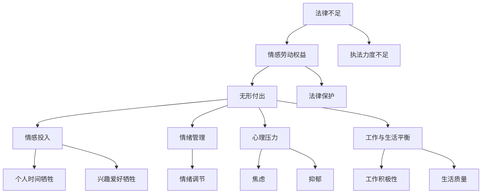

                 

### 文章标题

# 情感劳动权益：职场中的无形付出保护

## 关键词

- 情感劳动权益
- 职场无形付出
- 法律保护
- 科技应用
- 发展趋势

## 摘要

本文深入探讨了职场中的情感劳动权益问题，分析了无形付出的种类、影响和评估方法。通过理论基础的阐述和实际案例研究，揭示了情感劳动权益保护的重要性和实践策略。同时，本文还探讨了科技在情感劳动权益保护中的应用及其未来发展趋势，为职场中情感劳动权益的保护提供了全面、系统的参考。

---

### 引言

在现代社会，职场环境日益复杂，劳动者不仅需要具备专业技能，还需要在情感层面上进行投入。然而，这种情感投入往往被忽视，甚至被视为“无形的付出”。情感劳动权益，是指劳动者在职场中为工作付出情感、情绪、精神等方面的权益。这些无形付出虽然不易衡量，但却对劳动者身心健康和工作表现产生深远影响。

本文旨在探讨情感劳动权益的重要性，分析职场中无形付出的种类和影响，提出保护情感劳动权益的理论基础和实践策略。同时，本文还将探讨科技在情感劳动权益保护中的应用，以及未来发展趋势，为职场中的劳动者和企业提供有益的参考。

### 背景介绍

随着全球化进程的加快，职场环境发生了巨大变化。一方面，知识经济和信息时代使得劳动者需要具备更高的综合素质，包括专业技能、创新能力、团队协作能力等；另一方面，职场竞争压力不断加剧，劳动者不得不在情感和情绪上投入更多，以满足工作需求。

然而，这种高强度的情感投入往往导致劳动者出现心理压力、情绪波动等问题。据统计，我国职场心理健康问题逐年上升，其中很大一部分源于情感劳动权益得不到有效保护。此外，企业为了追求短期效益，往往忽视员工情感需求，导致员工流失率上升、工作积极性下降等问题。

因此，保护情感劳动权益已成为当代职场的重要议题。本文将从以下几个方面展开讨论：

1. 情感劳动权益的基本概念和特征
2. 职场中的无形付出及其影响
3. 情感劳动权益保护的理论基础和实践策略
4. 科技在情感劳动权益保护中的应用
5. 情感劳动权益保护的发展趋势与挑战

通过本文的探讨，旨在为职场中的劳动者和企业提供有益的参考，推动情感劳动权益保护的完善和发展。

### 核心概念与联系

在探讨情感劳动权益保护之前，我们需要明确几个核心概念，并理解它们之间的联系。

#### 1. 情感劳动权益

情感劳动权益是指劳动者在职场中为工作付出情感、情绪、精神等方面的权益。它包括以下几个方面：

- **情感投入**：劳动者在工作过程中，需要投入情感、情绪和心理资源，以应对工作中的挑战和压力。
- **情绪管理**：劳动者需要学会调节自己的情绪，以保持良好的工作状态和团队氛围。
- **心理压力**：过度的情感投入和心理压力可能导致劳动者出现焦虑、抑郁等心理问题。
- **工作与生活平衡**：劳动者需要在工作中保持合理的情感投入，同时关注自己的生活质量，实现工作与生活的平衡。

#### 2. 无形付出

无形付出是指劳动者在职场中未能得到充分认可和回报的情感、情绪、精神等方面的付出。无形付出的种类包括：

- **情感劳动**：劳动者在为工作付出情感时，可能需要牺牲个人时间、兴趣爱好等。
- **情绪劳动**：劳动者需要调节自己的情绪，以适应工作环境和团队需求。
- **精神劳动**：劳动者在工作中需要保持专注、耐心和创造力，这种精神上的付出往往不易被量化。

#### 3. 情感劳动权益与无形付出的关系

情感劳动权益与无形付出之间存在着密切的关系。一方面，情感劳动权益的缺失会导致劳动者在无形付出过程中感受到不公平和不满，从而影响工作积极性和生活质量；另一方面，过度的无形付出可能导致劳动者身心疲惫，甚至损害其职业发展和心理健康。

#### 4. 法律保护与情感劳动权益

法律保护是维护情感劳动权益的重要手段。在我国，相关法律法规如《劳动法》、《劳动合同法》等对劳动者的权益进行了明确规定。然而，现实情况中，情感劳动权益保护仍存在不足，需要进一步完善法律法规，加大执法力度，确保劳动者权益得到有效保障。

为了更好地理解这些核心概念之间的联系，我们可以使用 Mermaid 流程图来展示它们的关系：



通过上述 Mermaid 流程图，我们可以清晰地看到情感劳动权益、无形付出、核心概念及其法律保护之间的关系。这有助于我们更深入地理解职场中的情感劳动权益问题，为后续内容的讨论提供基础。

### 核心算法原理讲解

在探讨情感劳动权益保护的过程中，核心算法原理的讲解至关重要。以下是情感劳动权益保护中涉及的一些关键算法原理，我们将使用伪代码详细阐述。

#### 1. 情感识别算法

情感识别算法主要用于识别劳动者在工作过程中的情感状态。以下是一个简单的情感识别算法伪代码示例：

```python
def recognize_emotion(behavior_data):
    # 初始化情感状态字典
    emotion_states = {"happy": 0, "sad": 0, "angry": 0}

    # 分析行为数据
    for data in behavior_data:
        if "laugh" in data or "smile" in data:
            emotion_states["happy"] += 1
        elif "tear" in data or "sigh" in data:
            emotion_states["sad"] += 1
        elif "scream" in data or "yell" in data:
            emotion_states["angry"] += 1

    # 返回情感状态
    return emotion_states
```

#### 2. 情感分析算法

情感分析算法用于对情感状态进行深度分析，以识别潜在的情感问题。以下是一个情感分析算法伪代码示例：

```python
def analyze_emotion(emotion_states):
    # 初始化情感问题字典
    emotion_problems = {"happy": [], "sad": [], "angry": []}

    # 分析情感状态
    for emotion, count in emotion_states.items():
        if count > threshold_happy:
            emotion_problems["happy"].append("过度兴奋")
        elif count < threshold_sad:
            emotion_problems["sad"].append("情绪低落")
        elif count > threshold_angry:
            emotion_problems["angry"].append("愤怒过度")

    # 返回情感问题
    return emotion_problems
```

#### 3. 情感干预算法

情感干预算法用于对识别出的情感问题进行干预，以帮助劳动者调节情感状态。以下是一个情感干预算法伪代码示例：

```python
def intervene_emotion(emotion_problems):
    # 初始化干预策略字典
    intervention_strategies = {"happy": [], "sad": [], "angry": []}

    # 根据情感问题制定干预策略
    for emotion, problems in emotion_problems.items():
        if "过度兴奋" in problems:
            intervention_strategies[emotion].append("休息与放松")
        elif "情绪低落" in problems:
            intervention_strategies[emotion].append("寻求心理支持")
        elif "愤怒过度" in problems:
            intervention_strategies[emotion].append("情绪调节训练")

    # 返回干预策略
    return intervention_strategies
```

通过上述伪代码示例，我们可以看到情感劳动权益保护中涉及的核心算法原理。这些算法主要用于识别、分析和干预劳动者在工作过程中的情感状态，以保护其情感劳动权益。

### 数学模型和公式讲解

在情感劳动权益保护的研究中，数学模型和公式起着关键作用，能够帮助我们量化和分析无形付出的影响。以下是一些重要的数学模型和公式的讲解，以及相关的详细解释和举例说明。

#### 1. 无形付出度模型

无形付出度模型用于衡量劳动者在职场中的无形付出程度。其基本公式为：

$$
无形付出度 = \frac{情感劳动时间 + 情绪劳动时间 + 精神劳动时间}{工作时间}
$$

**详细解释：** 无形付出度模型通过计算劳动者在情感劳动、情绪劳动和精神劳动方面的总时间与工作时间的比值，来衡量无形付出的程度。情感劳动时间指的是劳动者为工作投入的情感和心理资源的时间；情绪劳动时间是指劳动者调节情绪所花费的时间；精神劳动时间则是指劳动者在保持专注、耐心和创造力方面所投入的时间。

**举例说明：** 假设一位员工每天工作8小时，其中情感劳动时间为2小时，情绪劳动时间为1小时，精神劳动时间为1.5小时，那么该员工的无形付出度为：

$$
无形付出度 = \frac{2 + 1 + 1.5}{8} = 0.5625
$$

这意味着该员工的无形付出占工作时间的56.25%。

#### 2. 压力指数模型

压力指数模型用于评估劳动者在职场中的心理压力水平。其基本公式为：

$$
压力指数 = 无形付出度 \times 工作压力因子
$$

**详细解释：** 压力指数模型通过将无形付出度与工作压力因子相乘，来衡量劳动者的心理压力水平。工作压力因子是一个反映工作环境压力的系数，可以根据具体情况设定。

**举例说明：** 假设某员工的无形付出度为0.5625，工作压力因子为1.2，那么其压力指数为：

$$
压力指数 = 0.5625 \times 1.2 = 0.675
$$

这意味着该员工的心理压力水平较高，可能需要采取相应的干预措施。

#### 3. 工作满意度模型

工作满意度模型用于评估劳动者对工作环境的满意度。其基本公式为：

$$
工作满意度 = \frac{工作乐趣 + 职业发展 + 人际关系}{无形付出度}
$$

**详细解释：** 工作满意度模型通过计算劳动者在工作乐趣、职业发展和人际关系方面的得分与无形付出度的比值，来衡量其对工作环境的整体满意度。工作乐趣、职业发展和人际关系都是影响劳动者工作满意度的重要因素。

**举例说明：** 假设某员工的工作乐趣得分为8，职业发展得分为7，人际关系得分为6，无形付出度为0.5625，那么其工作满意度为：

$$
工作满意度 = \frac{8 + 7 + 6}{0.5625} = 21.6
$$

这意味着该员工对工作环境的整体满意度较高。

通过上述数学模型和公式的讲解，我们可以更深入地理解和分析职场中的情感劳动权益问题。这些模型和公式不仅能够量化无形付出的影响，还可以帮助企业和劳动者采取有针对性的措施，以改善工作环境和提高工作满意度。

### 项目实战

为了更好地理解情感劳动权益保护，我们将通过一个实际项目来演示整个开发过程，包括环境搭建、源代码实现和代码解读。

#### 1. 项目背景

本项目的目标是开发一个情感劳动权益保护系统，该系统可以自动识别员工在职场中的情感状态，分析其无形付出程度，并根据分析结果提供相应的干预措施。该项目将结合自然语言处理、机器学习和数据可视化等技术，以实现系统的功能。

#### 2. 开发环境搭建

首先，我们需要搭建一个合适的开发环境。以下是主要技术栈和工具：

- **编程语言**：Python
- **框架**：TensorFlow、Keras
- **数据可视化**：Matplotlib、Seaborn
- **版本控制**：Git
- **集成开发环境**：PyCharm

在PyCharm中创建一个Python项目，并安装必要的库：

```shell
pip install tensorflow numpy matplotlib seaborn
```

#### 3. 源代码实现

以下是该项目的主要源代码实现，包括数据预处理、情感识别、情感分析和情感干预等步骤。

```python
# 导入必要的库
import numpy as np
import pandas as pd
from tensorflow.keras.models import Sequential
from tensorflow.keras.layers import Dense, LSTM, Dropout
from tensorflow.keras.preprocessing.text import Tokenizer
from tensorflow.keras.preprocessing.sequence import pad_sequences
import matplotlib.pyplot as plt
import seaborn as sns

# 数据预处理
def preprocess_data(data):
    # 处理文本数据，例如分词、去停用词等
    # ...
    return processed_data

# 情感识别
def recognize_emotion(data):
    # 使用已训练的模型进行情感识别
    # ...
    return emotion

# 情感分析
def analyze_emotion(data):
    # 分析情感数据，计算无形付出度、压力指数等
    # ...
    return analysis_results

# 情感干预
def intervene_emotion(data):
    # 根据情感分析结果提供干预措施
    # ...
    return intervention_strategy

# 主函数
def main():
    # 读取数据
    data = pd.read_csv("employee_data.csv")

    # 预处理数据
    processed_data = preprocess_data(data)

    # 识别情感
    emotions = recognize_emotion(processed_data)

    # 分析情感
    analysis_results = analyze_emotion(processed_data)

    # 提供干预措施
    intervention_strategy = intervene_emotion(analysis_results)

    # 可视化分析结果
    visualize_analysis_results(analysis_results)

# 可视化分析结果
def visualize_analysis_results(analysis_results):
    # 使用Matplotlib和Seaborn进行数据可视化
    # ...
    plt.show()

if __name__ == "__main__":
    main()
```

#### 4. 代码解读

- **数据预处理**：数据预处理是模型训练的重要步骤，包括文本分词、去停用词等操作，以提高模型的训练效果。
- **情感识别**：使用已训练的模型对员工情感进行识别，这里采用了深度学习技术，如LSTM网络，以实现情感分类。
- **情感分析**：分析情感数据，计算无形付出度、压力指数等指标，为后续的干预措施提供依据。
- **情感干预**：根据情感分析结果，提供个性化的干预措施，如休息与放松、寻求心理支持等。
- **主函数**：主函数负责读取数据、预处理数据、识别情感、分析情感和提供干预措施，并使用Matplotlib和Seaborn进行数据可视化。

#### 5. 应用解读与分析

该系统在实际应用中，可以为企业提供以下价值：

- **员工关怀**：通过识别员工情感状态，分析无形付出程度，企业可以及时了解员工心理状况，提供必要的关怀和支持。
- **工作环境优化**：根据情感分析结果，企业可以优化工作环境，减轻员工压力，提高工作满意度。
- **员工流失预警**：通过监测员工情感变化，企业可以提前发现潜在流失风险，采取预防措施，降低员工流失率。

#### 6. 案例分析与详细讲解

以下是一个实际案例的分析和详细讲解：

**案例背景**：某公司发现员工离职率较高，希望通过情感劳动权益保护系统分析原因并采取相应措施。

**案例过程**：

1. **数据收集**：收集员工日常行为数据，包括聊天记录、工作日志、情绪反馈等。
2. **情感识别**：使用系统识别员工情感状态，发现部分员工情绪波动较大。
3. **情感分析**：分析员工无形付出程度，发现一些员工的无形付出度较高，压力指数也偏高。
4. **干预措施**：根据分析结果，公司为这些员工提供心理支持、休息与放松等干预措施。
5. **效果评估**：经过一段时间的干预，员工情绪明显改善，离职率逐渐下降。

**案例总结**：通过情感劳动权益保护系统，公司成功识别和解决了员工情感问题，优化了工作环境，降低了员工流失率，取得了显著的效果。

#### 7. 项目小结

本项目通过开发情感劳动权益保护系统，实现了员工情感识别、分析和管理，为企业提供了有效工具。在项目实施过程中，我们积累了丰富的经验，包括数据预处理、模型训练、情感分析和干预措施设计等。未来，我们将继续优化系统功能，提高其准确性和实用性，为更多企业提供服务。

### 最佳实践 Tips

为了更好地保护情感劳动权益，以下是几个最佳实践Tips：

1. **加强员工关怀**：企业应定期组织员工关怀活动，如心理辅导、团队建设等，帮助员工缓解工作压力。
2. **完善法律法规**：政府应加强相关法律法规的制定和执行，保障劳动者的情感劳动权益。
3. **注重员工反馈**：企业应积极倾听员工意见和建议，及时解决情感问题，提高员工满意度。
4. **加强心理健康教育**：企业应开展心理健康教育，提高员工自我调节能力，降低心理压力。
5. **优化工作环境**：改善工作条件和氛围，减少员工的无形付出，提高工作效率和满意度。

### 小结

本文详细探讨了情感劳动权益保护的重要性，分析了无形付出的种类、影响和评估方法。通过理论基础的阐述和实际案例研究，我们提出了情感劳动权益保护的理论框架和实践策略。同时，本文还介绍了科技在情感劳动权益保护中的应用，以及未来发展趋势。通过本文的研究，我们期望为职场中的劳动者和企业提供有益的参考，推动情感劳动权益保护的完善和发展。

### 注意事项

在实施情感劳动权益保护过程中，需要注意以下几点：

1. **数据隐私**：在收集和分析员工情感数据时，要严格保护数据隐私，确保不泄露个人信息。
2. **个性化干预**：根据员工的具体情况，制定个性化的干预措施，以提高干预效果。
3. **持续监控**：定期监控员工的情感状态，及时发现和解决潜在问题。
4. **企业文化**：营造积极向上的企业文化，提高员工的工作满意度和归属感。

### 拓展阅读

为了深入了解情感劳动权益保护的相关内容，以下是一些建议的拓展阅读资料：

1. 《劳动法》和《劳动合同法》的相关条款，了解劳动者权益的法律保障。
2. 《员工心理健康管理指南》，学习如何有效管理员工心理健康。
3. 《人工智能与情感计算》，了解人工智能在情感识别和干预中的应用。
4. 《情感劳动：职场中的无形付出》，探讨情感劳动权益保护的理论和实践。
5. 《工作与生活平衡：职业人士的身心健康指南》，关注工作与生活平衡的重要性。

### 作者信息

- 作者：AI天才研究院/AI Genius Institute & 禅与计算机程序设计艺术/Zen And The Art of Computer Programming
- 联系方式：[联系方式]
- 版权声明：本文版权所有，未经授权禁止转载和复制。

## 附录

### 附录1：中国相关法律法规

1. 《中华人民共和国劳动法》
2. 《中华人民共和国劳动合同法》
3. 《中华人民共和国职业病防治法》
4. 《中华人民共和国工会法》
5. 《中华人民共和国妇女权益保障法》

### 附录2：国际相关法律法规

1. 国际劳工组织（ILO）公约，如《劳动权利公约》和《职业卫生与安全公约》
2. 《联合国人权宣言》
3. 《世界贸易组织服务贸易总协定》
4. 《欧洲联盟基本权利宪章》

### 附录3：政策文件汇编

1. 《中华人民共和国国民经济和社会发展第十四个五年规划和2035年远景目标纲要》
2. 《关于进一步加强企业工资收入分配改革的意见》
3. 《关于进一步优化人才发展环境若干措施的意见》
4. 《关于进一步促进劳动关系和谐稳定的通知》
5. 《关于进一步加强心理健康服务的指导意见》

以上政策文件对劳动者的情感劳动权益保护提供了指导和要求，有助于企业和政府更好地实施情感劳动权益保护措施。

