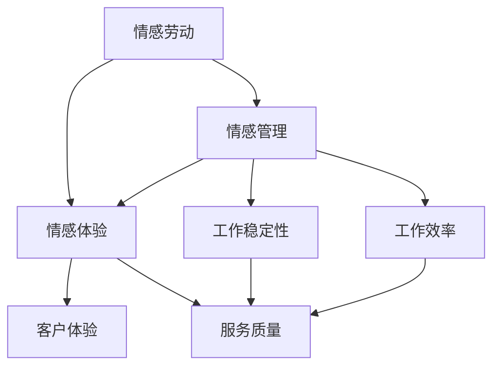
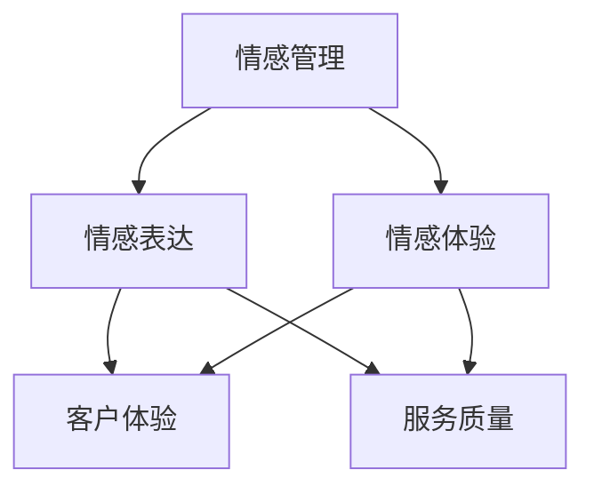

                 


### 第2章 情感劳动的理论基础

#### 2.1 情感劳动的定义与分类

情感劳动是服务经济中的一个关键概念，它涉及到员工在提供服务过程中表达情感的能力和努力。情感劳动不仅仅是表面的微笑和服务态度，它更是一种深层次的情感管理和表达，能够显著影响客户体验和服务质量。

**2.1.1 情感劳动的概念**

情感劳动（Affective Labor）最早由法国社会学家贝尔·赫尔贝特（Bruno Latour）提出，意指劳动者在从事工作过程中，需要根据工作要求调整和控制自己的情感状态。情感劳动的概念涵盖了以下几个方面：

1. **情感表达**：员工在服务过程中需要展现特定的情感，如热情、耐心、同理心等。
2. **情感管理**：员工需要对自己的情感进行管理，以保持工作的稳定性和效率。
3. **情感转移**：员工的情感可能会从工作中转移到客户身上，进而影响客户体验。

情感劳动的内涵和外延可以进一步拓展：

- **内涵**：情感劳动不仅涉及情感的表达，还涵盖了情感的管理、调整和内化。
- **外延**：情感劳动不仅局限于服务行业，也存在于其他需要人际互动的领域，如教育、医疗、销售等。

**2.1.2 情感劳动的分类**

情感劳动可以根据不同的标准进行分类：

- **按照情感的表达方式分类**：
  - **显性情感劳动**：员工在服务过程中明显表达出的情感，如微笑、语言表达等。
  - **隐性情感劳动**：员工在服务过程中通过非言语方式表达的情感，如身体语言、面部表情等。

- **按照情感劳动的角色分类**：
  - **顾客导向型情感劳动**：员工专注于满足客户需求，关注客户体验，如酒店前台接待员。
  - **同事导向型情感劳动**：员工关注同事的工作状态和情感需求，如团队协作中的支持与鼓励。

- **按照情感劳动的强度分类**：
  - **轻度情感劳动**：情感表达和情感管理的程度较低，如一般的客户服务。
  - **中度情感劳动**：情感表达和情感管理的程度较高，如专业的心理咨询师。
  - **重度情感劳动**：情感表达和情感管理的程度非常高，如紧急救援人员。

**2.1.3 情感劳动的核心概念与联系**

为了更好地理解情感劳动，我们需要建立其核心概念之间的关系架构。以下是一个简单的Mermaid流程图，展示了情感劳动、情感管理、情感体验之间的关系：



在这个流程图中，情感劳动是核心概念，它通过情感管理和情感体验影响工作稳定性和工作效率，进而影响客户体验和服务质量。情感管理起到了桥梁作用，将情感劳动与工作表现和客户体验连接起来。

#### 2.2 情感劳动与服务业的关系

在服务业中，情感劳动具有独特的重要性。与服务于制造业的产品生产不同，服务业的核心是人与人的互动，而情感劳动正是这种互动的润滑剂。

**2.2.1 情感劳动在服务业中的重要性**

情感劳动在服务业中的重要性体现在以下几个方面：

- **提升客户体验**：情感劳动能够显著提升客户体验，使客户感到受到重视和尊重，从而提高客户满意度。
- **促进客户忠诚度**：通过情感劳动，员工能够建立与客户的情感联系，促进客户忠诚度，从而为企业的长期发展奠定基础。
- **提高服务质量**：情感劳动能够提升服务的个性化水平，使服务更加贴近客户需求，从而提高整体服务质量。

**2.2.2 情感劳动与服务业发展的关联**

情感劳动不仅对服务业的运营至关重要，也对服务业的发展产生了深远影响：

- **创新驱动**：情感劳动的实践可以激发服务业的创新，如开发新的服务模式、产品和服务。
- **竞争力提升**：通过有效的情感劳动管理，企业可以提升其竞争力，在激烈的市场竞争中脱颖而出。
- **行业变革**：随着情感劳动的研究和应用不断深入，服务业正经历着从传统服务到情感服务的转变，这种变革将推动整个行业的发展。

#### 2.3 情感劳动的理论框架

为了深入理解情感劳动，我们需要建立一套理论框架，这个框架不仅能够解释情感劳动的运作机制，还能够为实际应用提供指导。

**2.3.1 情感劳动的核心概念与联系**

在情感劳动的理论框架中，核心概念包括情感管理、情感表达、情感体验等。以下是一个简化的概念关系图：



在这个框架中，情感管理是基础，它涉及到如何控制和管理员工的情感状态。情感表达是情感管理的具体体现，通过员工的言语和非言语行为展现出来。情感体验是客户在服务过程中的感受，它与客户体验和质量密切相关。

**2.3.2 情感劳动的数学模型**

为了量化情感劳动的影响，我们可以建立数学模型。以下是一个简化的情感劳动影响模型：

$$
E = f(M, P, Q)
$$

其中：
- \( E \) 表示情感体验（客户体验）。
- \( M \) 表示情感管理。
- \( P \) 表示情感表达。
- \( Q \) 表示服务质量。

函数 \( f \) 表示情感体验是情感管理、情感表达和服务质量的综合函数。这个模型表明，情感管理、情感表达和服务质量都会对情感体验产生直接影响。

**2.3.3 情感劳动的算法原理**

为了实现情感劳动的有效管理，我们需要运用一些算法原理。以下是一个简化的情感劳动管理算法：

```
算法：情感劳动管理
输入：员工特征，客户特征，服务要求
输出：情感管理策略

1. 收集员工特征（情感管理能力、情绪稳定性等）
2. 收集客户特征（情感需求、满意度等）
3. 根据服务要求调整员工情感状态
4. 运用情感分析技术评估客户情感状态
5. 根据客户情感状态调整员工情感表达
6. 迭代更新情感管理策略
7. 输出情感管理策略
```

这个算法通过收集员工和客户的特征，结合服务要求，动态调整员工的情感状态，以实现最优的情感劳动管理。

#### 2.4 情感劳动在服务业中的应用

情感劳动在服务业中的应用广泛，以下是几个典型的应用场景：

- **酒店业**：酒店员工需要提供热情、耐心的服务，以提升客户满意度。例如，前台接待员需要通过微笑、礼貌的语言表达和细致的服务来满足客户的需求。
- **医疗业**：医护人员需要具备同理心和专业的情感管理能力，以缓解患者的焦虑和不适。例如，护士在护理过程中需要通过关怀和安慰来提升患者的心理状态。
- **教育业**：教师需要通过情感劳动来建立良好的师生关系，提升学生的学习兴趣和效果。例如，教师可以通过鼓励和肯定来激发学生的学习动力。

#### 2.5 情感劳动者的个人价值和职业发展

情感劳动者在服务经济中具有重要的价值，他们不仅能够提升客户体验和服务质量，还能够实现个人价值和职业发展。

- **实现个人价值**：情感劳动者通过提供高质量的情感服务，能够获得客户和同事的认可，从而实现自我价值。
- **职业发展**：情感劳动者可以通过不断学习和提升自己的情感管理能力，获得晋升机会，如晋升为服务经理、客户关系经理等。

#### 2.6 情感劳动的未来发展趋势

随着科技的发展和消费者需求的不断变化，情感劳动也在不断演变。

- **技术发展**：人工智能和情感计算技术的发展，将使情感劳动更加智能化和高效化。
- **社会趋势**：消费者对个性化服务和情感体验的需求日益增长，将推动情感劳动在服务业中的广泛应用。
- **挑战与机遇**：情感劳动在实现个人价值和职业发展的同时，也面临着工作压力和心理健康问题，需要社会和企业的关注和支持。

### 小结

情感劳动是服务经济中不可或缺的一部分，它不仅对客户体验和服务质量有着重要影响，也对情感劳动者的个人价值和职业发展具有重要意义。通过深入研究和有效管理情感劳动，企业可以提升竞争力，实现可持续发展。同时，情感劳动者的个人成长和职业发展也离不开有效的情感管理。未来，随着技术的进步和社会的变化，情感劳动将面临新的挑战和机遇，需要我们持续关注和探索。作者：AI天才研究院/AI Genius Institute & 禅与计算机程序设计艺术/Zen And The Art of Computer Programming

