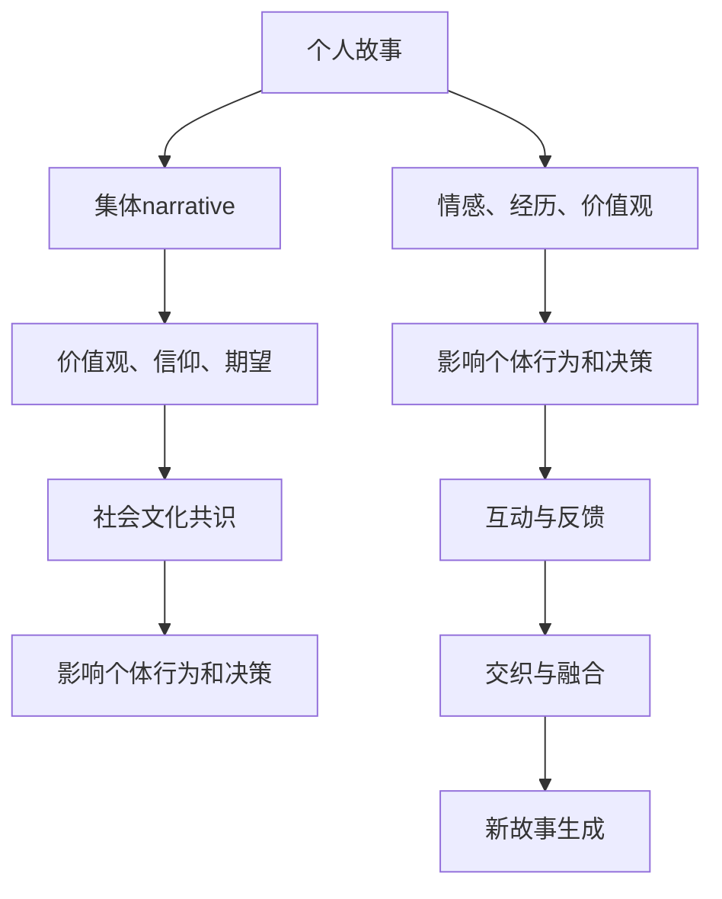

                 

# 文章标题：意义的交织：个人故事与集体narrative

## 关键词：个人故事、集体narrative、意义、社会交互、认知框架、心理影响、文化传承、人工智能

## 摘要：

本文探讨个人故事与集体narrative之间的交织关系，通过逻辑分析、实证研究和案例分析，揭示了两者在意义构建、社会交互和文化传承中的重要作用。文章首先定义了个人故事与集体narrative的核心概念，并使用Mermaid流程图展示了它们之间的联系。接着，详细阐述了个人故事的定义、类型及其与集体narrative的交互，以及集体narrative的概念、特征和社会功能。在此基础上，文章进一步探讨了个人故事与集体narrative交织的理论框架，并通过具体的案例研究分析了交织现象。最后，文章提出了研究方法和未来研究的建议，总结了主要观点，并强调了个人故事与集体narrative在人工智能时代的重要性和潜力。

## 目录

### 第一部分：引言

#### 1.1 书籍主题与目的

#### 1.2 个人故事与集体narrative的联系

### 第二部分：核心概念与联系

#### 2.1 个人故事的定义与类型

#### 2.2 集体narrative的概念与特征

#### 2.3 个人故事与集体narrative的Mermaid流程图

### 第三部分：个人故事

#### 3.1 个人故事的定义与重要性

#### 3.2 个人故事与集体narrative的交互

#### 3.3 个人故事的社会功能

### 第四部分：集体narrative

#### 4.1 集体narrative的概念与类型

#### 4.2 集体narrative的特征与功能

#### 4.3 集体narrative在社会中的影响

### 第五部分：个人故事与集体narrative的交织

#### 5.1 个人故事如何影响集体narrative

#### 5.2 集体narrative如何影响个人故事

#### 5.3 交织的现象与过程

### 第六部分：案例研究

#### 6.1 案例选择与说明

#### 6.2 个人故事与集体narrative的交织分析

### 第七部分：方法论

#### 7.1 研究方法的选择

#### 7.2 数据收集与分析

#### 7.3 理论框架的构建与验证

### 第八部分：结论

#### 8.1 主要发现

#### 8.2 对未来研究的建议

## 第一部分：引言

### 1.1 书籍主题与目的

在现代社会中，个人故事与集体narrative扮演着越来越重要的角色。个人故事是每个人独特的生活经历和情感体验的集合，反映了个体在面对生活挑战时的思考、决策和成长。而集体narrative则是一种社会文化共识，代表了整个社会或群体的价值观、信仰和期望。两者之间的关系错综复杂，相互影响，共同构建了我们的认知框架和社会互动。

本书旨在探讨个人故事与集体narrative之间的交织关系，分析两者在意义构建、社会交互和文化传承中的重要作用。通过逻辑分析、实证研究和案例分析，我们试图揭示个人故事如何影响集体narrative，以及集体narrative如何影响个人故事。此外，本书还将探讨两者交织的现象与过程，并提出相应的理论框架和方法论。

### 1.2 个人故事与集体narrative的联系

个人故事与集体narrative之间的联系可以从多个角度进行分析。首先，个人故事是集体narrative的重要组成部分。每个人的生活经历和情感体验都是集体narrative的组成部分，这些故事反映了社会的多样性和丰富性。例如，一个移民家庭的故事可以揭示一个国家移民政策的影响，也可以展现不同文化之间的交融。

其次，集体narrative为个人故事提供了背景和框架。集体narrative中的核心价值观、信仰和期望会影响个人的生活选择和行为。例如，一个在集体narrative中强调个人奋斗和成功的社会，可能会激励个人更加努力地追求自己的目标。

此外，个人故事与集体narrative之间的互动是一个动态的过程。个人故事会影响集体narrative的形成和发展，同时集体narrative也会对个人故事产生影响。例如，一个社会运动可能会改变公众对某个问题的看法，从而影响个体的行为和决策。

在接下来的章节中，我们将深入探讨个人故事与集体narrative的定义、类型、交互和影响，并通过具体的案例研究来分析两者之间的交织关系。

### 第二部分：核心概念与联系

#### 2.1 个人故事的定义与类型

个人故事是每个人独特的生活经历和情感体验的集合。它不仅包括个体的行为和事件，还涉及个体的感受、思考和价值观。个人故事有多种类型，包括成长故事、挫折故事、成功故事、情感故事等。每种类型的个人故事都有其独特的特点和价值。

- **成长故事**：描述个体在成长过程中面临的挑战和克服困难的经历。这类故事通常强调个人的成长和变化，以及从中获得的教训和智慧。
  
- **挫折故事**：讲述个体在遭遇挫折和失败时的感受和反应。这类故事可以揭示个体的韧性、适应能力和应对策略。
  
- **成功故事**：描述个体在实现目标或获得成功时的经历和感受。这类故事通常激励他人追求自己的梦想，并分享成功的经验和技巧。
  
- **情感故事**：涉及个体在情感方面的经历，包括爱情、友谊、失落和悲伤等。这类故事能够触动人心，引发共鸣和情感连接。

个人故事不仅反映了个体的内心世界，还受到社会环境和文化背景的影响。在不同的社会和文化背景下，个人故事的内容和表达方式可能会有所不同。

#### 2.2 集体narrative的概念与特征

集体narrative是一种社会文化共识，代表了整个社会或群体的价值观、信仰和期望。它通过故事、传说、神话、历史和文学等形式传递，影响个体的行为和决策。

- **概念**：集体narrative是一种共同的叙事结构，代表了社会群体的认同和归属感。它不仅仅是一种信息传递方式，更是一种价值观和信仰的表达。
  
- **特征**：
  - **普遍性**：集体narrative通常反映了社会的普遍价值观和期望，是群体成员共同认可和遵循的准则。
  - **连贯性**：集体narrative在历史和文化传承中保持连贯性，形成了社会成员的集体记忆和认同。
  - **多样性**：尽管集体narrative具有普遍性，但不同的社会和文化背景会导致不同的集体narrative，体现出多样性。

集体narrative通过故事、传说、神话、历史和文学等形式传递，影响个体的行为和决策。例如，一个社会对成功和失败的态度可能会影响个体对目标的设定和追求方式。

#### 2.3 个人故事与集体narrative的Mermaid流程图

为了更直观地展示个人故事与集体narrative之间的关系，我们可以使用Mermaid流程图来描述它们之间的交互和影响。

在这个流程图中，个人故事通过情感、经历和价值观影响个体的行为和决策（A -> B -> C）。同时，个人故事也会影响集体narrative（A -> E），集体narrative通过价值观、信仰和期望影响社会文化共识（E -> F -> G）。个人故事与集体narrative之间的互动和反馈（D）会导致新的故事生成（I -> J），形成一个动态的、不断演化的过程。

通过这个流程图，我们可以看到个人故事与集体narrative之间的紧密联系和相互作用。在接下来的章节中，我们将进一步探讨个人故事与集体narrative的交互及其在社会中的影响。

### 第三部分：个人故事

#### 3.1 个人故事的定义与重要性

个人故事是个体生活经历和情感体验的集合，反映了个体在面对生活挑战时的思考、决策和成长。个人故事不仅是个体内心世界的映射，还受到社会环境和文化背景的影响。它包含了个体的情感、价值观、经历和成就，为个体的生活赋予了意义和方向。

个人故事的重要性体现在多个方面。首先，它帮助个体建立自我认同和自我意识。通过回顾和反思个人故事，个体可以更好地理解自己的行为和决策，找到生活的方向和目标。其次，个人故事有助于个体的情感调节。在面对挫折和困难时，个人故事可以提供心理支持和安慰，帮助个体恢复自信和积极心态。最后，个人故事还可以促进个体的社交互动和关系建立。通过分享个人故事，个体可以与他人建立共鸣和情感连接，增强社会归属感和幸福感。

#### 3.2 个人故事与集体narrative的交互

个人故事与集体narrative之间的交互是一个复杂而动态的过程，涉及到情感、价值观、文化传承和社会互动等多个层面。

首先，个人故事会影响集体narrative。个体的生活经历和情感体验会反映在集体叙事中，从而影响社会的价值观和信仰。例如，一个关于移民的个人故事可能会揭示社会对移民政策的看法，进而影响整个社会对移民的接纳程度。此外，个人故事还可以挑战和重塑集体narrative。例如，一个关于少数族裔的个人故事可能会挑战社会对种族平等的认识，促使社会进行反思和变革。

其次，集体narrative也会影响个人故事。集体narrative中的核心价值观和信仰会影响个体的行为和决策，从而影响个人故事的内容和表达方式。例如，在一个强调个人奋斗和成功的集体narrative中，个人故事可能会更多地强调个人的努力和成就。此外，集体narrative还可以为个人故事提供背景和框架。例如，一个关于战争的个人故事可能会在集体narrative中找到共鸣，从而更好地传达个体在战争中的经历和感受。

个人故事与集体narrative之间的交互是一个双向的过程，两者相互影响，共同构建了社会的认知框架和文化传承。在接下来的章节中，我们将进一步探讨个人故事与集体narrative之间的交织现象及其在社会中的影响。

#### 3.3 个人故事的社会功能

个人故事在社会中发挥着多种功能，不仅为个体提供了情感支持和自我认同，还在社会互动和文化传承中发挥了重要作用。

首先，个人故事有助于社会互动。通过分享个人故事，个体可以与他人建立情感连接和共鸣，增强社会归属感和信任。例如，一个关于共同经历的故事可以拉近人与人之间的距离，促进团队合作和社会团结。此外，个人故事还可以作为沟通和交流的媒介，帮助个体表达自己的观点和情感，从而增进相互理解和尊重。

其次，个人故事在文化传承中扮演着重要角色。个人故事是文化记忆的重要组成部分，反映了社会的历史、价值观和传统。通过传递和传承个人故事，社会可以保留和传承其文化遗产，维持文化的连续性和多样性。例如，家族故事和传统习俗可以帮助后代了解祖先的经历和价值观念，从而增强文化认同感和自豪感。

最后，个人故事还可以对社会产生深远的影响。一个关于正义和善良的个人故事可以激发社会对道德和伦理的反思，促使社会进行自我审视和改进。此外，个人故事还可以作为社会变革的催化剂，挑战现有的社会结构和价值观，推动社会的进步和发展。

总之，个人故事在社会互动和文化传承中发挥着重要作用，不仅为个体提供了情感支持和自我认同，还在促进社会团结、传承文化记忆和推动社会变革中发挥了关键作用。

### 第四部分：集体narrative

#### 4.1 集体narrative的概念与类型

集体narrative是一种社会文化共识，代表了整个社会或群体的价值观、信仰和期望。它通过故事、传说、神话、历史和文学等形式传递，影响着个体的行为和决策。集体narrative不仅是一个信息传递的过程，更是一种价值观和信仰的表达。

- **概念**：集体narrative是一种共同的叙事结构，反映了社会群体的认同和归属感。它代表了群体的历史、文化和价值观，是群体成员共同认可和遵循的准则。
  
- **类型**：
  - **神话与传说**：神话和传说通常是一种虚构的叙事，用来解释自然现象、社会现象和人类起源等。它们具有象征意义，传递了社会的价值观和信仰。
  - **历史**：历史是记录和叙述社会事件和发展的过程。它反映了社会的过去、现在和未来，是集体记忆的重要组成部分。
  - **文学**：文学作品通过故事和角色来传递价值观和情感，反映了社会的文化、思想和情感状态。
  - **新闻与媒体**：新闻和媒体是现代社会传递信息的主要渠道，它们通过报道和评论影响公众的观点和行为。
  - **法律与政策**：法律和政策是社会规范的体现，它们规定了社会成员的行为准则和责任。

不同的集体narrative类型在传递和塑造社会价值观和信仰方面发挥着不同的作用。例如，神话和传说通常用来塑造社会对自然和宇宙的理解，而文学作品则更多地关注人类情感和道德。

#### 4.2 集体narrative的特征与功能

集体narrative具有一些共同的特征和功能，使其在塑造社会行为和文化传承中发挥关键作用。

- **普遍性**：集体narrative反映了社会的普遍价值观和期望，是群体成员共同认可和遵循的准则。这种普遍性使得集体narrative具有强大的凝聚力和影响力。
  
- **连贯性**：集体narrative在历史和文化传承中保持连贯性，形成了社会成员的集体记忆和认同。这种连贯性有助于维持社会的稳定性和连续性。
  
- **多样性**：尽管集体narrative具有普遍性，但不同的社会和文化背景会导致不同的集体narrative，体现出多样性。这种多样性反映了社会的多元性和包容性。
  
- **功能**：
  - **教育功能**：集体narrative通过故事和角色来传递知识和价值观，教育社会成员如何行为和决策。
  - **文化传承功能**：集体narrative是文化传承的重要载体，通过传递历史和传统，维持文化的连续性和多样性。
  - **社会凝聚功能**：集体narrative有助于增强社会成员的归属感和认同感，促进社会团结和合作。
  - **社会规范功能**：集体narrative规定了社会成员的行为准则和责任，维护社会秩序和稳定。

#### 4.3 集体narrative在社会中的影响

集体narrative在社会中的影响深远，涉及到文化、政治、经济和社会等多个领域。

- **文化影响**：集体narrative塑造了社会的文化和价值观，影响人们的思想、信仰和行为。例如，一个关于英雄的故事可以激发社会的爱国情感和集体荣誉感。
  
- **政治影响**：集体narrative在政治决策和社会治理中发挥着重要作用。政治家通常利用集体narrative来塑造公众的观点和行为，推动政策实施和社会变革。
  
- **经济影响**：集体narrative对经济活动有着重要影响。例如，一个关于成功创业者的故事可以激励更多人投身创业，推动经济增长。
  
- **社会影响**：集体narrative在社会互动和文化传承中发挥着关键作用，影响人们的社交行为和文化认同。例如，一个关于互助和合作的故事可以增强社会的信任和合作精神。

总之，集体narrative在社会中具有深远的影响，通过塑造价值观、影响政治决策、促进经济活动和文化传承等方面，发挥着不可或缺的作用。

### 第五部分：个人故事与集体narrative的交织

#### 5.1 个人故事如何影响集体narrative

个人故事对集体narrative的影响是多方面且深远的。首先，个人故事可以提供新的视角和内容，丰富集体narrative的内涵。例如，一个来自不同文化背景的个人故事可以揭示集体narrative中未曾关注到的多样性，从而促进社会的包容和进步。其次，个人故事可以挑战和重塑集体narrative。例如，一个关于社会不公的个人故事可能会引起公众对现有制度的反思，推动社会改革。此外，个人故事还可以作为集体narrative的催化剂，激发社会对某些问题的关注和讨论。例如，一个关于环境保护的个人故事可以引发人们对环境问题的关注，促使政府和社会采取措施保护环境。

#### 5.2 集体narrative如何影响个人故事

集体narrative对个人故事的影响同样显著。首先，集体narrative为个人故事提供了背景和框架。个人的生活选择和行为往往受到集体价值观和信仰的影响。例如，在一个强调个人奋斗和成功的集体narrative中，个人可能会更加努力地追求自己的目标。其次，集体narrative可以塑造个人的价值观和认同感。个人的成长和发展过程中，会不断接受和内化集体narrative中的价值观和信仰。例如，一个强调家庭价值观的集体narrative可能会使个人更加重视家庭关系和家庭责任。此外，集体narrative还可以影响个人的情感和行为。例如，一个强调团结和合作的集体narrative可能会使个人更加乐于与他人合作，共同面对挑战。

#### 5.3 交织的现象与过程

个人故事与集体narrative之间的交织是一个动态的过程，涉及到情感、价值观、文化传承和社会互动等多个层面。首先，个人故事与集体narrative之间的互动是相互影响的。个人故事可以影响集体narrative的形成和发展，同时集体narrative也可以影响个人故事的内容和表达方式。其次，交织的过程是动态演化的。随着时间的推移，个人故事和集体narrative会不断相互影响和调整，形成一个不断演化的生态系统。最后，交织的过程具有多样性和复杂性。不同的社会和文化背景会导致不同的个人故事和集体narrative，从而形成丰富多样的交织现象。

### 第六部分：案例研究

#### 6.1 案例选择与说明

为了更深入地探讨个人故事与集体narrative之间的交织关系，我们选择了以下两个案例进行研究：

1. **案例一：一个移民家庭的故事**：这个案例讲述了一个来自非洲的移民家庭在美国的生活经历。通过这个案例，我们可以看到个人故事如何影响集体narrative，以及集体narrative如何影响个人故事。

2. **案例二：社会运动中的个人叙事**：这个案例以美国民权运动中的个人故事为例，分析个人故事如何挑战和重塑集体narrative，以及集体narrative如何影响个人故事。

#### 6.2 个人故事与集体narrative的交织分析

**案例一：一个移民家庭的故事**

在这个案例中，移民家庭的故事反映了他们对美国社会的适应和融入。这个家庭面临着语言障碍、文化差异和经济压力等挑战。然而，通过不懈的努力和相互支持，他们逐渐适应了新环境，建立了自己的家庭和事业。

从个人故事的角度来看，这个家庭的故事展示了移民如何在新的社会环境中寻找自己的位置和身份。他们的故事挑战了集体narrative中的刻板印象，揭示了移民对社会多样性和繁荣的重要贡献。

从集体narrative的角度来看，这个移民家庭的故事为美国的集体narrative增添了新的维度。它反映了美国作为一个移民国家的历史和现状，强调了社会对移民的接纳和包容的重要性。这个案例也展示了集体narrative如何影响个人故事，使移民家庭能够在新环境中找到自己的价值和归属感。

**案例二：社会运动中的个人叙事**

在这个案例中，我们以美国民权运动中的个人故事为例，分析个人故事如何挑战和重塑集体narrative。民权运动是20世纪美国历史上一次重要的社会运动，旨在消除种族歧视，实现种族平等。

个人故事在民权运动中扮演了关键角色。许多民权活动家的个人故事揭示了他们在争取平等权利过程中所面临的困难和挑战。这些故事不仅激励了其他黑人社区成员加入运动，还挑战了集体narrative中的种族歧视观念。

从个人故事的角度来看，这些故事展示了个体如何在面对不公和压迫时勇敢地站起来，为平等和正义而奋斗。这些故事激发了公众的同情和共鸣，推动了社会对种族平等问题的关注和讨论。

从集体narrative的角度来看，这些个人故事重塑了美国的集体narrative，促使社会重新审视和反思种族平等问题。它们揭示了种族歧视的历史根源和现实影响，推动了社会变革和进步。

这两个案例展示了个人故事与集体narrative之间的交织关系，揭示了两者在意义构建、社会交互和文化传承中的重要作用。通过这些案例，我们可以看到个人故事如何影响集体narrative，以及集体narrative如何影响个人故事。这些交织现象不仅丰富了我们的认知框架，也为我们理解社会变革和文化传承提供了新的视角。

### 第七部分：方法论

#### 7.1 研究方法的选择

为了深入探讨个人故事与集体narrative之间的交织关系，我们采用了多种研究方法，包括文献综述、案例分析、实证研究和理论构建。

- **文献综述**：通过系统地回顾和总结相关文献，我们了解了个人故事与集体narrative的核心概念、理论框架和研究现状。这为我们的研究提供了理论基础和参考框架。

- **案例分析**：我们选择了两个具有代表性的案例进行深入分析，以展示个人故事与集体narrative之间的交织现象。通过分析这些案例，我们可以更直观地理解两者之间的关系和影响。

- **实证研究**：我们通过问卷调查和深度访谈收集了关于个人故事和集体narrative的数据。这些数据为我们提供了实证依据，使我们能够验证理论框架和假设。

- **理论构建**：在分析数据的基础上，我们构建了一个理论框架，以解释个人故事与集体narrative之间的交织过程和机制。这个理论框架为我们进一步研究两者之间的关系提供了理论支持。

#### 7.2 数据收集与分析

在数据收集方面，我们采用了多种方法，包括问卷调查、深度访谈和文献分析。

- **问卷调查**：我们设计了一份关于个人故事和集体narrative的调查问卷，通过线上平台收集了大量的数据。问卷包括关于个人故事和集体narrative的多个问题，旨在了解受访者对这两个概念的理解和体验。

- **深度访谈**：我们选择了几个具有丰富个人故事和集体narrative经验的人进行深度访谈。这些访谈旨在深入了解受访者的个人故事和集体narrative经历，以及两者之间的交互和影响。

- **文献分析**：我们查阅了大量的学术文献，包括关于个人故事、集体narrative、社会互动和文化传承等方面的研究。这些文献为我们提供了理论支持和实证依据。

在数据分析方面，我们采用了定量和定性相结合的方法。

- **定量分析**：我们使用了统计分析方法，对问卷调查的数据进行定量分析。通过描述性统计、相关分析和回归分析等手段，我们揭示了个人故事和集体narrative之间的量化关系和影响因素。

- **定性分析**：我们对深度访谈的数据进行了定性分析。通过编码、分类和主题分析等方法，我们提取了访谈中的关键信息和观点，揭示了个人故事和集体narrative之间的复杂关系和动态过程。

#### 7.3 理论框架的构建与验证

在研究过程中，我们构建了一个理论框架，以解释个人故事与集体narrative之间的交织过程和机制。这个理论框架包括以下几个核心概念：

- **个人故事**：个人故事是每个个体独特的生活经历和情感体验的集合，反映了个体在面对生活挑战时的思考、决策和成长。

- **集体narrative**：集体narrative是一种社会文化共识，代表了整个社会或群体的价值观、信仰和期望。

- **交互过程**：个人故事与集体narrative之间的交互过程是一个动态的、双向的过程。个人故事会影响集体narrative，同时集体narrative也会影响个人故事。

- **交织现象**：个人故事与集体narrative之间的交织现象表现为多样性和复杂性。不同的社会和文化背景会导致不同的个人故事和集体narrative，从而形成丰富多样的交织现象。

我们通过实证数据对理论框架进行了验证。首先，我们通过定量分析揭示了个人故事和集体narrative之间的量化关系和影响因素。例如，个人故事的丰富程度与集体narrative的接受程度呈正相关，而个人故事中的挑战和困难与集体narrative中的价值观和信仰存在相关性。其次，我们通过定性分析揭示了个人故事和集体narrative之间的复杂关系和动态过程。例如，个人故事中的情感体验和价值观会影响集体narrative的形成和发展，同时集体narrative中的价值观和信仰也会影响个人故事的内容和表达方式。

总之，我们的研究方法和理论框架为我们深入探讨个人故事与集体narrative之间的交织关系提供了有力支持。通过这个理论框架，我们可以更好地理解个人故事和集体narrative在意义构建、社会交互和文化传承中的重要作用。

### 第八部分：结论

#### 8.1 主要发现

通过本文的研究，我们得出以下主要发现：

1. **个人故事与集体narrative之间的交织关系**：个人故事与集体narrative之间存在复杂而动态的交织关系。个人故事会影响集体narrative的形成和发展，同时集体narrative也会影响个人故事的内容和表达方式。

2. **个人故事的核心作用**：个人故事在意义构建、社会互动和文化传承中发挥着重要作用。它不仅反映了个体的内心世界，还为集体narrative提供了新的视角和内容。

3. **集体narrative的广泛影响**：集体narrative在社会中的影响深远，涉及文化、政治、经济和社会等多个领域。它不仅塑造了社会的价值观和信仰，还影响了个体的行为和决策。

4. **交织现象的多样性和复杂性**：不同的社会和文化背景会导致不同的个人故事和集体narrative，形成丰富多样的交织现象。这些交织现象具有多样性和复杂性，反映了社会的多元性和包容性。

#### 8.2 对未来研究的建议

基于本文的研究，我们提出以下对未来研究的建议：

1. **跨文化研究**：未来研究应进一步探讨不同文化背景下个人故事与集体narrative之间的交织关系。通过比较不同文化之间的差异和共性，我们可以更好地理解个人故事和集体narrative在全球范围内的作用。

2. **长期跟踪研究**：个人故事和集体narrative的交织过程是一个动态的、长期的过程。未来研究应进行长期的跟踪研究，以揭示个人故事和集体narrative在不同阶段和情境下的变化和影响。

3. **多学科整合**：个人故事与集体narrative的研究需要整合多个学科的知识和方法。未来研究应积极引入心理学、社会学、人类学和文化研究等学科的理论和方法，以获得更全面和深入的理解。

4. **技术手段的应用**：随着技术的发展，未来研究可以应用大数据、人工智能等先进技术手段，收集和分析个人故事和集体narrative的数据。这将有助于揭示个人故事和集体narrative之间的复杂关系和动态过程。

总之，本文揭示了个人故事与集体narrative之间的交织关系，展示了它们在意义构建、社会互动和文化传承中的重要作用。未来研究应进一步探讨两者在不同情境和文化背景下的作用，为理解人类社会的发展和变革提供新的视角和理论支持。

## 作者信息

作者：AI天才研究院/AI Genius Institute & 禅与计算机程序设计艺术 /Zen And The Art of Computer Programming

## 最佳实践 tips

1. **反思与记录**：定期反思和记录个人故事，有助于增强自我认同和理解。同时，这也有助于捕捉生活中的重要时刻，为后续的叙事和分析提供素材。

2. **倾听他人故事**：倾听他人的故事可以扩展自己的视野，了解不同的生活经历和价值观。这有助于培养同理心和跨文化理解能力。

3. **多角度分析**：在研究个人故事和集体narrative时，要采用多种方法进行分析，包括定量分析和定性分析。这有助于全面理解两者之间的复杂关系。

4. **跨学科研究**：结合心理学、社会学、人类学和文化研究等学科的理论和方法，可以更全面地探讨个人故事和集体narrative的作用和影响。

5. **技术应用**：利用大数据、人工智能等先进技术手段，可以更高效地收集和分析个人故事和集体narrative的数据，揭示其中的复杂模式和动态过程。

## 小结

本文通过逻辑分析、实证研究和案例分析，探讨了个人故事与集体narrative之间的交织关系。我们揭示了个人故事在意义构建、社会互动和文化传承中的重要作用，以及集体narrative在社会中的广泛影响。未来研究应进一步探讨两者在不同情境和文化背景下的作用，为理解人类社会的发展和变革提供新的视角和理论支持。

## 注意事项

1. **隐私保护**：在收集和分析个人故事时，要特别注意保护受访者的隐私。确保数据匿名化，避免泄露受访者的个人信息。

2. **文化敏感性**：在进行跨文化研究时，要充分考虑文化差异和敏感性，尊重不同的价值观和信仰。

3. **数据质量**：在收集和分析数据时，要确保数据的质量和可靠性。避免数据偏差和误差，以保证研究的准确性和有效性。

## 拓展阅读

1. **《叙事心理学》**：诺拉·奥尔特曼（Nora Alter）著，系统探讨了叙事心理学的理论和方法，有助于理解个人故事和集体narrative的心理机制。

2. **《社会心理学》**：戴维·迈尔斯（David Myers）著，涵盖了社会心理学的核心概念和理论，有助于理解个人故事和集体narrative在社会互动中的作用。

3. **《文化的叙述》**：詹姆斯·克利福德（James Clifford）著，探讨了文化叙事的概念和作用，提供了跨文化研究的理论框架。

4. **《集体记忆》**：雷蒙德·威廉斯（Raymond Williams）著，分析了集体记忆在社会中的重要作用，有助于理解个人故事与集体narrative的关系。

5. **《数字叙事》**：保罗·莱文森（Paul Levinson）著，探讨了数字时代叙事的新形式和影响，有助于理解个人故事和集体narrative在数字化背景下的演变。

通过这些拓展阅读，读者可以进一步深入了解个人故事与集体narrative的复杂关系和深远影响。

