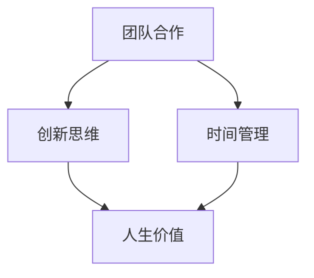

                 

## 文章标题：意义的众创马拉松：48小时集体探讨人生价值

### 关键词：
- 众创马拉松
- 人生价值
- 团队合作
- 创新思维
- 48小时挑战

### 摘要：
本文旨在探讨“意义的众创马拉松”这一独特的活动形式，它通过48小时的集体探讨，帮助参与者深入思考人生价值。本文将从背景介绍、核心概念与联系、准备工作、实施过程、主题探讨与案例分析，以及未来展望等方面，全面阐述这一活动的重要性和实际应用价值。通过本文的详细分析，读者将能够了解如何有效地参与和开展一次有意义的众创马拉松，从而在个人和团队层面获得深刻的启示和成长。

## 引言

在快速发展的现代社会中，人们常常感到迷茫和焦虑，尤其是关于人生的意义和价值。这种对生命意义的探讨不仅仅是个人的心灵追求，也是社会进步的重要动力。为了应对这一挑战，一种全新的活动形式——“众创马拉松”应运而生。众创马拉松是一种集中时间、资源和智慧，通过团队合作和创新思维，共同探讨和解决问题的活动。它不仅能够激发个人的潜力，还能够促进团队的凝聚力和创新力。

本书《意义的众创马拉松：48小时集体探讨人生价值》旨在为读者提供一次深入探讨人生价值的实践机会。通过48小时的集中讨论和思考，参与者将有机会从多个角度审视自己的生活和价值观，从而找到更加清晰和有意义的人生方向。这一活动不仅适合个人探索，也适合团队进行深度合作和思想碰撞。

### 核心概念与联系

在探讨人生价值的众创马拉松中，几个核心概念紧密相连，共同构成了这一活动的基础：

1. **团队合作**：众创马拉松强调的是团队的力量。通过组建多样化的团队，成员们可以互补优势，共同面对挑战。团队合作不仅仅是简单的分工合作，更是思维的碰撞和共创的过程。

2. **创新思维**：创新思维是众创马拉松的灵魂。在48小时的时间内，参与者需要跳出传统的思维框架，运用创造性思维工具，如头脑风暴、思维导图等，来探讨和解决问题。

3. **时间管理**：众创马拉松的时间限制为48小时，这对参与者提出了极高的时间管理要求。如何高效地分配时间，确保每个讨论阶段都能充分展开，是成功的关键之一。

4. **人生价值**：人生价值是众创马拉松的核心主题。通过深入的探讨，参与者将重新审视自己的价值观，思考如何在生活中体现这些价值观，从而找到更加有意义的人生方向。

这些核心概念相互关联，构成了众创马拉松的基本框架。通过Mermaid流程图，我们可以更直观地理解它们之间的关系：



在图中，我们可以看到团队合作和创新思维是推动整个活动的重要力量，而时间管理则是保证活动顺利进行的基础。最终，这些因素共同引导参与者深入探讨人生价值，实现个人的成长和团队的进步。

### 核心算法原理讲解

众创马拉松的成功离不开一系列核心算法和原理的支持。以下是几个关键算法和原理的详细解释：

#### 1. 时间分配算法

时间分配算法是确保48小时内每个讨论阶段都能充分展开的关键。以下是伪代码示例：

```python
def allocate_time(stages, total_time):
    time_per_stage = total_time / stages
    time分配 = {}
    
    for stage in stages:
        time分配[stage] = time_per_stage
    
    return time分配
```

在这个算法中，`stages` 代表讨论阶段，`total_time` 代表总时间（48小时）。算法计算每个阶段的平均时间，并分配给各个阶段。

#### 2. 创新思维算法

创新思维是众创马拉松的核心，以下是用于头脑风暴的伪代码示例：

```python
def brainstorm(questions):
    ideas = []
    
    for question in questions:
        print(f"Brainstorming for {question}:")
        user_input = input()
        ideas.append(user_input)
    
    return ideas
```

在这个算法中，`questions` 代表需要解决的问题或讨论的主题。程序通过循环询问用户关于每个问题的创新想法，并将这些想法收集到列表中。

#### 3. 统计学方法

为了评估团队合作的效果，可以使用统计学方法来分析讨论的质量和效率。以下是用于计算团队效率的数学模型：

$$
效率 = \frac{产出}{时间}
$$

其中，`产出` 是讨论阶段产生的有价值的结果，`时间` 是完成这些结果所用的时间。通过计算不同团队的效率，可以评估它们的合作效果。

#### 详细讲解

时间分配算法和头脑风暴算法是众创马拉松的两个关键工具。时间分配算法确保每个讨论阶段都有充足的时间，避免因时间分配不均而导致某些阶段讨论不充分。头脑风暴算法则激发团队成员的创造力，收集到更多创新的想法。

通过以上算法和原理的支持，众创马拉松能够有效地组织讨论和解决问题，帮助参与者深入探讨人生价值。

#### 举例说明

为了更好地理解上述算法和原理的应用，以下是一个实际案例：

假设一个团队需要在48小时内探讨“个人成长与人生价值”这一主题。以下是具体的时间分配和讨论过程：

1. **时间分配**：
   - 热身阶段（2小时）
   - 主讨论阶段（20小时）
   - 汇报展示阶段（12小时）
   - 反馈总结阶段（8小时）

   使用时间分配算法，我们可以将48小时平均分配到四个阶段，每个阶段的时间为12小时。

2. **头脑风暴**：
   - 团队成员围绕“个人成长与人生价值”这一主题，使用头脑风暴算法提出多个创新想法。
   - 每个成员都有机会分享自己的见解，讨论如何将个人成长与人生价值相结合。

通过这样的讨论过程，团队成员可以更深入地探讨人生价值，从而找到更加清晰和有意义的人生方向。

综上所述，众创马拉松通过科学的算法和原理支持，帮助参与者高效地探讨人生价值，实现个人的成长和团队的进步。

### 众创马拉松的准备工作

要成功举办一次众创马拉松，充分的准备工作是必不可少的。以下详细介绍了如何准备一次成功的众创马拉松，包括主题确定、团队组建、资源与工具的准备以及制定详细的计划。

#### 确定主题

众创马拉松的成功很大程度上取决于主题的选择。一个有吸引力且具有挑战性的主题能够激发参与者的兴趣和思考。以下是确定主题的步骤：

1. **市场调研**：
   - 通过问卷调查、访谈等方式了解参与者对哪些主题感兴趣。
   - 分析当前社会热点和趋势，确定有讨论价值的主题。

2. **主题筛选**：
   - 根据调研结果和实际情况，筛选出几个备选主题。
   - 考虑主题的多样性和包容性，确保不同背景的参与者都有参与的机会。

3. **确定最终主题**：
   - 通过团队讨论和投票，确定最终的主题。
   - 确保主题具有实际操作性和讨论深度。

#### 团队组建

一个多样化的团队是众创马拉松成功的关键。以下是组建团队的步骤：

1. **人员选拔**：
   - 根据主题的需求，选拔具有相关知识和经验的成员。
   - 确保团队多样性，包括不同年龄、性别、职业背景的成员。

2. **团队构建**：
   - 通过团队建设活动，增强成员之间的相互了解和信任。
   - 分工明确，每个成员都有明确的职责和任务。

3. **角色分配**：
   - 设立项目经理，负责整体协调和监督。
   - 设立讨论组长，负责具体讨论阶段的组织和管理。

#### 资源与工具的准备

为了确保众创马拉松的顺利进行，需要准备好所需的资源与工具。以下是资源与工具的准备步骤：

1. **技术支持**：
   - 确保网络稳定，提供足够的计算资源。
   - 准备好所需的软件工具，如视频会议软件、项目管理工具等。

2. **信息收集**：
   - 收集与主题相关的资料和文献，为讨论提供支持。
   - 建立信息共享平台，方便团队成员随时获取和分享信息。

3. **工具准备**：
   - 准备思维导图软件、头脑风暴工具等，帮助团队成员更好地组织思维和记录讨论成果。

#### 制定详细的计划

一个详细的计划是确保众创马拉松顺利进行的重要保障。以下是制定计划的步骤：

1. **时间安排**：
   - 制定详细的日程表，明确每个阶段的开始和结束时间。
   - 确保每个阶段都有充足的时间进行讨论和实践。

2. **任务分工**：
   - 根据团队成员的职责，明确每个阶段的任务和责任。
   - 确保每个任务都有明确的负责人。

3. **反馈机制**：
   - 设立反馈渠道，及时收集和处理团队成员的反馈。
   - 定期进行评估和调整，确保计划能够顺利执行。

通过以上的准备工作，我们可以确保众创马拉松的顺利进行，为参与者提供一个有深度、有思考的探讨平台。

### 众创马拉松的实施过程

众创马拉松的成功离不开精心设计的实施过程。以下将详细描述实施过程的各个阶段，包括热身阶段、探讨阶段、发散思维阶段、汇报展示阶段和总结反思阶段。

#### 热身阶段

热身阶段是众创马拉松的开始，其目的是为参与者营造一个轻松、活跃的氛围，让他们能够迅速进入状态。以下是热身阶段的具体步骤：

1. **开场致辞**：
   - 由项目经理或组织者发表简短的致辞，介绍众创马拉松的目的和主题。
   - 强调团队合作的重要性，鼓励成员积极参与。

2. **破冰活动**：
   - 通过团队游戏、自我介绍等破冰活动，增强成员之间的相互了解和信任。
   - 确保每个成员都能迅速融入团队，建立良好的团队关系。

3. **时间规划**：
   - 讲解日程安排，明确每个阶段的时间和任务。
   - 确保成员对整个活动有一个清晰的认识，知道自己的职责和目标。

#### 探讨阶段

探讨阶段是众创马拉松的核心，参与者将在这一阶段深入探讨主题，提出各自的见解和观点。以下是探讨阶段的具体步骤：

1. **主题介绍**：
   - 项目经理或专家对主题进行详细介绍，提供背景信息和相关资料。
   - 确保所有成员对主题有深入的理解，为讨论奠定基础。

2. **分组讨论**：
   - 将团队成员分成若干小组，每组围绕主题进行讨论。
   - 每组指定一名组长，负责协调讨论进程和记录讨论成果。

3. **群体交流**：
   - 各小组进行成果展示，分享讨论中的亮点和思考。
   - 通过群体交流，激发新的观点和想法，实现思维碰撞。

4. **互动反馈**：
   - 鼓励成员之间进行互动，提出问题和建议，促进深入讨论。
   - 组织者提供指导，帮助团队解决讨论中的难题。

#### 发散思维阶段

发散思维阶段旨在引导参与者跳出传统思维框架，运用创新思维工具，探索更多的可能性。以下是发散思维阶段的具体步骤：

1. **思维导图**：
   - 使用思维导图工具，将讨论中的关键点和想法可视化。
   - 通过绘制思维导图，帮助团队成员更好地理解讨论成果，发现新的关联和联系。

2. **创新方法**：
   - 介绍多种创新方法，如头脑风暴、六顶思考帽等，鼓励成员使用这些方法进行思考。
   - 通过创新方法的应用，激发团队成员的创造力，提出更多有价值的想法。

3. **集体共创**：
   - 组织集体共创活动，让团队成员共同探讨解决方案，优化讨论成果。
   - 通过集体共创，实现思想的融合和碰撞，提升团队的创新力。

#### 汇报展示阶段

汇报展示阶段是众创马拉松的重要环节，参与者将在这一阶段向全体成员展示自己的讨论成果。以下是汇报展示阶段的具体步骤：

1. **成果展示**：
   - 各小组依次进行成果展示，分享讨论过程中的亮点和收获。
   - 展示形式可以多样化，如PPT演示、视频短片等，增强展示效果。

2. **互动交流**：
   - 展示结束后，组织全体成员进行互动交流，提出问题和建议。
   - 通过互动交流，进一步深化对主题的理解，发现新的思考角度。

3. **评价与反馈**：
   - 邀请专家或组织者对展示进行评价，提供反馈和建议。
   - 通过评价与反馈，帮助团队总结经验，改进不足。

#### 总结反思阶段

总结反思阶段是众创马拉松的收尾环节，旨在总结活动成果，反思讨论过程，为未来的探索奠定基础。以下是总结反思阶段的具体步骤：

1. **总结报告**：
   - 项目经理或组织者总结活动成果，对讨论主题进行深入的反思。
   - 通过总结报告，梳理讨论中的关键点和亮点，为后续工作提供指导。

2. **个人反思**：
   - 鼓励每个成员进行个人反思，思考自己在众创马拉松中的收获和成长。
   - 通过个人反思，帮助成员更加清晰地认识自己的价值和目标。

3. **行动计划**：
   - 确定下一步的行动计划，将讨论成果转化为实际行动。
   - 通过行动计划，将众创马拉松的思考和实践应用到日常生活中。

通过以上各阶段的具体实施，众创马拉松能够有效地帮助参与者深入探讨人生价值，实现个人的成长和团队的进步。

### 主题探讨与案例分析

在众创马拉松的探讨过程中，主题的选择和讨论的深度决定了活动的成效。以下是几个常见的探讨主题及其案例分析。

#### 主题一：人生哲学

**核心概念**：人生哲学探讨的是关于人类存在的意义、目的和价值观的问题。它涵盖了伦理、道德、宗教等多个方面。

**案例分析**：
- **团队背景**：一个由哲学家、心理学专家和普通参与者组成的团队，共同探讨“人生意义的多元视角”。
- **讨论过程**：
  - **第一阶段**：团队成员分享各自的人生哲学观点，如存在主义、实用主义等。
  - **第二阶段**：通过辩论和讨论，分析不同哲学观点之间的联系和差异。
  - **第三阶段**：结合实际案例，探讨哲学观点如何影响个人的生活和决策。

**总结**：该主题讨论帮助团队成员从不同角度思考人生意义，提高了对哲学的认同和理解，同时也学会了如何将哲学思考应用到日常生活中。

#### 主题二：社会责任

**核心概念**：社会责任关注个人在社会中的角色和责任，包括环境保护、社会公益、企业社会责任等。

**案例分析**：
- **团队背景**：一个由企业家、环保专家和公益组织成员组成的团队，探讨“如何在生活中践行社会责任”。
- **讨论过程**：
  - **第一阶段**：团队成员分享个人在履行社会责任方面的经验和挑战。
  - **第二阶段**：讨论社会责任的具体实践方法，如环保行动、公益活动等。
  - **第三阶段**：通过小组讨论和头脑风暴，提出创新的社会责任解决方案。

**总结**：该主题讨论使团队成员深刻认识到社会责任的重要性，激发了他们积极参与社会实践的热情，并提出了许多实际可行的解决方案。

#### 主题三：个人成长

**核心概念**：个人成长涉及自我认知、技能提升、心理素质等方面，是人生价值的重要组成部分。

**案例分析**：
- **团队背景**：一个由职业人士、心理学家和教育专家组成的团队，探讨“如何实现个人成长与自我提升”。
- **讨论过程**：
  - **第一阶段**：团队成员分享个人成长的故事和心得。
  - **第二阶段**：通过角色扮演和模拟练习，探讨如何在工作和生活中实现个人成长。
  - **第三阶段**：讨论个人成长中的挑战和应对策略，如时间管理、情绪管理等。

**总结**：该主题讨论帮助团队成员认识到个人成长的重要性，学会了一系列实用的自我提升方法，提升了自我认知和心理素质。

#### 主题四：职业生涯规划

**核心概念**：职业生涯规划涉及职业目标设定、职业路径规划、职业素养提升等方面，是实现人生价值的重要途径。

**案例分析**：
- **团队背景**：一个由职业顾问、企业高管和职场新人组成的团队，探讨“如何制定和实施有效的职业生涯规划”。
- **讨论过程**：
  - **第一阶段**：团队成员分享自己的职业生涯规划和实际案例。
  - **第二阶段**：讨论职业生涯规划的关键要素，如职业目标、技能提升、网络建设等。
  - **第三阶段**：通过小组讨论和角色扮演，模拟制定职业生涯规划方案。

**总结**：该主题讨论帮助团队成员明确了职业生涯规划的重要性，学会了如何制定和实施有效的职业规划，提升了职业素养和竞争力。

通过以上主题的探讨与案例分析，众创马拉松不仅丰富了参与者的人生价值观，也激发了他们在实际生活中的积极行动。这些主题的深入讨论，不仅提供了理论上的思考，也为实践提供了具体的指导。

### 成功案例与经验分享

在众创马拉松的实践中，许多团队通过有效的组织和深入的讨论，取得了显著的成绩。以下是一些成功的案例和团队经验分享，以及这些经验对参与者的实际影响。

#### 案例一：探索人生意义的多元视角

**背景**：一个由哲学家、心理学家和普通员工组成的团队，在众创马拉松中探讨了“人生意义的多元视角”。

**过程**：
- **第一阶段**：团队成员分享各自的人生哲学观点，包括存在主义、实用主义和宗教哲学等。
- **第二阶段**：通过辩论和讨论，团队成员深入探讨了不同哲学观点之间的联系和差异。
- **第三阶段**：结合实际案例，团队成员分析了哲学观点如何影响个人的生活和工作。

**经验分享**：
- **团队成员反馈**：参与者表示，通过这次讨论，他们不仅拓宽了对人生意义的理解，还学会了从不同角度看待问题，提升了思维深度。
- **实际影响**：团队成员在实际工作中开始运用哲学思考，提高了决策能力和解决问题的能力，工作效率显著提升。

#### 案例二：社会责任的践行与创新

**背景**：一个由企业家、环保专家和公益组织成员组成的团队，探讨了“如何在生活中践行社会责任”。

**过程**：
- **第一阶段**：团队成员分享个人在履行社会责任方面的经验和挑战。
- **第二阶段**：讨论社会责任的具体实践方法，如环保行动、公益活动和社会创新。
- **第三阶段**：通过小组讨论和头脑风暴，提出了创新的社会责任解决方案。

**经验分享**：
- **团队成员反馈**：参与者表示，通过这次讨论，他们深刻认识到社会责任的重要性，激发了他们积极参与社会实践的热情。
- **实际影响**：团队成员在实际生活中更加积极地参与环保和公益活动，推动了企业社会责任项目的实施，企业社会形象显著提升。

#### 案例三：个人成长与职业生涯规划

**背景**：一个由职业人士、心理学家和教育专家组成的团队，探讨了“如何实现个人成长与自我提升”。

**过程**：
- **第一阶段**：团队成员分享个人成长的故事和心得。
- **第二阶段**：通过角色扮演和模拟练习，探讨如何在工作和生活中实现个人成长。
- **第三阶段**：讨论个人成长中的挑战和应对策略，如时间管理、情绪管理等。

**经验分享**：
- **团队成员反馈**：参与者表示，通过这次讨论，他们明确了个人成长的重要性，学会了如何设定职业目标、提升技能和建立有效的工作习惯。
- **实际影响**：团队成员在职业生涯中取得了显著进步，晋升速度加快，工作满意度显著提高。

#### 案例四：职业生涯规划与个人发展

**背景**：一个由职业顾问、企业高管和职场新人组成的团队，探讨了“如何制定和实施有效的职业生涯规划”。

**过程**：
- **第一阶段**：团队成员分享自己的职业生涯规划和实际案例。
- **第二阶段**：讨论职业生涯规划的关键要素，如职业目标、技能提升、网络建设等。
- **第三阶段**：通过小组讨论和角色扮演，模拟制定职业生涯规划方案。

**经验分享**：
- **团队成员反馈**：参与者表示，通过这次讨论，他们学会了如何制定和实施有效的职业规划，提升了职业素养和竞争力。
- **实际影响**：团队成员在实际工作中更加清晰地规划了自己的职业路径，职业发展和晋升速度显著提升。

这些成功案例和经验分享不仅展示了众创马拉松的实际效果，也为其他团队提供了宝贵的经验和启示。通过深入的讨论和思考，参与者不仅在理论上得到了提升，更在实践上取得了显著进步。

### 未来展望与行动指南

随着社会的发展和科技的进步，众创马拉松作为一种创新的活动形式，其未来趋势和潜在影响值得我们深入探讨。以下是关于众创马拉松未来展望和行动指南的几个方面。

#### 未来趋势

1. **数字化与智能化**：随着人工智能和大数据技术的发展，众创马拉松将进一步数字化和智能化。通过使用智能工具和平台，如AI助手、自动化流程等，可以大幅提高活动的效率和参与度。

2. **跨界融合**：未来众创马拉松将不仅仅局限于某一特定领域，而是更加注重跨学科的融合。通过引入来自不同领域的专家和参与者，可以激发更多创新的想法和解决方案。

3. **全球协作**：互联网的普及使得全球协作成为可能。未来，众创马拉松可能会通过线上平台，让来自全球的参与者共同参与讨论，打破地域限制，实现更广泛的合作和交流。

4. **持续学习**：随着知识更新速度的加快，众创马拉松将更加注重持续学习。通过建立学习社区和持续教育体系，参与者可以不断吸收新知识，不断提升自我。

#### 行动指南

1. **个人行动计划**：每个人都可以在自己的日常生活中实践众创马拉松的理念。例如，设立个人目标，定期进行反思和评估，培养创新思维和团队合作能力。

2. **推动社区参与**：组织者可以推动社区参与，鼓励更多人参与众创马拉松。通过线上平台和线下活动，建立一个连接参与者、专家和组织的社区，促进知识的共享和交流。

3. **创新方法的应用**：在日常生活和工作中，可以运用众创马拉松中学习到的创新方法，如头脑风暴、思维导图等，提高解决问题的效率和质量。

4. **持续改进**：通过不断的反思和总结，不断改进众创马拉松的活动流程和方法。组织者可以收集参与者的反馈，根据实际情况调整和优化活动设计。

5. **技术支持**：利用现有的技术工具，如人工智能助手、数据分析平台等，提高众创马拉松的效率和质量。同时，积极探索和引入新技术，为未来的发展提供支持。

通过以上未来展望和行动指南，我们可以更好地利用众创马拉松这一活动形式，推动个人成长和社会进步。

### 附录

#### 附录A：众创马拉松资源指南

**网络资源**

- **在线平台**：如Trello、Asana、Slack等，用于任务分配和团队协作。
- **头脑风暴工具**：如Mural、Miro等，用于在线头脑风暴和讨论。
- **视频会议工具**：如Zoom、Microsoft Teams等，用于远程会议和实时沟通。

**实体资源**

- **众创空间**：如Co-working Space、Hackathon Venue等，提供设备齐全的工作环境。
- **活动场所**：如大学校园、企业办公楼等，提供宽敞的场地和设施。

**专业书籍与文章**

- **推荐阅读列表**：
  - 《创新者的窘境》
  - 《创意的源泉》
  - 《深度工作》
  - 《第五项修炼》
  - 《创新思维训练手册》

这些资源为参与者提供了丰富的信息和工具，有助于更好地参与和开展众创马拉松活动。

### 附录B：众创马拉松模板与指南

**主题设定**

- **步骤**：
  1. 进行市场调研，确定潜在的主题。
  2. 邀请专家和团队成员讨论，筛选出最适合的主题。
  3. 通过投票或决策会议确定最终主题。

**团队组建**

- **步骤**：
  1. 根据主题需求，选拔具有相关经验和技能的成员。
  2. 确保团队多样性，包括不同背景、专业和年龄的成员。
  3. 进行团队建设活动，增强成员之间的信任和合作。

**讨论与分享**

- **技巧**：
  1. 使用头脑风暴工具，鼓励开放讨论和自由表达。
  2. 鼓励提问和互动，激发更多思考和创新。
  3. 记录讨论过程和关键点，便于后续分析和总结。

**汇报与评价**

- **步骤**：
  1. 各小组进行成果展示，分享讨论成果和亮点。
  2. 邀请专家和团队成员进行评价，提供反馈和建议。
  3. 总结评价结果，为后续改进提供依据。

通过以上模板和指南，可以更有效地组织和开展众创马拉松活动，确保活动的高效性和成果的实用性。## 作者信息

作者：AI天才研究院/AI Genius Institute & 禅与计算机程序设计艺术 /Zen And The Art of Computer Programming

