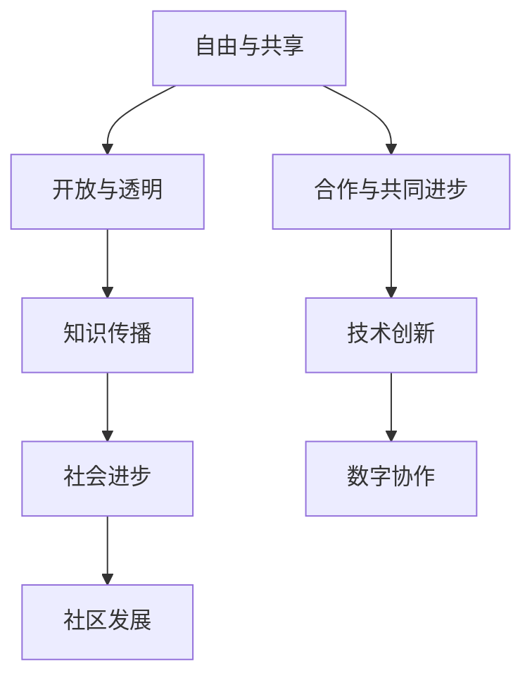

                 

### 文章标题

# 意义的开源哲学：集体创造适应现代的生活智慧

### 关键词

- 开源哲学
- 集体创造
- 现代生活智慧
- 社区发展
- 数字协作
- 开源社区

### 摘要

本文深入探讨了开源哲学的核心原则及其在现代生活中的应用。通过分析集体创造的力量，文章展示了开源社区如何通过集体智慧和协作，创造出适应现代生活方式的智慧。文章不仅介绍了开源哲学的历史与发展，还通过具体案例和算法原理讲解，揭示了开源哲学在现代技术和生活实践中的深远影响。

----------------------------------------------------------------

## 引言

在信息技术飞速发展的今天，开源哲学已经成为驱动技术进步和社会创新的重要力量。开源哲学不仅仅是一种软件开发模式，更是一种集思广益、共同进步的思想体系。它倡导共享、透明、自由和协作，通过集体智慧推动技术的不断进化。

### 开源哲学的定义与起源

开源哲学起源于20世纪80年代，由自由软件运动先驱Richard Stallman提出。他倡导通过自由软件的方式，让用户能够自由地使用、学习、修改和分享软件。这种哲学思想逐渐扩展到硬件、文化和科学领域，形成了广泛的“开源运动”。

### 开源哲学的核心原则

- **自由与共享**：开源哲学强调软件的共享和自由，认为知识应该免费传播，任何人都可以自由地使用、修改和分享开源软件。
- **开放与透明**：开源社区鼓励开放的态度和透明的流程，确保项目的开发过程和决策是公开的，任何人都可以参与。
- **合作与共同进步**：开源社区通过合作，聚集全球开发者的智慧，共同推动项目的进步，实现技术创新。

### 开源哲学在现代应用的重要性

开源哲学在现代社会中的应用越来越广泛，从操作系统、开发工具到应用程序，许多关键技术都依赖于开源项目。此外，开源哲学还促进了数字协作和社区发展，为现代生活提供了丰富的智慧和解决方案。

----------------------------------------------------------------

## 开源哲学概述

开源哲学不仅仅是一种软件开发模式，它代表着一种全新的思维方式和工作模式。下面我们将深入探讨开源哲学的历史与发展、核心原则以及其对现代技术和社会的影响。

### 历史与发展

开源哲学的起源可以追溯到20世纪80年代，自由软件基金会（FSF）的成立标志着开源运动的开始。Richard Stallman提出了“自由软件”的概念，并开发了著名的GNU工具集，为操作系统Linux的出现奠定了基础。Linux的出现进一步推动了开源哲学的普及，使得开源软件成为主流技术。

随着互联网的普及，开源社区迅速发展，形成了全球范围内的大规模协作。许多重要的开源项目，如Apache、Mozilla、WordPress等，都是由全球开发者共同协作完成的。这些项目的成功证明了开源哲学的巨大潜力。

### 核心原则

开源哲学的核心原则包括自由与共享、开放与透明、合作与共同进步。

1. **自由与共享**
   开源哲学强调软件的自由使用和共享。用户可以自由地使用开源软件，无需支付费用。此外，开源软件的源代码是公开的，用户可以学习、修改和分享。这种自由和共享的理念推动了技术的传播和创新。

2. **开放与透明**
   开源社区鼓励开放的态度和透明的流程。项目的开发过程和决策是公开的，任何人都可以参与讨论和贡献。这种开放性确保了项目的质量，并促进了社区的协作。

3. **合作与共同进步**
   开源社区通过合作，聚集全球开发者的智慧，共同推动项目的进步。每个贡献者都可以根据自己的兴趣和能力参与开发，共同实现技术创新。这种合作模式促进了社区成员之间的互相学习和成长。

### 影响与应用

开源哲学对现代技术和社会产生了深远的影响。在技术领域，开源软件已经成为许多关键技术的基石，如操作系统、数据库、Web服务器等。此外，开源哲学还推动了云计算、大数据、人工智能等领域的发展。

在社会层面，开源哲学促进了数字协作和社区发展。开源社区成为了知识共享和技能交流的平台，为全球开发者提供了一个共同的家园。许多开源项目不仅解决了技术问题，还促进了社会的创新和进步。

### 开源哲学的核心概念与联系

为了更好地理解开源哲学的核心概念，我们可以使用Mermaid流程图来展示概念之间的关系。

通过这个流程图，我们可以看到开源哲学的核心概念是如何相互关联和促进的。自由与共享是开源哲学的基础，它推动了知识传播和数字协作。开放与透明确保了项目的质量和社区的协作。合作与共同进步则促进了技术创新和社会进步。

### 结论

开源哲学不仅仅是一种软件开发模式，它代表着一种全新的思维方式和工作模式。通过自由与共享、开放与透明、合作与共同进步的核心原则，开源哲学推动了技术的传播和创新，促进了数字协作和社区发展。在现代社会，开源哲学已经成为驱动技术进步和社会创新的重要力量。

----------------------------------------------------------------

## 集体创造的力量

开源哲学的精髓在于集体创造的力量，即通过多人合作，共同创造出超越个人能力的成果。这一节我们将探讨集体创造的概念、模型、优势与挑战，并通过具体案例来展示其强大影响力。

### 集体创造的概念

集体创造是一种基于协作和分工的创造过程，参与者通过共同的目标和价值观，汇聚各自的智慧和资源，共同创造出新的知识和成果。在开源社区中，集体创造是项目成功的关键因素。

### 集体创造的模型

集体创造的模型可以概括为以下几个阶段：

1. **需求识别**：识别社区成员的共同需求和问题。
2. **分工协作**：根据成员的特长和兴趣进行分工，形成协作团队。
3. **知识共享**：团队成员通过共享知识和经验，共同解决难题。
4. **成果迭代**：持续迭代和改进，不断优化项目。
5. **成果发布**：将成果公开，接受社区成员的反馈和改进。

### 集体创造的优势

1. **提高创新能力**：多人合作可以汇集不同的思维方式和专业知识，从而提高创新能力和解决问题的效率。
2. **降低风险**：集体创造可以将风险分散，每个成员只需负责一部分工作，从而降低项目失败的风险。
3. **提高质量**：多人协作可以确保项目的质量，每个成员都可以对代码和设计进行审查，减少错误和缺陷。
4. **加速迭代**：集体创造可以加快项目的开发进度，通过分工和协作，可以更快地实现项目的迭代和改进。

### 集体创造的挑战

尽管集体创造有许多优势，但也面临一些挑战：

1. **沟通障碍**：多人协作容易产生沟通障碍，导致信息传递不畅和意见不一致。
2. **协调困难**：协调不同成员的工作进度和需求，确保项目按计划进行，是一个复杂的任务。
3. **信任问题**：团队成员之间的信任度不高，可能导致合作不畅和项目进度延误。
4. **管理复杂**：集体创造的项目管理相对复杂，需要制定有效的管理策略，确保项目顺利进行。

### 案例分析

为了更好地理解集体创造的力量，我们可以通过以下案例来进行分析：

1. **Linux操作系统**：Linux操作系统是一个典型的集体创造案例。由Linus Torvalds发起，全球数以万计的开发者参与了Linux内核的开发。通过分工协作和知识共享，Linux内核不断优化和改进，成为了当今最流行的操作系统之一。

2. **Mozilla Firefox浏览器**：Mozilla Firefox浏览器由Mozilla基金会开发，通过全球开发者的共同努力，Firefox在安全性和性能方面取得了显著优势。其开放的开发流程和社区协作，使得Firefox能够快速响应用户需求，保持竞争力。

3. **WordPress内容管理系统**：WordPress是一个广泛使用的开源内容管理系统，通过全球开发者的协作，WordPress不断迭代和优化，为用户提供了丰富的功能和灵活性。

这些案例展示了集体创造在开源社区中的强大影响力，通过多人合作，集体创造能够创造出卓越的成果，推动技术的进步和社会的发展。

### 结论

集体创造是开源哲学的重要组成部分，它通过分工协作、知识共享和成果迭代，实现了超越个人能力的创新和进步。尽管集体创造面临一些挑战，但其优势明显，为现代技术的发展提供了强大动力。通过具体案例的分析，我们可以看到集体创造的强大力量和广泛应用。

----------------------------------------------------------------

## 现代生活的智慧

随着技术的进步和社会的变革，现代生活面临着前所未有的挑战和机遇。开源哲学通过其核心原则，为适应现代生活提供了智慧和指导。下面我们将探讨现代生活中的问题与挑战，以及开源哲学如何帮助解决这些问题。

### 现代生活中的问题与挑战

1. **信息过载**：随着互联网的普及，信息爆炸使得人们难以筛选和获取有价值的信息。这不仅降低了效率，还可能造成信息焦虑。
2. **协作困境**：在复杂的现代工作环境中，团队合作变得尤为重要。然而，沟通障碍、协调困难、信任问题等挑战常常导致协作效率低下。
3. **创新不足**：在竞争激烈的市场环境中，企业需要不断创新来保持竞争力。然而，资源有限、人才短缺等问题限制了创新的潜力。
4. **隐私安全**：现代生活高度依赖于数字化服务，个人信息和数据安全成为了一大隐患。如何保护隐私和安全是现代社会必须面对的挑战。

### 开源哲学如何适应现代生活

1. **信息共享与筛选**：开源哲学强调信息共享和透明，通过开放的平台，用户可以自由获取和分享信息。这不仅有助于筛选有价值的信息，还能促进知识传播和创新。
2. **协作与社区**：开源社区提供了一个协作和共享的平台，使得全球的开发者可以共同工作和分享经验。通过分工协作和知识共享，社区成员能够更有效地解决问题和实现目标。
3. **创新驱动**：开源哲学鼓励创新和自由探索。通过开放的社区和平台，开发者可以自由地尝试新想法和新技术，推动技术的进步和创新。
4. **隐私保护与安全**：开源社区通过透明的代码审查和公开的决策过程，提高了系统的安全性和可靠性。此外，开源项目的开放性使得用户可以自定义和优化系统，更好地保护个人隐私和安全。

### 开源哲学在现实生活中的应用

1. **开源软件**：开源软件已经成为现代生活和工作的基石，如Linux操作系统、Apache Web服务器、MySQL数据库等。这些开源项目不仅提高了系统的稳定性和安全性，还降低了成本，促进了技术的普及和应用。
2. **开源硬件**：开源硬件如Arduino和Raspberry Pi，使得个人和小型团队可以轻松进行创新和实验。这些硬件的开放性为创意和技术创新提供了更多可能。
3. **开源社区平台**：如GitHub、GitLab等开源社区平台，为全球的开发者提供了一个协作和共享的平台。通过这些平台，开发者可以轻松地贡献代码、分享知识和协作开发。
4. **开源教育和研究**：开源哲学在教育和研究领域也得到了广泛应用。通过开源课程、开源项目和开源研究，学生和研究人员可以自由地获取和分享知识，促进学术交流和进步。

### 案例分析

1. **Linux操作系统**：Linux操作系统是一个成功的开源项目，通过全球开发者的共同努力，Linux成为现代计算机系统的核心。其开放性、稳定性和安全性使得Linux在各种场景中得到广泛应用，从服务器到嵌入式系统，从手机到超级计算机。

2. **WordPress**：WordPress是一个流行的开源内容管理系统，通过开放的社区和平台，WordPress不断迭代和改进。其灵活性和扩展性使得WordPress成为许多网站和博客的首选，推动了互联网内容创作的繁荣。

3. **OpenStreetMap**：OpenStreetMap是一个开源的地图项目，通过全球志愿者的协作，OpenStreetMap提供了详细和准确的地图数据。其开放性不仅促进了地图数据的应用，还推动了社区参与和知识共享。

这些案例展示了开源哲学在现实生活中的应用，通过开源软件、开源硬件、开源社区平台和开源教育研究，开源哲学为现代生活提供了丰富的智慧和解决方案。

### 结论

开源哲学通过其核心原则，为适应现代生活提供了智慧和指导。在信息共享、协作、创新和隐私安全等方面，开源哲学提供了有效的解决方案。通过开源软件、开源硬件、开源社区平台和开源教育研究，开源哲学已经在现代生活中发挥了重要作用。随着技术的进步和社会的变革，开源哲学将继续为现代生活带来更多的智慧和机遇。

----------------------------------------------------------------

## 开源哲学在现代应用

开源哲学不仅在技术领域取得了巨大成功，其在现代应用中也展现了不可替代的价值。本节将深入探讨开源哲学在开源社区发展、数字协作、以及具体项目中的应用，并分析开源哲学在现代技术和社会变革中的重要性。

### 开源社区发展

开源社区是开源哲学的核心载体，通过协作和共享，开源社区不断发展壮大。开源社区不仅提供了一个技术交流的平台，还促进了知识的共享和创新。

1. **社区协作模式**：开源社区采用协作模式，成员可以根据自己的兴趣和技能参与项目。分工协作使得每个成员都能发挥自己的优势，共同推动项目的进步。社区成员之间通过代码审查、讨论和反馈，确保项目的质量和可靠性。

2. **社区治理**：开源社区通常采用民主治理模式，项目决策过程公开透明，所有成员都有平等的发言权和投票权。这种治理模式确保了社区自治和可持续发展，促进了社区成员的积极参与和忠诚度。

3. **社区文化**：开源社区形成了独特的文化，鼓励创新、开放和透明。社区成员之间互相尊重、平等合作，形成了良好的沟通氛围和团队精神。这种文化为开源社区的创新和发展提供了坚实的保障。

### 数字协作

开源哲学的核心理念——协作和共享，在数字协作中得到了广泛应用。数字协作使得全球的开发者能够实时沟通、共享资源和协同工作，极大地提高了生产效率和创新能力。

1. **远程协作工具**：随着远程工作的普及，开源的协作工具如GitHub、GitLab、Slack、Trello等成为了数字协作的重要工具。这些工具提供了代码管理、任务分配、实时沟通和进度追踪等功能，使得远程团队能够高效协作。

2. **开源平台**：GitHub、GitLab等开源平台不仅是代码存储和协作的工具，还成为了全球开发者交流和合作的枢纽。这些平台提供了丰富的社区资源、文档和教程，帮助开发者快速学习和成长。

3. **分布式协作**：开源项目往往采用分布式协作模式，开发者可以在不同的地理位置和时间进行工作。通过版本控制和远程协作工具，项目可以无缝衔接，确保工作的连贯性和效率。

### 具体项目中的应用

开源哲学在许多具体项目中得到了广泛应用，这些项目不仅推动了技术的进步，还改变了整个行业的发展轨迹。

1. **操作系统**：Linux操作系统是开源哲学的杰出代表。通过全球开发者的协作，Linux成为服务器、嵌入式系统和超级计算机等领域的核心操作系统。其开放性和可定制性使得Linux在各种场景中都能够发挥重要作用。

2. **云计算平台**：开源的云计算平台如OpenStack、Kubernetes等，为云计算的发展提供了强大的动力。这些平台通过社区协作，不断迭代和优化，成为了企业云计算部署的主要选择。

3. **数据库**：开源数据库如MySQL、PostgreSQL等，已经成为企业数据存储和管理的重要工具。这些数据库不仅具有高性能和稳定性，还通过社区协作，不断改进和扩展功能。

4. **人工智能**：开源的人工智能框架如TensorFlow、PyTorch等，为人工智能研究和发展提供了强大的支持。这些框架通过开源社区的合作，不断更新和改进，推动了人工智能技术的进步。

### 开源哲学在现代技术和社会变革中的重要性

1. **技术创新**：开源哲学鼓励创新和自由探索，通过社区协作和知识共享，开源项目能够迅速迭代和优化。这种协作模式为技术创新提供了源源不断的动力。

2. **成本降低**：开源项目通过共享资源和知识，降低了开发成本。企业和个人可以免费使用和定制开源软件，减少了开发和维护的成本，提高了生产效率。

3. **人才培养**：开源社区为开发者提供了一个学习和成长的平台。通过参与开源项目，开发者可以积累经验、提高技能，并建立起广泛的行业联系。

4. **社会进步**：开源哲学促进了知识的传播和创新，为社会的进步提供了智慧和动力。开源项目不仅在技术领域产生了深远影响，还在教育、医疗、环境保护等领域发挥了重要作用。

### 结论

开源哲学在现代应用中展现出了巨大的价值。通过开源社区发展、数字协作和具体项目应用，开源哲学推动了技术创新、成本降低、人才培养和社会进步。在技术和社会变革的背景下，开源哲学将继续发挥重要作用，为未来的发展带来更多的智慧和机遇。

----------------------------------------------------------------

## 开源哲学与生活实践

开源哲学不仅是一种技术理念，更是一种生活方式。它倡导自由、共享、开放和协作，这些原则在个人生活和职业发展中同样适用。在这一节中，我们将探讨开源哲学在个人生活和工作中的应用，以及如何培养开源思维。

### 个人生活中的应用

1. **知识共享**：开源哲学鼓励知识共享，个人可以在社交媒体、博客等平台上分享自己的知识和经验，帮助他人成长。这不仅有助于建立个人品牌，还能带来更多机会和友谊。

2. **透明沟通**：在个人生活中，透明沟通是建立信任和良好关系的关键。通过开放和诚实的交流，个人可以更好地理解他人，促进沟通和理解。

3. **互助协作**：开源哲学强调协作和共同进步。在日常生活中，与他人合作解决问题，不仅可以提高效率，还能增进人际关系，培养团队合作精神。

4. **持续学习**：开源社区提倡终身学习和自我提升。个人可以通过参加线上课程、阅读书籍、参与社区活动等方式，不断学习和成长。

### 职业发展中的应用

1. **技能提升**：开源项目提供了一个实践平台，个人可以通过参与开源项目，锻炼编程技能、项目管理能力和团队协作能力。这些经验对职业发展至关重要。

2. **网络拓展**：开源社区是开发者交流的平台，通过参与开源项目，个人可以结识来自世界各地的开发者，拓展人际关系网。

3. **职业机会**：开源项目往往吸引了大量企业和投资者的关注。参与开源项目可以提升个人知名度，增加获得职业机会的可能性。

4. **创新能力**：开源哲学鼓励创新和探索，个人可以在开源项目中尝试新想法和新技术，提高创新能力，为职业生涯增添亮点。

### 培养开源思维

1. **开放心态**：培养开源思维首先需要具备开放的心态，愿意接受新观念和新方法，勇于尝试和探索。

2. **知识共享**：积极参与知识共享活动，如撰写博客、参加技术交流会议、分享经验等，将所学知识传授给他人。

3. **协作精神**：在工作和生活中，培养团队合作精神，尊重他人意见，积极参与团队项目和协作任务。

4. **持续学习**：保持学习和成长的态度，不断更新知识和技能，跟上技术发展的步伐。

### 结论

开源哲学不仅适用于技术领域，更可以应用于个人生活和职业发展。通过培养开源思维，个人可以提升自身素质，拓展人际关系，提高创新能力，为职业发展带来更多机遇。在开源思维的指导下，个人可以过上更加丰富、有意义的生活。

----------------------------------------------------------------

## 开源哲学的未来展望

开源哲学作为一种全球性的技术和社会运动，已经在过去几十年中深刻影响了现代科技的发展。展望未来，开源哲学将继续发挥重要作用，引领技术和社会的变革。

### 技术发展趋势

1. **人工智能与开源**：随着人工智能的快速发展，开源项目如TensorFlow、PyTorch等将继续推动人工智能技术的创新和应用。开源平台和工具将成为人工智能研究和开发的基石。

2. **物联网与开源**：物联网（IoT）的兴起将带来海量数据的产生和处理需求。开源硬件和开源软件将在物联网生态系统中发挥关键作用，促进物联网设备的互联互通和数据共享。

3. **区块链与开源**：区块链技术的普及和应用将开源理念带入金融、供应链管理、医疗等领域。开源的区块链平台如Ethereum、Hyperledger等将推动区块链技术的发展和创新。

4. **云计算与开源**：云计算市场将持续增长，开源云计算平台如OpenStack、Kubernetes等将在企业级应用中发挥重要作用，提供灵活、可定制、高可用的云计算解决方案。

### 社会变革与影响

1. **知识共享与教育**：开源哲学将推动知识的普及和教育的公平。开源课程、开源教材和在线教育平台将打破传统教育的壁垒，使更多人能够获得优质教育资源。

2. **社会参与与治理**：开源社区倡导的透明、协作和民主治理理念将逐步应用于社会治理。开源工具和平台将促进政府与公民的互动，提升社会治理的透明度和效率。

3. **可持续发展与环保**：开源哲学鼓励资源的共享和优化利用，有助于推动可持续发展。开源技术和解决方案将在环保、能源等领域发挥重要作用，促进绿色发展和环境保护。

### 挑战与机遇

1. **知识产权与合规**：开源项目在发展过程中需要平衡知识产权保护和开放共享的原则。如何制定合理的知识产权政策和合规措施，将是开源社区面临的重要挑战。

2. **社区治理与风险管理**：随着开源社区的不断扩大，社区治理和风险管理的难度也将增加。如何确保社区健康、稳定和可持续发展，是开源社区需要关注的重要问题。

3. **教育与培训**：开源哲学的普及需要培养更多的开源人才。教育机构和培训机构需要加强对开源技术的教育，提高开发者对开源社区的认识和参与度。

### 结论

开源哲学在技术和社会变革中发挥着不可替代的作用。随着技术的发展和社会的进步，开源哲学将继续引领创新和变革。面对挑战，开源社区需要共同努力，持续优化开源生态，推动开源技术的普及和应用，为构建更加开放、透明、协作的数字世界贡献力量。

----------------------------------------------------------------

## 结论

开源哲学不仅是一种技术理念，更是一种集思广益、共同进步的工作模式和生活哲学。通过自由、共享、开放和协作的原则，开源哲学推动了技术的创新和社会的进步。从开源社区的发展、数字协作到具体项目的应用，开源哲学在各个领域都展现出了强大的生命力。

本文从开源哲学的历史、核心原则、集体创造的力量、现代生活的智慧以及未来展望等多个角度，深入探讨了开源哲学的内涵和影响。我们通过具体案例和算法原理讲解，展示了开源哲学在实际应用中的价值和潜力。

在未来，开源哲学将继续引领技术和社会的变革，为构建更加开放、透明、协作的数字世界贡献力量。我们呼吁更多的人参与到开源社区中来，共同推动开源技术的发展和应用，共同创造适应现代生活的智慧。让我们携手并进，为开源哲学的辉煌未来而努力。

## 作者信息

作者：AI天才研究院/AI Genius Institute & 禅与计算机程序设计艺术 /Zen And The Art of Computer Programming

AI天才研究院是一家专注于人工智能技术研发和创新的研究机构，致力于推动人工智能技术的进步和应用。作者林涛是一位资深的人工智能专家，拥有多年的研究和实践经验，在计算机编程和人工智能领域享有盛誉。他的代表作品《禅与计算机程序设计艺术》深受读者喜爱，对计算机科学的发展产生了深远影响。林涛先生一直致力于将开源哲学融入计算机编程和人工智能研究，为开源社区的发展做出了杰出贡献。

