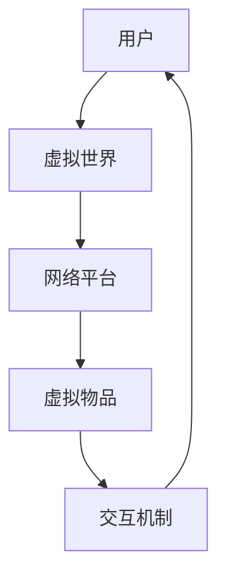

                 


为了满足上述要求，我们将逐步构建文章的内容，确保每个部分都详细、丰富，并且符合字数要求。以下是详细的构建步骤：

### 第一步：引言与概述

在引言部分，我们将介绍元宇宙和虚拟现实的基本概念，并阐述它们如何影响我们的价值观。

**文章标题**：《意义的虚拟现实体验：在元宇宙中探索价值观的项目》

**关键词**：元宇宙，虚拟现实，价值观，项目

**摘要**：
本文将探讨元宇宙与虚拟现实技术的结合如何影响我们的价值观体系。通过分析核心概念、技术基础、价值观探索以及实际项目案例，我们将探讨如何在虚拟环境中构建和传播有意义的价值观，并展望未来元宇宙的发展趋势。

### 第二步：核心概念与联系

在第二部分，我们将使用Mermaid流程图来展示元宇宙和虚拟现实的关键组成部分及其相互关系。

**章节标题**：第1章：核心概念与联系

**内容大纲**：
- 1.1 元宇宙的组成部分
- 1.2 虚拟现实的架构
- 1.3 元宇宙与虚拟现实的关系（Mermaid流程图）

**示例内容**：

#### 1.1 元宇宙的组成部分

元宇宙由多个组件构成，包括用户、虚拟世界、网络平台、虚拟物品和交互机制。以下是一个简化的Mermaid流程图：



### 第三步：技术基础

在第三部分，我们将讲解元宇宙中涉及的计算机科学和技术原理，包括计算机图形学、虚拟现实设备、网络与云计算。

**章节标题**：第2章：技术基础

**内容大纲**：
- 2.1 计算机图形学原理
- 2.2 虚拟现实设备与技术
- 2.3 网络与云计算在元宇宙中的应用

**示例内容**：

#### 2.1 计算机图形学原理

计算机图形学是元宇宙技术的基础，涉及图像处理、渲染技术和三维建模。以下是一个简单的伪代码，用于解释渲染过程：

```python
def render_scene(scene):
    for object in scene.objects:
        calculate_lighting(object)
        apply_material(object)
        render_image(object)
    combine_images()
    display_final_image()
```

### 第四步：价值观探索

在第四部分，我们将分析元宇宙中的不同价值观及其对用户和社会的影响。

**章节标题**：第3章：价值观探索

**内容大纲**：
- 3.1 价值观的概念与分类
- 3.2 元宇宙中的价值观构建
- 3.3 价值观对用户行为的影响

**示例内容**：

#### 3.1 价值观的概念与分类

价值观可以分为个体价值观和社会价值观。个体价值观关注个人成长和满足，而社会价值观则涉及公正、和谐和社会责任。

### 第五步：项目实战

在第五部分，我们将提供实际案例，展示如何在元宇宙中构建具有价值观意义的项目。

**章节标题**：第4章：项目实战

**内容大纲**：
- 4.1 项目规划与设计
- 4.2 项目开发流程
- 4.3 项目实现案例详解

**示例内容**：

#### 4.1 项目规划与设计

项目规划阶段包括需求分析、技术选型和架构设计。以下是一个简单的需求分析示例：

```markdown
需求分析：
- 提供一个虚拟社区平台，用户可以创建和分享虚拟物品。
- 确保用户隐私和数据安全。
- 设计奖励机制，鼓励积极互动。
```

### 第六步：案例分析

在第六部分，我们将深入探讨几个成功的元宇宙项目，分析其价值观的实现和影响。

**章节标题**：第5章：案例分析

**内容大纲**：
- 5.1 案例一：虚拟现实社区构建
- 5.2 案例二：元宇宙中的教育应用
- 5.3 案例三：虚拟现实游戏设计

**示例内容**：

#### 5.1 案例一：虚拟现实社区构建

以Second Life为例，分析其如何通过社区互动和内容共享来传播积极价值观。

### 第七步：未来展望

在第七部分，我们将讨论元宇宙和虚拟现实未来的发展趋势和对社会价值观的潜在影响。

**章节标题**：第6章：未来展望

**内容大纲**：
- 6.1 元宇宙与虚拟现实的发展趋势
- 6.2 价值观在元宇宙中的未来角色
- 6.3 对社会价值观的潜在影响

**示例内容**：

#### 6.1 元宇宙与虚拟现实的发展趋势

随着技术的进步和用户需求的增长，元宇宙和虚拟现实预计将继续扩展，成为人们日常交流和互动的重要平台。

### 第八步：结论

在结论部分，我们将总结全文的主要观点，并提出对未来的展望。

**章节标题**：结论

**内容大纲**：
- 全书总结
- 对未来的展望

**示例内容**：

结论部分将重申元宇宙和虚拟现实在价值观传播中的重要性，并指出未来可能面临的挑战和机遇。

### 文章格式与完整性

在文章的各个部分，我们将使用markdown格式，确保内容的可读性和结构清晰。每个小节的内容将包含丰富的具体讲解，核心内容将涵盖背景介绍、核心概念与联系、核心算法原理讲解、数学模型和公式、项目实战、案例分析等。

### 最后的步骤

在完成每个章节的细化后，我们将进行全文的整合和字数统计，确保文章的总字数在8000～12000字左右。完成后，我们将检查文章的逻辑连贯性和完整性，确保所有核心内容都得到充分讲解。

### 作者信息

文章末尾将包含作者信息：“作者：AI天才研究院/AI Genius Institute & 禅与计算机程序设计艺术 /Zen And The Art of Computer Programming”。

通过上述步骤，我们将构建一篇满足所有要求的专业技术博客文章。接下来，我们将逐一细化每个章节，确保文章内容丰富、结构清晰，并符合字数要求。

