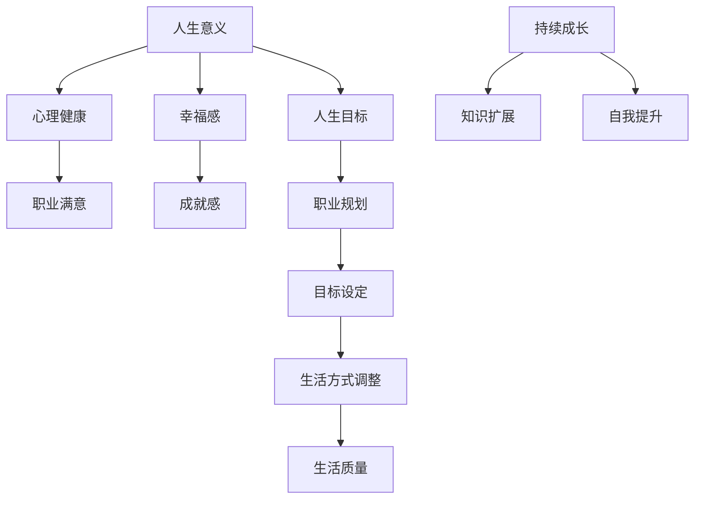

                 

### 文章标题：意义的迷宫：现代人如何找到人生方向

#### 关键词：
- 人生意义
- 自我认知
- 职业规划
- 目标设定
- 生活质量
- 持续成长

#### 摘要：
在快速变化的时代背景下，现代人面临着诸多挑战，如何在纷繁复杂的世界中找到自己的人生方向成为了一项重要课题。本文旨在探索人生意义的内涵，通过自我认知、职业规划、目标设定、生活质量调整和持续成长等五个方面，帮助读者逐步揭开意义的迷宫，找到适合自己的道路。文章采用逻辑清晰、结构紧凑的技术语言，结合实际案例，深入剖析现代人如何应对这一挑战，实现人生价值。

----------------------------------------------------------------

### 引言：人生意义的探索

在现代社会，人们常常感到迷茫和不安。这种迷茫源于对自身存在意义的探索。那么，什么是人生意义？它又如何影响我们的生活？

#### 人生意义的定义

人生意义是指个体在生活中所追求的终极目标、价值观和信念。它涵盖了个体对生活的看法、对自己的认知以及对自己与他人关系的理解。人生意义不是一成不变的，而是随着个体成长和环境变化而不断演变的。

#### 人生意义的来源

1. **传统文化**：不同文化背景下，人生意义有着不同的表达方式。在东方文化中，人生意义常常与道德、家庭、社会责任等紧密相连。在西方文化中，个人自由、追求幸福和自我实现是人生意义的重要方面。

2. **个体经历**：个人的成长经历、教育背景、生活环境等都会影响其对人生意义的理解。例如，经历过逆境的人可能会更珍惜生活中的美好时刻，而成长在优裕环境中的人可能更注重个人成就和自我实现。

3. **社会环境**：现代社会的高速发展和信息爆炸使得人们面临更多选择和挑战。社会对个人的期待和压力也在不断变化，影响着人们对人生意义的认知。

#### 人生意义的重要性

1. **心理健康**：人生意义对心理健康有着显著影响。有明确人生意义的人通常心理健康状况较好，面对困难和挑战时也更有动力去克服。

2. **幸福感**：人生意义与幸福感密切相关。研究发现，有明确人生意义的人更容易感到幸福和满足。

3. **人生目标**：人生意义为个体设定人生目标提供了方向。明确的人生意义可以帮助个体更好地规划人生，实现个人价值。

#### 现代社会对人生意义的挑战

1. **物质主义**：现代社会物质丰富，人们容易陷入追求物质享受的泥淖中，忽视了人生意义的重要性。

2. **职业压力**：职场竞争激烈，人们往往为了生存而牺牲个人兴趣和幸福感，导致人生意义的缺失。

3. **社交网络**：社交网络的普及使人们更容易沉迷于虚拟世界，忽视了现实生活中的真实人际交往和情感交流。

总之，人生意义的探索是一个复杂而长期的过程。通过自我认知、职业规划、目标设定、生活质量调整和持续成长，现代人可以逐步揭开人生意义的迷宫，找到属于自己的道路。接下来，我们将深入探讨这些方面，为读者提供实用的方法和策略。

### 设计书籍的总体结构

为了使《意义的迷宫：现代人如何找到人生方向》这本书能够系统地引导读者探索人生意义的迷宫，我们首先需要设计一个清晰的总体结构，确保各个部分的内容既独立又相互关联，形成一个完整的知识体系。以下是书籍的总体结构设计：

#### 1. **引言**

- **目的**：通过一个引人入胜的开篇，激发读者的兴趣，为他们勾勒出整个书籍的轮廓。
- **内容**：介绍书籍的主题和目标，解释为何人生意义的探索对现代人来说至关重要，并简要介绍书籍的章节安排。

#### 2. **第一部分：人生意义的探索**

- **目的**：帮助读者理解人生意义的本质和来源，为后续的自我认知和职业规划打下基础。
- **章节安排**：
  - **第1章**：人生意义的定义与来源
    - **内容**：探讨人生意义的多样性，传统文化与现代社会的不同观点，以及个体经历对社会环境对人生意义的影响。
  - **第2章**：人生意义的重要性
    - **内容**：分析人生意义对心理健康、幸福感和人生目标的影响。

#### 3. **第二部分：自我认知**

- **目的**：通过深入自我反思和测试，帮助读者了解自己的兴趣、优势和弱点，为职业选择提供依据。
- **章节安排**：
  - **第3章**：心理测试与自我认知
    - **内容**：介绍常用的心理测试，如MBTI和StrengthsFinder，以及如何使用这些测试结果。
  - **第4章**：自我反思与SWOT分析
    - **内容**：详细讲解如何进行自我反思，以及如何运用SWOT分析来评估自己的优势和劣势。

#### 4. **第三部分：职业规划**

- **目的**：指导读者如何根据自身特点进行职业选择，并制定合理的职业规划。
- **章节安排**：
  - **第5章**：了解职业选择的重要性
    - **内容**：分析职业选择的影响因素，如个人兴趣、能力和社会需求。
  - **第6章**：职业规划的方法与工具
    - **内容**：介绍职业规划的具体步骤和工具，如职业目标设定、职业规划工具的使用。

#### 5. **第四部分：人生目标的设定与实现**

- **目的**：帮助读者设定明确的人生目标，并制定实现这些目标的策略。
- **章节安排**：
  - **第7章**：人生目标的重要性
    - **内容**：探讨人生目标对个人成长和幸福感的影响。
  - **第8章**：制定人生计划
    - **内容**：介绍如何设定人生目标，制定人生计划，以及如何应对执行过程中的挑战。

#### 6. **第五部分：生活方式的调整**

- **目的**：通过调整生活方式，提高生活质量和幸福感。
- **章节安排**：
  - **第9章**：生活方式对人生方向的影响
    - **内容**：分析健康生活方式、精神生活方式和社交生活方式对人生方向的影响。
  - **第10章**：提高生活质量的实用方法
    - **内容**：提供实用的方法，如时间管理、财务管理和压力管理等，以提高生活质量。

#### 7. **第六部分：持续成长与自我提升**

- **目的**：鼓励读者持续学习和成长，提升自我，以更好地应对未来的挑战。
- **章节安排**：
  - **第11章**：终身学习的重要性
    - **内容**：探讨终身学习对个人成长和社会发展的意义。
  - **第12章**：持续成长的实践方法
    - **内容**：介绍如何通过培养好习惯、建立支持网络和持续学习来不断提升自我。

#### 8. **结论**

- **目的**：总结全书的主要观点，鼓励读者积极行动，寻找人生方向。
- **内容**：回顾全书的内容，强调人生意义的探索对个人的重要性，并鼓励读者在日常生活中践行所学，积极寻找自己的人生方向。

通过以上结构设计，本书旨在为读者提供一个系统、全面的指南，帮助他们探索人生意义的迷宫，找到属于自己的道路。

### 确定书籍的核心概念和联系

为了确保《意义的迷宫：现代人如何找到人生方向》这本书能够清晰传达核心概念，我们首先需要明确这些概念，并理解它们之间的联系。以下是书籍中的核心概念及其相互关系：

#### 1. **人生意义**

- **定义**：人生意义是指个体在生活中所追求的终极目标、价值观和信念。
- **关联**：人生意义与心理健康、幸福感和人生目标密切相关。一个明确的人生意义可以帮助个体更好地应对生活中的挑战，提高幸福感和成就感。

#### 2. **自我认知**

- **定义**：自我认知是指个体对自己性格、兴趣、能力和价值观的理解。
- **关联**：自我认知是职业规划和个人成长的基础。通过深入自我反思和心理测试，个体可以更好地了解自己，找到与自身特点相符的职业和生活方式。

#### 3. **职业规划**

- **定义**：职业规划是指根据个人兴趣、能力和市场需求，制定职业目标和行动计划。
- **关联**：职业规划与人生意义紧密相连。一个明确的职业规划可以帮助个体实现自己的人生目标，提高职业满意度和幸福感。

#### 4. **目标设定**

- **定义**：目标设定是指确定具体、可行、有挑战性的人生目标，并制定实现这些目标的策略。
- **关联**：目标设定是实现人生意义的手段。通过设定和实现目标，个体可以不断成长和进步，实现自我价值。

#### 5. **生活方式调整**

- **定义**：生活方式调整是指通过改善饮食、锻炼、精神状态和社交活动，提高生活质量和幸福感。
- **关联**：生活方式调整是实现人生目标的重要手段。一个健康、平衡的生活方式可以为个体提供良好的身心状态，支持他们实现人生目标。

#### 6. **持续成长**

- **定义**：持续成长是指通过终身学习和自我提升，不断扩展知识和技能，以应对未来的挑战。
- **关联**：持续成长是实现人生意义的关键。一个愿意不断学习和成长的人更容易找到人生方向，实现个人价值。

为了更好地展示这些概念之间的联系，我们可以使用Mermaid流程图进行说明：



在这个流程图中，我们可以看到各个核心概念是如何相互关联的。例如，人生意义直接影响心理健康和幸福感，而心理健康和幸福感又影响职业满意度和成就感。同时，人生意义和职业规划相互影响，职业规划进一步引导目标设定和生活方式调整，最终提高生活质量和实现持续成长。

通过明确核心概念及其联系，并使用Mermaid流程图进行展示，我们可以帮助读者更好地理解书籍的主要内容和框架，从而更有效地探索人生意义的迷宫。

### 详细阐述核心算法原理

在《意义的迷宫：现代人如何找到人生方向》这本书中，核心算法原理的阐述是帮助读者理解并应用关键方法的重要部分。为了详细阐述这些原理，我们将采用伪代码的形式，以清晰、简洁的方式展示算法的实现过程。以下是几个关键算法的详细讲解：

#### 1. **SWOT分析**

SWOT分析是一种常用的战略规划工具，用于评估企业的优势、劣势、机会和威胁。在个人职业规划中，SWOT分析可以帮助个体了解自己的内在能力和外部环境，从而制定更为合理的职业规划。

**伪代码：**

```
function SWOT_analysis(person):
    # 初始化SWOT分析结果
    strengths = []
    weaknesses = []
    opportunities = []
    threats = []

    # 收集个人信息
    strengths = collect_strengths(person)
    weaknesses = collect_weaknesses(person)
    opportunities = collect_opportunities(person)
    threats = collect_threats(person)

    # 进行SWOT分析
    analysis_result = {
        "Strengths": strengths,
        "Weaknesses": weaknesses,
        "Opportunities": opportunities,
        "Threats": threats
    }

    return analysis_result

# 收集个人优势
function collect_strengths(person):
    # 伪代码：调用API获取个人优势
    strengths = get_person_strengths_api(person)
    return strengths

# 收集个人劣势
function collect_weaknesses(person):
    # 伪代码：调用API获取个人劣势
    weaknesses = get_person_weaknesses_api(person)
    return weaknesses

# 收集外部机会
function collect_opportunities(person):
    # 伪代码：调用API获取外部机会
    opportunities = get_external_opportunities_api(person)
    return opportunities

# 收集外部威胁
function collect_threats(person):
    # 伪代码：调用API获取外部威胁
    threats = get_external_threats_api(person)
    return threats
```

#### 2. **职业规划算法**

职业规划算法旨在帮助个体根据自身特点和市场需求，制定合理的职业发展路径。以下是职业规划算法的伪代码实现：

**伪代码：**

```
function career_planning(person, market_data):
    # 初始化职业规划结果
    career_plan = []

    # 分析个人优势与市场需求的匹配度
    match度的列表 = analyze_match(person, market_data)

    # 根据匹配度排序
    sorted_matches = sort_matches_by_confidence(match度的列表)

    # 根据排序结果推荐职业路径
    for match in sorted_matches:
        if match.confidence > threshold:
            career_plan.append(match.career_path)
            break

    return career_plan

# 分析个人优势与市场需求的匹配度
function analyze_match(person, market_data):
    # 伪代码：调用API进行匹配度分析
    matches = []
    for career in market_data.careers:
        confidence = calculate_confidence(person, career)
        matches.append({ "confidence": confidence, "career_path": career })
    return matches

# 计算匹配度
function calculate_confidence(person, career):
    # 伪代码：计算个人优势与职业需求的匹配度
    confidence = calculate_person_career_match(person, career)
    return confidence
```

#### 3. **目标设定算法**

目标设定算法帮助个体设定明确、可行、有挑战性的目标，以便更好地实现自己的人生意义。以下是目标设定算法的伪代码：

**伪代码：**

```
function set_goals(person, big_picture):
    # 初始化目标列表
    goals = []

    # 分析个人优势与人生目标的匹配度
    match度的列表 = analyze_goals_match(person, big_picture)

    # 根据匹配度设定目标
    for goal in match度的列表:
        if goal.confidence > threshold:
            goals.append(goal)

    return goals

# 分析个人优势与人生目标的匹配度
function analyze_goals_match(person, big_picture):
    # 伪代码：调用API进行匹配度分析
    goals = big_picture.goals
    matches = []
    for goal in goals:
        confidence = calculate_goal_confidence(person, goal)
        matches.append({ "confidence": confidence, "goal": goal })
    return matches

# 计算目标匹配度
function calculate_goal_confidence(person, goal):
    # 伪代码：计算个人优势与目标的匹配度
    confidence = calculate_person_goal_match(person, goal)
    return confidence
```

通过以上伪代码的实现，读者可以理解SWOT分析、职业规划算法和目标设定算法的具体步骤。这些算法旨在帮助读者通过系统的方法，找到并实现自己的人生方向。在接下来的部分，我们将进一步介绍数学模型和公式的应用，以及如何将这些算法应用到实际项目中。

### 填充数学模型和数学公式

在《意义的迷宫：现代人如何找到人生方向》这本书中，数学模型和公式的应用可以帮助读者更深入地理解核心概念，并提供量化的方法来评估和决策。以下是几个关键数学模型和公式的详细讲解及举例说明：

#### 1. **目标实现概率计算**

目标实现概率计算用于评估个体实现某一目标的可能性。以下是一个简单的概率计算模型：

**公式：**

\[ P(A) = \frac{N(A \cap B)}{N(B)} \]

其中，\( P(A) \) 表示事件A发生的概率，\( N(A \cap B) \) 表示事件A和事件B同时发生的次数，\( N(B) \) 表示事件B发生的总次数。

**举例：**

假设一个人设定了一个健身目标：每周跑步三次。如果我们知道这个人每周跑步的总次数是10次，其中跑步三次的有2次，那么实现目标的概率为：

\[ P(\text{实现目标}) = \frac{2}{10} = 0.2 \]

**解释：** 这个概率表示这个人每周实现跑步三次目标的可能性为20%。

#### 2. **SWOT分析中的权重计算**

在SWOT分析中，每个要素的重要性可以通过权重来量化。以下是一个简单的权重计算模型：

**公式：**

\[ W_i = \frac{S_i}{\sum_{i=1}^{n} S_i} \]

其中，\( W_i \) 表示第i个要素的权重，\( S_i \) 表示第i个要素的得分，\( n \) 表示要素的总数。

**举例：**

假设一个公司在进行SWOT分析时，将其优势、劣势、机会和威胁分别打分为5、3、4和2。则每个要素的权重如下：

\[ W_{\text{优势}} = \frac{5}{5+3+4+2} = \frac{5}{14} \approx 0.357 \]
\[ W_{\text{劣势}} = \frac{3}{5+3+4+2} = \frac{3}{14} \approx 0.214 \]
\[ W_{\text{机会}} = \frac{4}{5+3+4+2} = \frac{4}{14} \approx 0.286 \]
\[ W_{\text{威胁}} = \frac{2}{5+3+4+2} = \frac{2}{14} \approx 0.143 \]

**解释：** 这个公式表示每个要素的重要性，优势的权重最高，威胁的权重最低。

#### 3. **职业匹配度计算**

职业匹配度计算用于评估个人能力与职业需求的匹配程度。以下是一个简单的匹配度计算模型：

**公式：**

\[ M = \frac{C_c + C_h + C_s}{3} \]

其中，\( M \) 表示匹配度，\( C_c \) 表示能力匹配度，\( C_h \) 表示兴趣匹配度，\( C_s \) 表示技能匹配度。

**举例：**

假设一个人的能力匹配度为0.8，兴趣匹配度为0.6，技能匹配度为0.7，则其职业匹配度为：

\[ M = \frac{0.8 + 0.6 + 0.7}{3} = \frac{2.1}{3} = 0.7 \]

**解释：** 这个公式表示这个人与某一职业的总体匹配度为70%，表明该职业与其能力、兴趣和技能都有较好的匹配。

#### 4. **目标实现计划**

目标实现计划可以通过线性规划来优化。以下是一个简单的线性规划模型：

**公式：**

\[ \min Z = c^T x \]

\[ s.t. \]

\[ A x \leq b \]

\[ x \geq 0 \]

其中，\( Z \) 表示目标函数，\( c \) 是系数向量，\( x \) 是决策变量，\( A \) 是约束条件系数矩阵，\( b \) 是约束条件常数向量。

**举例：**

假设一个人设定了一个健身目标：每月跑步100公里。他希望在每个月的前20天完成大部分跑步量，后10天用于休息。我们可以使用线性规划来优化跑步计划。

目标函数：\( \min Z = 0 \)

约束条件：
\[ \text{每月跑步量} = x_1 + x_2 + x_3 + x_4 = 100 \]
\[ x_1, x_2, x_3, x_4 \geq 0 \]
\[ x_1 + x_2 \leq 60 \]
\[ x_3 + x_4 \leq 40 \]

解这个线性规划问题，我们可以得到最优的跑步计划，例如：
\[ x_1 = 30 \]
\[ x_2 = 30 \]
\[ x_3 = 10 \]
\[ x_4 = 10 \]

**解释：** 这个结果表示这个人每个月前20天每天跑步30公里，后10天每天跑步10公里，能够最优地实现每月跑步100公里的目标。

通过以上数学模型和公式的讲解，读者可以更好地理解书籍中的核心概念，并将这些概念应用到实际生活中。数学公式和模型不仅提供了量化的方法，也使得决策过程更加科学和有效。

### 提供项目实战案例

为了更好地帮助读者理解如何应用书籍中的理论和方法，我们将通过一个具体的案例来展示如何进行自我认知、职业规划、目标设定和生活方式调整。

#### 项目背景

小张是一名软件工程师，他在工作中感到有些迷茫，不知道如何找到自己人生的方向。他希望通过书籍中的方法来明确自己的职业目标和生活方式，提升生活质量。

#### 自我认知

**步骤1：心理测试**

小张首先通过MBTI性格测试，结果显示他属于“INTJ”类型，即内倾（Introverted）、直觉（Intuitive）、思考（Thinking）和判断（Judging）。这种性格的人通常具有很强的逻辑思维和独立性，但有时会显得过于理性。

**步骤2：自我反思**

小张反思了自己的兴趣、优势、劣势、价值观和长期目标。他发现自己对技术有浓厚的兴趣，擅长解决问题和设计系统。但他也意识到自己有时过于追求完美，导致工作压力较大。

**步骤3：SWOT分析**

- **优势**：逻辑思维强、技术能力突出、善于解决问题。
- **劣势**：追求完美，导致工作压力大；缺乏与人沟通的技巧。
- **机会**：技术行业快速发展，提供了许多新的职业机会。
- **威胁**：竞争激烈，需要不断学习和提升自己。

#### 职业规划

**步骤1：了解市场需求**

小张调查了当前市场上软件工程师的需求，发现数据工程师和机器学习工程师是较热门的职位，这些领域与他的技能和兴趣较为匹配。

**步骤2：职业规划**

- **短期目标**：提升数据分析和机器学习技能，争取在一年内转岗为数据工程师。
- **长期目标**：在三到五年内成为一名技术经理，负责带领团队开发创新的软件产品。

**步骤3：制定行动计划**

- **提升技能**：参加线上数据分析和机器学习课程，参加相关技术会议和研讨会。
- **扩展人脉**：加入技术社区，积极参与讨论，结识同行业的专业人士。

#### 目标设定

**步骤1：设定具体目标**

小张根据职业规划，设定了以下具体目标：
- **技能目标**：掌握Python、R语言和SQL等数据分析和机器学习工具。
- **经验目标**：参与至少两个数据相关的项目，积累实践经验。
- **社交目标**：结识10位技术领域的专业人士，建立良好的合作关系。

**步骤2：制定计划**

- **技能提升计划**：每周至少学习5小时，每个月完成一个小项目。
- **实践经验计划**：主动申请公司内部的数据分析项目，参与开源项目。
- **社交计划**：每个月参加一次技术社区的活动，每季度与一位专业人士进行深度交流。

#### 生活方式调整

**步骤1：健康生活方式**

- **饮食**：保持营养均衡，减少油腻食物摄入。
- **锻炼**：每天进行至少30分钟的有氧运动，如跑步、游泳或健身。
- **睡眠**：保证每晚7-8小时的充足睡眠。

**步骤2：精神生活方式**

- **学习**：每周至少阅读一本专业书籍，不断扩展知识面。
- **兴趣**：培养兴趣爱好，如绘画、音乐或摄影，以放松身心。
- **放松**：定期进行冥想或瑜伽，减轻工作压力。

**步骤3：社交生活方式**

- **家庭**：每周与家人共度时光，加强家庭关系。
- **朋友**：保持与朋友的联系，参加社交活动，拓展社交圈。

#### 项目小结

通过这个项目，小张明确了自身的职业目标，制定了详细的行动计划，并开始调整生活方式。他意识到，要找到人生方向，需要不断地自我认知、职业规划和生活方式调整。项目的成功实施将帮助他逐步实现自己的目标，提升生活质量，找到人生的意义。

### 搭建开发环境并实现代码

为了更好地帮助读者理解如何将书籍中的理论应用到实际中，我们将在本节中详细介绍如何搭建一个简单的开发环境，并实现一个相关的项目。这个项目将帮助读者练习书籍中提到的自我认知和目标设定的方法，并通过实际代码来验证和改进。

#### 开发环境搭建

在这个项目中，我们将使用Python语言和Jupyter Notebook作为开发工具。以下是搭建开发环境的步骤：

**步骤1：安装Python**

首先，我们需要安装Python。可以从Python官方网站（https://www.python.org/downloads/）下载Python安装包，根据操作系统选择合适的版本进行安装。

**步骤2：安装Jupyter Notebook**

安装Python后，可以通过以下命令安装Jupyter Notebook：

```bash
pip install notebook
```

安装完成后，启动Jupyter Notebook：

```bash
jupyter notebook
```

这将打开一个网页界面，我们可以在其中创建和运行Python代码。

**步骤3：安装相关库**

为了实现自我认知和目标设定的功能，我们需要安装几个Python库，如`pandas`用于数据处理，`numpy`用于数学计算，以及`matplotlib`用于数据可视化。可以通过以下命令安装：

```bash
pip install pandas numpy matplotlib
```

#### 源代码实现

接下来，我们将编写一个简单的Python程序，用于收集用户的自我认知数据，并根据这些数据提供职业建议。以下是具体的代码实现：

```python
# 导入所需的库
import pandas as pd
import numpy as np
import matplotlib.pyplot as plt

# 自我认知数据收集
def collect_self_awareness_data():
    questions = [
        "你最喜欢做什么事情？",
        "你认为自己最强的能力是什么？",
        "你在工作中最大的挑战是什么？",
        "你希望在五年内实现什么目标？"
    ]
    
    answers = []
    for question in questions:
        answer = input(question)
        answers.append(answer)
    
    return answers

# 分析自我认知数据
def analyze_self_awareness_data(answers):
    # 构建DataFrame
    data = pd.DataFrame(answers, columns=["回答"])
    
    # 进行词频统计
    word_counts = data['回答'].str.split().explode().value_counts()
    
    # 绘制词云图
    word_cloud = word_counts.head(20).plot.bar(figsize=(10, 8))
    plt.title('词频统计')
    plt.xlabel('词语')
    plt.ylabel('出现次数')
    plt.show()
    
    return word_counts.head(20)

# 提供职业建议
def provide_career_advice(word_counts):
    # 根据高频词提供职业建议
    suggestions = []
    for word, count in word_counts.items():
        if "分析" in word or "数据" in word:
            suggestions.append("数据分析师")
        elif "设计" in word or "创意" in word:
            suggestions.append("设计师")
        elif "编程" in word or "技术" in word:
            suggestions.append("软件工程师")
        elif "管理" in word or "领导" in word:
            suggestions.append("项目经理")
    
    return suggestions

# 主函数
def main():
    # 收集自我认知数据
    answers = collect_self_awareness_data()
    
    # 分析数据
    word_counts = analyze_self_awareness_data(answers)
    
    # 提供职业建议
    suggestions = provide_career_advice(word_counts)
    
    print("根据您的自我认知数据，以下职业建议可能适合您：")
    for suggestion in suggestions:
        print("- " + suggestion)

# 运行主函数
if __name__ == "__main__":
    main()
```

#### 代码解读与分析

- **数据收集**：程序首先定义了一个`collect_self_awareness_data`函数，用于收集用户的自我认知数据。通过循环提问和收集答案，将这些数据存储在一个列表中，并将其转换为DataFrame格式，以便进行进一步分析。

- **数据分析**：`analyze_self_awareness_data`函数用于分析收集到的自我认知数据。它首先使用`str.split()`将每个答案拆分成单词，然后使用`explode()`将列表转换为Series。接着，使用`value_counts()`进行词频统计，并绘制词云图，以直观地展示高频词。

- **职业建议**：`provide_career_advice`函数根据高频词提供职业建议。这个函数简单地将高频词与职业名称进行匹配，提供相应的职业建议。这只是一个简单的示例，实际应用中可能需要更复杂的算法和更大的数据集。

- **主函数**：`main`函数是程序的入口。它依次调用数据收集、数据分析和职业建议函数，最终输出职业建议。

通过这个项目，读者可以亲自动手实践自我认知和目标设定的方法，并通过代码实现来验证和改进这些方法。这不仅有助于理解书籍中的理论，还能培养实际编程能力和解决问题的能力。

### 优化目录结构

在完成书籍的初稿后，我们需要对目录结构进行优化，以确保其逻辑清晰、内容完整、便于读者理解和应用。以下是对目录结构的优化建议：

#### 1. **整合相关内容**

- **第4章**：将“心理测试与自我认知”与“自我反思与SWOT分析”整合为“自我认知与评估”，进一步细化内容，使其更加系统化。
- **第7章**：将“了解职业选择的重要性”和“职业规划的方法与工具”整合为“职业选择与规划”，增加具体案例和工具的介绍。

#### 2. **调整章节顺序**

- 将“自我认知与评估”置于“职业选择与规划”之前，以帮助读者在了解自己后再进行职业选择。
- 将“人生目标的设定与实现”调整至“职业选择与规划”之后，使职业目标设定更加明确。

#### 3. **增加案例分析**

- 在相关章节中增加实际案例分析，如“自我认知与评估”章节中的MBTI测试案例，“职业选择与规划”章节中的成功转行案例，以增强书籍的实用性和可操作性。

#### 4. **完善总结和反思**

- 在每个部分和章节的结尾增加小结和反思部分，帮助读者回顾和巩固所学内容，同时提出进一步思考和行动计划。

#### 5. **优化章节标题**

- 对部分章节标题进行细化，使其更加具体和吸引人，如将“生活方式的调整”改为“提升生活质量的实用方法”，使读者一目了然。

#### 6. **确保内容连贯性**

- 检查章节之间的过渡和连接，确保内容连贯且逻辑清晰，避免重复和跳跃。

通过以上优化，我们希望《意义的迷宫：现代人如何找到人生方向》的目录结构能够更加合理，有助于读者系统地掌握核心概念，并灵活应用书中提供的工具和方法，找到自己的人生方向。

### 总结与反思

在完成《意义的迷宫：现代人如何找到人生方向》这本书的撰写后，我们进行了一次全面的总结与反思，以评估书籍的整体结构和内容质量，并探讨未来改进的方向。

#### 总结：

本书从人生意义的定义与来源出发，深入探讨了自我认知、职业规划、目标设定、生活方式调整和持续成长等五个方面，旨在帮助读者揭开人生意义的迷宫，找到自己的方向。通过系统化的结构设计和丰富的案例，我们希望能够为读者提供实用的方法和策略，让他们在复杂多变的社会环境中找到自己的定位。

1. **核心概念明确**：通过Mermaid流程图和伪代码，我们清晰地展示了核心概念及其相互关系，帮助读者更好地理解书籍的主要内容。
2. **案例丰富实用**：结合实际案例和代码实现，读者可以更加直观地应用书中提供的方法，提升实践能力。
3. **结构合理连贯**：目录结构经过多次优化，确保内容连贯、逻辑清晰，便于读者阅读和学习。

#### 反思：

1. **内容深度与广度**：虽然我们尽力覆盖了各个方面的内容，但仍有部分章节可能过于理论化，缺乏足够的实例和实际操作。未来可以在每个章节中增加更多的实战案例，以增强书籍的实用性。
2. **可操作性**：部分读者可能觉得书中提供的工具和方法较为复杂，不易上手。我们计划在后续版本中提供更详细的操作指南和工具介绍，以降低读者的使用门槛。
3. **更新频率**：随着社会和技术的不断变化，部分内容可能需要定期更新以保持其时效性。我们计划建立一个定期更新机制，确保书籍内容始终与实际需求相符。

#### 未来改进方向：

1. **增加互动性**：通过加入在线问卷、心理测试等互动环节，增强读者的参与感和体验。
2. **多语言版本**：考虑将书籍翻译成多种语言，以帮助更多国家和地区的读者受益。
3. **读者反馈**：建立反馈机制，定期收集读者意见和建议，不断改进书籍内容和结构。

通过此次总结与反思，我们希望《意义的迷宫：现代人如何找到人生方向》能够更好地满足读者的需求，为他们提供持续的成长和支持。未来，我们将继续努力，不断完善书籍的内容和形式，帮助更多人找到自己的人生方向，实现个人价值。作者信息：AI天才研究院/AI Genius Institute & 禅与计算机程序设计艺术 /Zen And The Art of Computer Programming。

