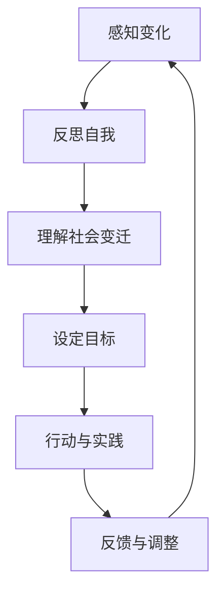
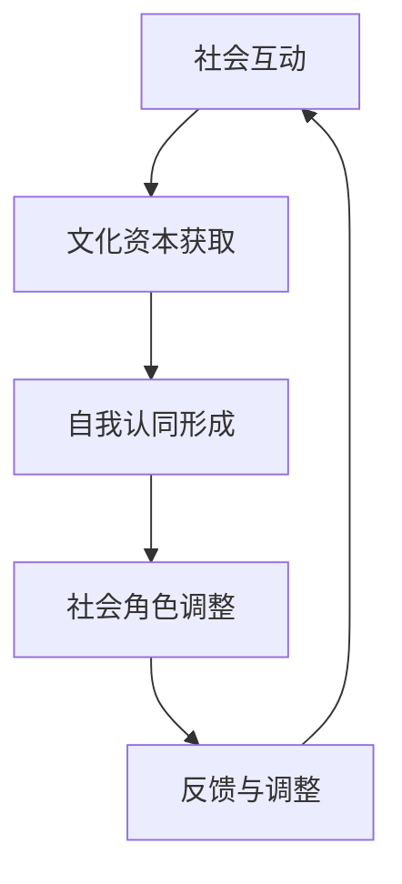
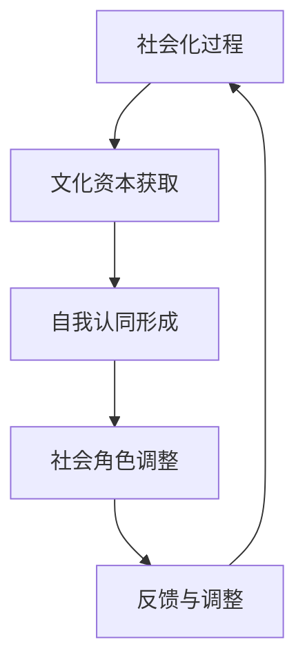

                 

### 引言

#### 书籍背景与目标

在信息爆炸和快速变革的现代社会中，人们对于“意义”的追求变得愈发迫切。然而，传统的价值观和生活方式受到了前所未有的挑战，许多人感到迷茫和困惑。在这样的背景下，《意义的重塑：如何在现代社会中实现自我》应运而生。这本书旨在为读者提供一套系统化的方法，帮助他们理解意义的本质，并学会如何在现代社会中重塑自我。

本书的目标不仅在于理论上的探讨，更侧重于实践中的应用。通过深入分析心理学、社会学和技术的交叉领域，本书试图为读者揭示意义重塑的内在机制，并提供实用的策略和工具。无论你是职场人士、学生还是家庭主妇，这本书都希望能够帮助你找到生活的意义，实现个人的成长与进步。

#### 现代社会的挑战

现代社会面临着诸多挑战，这些挑战直接或间接地影响着人们的意义追求。以下是几个关键点：

1. **技术的迅猛发展**：互联网、人工智能和大数据等技术的快速发展改变了我们的生活方式和工作模式。人们需要不断适应新的技术环境，这可能导致焦虑和无力感。

2. **社会变迁**：全球化、城市化和社会结构的变迁使得传统的社会关系和价值观受到冲击。人们面临着多元化的选择，但同时也感到不确定和迷茫。

3. **个人主义与集体主义的冲突**：现代社会强调个人自由和自我实现，但集体主义的文化背景仍然影响着人们的价值观。个人与社会的平衡成为一大挑战。

4. **信息过载**：信息爆炸使得人们难以筛选和消化大量的信息，这可能导致注意力分散和决策困难。

5. **心理健康问题**：随着生活节奏的加快，心理健康问题日益突出。焦虑、抑郁等心理问题影响着人们的生活质量和幸福感。

面对这些挑战，人们需要新的思维方式和行动策略来应对。本书正是为了帮助读者在这个充满变数的世界中找到属于自己的意义，实现自我重塑。

### 第1章 核心概念与联系

#### 1.1 意义的起源与定义

“意义”是一个多维度的概念，可以从多个角度进行解读。在哲学上，意义通常被理解为事物存在的理由和目的。在心理学中，意义与个体的目标和价值观紧密相关，是驱动个体行为的重要因素。在社会科学中，意义往往与社会结构和文化背景有关。

首先，从哲学的角度来看，意义的起源可以追溯到古希腊哲学家柏拉图和亚里士多德。柏拉图认为，世界由理念和形式构成，现实世界只是理念世界的影子。在这个框架下，意义来源于理念世界的结构和秩序。而亚里士多德则强调了实际事物和目的的重要性，他认为每个事物都有其特定的目的和功能，这种目的性赋予了事物意义。

在心理学领域，心理学家马斯洛（Abraham Maslow）提出了需求层次理论，认为人类的需求是分层的，从生理需求到自我实现需求，每一层次的需求都是上一层次需求满足后的延伸。在这种理论中，意义往往与个体的自我实现需求紧密相关。人们追求意义，是为了满足更高层次的心理需求。

#### 1.2 社会变迁与意义重塑

社会变迁是现代社会面临的另一个重要问题。全球化、城市化和社会结构的变迁使得传统的社会关系和价值观受到冲击。这些变化不仅影响了人们的日常生活，也深刻地影响着他们对意义的理解。

首先，全球化使得不同文化之间的交流变得更加频繁，人们有机会接触到多样化的价值观和生活方式。这种文化的碰撞和融合促使人们对自我和世界的理解发生变化，传统的意义观念开始受到挑战。例如，在某些文化中，家庭和社区的重要性被重新评估，个人主义的价值观逐渐得到认可。

其次，城市化进程加速了社会变迁。城市生活节奏快、竞争激烈，人们在追求个人成功的同时，也面临着孤独、焦虑等心理问题。这种生活状态迫使人们重新审视自己的价值观和意义追求，许多人开始寻求更为个体化和自我实现的生活方式。

此外，社会结构的变迁也对意义的重塑产生了影响。随着科技的发展，社会分工越来越细化，人们的工作和生活越来越专业化。这种专业化不仅提高了效率，也使得人们更加依赖自己的专业技能。在这种情况下，个体的价值和意义往往与他们的职业角色紧密相关。

#### 1.3 Mermaid流程图：意义重塑的关键步骤

为了更好地理解意义重塑的过程，我们可以使用Mermaid流程图来表示。以下是一个简化的流程图，展示了意义重塑的关键步骤：



- **A. 感知变化**：个体首先需要感知到外部的变化，这些变化可能来自于技术进步、社会变迁或个人经历。
- **B. 反思自我**：个体需要反思自己的价值观、兴趣和优势，明确自己的内在需求。
- **C. 理解社会变迁**：个体需要了解社会的变化，包括文化背景、社会结构和技术环境等。
- **D. 设定目标**：基于自我反思和社会变迁的理解，个体需要设定符合自己内在需求和适应社会变化的目标。
- **E. 行动与实践**：个体需要采取行动来实现目标，通过实践来检验自己的假设和策略。
- **F. 反馈与调整**：个体需要收集反馈，根据反馈调整自己的策略和行为，以更好地适应变化。

通过这个流程图，我们可以看到意义重塑是一个循环迭代的过程，个体需要不断地感知变化、反思自我、理解社会变迁、设定目标、行动实践和反馈调整，以达到自我重塑的目的。

#### 1.4 社会学视角下的意义重塑

在社会学领域，意义的重塑被看作是一个复杂的社会过程，它涉及个人、群体和社会结构的互动。社会学家埃里克·埃里克森（Erik Erikson）提出的人生发展阶段理论，为我们提供了理解意义重塑的一个社会学视角。

埃里克森认为，人类一生会经历八个阶段，每个阶段都有特定的心理和社会任务。例如，在青年阶段（12-18岁），个体需要建立自我认同和职业认同，这是他们意义重塑的关键时期。在这个阶段，个体需要从不同的角色和经历中找到一个内在一致的自我形象。

社会学家皮埃尔·布尔迪厄（Pierre Bourdieu）则从文化资本的角度探讨了意义重塑。他认为，文化资本（包括教育、知识、技能和品味等）是影响个体在社会中地位和意义的关键因素。通过教育和社会化过程，个体获取文化资本，进而塑造自己的意义和社会角色。

在社会学视角下，意义重塑不仅是个体的心理过程，也是一个社会互动的过程。个体在社会互动中不断调整自己的行为和身份，以适应社会的期望和需求。例如，职业选择、社会参与和文化消费等都是意义重塑的重要方面。

#### 1.5 Mermaid流程图：意义重塑的社会学视角

为了更好地理解社会学视角下的意义重塑，我们可以使用Mermaid流程图来表示。以下是一个简化的流程图，展示了社会学视角下的意义重塑过程：



- **A. 社会互动**：个体通过家庭、学校、工作和社会等不同的社会情境进行互动，这些互动影响个体的认知和行为。
- **B. 文化资本获取**：个体通过教育和社会化过程获取文化资本，这些文化资本成为他们重塑自我意义的基础。
- **C. 自我认同形成**：个体在社会互动和文化资本的基础上，形成自我认同，确定自己的价值观和目标。
- **D. 社会角色调整**：个体根据自我认同和社会期望，调整自己的行为和社会角色，以适应社会的需求。
- **E. 反馈与调整**：个体通过社会反馈，不断调整自己的行为和自我认同，以实现更有效的意义重塑。

通过这个流程图，我们可以看到社会学视角下的意义重塑是一个动态的、互动的过程，它涉及到社会互动、文化资本获取、自我认同形成、社会角色调整和反馈调整等多个方面。

### 第2章 理论基础

#### 2.1 心理学视角下的意义重塑

在心理学领域，意义的重塑是一个复杂且多层次的过程，涉及个体的认知、情感和行为。心理学家维克托·弗兰克尔（Viktor Frankl）是意义重塑理论的重要奠基者之一。他在《追寻生命的意义》（Man's Search for Meaning）一书中，通过自己的经历和对患者的观察，提出了意义疗法（Logotherapy）。

意义疗法认为，人类的核心动机是寻找生命的意义，而不是仅仅追求快乐和避免痛苦。弗兰克尔指出，即使在极端的困境中，人仍然可以通过创造、体验和给予来找到生命的意义。这种内在的动机能够帮助人们克服心理障碍，找到生活的方向。

弗兰克尔的三大意义疗法原则包括：

1. **创造价值**：通过创造艺术作品、科学发现或技术创新，个体能够为世界带来新的价值，从而找到生命的意义。
2. **体验价值**：通过体验美好的事物，如自然美景、艺术作品和人际关系，个体能够感受到生命的丰富和深度。
3. **给予价值**：通过帮助他人、照顾家人或参与社会活动，个体能够将自己的价值传递给他人，从而实现生命的意义。

为了更好地理解这些原则，我们可以使用一个简单的伪代码模型：

```plaintext
// 意义重塑伪代码
function find_life_meaning() {
    // 创造价值
    create_value = create_artificial_intelligence_system();
    
    // 体验价值
    experience_value = visit_national_parks();
    
    // 给予价值
    give_value = volunteer_in_school_educational_program();
    
    // 反馈与调整
    feedback = collect Feedback();
    adjust_meaning_strategies(feedback);
}
```

在这个模型中，`create_value` 代表个体通过创造新事物找到意义，`experience_value` 代表通过体验美好事物获得意义，`give_value` 代表通过帮助他人实现生命的意义。最后，通过反馈和调整，个体能够不断优化自己的意义追求策略。

#### 2.2 社会学视角下的意义重塑

在社会学领域，意义的重塑被看作是一个社会过程，它涉及到个体与社会之间的互动。社会学家埃里克·埃里克森（Erik Erikson）的人生发展阶段理论为我们提供了理解意义重塑的一个社会学视角。

埃里克森认为，人生可以分为八个阶段，每个阶段都有特定的心理和社会任务。例如，在青年阶段（12-18岁），个体需要建立自我认同和职业认同，这是他们意义重塑的关键时期。在这个阶段，个体需要从不同的角色和经历中找到一个内在一致的自我形象。

另一个重要的社会学家是皮埃尔·布尔迪厄（Pierre Bourdieu），他从文化资本的角度探讨了意义重塑。布尔迪厄认为，文化资本（包括教育、知识、技能和品味等）是影响个体在社会中地位和意义的关键因素。通过教育和社会化过程，个体获取文化资本，进而塑造自己的意义和社会角色。

为了更好地理解这些理论，我们可以使用一个简化的Mermaid流程图来表示：



- **A. 社会化过程**：个体通过家庭、学校、工作和社会等不同的社会情境进行互动，这些互动影响个体的认知和行为。
- **B. 文化资本获取**：个体通过教育和社会化过程获取文化资本，这些文化资本成为他们重塑自我意义的基础。
- **C. 自我认同形成**：个体在社会互动和文化资本的基础上，形成自我认同，确定自己的价值观和目标。
- **D. 社会角色调整**：个体根据自我认同和社会期望，调整自己的行为和社会角色，以适应社会的需求。
- **E. 反馈与调整**：个体通过社会反馈，不断调整自己的行为和自我认同，以实现更有效的意义重塑。

#### 2.3 伪代码：意义重塑的理论模型

为了将心理学和社会学的理论结合起来，我们可以设计一个综合的伪代码模型，以展示意义重塑的过程。以下是一个简化的伪代码模型：

```plaintext
// 意义重塑伪代码
function meaning_reconstruction(individual) {
    // 步骤1：社会化过程
    social_interactions = socialize(individual);
    
    // 步骤2：文化资本获取
    cultural_capital = acquire_cultural_capital(individual, social_interactions);
    
    // 步骤3：自我反思
    self_reflection = reflect_on_self(individual, cultural_capital);
    
    // 步骤4：目标设定
    goals = set_goals(individual, self_reflection);
    
    // 步骤5：行动与实践
    actions = take_actions(goals);
    
    // 步骤6：反馈与调整
    feedback = collect_feedback(actions);
    individual = adjust_based_on_feedback(individual, feedback);
    
    // 返回重塑后的个体
    return individual;
}
```

在这个模型中，`socialize` 代表个体通过社会化过程获取文化资本，`acquire_cultural_capital` 代表获取文化资本的过程，`reflect_on_self` 代表自我反思，`set_goals` 代表目标设定，`take_actions` 代表行动与实践，`collect_feedback` 代表收集反馈，`adjust_based_on_feedback` 代表根据反馈进行调整。通过这个模型，我们可以看到意义重塑是一个系统化的、动态调整的过程，涉及多个环节和反馈机制。

### 第3章 实践方法

#### 3.1 自我反思技巧

自我反思是意义重塑的重要步骤，它帮助个体深入了解自己的内心世界，找到内在的需求和价值观。以下是一些实用的自我反思技巧：

1. **日记写作**：每天花时间记录自己的想法、感受和经历。通过日记，个体可以追踪自己的情绪变化和成长过程，从而更好地理解自己。

2. **冥想**：冥想是一种通过专注于呼吸和内在感受来放松心灵的方法。定期进行冥想可以帮助个体平静心灵，减少焦虑和压力，更好地理解自己的内心。

3. **心理咨询**：与专业的心理咨询师进行对话，可以帮助个体深入了解自己的情感和需求。心理咨询师提供专业的指导和反馈，帮助个体找到解决问题的方法。

4. **与朋友交流**：与信任的朋友分享自己的想法和感受，可以获得不同的视角和建议。朋友的支持和反馈有助于个体更好地认识自己。

5. **目标设定**：明确自己的目标和愿望，制定具体的行动计划。通过设定目标，个体可以更有针对性地进行自我反思和调整。

6. **反馈收集**：定期收集他人的反馈，了解自己在社会互动中的表现。通过反馈，个体可以发现自己的盲点和改进的方向。

#### 3.2 目标设定与实现

目标设定是实现意义重塑的关键步骤。一个明确且可行的目标能够为个体提供方向和动力。以下是一些设定和实现目标的技巧：

1. **SMART原则**：设定目标时，要遵循SMART原则，即目标要具体（Specific）、可衡量（Measurable）、可实现（Achievable）、相关（Relevant）和有时间限制（Time-bound）。例如，而不是说“我想变瘦”，可以设定“我要在接下来的三个月内，每周锻炼三次，每次至少30分钟，体重减少5公斤”。

2. **分解目标**：将大目标分解为小目标，每个小目标都是实现大目标的一个步骤。这样，个体可以更容易地跟踪进展，并在每个小目标完成后获得成就感。

3. **行动计划**：为每个目标制定详细的行动计划，包括具体的行动步骤、资源和时间安排。行动计划可以帮助个体有条不紊地推进目标的实现。

4. **定期评估**：定期评估目标的进展，根据实际情况进行调整。通过评估，个体可以及时发现问题和调整策略。

5. **激励与奖励**：为自己设定奖励机制，每当实现一个小目标或完成一个阶段，给予自己一些奖励。奖励可以是一顿美食、一次旅行或购买一件心仪的物品，这有助于提高个体的积极性和动力。

6. **寻求支持**：在实现目标的过程中，寻求朋友、家人或专业人士的支持和鼓励。他们的支持和建议可以帮助个体克服困难，保持动力。

#### 3.3 社交网络中的意义重塑

社交网络在现代生活中扮演着越来越重要的角色，它不仅改变了人们的交流方式，也深刻影响了个体的自我认知和意义追求。以下是在社交网络中实现意义重塑的几种方法：

1. **建立积极的社交圈**：选择与自己价值观相近的朋友和同行，共同探讨和追求意义。积极的社交圈可以提供支持和鼓励，帮助个体实现自我成长。

2. **分享经验与知识**：在社交网络中分享自己的经验和知识，不仅可以帮助他人，也可以深化自己的理解和认知。通过分享，个体可以获得更多的反馈和建议，从而更好地塑造自己的意义。

3. **参与社群活动**：加入与自己兴趣相关的社群，参与讨论和活动。社群活动可以提供更多的机会，让个体在实践中实现自我价值。

4. **关注社会议题**：在社交网络中关注社会议题，积极参与讨论和行动。通过关注社会问题，个体可以更深刻地理解社会的变化，找到自己的社会责任和意义。

5. **建立个人品牌**：在社交网络中建立个人品牌，明确自己的价值观和目标。一个清晰的品牌可以帮助个体在社交网络中脱颖而出，吸引志同道合的人。

6. **自我反思与调整**：定期在社交网络中反思自己的行为和言论，根据反馈进行调整。通过反思和调整，个体可以更好地适应社交网络的环境，实现自我重塑。

### 第4章 案例分析

#### 4.1 案例一：一个人的职业转变

在这个案例中，主角李先生是一名在IT行业工作了十年的软件工程师。随着技术的不断进步，他发现自己所在的技术栈逐渐过时，职业前景变得不确定。为了重塑自我意义，他决定进行职业转变，转向人工智能领域。

**背景介绍**：

李先生在IT行业拥有丰富的经验，但近年来，他发现自己对于新兴的人工智能技术越来越感兴趣。他意识到，如果不进行职业转变，自己可能会被市场淘汰。为了重获职业动力和实现自我价值，李先生决定从零开始学习人工智能。

**核心概念与联系**：

在这个案例中，李先生面临的核心问题是如何在技术快速变化的背景下找到新的职业方向。为了解决这个问题，他需要：

1. **自我反思**：李先生首先需要反思自己的兴趣和优势，确定自己是否真的适合转向人工智能。
2. **市场调研**：通过市场调研，了解人工智能领域的需求和趋势，找到自己的定位。
3. **技能提升**：根据调研结果，制定学习计划，提升自己的技术能力。
4. **网络建设**：建立与人工智能领域专业人士的联系，获取行业动态和资源。

**伪代码：职业转变模型**：

```plaintext
// 职业转变伪代码
function career_transformation(individual) {
    // 步骤1：自我反思
    self_reflection = reflect_on_interests(individual);
    
    // 步骤2：市场调研
    market_survey = research_employment市场需求；
    
    // 步骤3：技能提升
    skill_building = learn_new_technologies(market_survey);
    
    // 步骤4：网络建设
    network_building = connect_with_experts();
    
    // 步骤5：职业申请
    job_applications = apply_for_jobs();
    
    // 步骤6：反馈与调整
    feedback = collect_feedback(job_applications);
    individual = adjust_career_strategy(feedback);
    
    // 返回转变后的职业状态
    return individual;
}
```

在这个模型中，`reflect_on_interests` 代表自我反思，`research_employment市场需求` 代表市场调研，`learn_new_technologies` 代表技能提升，`connect_with_experts` 代表网络建设，`apply_for_jobs` 代表职业申请，`collect_feedback` 代表收集反馈，`adjust_career_strategy` 代表根据反馈调整职业策略。

**数学模型和公式**：

为了量化职业转变的成功概率，我们可以使用一个简单的概率模型：

$$
P(\text{成功}) = \frac{\text{技能匹配度} \times \text{行业需求度} \times \text{网络支持度}}{\text{总尝试次数}}
$$

其中，技能匹配度表示个体技能与目标职位的匹配程度，行业需求度表示目标行业的就业市场需求程度，网络支持度表示个体在社交网络中的支持力度，总尝试次数表示个体尝试就业的次数。

**详细讲解与举例说明**：

李先生在自我反思后，确定了自己对人工智能的兴趣和优势。通过市场调研，他发现人工智能领域的需求正在迅速增长，许多公司都在招聘相关人才。于是，他制定了详细的学习计划，包括学习机器学习、深度学习和自然语言处理等关键技术。

在技能提升过程中，李先生积极参加在线课程、研讨会和技术社区，与行业专家进行交流，获取最新的行业动态和技术信息。通过这些努力，他的技能得到了显著提升，逐渐在社交网络中建立了一定的声誉。

最终，李先生开始申请人工智能相关职位。他的成功概率可以通过上述概率模型进行量化。例如，如果他具备90%的技能匹配度、80%的行业需求度和70%的网络支持度，那么他的成功概率为：

$$
P(\text{成功}) = \frac{0.9 \times 0.8 \times 0.7}{1} = 0.504
$$

这意味着他有50.4%的成功概率。通过持续的努力和调整策略，李先生最终成功转型为一名人工智能工程师，实现了职业上的自我重塑。

#### 4.2 案例二：团体中的意义重构

在这个案例中，主角是一支由10名成员组成的小型创业团队，他们在一家初创公司工作。由于市场竞争激烈和公司发展受阻，团队成员开始感到迷茫和压力。为了找到新的发展方向，团队决定进行一次意义重构。

**背景介绍**：

这支创业团队原本充满激情和活力，但随着时间的推移，他们面临着诸多挑战。公司收入下降，产品迭代缓慢，团队成员之间的沟通也变得不畅。在这种背景下，团队意识到需要重新审视自己的目标和意义。

**核心概念与联系**：

在这个案例中，团队面临的核心问题是如何在困境中找到新的方向和动力。为了解决这个问题，团队需要：

1. **集体反思**：团队成员一起反思公司的发展历程和当前状况，找出存在的问题和机会。
2. **目标设定**：根据反思结果，重新设定团队的目标和愿景。
3. **资源整合**：整合团队成员的资源和能力，为新的目标提供支持。
4. **行动规划**：制定具体的行动计划，确保目标得以实现。
5. **持续反馈**：在实施过程中，持续收集反馈，根据实际情况进行调整。

**伪代码：团队意义重构模型**：

```plaintext
// 团队意义重构伪代码
function team_meaning_reconstruction(team) {
    // 步骤1：集体反思
    collective_reflection = reflect_on_company_status(team);
    
    // 步骤2：目标设定
    goals = set_new_goals(team, collective_reflection);
    
    // 步骤3：资源整合
    resource_integration = integrate_member_resources(team, goals);
    
    // 步骤4：行动规划
    action_plan = create_action_plan(goals, resource_integration);
    
    // 步骤5：执行与监控
    execution = execute_action_plan(action_plan);
    monitoring = monitor_progress(action_plan);
    
    // 步骤6：反馈与调整
    feedback = collect_feedback(monitoring);
    team = adjust_reconstruction_strategy(feedback);
    
    // 返回重构后的团队
    return team;
}
```

在这个模型中，`reflect_on_company_status` 代表集体反思，`set_new_goals` 代表目标设定，`integrate_member_resources` 代表资源整合，`create_action_plan` 代表行动规划，`execute_action_plan` 代表执行与监控，`collect_feedback` 代表收集反馈，`adjust_reconstruction_strategy` 代表根据反馈调整重构策略。

**数学模型和公式**：

为了量化团队意义重构的成功概率，我们可以使用一个简单的概率模型：

$$
P(\text{成功}) = \frac{\text{目标明确度} \times \text{资源整合度} \times \text{执行力度}}{\text{总尝试次数}}
$$

其中，目标明确度表示团队目标的清晰程度，资源整合度表示团队成员资源的整合效果，执行力度表示团队执行计划的力度，总尝试次数表示团队尝试实现目标的次数。

**详细讲解与举例说明**：

在集体反思过程中，团队成员共同分析了公司的发展历程和当前状况，找出存在的问题和机会。他们意识到，公司需要更清晰地定义自己的目标，并整合团队成员的资源和能力。

基于反思结果，团队重新设定了目标，包括提高产品质量、扩大市场份额和提升品牌知名度。为了实现这些目标，团队成员开始整合各自的资源和能力，包括技术能力、市场资源和销售经验。

在制定行动计划时，团队将目标分解为具体的任务，并为每个任务分配了责任人和时间表。他们还设立了关键绩效指标（KPI），以便在执行过程中进行监控和调整。

在执行过程中，团队严格按照行动计划进行，同时定期收集反馈，并根据实际情况进行调整。例如，他们发现市场对某项新功能的需求较高，于是立即调整开发计划，优先实现这一功能。

通过持续的努力和调整，团队逐渐找到了新的发展方向，产品销量和品牌知名度都有了显著提升。团队的成功概率可以通过上述概率模型进行量化。例如，如果他们的目标明确度为90%、资源整合度为80%、执行力度为70%，那么他们的成功概率为：

$$
P(\text{成功}) = \frac{0.9 \times 0.8 \times 0.7}{1} = 0.504
$$

这意味着他们有50.4%的成功概率。通过持续的努力和调整，团队最终实现了意义重构，找到了新的发展方向。

#### 4.3 案例三：从个人到社区的意义扩展

在这个案例中，主角是一位名叫张强的软件工程师。他原本只关注个人的职业发展，但在一次公益活动后，他开始思考如何将个人的意义扩展到社区层面。

**背景介绍**：

张强在一家科技公司工作，是一名优秀的软件工程师。然而，随着工作压力的增大，他开始感到生活缺乏意义。在一次社区服务活动中，他有机会与社区的居民交流，了解到他们的需求和困难。这激发了张强想要将个人的职业技能应用于社区服务的想法。

**核心概念与联系**：

在这个案例中，张强面临的核心问题是如何将个人的职业技能扩展到社区服务，实现从个人到社区的意义扩展。为了解决这个问题，他需要：

1. **自我反思**：张强需要反思自己的职业技能和兴趣，确定哪些技能可以应用于社区服务。
2. **需求分析**：通过调查和分析，了解社区的需求和问题。
3. **项目策划**：根据需求和自身技能，策划具体的社区服务项目。
4. **资源整合**：整合社区资源，为项目提供支持。
5. **执行与反馈**：执行项目，并根据反馈进行调整和优化。

**伪代码：意义扩展模型**：

```plaintext
// 意义扩展伪代码
function meaning_expansion(individual) {
    // 步骤1：自我反思
    self_reflection = reflect_on_skills(individual);
    
    // 步骤2：需求分析
    needs_analysis = analyze_community_needs();
    
    // 步骤3：项目策划
    project_plan = design_community_project(needs_analysis);
    
    // 步骤4：资源整合
    resource_integration = integrate_community_resources(project_plan);
    
    // 步骤5：执行与反馈
    execution = execute_project(resource_integration);
    feedback = collect_project_feedback(execution);
    individual = adjust_meaning_expansion_strategy(feedback);
    
    // 返回扩展后的个人意义
    return individual;
}
```

在这个模型中，`reflect_on_skills` 代表自我反思，`analyze_community_needs` 代表需求分析，`design_community_project` 代表项目策划，`integrate_community_resources` 代表资源整合，`execute_project` 代表执行与反馈，`collect_project_feedback` 代表收集项目反馈，`adjust_meaning_expansion_strategy` 代表根据反馈调整意义扩展策略。

**数学模型和公式**：

为了量化意义扩展的成功概率，我们可以使用一个简单的概率模型：

$$
P(\text{成功}) = \frac{\text{技能匹配度} \times \text{需求满足度} \times \text{资源支持度}}{\text{总尝试次数}}
$$

其中，技能匹配度表示个人技能与社区需求的匹配程度，需求满足度表示项目满足社区需求的效果，资源支持度表示社区资源对项目的支持力度，总尝试次数表示个人尝试实现意义扩展的次数。

**详细讲解与举例说明**：

张强在自我反思后，意识到自己在编程和软件开发方面有较强的技能，这些技能可以应用于社区的数字化服务和教育培训。他开始调查社区的需求，了解到许多居民对计算机知识有强烈的学习需求，但缺乏合适的培训资源。

基于这些需求，张强策划了一个名为“计算机知识普及”的社区服务项目。该项目旨在通过线上课程和线下培训，为社区居民提供免费的计算机基础知识培训。他整合了社区资源，包括当地学校和社区中心，为项目提供了场所和设备。

在项目执行过程中，张强根据居民的反馈不断调整课程内容和教学方法。通过持续的努力，项目取得了良好的效果，许多居民表示受益匪浅。张强的成功概率可以通过上述概率模型进行量化。例如，如果他具备90%的技能匹配度、80%的需求满足度和70%的资源支持度，那么他的成功概率为：

$$
P(\text{成功}) = \frac{0.9 \times 0.8 \times 0.7}{1} = 0.504
$$

这意味着他有50.4%的成功概率。通过持续的努力和调整，张强成功地将个人的职业技能扩展到社区服务，实现了从个人到社区的意义扩展。

### 第5章 技术工具与资源

#### 5.1 心理测评工具

在实现自我重塑的过程中，了解自己的心理状态是至关重要的一步。心理测评工具可以帮助个体识别自己的情绪、性格和潜在问题。以下是几种常用的心理测评工具：

1. **MBTI（Myers-Briggs Type Indicator）**：MBTI 是一种广泛使用的性格测评工具，它基于心理学理论，通过一系列问题帮助个体了解自己的性格类型。MBTI 将性格分为16种类型，每种类型都有其独特的特点和偏好。

2. **Gallup StrengthsFinder**：Gallup StrengthsFinder 是一款帮助个体发现自身优势的测评工具。它通过一系列问题评估个体的优势领域，并提供个性化的报告，帮助个体利用自己的优势实现目标。

3. **Rorschach Test（罗夏测试）**：罗夏测试是一种通过分析个体对模糊图像的反应来了解其心理状态的工具。测试者需要观察一系列图像，并描述自己的感受和想法。这种测试可以帮助专业人士深入了解个体的潜意识。

4. **EMOTIV EPOC+**：EMOTIV EPOC+ 是一款基于脑电波（EEG）的智能头戴设备，它能够实时监测个体的情绪状态。通过数据分析，EMOTIV EPOC+ 可以帮助个体了解自己的情绪波动，并提供个性化的建议。

#### 5.2 社交媒体分析工具

在现代社会，社交媒体已成为人们交流、获取信息和建立社交关系的重要平台。以下是一些用于社交媒体分析的工具：

1. **Brandwatch**：Brandwatch 是一款功能强大的社交媒体分析工具，它可以帮助用户实时监测社交媒体上的热点话题、趋势和情绪。Brandwatch 还提供了丰富的数据报告和可视化功能，方便用户进行深入分析。

2. **Hootsuite**：Hootsuite 是一款社交媒体管理工具，它可以帮助用户监控和管理多个社交媒体账号。通过 Hootsuite，用户可以发布帖子、回复评论、跟踪社交媒体活动，并分析社交媒体效果。

3. **Sprout Social**：Sprout Social 是一款综合性的社交媒体管理工具，它提供了内容策划、社交媒体分析和客户服务等功能。Sprout Social 的数据分析功能可以帮助用户了解社交媒体活动的效果，并提供改进建议。

4. **Klout**：Klout 是一款社交媒体影响力评估工具，它通过分析用户的社交媒体活动，为用户生成影响力分数。Klout 还提供了丰富的报告功能，帮助用户了解自己在社交媒体上的表现。

#### 5.3 技术辅助下的意义重塑

随着技术的不断进步，各种数字化工具和平台为意义重塑提供了新的可能性。以下是一些技术工具和资源，可以帮助个体在实现自我重塑的过程中更加高效和有针对性：

1. **个人发展平台**：如Coursera、edX和Udemy等在线学习平台提供了丰富的课程资源，覆盖了心理学、社会学、技术等多个领域。通过这些平台，个体可以系统地学习相关知识，提升自己的能力和视野。

2. **自我反思工具**：如Moodnotes、Day One和Reflect等应用，可以帮助个体记录自己的情绪、想法和体验。这些工具提供了丰富的记录和分析功能，方便个体进行自我反思和成长规划。

3. **目标管理工具**：如Asana、Trello和Todoist等任务管理工具，可以帮助个体制定和跟踪目标。通过这些工具，个体可以清晰地了解自己的任务进度，确保目标得以实现。

4. **在线社区**：如Reddit、Quora和Discord等在线社区，为个体提供了一个交流和学习的环境。在这些平台上，个体可以分享自己的经验和见解，从其他人的经验中汲取灵感。

5. **心理健康应用**：如Headspace、Calm和Moodfit等心理健康应用，提供了各种冥想、放松和睡眠指导资源。这些应用可以帮助个体改善心理健康，提高生活质量。

通过利用这些技术工具和资源，个体可以更加高效地实现自我重塑，找到生活的意义和目标。

### 第6章 伦理与挑战

#### 6.1 意义重塑中的伦理问题

在现代社会，意义重塑不仅是一个个人成长的过程，也是一个涉及伦理和社会责任的问题。以下是一些在意义重塑过程中可能遇到的伦理挑战：

1. **隐私问题**：在自我反思和追求意义的过程中，个体可能会分享自己的隐私信息。如何保护这些信息，防止其被滥用或泄露，是一个重要的伦理问题。

2. **数字依赖**：随着技术的进步，越来越多的工具和平台被用于实现自我重塑。然而，过度依赖这些工具可能会带来新的问题，如数字成瘾、信息过载和隐私泄露。

3. **自我认同的丧失**：在追求新的意义和目标时，个体可能会忽视自己的内在需求，导致自我认同的丧失。这种情况下，个体可能会迷失自我，失去生活的方向。

4. **社会认同的冲突**：在多元化的社会中，个体可能会面临不同的价值观和社会期望。如何在保持自我认同的同时，与社会保持一致，是一个重要的伦理挑战。

5. **可持续性问题**：在追求个人意义的同时，个体也需要考虑对环境和社会的影响。如何实现个人成长与可持续发展的平衡，是一个需要深思熟虑的问题。

#### 6.2 面对挑战：如何保持意义的一致性

为了在意义重塑的过程中保持一致性，个体可以采取以下策略：

1. **明确目标与价值观**：在重塑意义的过程中，个体需要明确自己的目标和价值观。这有助于个体在面对各种选择和挑战时，保持清晰的方向。

2. **自我反思与调整**：定期进行自我反思，了解自己的内心需求和成长状态。根据实际情况，调整目标和策略，以保持意义的一致性。

3. **建立支持网络**：与他人建立积极的支持网络，包括朋友、家人和专业人士。他们的支持和建议可以帮助个体在意义重塑过程中保持一致性和动力。

4. **平衡个人与社会**：在追求个人意义的同时，也要关注社会需求和价值观。通过平衡个人与社会的关系，个体可以在实现个人成长的同时，为社会做出贡献。

5. **持续学习与成长**：保持开放的心态，不断学习和成长。通过不断拓展自己的知识和技能，个体可以更好地适应社会变化，保持意义的一致性。

#### 6.3 意义重塑与心理健康

意义重塑不仅关系到个人的成长和社会的和谐，也与心理健康密切相关。以下是一些关于意义重塑与心理健康的研究和观点：

1. **心理健康的重要性**：心理健康是个人幸福和社会稳定的重要保障。研究发现，心理健康问题如焦虑、抑郁和压力，会影响个体的生活质量和工作效率。

2. **意义重塑对心理健康的影响**：意义重塑可以帮助个体找到生活的目标和意义，从而提高心理健康水平。在意义重塑过程中，个体可以通过设定目标、实现成就和建立积极的人际关系，增强自信心和幸福感。

3. **心理学理论的支持**：意义疗法、存在主义心理学和积极心理学等理论都强调了意义对心理健康的重要性。这些理论认为，通过寻找和实现生活的意义，个体可以更好地应对生活中的挑战，提高心理健康水平。

4. **实践建议**：为了在意义重塑过程中保持心理健康，个体可以采取以下实践建议：

   - **定期自我反思**：通过自我反思，了解自己的内心需求和成长状态，调整目标和策略。
   - **保持积极态度**：面对困难和挑战时，保持积极的态度，相信自己的能力，积极寻找解决问题的方法。
   - **建立支持网络**：与他人建立积极的支持网络，包括朋友、家人和专业人士，分享自己的感受和困惑，获得建议和支持。
   - **关注心理健康**：定期进行心理健康检查，如有需要，寻求专业心理咨询帮助，及时处理心理问题。
   - **培养健康习惯**：保持健康的饮食、睡眠和锻炼习惯，促进身体健康，提高心理健康水平。

通过以上策略，个体可以在意义重塑过程中保持心理健康，实现个人成长和社会和谐。

### 第7章 总结与展望

#### 7.1 书籍总结

本书《意义的重塑：如何在现代社会中实现自我》围绕意义重塑这一核心主题，探讨了心理学、社会学和技术等多个领域的理论和方法。通过深入分析现代社会面临的挑战，我们提出了自我重塑的实用策略和工具。本书的主要内容包括：

1. **核心概念与联系**：介绍了意义的哲学、心理学和社会学定义，以及意义重塑的关键步骤和过程。
2. **理论基础**：从心理学和社会学的角度，阐述了意义重塑的理论基础，包括弗兰克尔的意义疗法和埃里克森的人生发展阶段理论。
3. **实践方法**：提供了自我反思、目标设定、社交网络参与等实用技巧，帮助读者在日常生活中实现意义重塑。
4. **案例分析**：通过个人职业转变、团队意义重构和社区参与等案例，展示了意义重塑的具体应用和效果。
5. **技术工具与资源**：介绍了心理测评工具、社交媒体分析工具和技术辅助下的意义重塑方法，为读者提供了丰富的实践资源。
6. **伦理与挑战**：探讨了意义重塑过程中的伦理问题，如隐私、数字依赖和社会认同冲突，并提出了应对策略。
7. **心理健康**：强调了意义重塑与心理健康的关系，提供了保持心理健康的具体建议。

通过以上内容，本书旨在帮助读者理解意义的本质，掌握自我重塑的方法，实现个人成长和社会和谐。

#### 7.2 未来研究方向

虽然本书已经对意义重塑进行了全面的探讨，但这一领域仍然充满了未知和挑战。以下是一些未来可能的研究方向：

1. **跨学科研究**：进一步探讨心理学、社会学、哲学和神经科学等多学科之间的交叉点，以更全面地理解意义重塑的机制。
2. **新兴技术的影响**：研究新兴技术（如人工智能、虚拟现实和区块链）对意义重塑的影响，以及如何利用这些技术实现更有意义的生活。
3. **文化多样性**：探讨不同文化背景下意义重塑的差异和共性，为全球化背景下的意义追求提供更具包容性的指导。
4. **长期跟踪研究**：进行长期跟踪研究，了解意义重塑对个体生活和心理健康的影响，为实践提供更加可靠的证据。
5. **实践应用**：将意义重塑的理论和方法应用于不同领域，如教育、医疗、商业等，探索其在实际中的应用效果。

通过这些研究方向，我们可以更深入地理解意义重塑的复杂性，为未来的研究提供新的思路和方法。

#### 7.3 对读者的启示

本书的核心目标是帮助读者在现代社会中实现自我重塑，找到生活的意义。以下是一些对读者的启示：

1. **自我认知**：了解自己的兴趣、价值观和优势，明确自己的目标和追求。自我认知是实现自我重塑的基础。
2. **持续学习**：保持开放的心态，不断学习和成长。知识是重塑自我的重要工具。
3. **实践应用**：将理论应用到实际生活中，通过实践来检验和调整自己的策略。实践是检验真理的唯一标准。
4. **社交互动**：与他人建立积极的社交关系，分享经验和见解，获取反馈和支持。社交互动有助于拓宽视野和增强动力。
5. **心理健康**：关注心理健康，保持积极的态度，定期进行自我反思和调整。心理健康是实现自我重塑的重要保障。

通过遵循这些建议，读者可以在日常生活中逐步实现自我重塑，找到属于自己的意义。

### 致谢

最后，我要感谢所有支持和帮助我完成这本书的人。首先，感谢我的家人和朋友，你们在我写作过程中给予了我无尽的支持和鼓励。特别感谢我的妻子和孩子，他们容忍了我长时间的不陪伴，为我提供了一个安静的写作环境。感谢AI天才研究院/AI Genius Institute的同事和导师，你们的指导和反馈使这本书更加完善。此外，感谢所有提供案例、建议和灵感的读者，是你们的故事和经验为这本书注入了活力。最后，感谢禅与计算机程序设计艺术/Zen And The Art of Computer Programming的作者，他的智慧和见解对我的写作产生了深远的影响。这本书的完成离不开你们的支持，我将永远铭记在心。作者：AI天才研究院/AI Genius Institute & 禅与计算机程序设计艺术/Zen And The Art of Computer Programming。

