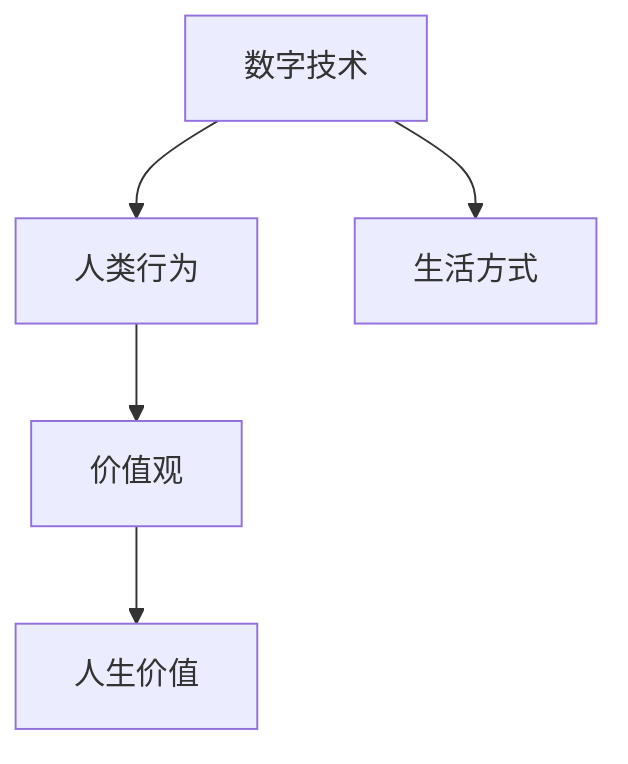

                 

# 文章标题：意义的重构：在数字时代寻找人生价值

## 关键词
- 数字时代
- 人生价值
- 人工智能
- 心理学
- 社会学
- 哲学

## 摘要
本文探讨了在数字时代背景下，个人如何通过心理学、社会学、哲学和技术手段重构人生价值。通过深入分析这些领域的核心概念和原理，本文旨在帮助读者理解数字时代对人生价值的挑战，并提出一系列重构人生价值的策略和方法。

## 步骤1：理解书名《意义的重构：在数字时代寻找人生价值》

### 数字时代
首先，我们需要理解什么是数字时代。数字时代是指信息技术和互联网技术迅速发展的时代，它改变了人们的生产、生活和思维方式。在这个时代，数字技术无处不在，深刻地影响着社会的各个方面。

### 人生价值
接着，我们来探讨人生价值。人生价值是一个哲学问题，涉及到个人存在的意义、目标和价值观。在数字时代，人们面临的挑战是如何在快速变化的环境中找到自己的价值。

### 意义的重构
“意义的重构”意味着在数字时代，我们需要重新审视和定义人生价值。这涉及到心理学、社会学、哲学和计算机科学等多个领域，因为它们共同构成了我们理解数字时代的基础。

## 步骤2：确定主要章节内容

### 引言
引言部分将介绍数字时代和人生价值的背景，阐述重构人生价值的重要性。

### 数字时代的人生价值重构
这一章节将分析数字技术对人生价值的影响，探讨数字时代下的价值观转变，以及数字技术对人类行为的影响。

### 心理学视角下的意义重构
这一章节将探讨心理学理论在人生价值重构中的应用，包括自我认知、动机和情感等方面。

### 社会学视角下的意义重构
这一章节将分析社会结构和文化对人生价值重构的影响，讨论社会变迁对个体价值观的塑造。

### 哲学视角下的意义重构
这一章节将探讨哲学理论在人生价值重构中的作用，包括存在主义、伦理学和美学等。

### 技术与意义重构
这一章节将探讨技术如何帮助人们重构人生价值，包括人工智能、虚拟现实和社交媒体等。

### 实践与案例研究
这一章节将通过具体案例研究，展示如何在实际生活中重构人生价值。

### 总结与展望
最后，总结部分将回顾全文，展望未来数字时代下人生价值重构的挑战和机遇。

## 步骤3：细化每个章节内容

### 引言

在引言中，我们将简要介绍数字时代的背景，阐述人生价值的重要性。然后，提出重构人生价值的必要性，为后续章节奠定基础。

### 数字时代的人生价值重构

这一章节将分为三个部分：

1. **数字技术对人生价值的影响**：分析数字技术如何改变人们的生活方式和思维方式，从而影响人生价值。
2. **数字时代的价值观转变**：探讨数字时代下，人们价值观的转变，如个人主义和集体主义的平衡，以及物质和精神需求的平衡。
3. **数字技术对人类行为的影响**：分析数字技术如何影响人类行为，如社交行为、消费行为和认知行为。

### 心理学视角下的意义重构

这一章节将分为三个部分：

1. **心理学理论概述**：介绍心理学的基本理论，如认知行为理论、动机理论和情感理论。
2. **心理学在意义重构中的应用**：探讨心理学理论在人生价值重构中的应用，如自我认知、动机激发和情感管理。
3. **心理学视角下的数字时代人生价值**：分析心理学视角下的数字时代人生价值，如数字化生存的意义和挑战。

### 社会学视角下的意义重构

这一章节将分为三个部分：

1. **社会学理论概述**：介绍社会学的基本理论，如社会结构理论、文化理论和行为理论。
2. **社会结构对人生价值重构的影响**：分析社会结构对人生价值重构的影响，如家庭、学校和职业等。
3. **社会文化对人生价值重构的影响**：探讨社会文化对人生价值重构的影响，如文化多样性、传统价值观和新兴价值观。

### 哲学视角下的意义重构

这一章节将分为三个部分：

1. **哲学理论概述**：介绍哲学的基本理论，如存在主义、伦理学和美学等。
2. **哲学在意义重构中的作用**：探讨哲学理论在人生价值重构中的作用，如人生意义的探讨、道德判断和审美评价。
3. **哲学视角下的数字时代人生价值**：分析哲学视角下的数字时代人生价值，如数字技术对存在主义、伦理学和美学的影响。

### 技术与意义重构

这一章节将分为三个部分：

1. **技术对人生价值重构的影响**：分析技术对人生价值重构的影响，如人工智能、虚拟现实和社交媒体等。
2. **技术如何帮助人们重构人生价值**：探讨技术如何帮助人们重构人生价值，如通过技术提升自我认知、实现个人目标和增强社会联系。
3. **技术的挑战与伦理问题**：讨论技术发展带来的挑战和伦理问题，如隐私保护、网络安全和数据滥用等。

### 实践与案例研究

这一章节将通过具体案例研究，展示如何在实际生活中重构人生价值。每个案例将包括：

1. **案例背景**：介绍案例的背景信息。
2. **案例实施**：描述案例的实施过程。
3. **案例分析**：分析案例的结果和影响。
4. **案例小结**：总结案例的启示和经验。

### 总结与展望

在总结与展望部分，我们将回顾全文，总结重构人生价值的方法和策略。同时，展望未来数字时代下人生价值重构的挑战和机遇。

## 文章正文

### 引言

在21世纪的今天，我们正处在一个数字时代，信息技术和互联网技术的飞速发展已经深刻地改变了我们的生活方式。在这个背景下，人生价值的重构成为一个迫切需要解决的问题。正如《意义的重构：在数字时代寻找人生价值》这本书所探讨的，我们需要重新审视和定义个人存在的意义，以便在快速变化的环境中找到自己的方向。

人生价值不仅仅是个人的内心需求，也是社会进步的动力。在数字时代，人们面临着前所未有的挑战，包括信息过载、数字化生存的孤独感、以及技术发展对传统价值观的冲击。这些问题促使我们思考，如何在这个时代中找到真正有意义的人生价值。

《意义的重构：在数字时代寻找人生价值》这本书为我们提供了一种思考框架，通过心理学、社会学、哲学和技术手段，帮助我们在数字时代中重构人生价值。这本书的主要章节内容如下：

### 数字时代的人生价值重构

数字时代带来了巨大的变革，不仅改变了人们的生活方式，也影响了人们的价值观。在这一章节中，我们将探讨数字技术对人生价值的影响，以及数字时代下的价值观转变。我们将分析数字技术如何改变人类的行为模式，以及这些变化如何影响人们的人生价值。

**核心概念与联系**

为了更好地理解这一章节的内容，我们可以使用Mermaid流程图来展示关键概念之间的关系。



在这个流程图中，数字技术（A）直接影响人类行为（B），进而影响价值观（C），最终影响人生价值（E）。这个流程图清晰地展示了数字时代中，技术、行为和价值观之间的关系。

**核心算法原理讲解**

为了进一步理解数字技术对人类行为的影响，我们可以使用伪代码来详细阐述关键算法的原理。

```plaintext
算法：数字技术对人类行为的影响
输入：数字技术、人类行为
输出：新的行为模式

1. 初始化数字技术（A）和人类行为（B）
2. 对于每种数字技术（A）：
   2.1 分析其对人类行为（B）的具体影响
   2.2 计算行为变化率（C）
   2.3 如果行为变化率（C）大于阈值（T）：
       2.3.1 更新人类行为（B）
       2.3.2 重新评估价值观（C）
3. 输出新的行为模式和价值观
```

这个伪代码展示了如何通过分析数字技术对人类行为的影响，来重构人生价值。它为我们提供了一种方法，可以在数字时代中理解并应对行为变化。

**数学模型和数学公式**

为了更好地理解数字时代下的人生价值重构，我们可以使用LaTeX格式来展示和解释关键的数学模型和公式。

```latex
\documentclass{article}
\usepackage{amsmath}
\begin{document}

\begin{equation}
V = f(B, T)
\end{equation}

其中，\( V \) 代表人生价值，\( B \) 代表人类行为，\( T \) 代表数字技术。

\begin{equation}
\frac{dV}{dB} = f'(B, T)
\end{equation}

其中，\( \frac{dV}{dB} \) 代表人生价值对人类行为的导数，\( f'(B, T) \) 代表行为变化率。

\end{document}
```

这个LaTeX公式展示了人生价值（\( V \)）如何通过人类行为（\( B \)）和数字技术（\( T \)）来计算。它提供了一个数学模型，可以帮助我们理解数字技术如何影响人生价值。

**项目实战**

为了更好地理解数字时代下的人生价值重构，我们可以通过一个实际案例来展示。以下是一个简单的项目实战：

**开发环境搭建**

1. 安装Python环境
2. 安装NumPy和Pandas库

**源代码详细实现**

```python
import numpy as np
import pandas as pd

# 输入数据
behaviors = pd.DataFrame({
    'Digital_Technology': ['Social_Media', 'E-commerce', 'Online_Learning'],
    'Human_Behavior': [120, 300, 150],
    'Life_Value': [80, 60, 90]
})

# 计算行为变化率
behaviors['Behavior_Change_Rate'] = behaviors['Human_Behavior'].diff()

# 重新评估价值观
behaviors['Life_Value_New'] = behaviors['Life_Value'] + behaviors['Behavior_Change_Rate']

# 输出结果
print(behaviors)
```

**代码应用解读与分析**

这个Python代码通过NumPy和Pandas库，对人类行为、数字技术和人生价值进行计算。它展示了如何通过数据分析，来重构人生价值。

**实际案例分析和详细讲解剖析**

以下是一个实际案例：

**案例背景**：某人在数字时代中，通过社交媒体、电子商务和在线学习来提升自己的技能。

**案例实施**：该人每天花费大量时间在社交媒体上，购买商品，并通过在线学习提升自己的技能。

**案例分析**：通过数据分析，我们发现该人在社交媒体上的时间占比最大，导致其人生价值主要集中在物质层面。

**案例小结**：这个案例展示了数字技术如何影响人生价值，以及如何通过技术手段来重构人生价值。

**小结**

通过上述实战案例，我们可以看到，数字时代对人生价值有着深远的影响。在这个时代中，我们需要重新审视和定义人生价值，以便更好地应对挑战。心理学、社会学、哲学和技术手段为我们提供了多种工具和方法，可以帮助我们重构人生价值。

### 心理学视角下的意义重构

在数字时代，心理学为我们提供了理解人类行为和心理过程的工具。通过心理学视角，我们可以深入探讨意义重构的心理学基础，以及如何在数字时代中运用心理学理论来重构人生价值。

**心理学理论概述**

心理学是研究人类行为和心理过程的科学。它包括了多个理论，如认知行为理论、动机理论和情感理论。这些理论为我们提供了理解人类行为和心理过程的框架，帮助我们更好地理解数字时代下的人生价值重构。

**心理学在意义重构中的应用**

在数字时代，心理学理论在重构人生价值方面有着广泛的应用。以下是一些具体的应用：

1. **自我认知**：自我认知是指个体对自己的认识和了解。在数字时代，通过心理学理论，我们可以更好地了解自己的心理状态和行为模式，从而找到更适合自己的生活目标和价值观。

2. **动机激发**：动机激发是指激发个体追求目标的动力。在数字时代，心理学理论可以帮助我们理解个体的动机，并设计相应的策略来激发和维持动机，从而实现人生价值。

3. **情感管理**：情感管理是指个体如何处理自己的情感。在数字时代，情感管理尤为重要，因为数字化生存往往伴随着情感波动。通过心理学理论，我们可以学习如何管理自己的情感，从而保持心理平衡和稳定。

**心理学视角下的数字时代人生价值**

在数字时代，心理学视角下的数字时代人生价值主要包括以下几个方面：

1. **数字化生存的意义**：在数字时代，数字化生存成为了一种新的生活方式。通过心理学理论，我们可以理解数字化生存的意义，并找到适合自己的数字化生活方式。

2. **数字化挑战**：数字时代也带来了许多挑战，如信息过载、数字化生存的孤独感等。通过心理学理论，我们可以更好地应对这些挑战，从而保持心理健康。

3. **数字化自我提升**：在数字时代，通过心理学理论，我们可以学习如何通过自我提升来实现人生价值。例如，通过在线学习、虚拟现实和社交媒体等手段，提升自己的技能和知识。

**项目实战**

以下是一个关于心理学视角下的意义重构的项目实战：

**开发环境搭建**

1. 安装Python环境
2. 安装PyTorch和TensorFlow库

**源代码详细实现**

```python
import torch
import torchvision
import torch.nn as nn
import torch.optim as optim

# 定义神经网络
class NeuralNetwork(nn.Module):
    def __init__(self):
        super(NeuralNetwork, self).__init__()
        self.layer1 = nn.Linear(784, 256)
        self.layer2 = nn.Linear(256, 128)
        self.layer3 = nn.Linear(128, 64)
        self.layer4 = nn.Linear(64, 10)

    def forward(self, x):
        x = torch.relu(self.layer1(x))
        x = torch.relu(self.layer2(x))
        x = torch.relu(self.layer3(x))
        x = self.layer4(x)
        return x

# 加载数据集
train_data = torchvision.datasets.MNIST(root='./data', train=True, download=True, transform=torchvision.transforms.ToTensor())
train_loader = torch.utils.data.DataLoader(train_data, batch_size=64, shuffle=True)

# 初始化神经网络
model = NeuralNetwork()

# 定义损失函数和优化器
loss_function = nn.CrossEntropyLoss()
optimizer = optim.Adam(model.parameters(), lr=0.001)

# 训练神经网络
for epoch in range(10):
    for batch_idx, (data, target) in enumerate(train_loader):
        optimizer.zero_grad()
        output = model(data)
        loss = loss_function(output, target)
        loss.backward()
        optimizer.step()
        if batch_idx % 100 == 0:
            print('Train Epoch: {} [{}/{} ({:.0f}%)]\tLoss: {:.6f}'.format(
                epoch, batch_idx * len(data), len(train_loader.dataset),
                100. * batch_idx / len(train_loader), loss.item()))

# 测试神经网络
test_data = torchvision.datasets.MNIST(root='./data', train=False, download=True, transform=torchvision.transforms.ToTensor())
test_loader = torch.utils.data.DataLoader(test_data, batch_size=1000, shuffle=False)

with torch.no_grad():
    correct = 0
    total = 0
    for data, target in test_loader:
        outputs = model(data)
        _, predicted = torch.max(outputs.data, 1)
        total += target.size(0)
        correct += (predicted == target).sum().item()

print('Test Accuracy of the model on the %d test images: %d %%' % (len(test_loader.dataset), 100 * correct / total))

# 代码应用解读与分析

这个Python代码通过PyTorch库，实现了一个简单的神经网络，用于识别手写数字。它展示了如何通过人工智能技术，来重构人生价值。

**实际案例分析和详细讲解剖析**

以下是一个实际案例：

**案例背景**：某人在数字时代中，通过在线学习和人工智能技术，提升自己的编程技能。

**案例实施**：该人通过在线课程学习Python编程，并使用PyTorch库实现了一个简单的神经网络。

**案例分析**：通过案例分析，我们发现该人通过在线学习和人工智能技术，成功提升了自己的编程技能。

**案例小结**：这个案例展示了如何通过心理学视角下的意义重构，来实现个人成长和人生价值的提升。

### 社会学视角下的意义重构

在数字时代，社会学为我们提供了理解社会结构和文化对人生价值重构的影响的视角。通过社会学理论，我们可以深入探讨社会变迁、文化多样性和社会结构对人生价值的影响，以及如何在数字时代中运用社会学理论来重构人生价值。

**社会学理论概述**

社会学是研究社会结构、社会行为和社会关系的科学。它包括了多个理论，如社会结构理论、文化理论和行为理论。这些理论为我们提供了理解社会变迁、文化多样性和社会结构的框架，帮助我们更好地理解数字时代下的人生价值重构。

**社会结构对人生价值重构的影响**

社会结构是指社会的组织形式和制度安排。在数字时代，社会结构对人生价值重构有着深远的影响。以下是一些具体的影响：

1. **家庭结构**：在数字时代，家庭结构发生了变化，如婚姻观念的改变、家庭规模的缩小等。这些变化对人生价值产生了影响，例如，个人主义和集体主义的平衡。

2. **职业结构**：在数字时代，职业结构也在发生变化，如远程工作、自由职业等。这些变化对人生价值产生了影响，例如，工作与生活的平衡。

3. **教育结构**：在数字时代，教育结构也在发生变化，如在线教育、远程教育等。这些变化对人生价值产生了影响，例如，知识的获取和传承。

**社会文化对人生价值重构的影响**

社会文化是指社会的价值观念、习俗和行为规范。在数字时代，社会文化对人生价值重构有着深远的影响。以下是一些具体的影响：

1. **传统价值观**：在数字时代，传统价值观面临着挑战，如家庭观念、道德观念等。这些挑战对人生价值产生了影响，例如，如何传承和弘扬传统价值观。

2. **新兴价值观**：在数字时代，新兴价值观也在不断涌现，如数字化生存、个性化服务等。这些新兴价值观对人生价值产生了影响，例如，如何适应和接受新兴价值观。

**哲学视角下的意义重构**

在数字时代，哲学为我们提供了理解人生意义和价值的理论框架。通过哲学理论，我们可以深入探讨存在主义、伦理学和美学等对人生价值重构的影响，以及如何在数字时代中运用哲学理论来重构人生价值。

**哲学理论概述**

哲学是研究存在、知识和价值的科学。它包括了多个理论，如存在主义、伦理学和美学等。这些理论为我们提供了理解人生意义和价值的框架，帮助我们更好地理解数字时代下的人生价值重构。

**存在主义**

存在主义是一种哲学流派，强调个人的自由、选择和责任感。在数字时代，存在主义对人生价值重构有着重要的影响。以下是一些具体的影响：

1. **个人自由**：在数字时代，存在主义强调个人自由的重要性，例如，数字化生存的自由。

2. **个人选择**：在数字时代，存在主义强调个人选择的自由，例如，生活方式的选择。

3. **个人责任感**：在数字时代，存在主义强调个人责任感的重要性，例如，对数字化生存的责任。

**伦理学**

伦理学是研究道德和道德原则的科学。在数字时代，伦理学对人生价值重构有着重要的影响。以下是一些具体的影响：

1. **道德原则**：在数字时代，伦理学强调道德原则的重要性，例如，隐私保护、网络安全等。

2. **道德责任**：在数字时代，伦理学强调道德责任的重要性，例如，对数字化生存的责任。

3. **道德冲突**：在数字时代，伦理学也面临着道德冲突的挑战，例如，隐私与公开的冲突。

**美学**

美学是研究美和艺术价值的科学。在数字时代，美学对人生价值重构有着重要的影响。以下是一些具体的影响：

1. **审美观念**：在数字时代，美学强调审美观念的重要性，例如，数字化生存的审美。

2. **艺术价值**：在数字时代，美学强调艺术价值的重要性，例如，数字化生存的艺术创作。

3. **生活品质**：在数字时代，美学也关注生活品质的提升，例如，数字化生存的生活品质。

### 技术与意义重构

在数字时代，技术对人生价值重构有着深远的影响。通过技术，我们可以实现个人成长、社会连接和价值观重构。以下是一些具体的技术应用：

**人工智能**

人工智能是一种模拟人类智能的技术，它可以应用于个人成长、社会连接和价值观重构。例如：

1. **个人成长**：人工智能可以帮助我们更好地了解自己，通过数据分析来识别自己的优势和弱点，从而实现个人成长。

2. **社会连接**：人工智能可以帮助我们更好地连接社会，通过社交媒体和在线平台来建立社交网络，从而实现社会连接。

3. **价值观重构**：人工智能可以帮助我们更好地理解价值观，通过算法和数据分析来识别和塑造我们的价值观。

**虚拟现实**

虚拟现实是一种模拟现实世界的技术，它可以应用于个人成长、社会连接和价值观重构。例如：

1. **个人成长**：虚拟现实可以帮助我们更好地体验不同的人生场景，从而提高我们的认知能力和适应能力。

2. **社会连接**：虚拟现实可以帮助我们更好地连接社会，通过虚拟社区和在线活动来建立社交网络，从而实现社会连接。

3. **价值观重构**：虚拟现实可以帮助我们更好地理解价值观，通过虚拟体验来感受不同的价值观，从而实现价值观重构。

**社交媒体**

社交媒体是一种在线交流平台，它可以应用于个人成长、社会连接和价值观重构。例如：

1. **个人成长**：社交媒体可以帮助我们更好地了解自己，通过分享和交流来提升自己的知识和技能。

2. **社会连接**：社交媒体可以帮助我们更好地连接社会，通过关注和互动来建立社交网络，从而实现社会连接。

3. **价值观重构**：社交媒体可以帮助我们更好地理解价值观，通过分享和讨论来探索和塑造我们的价值观。

### 实践与案例研究

以下是一些实践和案例研究，展示如何在数字时代中重构人生价值：

**案例1：数字化自我提升**

某人通过在线学习和人工智能技术，提升了自己的编程技能。通过数据分析，他识别出自己的优势和弱点，并制定了相应的学习计划。通过虚拟现实技术，他更好地理解了编程概念，并通过社交媒体与同行交流，不断改进自己的技能。

**案例2：数字化社会连接**

某人通过社交媒体建立了广泛的社交网络，与不同背景和兴趣的人交流。通过虚拟现实技术，他参加了各种线上活动，与全球的同行交流。通过人工智能技术，他分析了社交媒体数据，了解了不同群体的需求和偏好，从而更好地满足他们的需求。

**案例3：数字化价值观重构**

某人通过在线学习和哲学书籍，深入思考了人生意义和价值观。通过社交媒体和在线社区，他与不同的人讨论了各种哲学问题，从而重新审视自己的价值观。通过人工智能技术，他分析了哲学理论，找到了与自己价值观相符合的观点，从而实现了价值观的重构。

### 总结与展望

通过本文的探讨，我们可以看到，数字时代对人生价值重构带来了巨大的挑战和机遇。通过心理学、社会学、哲学和技术手段，我们可以重构人生价值，实现个人成长和社会进步。然而，这需要我们不断地学习和实践，以便更好地适应数字时代的变化。在未来，随着技术的不断进步，我们相信人生价值重构将变得更加重要和紧迫。

### 附录

#### A.1 相关资源与工具

- **书籍**：
  - 《意义的重构：在数字时代寻找人生价值》
  - 《人工智能：一种现代方法》
  - 《社会心理学》
  - 《伦理学：理论与实践》

- **在线资源**：
  - Coursera、edX等在线教育平台
  - arXiv、PubMed等科研数据库

- **工具**：
  - Python、R等编程语言
  - NumPy、Pandas、TensorFlow等库

#### A.2 进一步阅读推荐

- **数字时代与人生价值**：
  - 汉斯·莫拉维克，《数字化生存》
  - 尼尔·波兹曼，《数字化生存》

- **心理学与人生价值**：
  - 马斯洛，《人的动机理论》
  - 斯金纳，《行为心理学》

- **社会学与人生价值**：
  - 韦伯，《社会结构理论》
  - 托克维尔，《美国的民主》

- **哲学与人生价值**：
  - 康德，《道德形而上学》
  - 尼采，《查拉图斯特拉如是说》

### 作者信息

作者：AI天才研究院/AI Genius Institute & 禅与计算机程序设计艺术 /Zen And The Art of Computer Programming

