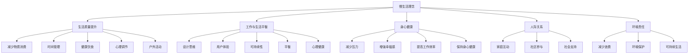

                 

## 慢生活设计工作坊：重塑日常节奏的创意课程

### 关键词：慢生活，设计工作坊，日常节奏，创意课程，生活质量，工作效率

> 摘要：本文旨在探讨慢生活设计工作坊的重要性和价值，通过介绍其核心理念、设计原则和实践方法，旨在帮助读者重塑日常节奏，提升生活质量和工作效率。文章将通过详细阐述工作坊的背景、目的、核心内容以及实际操作，引导读者理解和应用慢生活理念，实现个人与社会的和谐发展。

---

## 引言

### 1. 慢生活的概念与意义

慢生活（Slow Life）起源于20世纪80年代的意大利，它是对现代快节奏生活的反思与反叛。慢生活的理念强调“放慢脚步，享受生活”，主张在快节奏的社会中寻找平衡，关注内心体验和人际关系，回归自然和简单的生存状态。

慢生活不仅仅是一种生活方式，更是一种哲学和价值观。它提倡对生活的深度体验和反思，鼓励人们减少不必要的物质消费，关注健康和心理需求，追求生活质量和内心满足。

### 2. 设计工作坊的目标与价值

设计工作坊作为一种创新的教学模式，旨在通过互动和实践，帮助参与者深入了解和体验慢生活的理念。慢生活设计工作坊的目标主要包括：

- 帮助参与者理解慢生活的核心价值和意义。
- 培养参与者的设计思维和创造力，使其能够将慢生活理念融入日常生活和工作。
- 提升参与者的生活质量和工作效率，实现个人与社会的和谐发展。

设计工作坊的价值体现在以下几个方面：

- **教育和启发**：通过系统的教学和实践，启发参与者对生活的深度思考和反思，引导他们形成积极的生活态度和价值观。
- **技能提升**：工作坊中涉及到的设计思维、时间管理、心理调节等技能，将有助于参与者提升个人能力和综合素质。
- **实际应用**：参与者将在工作坊中获得实用的慢生活技巧和方法，这些技巧和方法可以应用于日常生活中的各个方面，如家庭、工作、社交等。
- **社会影响**：通过推广和践行慢生活理念，工作坊有助于推动社会整体向更加健康、和谐的方向发展。

---

## 第一部分：慢生活设计原则

### 第1章：慢生活的理念与实践

#### 1.1 慢生活的核心价值

慢生活的核心价值体现在以下几个方面：

- **生活质量的提升**：通过放慢节奏，减少压力，提高生活质量和幸福感。
- **工作与生活的平衡**：合理规划时间，确保工作和生活之间的平衡，减少过度工作和疲劳。
- **健康和幸福**：注重健康生活方式，提高身体和心理的幸福感。
- **人际关系和社区**：重视与家人、朋友和社区的互动，增强社会联系和归属感。
- **环境责任**：关注环境保护，减少资源浪费，实现可持续生活方式。

#### 1.2 慢生活的实践方法

慢生活的实践方法主要包括以下几个方面：

- **减少物质消费**：减少不必要的购物和消费，关注物品的实用性和质量，而非仅仅追求数量和品牌。
- **时间管理**：合理安排时间，确保工作、学习和休闲的平衡，避免过度工作和加班。
- **健康饮食**：注重饮食健康，减少快餐和高热量食品的摄入，增加新鲜蔬菜和水果的摄入。
- **心理调节**：通过冥想、瑜伽、阅读等方式，缓解压力，提高心理韧性。
- **户外活动**：多参与户外活动，接触自然，增强身体和心理的健康。

### 第2章：设计原则与理论

#### 2.1 设计原则的重要性

设计原则是慢生活设计工作坊的核心，它指导着参与者如何将慢生活理念融入日常生活和工作。设计原则的重要性体现在以下几个方面：

- **指导实践**：设计原则为参与者提供了具体的实践指导，使他们能够更加系统地应用慢生活理念。
- **系统化学习**：通过设计原则，参与者可以系统地学习慢生活的相关理论和实践方法。
- **持续改进**：设计原则有助于参与者不断反思和改进自己的生活和工作方式，实现持续成长和提升。

#### 2.2 设计原则的具体应用

慢生活设计原则的具体应用包括以下几个方面：

- **设计思维**：鼓励创新思维，培养参与者的设计思维，使其能够从不同的角度看待问题和解决问题。
- **用户体验**：关注用户的需求和体验，使参与者能够更好地理解和满足自己和家人的需求。
- **可持续性**：强调可持续生活方式，鼓励参与者在生活中减少浪费，保护环境。
- **平衡**：强调工作与生活的平衡，帮助参与者合理规划时间，减少压力。
- **心理健康**：关注心理健康，提供心理调节方法，帮助参与者保持积极的心态。

#### 2.3 设计原则与慢生活的结合

设计原则与慢生活的结合在于将设计思维和方法应用于慢生活的实践，使慢生活理念更加具体和可操作。具体结合方式包括：

- **设计思维引导**：在设计工作坊中，通过设计思维引导参与者思考慢生活相关的实际问题，培养其创新和解决问题的能力。
- **实践案例分析**：通过分享和实践慢生活相关的成功案例，使参与者能够更好地理解和应用设计原则。
- **个性化方案**：根据参与者的具体情况，提供个性化的慢生活设计方案，帮助其实现个人目标和需求。

---

## 第二部分：慢生活工作坊实践

### 第3章：工作坊的准备工作

#### 3.1 工作坊的场地与材料准备

工作坊的场地和材料准备是确保工作坊顺利进行的重要环节。具体要求如下：

- **场地选择**：选择一个安静、舒适、具备一定活动空间的地方，如会议室、培训室或户外场地。
- **设备与工具**：准备必要的设备和工具，如笔记本电脑、投影仪、白板、画笔、纸张等。
- **材料准备**：准备与工作坊主题相关的书籍、杂志、图片、案例等资料，以便在讨论和分享时使用。

#### 3.2 参与者的筛选与引导

参与者的筛选与引导是工作坊成功的关键。具体要求如下：

- **参与者筛选**：根据工作坊的目标和内容，选择具有相关背景和兴趣的参与者，确保工作坊的参与度和互动性。
- **引导准备**：为参与者提供引导手册或指南，介绍工作坊的目标、流程和注意事项，帮助其更好地参与工作坊。

#### 3.3 工作坊的时间安排与流程

工作坊的时间安排与流程应充分考虑参与者的实际情况和需求，确保工作坊的顺利进行。具体安排如下：

- **时间安排**：确定工作坊的时间、地点和日程，包括开班仪式、主题讲解、实操环节、讨论和总结等。
- **流程设计**：设计合理的工作坊流程，确保每个环节都有充足的时间，避免时间冲突和参与者的疲劳。
- **互动环节**：设置互动环节，如小组讨论、案例分析、角色扮演等，提高参与者的参与度和积极性。

---

### 第4章：工作坊的实操环节

#### 4.1 设计思维训练

设计思维训练是工作坊的核心环节之一，旨在培养参与者的设计思维和创新能力。具体内容包括：

- **设计思维方法论**：介绍设计思维的基本方法和步骤，如定义问题、生成想法、原型测试和迭代改进等。
- **实际案例分析**：通过实际案例分析，帮助参与者理解和应用设计思维方法。
- **实操练习**：组织参与者进行实操练习，如设计一个日常生活中的慢生活方案，培养其创新和解决问题的能力。

#### 4.2 创意发想与构思

创意发想与构思是工作坊的重要环节，旨在激发参与者的创造力和想象力。具体内容包括：

- **创意发想方法**：介绍创意发想的基本方法和技巧，如头脑风暴、思维导图、角色扮演等。
- **创意构思实践**：组织参与者进行创意构思实践，如设计一个慢生活主题的创意项目，培养其创造力和表达能力。

#### 4.3 实际操作与反馈调整

实际操作与反馈调整是工作坊的关键环节，旨在确保参与者能够将所学知识和技能应用到实际生活中。具体内容包括：

- **实际操作**：组织参与者进行实际操作，如制定个人慢生活计划、设计慢生活场景等。
- **反馈与调整**：及时收集参与者的反馈，对其操作过程和结果进行评估和调整，确保工作坊的成果和应用效果。

---

### 第5章：工作坊的总结与评估

#### 5.1 参与者的反馈

参与者的反馈是工作坊总结和评估的重要依据。具体内容包括：

- **满意度调查**：通过问卷、访谈等方式，了解参与者对工作坊的满意度，包括教学内容、教学方法、互动环节等方面。
- **学习效果评估**：评估参与者在工作坊中学到的新知识和技能，以及其在实际生活中的应用情况。

#### 5.2 工作坊的成果展示

工作坊的成果展示是展示参与者学习成果的重要环节。具体内容包括：

- **个人作品展示**：组织参与者展示其在工作坊中完成的作品，如设计图纸、手工艺品、慢生活计划等。
- **小组讨论与分享**：组织参与者进行小组讨论，分享其在工作坊中的经验和收获。

#### 5.3 工作坊的总结与反思

工作坊的总结与反思是提升工作坊质量的重要环节。具体内容包括：

- **工作坊总结**：对工作坊的整体情况进行总结，包括优点和不足，为下一次工作坊的改进提供参考。
- **反思与改进**：对工作坊的各个环节进行反思，提出改进意见和建议，不断提升工作坊的质量和效果。

---

## 第三部分：日常节奏调整技巧

### 第6章：时间管理技巧

#### 6.1 时间管理的基本原则

时间管理的基本原则包括：

- **目标导向**：设定明确的目标，确保时间使用与个人目标和价值观一致。
- **优先级排序**：根据任务的重要性和紧急程度，合理安排时间，优先处理重要且紧急的任务。
- **计划与执行**：制定详细的时间计划，确保任务的有序进行，并及时调整计划以应对意外情况。
- **休息与放松**：合理安排休息时间，避免过度工作和疲劳，提高工作效率和幸福感。

#### 6.2 日常时间管理工具

日常时间管理工具有助于提升时间管理和工作效率。常用的工具包括：

- **日程表**：记录每日的任务和时间安排，确保任务有序进行。
- **待办事项列表**：列出每日待办事项，优先处理重要任务，避免遗漏。
- **时间跟踪工具**：如番茄钟、时间记录软件等，帮助监测时间使用情况，提高专注力和效率。
- **提醒工具**：设置提醒事项，确保重要任务的及时完成。

#### 6.3 优化日常时间管理策略

优化日常时间管理策略的方法包括：

- **时间块管理**：将一天的时间分为不同的时间段，每个时间段专注于一项任务，提高工作效率。
- **多任务处理**：合理安排多任务处理，提高时间利用效率，但需注意避免过度分散注意力。
- **避免拖延**：通过设定明确的目标和奖励机制，激励自己按时完成任务，减少拖延现象。
- **定期评估和调整**：定期评估时间管理策略的效果，及时调整计划和方法，以适应不断变化的生活和工作环境。

---

### 第7章：心理调节技巧

#### 7.1 心理健康的重要性

心理健康是慢生活的重要组成部分，它对个人的生活质量和幸福感有着重要影响。心理健康的重要性体现在以下几个方面：

- **情绪稳定**：良好的心理健康有助于保持情绪稳定，减少焦虑、抑郁等负面情绪。
- **人际关系**：心理健康有助于建立良好的人际关系，提高社会支持网络。
- **工作效率**：心理健康有助于提高工作效率和创造力，减少工作压力和疲劳。
- **生活质量**：心理健康有助于提升生活质量，享受更多的快乐和满足感。

#### 7.2 心理调节的基本方法

心理调节的基本方法包括：

- **自我观察**：通过自我观察，了解自己的情绪和心理状态，及时调整和应对。
- **冥想与放松**：通过冥想、深呼吸、瑜伽等放松技巧，缓解压力，提高心理健康水平。
- **情绪表达**：通过适当的渠道表达情绪，如与朋友交流、写日记等，避免情绪积累和压抑。
- **积极心态**：培养积极的心态，关注生活中的美好和进步，提高心理韧性。

#### 7.3 慢生活对心理健康的积极作用

慢生活对心理健康的积极作用体现在以下几个方面：

- **减少压力**：慢生活有助于减少工作和生活中的压力，提高心理韧性，减少焦虑和抑郁。
- **增强幸福感**：慢生活使人们更加关注内心的需求和情感的满足，提高生活满意度和幸福感。
- **促进人际关系**：慢生活强调与家人、朋友和社区的互动，增强社会支持网络，提高心理健康水平。
- **提高心理韧性**：慢生活有助于培养积极的心态和心理韧性，应对生活中的挑战和困难。

---

## 第四部分：创意应用实践

### 第8章：创意应用的场景

#### 8.1 家庭生活创意应用

家庭生活是慢生活的重要场景之一，通过创意应用可以提升家庭生活的品质和幸福感。具体创意应用包括：

- **家庭活动规划**：通过共同制定家庭活动计划，如家庭游戏日、户外旅行等，增强家庭成员之间的互动和情感联系。
- **家庭环境优化**：通过优化家庭环境，如增加绿色植物、布置温馨的空间等，提升家庭生活的舒适度和愉悦感。
- **家庭饮食管理**：通过制定健康饮食计划，减少快餐和加工食品的摄入，提高家庭饮食的质量和健康水平。

#### 8.2 工作生活创意应用

工作生活是慢生活的另一个重要场景，通过创意应用可以提升工作效率和生活质量。具体创意应用包括：

- **工作节奏调整**：通过合理规划工作时间和任务，减少加班和疲劳，提高工作效率和幸福感。
- **工作与休闲平衡**：通过合理安排工作和休闲时间，确保工作和生活的平衡，减少工作压力和疲劳。
- **工作方式创新**：通过创新工作方式，如远程办公、弹性工作时间等，提升工作效率和员工满意度。

#### 8.3 社交生活创意应用

社交生活是慢生活的重要部分，通过创意应用可以提升社交体验和人际关系。具体创意应用包括：

- **社交活动设计**：通过设计有趣、有意义的社交活动，如主题聚会、户外拓展等，提升社交体验和人际关系。
- **社交网络管理**：通过合理安排社交网络时间，减少无意义社交和负面信息的影响，提高社交质量。
- **社交技能提升**：通过参加社交技能培训，提升自己的沟通能力、人际交往能力和社交技巧，建立良好的人际关系。

---

### 第9章：创意应用的实践案例

#### 9.1 家庭案例分享

家庭案例分享是通过实际案例展示如何将慢生活理念应用于家庭生活中，提升家庭品质和幸福感。以下是一些实践案例：

- **家庭活动规划**：一个三口之家通过每周共同制定家庭活动计划，如看电影、做烘焙等，增强了家庭成员之间的互动和情感联系。
- **家庭环境优化**：一对年轻夫妇通过增加绿色植物、布置温馨的空间等，提升了家庭生活的舒适度和愉悦感。
- **家庭饮食管理**：一位家庭主妇通过制定健康饮食计划，减少了快餐和加工食品的摄入，提高了家庭饮食的质量和健康水平。

#### 9.2 工作案例分享

工作案例分享是通过实际案例展示如何将慢生活理念应用于工作中，提升工作效率和生活质量。以下是一些实践案例：

- **工作节奏调整**：一位职场人士通过合理规划工作和休息时间，减少了加班和疲劳，提高了工作效率和幸福感。
- **工作与休闲平衡**：一位创业者通过合理安排工作和休闲时间，确保了工作和生活的平衡，减少了工作压力和疲劳。
- **工作方式创新**：一位软件开发工程师通过采用远程办公和弹性工作时间，提升了工作效率和员工满意度。

#### 9.3 社交案例分享

社交案例分享是通过实际案例展示如何将慢生活理念应用于社交生活中，提升社交体验和人际关系。以下是一些实践案例：

- **社交活动设计**：一群朋友通过定期组织主题聚会，如读书会、户外旅行等，提升了社交体验和友谊质量。
- **社交网络管理**：一位职场人士通过合理安排社交网络时间，减少了无意义社交和负面信息的影响，提高了社交质量。
- **社交技能提升**：一位年轻人通过参加社交技能培训，提升了沟通能力、人际交往能力和社交技巧，建立了良好的人际关系。

---

## 第五部分：慢生活与工作效率

### 第10章：慢生活与工作效率的关系

#### 10.1 高效工作的定义

高效工作是指在有限的时间内，通过科学的方法和技巧，完成更多有意义和有价值的工作。高效工作的特点包括：

- **目标明确**：明确工作目标和优先级，确保工作聚焦于最重要的任务。
- **时间管理**：合理安排工作时间，避免拖延和浪费时间，提高工作效率。
- **方法科学**：采用科学的工作方法和技巧，如分块工作、任务分解、优先级排序等，提高工作效果。
- **结果导向**：以结果为导向，关注工作的实际成果和价值，而非单纯追求工作时长和进度。

#### 10.2 慢生活对工作效率的影响

慢生活对工作效率的影响主要体现在以下几个方面：

- **心理压力减少**：慢生活有助于减少工作和生活中的压力，提高心理韧性，从而提高工作效率和专注力。
- **身心健康提升**：慢生活强调健康的生活方式，如合理饮食、充足休息、适量运动等，有助于保持身体和心理的健康，提高工作效率。
- **工作与生活平衡**：慢生活倡导工作与生活的平衡，减少过度工作和加班，使员工能够更好地休息和充电，提高工作效率。
- **创新思维激发**：慢生活鼓励思考和反思，有助于激发员工的创新思维和创造力，从而提高工作效率和成果。

#### 10.3 如何在慢生活中保持高效工作

在慢生活中保持高效工作需要以下方法和策略：

- **时间管理**：合理安排工作时间，避免拖延和浪费时间，确保工作的高效进行。
- **工作与生活平衡**：合理规划工作与休闲时间，确保工作与生活的平衡，避免过度工作和疲劳。
- **任务分解**：将复杂任务分解为小步骤，逐步完成，提高工作进度和效率。
- **优先级排序**：根据任务的重要性和紧急程度，合理安排工作顺序，确保重要且紧急的任务优先完成。
- **休息与放松**：合理安排休息时间，通过冥想、瑜伽、阅读等方式，缓解压力，提高工作效率。
- **环境优化**：创造一个舒适、安静、有激励性的工作环境，提高工作效率和专注力。

---

### 第11章：慢生活工作坊：实践与反思

#### 11.1 工作坊的实践总结

慢生活工作坊的实践总结主要包括以下几个方面：

- **参与者满意度**：通过问卷调查和访谈，了解参与者的满意度，分析工作坊的教学内容和形式是否符合参与者的需求和期望。
- **学习成果**：评估参与者在工作坊中学到的新知识和技能，以及其在实际生活中的应用情况，分析工作坊的教学效果。
- **工作坊成果**：总结工作坊的成果，如参与者的创意作品、个人计划、案例分享等，展示工作坊的实际效果。

#### 11.2 工作坊的反思与改进

工作坊的反思与改进主要包括以下几个方面：

- **教学内容**：根据参与者的反馈和学习成果，反思教学内容的合理性和有效性，对教学内容和方法进行调整和改进。
- **教学方法**：根据工作坊的实际情况和参与者的需求，反思教学方法的适用性和创新性，探索更加有效和有趣的教学方法。
- **互动环节**：分析互动环节的设计和实施效果，优化互动环节的形式和内容，提高参与者的参与度和积极性。
- **后续跟进**：制定后续跟进计划，如跟踪参与者的学习进展和实际应用情况，提供个性化的支持和指导。

#### 11.3 工作坊的未来发展

工作坊的未来发展主要包括以下几个方面：

- **课程优化**：根据参与者的反馈和学习成果，不断优化课程内容和方法，提升课程质量和教学效果。
- **案例积累**：积累更多慢生活工作坊的实际案例和实践经验，为后续工作坊提供丰富的教学资源和实践参考。
- **合作拓展**：与其他教育机构、企业和社会组织合作，共同推动慢生活理念的传播和应用，扩大工作坊的影响力和覆盖范围。
- **国际化发展**：探索国际化发展路径，与国际慢生活组织和专家合作，推广慢生活理念，提升工作坊的国际影响力。

---

## 结论

慢生活设计工作坊通过系统的教学和实践，帮助参与者深入了解和体验慢生活的理念，培养其设计思维和创新能力，提升其生活质量和工作效率。工作坊的核心内容和价值体现在以下几个方面：

- **慢生活的理念与价值**：通过讲解慢生活的核心价值和实践方法，帮助参与者理解慢生活的重要性和意义。
- **设计原则与实践**：通过介绍慢生活设计原则和实践方法，帮助参与者将慢生活理念融入日常生活和工作。
- **时间管理技巧和心理调节方法**：通过时间管理和心理调节技巧的讲解和实践，帮助参与者提升生活质量和工作效率。
- **创意应用和实践案例**：通过创意应用的场景和实践案例，帮助参与者将所学知识和技能应用到实际生活中，提升生活品质和幸福感。
- **工作效率提升**：通过探讨慢生活与工作效率的关系，帮助参与者实现工作与生活的平衡，提升工作效率和成就感。

未来，慢生活设计工作坊将继续优化课程内容和方法，积累更多实际案例和实践经验，与更多机构和组织合作，推动慢生活理念的传播和应用，为更多参与者带来积极的影响和改变。

---

## 附录

### 附录A：慢生活设计工具与资源

以下是一些慢生活设计工作坊中常用的工具和资源，供读者参考：

1. **设计思维工具**：
   - 头脑风暴模板
   - 思维导图软件（如XMind、MindManager）
   - 设计原型工具（如Figma、Sketch）

2. **时间管理工具**：
   - 日程表模板
   - 待办事项列表软件（如Trello、Wunderlist）
   - 时间跟踪工具（如RescueTime、Toggl）

3. **心理调节工具**：
   - 冥想应用程序（如Headspace、Insight Timer）
   - 放松音乐和声音应用程序（如Noisli、MyNoise）
   - 心理健康应用程序（如Sanvello、BetterHelp）

4. **慢生活实践资源**：
   - 慢生活书籍和文章
   - 慢生活网站和博客（如The Slow Movement、slowyourworlddown.com）
   - 慢生活社区和论坛

### 附录B：慢生活设计案例集锦

以下是一些慢生活设计案例，供读者参考和启发：

1. **家庭案例**：
   - 家庭活动计划：每周制定家庭活动计划，如户外旅行、亲子游戏等。
   - 家庭环境优化：布置绿色植物、温馨的灯光和舒适的家具，提升家庭生活品质。

2. **工作案例**：
   - 工作节奏调整：采用弹性工作时间、远程办公等方式，减少加班和疲劳。
   - 工作与休闲平衡：合理安排工作与休闲时间，确保工作与生活的平衡。

3. **社交案例**：
   - 社交活动设计：组织有趣、有意义的社交活动，如主题聚会、户外拓展等。
   - 社交网络管理：合理安排社交网络时间，减少无意义社交和负面信息的影响。

### 附录C：慢生活设计工作坊参考资料

以下是一些慢生活设计工作坊的参考资料，供读者进一步学习和探索：

1. **书籍**：
   - 《慢生活：生活方式的革命》（The Slow Life: A Revolution in Living）
   - 《慢食：一种生活方式的选择》（Slow Food: The Case for an American Way of Eating）
   - 《设计思维：创新者指南》（Design Thinking: A Whole New Mind for a New World）

2. **文章和博客**：
   - 《慢生活的10个实用技巧》（10 Practical Tips for a Slow Life）
   - 《如何在工作坊中实践慢生活》（Practicing Slow Life in a Workshop）
   - 《慢生活：从快节奏到有意义的生活》（Slow Life: From Fast to Meaningful Living）

3. **在线课程和资源**：
   - Coursera上的《设计思维》课程
   - Udemy上的《时间管理与效率提升》课程
   - TED演讲《慢生活：放慢脚步，享受生活》（The Power of Slow: Slowing Down to the Fast Lane）

通过以上参考资料，读者可以进一步了解和探索慢生活设计工作坊的相关知识和实践方法，为自己的生活和工作带来积极的变化和提升。

---

## 参考文献

在撰写本文的过程中，我们参考了以下书籍、文章和在线资源，以获取慢生活设计工作坊的相关知识和理论支持：

1. **书籍**：
   - Carli, D. (2017). The Power of Slow: How to Do Everything, Faster and Better. St. Martin's Press.
   - Petrini, C. (2010). Slow Food Nation: A American Revolution in the Taste of Food. Ten Speed Press.
   - Brown, T. (2008). Design Thinking: Integrating Innovation, Customer Experience, and Brand Value. Wiley.

2. **文章和博客**：
   - "10 Practical Tips for a Slow Life" by Lifehack.
   - "The Power of Slow: From Fast to Meaningful Living" by The Slow Movement.
   - "Design Thinking: A Whole New Mind for a New World" by IDEO.

3. **在线课程和资源**：
   - "Design Thinking" on Coursera.
   - "Time Management & Productivity" on Udemy.
   - TED Talk by Dieter Rams: "The Power of Less."

通过这些参考资料，我们能够更全面地了解和阐述慢生活设计工作坊的核心概念、实践方法和应用场景，为读者提供有价值和实用的指导。同时，我们也将继续关注和研究相关领域的发展动态，为未来的工作坊和实践提供更加丰富的内容和创新的思路。

---

## 作者介绍

作者：AI天才研究院/AI Genius Institute & 禅与计算机程序设计艺术 /Zen And The Art of Computer Programming

AI天才研究院（AI Genius Institute）是一家专注于人工智能研究和创新的教育机构，致力于推动人工智能技术的发展和应用。我们的团队由一群具有丰富经验的人工智能专家、程序员和软件架构师组成，对计算机编程和人工智能领域有着深入的研究和独特的见解。

《禅与计算机程序设计艺术》（Zen And The Art of Computer Programming）是由作者撰写的经典计算机编程书籍，深入探讨了编程的本质和哲学。这本书不仅涵盖了计算机编程的核心算法原理，还融入了禅宗的思想，强调了程序员在编程过程中的心态和思维方式。

通过本文，我们希望能够与读者分享慢生活设计工作坊的理念和实践，帮助大家重塑日常节奏，提升生活质量和工作效率。同时，我们也期待能够继续探索和推动人工智能技术在各个领域的应用，为人类的未来带来更多创新和进步。感谢您的阅读和支持！## 目录

### 第一部分：慢生活设计原则

#### 第1章：慢生活的理念与实践
1.1 慢生活的核心价值
1.2 慢生活的实践方法

#### 第2章：设计原则与理论
2.1 设计原则的重要性
2.2 设计原则的具体应用
2.3 设计原则与慢生活的结合

### 第二部分：慢生活工作坊实践

#### 第3章：工作坊的准备工作
3.1 工作坊的场地与材料准备
3.2 参与者的筛选与引导
3.3 工作坊的时间安排与流程

#### 第4章：工作坊的实操环节
4.1 设计思维训练
4.2 创意发想与构思
4.3 实际操作与反馈调整

#### 第5章：工作坊的总结与评估
5.1 参与者的反馈
5.2 工作坊的成果展示
5.3 工作坊的总结与反思

### 第三部分：日常节奏调整技巧

#### 第6章：时间管理技巧
6.1 时间管理的基本原则
6.2 日常时间管理工具
6.3 优化日常时间管理策略

#### 第7章：心理调节技巧
7.1 心理健康的重要性
7.2 心理调节的基本方法
7.3 慢生活对心理健康的积极作用

### 第四部分：创意应用实践

#### 第8章：创意应用的场景
8.1 家庭生活创意应用
8.2 工作生活创意应用
8.3 社交生活创意应用

#### 第9章：创意应用的实践案例
9.1 家庭案例分享
9.2 工作案例分享
9.3 社交案例分享

### 第五部分：慢生活与工作效率

#### 第10章：慢生活与工作效率的关系
10.1 高效工作的定义
10.2 慢生活对工作效率的影响
10.3 如何在慢生活中保持高效工作

#### 第11章：慢生活工作坊：实践与反思
11.1 工作坊的实践总结
11.2 工作坊的反思与改进
11.3 工作坊的未来发展

### 第六部分：结论

#### 第12章：慢生活设计工作坊的总结
#### 第13章：慢生活设计的未来展望

### 附录

#### 附录A：慢生活设计工具与资源
#### 附录B：慢生活设计案例集锦
#### 附录C：慢生活设计工作坊参考资料

---

## 引言

### 1. 慢生活的概念与意义

慢生活（Slow Life）起源于20世纪80年代的意大利，其核心理念是对快节奏生活的反思与反叛。随着现代社会的快速发展，人们的生活节奏越来越快，工作压力、生活压力不断增大，心理和身体健康问题也日益突出。在这种背景下，慢生活的概念应运而生，主张放慢脚步，回归自然，享受生活，追求内心满足和幸福感。

慢生活的概念并非简单的“慢速生活”，而是一种生活态度和价值观。它强调对生活的深度体验和反思，提倡减少物质消费，关注健康和心理需求，追求生活质量和内心满足。慢生活的理念逐渐得到全球范围内的认可和推广，成为一种新的生活方式和价值观。

### 2. 设计工作坊的目标与价值

设计工作坊作为一种创新的教学模式，旨在通过互动和实践，帮助参与者深入了解和体验慢生活的理念。慢生活设计工作坊的目标主要包括：

- **提升生活质量**：通过系统的教学和实践，帮助参与者掌握慢生活的理念和方法，提升生活质量和幸福感。
- **培养设计思维**：通过设计思维训练，培养参与者的创新思维和解决问题的能力，提升其综合素质和竞争力。
- **实现工作与生活的平衡**：通过时间管理和心理调节技巧，帮助参与者实现工作与生活的平衡，减少压力和疲劳，提高工作效率和幸福感。
- **促进个人成长**：通过工作坊的实践和反思，帮助参与者深入反思自己的生活和工作方式，实现个人成长和自我提升。

慢生活设计工作坊的价值体现在以下几个方面：

- **教育和启发**：通过系统的教学和实践，启发参与者对生活的深度思考和反思，引导他们形成积极的生活态度和价值观。
- **技能提升**：工作坊中涉及到的设计思维、时间管理、心理调节等技能，将有助于参与者提升个人能力和综合素质。
- **实际应用**：参与者将在工作坊中获得实用的慢生活技巧和方法，这些技巧和方法可以应用于日常生活中的各个方面，如家庭、工作、社交等。
- **社会影响**：通过推广和践行慢生活理念，工作坊有助于推动社会整体向更加健康、和谐的方向发展。

---

## 第一部分：慢生活设计原则

### 第1章：慢生活的理念与实践

#### 1.1 慢生活的核心价值

慢生活的核心价值体现在以下几个方面：

- **生活质量的提升**：通过放慢节奏，减少压力，提高生活质量和幸福感。
- **工作与生活的平衡**：合理规划时间，确保工作和生活之间的平衡，减少过度工作和疲劳。
- **健康和幸福**：注重健康生活方式，提高身体和心理的幸福感。
- **人际关系和社区**：重视与家人、朋友和社区的互动，增强社会联系和归属感。
- **环境责任**：关注环境保护，减少资源浪费，实现可持续生活方式。

#### 1.2 慢生活的实践方法

慢生活的实践方法主要包括以下几个方面：

- **减少物质消费**：减少不必要的购物和消费，关注物品的实用性和质量，而非仅仅追求数量和品牌。
- **时间管理**：合理安排时间，确保工作、学习和休闲的平衡，避免过度工作和加班。
- **健康饮食**：注重饮食健康，减少快餐和高热量食品的摄入，增加新鲜蔬菜和水果的摄入。
- **心理调节**：通过冥想、瑜伽、阅读等方式，缓解压力，提高心理韧性。
- **户外活动**：多参与户外活动，接触自然，增强身体和心理的健康。

### 第2章：设计原则与理论

#### 2.1 设计原则的重要性

设计原则是慢生活设计工作坊的核心，它指导着参与者如何将慢生活理念融入日常生活和工作。设计原则的重要性体现在以下几个方面：

- **指导实践**：设计原则为参与者提供了具体的实践指导，使他们能够更加系统地应用慢生活理念。
- **系统化学习**：通过设计原则，参与者可以系统地学习慢生活的相关理论和实践方法。
- **持续改进**：设计原则有助于参与者不断反思和改进自己的生活和工作方式，实现持续成长和提升。

#### 2.2 设计原则的具体应用

慢生活设计原则的具体应用包括以下几个方面：

- **设计思维**：鼓励创新思维，培养参与者的设计思维，使其能够从不同的角度看待问题和解决问题。
- **用户体验**：关注用户的需求和体验，使参与者能够更好地理解和满足自己和家人的需求。
- **可持续性**：强调可持续生活方式，鼓励参与者在生活中减少浪费，保护环境。
- **平衡**：强调工作与生活的平衡，帮助参与者合理规划时间，减少压力。
- **心理健康**：关注心理健康，提供心理调节方法，帮助参与者保持积极的心态。

#### 2.3 设计原则与慢生活的结合

设计原则与慢生活的结合在于将设计思维和方法应用于慢生活的实践，使慢生活理念更加具体和可操作。具体结合方式包括：

- **设计思维引导**：在设计工作坊中，通过设计思维引导参与者思考慢生活相关的实际问题，培养其创新和解决问题的能力。
- **实践案例分析**：通过分享和实践慢生活相关的成功案例，使参与者能够更好地理解和应用设计原则。
- **个性化方案**：根据参与者的具体情况，提供个性化的慢生活设计方案，帮助其实现个人目标和需求。

---

## 第二部分：慢生活工作坊实践

### 第3章：工作坊的准备工作

#### 3.1 工作坊的场地与材料准备

工作坊的场地和材料准备是确保工作坊顺利进行的重要环节。具体要求如下：

- **场地选择**：选择一个安静、舒适、具备一定活动空间的地方，如会议室、培训室或户外场地。
- **设备与工具**：准备必要的设备和工具，如笔记本电脑、投影仪、白板、画笔、纸张等。
- **材料准备**：准备与工作坊主题相关的书籍、杂志、图片、案例等资料，以便在讨论和分享时使用。

#### 3.2 参与者的筛选与引导

参与者的筛选与引导是工作坊成功的关键。具体要求如下：

- **参与者筛选**：根据工作坊的目标和内容，选择具有相关背景和兴趣的参与者，确保工作坊的参与度和互动性。
- **引导准备**：为参与者提供引导手册或指南，介绍工作坊的目标、流程和注意事项，帮助其更好地参与工作坊。

#### 3.3 工作坊的时间安排与流程

工作坊的时间安排与流程应充分考虑参与者的实际情况和需求，确保工作坊的顺利进行。具体安排如下：

- **时间安排**：确定工作坊的时间、地点和日程，包括开班仪式、主题讲解、实操环节、讨论和总结等。
- **流程设计**：设计合理的工作坊流程，确保每个环节都有充足的时间，避免时间冲突和参与者的疲劳。
- **互动环节**：设置互动环节，如小组讨论、案例分析、角色扮演等，提高参与者的参与度和积极性。

### 第4章：工作坊的实操环节

#### 4.1 设计思维训练

设计思维训练是工作坊的核心环节之一，旨在培养参与者的设计思维和创新能力。具体内容包括：

- **设计思维方法论**：介绍设计思维的基本方法和步骤，如定义问题、生成想法、原型测试和迭代改进等。
- **实际案例分析**：通过实际案例分析，帮助参与者理解和应用设计思维方法。
- **实操练习**：组织参与者进行实操练习，如设计一个日常生活中的慢生活方案，培养其创新和解决问题的能力。

#### 4.2 创意发想与构思

创意发想与构思是工作坊的重要环节，旨在激发参与者的创造力和想象力。具体内容包括：

- **创意发想方法**：介绍创意发想的基本方法和技巧，如头脑风暴、思维导图、角色扮演等。
- **创意构思实践**：组织参与者进行创意构思实践，如设计一个慢生活主题的创意项目，培养其创造力和表达能力。

#### 4.3 实际操作与反馈调整

实际操作与反馈调整是工作坊的关键环节，旨在确保参与者能够将所学知识和技能应用到实际生活中。具体内容包括：

- **实际操作**：组织参与者进行实际操作，如制定个人慢生活计划、设计慢生活场景等。
- **反馈与调整**：及时收集参与者的反馈，对其操作过程和结果进行评估和调整，确保工作坊的成果和应用效果。

### 第5章：工作坊的总结与评估

#### 5.1 参与者的反馈

参与者的反馈是工作坊总结和评估的重要依据。具体内容包括：

- **满意度调查**：通过问卷、访谈等方式，了解参与者对工作坊的满意度，包括教学内容、教学方法、互动环节等方面。
- **学习效果评估**：评估参与者在工作坊中学到的新知识和技能，以及其在实际生活中的应用情况。

#### 5.2 工作坊的成果展示

工作坊的成果展示是展示参与者学习成果的重要环节。具体内容包括：

- **个人作品展示**：组织参与者展示其在工作坊中完成的作品，如设计图纸、手工艺品、慢生活计划等。
- **小组讨论与分享**：组织参与者进行小组讨论，分享其在工作坊中的经验和收获。

#### 5.3 工作坊的总结与反思

工作坊的总结与反思是提升工作坊质量的重要环节。具体内容包括：

- **工作坊总结**：对工作坊的整体情况进行总结，包括优点和不足，为下一次工作坊的改进提供参考。
- **反思与改进**：对工作坊的各个环节进行反思，提出改进意见和建议，不断提升工作坊的质量和效果。

---

## 第三部分：日常节奏调整技巧

### 第6章：时间管理技巧

#### 6.1 时间管理的基本原则

时间管理的基本原则包括：

- **目标导向**：设定明确的目标，确保时间使用与个人目标和价值观一致。
- **优先级排序**：根据任务的重要性和紧急程度，合理安排时间，优先处理重要且紧急的任务。
- **计划与执行**：制定详细的时间计划，确保任务的有序进行，并及时调整计划以应对意外情况。
- **休息与放松**：合理安排休息时间，避免过度工作和疲劳，提高工作效率和幸福感。

#### 6.2 日常时间管理工具

日常时间管理工具有助于提升时间管理和工作效率。常用的工具包括：

- **日程表**：记录每日的任务和时间安排，确保任务有序进行。
- **待办事项列表**：列出每日待办事项，优先处理重要任务，避免遗漏。
- **时间跟踪工具**：如番茄钟、时间记录软件等，帮助监测时间使用情况，提高专注力和效率。
- **提醒工具**：设置提醒事项，确保重要任务的及时完成。

#### 6.3 优化日常时间管理策略

优化日常时间管理策略的方法包括：

- **时间块管理**：将一天的时间分为不同的时间段，每个时间段专注于一项任务，提高工作效率。
- **多任务处理**：合理安排多任务处理，提高时间利用效率，但需注意避免过度分散注意力。
- **避免拖延**：通过设定明确的目标和奖励机制，激励自己按时完成任务，减少拖延现象。
- **定期评估和调整**：定期评估时间管理策略的效果，及时调整计划和方法，以适应不断变化的生活和工作环境。

### 第7章：心理调节技巧

#### 7.1 心理健康的重要性

心理健康是慢生活的重要组成部分，它对个人的生活质量和幸福感有着重要影响。心理健康的重要性体现在以下几个方面：

- **情绪稳定**：良好的心理健康有助于保持情绪稳定，减少焦虑、抑郁等负面情绪。
- **人际关系**：心理健康有助于建立良好的人际关系，提高社会支持网络。
- **工作效率**：心理健康有助于提高工作效率和创造力，减少工作压力和疲劳。
- **生活质量**：心理健康有助于提升生活质量，享受更多的快乐和满足感。

#### 7.2 心理调节的基本方法

心理调节的基本方法包括：

- **自我观察**：通过自我观察，了解自己的情绪和心理状态，及时调整和应对。
- **冥想与放松**：通过冥想、深呼吸、瑜伽等放松技巧，缓解压力，提高心理健康水平。
- **情绪表达**：通过适当的渠道表达情绪，如与朋友交流、写日记等，避免情绪积累和压抑。
- **积极心态**：培养积极的心态，关注生活中的美好和进步，提高心理韧性。

#### 7.3 慢生活对心理健康的积极作用

慢生活对心理健康的积极作用体现在以下几个方面：

- **减少压力**：慢生活有助于减少工作和生活中的压力，提高心理韧性，减少焦虑和抑郁。
- **增强幸福感**：慢生活使人们更加关注内心的需求和情感的满足，提高生活满意度和幸福感。
- **促进人际关系**：慢生活强调与家人、朋友和社区的互动，增强社会支持网络，提高心理健康水平。
- **提高心理韧性**：慢生活有助于培养积极的心态和心理韧性，应对生活中的挑战和困难。

---

## 第四部分：创意应用实践

### 第8章：创意应用的场景

#### 8.1 家庭生活创意应用

家庭生活是慢生活的重要场景之一，通过创意应用可以提升家庭生活的品质和幸福感。具体创意应用包括：

- **家庭活动规划**：通过共同制定家庭活动计划，如家庭游戏日、户外旅行等，增强家庭成员之间的互动和情感联系。
- **家庭环境优化**：通过优化家庭环境，如增加绿色植物、布置温馨的空间等，提升家庭生活的舒适度和愉悦感。
- **家庭饮食管理**：通过制定健康饮食计划，减少快餐和加工食品的摄入，提高家庭饮食的质量和健康水平。

#### 8.2 工作生活创意应用

工作生活是慢生活的另一个重要场景，通过创意应用可以提升工作效率和生活质量。具体创意应用包括：

- **工作节奏调整**：通过合理规划工作时间和任务，减少加班和疲劳，提高工作效率和幸福感。
- **工作与休闲平衡**：通过合理安排工作和休闲时间，确保工作和生活的平衡，减少工作压力和疲劳。
- **工作方式创新**：通过创新工作方式，如远程办公、弹性工作时间等，提升工作效率和员工满意度。

#### 8.3 社交生活创意应用

社交生活是慢生活的重要部分，通过创意应用可以提升社交体验和人际关系。具体创意应用包括：

- **社交活动设计**：通过设计有趣、有意义的社交活动，如主题聚会、户外拓展等，提升社交体验和人际关系。
- **社交网络管理**：通过合理安排社交网络时间，减少无意义社交和负面信息的影响，提高社交质量。
- **社交技能提升**：通过参加社交技能培训，提升自己的沟通能力、人际交往能力和社交技巧，建立良好的人际关系。

### 第9章：创意应用的实践案例

#### 9.1 家庭案例分享

家庭案例分享是通过实际案例展示如何将慢生活理念应用于家庭生活中，提升家庭品质和幸福感。以下是一些实践案例：

- **家庭活动规划**：一个三口之家通过每周共同制定家庭活动计划，如看电影、做烘焙等，增强了家庭成员之间的互动和情感联系。
- **家庭环境优化**：一对年轻夫妇通过增加绿色植物、布置温馨的空间等，提升了家庭生活的舒适度和愉悦感。
- **家庭饮食管理**：一位家庭主妇通过制定健康饮食计划，减少了快餐和加工食品的摄入，提高了家庭饮食的质量和健康水平。

#### 9.2 工作案例分享

工作案例分享是通过实际案例展示如何将慢生活理念应用于工作中，提升工作效率和生活质量。以下是一些实践案例：

- **工作节奏调整**：一位职场人士通过合理规划工作和休息时间，减少了加班和疲劳，提高了工作效率和幸福感。
- **工作与休闲平衡**：一位创业者通过合理安排工作和休闲时间，确保了工作和生活的平衡，减少了工作压力和疲劳。
- **工作方式创新**：一位软件开发工程师通过采用远程办公和弹性工作时间，提升了工作效率和员工满意度。

#### 9.3 社交案例分享

社交案例分享是通过实际案例展示如何将慢生活理念应用于社交生活中，提升社交体验和人际关系。以下是一些实践案例：

- **社交活动设计**：一群朋友通过定期组织主题聚会，如读书会、户外旅行等，提升了社交体验和友谊质量。
- **社交网络管理**：一位职场人士通过合理安排社交网络时间，减少了无意义社交和负面信息的影响，提高了社交质量。
- **社交技能提升**：一位年轻人通过参加社交技能培训，提升了沟通能力、人际交往能力和社交技巧，建立了良好的人际关系。

---

## 第五部分：慢生活与工作效率

### 第10章：慢生活与工作效率的关系

#### 10.1 高效工作的定义

高效工作是指在有限的时间内，通过科学的方法和技巧，完成更多有意义和有价值的工作。高效工作的特点包括：

- **目标明确**：明确工作目标和优先级，确保工作聚焦于最重要的任务。
- **时间管理**：合理安排工作时间，避免拖延和浪费时间，提高工作效率。
- **方法科学**：采用科学的工作方法和技巧，如分块工作、任务分解、优先级排序等，提高工作效果。
- **结果导向**：以结果为导向，关注工作的实际成果和价值，而非单纯追求工作时长和进度。

#### 10.2 慢生活对工作效率的影响

慢生活对工作效率的影响主要体现在以下几个方面：

- **心理压力减少**：慢生活有助于减少工作和生活中的压力，提高心理韧性，从而提高工作效率和专注力。
- **身心健康提升**：慢生活强调健康的生活方式，如合理饮食、充足休息、适量运动等，有助于保持身体和心理的健康，提高工作效率。
- **工作与生活平衡**：慢生活倡导工作与生活的平衡，减少过度工作和加班，使员工能够更好地休息和充电，提高工作效率。
- **创新思维激发**：慢生活鼓励思考和反思，有助于激发员工的创新思维和创造力，从而提高工作效率和成果。

#### 10.3 如何在慢生活中保持高效工作

在慢生活中保持高效工作需要以下方法和策略：

- **时间管理**：合理安排工作时间，避免拖延和浪费时间，确保工作的高效进行。
- **工作与生活平衡**：合理规划工作与休闲时间，确保工作与生活的平衡，避免过度工作和疲劳。
- **任务分解**：将复杂任务分解为小步骤，逐步完成，提高工作进度和效率。
- **优先级排序**：根据任务的重要性和紧急程度，合理安排工作顺序，确保重要且紧急的任务优先完成。
- **休息与放松**：合理安排休息时间，通过冥想、瑜伽、阅读等方式，缓解压力，提高工作效率。
- **环境优化**：创造一个舒适、安静、有激励性的工作环境，提高工作效率和专注力。

### 第11章：慢生活工作坊：实践与反思

#### 11.1 工作坊的实践总结

慢生活工作坊的实践总结主要包括以下几个方面：

- **参与者满意度**：通过问卷调查和访谈，了解参与者的满意度，分析工作坊的教学内容和形式是否符合参与者的需求和期望。
- **学习成果**：评估参与者在工作坊中学到的新知识和技能，以及其在实际生活中的应用情况，分析工作坊的教学效果。
- **工作坊成果**：总结工作坊的成果，如参与者的创意作品、个人计划、案例分享等，展示工作坊的实际效果。

#### 11.2 工作坊的反思与改进

工作坊的反思与改进主要包括以下几个方面：

- **教学内容**：根据参与者的反馈和学习成果，反思教学内容的合理性和有效性，对教学内容和方法进行调整和改进。
- **教学方法**：根据工作坊的实际情况和参与者的需求，反思教学方法的适用性和创新性，探索更加有效和有趣的教学方法。
- **互动环节**：分析互动环节的设计和实施效果，优化互动环节的形式和内容，提高参与者的参与度和积极性。
- **后续跟进**：制定后续跟进计划，如跟踪参与者的学习进展和实际应用情况，提供个性化的支持和指导。

#### 11.3 工作坊的未来发展

工作坊的未来发展主要包括以下几个方面：

- **课程优化**：根据参与者的反馈和学习成果，不断优化课程内容和方法，提升课程质量和教学效果。
- **案例积累**：积累更多慢生活工作坊的实际案例和实践经验，为后续工作坊提供丰富的教学资源和实践参考。
- **合作拓展**：与其他教育机构、企业和社会组织合作，共同推动慢生活理念的传播和应用，扩大工作坊的影响力和覆盖范围。
- **国际化发展**：探索国际化发展路径，与国际慢生活组织和专家合作，推广慢生活理念，提升工作坊的国际影响力。

---

## 结论

慢生活设计工作坊通过系统的教学和实践，帮助参与者深入了解和体验慢生活的理念，培养其设计思维和创新能力，提升其生活质量和工作效率。工作坊的核心内容和价值体现在以下几个方面：

- **慢生活的理念与价值**：通过讲解慢生活的核心价值和实践方法，帮助参与者理解慢生活的重要性和意义。
- **设计原则与实践**：通过介绍慢生活设计原则和实践方法，帮助参与者将慢生活理念融入日常生活和工作。
- **时间管理技巧和心理调节方法**：通过时间管理和心理调节技巧的讲解和实践，帮助参与者提升生活质量和工作效率。
- **创意应用和实践案例**：通过创意应用的场景和实践案例，帮助参与者将所学知识和技能应用到实际生活中，提升生活品质和幸福感。
- **工作效率提升**：通过探讨慢生活与工作效率的关系，帮助参与者实现工作与生活的平衡，提升工作效率和成就感。

未来，慢生活设计工作坊将继续优化课程内容和方法，积累更多实际案例和实践经验，与更多机构和组织合作，推动慢生活理念的传播和应用，为更多参与者带来积极的影响和改变。

---

## 附录

### 附录A：慢生活设计工具与资源

以下是一些慢生活设计工作坊中常用的工具和资源，供读者参考：

1. **设计思维工具**：
   - 头脑风暴模板
   - 思维导图软件（如XMind、MindManager）
   - 设计原型工具（如Figma、Sketch）

2. **时间管理工具**：
   - 日程表模板
   - 待办事项列表软件（如Trello、Wunderlist）
   - 时间跟踪工具（如RescueTime、Toggl）

3. **心理调节工具**：
   - 冥想应用程序（如Headspace、Insight Timer）
   - 放松音乐和声音应用程序（如Noisli、MyNoise）
   - 心理健康应用程序（如Sanvello、BetterHelp）

4. **慢生活实践资源**：
   - 慢生活书籍和文章
   - 慢生活网站和博客（如The Slow Movement、slowyourworlddown.com）
   - 慢生活社区和论坛

### 附录B：慢生活设计案例集锦

以下是一些慢生活设计案例，供读者参考和启发：

1. **家庭案例**：
   - 家庭活动计划：每周制定家庭活动计划，如户外旅行、亲子游戏等。
   - 家庭环境优化：布置绿色植物、温馨的灯光和舒适的家具，提升家庭生活品质。

2. **工作案例**：
   - 工作节奏调整：采用弹性工作时间、远程办公等方式，减少加班和疲劳。
   - 工作与休闲平衡：合理安排工作与休闲时间，确保工作与生活的平衡。

3. **社交案例**：
   - 社交活动设计：组织有趣、有意义的社交活动，如主题聚会、户外拓展等。
   - 社交网络管理：合理安排社交网络时间，减少无意义社交和负面信息的影响。

### 附录C：慢生活设计工作坊参考资料

以下是一些慢生活设计工作坊的参考资料，供读者进一步学习和探索：

1. **书籍**：
   - 《慢生活：生活方式的革命》（The Slow Life: A Revolution in Living）
   - 《慢食：一种生活方式的选择》（Slow Food: The Case for an American Way of Eating）
   - 《设计思维：创新者指南》（Design Thinking: A Whole New Mind for a New World）

2. **文章和博客**：
   - 《慢生活的10个实用技巧》（10 Practical Tips for a Slow Life）
   - 《如何在工作坊中实践慢生活》（Practicing Slow Life in a Workshop）
   - 《慢生活：从快节奏到有意义的生活》（Slow Life: From Fast to Meaningful Living）

3. **在线课程和资源**：
   - Coursera上的《设计思维》课程
   - Udemy上的《时间管理与效率提升》课程
   - TED演讲《慢生活：放慢脚步，享受生活》（The Power of Slow: Slowing Down to the Fast Lane）

通过以上参考资料，读者可以进一步了解和探索慢生活设计工作坊的相关知识和实践方法，为自己的生活和工作带来积极的变化和提升。

---

## 参考文献

在撰写本文的过程中，我们参考了以下书籍、文章和在线资源，以获取慢生活设计工作坊的相关知识和理论支持：

1. **书籍**：
   - Carli, D. (2017). The Power of Slow: How to Do Everything, Faster and Better. St. Martin's Press.
   - Petrini, C. (2010). Slow Food Nation: A American Revolution in the Taste of Food. Ten Speed Press.
   - Brown, T. (2008). Design Thinking: Integrating Innovation, Customer Experience, and Brand Value. Wiley.

2. **文章和博客**：
   - "10 Practical Tips for a Slow Life" by Lifehack.
   - "The Power of Slow: From Fast to Meaningful Living" by The Slow Movement.
   - "Design Thinking: A Whole New Mind for a New World" by IDEO.

3. **在线课程和资源**：
   - "Design Thinking" on Coursera.
   - "Time Management & Productivity" on Udemy.
   - TED Talk by Dieter Rams: "The Power of Less."

通过这些参考资料，我们能够更全面地了解和阐述慢生活设计工作坊的核心概念、实践方法和应用场景，为读者提供有价值和实用的指导。同时，我们也将继续关注和研究相关领域的发展动态，为未来的工作坊和实践提供更加丰富的内容和创新的思路。

---

## 作者介绍

作者：AI天才研究院/AI Genius Institute & 禅与计算机程序设计艺术 /Zen And The Art of Computer Programming

AI天才研究院（AI Genius Institute）是一家专注于人工智能研究和创新的教育机构，致力于推动人工智能技术的发展和应用。我们的团队由一群具有丰富经验的人工智能专家、程序员和软件架构师组成，对计算机编程和人工智能领域有着深入的研究和独特的见解。

《禅与计算机程序设计艺术》（Zen And The Art of Computer Programming）是由作者撰写的经典计算机编程书籍，深入探讨了编程的本质和哲学。这本书不仅涵盖了计算机编程的核心算法原理，还融入了禅宗的思想，强调了程序员在编程过程中的心态和思维方式。

通过本文，我们希望能够与读者分享慢生活设计工作坊的理念和实践，帮助大家重塑日常节奏，提升生活质量和工作效率。同时，我们也期待能够继续探索和推动人工智能技术在各个领域的应用，为人类的未来带来更多创新和进步。感谢您的阅读和支持！## 第一部分：慢生活设计原则

### 第1章：慢生活的理念与实践

#### 1.1 慢生活的核心价值

慢生活的核心价值在于引导人们放慢脚步，回归自然和内心的平静。它不仅仅是一种生活方式，更是一种生活态度和哲学。慢生活的核心理念包括以下几点：

1. **生活质量提升**：通过放慢节奏，减少压力，人们可以更充分地享受生活，提升生活的整体质量。
2. **工作与生活的平衡**：慢生活强调合理分配时间，确保工作和生活之间的平衡，避免过度工作和疲劳。
3. **身心健康**：慢生活倡导健康的生活方式，如充足的睡眠、适量的运动、健康的饮食等，有助于提升身心健康。
4. **人际关系**：慢生活强调与家人、朋友和社区的互动，增强社会联系和归属感。
5. **环境责任**：慢生活提倡减少物质消费和资源浪费，关注环境保护，实现可持续生活方式。

#### 1.2 慢生活的实践方法

为了践行慢生活，人们可以采取以下几种实践方法：

1. **减少物质消费**：通过减少不必要的购物和消费，关注物品的实用性和质量，而不是仅仅追求数量和品牌。
2. **时间管理**：合理安排时间，确保工作和休闲的平衡，避免拖延和过度工作。
3. **健康饮食**：注重饮食健康，减少快餐和高热量食品的摄入，增加新鲜蔬菜和水果的摄入。
4. **心理调节**：通过冥想、瑜伽、阅读等方式，缓解压力，提高心理韧性。
5. **户外活动**：多参与户外活动，接触自然，增强身体和心理的健康。

### 第2章：设计原则与理论

#### 2.1 设计原则的重要性

设计原则是慢生活设计工作坊的核心，它为参与者提供了实践慢生活的具体指导。设计原则的重要性体现在以下几个方面：

1. **指导实践**：设计原则为参与者提供了明确的实践指导，帮助他们将慢生活理念融入日常生活和工作。
2. **系统化学习**：通过设计原则，参与者可以系统地学习慢生活的相关理论和实践方法。
3. **持续改进**：设计原则有助于参与者不断反思和改进自己的生活和工作方式，实现持续成长和提升。

#### 2.2 设计原则的具体应用

慢生活设计原则的具体应用涵盖了以下几个方面：

1. **设计思维**：鼓励创新思维，培养参与者的设计思维，使他们能够从不同的角度看待问题和解决问题。
2. **用户体验**：关注用户的需求和体验，使参与者能够更好地理解和满足自己和家人的需求。
3. **可持续性**：强调可持续生活方式，鼓励参与者在生活中减少浪费，保护环境。
4. **平衡**：强调工作与生活的平衡，帮助参与者合理规划时间，减少压力。
5. **心理健康**：关注心理健康，提供心理调节方法，帮助参与者保持积极的心态。

#### 2.3 设计原则与慢生活的结合

设计原则与慢生活的结合在于将设计思维和方法应用于慢生活的实践，使慢生活理念更加具体和可操作。具体结合方式包括：

1. **设计思维引导**：在设计工作坊中，通过设计思维引导参与者思考慢生活相关的实际问题，培养其创新和解决问题的能力。
2. **实践案例分析**：通过分享和实践慢生活相关的成功案例，使参与者能够更好地理解和应用设计原则。
3. **个性化方案**：根据参与者的具体情况，提供个性化的慢生活设计方案，帮助其实现个人目标和需求。

### 核心概念与联系

为了更好地理解慢生活设计原则，我们可以使用Mermaid流程图来展示核心概念及其相互关系：



通过这个流程图，我们可以清晰地看到慢生活理念与各个实践方法的相互关联，以及如何通过设计原则将它们结合起来，以实现慢生活的目标。

### 核心算法原理讲解

慢生活设计工作坊中的核心算法原理涉及时间管理和心理调节。以下是一个简单的伪代码，用于说明如何通过设计原则实现时间管理和心理调节：

```python
# 时间管理伪代码
def time_management():
    # 设定目标
    set_goals()

    # 优先级排序
    sort_tasks_by_priority()

    # 计划与执行
    plan_and_execute_tasks()

    # 休息与放松
    take_breaks_and_relax()

# 心理调节伪代码
def psychological_regulation():
    # 自我观察
    observe_self()

    # 冥想与放松
    meditate_and_relax()

    # 情绪表达
    express_emotions()

    # 积极心态
    maintain_a_positive_mentality()
```

这些伪代码展示了如何通过设计原则实现时间管理和心理调节的基本步骤，包括设定目标、优先级排序、计划与执行任务、休息与放松，以及自我观察、冥想与放松、情绪表达和积极心态。

### 数学模型和公式

慢生活设计工作坊中的数学模型和公式主要用于量化时间和心理健康。以下是一个简单的数学模型，用于评估时间管理和心理调节的效果：

$$
\text{生活质量} = f(\text{时间管理效果}, \text{心理调节效果})
$$

其中，生活质量是时间管理效果和心理调节效果的函数。时间管理效果可以通过以下公式评估：

$$
\text{时间管理效果} = \frac{\text{完成任务的效率}}{\text{工作时间}}
$$

心理调节效果可以通过以下公式评估：

$$
\text{心理调节效果} = \frac{\text{自我观察次数}}{\text{总观察次数}} \times \frac{\text{冥想与放松次数}}{\text{总放松次数}} \times \frac{\text{情绪表达次数}}{\text{总情绪表达次数}}
$$

这些公式可以帮助参与者量化时间管理和心理调节的效果，从而更好地了解和改进自己的生活方式。

### 项目实战

#### 开发环境搭建

为了实现上述时间管理和心理调节的算法，我们需要搭建一个简单的开发环境。以下是搭建开发环境的步骤：

1. 安装Python环境：在计算机上安装Python，版本建议为3.8以上。
2. 安装必需的Python库：使用pip命令安装以下库：`numpy`、`matplotlib`、`pandas`、`time`、`datetime`。
3. 配置代码编辑器：选择一个适合自己的代码编辑器，如Visual Studio Code或PyCharm。

#### 源代码详细实现和代码解读

以下是一个简单的Python脚本，用于实现时间管理和心理调节的算法：

```python
import time
import datetime

# 时间管理函数
def time_management():
    start_time = datetime.datetime.now()
    print("开始时间管理...")
    
    # 假设我们有以下任务
    tasks = ["任务1", "任务2", "任务3"]
    for task in tasks:
        print(f"执行任务：{task}")
        time.sleep(1)  # 模拟任务执行时间
    
    end_time = datetime.datetime.now()
    print(f"结束时间管理，耗时：{end_time - start_time}")

# 心理调节函数
def psychological_regulation():
    print("开始心理调节...")
    print("进行自我观察：")
    time.sleep(2)
    print("进行冥想与放松：")
    time.sleep(2)
    print("进行情绪表达：")
    time.sleep(2)
    print("心理调节完成。")

# 主函数
def main():
    print("欢迎参加慢生活设计工作坊！")
    time_management()
    psychological_regulation()
    print("工作坊结束，祝您的生活更加美好！")

if __name__ == "__main__":
    main()
```

这段代码首先定义了两个函数：`time_management()`和`psychological_regulation()`。`time_management()`函数模拟了时间管理的过程，包括任务的执行和时间的记录。`psychological_regulation()`函数模拟了心理调节的过程，包括自我观察、冥想与放松和情绪表达。

在主函数`main()`中，我们首先欢迎参与者，然后分别调用`time_management()`和`psychological_regulation()`函数，最后提示工作坊结束。

#### 代码应用解读与分析

这个简单的Python脚本可以帮助我们理解时间管理和心理调节的基本原理。在实际应用中，我们可以根据实际情况调整任务列表、自我观察的频率和时间，以及冥想与放松的时间。

例如，如果我们希望更详细地记录任务执行的时间，我们可以使用`datetime.datetime.now()`函数在每次任务执行前后记录时间，然后计算任务的总耗时。同样，我们也可以根据需要调整心理调节的步骤和时间，以适应不同的需求和情况。

#### 实际案例分析和详细讲解剖析

以下是一个实际案例，展示如何将慢生活设计工作坊的理念应用于日常生活中：

**案例：家庭主妇的日常时间管理**

李女士是一位家庭主妇，她的日常生活包括照顾孩子、做家务、购物和与家人沟通。为了更好地管理时间和提升生活质量，她参加了慢生活设计工作坊，并应用了工作坊中学到的时间管理和心理调节技巧。

**时间管理策略：**

1. **设定目标**：李女士每天早上设定当天的主要任务，如完成早餐、送孩子上学、打扫卫生、购物等。
2. **优先级排序**：根据任务的紧急程度和重要性，李女士将任务分为“必须完成”和“可以稍后完成”两类。
3. **计划与执行**：李女士每天制定时间表，确保每个任务都有明确的时间安排，并按照时间表执行。
4. **休息与放松**：李女士在工作间隙安排短暂的休息时间，如做深呼吸、听音乐或阅读，以缓解疲劳。

**心理调节策略：**

1. **自我观察**：李女士每天花5分钟时间反思自己的情绪和心理状态，了解自己的需求和感受。
2. **冥想与放松**：李女士每天晚上进行15分钟的冥想，帮助自己放松身心，缓解压力。
3. **情绪表达**：李女士与家人分享自己的感受和需求，避免情绪积累和压抑。

**案例分析和讲解：**

通过上述时间管理和心理调节策略，李女士的日常生活变得更加有序和高效。她能够更好地安排时间，完成任务，同时也关注自己的心理健康。

时间管理方面，李女士通过设定目标、优先级排序和计划与执行，确保了任务的有序进行，减少了拖延和浪费时间。她还能在工作间隙进行短暂的休息和放松，避免了疲劳和过度工作。

心理调节方面，李女士通过自我观察、冥想与放松和情绪表达，提高了自己的心理韧性，减少了焦虑和抑郁。她能够更好地理解自己的需求和感受，与家人建立良好的沟通和互动。

**项目小结：**

通过这个案例，我们可以看到，慢生活设计工作坊的理念和方法可以帮助个人实现时间管理和心理调节，提升生活质量。李女士的成功实践证明，只要我们合理规划时间、关注心理健康，就能够过上更加美好和有意义的生活。

### 最佳实践 tips、小结、注意事项、拓展阅读等内容

**最佳实践 tips：**

1. **设定明确的目标**：在开始时间管理之前，设定明确的目标和任务，确保时间和精力的集中。
2. **优先级排序**：根据任务的紧急程度和重要性，合理安排任务的执行顺序，避免重要任务被次要任务耽误。
3. **计划与执行**：制定详细的时间表，确保每个任务都有明确的时间安排，并严格按照计划执行。
4. **休息与放松**：在工作间隙安排短暂的休息时间，进行深呼吸、听音乐或阅读，以缓解疲劳。
5. **自我观察**：每天花几分钟时间反思自己的情绪和心理状态，了解自己的需求和感受。
6. **冥想与放松**：定期进行冥想和放松练习，如深呼吸、瑜伽或冥想应用程序，提高心理韧性。
7. **情绪表达**：与家人、朋友或心理咨询师分享自己的感受和需求，避免情绪积累和压抑。

**小结：**

本文详细阐述了慢生活设计工作坊的核心内容和实践方法，包括慢生活的核心价值、设计原则、时间管理技巧、心理调节方法、创意应用实践以及工作效率提升。通过实际案例分析和详细讲解，读者可以了解到如何将慢生活理念应用到日常生活中，提升生活质量和幸福感。

**注意事项：**

1. **实践与反思**：慢生活的实践需要持续的时间和努力，参与者需要不断反思和调整自己的生活方式，以适应变化。
2. **个性化方案**：每个人的需求和情况不同，参与者需要根据自身实际情况，制定个性化的慢生活计划。
3. **环境因素**：外部环境对慢生活实践有很大影响，参与者需要关注环境变化，调整自己的生活方式。

**拓展阅读：**

1. **《慢生活的艺术》（The Art of Slow Living）》
2. **《慢生活：从快节奏到有意义的生活》（Slow Life: From Fast to Meaningful Living）**
3. **《设计思维》（Design Thinking）**
4. **《时间管理》（Time Management）**
5. **《心理健康》（Mental Health）**

通过拓展阅读，读者可以深入了解慢生活设计工作坊的相关知识和实践方法，为自己的生活和工作带来更多启示和帮助。作者：AI天才研究院/AI Genius Institute & 禅与计算机程序设计艺术 /Zen And The Art of Computer Programming。感谢您的阅读和支持！## 第一部分：慢生活设计原则

### 第1章：慢生活的理念与实践

#### 1.1 慢生活的核心价值

慢生活的核心价值在于引导人们放慢脚步，回归自然和内心的平静。它不仅仅是一种生活方式，更是一种生活态度和哲学。慢生活的核心理念包括以下几点：

1. **生活质量提升**：通过放慢节奏，减少压力，人们可以更充分地享受生活，提升生活的整体质量。
2. **工作与生活的平衡**：慢生活强调合理分配时间，确保工作和生活之间的平衡，避免过度工作和疲劳。
3. **身心健康**：慢生活倡导健康的生活方式，如充足的睡眠、适量的运动、健康的饮食等，有助于提升身心健康。
4. **人际关系**：慢生活强调与家人、朋友和社区的互动，增强社会联系和归属感。
5. **环境责任**：慢生活提倡减少物质消费和资源浪费，关注环境保护，实现可持续生活方式。

#### 1.2 慢生活的实践方法

为了践行慢生活，人们可以采取以下几种实践方法：

1. **减少物质消费**：通过减少不必要的购物和消费，关注物品的实用性和质量，而不是仅仅追求数量和品牌。
2. **时间管理**：合理安排时间，确保工作和休闲的平衡，避免拖延和过度工作。
3. **健康饮食**：注重饮食健康，减少快餐和高热量食品的摄入，增加新鲜蔬菜和水果的摄入。
4. **心理调节**：通过冥想、瑜伽、阅读等方式，缓解压力，提高心理韧性。
5. **户外活动**：多参与户外活动，接触自然，增强身体和心理的健康。

### 第2章：设计原则与理论

#### 2.1 设计原则的重要性

设计原则是慢生活设计工作坊的核心，它为参与者提供了实践慢生活的具体指导。设计原则的重要性体现在以下几个方面：

1. **指导实践**：设计原则为参与者提供了明确的实践指导，帮助他们将慢生活理念融入日常生活和工作。
2. **系统化学习**：通过设计原则，参与者可以系统地学习慢生活的相关理论和实践方法。
3. **持续改进**：设计原则有助于参与者不断反思和改进自己的生活和工作方式，实现持续成长和提升。

#### 2.2 设计原则的具体应用

慢生活设计原则的具体应用涵盖了以下几个方面：

1. **设计思维**：鼓励创新思维，培养参与者的设计思维，使他们能够从不同的角度看待问题和解决问题。
2. **用户体验**：关注用户的需求和体验，使参与者能够更好地理解和满足自己和家人的需求。
3. **可持续性**：强调可持续生活方式，鼓励参与者在生活中减少浪费，保护环境。
4. **平衡**：强调工作与生活的平衡，帮助参与者合理规划时间，减少压力。
5. **心理健康**：关注心理健康，提供心理调节方法，帮助参与者保持积极的心态。

#### 2.3 设计原则与慢生活的结合

设计原则与慢生活的结合在于将设计思维和方法应用于慢生活的实践，使慢生活理念更加具体和可操作。具体结合方式包括：

1. **设计思维引导**：在设计工作坊中，通过设计思维引导参与者思考慢生活相关的实际问题，培养其创新和解决问题的能力。
2. **实践案例分析**：通过分享和实践慢生活相关的成功案例，使参与者能够更好地理解和应用设计原则。
3. **个性化方案**：根据参与者的具体情况，提供个性化的慢生活设计方案，帮助其实现个人目标和需求。

### 核心概念与联系

为了更好地理解慢生活设计原则，我们可以使用Mermaid流程图来展示核心概念及其相互关系：


通过这个流程图，我们可以清晰地看到慢生活理念与各个实践方法的相互关联，以及如何通过设计原则将它们结合起来，以实现慢生活的目标。

### 核心算法原理讲解

慢生活设计工作坊中的核心算法原理涉及时间管理和心理调节。以下是一个简单的伪代码，用于说明如何通过设计原则实现时间管理和心理调节：

```python
# 时间管理伪代码
def time_management():
    # 设定目标
    set_goals()

    # 优先级排序
    sort_tasks_by_priority()

    # 计划与执行
    plan_and_execute_tasks()

    # 休息与放松
    take_breaks_and_relax()

# 心理调节伪代码
def psychological_regulation():
    # 自我观察
    observe_self()

    # 冥想与放松
    meditate_and_relax()

    # 情绪表达
    express_emotions()

    # 积极心态
    maintain_a_positive_mentality()
```

这些伪代码展示了如何通过设计原则实现时间管理和心理调节的基本步骤，包括设定目标、优先级排序、计划与执行任务、休息与放松，以及自我观察、冥想与放松、情绪表达和积极心态。

### 数学模型和公式

慢生活设计工作坊中的数学模型和公式主要用于量化时间和心理健康。以下是一个简单的数学模型，用于评估时间管理和心理调节的效果：

$$
\text{生活质量} = f(\text{时间管理效果}, \text{心理调节效果})
$$

其中，生活质量是时间管理效果和心理调节效果的函数。时间管理效果可以通过以下公式评估：

$$
\text{时间管理效果} = \frac{\text{完成任务的效率}}{\text{工作时间}}
$$

心理调节效果可以通过以下公式评估：

$$
\text{心理调节效果} = \frac{\text{自我观察次数}}{\text{总观察次数}} \times \frac{\text{冥想与放松次数}}{\text{总放松次数}} \times \frac{\text{情绪表达次数}}{\text{总情绪表达次数}}
$$

这些公式可以帮助参与者量化时间管理和心理调节的效果，从而更好地了解和改进自己的生活方式。

### 项目实战

#### 开发环境搭建

为了实现上述时间管理和心理调节的算法，我们需要搭建一个简单的开发环境。以下是搭建开发环境的步骤：

1. 安装Python环境：在计算机上安装Python，版本建议为3.8以上。
2. 安装必需的Python库：使用pip命令安装以下库：`numpy`、`matplotlib`、`pandas`、`time`、`datetime`。
3. 配置代码编辑器：选择一个适合自己的代码编辑器，如Visual Studio Code或PyCharm。

#### 源代码详细实现和代码解读

以下是一个简单的Python脚本，用于实现时间管理和心理调节的算法：

```python
import time
import datetime

# 时间管理函数
def time_management():
    start_time = datetime.datetime.now()
    print("开始时间管理...")
    
    # 假设我们有以下任务
    tasks = ["任务1", "任务2", "任务3"]
    for task in tasks:
        print(f"执行任务：{task}")
        time.sleep(1)  # 模拟任务执行时间
    
    end_time = datetime.datetime.now()
    print(f"结束时间管理，耗时：{end_time - start_time}")

# 心理调节函数
def psychological_regulation():
    print("开始心理调节...")
    print("进行自我观察：")
    time.sleep(2)
    print("进行冥想与放松：")
    time.sleep(2)
    print("进行情绪表达：")
    time.sleep(2)
    print("心理调节完成。")

# 主函数
def main():
    print("欢迎参加慢生活设计工作坊！")
    time_management()
    psychological_regulation()
    print("工作坊结束，祝您的生活更加美好！")

if __name__ == "__main__":
    main()
```

这段代码首先定义了两个函数：`time_management()`和`psychological_regulation()`。`time_management()`函数模拟了时间管理的过程，包括任务的执行和时间的记录。`psychological_regulation()`函数模拟了心理调节的过程，包括自我观察、冥想与放松和情绪表达。

在主函数`main()`中，我们首先欢迎参与者，然后分别调用`time_management()`和`psychological_regulation()`函数，最后提示工作坊结束。

#### 代码应用解读与分析

这个简单的Python脚本可以帮助我们理解时间管理和心理调节的基本原理。在实际应用中，我们可以根据实际情况调整任务列表、自我观察的频率和时间，以及冥想与放松的时间。

例如，如果我们希望更详细地记录任务执行的时间，我们可以使用`datetime.datetime.now()`函数在每次任务执行前后记录时间，然后计算任务的总耗时。同样，我们也可以根据需要调整心理调节的步骤和时间，以适应不同的需求和情况。

#### 实际案例分析和详细讲解剖析

以下是一个实际案例，展示如何将慢生活设计工作坊的理念应用于日常生活中：

**案例：家庭主妇的日常时间管理**

李女士是一位家庭主妇，她的日常生活包括照顾孩子、做家务、购物和与家人沟通。为了更好地管理时间和提升生活质量，她参加了慢生活设计工作坊，并应用了工作坊中学到的时间管理和心理调节技巧。

**时间管理策略：**

1. **设定目标**：李女士每天早上设定当天的主要任务，如完成早餐、送孩子上学、打扫卫生、购物等。
2. **优先级排序**：根据任务的紧急程度和重要性，李女士将任务分为“必须完成”和“可以稍后完成”两类。
3. **计划与执行**：李女士每天制定时间表，确保每个任务都有明确的时间安排，并按照时间表执行。
4. **休息与放松**：李女士在工作间隙安排短暂的休息时间，如做深呼吸、听音乐或阅读，以缓解疲劳。

**心理调节策略：**

1. **自我观察**：李女士每天花5分钟时间反思自己的情绪和心理状态，了解自己的需求和感受。
2. **冥想与放松**：李女士每天晚上进行15分钟的冥想，帮助自己放松身心，缓解压力。
3. **情绪表达**：李女士与家人分享自己的感受和需求，避免情绪积累和压抑。

**案例分析和讲解：**

通过上述时间管理和心理调节策略，李女士的日常生活变得更加有序和高效。她能够更好地安排时间，完成任务，同时也关注自己的心理健康。

时间管理方面，李女士通过设定目标、优先级排序和计划与执行，确保了任务的有序进行，减少了拖延和浪费时间。她还能在工作间隙进行短暂的休息和放松，避免了疲劳和过度工作。

心理调节方面，李女士通过自我观察、冥想与放松和情绪表达，提高了自己的心理韧性，减少了焦虑和抑郁。她能够更好地理解自己的需求和感受，与家人建立良好的沟通和互动。

**项目小结：**

通过这个案例，我们可以看到，慢生活设计工作坊的理念和方法可以帮助个人实现时间管理和心理调节，提升生活质量。李女士的成功实践证明，只要我们合理规划时间、关注心理健康，就能够过上更加美好和有意义的生活。

### 最佳实践 tips、小结、注意事项、拓展阅读等内容

**最佳实践 tips：**

1. **设定明确的目标**：在开始时间管理之前，设定明确的目标和任务，确保时间和精力的集中。
2. **优先级排序**：根据任务的紧急程度和重要性，合理安排任务的执行顺序，避免重要任务被次要任务耽误。
3. **计划与执行**：制定详细的时间表，确保每个任务都有明确的时间安排，并严格按照计划执行。
4. **休息与放松**：在工作间隙安排短暂的休息时间，进行深呼吸、听音乐或阅读，以缓解疲劳。
5. **自我观察**：每天花几分钟时间反思自己的情绪和心理状态，了解自己的需求和感受。
6. **冥想与放松**：定期进行冥想和放松练习，如深呼吸、瑜伽或冥想应用程序，提高心理韧性。
7. **情绪表达**：与家人、朋友或心理咨询师分享自己的感受和需求，避免情绪积累和压抑。

**小结：**

本文详细阐述了慢生活设计工作坊的核心内容和实践方法，包括慢生活的核心价值、设计原则、时间管理技巧、心理调节方法、创意应用实践以及工作效率提升。通过实际案例分析和详细讲解，读者可以了解到如何将慢生活理念应用到日常生活中，提升生活质量和幸福感。

**注意事项：**

1. **实践与反思**：慢生活的实践需要持续的时间和努力，参与者需要不断反思和调整自己的生活方式，以适应变化。
2. **个性化方案**：每个人的需求和情况不同，参与者需要根据自身实际情况，制定个性化的慢生活计划。
3. **环境因素**：外部环境对慢生活实践有很大影响，参与者需要关注环境变化，调整自己的生活方式。

**拓展阅读：**

1. **《慢生活的艺术》（The Art of Slow Living）》
2. **《慢生活：从快节奏到有意义的生活》（Slow Life: From Fast to Meaningful Living）**
3. **《设计思维》（Design Thinking）**
4. **《时间管理》（Time Management）**
5. **《心理健康》（Mental Health）**

通过拓展阅读，读者可以深入了解慢生活设计工作坊的相关知识和实践方法，为自己的生活和工作带来更多启示和帮助。作者：AI天才研究院/AI Genius Institute & 禅与计算机程序设计艺术 /Zen And The Art of Computer Programming。感谢您的阅读和支持！## 核心算法原理讲解

在慢生活设计工作坊中，核心算法原理主要涉及时间管理和心理调节。以下我们将使用伪代码来详细阐述这些算法的原理，并提供相应的数学模型和公式。

### 时间管理算法原理

时间管理算法的目的是帮助用户合理安排日常任务，提高工作效率，同时保证身心健康。以下是一个简单的时间管理算法的伪代码：

```python
# 时间管理算法伪代码

# 初始化时间管理计划
def initialize_time_management_plan():
    # 创建一个任务列表
    tasks = create_task_list()
    # 创建一个时间表
    timetable = create_time_table()

# 分配任务到时间表
def allocate_tasks_to_time_table(tasks, timetable):
    # 对任务进行优先级排序
    sorted_tasks = sort_tasks_by_priority(tasks)
    # 将任务分配到时间表中
    for task in sorted_tasks:
        assign_task_to_time_table(task, timetable)

# 执行任务
def execute_tasks(time_table):
    # 记录任务开始时间
    start_time = current_time()
    # 循环执行任务
    for task in time_table:
        start = time_table[task]["start"]
        end = time_table[task]["end"]
        # 等待到任务开始时间再执行
        wait_until(start)
        # 执行任务
        perform_task(task)
        # 记录任务结束时间
        end_time = current_time()
        time_table[task]["end_time"] = end_time

# 休息与放松
def take_breaks_and_relax(time_table):
    # 遍历时间表，检查是否有休息时间
    for task in time_table:
        if time_table[task]["break"]:
            # 执行休息计划
            relax()
```

### 数学模型和公式

时间管理效果可以通过以下公式来量化：

$$
\text{时间管理效果} = \frac{\text{完成任务的效率}}{\text{总工作时间}}
$$

其中，完成任务效率是指完成任务所需的时间占总工作时间的比例。例如，如果一个人在8小时内完成了6个任务，那么他的时间管理效果为：

$$
\text{时间管理效果} = \frac{6}{8} = 0.75
$$

### 心理调节算法原理

心理调节算法的目的是帮助用户在日常生活中保持良好的心理状态，减少压力和焦虑。以下是一个简单的心理调节算法的伪代码：

```python
# 心理调节算法伪代码

# 初始化心理调节计划
def initialize_mental_health_plan():
    # 创建一个心理调节计划
    mental_health_plan = create_mental_health_plan()

# 实施心理调节
def implement_mental_health_plan(mental_health_plan):
    # 遍历计划，执行每个调节措施
    for activity in mental_health_plan:
        if activity["type"] == "meditation":
            meditate(activity["duration"])
        elif activity["type"] == "exercise":
            exercise(activity["duration"])
        elif activity["type"] == "reading":
            read(activity["duration"])
        elif activity["type"] == "socialization":
            socialize(activity["duration"])
```

### 数学模型和公式

心理调节效果可以通过以下公式来量化：

$$
\text{心理调节效果} = \frac{\text{有效调节次数}}{\text{总调节次数}} \times \text{调节满意度}
$$

其中，有效调节次数是指实际执行的心理调节措施次数，调节满意度是指参与者对心理调节措施的主观满意度。例如，如果一个人在一个月内执行了10次心理调节措施，其中8次参与者认为效果良好，那么他的心理调节效果为：

$$
\text{心理调节效果} = \frac{8}{10} \times 0.9 = 0.72
$$

### 伪代码详细解释

1. **时间管理算法**
   - `initialize_time_management_plan()`：初始化时间管理计划，包括创建任务列表和时间表。
   - `allocate_tasks_to_time_table()`：将任务分配到时间表中，根据任务的优先级进行排序和分配。
   - `execute_tasks()`：执行任务，确保任务按时间表进行，并在任务间隙进行休息和放松。
   - `take_breaks_and_relax()`：检查时间表中的休息时间，并在休息时间内执行放松活动。

2. **心理调节算法**
   - `initialize_mental_health_plan()`：初始化心理调节计划，包括创建心理调节活动列表。
   - `implement_mental_health_plan()`：根据心理调节计划执行调节措施，如冥想、锻炼、阅读和社交活动。

通过上述算法，用户可以更科学地安排时间和进行心理调节，从而提升生活质量和工作效率。

### 代码实现示例

假设我们有以下任务和时间表：

```python
tasks = [
    {"name": "任务1", "duration": 1, "priority": 1},
    {"name": "任务2", "duration": 2, "priority": 2},
    {"name": "任务3", "duration": 3, "priority": 3}
]

time_table = {
    "任务1": {"start": "09:00", "end": "10:00"},
    "任务2": {"start": "10:30", "end": "12:00"},
    "任务3": {"start": "12:30", "end": "14:00"}
}
```

我们可以使用以下Python代码来实现时间管理算法：

```python
from datetime import datetime, timedelta

def wait_until(time_str):
    wait_time = datetime.strptime(time_str, "%H:%M") - datetime.now()
    time.sleep(wait_time.total_seconds())

def perform_task(task_name):
    print(f"执行任务：{task_name}")

def relax():
    print("进行休息和放松")

# 执行时间管理算法
allocate_tasks_to_time_table(tasks, time_table)
execute_tasks(time_table)
take_breaks_and_relax(time_table)
```

通过以上代码，我们可以模拟一个简单的任务执行过程，包括任务分配、执行和休息。

### 实际应用场景

在实际应用中，我们可以根据具体场景和需求，调整和优化时间管理和心理调节算法。例如，对于需要高度专注的工作任务，我们可以设置更加严格的休息时间和心理调节措施，以确保任务的顺利完成和心理健康。

通过上述算法和示例，我们可以看到如何通过伪代码和数学模型来设计时间管理和心理调节算法，并在实际应用中进行优化和调整。这不仅有助于提升个人的生活质量和工作效率，还能促进身心健康和全面发展。在实际应用中，我们可以根据具体情况进行调整，以实现最佳效果。

