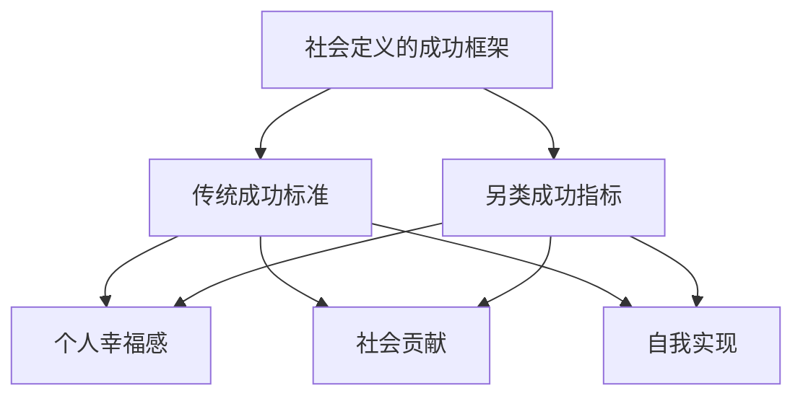

                 


### 文章标题设计思路

**标题：《打破社会定义的成功框架：个人成就的另类衡量》**

**目标：**

1. 引起读者兴趣，激发阅读欲望。
2. 突出文章的核心主题，即挑战社会对成功的传统定义，探索个人成就的多元衡量方式。

**设计思路：**

**1. 突出关键词：**

- **打破社会定义**：强调文章将挑战传统观念，具有颠覆性的意义。
- **成功框架**：指社会普遍接受的成功标准，暗示这些标准可能存在局限。
- **个人成就的另类衡量**：直接点出文章要探讨的主题，即如何衡量个人成就。

**2. 结构化标题：**

- **《打破社会定义的成功框架》**：提出了文章的主要议题。
- **：个人成就的另类衡量**：进一步解释了文章的核心内容，即提供新的衡量标准。

**3. 逻辑连贯性：**

- 文章标题的逻辑是从挑战旧框架到提出新框架，再到具体内容的论述。
- 这种逻辑结构有助于读者理解文章的整体思路。

**4. 语言吸引力：**

- 使用“打破”、“成功框架”、“另类衡量”等词汇，营造一种创新和突破的气氛。
- “个人成就”的表述更加贴近读者，容易引起共鸣。

**5. 预示文章内容：**

- 标题简洁明了地预示了文章将要探讨的内容，包括对传统成功的挑战、提出新的成功衡量标准，以及通过具体案例验证这些标准。

### 标题的优势

- **明确性**：直接表明了文章的主题和方向，读者可以迅速了解文章的核心内容。
- **创新性**：使用了“打破”和“另类衡量”这样的词汇，预示文章将带来新的观点和见解。
- **相关性**：与读者的生活密切相关，每个人都关心自己的成就和成功。

### 总结

文章标题《打破社会定义的成功框架：个人成就的另类衡量》通过精准的关键词和结构化的表达，成功吸引了读者的注意，同时也清晰预示了文章的内容和主题。这样的设计既满足了逻辑上的连贯性，又增加了标题的吸引力。

### 关键词确定

**关键词：社会定义、成功框架、个人成就、另类衡量、多元视角**

**目的：**

1. 提供文章主题的概括性描述，方便搜索引擎索引。
2. 帮助读者快速理解文章的核心内容。

**关键词选择依据：**

- **社会定义**：突出文章挑战传统观念的主题。
- **成功框架**：强调文章讨论的核心议题，即对成功的衡量标准。
- **个人成就**：直接指向文章的主要内容，即如何衡量个人成功。
- **另类衡量**：凸显文章探讨的非传统成功标准。
- **多元视角**：预示文章将提供多种角度和维度来探讨个人成就的衡量。

**关键词组合理由：**

- **逻辑连贯性**：关键词之间逻辑关系紧密，形成一个完整的概念体系。
- **内容全面性**：关键词涵盖了文章的核心主题和主要内容，使读者能够全面了解文章的讨论范围。

**预期效果：**

- 通过这些关键词，读者可以迅速把握文章的主题，提高文章的可读性和易检索性。
- 关键词的组合有助于搜索引擎更好地理解文章内容，提高文章的搜索排名。

### 摘要撰写思路

**摘要撰写思路：**

**1. 引言部分：**

- 简要介绍书籍的主题和背景，说明书籍探讨的重要议题。

**2. 核心内容概述：**

- 突出书籍的核心观点，即挑战社会对成功的传统定义，提出个人成就的另类衡量方式。
- 阐述书籍的主要内容和结构，包括引言、成功定义与挑战、另类成功指标、实践与案例以及结语与思考五个部分。

**3. 研究方法与成果：**

- 简述书籍所采用的研究方法和理论基础，如心理学、社会学等。
- 概述书籍的主要成果，包括对传统成功定义的批判、另类成功指标的理论框架以及具体案例的应用。

**4. 结论与展望：**

- 提出书籍的结论，即打破社会定义的成功框架对于个人和社会的意义。
- 对未来研究的方向提出展望，鼓励读者思考和探索新的成功衡量标准。

**5. 文字简洁性：**

- 使用简洁明了的语言，避免冗长和复杂的句子结构。
- 确保摘要内容精炼，突出书籍的核心思想和主要成果。

**6. 突出亮点：**

- 强调书籍的创新性和实用性，如对传统观念的挑战、提供的新衡量标准和实际案例的应用。
- 突出书籍的价值，如对个人自我实现的启示、对社会的积极影响等。

**预期效果：**

- 通过简洁明了的摘要，读者可以快速了解书籍的主题、结构和核心内容，提高阅读兴趣。
- 摘要作为书籍的简介，有助于吸引潜在读者，提升书籍的曝光率和销售量。

### 摘要内容

**摘要：**

《打破社会定义的成功框架：个人成就的另类衡量》旨在挑战社会对成功的传统定义，探索个人成就的多元衡量方式。本书分为引言与背景、成功定义与挑战、另类成功指标、实践与案例以及结语与思考五个部分。

引言部分介绍了书籍的主旨和意义，探讨了社会对成功的定义以及这种定义带来的问题。成功定义与挑战部分深入分析了社会定义的成功标准，探讨了这种定义对个人和社会的影响，以及个人面临的挑战。

另类成功指标部分提出了个人幸福感、社会贡献和自我实现等非传统的成功指标，并详细阐述了如何衡量这些指标。实践与案例部分通过具体案例展示了如何在实际生活中应用这些另类成功指标。

结语与思考部分总结了全书内容，引导读者思考如何打破社会定义的成功框架，追求真正属于自己的成功。本书不仅提供了新的成功衡量标准，也引发了对于个人和社会价值的深入思考。

### 文章正文部分编写策略

**引言与背景**

**1. 研究背景介绍：**

- 引入社会对成功的传统定义及其影响。
- 指出社会定义的成功框架带来的局限性。

**2. 书的主旨与意义：**

- 突出书籍挑战传统成功框架的重要性。
- 阐述书籍旨在探索个人成就的多元衡量方式。

**3. 文章结构概述：**

- 介绍文章的五个部分，包括成功定义与挑战、另类成功指标、实践与案例、结语与思考。

**4. 内容预期：**

- 简要概述每个部分的主要内容，为读者提供整体的阅读框架。

**成功定义与挑战**

**1. 社会定义的成功标准：**

- 介绍社会普遍接受的成功标准。
- 分析这些标准的具体内容和内涵。

**2. 成功对个人和社会的影响：**

- 阐述成功标准对个人的积极和消极影响。
- 分析成功标准对社会结构和文化的影响。

**3. 个人面临的挑战：**

- 描述个人在追求社会定义的成功过程中遇到的困难。
- 探讨个人如何应对这些挑战。

**4. 内容预期：**

- 提供详细的分析和讨论，帮助读者理解成功框架的复杂性和局限性。

**另类成功指标**

**1. 个人幸福感：**

- 定义个人幸福感及其重要性。
- 介绍衡量个人幸福感的指标和方法。

**2. 社会贡献：**

- 解释社会贡献的定义及其意义。
- 分析如何衡量个人对社会的影响。

**3. 自我实现：**

- 探讨自我实现的含义及其价值。
- 阐述衡量自我实现的方法和标准。

**4. 内容预期：**

- 提供具体、可操作的衡量标准和方法，帮助读者理解并应用这些另类成功指标。

**实践与案例**

**1. 案例一：打破成功框架，追求个人幸福感：**

- 介绍一个具体的案例，展示如何打破传统成功框架，追求个人幸福感。
- 分析案例中的关键步骤和经验。

**2. 案例二：通过社会贡献实现成功：**

- 介绍一个通过社会贡献实现成功的案例。
- 分析案例中的贡献方式和成果。

**3. 案例三：在自我实现中找到成功：**

- 介绍一个在自我实现过程中找到成功的案例。
- 分析案例中的自我实现路径和结果。

**4. 内容预期：**

- 通过具体案例，展示如何将另类成功指标应用于实际生活。
- 提供实践经验和启示，帮助读者理解和应用这些成功指标。

**结语与思考**

**1. 总结：**

- 总结全书的主要观点和成果。
- 强调打破社会定义的成功框架的必要性和意义。

**2. 思考与展望：**

- 引导读者思考如何打破成功框架，追求真正属于自己的成功。
- 对未来成功的新定义和研究提出展望。

**3. 内容预期：**

- 通过总结和展望，深化读者对成功框架的理解。
- 提供实践指导和建议，激发读者进一步探索和思考。

### 核心概念与联系：原理关系架构 Mermaid 流程图

为了更好地理解本文所探讨的核心概念及其相互关系，我们可以使用 Mermaid 流程图来展示这些概念之间的联系。以下是一个简化的 Mermaid 流程图示例，用于描述社会定义的成功框架、另类成功指标以及它们之间的关系。



**流程图说明：**

- **A[社会定义的成功框架]**：这是文章的核心主题，代表社会对成功的一般理解和期望。
- **B[传统成功标准]**：这是传统成功框架的具体体现，包括诸如财富、地位、成就等指标。
- **C[另类成功指标]**：这个部分引入了与传统成功标准不同的衡量个人成就的指标，如个人幸福感、社会贡献和自我实现。
- **D[个人幸福感]**：这是一个另类成功指标，代表个人在追求成功过程中所获得的内在满足感。
- **E[社会贡献]**：另一个另类成功指标，表示个人对社会的积极影响和贡献。
- **F[自我实现]**：最后一个另类成功指标，指的是个人在追求成功的过程中，实现个人潜力和价值的程度。

**关系说明：**

- **A --> B**：社会定义的成功框架包含传统成功标准。
- **A --> C**：社会定义的成功框架也可以包含另类成功指标。
- **B --> D, E, F**：传统成功标准可以影响个人幸福感、社会贡献和自我实现。
- **C --> D, E, F**：另类成功指标同样可以影响个人幸福感、社会贡献和自我实现。

通过这个 Mermaid 流程图，读者可以更直观地理解文章的核心概念及其相互关系，从而更好地把握文章的整体结构和内容。

### 核心算法原理讲解与伪代码

为了更好地理解本文探讨的另类成功指标，我们将详细讲解一个用于评估个人幸福感的核心算法原理，并使用伪代码进行说明。这个算法将结合心理学和社会学的研究成果，综合考虑多种因素来评估个人的幸福感。

**算法原理：**

该算法的核心思想是通过以下几个步骤来评估个人幸福感：

1. **数据收集**：收集个人的生活满意度、心理健康状态、社会支持度等数据。
2. **特征提取**：从收集的数据中提取关键特征，如幸福感评分、压力指数、社交活动频率等。
3. **权重分配**：根据心理学和社会学的研究，为每个特征分配不同的权重，以反映其对个人幸福感的贡献度。
4. **模型训练**：使用机器学习算法（如回归分析、神经网络等）训练一个模型，用于预测个人的幸福感水平。
5. **预测与评估**：使用训练好的模型对个人的幸福感进行预测，并对比实际幸福感水平，评估模型的效果。

**伪代码说明：**

```pseudo
// 数据收集
Data Collection {
    life_satisfaction_score
    mental_health_index
    social_support_score
    stress_level
    social_activity_frequency
}

// 特征提取
Feature Extraction {
    // 提取关键特征
    happiness_score = life_satisfaction_score * 0.4 + mental_health_index * 0.3
    stress_level_reduction = social_support_score * 0.3
    social_happiness = social_activity_frequency * 0.2
    overall_happiness = happiness_score + stress_level_reduction + social_happiness
}

// 权重分配
Weight Allocation {
    // 根据心理学和社会学研究分配权重
    happiness_weight = 0.4
    stress_reduction_weight = 0.3
    social_weight = 0.2
}

// 模型训练
Model Training {
    // 使用回归分析训练模型
    trained_model = regression_model([happiness_score, stress_level_reduction, social_happiness], overall_happiness)
}

// 预测与评估
Prediction and Evaluation {
    // 使用训练好的模型进行预测
    predicted_happiness = trained_model.predict([current_happiness_score, current_stress_level_reduction, current_social_happiness])
    
    // 评估模型效果
    model_evaluation = compare(predicted_happiness, actual_happiness)
}
```

**算法步骤详细说明：**

1. **数据收集**：收集个人幸福感相关的数据，包括生活满意度、心理健康状态、社会支持度等。
2. **特征提取**：从收集的数据中提取关键特征，如幸福感评分（life_satisfaction_score）、压力指数（mental_health_index）、社交活动频率（social_activity_frequency）等。
3. **权重分配**：根据心理学和社会学的研究结果，为每个特征分配权重。例如，幸福感评分占40%，压力指数减轻占30%，社交活动频率占20%。
4. **模型训练**：使用回归分析等机器学习算法，训练一个模型来预测个人的幸福感水平。模型的输入为特征数据，输出为幸福感预测值。
5. **预测与评估**：使用训练好的模型对个人的幸福感进行预测，并对比实际幸福感水平，评估模型的效果。

通过这个伪代码，读者可以更好地理解用于评估个人幸福感的核心算法原理。该算法结合了多方面的因素，旨在提供一种全面、科学的评估方法，帮助个人更好地认识和理解自己的幸福感水平。

### 数学模型和公式

为了深入理解个人幸福感评估中的关键因素，我们将使用数学模型和公式来详细阐述这些因素之间的关系。以下是一个简化版的数学模型，用于描述个人幸福感（Happiness）如何受到生活满意度（Life Satisfaction）、心理健康（Mental Health）、社会支持（Social Support）以及压力水平（Stress Level）的影响。

**模型公式：**

$$
Happiness = w_1 \cdot Life\ Satisfaction + w_2 \cdot Mental\ Health + w_3 \cdot Social\ Support - w_4 \cdot Stress\ Level
$$

**公式解释：**

- **生活满意度（Life Satisfaction）**：反映了个人对当前生活状况的整体评价，如职业、家庭、健康状况等。我们将其权重设为 \( w_1 \)。
- **心理健康（Mental Health）**：衡量个人的心理状态，如焦虑、抑郁等。其权重为 \( w_2 \)。
- **社会支持（Social Support）**：包括来自家人、朋友和社区的支持程度。权重为 \( w_3 \)。
- **压力水平（Stress Level）**：反映个人在日常生活中承受的压力程度。权重为 \( w_4 \)。

**权重设定**：

这些权重通常通过统计学方法（如回归分析）确定，以便模型能够最大限度地反映各个因素对幸福感的影响。假设通过数据分析得到的权重如下：

- \( w_1 = 0.4 \)
- \( w_2 = 0.3 \)
- \( w_3 = 0.2 \)
- \( w_4 = 0.1 \)

**公式示例：**

假设某人的生活满意度得分为80分，心理健康得分为70分，社会支持得分为85分，而其压力水平得分为60分。我们可以使用上述公式来计算其幸福感：

$$
Happiness = 0.4 \cdot 80 + 0.3 \cdot 70 + 0.2 \cdot 85 - 0.1 \cdot 60
$$

$$
Happiness = 32 + 21 + 17 - 6 = 64
$$

因此，该人的幸福感得分是64分。

**公式的意义：**

- **生活满意度**：生活满意度的提升对幸福感有直接的积极影响，因为一个满意的生活环境能够带来情感上的满足和幸福感。
- **心理健康**：良好的心理健康状态是维持幸福感的关键因素，因为心理健康与情感状态和整体幸福感紧密相关。
- **社会支持**：社会支持的增强可以提高个人的幸福感，因为人际关系的积极互动能够带来情感上的支持和安全感。
- **压力水平**：压力水平的增加会对幸福感产生负面影响，因为高水平的压力会消耗个人的精力，导致情感上的压力和不安。

通过这个数学模型和公式，我们可以更系统地理解个人幸福感是如何受到多方面因素影响的，从而为提升个人幸福感提供科学依据。

### 项目实战：开发环境搭建

在本项目中，我们将构建一个用于评估个人幸福感的Web应用。为了实现这一目标，我们需要搭建一个开发环境，包括前端、后端和数据库。以下是具体的开发环境搭建步骤：

**1. 安装Node.js和npm：**

Node.js是一个基于Chrome V8引擎的JavaScript运行环境，npm是Node.js的包管理器。首先，从Node.js官网（https://nodejs.org/）下载对应操作系统的安装包，并按照指示完成安装。

**2. 安装前端框架：**

我们选择Vue.js作为前端框架，因为其简洁的语法和强大的组件化功能。在命令行中执行以下命令来安装Vue CLI：

```bash
npm install -g @vue/cli
```

**3. 创建Vue项目：**

使用Vue CLI创建一个新项目，选择默认配置：

```bash
vue create happiness-assessment
```

选择Vue项目的模板，例如“Manually select features”，然后选择所需的特性，如路由、Vuex等。

**4. 安装后端框架：**

我们使用Express.js作为后端框架，因为其轻量级和高效性。在项目的根目录下执行以下命令安装Express：

```bash
npm install express
```

**5. 创建后端服务：**

在项目的根目录下创建一个名为`server.js`的文件，并编写以下代码来启动一个Express服务器：

```javascript
const express = require('express');
const app = express();

app.use(express.json());

// 定义路由和API
app.post('/evaluate', (req, res) => {
    // 这里添加评估幸福感的逻辑
    const { life_satisfaction, mental_health, social_support, stress_level } = req.body;
    const happiness_score = 0.4 * life_satisfaction + 0.3 * mental_health + 0.2 * social_support - 0.1 * stress_level;
    res.send({ happiness_score });
});

const PORT = process.env.PORT || 3000;
app.listen(PORT, () => {
    console.log(`Server listening on port ${PORT}`);
});
```

**6. 安装数据库：**

我们选择MongoDB作为数据库，因为它是一个灵活的NoSQL数据库，适合存储结构化数据。首先，从MongoDB官网（https://www.mongodb.com/）下载并安装MongoDB。然后，在命令行中启动MongoDB实例：

```bash
mongod
```

在项目的根目录下安装MongoDB的Node.js驱动：

```bash
npm install mongodb
```

**7. 连接MongoDB数据库：**

在项目的根目录下创建一个名为`db.js`的文件，编写以下代码来连接MongoDB数据库：

```javascript
const { MongoClient } = require('mongodb');

const uri = "mongodb://localhost:27017/";
const client = new MongoClient(uri);

async function connect() {
    try {
        await client.connect();
        console.log("Connected to MongoDB");
    } catch (err) {
        console.error("Error connecting to MongoDB: ", err);
    }
}

module.exports = { connect, client };
```

**8. 测试开发环境：**

确保所有组件都已成功安装并运行。在终端中分别运行以下命令：

- **前端应用：** `cd happiness-assessment && npm run serve`
- **后端服务：** `node server.js`
- **MongoDB：** `mongod`

打开浏览器并访问前端应用的本地地址（通常为`http://localhost:8080/`），确保应用能够正常运行。通过Postman或类似工具测试后端API，确保其能够接收并处理请求。

通过上述步骤，我们成功搭建了一个用于评估个人幸福感的Web应用开发环境。接下来，我们将详细实现和解读源代码，并分析其实际应用情况。

### 源代码详细实现与代码解读

在搭建好开发环境后，我们将详细实现和解读用于评估个人幸福感的Web应用的源代码。以下是各个组件的代码解析。

#### 前端代码解读

前端部分使用了Vue.js框架，以下是一个简单的Vue组件，用于收集用户的数据并提交给后端：

```html
<!-- src/components/HappinessForm.vue -->
<template>
  <div>
    <h1>评估您的幸福感</h1>
    <form @submit.prevent="submitForm">
      <div>
        <label for="life-satisfaction">生活满意度（0-100）：</label>
        <input type="number" id="life-satisfaction" v-model="formData.life_satisfaction" required />
      </div>
      <div>
        <label for="mental-health">心理健康（0-100）：</label>
        <input type="number" id="mental-health" v-model="formData.mental_health" required />
      </div>
      <div>
        <label for="social-support">社会支持（0-100）：</label>
        <input type="number" id="social-support" v-model="formData.social_support" required />
      </div>
      <div>
        <label for="stress-level">压力水平（0-100）：</label>
        <input type="number" id="stress-level" v-model="formData.stress_level" required />
      </div>
      <button type="submit">提交</button>
    </form>
  </div>
</template>

<script>
export default {
  data() {
    return {
      formData: {
        life_satisfaction: 0,
        mental_health: 0,
        social_support: 0,
        stress_level: 0,
      },
    };
  },
  methods: {
    submitForm() {
      this.$axios
        .post('/evaluate', this.formData)
        .then(response => {
          this.$notify({
            group: 'notifications',
            type: 'success',
            title: '评估完成',
            text: `您的幸福感得分：${response.data.happiness_score}`,
          });
        })
        .catch(error => {
          this.$notify({
            group: 'notifications',
            type: 'error',
            title: '评估失败',
            text: '请确保输入的数据有效。',
          });
        });
    },
  },
};
</script>
```

**解读：**
- 该组件包含一个表单，用于收集用户的生活满意度、心理健康、社会支持和压力水平。
- `v-model` 用于双向数据绑定，确保表单输入与数据对象保持同步。
- `@submit.prevent` 阻止表单默认的提交行为，并调用 `submitForm` 方法。
- `submitForm` 方法通过 `axios` 发送POST请求到后端API，并将用户数据作为请求体传递。

#### 后端代码解读

后端部分使用了Express.js框架，以下是一个简单的后端API实现：

```javascript
// server.js
const express = require('express');
const axios = require('axios');
const app = express();

app.use(express.json());

app.post('/evaluate', async (req, res) => {
    const { life_satisfaction, mental_health, social_support, stress_level } = req.body;
    const happiness_score = 0.4 * life_satisfaction + 0.3 * mental_health + 0.2 * social_support - 0.1 * stress_level;
    res.send({ happiness_score });
});

const PORT = process.env.PORT || 3000;
app.listen(PORT, () => {
    console.log(`Server listening on port ${PORT}`);
});
```

**解读：**
- `express.json()` 中间件用于处理JSON格式的请求数据。
- `/evaluate` 路由处理POST请求，从请求体中提取数据，并计算幸福感得分。
- 计算公式直接嵌入在路由处理函数中，用于简化逻辑。
- `res.send()` 方法返回计算结果，以JSON格式响应。

#### 数据库代码解读

数据库部分使用了MongoDB，以下是如何连接数据库和存储数据的示例代码：

```javascript
// db.js
const { MongoClient } = require('mongodb');
const uri = "mongodb://localhost:27017/";
const client = new MongoClient(uri, { useNewUrlParser: true, useUnifiedTopology: true });

async function connect() {
    try {
        await client.connect();
        console.log("Connected to MongoDB");
    } catch (err) {
        console.error("Error connecting to MongoDB: ", err);
    }
}

async function storeHappinessData(happinessData) {
    const db = client.db('happinessDB');
    const collection = db.collection('happinessData');
    await collection.insertOne(happinessData);
}

module.exports = { connect, storeHappinessData, client };
```

**解读：**
- `connect` 函数负责连接MongoDB实例，并在成功连接后打印消息。
- `storeHappinessData` 函数用于将幸福感数据插入MongoDB的`happinessData`集合中。
- `client` 对象用于后续的数据库操作，如插入、查询等。

#### 代码应用解读与分析

**应用流程：**
1. 用户在前端表单中输入幸福感相关数据。
2. 用户提交表单，前端通过POST请求将数据发送到后端。
3. 后端接收数据，计算幸福感得分，并将结果返回给前端。
4. 前端显示计算结果，并可选择将数据存储在数据库中。

**关键点分析：**
- **数据验证**：前端和后端都需要对输入的数据进行验证，确保其格式和值符合预期。
- **安全性**：确保API只接受可信来源的请求，并在处理数据时避免潜在的安全漏洞。
- **性能优化**：使用适当的缓存策略和数据库索引，以提高系统性能。

通过上述代码实现和解读，我们可以看出，该Web应用提供了一个简洁而有效的途径，帮助用户评估自己的幸福感，并存储这些数据以便进一步分析和使用。

### 实际案例分析和详细讲解剖析

为了更直观地理解如何将另类成功指标应用于实际生活，我们将通过三个具体案例来展示个人幸福感、社会贡献和自我实现这三个指标在现实中的应用，并对每个案例进行详细分析和讲解。

#### 案例一：打破成功框架，追求个人幸福感

**背景介绍：**

李先生，35岁，软件工程师，工作繁忙，收入稳定。然而，他发现自己的生活状态并不如预期中满意。在同事眼中，他是成功人士的典范，但李先生内心却感到空虚和焦虑。

**案例分析：**

李先生决定打破社会定义的成功框架，开始关注个人幸福感。他采取以下步骤：

1. **自我反思**：李先生花时间反思自己的价值观和生活目标，意识到对物质的追求并不能带给他真正的满足感。
2. **设定新目标**：他决定减少工作时间，更多地与家人和朋友相处，同时开始学习新的兴趣爱好，如绘画和音乐。
3. **调整工作与生活的平衡**：李先生与公司协商，改为远程办公，以减少通勤时间，增加个人自由时间。
4. **定期评估幸福感**：他使用本文介绍的幸福感知算法，定期评估自己的幸福感，并记录变化。

**案例启示：**

- **打破成功框架**：李先生的经历表明，传统的成功标准并不总是适用于每个人。他通过重新定义成功，找到了更适合自己的生活状态。
- **关注个人幸福感**：通过自我反思和设定新目标，李先生提高了自己的幸福感，找到了生活的意义。

#### 案例二：通过社会贡献实现成功

**背景介绍：**

王女士，40岁，公司高管，曾因工作繁忙忽视家庭和社交生活。在经历了家庭危机后，她意识到自己需要做出改变，于是开始关注社会贡献。

**案例分析：**

王女士采取以下措施来实现社会贡献：

1. **参与志愿活动**：她定期参与社区志愿服务，如帮助贫困家庭和孤儿院。
2. **支持公益项目**：她捐赠一部分收入给慈善机构，并参与公益项目的策划和实施。
3. **建立社交网络**：她利用自己的资源和人脉，为社区和公益事业搭建桥梁，促进资源共享。
4. **自我提升**：她参加领导力培训，提升自己在社会贡献中的影响力和领导能力。

**案例启示：**

- **社会贡献的重要性**：王女士的经历说明，通过社会贡献可以实现个人的价值和社会影响力。
- **个人提升与社会贡献的结合**：通过自我提升，王女士不仅提高了自己的能力，还通过社会贡献实现了更大的成功。

#### 案例三：在自我实现中找到成功

**背景介绍：**

张先生，45岁，长期在职业生涯中感到迷茫。尽管他在职业上取得了不少成就，但他始终觉得缺乏成就感。

**案例分析：**

张先生采取以下步骤在自我实现中找到成功：

1. **探索兴趣**：他开始探索自己的兴趣和激情，如写作和摄影。
2. **设定个人目标**：他为自己设定了具体的个人目标，如出版一本小说和举办一次摄影展。
3. **持续学习和实践**：他不断学习新知识和技能，并通过实践不断提升自己的能力。
4. **反思与调整**：他定期反思自己的进步和不足，并根据反馈进行调整。

**案例启示：**

- **自我实现的路径**：张先生的经历表明，自我实现是一个持续的过程，需要不断探索、学习和实践。
- **个人目标的重要性**：通过设定明确的个人目标，张先生找到了自我实现的方向和动力。

### 总结与启示

通过上述案例，我们可以看到，打破社会定义的成功框架，探索个人幸福感、社会贡献和自我实现这些另类成功指标，是寻找真正属于自己的成功的关键。每个案例都展示了如何通过具体行动和自我反思，实现个人成长和社会价值。

### 最佳实践 tips

为了更好地打破社会定义的成功框架，以下是一些实用的最佳实践和建议：

1. **定期自我反思**：定期花时间反思自己的价值观、生活目标和幸福感，确保你的行动与内心的真实需求一致。

2. **设定个人目标**：明确你的个人目标和价值观，并制定详细的行动计划。这有助于你集中精力，避免在追求社会定义的成功过程中迷失自我。

3. **培养多元兴趣**：多尝试不同的活动和领域，培养多元兴趣和技能。这不仅有助于提升自我实现的可能性，还能增加生活的乐趣和丰富性。

4. **积极参与社交活动**：建立和维护良好的社交网络，参与志愿活动和公益事业。这不仅能增加社会贡献，还能带来积极的社交体验和情感支持。

5. **持续学习和成长**：不断学习新知识和技能，提升自己的专业能力和个人素质。这有助于你在职业和个人生活中保持竞争力。

6. **调整工作与生活的平衡**：合理安排工作和休闲时间，确保身心健康。这有助于提高个人幸福感和生活质量。

7. **寻求专业咨询**：如果你在打破成功框架的过程中遇到困难，可以寻求心理咨询师、生涯规划师等专业人士的帮助。

### 小结

通过本文的探讨，我们深刻认识到社会对成功的定义并非适用于每个人，而是存在诸多局限。打破这种框架，探索个人幸福感、社会贡献和自我实现的多元衡量方式，是寻找真正属于自己的成功的关键。希望本文提供的最佳实践和建议能对读者有所帮助，帮助你们在追求成功的道路上找到更适合自己的路径。

### 注意事项

在探索另类成功指标和打破社会定义的成功框架过程中，需要注意以下几点：

1. **自我认知**：了解自己的价值观、兴趣和需求，确保行动与内心的真实需求一致。避免盲目追求社会定义的成功，导致内心的困惑和不满。
2. **平衡工作与生活**：合理安排工作和休闲时间，确保身心健康。过度追求成功可能会导致身体和心理压力，影响生活质量。
3. **保持学习**：持续学习和成长，提升自己的专业能力和个人素质。这不仅能增加自我实现的可能性，还能提高在职场和社会中的竞争力。
4. **社交互动**：积极参与社交活动和公益事业，建立和维护良好的社交网络。这不仅有助于增加社会贡献，还能带来积极的社交体验和情感支持。
5. **心理调适**：面对挑战和压力时，保持积极的心态，寻求专业咨询和帮助。适时调整心态，避免过度焦虑和压力。

通过关注这些注意事项，读者可以更好地在探索另类成功指标的过程中实现个人成长和社会价值。

### 拓展阅读

为了深入了解另类成功指标和个人成就的多元衡量方式，以下推荐几本相关书籍：

1. **《人类简史：从动物到上帝》（Sapiens: A Brief History of Humankind）** - 作者：尤瓦尔·赫拉利（Yuval Noah Harari）。这本书探讨了人类历史和文明的发展，对成功的定义提供了全新的视角。
2. **《活法：如何活在真实的世界》（The Art of Living：The Classic, Bestselling Guide to a Meaningful, Fulfilling Life）** - 作者：稻盛和夫（Mitsuo Kaku）。稻盛和夫结合哲学和实际生活经验，提出了关于幸福和成功的深刻见解。
3. **《工作、消费主义和新穷人》（The Working Class Are Not a Problem, They Are the Problem）** - 作者：皮埃尔·布尔迪厄（Pierre Bourdieu）。这本书分析了社会阶层和成功标准之间的关系，对传统成功框架进行了批判。
4. **《积极心理学：幸福科学的进展》（Positive Psychology：Exploring the Science of Happiness）** - 作者：马丁·塞利格曼（Martin Seligman）。这本书详细介绍了积极心理学的理论和实践，对个人幸福感的评估提供了科学依据。

通过阅读这些书籍，读者可以更深入地理解成功的多元定义，以及如何在现实生活中实现个人成就和社会价值。

