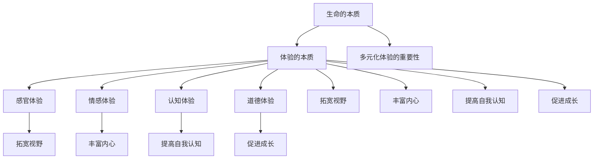
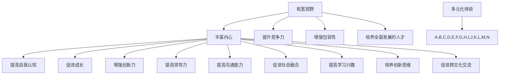
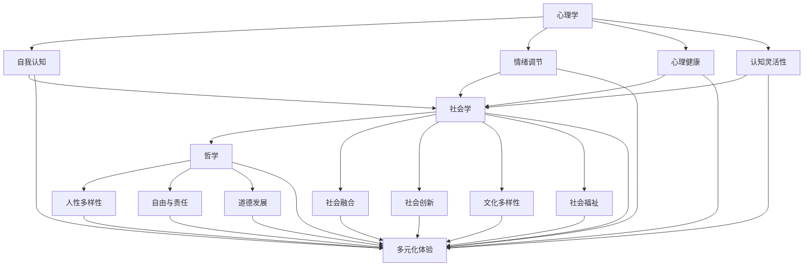

                 

### 第一部分：多元化体验的理论基础

#### 第1章：生命与体验的探讨

在讨论多元化体验的重要性之前，我们首先需要理解生命的本质和体验的意义。生命是一段奇妙的旅程，而体验则是我们在这个旅程中获得的宝贵财富。那么，什么是体验？体验的本质是什么？

**1.1 生命的定义与探讨**

生命是自然界中最复杂、最神秘的现象之一。从科学的角度来看，生命是指具有自我复制、自我修复和自我组织能力的物质系统。这一定义强调了生命的自主性和复杂性。

从哲学的角度来看，生命不仅仅是一种物质存在，更是一种精神存在。我们每个人都有着独特的思想、情感和意志，这些都是生命的组成部分。

**1.2 体验的本质与分类**

体验是我们对周围世界的感知和感受。它不仅仅是一种主观感受，更是一种对世界的认知和理解。体验可以分为感官体验、情感体验、认知体验和道德体验等不同类型。

- **感官体验**：通过五官（视觉、听觉、嗅觉、味觉、触觉）获得的体验。例如，看到美丽的风景、听到动听的音乐、闻到芳香的气味等。
- **情感体验**：通过情感活动获得的体验。例如，感受到快乐、悲伤、愤怒、爱等情感。
- **认知体验**：通过思维活动获得的体验。例如，学习新知识、思考问题、解决问题等。
- **道德体验**：通过道德活动获得的体验。例如，遵守道德规范、助人为乐、承担责任等。

### 多元化体验的重要性

多元化体验对于个人的成长和发展具有至关重要的意义。通过多元化的体验，我们可以拓宽视野、丰富内心、提高自我认知和自我价值。

**2.1 多元化体验的概念**

多元化体验是指在不同领域、不同环境、不同文化背景下进行的体验活动。它不仅仅包括感官体验和情感体验，还包括认知体验和道德体验。

**2.2 多元化体验对个人成长的影响**

多元化体验对个人成长的影响可以从以下几个方面来理解：

- **拓宽视野**：通过多元化的体验，我们可以了解到不同的文化、不同的生活方式，从而拓宽我们的视野，提高我们的包容性和开放性。
- **丰富内心**：多元化的体验可以给我们带来丰富的情感体验和认知体验，从而丰富我们的内心世界，提高我们的情感智商和认知能力。
- **提高自我认知**：通过多元化的体验，我们可以更好地了解自己，发现自己的优点和不足，从而提高自我认知和自我价值。
- **促进成长**：多元化的体验可以激发我们的好奇心和求知欲，促使我们不断学习、探索和成长。

### 多元化体验的理论基础

多元化体验的理论基础主要来自于心理学、社会学和哲学等领域。

- **心理学**：心理学研究表明，多元化体验可以促进个体的心理发展，提高个体的心理适应能力。
- **社会学**：社会学认为，多元化体验可以促进社会和谐，提高社会的包容性和多样性。
- **哲学**：哲学认为，多元化体验是人生的一种基本需求，是实现个人价值和社会价值的重要途径。

### 本章小结

本章我们从生命的本质和体验的意义出发，探讨了多元化体验的概念和重要性。通过多元化的体验，我们可以拓宽视野、丰富内心、提高自我认知和自我价值。下一章，我们将进一步探讨多元化体验的理论基础，分析心理学、社会学和哲学对多元化体验的理解和认识。

## Mermaid 流程图

通过这个流程图，我们可以清晰地看到生命、体验和多元化体验之间的关系，以及它们对个人成长的影响。在下一章中，我们将进一步探讨多元化体验的理论基础，分析心理学、社会学和哲学对多元化体验的理解和认识。

### 第2章：多元化体验的价值

在第一章中，我们探讨了生命与体验的关系，并简要介绍了多元化体验的概念。在本章中，我们将深入探讨多元化体验的价值，特别是它对个人成长的影响。

#### 2.1 多元化体验的概念

多元化体验是指在不同领域、不同环境、不同文化背景下进行的体验活动。它不仅包括感官体验和情感体验，还涵盖了认知体验和道德体验。多元化体验的核心在于通过多种形式的体验，让我们能够更全面、更深入地了解自己和外部世界。

#### 2.2 多元化体验对个人成长的影响

多元化体验对个人成长的影响是多方面的，以下是一些主要的影响：

- **拓宽视野**：通过多元化的体验，我们可以接触到不同的文化、不同的生活方式，从而拓宽我们的视野。这种视野的拓宽有助于我们更好地理解世界，提高我们的包容性和开放性。

- **丰富内心**：多元化体验可以给我们带来丰富的情感体验和认知体验，从而丰富我们的内心世界。这种内心的丰富有助于我们更好地应对生活中的挑战，提高我们的情感智商和认知能力。

- **提高自我认知**：通过多元化的体验，我们可以更好地了解自己，发现自己的优点和不足。这种自我认知的提高有助于我们更好地规划自己的未来，实现个人价值。

- **促进成长**：多元化体验可以激发我们的好奇心和求知欲，促使我们不断学习、探索和成长。这种成长不仅体现在知识层面，还体现在情感、心理和社会能力等方面。

#### 2.3 多元化体验对职业生涯的影响

多元化体验不仅对个人成长有重要影响，还对职业生涯有着深远的影响。以下是一些具体的影响：

- **提升竞争力**：拥有多元化背景的人通常具有更广泛的技能和知识，这使得他们在职场中更具竞争力。他们能够更好地适应不同的工作环境，处理复杂的问题。

- **增强创新力**：多元化体验可以激发我们的创新思维。当我们在不同领域进行探索时，往往会发现新的视角和解决方案，从而推动创新。

- **提高领导力**：多元化体验有助于我们培养领导力。通过接触不同的文化、不同的价值观，我们可以更好地理解和沟通，从而更有效地领导团队。

#### 2.4 多元化体验对人际关系的影响

多元化体验不仅对个人和职业生涯有影响，还对人际关系有着重要的影响。以下是一些具体的影响：

- **增强包容性**：通过多元化的体验，我们可以更好地理解他人，从而增强我们的包容性。这种包容性有助于建立和谐的人际关系。

- **提高沟通能力**：多元化体验可以让我们接触到不同的沟通方式和文化背景，从而提高我们的沟通能力。这种沟通能力有助于我们更好地与他人交流和合作。

- **促进社会融合**：多元化体验可以促进社会融合，减少社会冲突。通过了解和尊重不同的文化，我们可以更好地融入社会，为社会的和谐发展做出贡献。

#### 2.5 多元化体验的教育意义

多元化体验在教育中也具有重要意义。以下是一些具体的影响：

- **培养全面发展的人才**：多元化体验可以让学生接触到不同的学科、不同的文化，从而培养全面发展的人才。

- **提高学习兴趣**：多元化体验可以激发学生的学习兴趣，提高他们的学习动机。

- **培养创新思维**：多元化体验可以激发学生的创新思维，培养他们的创造力。

- **促进跨文化交流**：多元化体验可以让学生接触到不同的文化，从而促进跨文化交流，培养学生的全球视野。

#### 2.6 多元化体验的最佳实践

为了更好地实践多元化体验，以下是一些建议：

- **积极寻找多元化的机会**：无论是在职业生涯中，还是在日常生活中，都应积极寻找多元化的机会，如参加国际会议、跨文化项目等。

- **培养跨文化沟通能力**：通过学习不同的语言、了解不同的文化，提高自己的跨文化沟通能力。

- **多角度看待问题**：在处理问题时，应尝试从不同的角度和视野出发，以便获得更全面的解决方案。

- **终身学习**：保持学习的态度，不断探索新的领域和知识，以实现个人成长和职业发展。

### 本章小结

本章我们从多个角度探讨了多元化体验的价值，特别是它对个人成长的影响。通过多元化体验，我们可以拓宽视野、丰富内心、提高自我认知和自我价值，同时也有助于职业生涯的发展、人际关系的建立和教育的进步。在下一章中，我们将进一步探讨多元化体验的理论基础，分析心理学、社会学和哲学对多元化体验的理解和认识。

## Mermaid 流程图

通过这个流程图，我们可以清晰地看到多元化体验对个人成长、职业生涯、人际关系和教育的影响。在下一章中，我们将进一步探讨多元化体验的理论基础，分析心理学、社会学和哲学对多元化体验的理解和认识。

### 第3章：多元化体验的理论基础

在探讨多元化体验的实际价值之后，我们需要深入分析其理论基础。这一章节将涵盖心理学、社会学和哲学对多元化体验的理解和认识，从而为我们的实践提供理论支持。

#### 3.1 多元化体验心理学研究

心理学研究揭示了多元化体验对个人心理发展的积极影响。以下是一些关键观点：

- **自我认知发展**：通过多元化体验，个体能够更好地认识自己的优点和不足，从而促进自我认知的发展。

- **情绪调节**：多元化体验可以帮助个体学会调节情绪，提高情感智商。例如，通过参与不同的文化和活动，个体能够学会更好地理解和处理负面情绪。

- **心理健康**：多元化体验有助于提升个体的心理健康水平，减少心理压力和焦虑。

- **认知灵活性**：多元化体验可以增强个体的认知灵活性，使其能够更好地适应和应对复杂的环境和挑战。

#### 3.2 多元化体验与社会学分析

社会学视角关注多元化体验对社会结构和人际关系的深远影响。以下是一些主要观点：

- **社会融合**：多元化体验有助于促进不同社会群体之间的融合，减少社会冲突和歧视。

- **社会创新**：多元化体验可以激发社会创新，促进新的社会结构和组织形式的出现。

- **文化多样性**：通过多元化体验，个体能够更好地理解和尊重不同的文化，从而促进文化多样性的发展。

- **社会福祉**：多元化体验可以提升社会整体的福祉水平，提高社会成员的生活质量和幸福感。

#### 3.3 多元化体验与哲学思考

哲学对多元化体验的探讨提供了深刻的思考角度。以下是一些哲学观点：

- **人性多样性**：哲学认为，人性具有多样性，每个人都是独特的。通过多元化体验，个体能够更好地理解这种多样性，从而实现自我价值和人性完善。

- **自由与责任**：多元化体验鼓励个体追求自由和责任。个体在多元文化环境中学会尊重他人的自由，同时也承担起自己的社会责任。

- **道德发展**：哲学认为，多元化体验有助于个体的道德发展。通过参与不同的道德活动和文化实践，个体能够更好地理解和实践道德原则。

#### 3.4 多元化体验的核心概念与联系

为了更好地理解多元化体验的理论基础，我们可以通过一个Mermaid流程图来展示核心概念及其相互关系：

通过这个流程图，我们可以清晰地看到心理学、社会学和哲学如何共同构建了多元化体验的理论基础，以及这些理论基础如何相互联系和影响。

#### 3.5 多元化体验的数学模型与公式

在多元化体验的理论基础中，我们可以运用一些数学模型和公式来描述和解释多元化体验的影响。以下是一个简单的示例：

- **情绪调节的数学模型**：

  $$ M_{emotion} = f(P_{diversity}, E_{context}) $$

  其中，$M_{emotion}$ 表示情绪调节水平，$P_{diversity}$ 表示多元化体验的参与程度，$E_{context}$ 表示外部环境的影响。

- **心理健康水平的数学模型**：

  $$ H_{mental} = g(C_{support}, S_{diversity}) $$

  其中，$H_{mental}$ 表示心理健康水平，$C_{support}$ 表示社会支持，$S_{diversity}$ 表示多元化体验的参与程度。

- **认知灵活性的数学模型**：

  $$ F_{cognition} = h(I_{learning}, D_{context}) $$

  其中，$F_{cognition}$ 表示认知灵活性，$I_{learning}$ 表示学习动机，$D_{context}$ 表示多元化体验的参与程度。

这些数学模型和公式为我们提供了一个量化的视角，帮助我们更好地理解和评估多元化体验对个人成长和社会发展的影响。

### 本章小结

本章我们从心理学、社会学和哲学的角度探讨了多元化体验的理论基础。心理学研究揭示了多元化体验对个人心理发展的积极影响，社会学视角关注多元化体验对社会结构和人际关系的深远影响，而哲学提供了对人性多样性和道德发展的深刻思考。通过本章的讨论，我们不仅了解了多元化体验的理论基础，还认识到了其在个人成长和社会发展中的重要性。在下一章中，我们将进一步探讨多元化体验的实践方法，包括如何在不同领域和文化背景下进行多元化体验。

## 第4章：探索新领域

在了解了多元化体验的理论基础后，我们接下来将讨论如何在实践中探索新领域，以实现多元化体验的目标。

### 4.1 跨界学习的实践方法

跨界学习是指在不同领域之间进行学习和交流，以拓宽知识面和提升能力。以下是几种跨界学习的实践方法：

- **网络课程与在线资源**：利用互联网资源，如Coursera、edX等平台，选择不同领域的课程进行学习。这种方法可以帮助我们快速获取新领域的知识。

- **参加研讨会和讲座**：参加不同领域的研讨会和讲座，可以让我们接触到新的观点和研究成果。例如，技术领域的开发者大会、心理学领域的学术会议等。

- **实习和项目合作**：通过实习和项目合作，我们可以将理论知识应用于实际项目中，从而提升实践能力。例如，计算机专业的学生可以尝试参与心理学项目，以了解心理学的应用。

### 4.2 多元化职业体验的策略

多元化职业体验是指在不同职业领域进行实践和探索。以下是一些实现多元化职业体验的策略：

- **轮岗与跨部门合作**：在现有工作中，可以申请轮岗或跨部门合作项目，以了解不同部门的工作内容和职责。例如，在一家科技公司中，可以尝试从技术部门转到市场部门，了解市场营销和品牌管理的相关知识。

- **兼职与志愿者工作**：通过兼职和志愿者工作，我们可以体验不同的职业角色，了解不同行业的工作内容和挑战。例如，在科技公司兼职的同时，可以参加非营利组织的志愿者工作，了解社会服务的实际操作。

- **职业咨询与培训**：参加职业咨询和培训课程，可以帮助我们了解不同职业的发展前景和职业要求。例如，通过职业咨询，我们可以了解金融行业的职业路径和技能要求，从而为职业转型做好准备。

### 4.3 跨文化体验

跨文化体验是多元化体验的重要组成部分，以下是一些跨文化体验的方法：

- **留学与交换项目**：参加留学或交换项目，是体验不同文化环境最直接的方式。通过留学，我们可以深入了解目标国家的历史、文化和社会现状。

- **文化交流活动**：参加各种文化交流活动，如国际文化节、艺术展览等，可以让我们了解和体验不同文化的特色。

- **多语言学习**：学习不同语言，可以让我们更好地理解和沟通不同文化背景的人。例如，学习一门新的语言，可以帮助我们更好地了解和体验该语言所属国家的文化。

### 4.4 个人成长与多元化体验

多元化体验对个人成长有着重要的影响。以下是多元化体验对个人成长的几个方面：

- **认知能力提升**：通过多元化体验，我们可以接触到不同的知识体系和思维方式，从而提升我们的认知能力。

- **情感智商增强**：多元化体验可以让我们更好地理解他人的情感和需求，从而提高我们的情感智商。

- **社交能力提升**：通过跨文化体验和职业多元化，我们可以结识来自不同背景的人，提升我们的社交能力。

- **自我认知发展**：多元化体验可以帮助我们更好地了解自己的优点和不足，从而促进自我认知的发展。

### 4.5 多元化体验的挑战与应对

在多元化体验的过程中，我们可能会遇到一些挑战，如文化冲突、语言障碍、适应困难等。以下是一些应对策略：

- **开放心态**：保持开放的心态，尊重和理解不同文化的差异，是成功进行多元化体验的关键。

- **学习语言**：学习一门新的语言，可以帮助我们更好地融入目标文化环境。

- **寻求支持**：在面对挑战时，可以寻求他人的支持和帮助，如导师、同事、朋友等。

- **反思与调整**：定期反思自己的体验过程，根据实际情况进行调整，以更好地适应多元化体验的要求。

### 本章小结

本章我们从跨界学习、多元化职业体验和跨文化体验等方面，探讨了如何在实践中实现多元化体验。通过跨界学习，我们可以拓宽知识面和提升能力；通过多元化职业体验，我们可以了解不同行业的工作内容和挑战；通过跨文化体验，我们可以更好地理解和尊重不同文化。在下一章中，我们将进一步探讨文化多样性体验，分析如何在不同的文化背景下进行体验，以实现个人成长和社会进步。

## 第5章：文化多样性体验

在现代社会，文化多样性已成为一个不可避免的现象。不同文化之间的交融和碰撞，为我们提供了丰富的体验机会。在本章中，我们将探讨文化多样性体验的重要性，以及如何在不同文化背景下进行有效体验。

### 5.1 不同文化的理解与尊重

文化是人类的共同财富，每种文化都有其独特的价值观、信仰、习俗和行为规范。要有效地进行文化多样性体验，我们首先需要理解和尊重不同文化。

**5.1.1 文化理解的重要性**

- **提高包容性**：通过理解不同文化，我们可以更好地接受和尊重文化差异，提高社会包容性。
- **促进社会和谐**：理解不同文化有助于减少文化冲突，促进社会和谐发展。
- **增强跨文化沟通**：理解不同文化背景下的沟通方式和习惯，有助于我们更有效地进行跨文化沟通。

**5.1.2 尊重文化差异的必要性**

- **避免文化偏见**：尊重文化差异有助于避免对其他文化的偏见和歧视，建立平等和谐的交往关系。
- **促进文化共存**：尊重文化差异是文化共存和互鉴的基础，有助于不同文化共同发展。

**5.1.3 如何理解和尊重文化**

- **学习文化知识**：通过学习不同文化的背景、价值观和习俗，提高对文化的理解。
- **观察和体验**：在现实生活中，通过观察和体验不同文化的实际表现，加深对文化的认识。
- **保持开放心态**：保持开放的心态，尊重他人的文化差异，是理解和尊重文化的前提。

### 5.2 文化融合与多元文化实践

文化融合是指不同文化之间的相互影响和整合，从而形成一种新的文化现象。多元文化实践则是在不同文化背景下进行的活动，旨在促进文化多样性和文化创新。

**5.2.1 文化融合的机制**

- **文化交融**：不同文化在交流过程中，相互借鉴和融合，形成新的文化元素。
- **文化共生**：不同文化在同一环境中共存，相互适应和影响，促进文化的繁荣。
- **文化创新**：在文化融合过程中，新文化的产生和创新，丰富了人类文化的内涵。

**5.2.2 多元文化实践的形式**

- **文化交流活动**：通过举办文化节、展览、讲座等文化交流活动，促进不同文化之间的了解和交流。
- **跨国合作项目**：参与跨国合作项目，如国际学术研究、商业合作等，实现文化的跨国传播和融合。
- **跨文化团队协作**：在跨文化团队中工作，通过合作和沟通，促进文化融合和创新。

**5.2.3 多元文化实践的价值**

- **提升跨文化能力**：通过多元文化实践，提高个人的跨文化沟通和协作能力，适应全球化的发展需求。
- **促进文化创新**：多元文化实践有助于激发文化创新，推动社会进步。
- **丰富文化生活**：多元文化实践为人们提供了更丰富的文化体验，提高了生活品质。

### 5.3 文化多样性体验的策略

为了更好地进行文化多样性体验，以下是一些具体策略：

**5.3.1 提高文化意识**

- **学习文化知识**：通过学习不同文化的背景、价值观和习俗，提高对文化的认识。
- **参与文化活动**：积极参加各类文化活动，感受不同文化的魅力。

**5.3.2 增强跨文化沟通能力**

- **学习语言**：学习一门或多门外语，提高跨文化沟通能力。
- **了解沟通习惯**：了解不同文化背景下的沟通方式和习惯，提高跨文化沟通的效果。

**5.3.3 融入多元文化环境**

- **参与国际项目**：参与国际项目或交流活动，体验不同文化的实际环境。
- **融入多元社区**：融入多元文化社区，与不同文化背景的人交流互动。

### 5.4 个人成长与文化多样性体验

文化多样性体验对个人成长具有重要影响。以下是一些具体影响：

- **提升认知能力**：通过接触不同文化，拓宽知识面和视野，提升认知能力。
- **增强适应能力**：在多元文化环境中，学会适应和应对不同文化背景的挑战，提高适应能力。
- **丰富情感体验**：体验不同文化的情感表达和生活方式，丰富情感体验，提高情感智商。
- **促进自我认知**：通过文化多样性体验，更好地了解自己的文化背景和价值观，促进自我认知。

### 5.5 文化多样性体验的最佳实践

以下是进行文化多样性体验的一些最佳实践：

- **建立文化学习小组**：与志同道合的人一起学习不同文化的知识，分享体验和感受。
- **参与跨文化团队**：在跨文化团队中工作，学会与不同文化背景的人沟通和协作。
- **记录文化体验**：记录自己的文化体验，反思和总结经验教训。

### 本章小结

本章我们从不同文化的理解与尊重、文化融合与多元文化实践等方面，探讨了文化多样性体验的重要性。通过文化多样性体验，我们可以提高包容性、促进社会和谐、丰富文化生活，同时也有助于个人成长。在下一章中，我们将继续探讨身体与精神体验的重要性，分析体育锻炼和心灵修养对个人成长的影响。

## 第6章：身体与精神体验

在现代社会，身体与精神体验的重要性日益凸显。良好的身体和精神状态不仅能够提高生活质量，还能促进个人成长和自我实现。本章将探讨身体与精神体验的重要性，分析体育锻炼和心灵修养的具体方法。

### 6.1 身体锻炼与健康体验

体育锻炼是保持身体健康的重要手段。以下是一些常见的体育锻炼方法和其健康益处：

**6.1.1 常见体育锻炼方法**

- **有氧运动**：如跑步、游泳、骑自行车等。有氧运动有助于提高心肺功能，增强体能。
- **力量训练**：如举重、俯卧撑、仰卧起坐等。力量训练有助于增强肌肉力量，提高代谢率。
- **伸展运动**：如瑜伽、普拉提等。伸展运动有助于放松身心，提高柔韧性。

**6.1.2 健康益处**

- **增强免疫力**：定期锻炼可以提高免疫力，减少患病的风险。
- **改善心血管健康**：有氧运动可以降低血压、血脂，减少心血管疾病的风险。
- **提高睡眠质量**：体育锻炼有助于改善睡眠质量，促进身体和精神的恢复。
- **缓解压力**：运动可以释放身体内的压力激素，缓解压力和焦虑。

**6.1.3 身体锻炼的注意事项**

- **适量运动**：根据自身身体状况，选择适合自己的运动强度和频率。
- **持之以恒**：保持定期锻炼的习惯，效果才能显著。
- **合理饮食**：结合合理的饮食，才能更好地实现健康目标。

### 6.2 精神修养与内在探索

精神修养是提升心灵境界和内在幸福感的重要途径。以下是一些精神修养的方法：

**6.2.1 精神修养方法**

- **冥想**：冥想是一种通过专注呼吸和放松身心来达到心灵宁静的方法。它有助于减轻压力、提高专注力和情绪管理能力。
- **阅读**：阅读是一种丰富的精神食粮。通过阅读，我们可以拓宽视野、提高思维能力，同时享受心灵的宁静。
- **反思**：定期反思自己的生活和工作，有助于我们更好地了解自己，找到内心真正的需求和目标。
- **感恩**：培养感恩的心态，对生活中的点滴美好心存感激，可以提升我们的幸福感。

**6.2.2 内在探索**

- **自我认知**：通过内在探索，我们可以更好地了解自己的内心世界，包括自己的情感、价值观和信念体系。
- **自我接纳**：接纳自己的优点和不足，是内在探索的重要一步。通过自我接纳，我们可以更好地理解自己，从而实现个人成长。
- **自我提升**：通过内在探索，我们可以找到自己的需求和目标，从而实现自我提升和自我实现。

### 6.3 身体与精神体验的相互关系

身体与精神体验是相互关联的。良好的身体状态有助于提升精神状态，而积极的精神状态也能促进身体健康。以下是一些具体的关系：

- **身心互动**：身体和精神之间存在互动关系。身体状态会影响精神状态，精神状态也会影响身体状态。
- **整体健康**：身体健康和精神健康是整体健康的重要组成部分。只有身心都处于良好状态，我们才能实现真正的健康。
- **自我平衡**：通过身体锻炼和心灵修养，我们可以实现身心平衡，从而提高整体生活质量。

### 6.4 个人成长与身体精神体验

身体与精神体验对个人成长有着重要的影响。以下是一些具体影响：

- **提升自信**：通过锻炼身体和修养心灵，我们可以增强自信，更好地面对生活中的挑战。
- **提高情商**：身体锻炼和心灵修养有助于提高我们的情商，更好地理解和处理情感。
- **促进自我实现**：通过身体与精神体验，我们可以更好地了解自己，找到自己的优势和兴趣，从而实现自我价值。

### 6.5 身体与精神体验的最佳实践

以下是进行身体与精神体验的一些最佳实践：

- **制定运动计划**：根据自己的时间和身体状况，制定合理的运动计划，并持之以恒。
- **培养阅读习惯**：每天安排一段时间进行阅读，拓宽知识面，提升思维能力。
- **定期反思**：每周或每月进行一次反思，总结自己的成长和收获。
- **练习冥想**：每天安排一定时间进行冥想，放松身心，提升专注力。

### 本章小结

本章我们从身体与精神体验的重要性出发，探讨了体育锻炼和心灵修养的方法。通过身体锻炼，我们可以保持身体健康，提高生活质量；通过心灵修养，我们可以提升精神状态，实现自我成长。在下一章中，我们将进一步探讨多元化体验的评估方法，分析如何评估多元化体验的效果。

## 第7章：多元化体验的评估方法

在进行了多元化体验后，如何有效地评估其效果和影响是至关重要的一步。评估多元化体验不仅可以帮助我们了解体验的成效，还能为未来的体验提供有益的参考。以下是一些常用的多元化体验评估方法。

### 7.1 个人成长评估标准

个人成长评估标准是衡量多元化体验成效的重要指标。以下是一些常见的评估标准：

**7.1.1 认知能力提升**

- **知识储备**：通过量化学习新领域的知识，如学习新技能或新概念的数量和深度。
- **思维灵活性**：通过解决跨学科问题的能力，评估思维灵活性和创新力。

**7.1.2 情感能力提升**

- **情感管理**：评估在面对压力和挑战时，情感调节的能力。
- **同理心**：通过与他人互动，评估理解和尊重不同文化背景的人的能力。

**7.1.3 社交能力提升**

- **跨文化沟通**：通过跨文化沟通的反馈，评估在不同文化背景下沟通和合作的能力。
- **团队合作**：通过团队合作项目的表现，评估团队合作精神和领导能力。

### 7.2 多元化体验对人际关系的影响

多元化体验不仅影响个人，还会对人际关系产生深远影响。以下是一些评估方法：

**7.2.1 人际关系改善**

- **朋友网络扩大**：通过观察和统计新结识的朋友数量，评估人际关系的变化。
- **信任感增强**：通过朋友和同事的反馈，评估多元化体验后人际关系中的信任感和亲密感。

**7.2.2 跨文化理解**

- **文化知识掌握**：通过测试或问卷调查，评估对不同文化的理解程度。
- **文化适应能力**：通过参与不同文化活动的反馈，评估对多元文化的适应能力。

### 7.3 多元化体验的经济效益评估

多元化体验还可以带来经济效益，以下是一些评估方法：

**7.3.1 职业发展**

- **职位晋升**：通过工作业绩和同事反馈，评估多元化体验对职业发展的影响。
- **薪资增长**：通过薪资变化，评估多元化体验对经济收入的提升。

**7.3.2 创业机会**

- **项目成功率**：通过创业项目的成功率，评估多元化体验对创业能力的影响。
- **市场需求适应**：通过市场反馈，评估多元化体验对企业或产品适应市场的能力。

### 7.4 量化评估方法

为了更科学地评估多元化体验的效果，可以使用以下量化评估方法：

**7.4.1 自我评估问卷**

- **满意度评分**：通过设计满意度问卷，评估对多元化体验的满意程度。
- **行为变化记录**：记录多元化体验前后的行为变化，如学习新技能的频率和时间。

**7.4.2 绩效评估**

- **工作绩效**：通过工作绩效评估，如完成项目的时间和质量，评估多元化体验对工作效率的影响。
- **技能认证**：通过获取新技能的认证，评估多元化体验对技能提升的效果。

**7.4.3 反馈机制**

- **同事和导师反馈**：通过同事和导师的反馈，评估多元化体验对职业发展和社会适应的影响。
- **客户满意度调查**：通过客户满意度调查，评估多元化体验对客户服务质量的提升。

### 7.5 评估多元化体验的注意事项

在评估多元化体验时，需要注意以下几点：

- **全面性**：评估应涵盖认知、情感、社交和经济等多个方面，以全面反映体验效果。
- **客观性**：评估应基于客观数据和反馈，避免主观偏见。
- **持续性**：多元化体验的影响可能具有长期性，评估应关注长期效果。

### 本章小结

本章我们探讨了多元化体验的评估方法，包括个人成长评估标准、对人际关系的影响、经济效益评估以及量化评估方法。通过科学的评估，我们可以更好地了解多元化体验的成效，为未来的体验提供指导。在下一章中，我们将进行多元化体验的反思与总结，分析其优缺点，并讨论如何在日常生活中实践多元化体验。

## 第8章：多元化体验的反思与总结

在经历了多元化体验后，进行反思和总结是至关重要的。这不仅可以帮助我们更好地理解体验的成效，还可以为未来的发展提供宝贵的经验。

### 8.1 多元化体验的优缺点分析

**优点：**

- **拓宽视野**：多元化体验使我们能够接触到不同的文化和领域，从而拓宽我们的视野，提高我们的包容性和开放性。
- **丰富内心**：通过多元化的体验，我们可以获得丰富的情感和认知体验，从而丰富我们的内心世界，提升我们的情感智商和认知能力。
- **提高自我认知**：多元化体验让我们更好地了解自己，发现自己的优点和不足，从而促进自我认知和自我成长。
- **促进成长**：多元化体验激发了我们的好奇心和求知欲，促使我们不断学习、探索和成长。

**缺点：**

- **文化冲突**：在不同的文化环境中，可能会遇到文化冲突和误解，需要花费时间和精力去适应和理解。
- **时间成本**：多元化体验可能需要大量的时间和精力，对工作和生活产生影响。
- **资源有限**：在有限的时间和资源下，进行多元化体验可能会面临选择困难，无法全面深入地探索每个领域。

### 8.2 如何在日常生活中实践多元化体验

**8.2.1 设定明确目标**

在开始多元化体验前，设定明确的目标是非常重要的。例如，可以设定学习一门新语言、阅读一本不同领域的书籍、参加一个跨学科的项目等目标。

**8.2.2 积极寻找机会**

日常生活中，我们可以通过以下方式寻找多元化体验的机会：

- **参加社区活动**：加入社区组织，参与各类文化、艺术、教育等活动。
- **报名课程**：利用在线课程和培训机构，学习新的技能和知识。
- **旅行体验**：通过旅行，了解不同的文化和生活方式。
- **参与志愿工作**：参与志愿工作，体验不同领域的服务和工作。

**8.2.3 培养跨文化沟通能力**

跨文化沟通能力是多元化体验中不可或缺的。以下是一些建议：

- **学习语言**：学习一门或多门外语，提高跨文化沟通能力。
- **了解文化**：通过阅读、观影、交流等方式，了解不同文化的特点和价值观。
- **保持开放心态**：尊重和理解不同文化的差异，避免文化偏见。

**8.2.4 坚持实践**

多元化体验需要长期坚持和实践。以下是一些建议：

- **制定计划**：制定一个长期的学习和实践计划，确保多元化体验的持续进行。
- **反思总结**：定期反思和总结自己的体验过程，评估成效，调整计划。
- **与他人分享**：与他人分享自己的体验和心得，从他人的经验中学习，共同进步。

### 8.3 小结与展望

多元化体验为我们提供了丰富的人生经验和成长机会。通过反思和总结，我们可以更好地理解多元化体验的优缺点，并在日常生活中实践多元化体验。未来，随着全球化和技术的不断发展，多元化体验将变得更加重要。我们应该积极寻找多元化体验的机会，不断拓宽视野、丰富内心、提高自我认知和自我价值，为个人成长和社会进步做出贡献。

## 附录 A：多元化体验实践案例分享

**案例 1：跨学科项目**

某科技公司的一名工程师参与了跨学科的项目，与心理学家合作开发一款心理健康应用。通过该项目，工程师不仅学习了心理学的知识，还提高了跨学科合作的能力。最终，该应用获得了用户的高度评价，取得了良好的市场反响。

**案例 2：国际交流项目**

一名大学生参加了国际交流项目，前往日本进行了为期一年的学习生活。在日期间，他学习了日语，了解了日本的文化和社会习俗，并结识了许多来自不同国家的同学。这次交流项目使他的视野得到拓宽，自我认知也得到了提升。

**案例 3：志愿服务**

一位职场人士在业余时间参加了多个志愿工作，如环保活动、社区服务等。通过这些活动，他不仅学会了如何与他人合作，还深刻体会到了社会责任的重要性，从而更加热爱生活，积极面对挑战。

## 附录 B：多元化体验相关的资源推荐

**书籍：**

1. 《跨越文化的火花：跨文化交流心理学》
2. 《全球化时代的领导力：跨文化管理实践》
3. 《人类简史：从动物到上帝》

**在线课程：**

1. Coursera 上的《跨文化交流》
2. edX 上的《人工智能导论》
3. Udemy 上的《日语入门》

**网站：**

1. TED Talks
2. Khan Academy
3. Duolingo（语言学习）

**社交媒体：**

1. Instagram（文化交流）
2. Twitter（实时新闻和观点）
3. LinkedIn（职业发展和跨文化交流）

通过这些资源，我们可以更好地了解和体验多元化世界，为个人成长和社会进步奠定基础。

### 作者信息

作者：AI天才研究院/AI Genius Institute & 禅与计算机程序设计艺术 /Zen And The Art of Computer Programming

