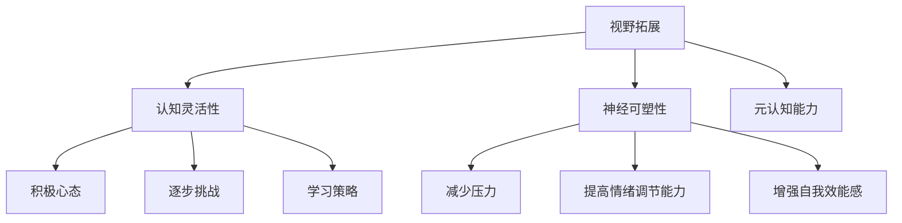
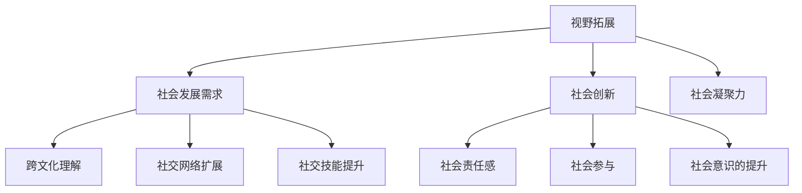
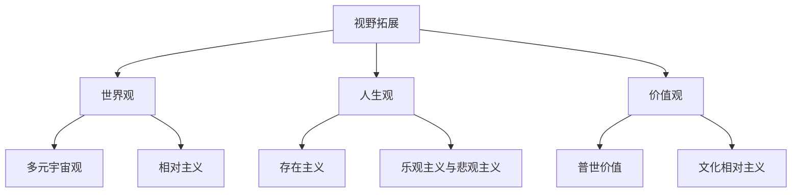

                 

# 《拓展视野的方法：丰富生命广度的实践》

---

## 关键词

- 视野拓展
- 个人成长
- 实践方法
- 社会学意义
- 心理学基础

## 摘要

在当今快速变化的时代，拓展视野已成为提升个人竞争力和社会适应能力的关键。本书《拓展视野的方法：丰富生命广度的实践》旨在探讨如何通过多种方法来拓展个人的视野，丰富生活的广度。书中首先分析了视野拓展的理论基础，包括心理学、社会学和哲学的视角，然后详细介绍了实践方法，如阅读、旅行、跨文化交流和技术应用。此外，书中还探讨了视野拓展对个人成长、人际交往和职业发展的影响，并展望了视野拓展的未来趋势。通过丰富的案例和实践技巧，本书为读者提供了全面且实用的视野拓展指南。

---

## 引言

在21世纪的数字化和信息爆炸时代，人们面临着前所未有的挑战和机遇。信息的快速传播和技术的迅猛发展，使得我们的视野和认知边界不断被扩展。然而，在享受便利的同时，许多人也感到自己的视野越来越受限，难以适应快速变化的环境。因此，如何拓展视野，丰富生活的广度，成为了现代个人成长和职业发展的关键问题。

### 现实背景

- **信息过载**：互联网的普及使得信息获取变得更加容易，但同时也带来了信息过载的问题。人们在面对海量信息时，往往无法有效地筛选和利用。
- **认知局限**：个体认知的局限性和偏见，使得人们在理解和应对复杂问题时，往往局限于自身的经验和知识框架。
- **职业发展**：随着全球化和技术的不断进步，许多职业领域正在发生深刻变革。只有不断拓展视野，才能把握机遇，应对挑战。

### 个人成长需求

- **全面发展**：个人成长不仅仅是知识和技能的提升，更重要的是认知和思维的拓展。只有视野开阔，才能更好地理解世界，实现全面发展。
- **人际交往**：视野拓展有助于增强人际交往能力，更好地理解不同文化和背景的人，建立广泛的人际网络。
- **职业成功**：视野开阔的个体更容易发现新的机会，把握职业发展的关键节点，实现职业上的成功和满足感。

### 社会发展趋势

- **多元化**：社会的多元化发展趋势要求个体具备跨文化的理解和包容能力，只有通过视野拓展，才能更好地适应这种变化。
- **创新驱动**：创新已成为推动社会发展的关键因素。视野拓展有助于激发创新思维，发现新的解决方案。

### 核心概念

- **视野拓展**：指通过学习、实践和体验，扩大个体的认知范围，提高对世界的理解和适应能力。
- **生命广度**：指个体在精神、文化、社会等多个层面上的丰富和多元化。

### 目的和意义

本书旨在探讨如何通过科学的方法和实践，实现视野的拓展和生命广度的丰富。通过对视野拓展的理论基础、实践方法及其对社会和个人成长的影响进行深入分析，本书为读者提供了全面、系统的视野拓展指南，旨在帮助读者在快速变化的时代中，不断提升自我，实现个人和职业的全面发展。

## 第一部分：理论基础

### 视野拓展的心理学基础

在心理学领域，视野拓展被认为是一种积极的心理活动，它有助于个体的认知发展和心理健康。以下是关于视野拓展的心理学基础的一些关键概念和理论。

#### 视野拓展的概念与定义

**视野拓展**，在心理学上，指的是个体通过学习新知识、体验新环境、接触新文化等方式，主动扩大自己的认知范围和思维边界。这一过程不仅涉及对信息量的增加，还包括对信息深度的挖掘和对不同观点的理解。

**相关定义**：
- **广义视野拓展**：包括对所有感官刺激的接受和理解，以及对非直观现实（如虚拟现实）的体验。
- **狭义视野拓展**：主要指通过阅读、旅行、交流等活动获取的新知识和新体验。

#### 视野拓展的心理机制

**认知灵活性**：视野拓展的一个重要心理机制是认知灵活性，即个体在遇到新信息时，能够灵活调整自己的思维方式，从不同的角度理解和解释信息。这种灵活性有助于个体更好地适应复杂多变的环境。

**神经可塑性**：神经可塑性是指大脑神经细胞和连接在经历学习和实践后的适应性改变。视野拓展通过不断的新刺激，促进大脑的神经可塑性，从而提高个体的认知能力和学习能力。

**元认知能力**：元认知能力是指个体对自身认知过程的意识和调节能力。视野拓展有助于个体发展更强的元认知能力，从而更有效地管理学习过程，提高学习效果。

#### 视野拓展的心理障碍与克服方法

**心理障碍**：
- **恐惧未知**：个体对未知的恐惧和不安，可能阻碍视野的拓展。
- **习惯性思维**：长期固定的思维模式，使得个体难以接受和适应新的观点和信息。
- **认知负担**：面对过多的新信息和复杂的问题，个体可能会感到压力和负担。

**克服方法**：
- **积极心态**：培养开放、积极的心态，对未知保持好奇和探索的态度。
- **逐步挑战**：通过逐步增加新挑战和难度，逐步克服恐惧和不安。
- **学习策略**：运用有效的学习策略，如主动学习、反思性学习，提高学习效率和质量。

#### 视野拓展对心理健康的促进作用

**减少压力**：视野拓展可以帮助个体从不同的角度看待问题，减少因单一视角带来的压力和焦虑。
**提高情绪调节能力**：通过接触新的文化、环境和人群，个体可以学习到更多的情绪调节策略，提高应对压力和挑战的能力。
**增强自我效能感**：视野拓展使个体能够更好地理解自我和他人，从而增强自信心和自我效能感。

### 视野拓展的心理学基础总结

视野拓展不仅是认知能力的提升，更是心理健康和幸福感的重要来源。通过理解视野拓展的心理学基础，个体可以更有效地拓展自己的视野，促进个人成长和心理健康。以下是视野拓展的心理学基础的关键概念及其关系架构的Mermaid流程图：

通过这一流程图，我们可以清晰地看到视野拓展的心理学基础是如何相互关联的，从而为后续的实践方法提供理论基础。

### 视野拓展的社会学意义

视野拓展不仅在心理学层面具有重要意义，在社会学领域，它同样发挥着关键作用。社会学视角下的视野拓展，关注的是个体如何通过社会互动和经验积累，扩展其社会认知和价值观。以下是关于视野拓展的社会学意义的一些关键概念和理论。

#### 视野拓展与社会发展的关系

**社会发展的需求**：社会发展需要个体具备广泛的视野和多元化的认知，以适应快速变化的环境。只有当个体能够理解和接纳不同的观点和文化时，社会才能实现真正的进步。

**社会创新**：视野拓展是推动社会创新的重要动力。通过接触新的思想和观点，个体能够激发创新思维，提出新颖的解决方案，从而推动社会进步。

**社会凝聚力**：视野拓展有助于增强社会凝聚力。当个体能够理解和尊重不同的文化和价值观时，社会成员之间的相互信任和合作将得到提升。

#### 视野拓展与人际交往的关系

**跨文化理解**：视野拓展使个体能够更好地理解不同文化背景下的人际交往规则和习惯，从而提高跨文化沟通能力。

**社交网络扩展**：视野拓展有助于个体建立更广泛的社交网络。通过接触不同的群体和领域，个体可以结识更多的朋友和合作伙伴，为个人发展提供更多的机会。

**社交技能提升**：视野拓展使个体能够从不同的视角和经验中学习，从而提升社交技能，如倾听、沟通、协调等。

#### 视野拓展与社会责任的培养

**社会责任感**：视野拓展有助于培养个体的社会责任感。当个体能够理解社会问题和不同群体的需求时，他们更有可能积极参与社会公益活动，承担社会责任。

**社会参与**：视野拓展使个体更愿意参与社会事务，通过实际行动来推动社会变革。这种参与不仅有助于解决社会问题，还能提升个体的自我价值感。

**社会意识的提升**：视野拓展有助于提高个体的社会意识，使他们更加关注社会公正、平等和可持续发展等问题。

#### 视野拓展的社会学基础总结

视野拓展在社会学领域的重要性体现在其对社会发展、人际交往和社会责任培养的积极影响。通过社会学视角的分析，我们可以更全面地理解视野拓展的意义和作用。以下是视野拓展的社会学意义的关键概念及其关系架构的Mermaid流程图：

通过这一流程图，我们可以清晰地看到视野拓展在社会学领域中的多重作用和相互关系，为后续的实践方法和案例分析提供了理论支持。

### 视野拓展的哲学思考

视野拓展不仅仅是心理学和社会学问题，它同样触及哲学领域。哲学视角下的视野拓展，关注的是人类认知、思维方式的本质以及个体在广阔宇宙中的地位。以下是关于视野拓展的哲学思考的一些关键概念和理论。

#### 视野拓展与世界观

**世界观**：世界观是人们对世界的基本看法和理解。视野拓展意味着个体能够从不同的角度和层面理解世界，从而形成更加全面和深刻的世界观。

**多元宇宙观**：视野拓展促使个体超越狭隘的视角，接纳多元宇宙观。这种观点认为，宇宙是多样且复杂的，没有一种绝对和唯一的真相。

**相对主义**：视野拓展推动个体接受相对主义的观点，即真理和价值观是相对的，不同文化和背景下的人有着各自独特的认知和信仰。

#### 视野拓展与人生观

**人生观**：人生观是人们对生命的意义和目的的理解。视野拓展有助于个体更深刻地反思人生的意义，从而形成更加积极和有意义的人生观。

**存在主义**：视野拓展可以激发个体的存在主义思考，即个体在宇宙中的独特性和存在的意义。这种思考强调个体自由选择和责任的重要性。

**乐观主义与悲观主义**：视野拓展使个体能够从更广泛的角度看待人生，从而影响他们的乐观主义或悲观主义倾向。一个开阔的视野往往能够带来更积极的人生观。

#### 视野拓展与价值观

**价值观**：价值观是人们对待世界和他人的基本准则。视野拓展促使个体重新评估和调整自己的价值观，以适应多元文化和价值观的环境。

**普世价值**：视野拓展有助于个体理解和接纳普世价值，如公正、自由、平等和尊重。这些价值不仅是人类共同追求的目标，也是视野拓展的重要基础。

**文化相对主义**：视野拓展使个体能够理解不同文化背景下的价值观，从而促进文化相对主义的形成。这种观点认为，每种文化都有其独特性和价值，没有绝对的对与错。

#### 视野拓展的哲学思考总结

视野拓展在哲学领域中，不仅是一种认知和思维的拓展，更是对人生和价值观的深刻反思。通过哲学视角的分析，我们可以更深入地理解视野拓展的本质和意义。以下是视野拓展的哲学思考的关键概念及其关系架构的Mermaid流程图：

通过这一流程图，我们可以清晰地看到视野拓展在哲学领域中的多重作用和相互关系，为后续的实践方法和案例分析提供了哲学基础。

### 第一部分总结

通过第一部分的深入探讨，我们了解了视野拓展的心理学、社会学和哲学基础。视野拓展不仅是认知和心理能力的发展，更是社会互动和价值观的重塑。以下是本部分的核心概念和它们之间的联系总结：

1. **心理学基础**：视野拓展通过认知灵活性、神经可塑性和元认知能力的提升，促进个体心理健康。
2. **社会学意义**：视野拓展有助于社会发展、人际交往和社会责任的培养。
3. **哲学思考**：视野拓展影响个体的世界观、人生观和价值观，推动多元宇宙观、相对主义和文化相对主义的形成。

这些核心概念共同构成了视野拓展的理论框架，为后续的实践方法和案例分析提供了坚实的理论基础。

## 第二部分：实践方法

### 阅读与实践：书籍、文章与讲座

阅读和实践是拓展视野最为传统且有效的方法之一。通过阅读，我们可以跨越时间和空间的限制，吸取前人的智慧和经验；通过实践，我们可以将理论知识应用到实际中，从而加深对知识的理解和应用能力。

#### 书籍阅读

**选择合适的书籍**：选择合适的书籍是阅读成功的关键。以下是几种类型的书籍推荐：
- **经典著作**：如《共产党宣言》、《论语》、《战争与和平》等，这些经典著作不仅涵盖了丰富的知识，还体现了人类智慧的深度。
- **专业书籍**：针对自己感兴趣的领域，选择一些专业书籍，如《深度学习》、《人工智能：一种现代方法》等。
- **自助书籍**：如《如何赢得朋友与影响他人》、《高效能人士的七个习惯》等，这些书籍可以帮助我们提升个人素质和生活质量。

**阅读策略**：有效的阅读策略可以提高阅读效率和效果。
- **主动阅读**：阅读时要有目的性，提出问题并积极寻找答案。通过做笔记、总结和反思，加深对书中内容的理解和记忆。
- **交替阅读**：结合不同类型的书籍，交替阅读，既能扩展知识面，又能避免单一领域的疲劳。

**实践应用**：阅读后，需要将所学知识应用到实际中。可以通过以下方式实践：
- **案例分析**：分析书中提到的案例，思考其背后的原理和策略，并将其应用到实际问题中。
- **交流分享**：与他人分享阅读心得和体会，通过讨论和交流，加深对知识的理解和应用。

#### 文章阅读

**选择高质量文章**：在信息爆炸的时代，选择高质量的文章至关重要。以下是一些建议：
- **专业期刊**：如《自然》、《科学》、《经济学人》等，这些期刊通常涵盖了最新的研究成果和热点话题。
- **权威博客**：如《爱范儿》、《36氪》等，这些博客通常由行业专家撰写，具有很高的可信度和专业性。
- **社交媒体**：如LinkedIn、Twitter等，这些平台上的文章和观点往往具有多样性和时效性。

**阅读技巧**：
- **快速浏览**：对于一些技术性或专业性较强的文章，可以先快速浏览，了解主要观点和结论。
- **深入阅读**：对于感兴趣或重要的文章，需要进行深入阅读，理解其细节和原理。
- **批判性思维**：在阅读时，要培养批判性思维，对文章的观点和论据进行评估和质疑。

**实践应用**：
- **撰写评论**：阅读后撰写评论或心得，通过表达自己的观点和思考，加深对文章的理解。
- **引用和引用**：在写作或演讲时，引用文章中的观点和数据，增强说服力。

#### 讲座与课程

**选择合适的讲座和课程**：讲座和课程是获取知识的重要途径。以下是一些建议：
- **专业讲座**：如学术会议、行业研讨会等，这些讲座通常由行业专家和学者主讲，具有很高的专业性和权威性。
- **公开课**：如Coursera、edX等在线课程平台上的课程，这些课程通常由名校教授或行业专家主讲，内容丰富且实用。
- **培训课程**：如MBA课程、技术培训课程等，这些课程可以帮助个体快速提升专业技能。

**参与和互动**：
- **积极提问**：在讲座和课程中，积极提问可以帮助我们更好地理解和消化知识。
- **参与讨论**：参与小组讨论和互动，通过与他人交流，拓宽视野和思维方式。
- **记录笔记**：记录重要的观点和知识点，以便后续复习和应用。

**实践应用**：
- **应用所学**：将讲座和课程中学到的知识和技能应用到实际工作和生活中。
- **反馈和反思**：课程结束后，对所学内容进行反馈和反思，评估自己的学习效果，并制定改进计划。

### 视野拓展的旅行经验

旅行是拓展视野的绝佳方式。通过旅行，我们可以亲身感受不同的文化和生活方式，体验不同的自然景观和社会环境。以下是关于旅行经验的一些关键点和实践经验。

#### 选择旅行目的地

**多样化目的地**：选择多样化的旅行目的地，可以让我们接触到不同的文化和环境。以下是一些建议：
- **自然景观**：如欧洲的阿尔卑斯山、美国的黄石国家公园等，自然景观可以让我们感受到大自然的壮丽和神秘。
- **历史文化**：如中国的西安、埃及的卢克索等，历史悠久的城市和遗址可以让我们深入了解人类文明的演进。
- **现代都市**：如东京、伦敦等，现代化的都市生活可以让我们体验科技和文化的融合。

#### 旅行过程中的体验

**探索与发现**：在旅行过程中，我们要充分利用时间，探索当地的文化和历史。通过参观博物馆、艺术馆、历史遗址等，我们可以深入了解当地的文化和艺术。
- **交流与互动**：与当地人交流，了解他们的生活方式和价值观念，可以拓宽我们的视野和思维方式。
- **尝试新事物**：尝试当地的食物、运动和娱乐活动，如滑雪、潜水、烧烤等，这些新体验可以增加我们的乐趣和回忆。

#### 旅行后的反思与应用

**记录和分享**：旅行结束后，记录旅行中的所见所闻和感受，通过写作、摄影或视频等方式分享给他人，不仅可以加深自己的记忆，还可以启发和影响他人。
- **反思与总结**：对旅行经历进行反思和总结，思考自己在旅行中的收获和不足，并制定改进计划。
- **应用所学**：将旅行中学到的知识和经验应用到日常生活和工作中，如改进沟通技巧、拓展思维方式等。

### 跨文化交流与学习

跨文化交流是拓展视野的重要途径之一。通过跨文化交流，我们可以了解不同的文化背景、思维方式和行为习惯，从而拓宽自己的视野和思维方式。

#### 跨文化交流的意义

**文化多样性**：跨文化交流使我们能够了解和尊重不同的文化，促进文化多样性的发展。
**认知拓展**：跨文化交流可以激发我们的创新思维，从不同的视角看待问题，提高我们的认知能力。
**人际关系**：跨文化交流有助于建立更加广泛和深厚的人际关系，拓展我们的人脉网络。

#### 跨文化交流的实践方法

**语言学习**：学习一门新语言，是跨文化交流的重要前提。通过学习语言，我们可以更好地理解和沟通当地的文化和价值观。
- **交流互动**：积极参与跨文化交流活动，如国际会议、论坛、文化节等，与不同文化背景的人进行交流和互动。
- **实地体验**：通过实地旅行或居住，深入了解当地的文化和社会环境，从而更好地理解和适应。

#### 跨文化交流中的挑战与应对策略

**文化差异**：跨文化交流中，文化差异是常见的挑战。了解和尊重文化差异，是有效跨文化交流的关键。
- **开放心态**：保持开放和包容的心态，尊重不同的观点和习惯，避免文化冲突。
- **学习与适应**：通过学习和适应，提高跨文化沟通的能力，逐步克服文化差异带来的挑战。

### 技术与工具的应用

现代技术的迅猛发展，为我们提供了丰富的工具和资源，以支持视野拓展。以下是一些常用的技术和工具，以及如何有效利用它们来拓展视野。

#### 在线学习平台

**在线课程平台**：如Coursera、edX、Udacity等，这些平台提供了丰富的在线课程，涵盖了各种学科和领域。通过在线学习，我们可以系统地拓展自己的知识体系。
- **利用学习计划**：制定学习计划，有针对性地选择课程，确保学习效果。
- **互动与交流**：参与课程讨论，与来自世界各地的人交流，拓宽视野。

#### 社交媒体

**社交媒体平台**：如LinkedIn、Twitter、Facebook等，这些平台是获取信息、交流和分享的重要渠道。
- **关注行业专家**：关注行业专家和知名人士，了解他们的最新观点和动态。
- **分享与互动**：分享自己的观点和经验，与他人互动，促进知识交流。

#### 数据分析工具

**数据分析工具**：如Excel、Tableau、Python等，这些工具可以帮助我们更好地分析和理解数据。
- **数据可视化**：通过数据可视化，将复杂的数据转化为易于理解的形式，从而更好地发现问题和洞察。
- **数据应用**：将数据分析结果应用于实际问题，提供数据驱动的解决方案。

#### 实践案例

**案例一**：通过在线学习平台学习编程课程，系统地提升编程技能。在学习过程中，积极参与讨论和项目实践，与全球学习者互动，拓宽视野。

**案例二**：通过参加国际会议和论坛，与来自不同国家和地区的专业人士交流，了解最新的行业趋势和技术动态。

**案例三**：利用社交媒体平台关注行业专家和知名人士，了解他们的观点和经验，并将其应用于实际工作中，提升个人能力和竞争力。

### 总结

通过第二部分的实践方法，我们了解了阅读、旅行、跨文化交流和技术应用在拓展视野方面的作用。这些实践方法不仅可以帮助我们获取新的知识和技能，还可以拓宽我们的思维方式和视野，提高我们的认知能力和人际交往能力。在实践中，我们需要不断尝试和探索，找到最适合自己的方法，从而实现全面的视野拓展。

### 视野拓展与自我认知

视野拓展不仅是对外部世界的认知扩展，更是对自我认知的深入探索。通过不断拓展视野，我们可以更全面地了解自己，发现自我潜能，从而实现个人成长和自我提升。

#### 视野拓展对自我认知的作用

**自我认知**是指个体对自己内在特质、能力和价值观的理解和认识。视野拓展在以下几个方面对自我认知产生深远影响：

1. **提升自我意识**：视野拓展使我们接触到不同的文化、思想和生活方式，从而激发我们对自身的反思和思考。通过对比和反思，我们能够更清晰地认识到自己的内在特质和优势。

2. **发现自我潜能**：在新的环境和挑战中，我们有机会尝试和探索自己从未涉足的领域。这种尝试和探索不仅帮助我们发现自己的潜能，还激发我们不断挑战自我，实现自我超越。

3. **增强自我调节能力**：视野拓展使我们在面对复杂问题和挑战时，能够从不同的角度思考和分析，提高我们的问题解决能力和自我调节能力。

#### 视野拓展的具体实践方法

1. **反思日记**：每天或每周写反思日记，记录自己的所思所感，通过反思，深化对自我的认识和理解。

2. **角色扮演**：尝试扮演不同的角色，如教师、志愿者、领导者等，体验不同角色的职责和挑战，从而更全面地了解自己。

3. **目标设定**：设定短期和长期目标，并制定实现目标的计划和策略。通过实现目标，我们可以不断提升自我，拓展视野。

#### 案例分享

**案例一**：小李是一名职场新人，通过参加公司组织的培训和跨部门项目，他接触到了不同的业务领域和工作方法。在这个过程中，他不仅提升了专业知识，还发现了自己在项目管理方面的潜能，从而决定进一步学习项目管理知识，并最终成为团队的重要成员。

**案例二**：小王是一名程序员，他通过参加技术大会和在线课程，不断拓展自己的技术视野。在一次国际技术会议上，他遇到了一位来自国外的技术专家，从专家的经验中，他学会了如何更好地应对技术难题，并开始在国际技术社区中分享自己的经验和见解。

#### 案例分析

**案例一**：小李通过参与不同领域的培训和项目，不仅提升了专业技能，还发现了自己在项目管理方面的潜能。这种视野拓展的过程，使他能够更全面地了解自己的优势和潜力，从而做出更有针对性的职业规划和发展。

**案例二**：小王通过参加国际技术会议和在线课程，不仅拓宽了技术视野，还学会了如何更好地应对技术挑战。这种视野拓展不仅提升了他的技术能力，还增强了他对行业动态和趋势的敏感性，使他能够更好地适应快速变化的技术环境。

#### 案例总结

通过这两个案例，我们可以看到视野拓展对个人成长和自我认知的积极影响。无论是通过参与不同领域的实践活动，还是通过跨文化交流和学习，视野拓展都能帮助我们更全面地了解自己，发现自我潜能，从而实现个人成长和职业发展。

### 视野拓展与人际交往

视野拓展不仅有助于自我认知的提升，还能显著改善人际交往能力。通过拓展视野，我们能够更好地理解不同文化、价值观和生活方式，从而建立更加丰富多样的人际网络，提升交往技巧。

#### 视野拓展对人际交往的影响

1. **增进跨文化理解**：视野拓展使我们能够接触到不同的文化背景，了解他们的思维方式和行为习惯。这种跨文化理解有助于我们在交往中避免误解和冲突，建立和谐的人际关系。

2. **拓宽社交网络**：视野拓展让我们有机会结识来自不同地区、行业和文化背景的人。通过这些交往，我们能够建立更加广泛和多样化的社交网络，从而扩大人脉资源。

3. **提升沟通技巧**：视野拓展使我们具备更丰富的知识和经验，能够从不同角度看待问题。这种多样化的思维方式有助于我们在沟通中表达自己的观点，理解他人的想法，提高沟通效果。

#### 视野拓展在人际交往中的具体应用

1. **跨文化交流**：积极参与跨文化交流活动，如国际会议、文化节和志愿者项目。通过与不同文化背景的人交流，提高跨文化沟通能力。

2. **学习多元文化**：阅读多元文化书籍，观看不同文化的影视作品，了解不同文化背景下的价值观和习俗。这种学习有助于我们在实际交往中更加敏感和包容。

3. **共享经验**：与他人分享自己的旅行、学习和工作经验，倾听他人的观点和故事。通过交流和互动，建立更深层次的人际关系。

#### 案例分享

**案例一**：张华是一名跨国企业的市场经理，通过参加国际会议和跨文化培训，他学会了如何与来自不同国家的客户和同事有效沟通。他的视野拓展不仅提升了工作效率，还增强了团队的凝聚力。

**案例二**：李娜是一名英语教师，她通过参加海外志愿者项目，了解了许多不同国家的教育体系和教学方法。这些经验使她在教学中能够更好地结合多元文化，提高教学效果。

#### 案例分析

**案例一**：张华通过参加国际会议和跨文化培训，拓展了自己的视野，提高了跨文化沟通能力。这种视野拓展使他能够更好地理解不同文化背景的客户和同事，从而在职场中取得更好的成绩。

**案例二**：李娜通过参与海外志愿者项目，了解了不同国家的教育体系和文化背景。这些经验使她在教学中能够更好地结合多元文化，提高学生的学习兴趣和效果。

#### 案例总结

通过这两个案例，我们可以看到视野拓展在人际交往中的积极作用。无论是通过跨文化交流还是学习多元文化，视野拓展都能帮助我们更好地理解他人，提升沟通技巧，建立丰富多样的人际网络。这种人际交往能力的提升，不仅有助于个人的职业发展，还能为我们的生活带来更多的乐趣和意义。

### 视野拓展与职业发展

视野拓展在职业发展中扮演着至关重要的角色。通过拓宽视野，个体能够更好地理解行业动态、掌握前沿技术和技能，从而提升自身竞争力，实现职业发展。

#### 视野拓展对职业发展的影响

1. **行业理解**：视野拓展使个体能够更全面地了解行业趋势和发展动态，从而做出更明智的职业决策。

2. **技能提升**：通过拓展视野，个体可以接触到最新的技术和方法，不断提升自己的专业技能，保持竞争力。

3. **职业机遇**：视野拓展有助于个体发现新的职业机遇，包括未知的领域和新兴行业，从而开辟新的职业道路。

#### 视野拓展在职业发展中的应用

1. **持续学习**：通过参加在线课程、专业培训和行业会议，持续学习最新的知识和技能，保持专业竞争力。

2. **跨领域实践**：尝试涉足不同的领域和行业，通过实践和项目经验，提升跨领域的知识和能力。

3. **网络拓展**：积极参与行业活动，建立广泛的职业网络，与行业专家和同行交流，获取宝贵的资源和机会。

#### 案例分享

**案例一**：王先生是一名软件工程师，他通过参加技术会议和在线课程，不断学习新技术和工具。这些视野拓展使他在工作中能够迅速适应新技术，提升了工作效率，并在公司项目中得到了更多的机会。

**案例二**：李小姐是一名市场营销经理，她通过参与国际市场营销培训和跨文化交流项目，拓展了国际市场的视野，成功开拓了新的市场领域，提升了公司的市场份额。

#### 案例分析

**案例一**：王先生通过参加技术会议和在线课程，不断学习新技术，提升了自身的专业技能。这种视野拓展使他在工作中能够迅速适应新技术，从而提升了工作效率和职业竞争力。

**案例二**：李小姐通过参与国际市场营销培训和跨文化交流项目，拓展了国际市场的视野，成功开拓了新的市场领域。这种视野拓展不仅提升了公司的市场份额，也为她个人的职业发展带来了新的机遇。

#### 案例总结

通过这两个案例，我们可以看到视野拓展在职业发展中的重要作用。无论是通过持续学习、跨领域实践还是网络拓展，视野拓展都能帮助个体提升专业技能，发现新的职业机遇，实现职业发展。视野拓展不仅是个人成长的助力，更是职业成功的关键。

### 第三部分总结

在第三部分，我们深入探讨了视野拓展在自我认知、人际交往和职业发展中的重要性。通过阅读与实践、旅行经验、跨文化交流和技术应用，我们不仅能够提升自我认知，拓宽人际网络，还能在职业发展中取得更大的成就。视野拓展不仅是一种认知能力的提升，更是一种全面发展和自我实现的路径。通过不断地拓展视野，我们可以更好地适应快速变化的环境，实现个人和职业的全面发展。

### 视野拓展对人生的影响

视野拓展对人生的影响是深远而多方面的。它不仅影响个体的认知和思维方式，还深刻地改变了他们的生活方式和价值观。以下将详细探讨视野拓展对人生各个方面的影响。

#### 对思维方式的影响

1. **开放性思维**：视野拓展促使个体形成更加开放和包容的思维方式。通过接触不同的文化和观念，个体能够从多个角度审视问题，减少偏见和狭隘性。
2. **创新性思维**：开阔的视野激发个体的创新思维。当个体接触到新的观点和想法时，他们更可能产生创新性的解决方案，从而在工作和生活中取得突破。
3. **批判性思维**：视野拓展有助于培养个体的批判性思维。通过了解不同的观点和理论，个体能够更加客观和理性地分析和评估信息，避免盲目接受和迷信权威。

#### 对生活方式的影响

1. **多元化**：视野拓展使个体能够体验和接纳不同的生活方式和文化习惯，从而丰富自己的生活内容。这种多元化不仅体现在饮食、服饰和娱乐上，还包括日常的生活态度和价值观。
2. **灵活适应**：视野拓展使个体更加适应多变的环境。他们能够灵活应对不同的挑战和变化，从而在生活和工作中保持良好的适应能力。
3. **生活质量**：视野拓展对生活质量的提升有着积极影响。通过了解和尝试新的生活方式，个体能够更好地满足自己的需求和兴趣，提高生活满意度。

#### 对价值观的影响

1. **道德观**：视野拓展有助于个体形成更加包容和宽容的道德观。通过了解不同文化背景下的道德观念和行为准则，个体能够更加尊重和理解他人的行为，从而促进社会的和谐与进步。
2. **人生观**：视野拓展使个体对人生有更深刻的理解。他们能够从更广阔的视角看待人生的目标和意义，从而形成更加积极和有意义的人生观。
3. **世界观**：视野拓展促使个体形成更加多元和开放的世界观。他们能够理解世界的多样性和复杂性，从而更加宽容和接纳不同的观点和价值观。

#### 对心理健康的影响

1. **情绪调节**：视野拓展有助于个体更好地调节情绪。通过了解不同文化和环境下的情绪表达和处理方式，个体能够更加有效地应对压力和挑战，保持心理健康。
2. **心理韧性**：视野拓展使个体具备更强的心理韧性。在面对困难和挫折时，他们能够更加坚韧和乐观，从而更好地应对生活中的挑战。
3. **自我效能感**：视野拓展有助于提升个体的自我效能感。通过接触新知识和技能，个体能够更加自信地面对生活和工作的挑战，实现自我价值的提升。

#### 综合影响总结

视野拓展对人生的影响是全方位的，它不仅改变了我们的思维方式、生活方式和价值观，还提升了我们的心理健康和生活质量。通过不断地拓展视野，我们能够更好地适应快速变化的环境，实现个人和职业的全面发展。视野拓展不仅是一种认知能力的提升，更是一种全面发展的路径，为我们的未来提供了无限的可能。

### 视野拓展的社会价值

视野拓展不仅仅对个人发展有深远影响，它对社会的发展也具有重大的价值。从教育、经济和文化等多个维度来看，视野拓展都发挥着至关重要的作用。

#### 对教育的影响

**促进多元化教育**：视野拓展有助于培养多元化思维，这种思维在现代社会中尤为重要。通过了解不同文化和背景，学生能够更好地理解和尊重他人的观点，促进教育的多元化。

**培养创新人才**：视野拓展能够激发学生的创新思维，帮助他们发现新的问题和解决方案。这种创新精神是推动社会进步和经济发展的重要动力。

**提升教育质量**：视野拓展使教师能够接触到更多的教育资源和方法，从而提升教育质量。教师通过拓宽视野，能够提供更加丰富和多样的教学内容，激发学生的学习兴趣和潜力。

#### 对经济的影响

**推动技术创新**：视野拓展有助于个体和企业了解最新的技术趋势和市场动态，从而推动技术创新和产业升级。一个具有广阔视野的经济体，往往能够更快地适应市场变化，抢占科技制高点。

**促进国际贸易**：视野拓展使企业和个人能够更好地了解国际市场，抓住全球化带来的机遇。通过跨文化交流和合作，国际贸易得以顺利进行，促进了世界经济的发展。

**创造就业机会**：视野拓展有助于个体获得更多的职业机会，从而创造就业机会。当个体具备广阔的视野和多元的技能时，他们在职场中的竞争力将大大提高，从而为经济发展注入新的活力。

#### 对文化的影响

**文化多样性的保护**：视野拓展有助于我们理解和尊重不同的文化，从而保护和传承人类多样的文化遗产。在全球化的背景下，保护文化多样性对于维护社会和谐和文化繁荣具有重要意义。

**促进文化交流**：视野拓展促进了不同文化之间的交流和融合，这有助于消除文化隔阂和误解，增进不同文化之间的理解和尊重。

**文化创新**：视野拓展激发了个体的文化创造力，推动了文化创新。当个体接触和吸收不同文化的元素时，往往能够产生新的文化形式和艺术作品，丰富了人类文化的内涵。

#### 社会价值总结

视野拓展具有广泛的社会价值，它不仅促进了教育的多元化、技术创新和国际贸易，还有助于保护文化多样性和促进文化交流。通过视野拓展，社会能够实现更加包容和繁荣的发展。因此，社会应当重视并推动视野拓展，为个体提供更多的学习和交流机会，从而为社会的可持续发展贡献力量。

### 视野拓展的未来展望

随着科技的不断进步和社会的日益多元化，视野拓展的未来前景充满了机遇与挑战。以下从技术趋势、社会变革和教育发展三个方面，探讨视野拓展的未来发展方向和可能面临的挑战。

#### 技术趋势

**人工智能和大数据**：人工智能和大数据技术的快速发展，将极大地推动视野拓展。通过智能推荐系统和个性化学习平台，个体可以获得更加精准和定制化的知识资源，从而更加高效地拓展视野。

**虚拟现实和增强现实**：虚拟现实（VR）和增强现实（AR）技术的普及，为个体提供了一个全新的视野拓展平台。通过虚拟旅行和沉浸式学习，个体可以体验到前所未有的知识和文化。

**区块链技术**：区块链技术的应用将有助于建立更加透明和可信的知识共享平台，促进个体之间的知识交流和视野拓展。

#### 社会变革

**全球化**：全球化的加速，使得个体有机会接触到更多国家和地区的文化和思想。这为视野拓展提供了广阔的空间，但也带来了文化冲突和价值观碰撞的挑战。

**信息技术普及**：信息技术的普及使得更多的人能够获取知识，但同时也带来了信息过载和隐私保护的问题。如何在海量信息中筛选和利用有价值的信息，成为视野拓展的重要课题。

**社会不平等**：社会不平等问题可能加剧视野拓展的不均衡，一部分人可能因为资源和机会的限制，无法充分拓展视野。因此，如何缩小视野拓展的不平等，是未来社会需要面对的重要挑战。

#### 教育发展

**终身学习**：随着知识更新速度的加快，终身学习将成为未来教育的主流。视野拓展需要通过持续的学习和实践，不断提升个体的知识水平和认知能力。

**个性化教育**：个性化教育的兴起，将使教育更加注重个体的兴趣和需求，从而促进个性化视野拓展。教育机构需要提供多样化的学习资源和方式，满足不同个体的学习需求。

**跨学科教育**：跨学科教育将有助于个体形成更加综合和多元的思维方式，从而更好地适应复杂多变的社会环境。视野拓展需要跨越学科界限，实现知识的深度融合。

#### 挑战与应对策略

**技术挑战**：技术的快速变革带来新的机遇，但同时也带来了技术不成熟、数据安全和隐私保护等问题。教育和技术部门需要密切合作，制定有效的策略，确保视野拓展的安全性和可靠性。

**社会挑战**：社会变革带来了新的社会问题和价值观冲突。个体需要培养批判性思维和跨文化理解能力，以应对这些挑战。社会需要建立更加包容和多元的文化环境，促进视野拓展的平等和公正。

**教育挑战**：教育资源的分配不均和教育体系的适应性问题，可能阻碍视野拓展的全面发展。政府和社会应当加大对教育的投入，推动教育公平，确保每个个体都能享有平等的学习机会。

#### 未来展望

展望未来，视野拓展将继续发挥重要作用，推动个人成长和社会发展。通过技术的进步和社会的变革，个体将能够更加便捷地获取知识，拓展视野。教育体系也将更加注重个性化和跨学科教育，培养具有多元思维和创新能力的人才。同时，社会需要共同努力，应对技术和社会变革带来的挑战，建立一个更加包容和繁荣的未来。

### 全书总结

通过《拓展视野的方法：丰富生命广度的实践》这本书的深入探讨，我们全面了解了视野拓展的重要性及其对个人成长、职业发展和社会进步的深远影响。首先，在理论基础部分，我们分析了视野拓展在心理学、社会学和哲学层面的基础，揭示了视野拓展对认知能力、心理健康和社会责任感的促进作用。接着，在实践方法部分，我们详细介绍了阅读、旅行、跨文化交流和技术应用等多种方法，帮助读者找到适合自己的视野拓展路径。随后，在个人成长、人际交往和职业发展三个关键领域，我们通过丰富的案例和实践技巧，展示了视野拓展的广泛应用和实际效果。最后，我们探讨了视野拓展对人生的多方面影响，强调了其在现代社会中的重要价值。

通过阅读本书，读者不仅能够获得关于视野拓展的理论知识和实践方法，还能深刻认识到视野拓展在个人成长和职业发展中的重要作用。视野拓展不仅是认知能力的提升，更是思维方式的转变和生活方式的优化。在快速变化的时代，拥有开阔的视野，能够帮助个体更好地适应和把握机遇，实现全面发展和自我超越。

因此，我们鼓励读者将书中的理论和实践方法应用于日常生活和工作中，不断拓展自己的视野，丰富生命广度。通过持续的学习和实践，我们可以不断提升自我，成为更具竞争力和社会价值的个体。同时，我们也呼吁社会和学校重视视野拓展的教育，为个体提供更多的学习资源和交流机会，推动社会的包容和进步。

### 附录

#### 附录A：视野拓展的实践工具

**A.1 书籍推荐**

**必读经典**
- 《小王子》 - 安托万·德·圣-埃克苏佩里
- 《黑客与画家》 -保罗·格雷厄姆
- 《人类简史》 - 尤瓦尔·赫拉利

**新书速递**
- 《智能时代》 - 吴军
- 《深度学习》 - 伊恩·古德费洛等
- 《未来简史》 - 尤瓦尔·赫拉利

**阅读资源汇总**
- 书单推荐网站：Goodreads
- 在线图书馆：Project Gutenberg
- 电子书平台：Amazon Kindle

**A.2 视野拓展活动推荐**

**社交活动**
- 国际文化节：参与或组织当地的文化节，体验不同文化的传统和艺术。
- 书友会：加入或创建书友会，与志同道合的人一起阅读和讨论。

**线上论坛**
- LinkedIn Groups：加入专业相关的LinkedIn群组，参与讨论和交流。
- Reddit：关注感兴趣的话题或社区，积极参与讨论。

**视野拓展项目案例**

**项目一**：跨国志愿者项目
- 描述：参与国际志愿者项目，如国际红十字会、联合国志愿者等。
- 案例：一位大学生通过加入联合国青年志愿者项目，前往非洲参与教育项目，不仅拓展了视野，还锻炼了跨文化沟通能力。

**项目二**：在线课程挑战
- 描述：报名参加多个在线课程，如Coursera、edX等。
- 案例：一名工程师通过完成多个在线课程，成功转型为数据科学家，提升了职业竞争力。

**A.3 视野拓展实用技巧**

**时间管理技巧**
- 描述：合理安排时间，确保有足够的时间进行阅读和实践。
- 方法：使用时间管理工具，如Trello、Asana等，制定每日和每周的学习计划。

**高效学习法**
- 描述：采用科学的学习方法，提高学习效率。
- 方法：采用主动学习法，如Khan学习法，通过做笔记、总结和反思来加深理解。

**视野拓展的时间分配策略**
- 描述：合理分配时间，确保在工作和生活之间找到平衡。
- 方法：利用碎片化时间，如通勤时间、休息时间，进行阅读和思考。

**B.1 跨文化交流技巧**

**文化差异认知**
- 描述：了解不同文化的基本差异，如沟通方式、礼仪习惯等。
- 方法：通过阅读文化差异相关的书籍和资料，了解不同文化的基本特点。

**跨文化沟通策略**
- 描述：掌握跨文化沟通的技巧，以避免误解和冲突。
- 方法：学习有效的沟通技巧，如非语言沟通、倾听技巧等。

**跨文化冲突处理**
- 描述：学会处理跨文化冲突的方法，以维护良好的交流和合作关系。
- 方法：通过角色扮演和模拟练习，提高跨文化冲突的应对能力。

### 最佳实践 Tips

**1. 制定明确的学习目标**：明确自己的学习目标，有助于更高效地拓展视野。

**2. 保持好奇心和开放心态**：对未知保持好奇，对新观点持开放态度，有助于更快地拓展视野。

**3. 建立学习社区**：与志同道合的人一起学习，通过交流和分享，提高学习效果。

**4. 结合实践**：将所学知识应用到实际中，通过实践加深对知识的理解和应用能力。

### 小结

视野拓展不仅是个人成长的助力，更是社会进步的推动力。通过不断学习和实践，我们可以拓宽视野，丰富生活，实现自我价值。希望读者能够将书中的理论和方法应用到实际中，不断拓展自己的视野，成为更加全面和有价值的个体。

### 注意事项

**1. 安全第一**：在参与跨文化交流和实践活动时，注意个人安全和隐私保护。

**2. 合理安排时间**：确保在拓展视野的过程中，不影响日常工作和生活。

**3. 保持持续学习**：视野拓展是一个持续的过程，需要不断学习和实践。

### 拓展阅读

**相关书籍**：
- 《思考，快与慢》 - 丹尼尔·卡尼曼
- 《文明的冲突与世界秩序的重建》 - 塞缪尔·亨廷顿
- 《人工智能：一种现代方法》 - 斯蒂芬·马古利斯

**在线资源**：
- TED Talks：ted.com
- Coursera：coursera.org
- edX：edx.org

通过阅读这些书籍和访问在线资源，读者可以进一步拓展自己的视野，深入探索相关领域。希望这些资源和书籍能够为读者提供更多的启发和帮助。

