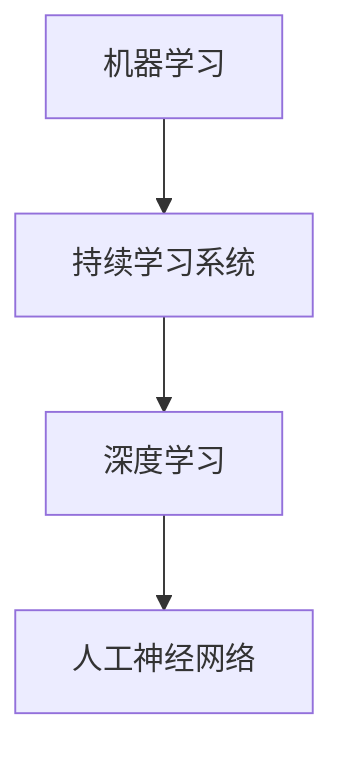
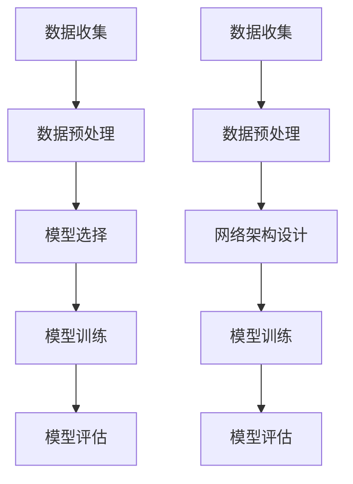
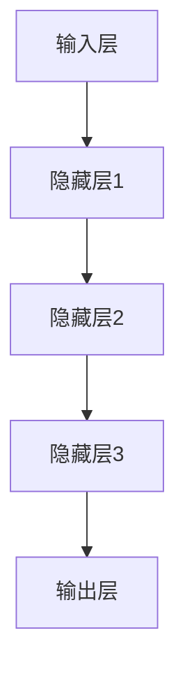
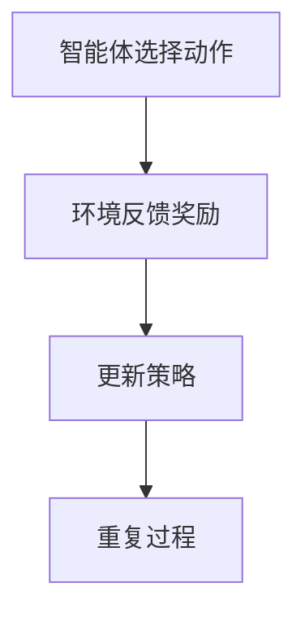
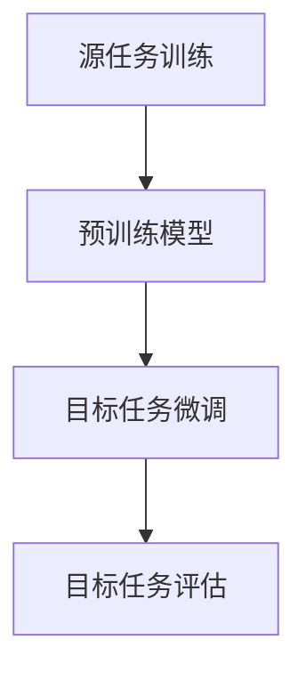
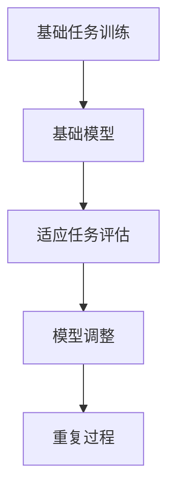

                 

### 文章标题：持续学习系统：构建终身学习的AI模型

> **关键词**：持续学习系统、人工智能、机器学习、深度学习、优化算法、应用实例

> **摘要**：本文将深入探讨持续学习系统的概念、重要性、核心算法、数学模型以及实际应用。通过逐步分析，我们希望能为读者构建一个清晰、全面的持续学习系统理解框架，从而助力其在人工智能领域的探索和实践。

---

### 第1章 引言

#### 1.1 持续学习系统的定义与背景

持续学习系统（Continual Learning System），简称CLS，是人工智能领域中的一个重要研究方向。它旨在使机器学习模型能够在面对不断变化的数据环境中持续学习和适应，而不需要重新从头开始训练。在现实世界中，数据是动态变化的，这种变化可能是因为新的样本不断加入，也可能是因为数据的分布发生了改变。因此，持续学习系统能够在这种不断变化的环境中保持学习效果，对于提高机器学习模型的鲁棒性和泛化能力具有重要意义。

持续学习系统的起源可以追溯到20世纪80年代，当时研究人员开始关注如何让机器学习模型在新的、未知的场景中表现良好。随着人工智能技术的快速发展，持续学习系统逐渐成为机器学习和深度学习领域的一个研究热点。近年来，随着深度学习技术的成熟和大数据的广泛应用，持续学习系统在智能交通、智能医疗、智能安防等领域的应用场景不断拓展，其重要性也日益凸显。

#### 1.2 持续学习系统的重要性

持续学习系统的重要性主要体现在以下几个方面：

1. **提高模型的泛化能力**：传统的机器学习模型在训练过程中，往往会因为数据的分布变化而导致性能下降。而持续学习系统能够通过不断学习新的数据，保持模型在变化环境中的稳定性，从而提高模型的泛化能力。

2. **适应动态环境**：在现实世界中，数据和环境是不断变化的。持续学习系统能够适应这种动态变化，使模型能够实时响应环境变化，从而提高系统的实时性和响应速度。

3. **降低重训练成本**：传统的机器学习模型在遇到新数据时，往往需要重新进行训练。这需要大量的时间和计算资源。而持续学习系统可以通过在线学习的方式，不断更新模型，从而降低重训练的成本。

4. **提高模型的鲁棒性**：持续学习系统能够通过不断学习新的数据，增强模型对异常值和噪声的抵抗能力，从而提高模型的鲁棒性。

#### 1.3 持续学习系统与相关概念的联系

持续学习系统与多个相关概念紧密相连，如机器学习、深度学习、人工神经网络等。

- **机器学习**：持续学习系统是机器学习的一种特殊形式，它旨在使模型能够在动态环境中持续学习。传统的机器学习模型往往只能在固定数据集上进行训练，而持续学习系统能够在新的数据不断加入时，保持模型的有效性。

- **深度学习**：深度学习是机器学习的一种重要分支，它通过多层神经网络来提取数据的高级特征。持续学习系统中的深度学习模型能够在面对新的数据时，通过不断调整网络参数，保持学习效果。

- **人工神经网络**：人工神经网络是机器学习的基础，它通过模拟人脑神经元的工作方式，实现数据的处理和决策。持续学习系统中的神经网络模型，能够在面对不断变化的数据时，通过自适应调整，保持模型的稳定性和有效性。

图1 持续学习系统与相关概念的联系



### 第2章 持续学习系统的基础理论

#### 2.1 机器学习与深度学习基础

机器学习和深度学习是构建持续学习系统的基础。机器学习是通过算法从数据中自动发现模式的过程，而深度学习则是机器学习的一种特殊形式，它通过多层神经网络来提取数据的高级特征。

- **机器学习**：机器学习的主要目标是让计算机从数据中学习，并能够对未知数据进行预测或分类。它通常包括以下几个步骤：

  1. 数据收集：收集大量的数据作为训练样本。
  2. 数据预处理：对数据进行清洗、归一化等处理，使其适合模型训练。
  3. 模型选择：选择合适的机器学习模型。
  4. 模型训练：使用训练数据对模型进行训练，调整模型参数。
  5. 模型评估：使用测试数据对模型进行评估，判断其性能。

- **深度学习**：深度学习通过多层神经网络来提取数据的高级特征。它通常包括以下几个步骤：

  1. 数据收集：收集大量的数据作为训练样本。
  2. 数据预处理：对数据进行清洗、归一化等处理，使其适合模型训练。
  3. 网络架构设计：设计合适的神经网络架构。
  4. 模型训练：使用训练数据对模型进行训练，调整网络参数。
  5. 模型评估：使用测试数据对模型进行评估，判断其性能。

图2 机器学习与深度学习流程图



#### 2.2 人工神经网络

人工神经网络（Artificial Neural Network，ANN）是深度学习的基础，它通过模拟人脑神经元的工作方式，实现数据的处理和决策。人工神经网络通常包括以下几个组成部分：

- **神经元**：人工神经网络的基本单元，它通过接收输入信号，计算出输出信号。
- **权重**：神经元之间的连接关系，用于调节输入信号的强度。
- **激活函数**：用于对神经元的输出进行非线性变换。
- **网络层**：人工神经网络由多个层次组成，包括输入层、隐藏层和输出层。

图3 人工神经网络结构图



#### 2.3 强化学习

强化学习（Reinforcement Learning，RL）是一种通过与环境互动来学习最优策略的机器学习方法。在强化学习中，智能体（Agent）通过选择动作（Action），从环境中获得奖励（Reward），并不断调整策略（Policy），以最大化总奖励。

强化学习的主要组成部分包括：

- **状态（State）**：智能体当前所处的环境状态。
- **动作（Action）**：智能体可以执行的行为。
- **策略（Policy）**：智能体选择动作的规则。
- **奖励（Reward）**：环境对智能体动作的反馈。
- **价值函数（Value Function）**：衡量智能体在特定状态下的最优动作。
- **模型（Model）**：对环境的预测模型。

图4 强化学习流程图



#### 2.4 迁移学习

迁移学习（Transfer Learning）是一种利用已有模型的知识来加速新任务的学习过程。在迁移学习中，将已有的预训练模型应用于新任务，通过少量的额外数据来调整模型参数，从而在新任务上获得更好的性能。

迁移学习的主要组成部分包括：

- **源任务（Source Task）**：已有模型的预训练任务。
- **目标任务（Target Task）**：需要学习的目标任务。
- **共享网络（Shared Network）**：源任务和目标任务共享的部分网络。
- **适应网络（Adaptation Network）**：针对目标任务进行微调的部分网络。

图5 迁移学习流程图



#### 2.5 元学习

元学习（Meta Learning）是一种通过学习如何学习的方法，它旨在提高机器学习模型的泛化能力和适应性。元学习通过在多个任务上训练模型，使得模型能够快速适应新的任务。

元学习的主要组成部分包括：

- **基础模型（Base Model）**：用于基础任务训练的模型。
- **元学习算法（Meta-Learning Algorithm）**：用于调整基础模型参数的算法。
- **学习任务（Learning Tasks）**：用于训练基础模型的任务集合。
- **适应任务（Adaptation Tasks）**：用于评估基础模型适应性的任务集合。

图6 元学习流程图



### 第3章 核心算法原理

#### 3.1 强化学习算法原理讲解

强化学习算法是一种通过互动学习最优策略的方法。在强化学习中，智能体通过选择动作，从环境中获得奖励，并不断调整策略，以实现总奖励最大化。

以下是一个简单的强化学习算法的伪代码：

```python
# 初始化智能体参数
policy = initialize_policy()

# 初始化环境
environment = initialize_environment()

# 初始化奖励函数
reward_function = initialize_reward_function()

# 开始迭代
for episode in range(max_episodes):
    # 初始化状态
    state = environment.initialize_state()

    # 开始循环直到达到最大步数或目标状态
    while not environment.is_terminal(state):
        # 选择动作
        action = policy.select_action(state)

        # 执行动作并获取奖励
        next_state, reward = environment.step(state, action)

        # 更新状态
        state = next_state

        # 更新策略
        policy.update(policy, state, action, reward)

    # 输出最终结果
    print("Episode", episode, "completed with total reward", environment.get_total_reward())
```

强化学习中的主要数学模型是价值函数，它用于衡量智能体在特定状态下的最优动作。以下是一个简单的价值函数的公式：

$$
V(s) = \sum_a \pi(a|s) \cdot Q(s, a)
$$

其中，$V(s)$ 是状态 $s$ 的价值，$\pi(a|s)$ 是在状态 $s$ 下选择动作 $a$ 的概率，$Q(s, a)$ 是状态 $s$ 和动作 $a$ 的价值。

#### 3.2 迁移学习算法原理讲解

迁移学习算法通过利用已有模型的知识来加速新任务的学习过程。在迁移学习中，源任务的预训练模型被应用于目标任务，通过少量的额外数据来调整模型参数。

以下是一个简单的迁移学习算法的伪代码：

```python
# 初始化源任务模型
source_model = initialize_source_model()

# 初始化目标任务模型
target_model = initialize_target_model()

# 加载源任务数据
source_data = load_source_data()

# 使用源任务数据预训练模型
source_model.train(source_data)

# 加载目标任务数据
target_data = load_target_data()

# 使用目标任务数据微调模型
target_model.adapt(source_model, target_data)

# 使用目标任务数据评估模型
performance = target_model.evaluate(target_data)

# 输出最终结果
print("Target task performance:", performance)
```

迁移学习中的主要数学模型是特征共享机制，它用于确保源任务和目标任务共享部分模型参数。以下是一个简单的特征共享机制的公式：

$$
\theta_{source} = \alpha \theta_{target} + (1 - \alpha) \theta_{source}
$$

其中，$\theta_{source}$ 是源任务的模型参数，$\theta_{target}$ 是目标任务的模型参数，$\alpha$ 是共享比例。

#### 3.3 元学习算法原理讲解

元学习算法通过学习如何学习来提高机器学习模型的泛化能力和适应性。在元学习中，基础模型在多个任务上训练，以快速适应新的任务。

以下是一个简单的元学习算法的伪代码：

```python
# 初始化基础模型
base_model = initialize_base_model()

# 初始化元学习算法
meta_learning_algorithm = initialize_meta_learning_algorithm()

# 初始化学习任务
learning_tasks = initialize_learning_tasks()

# 初始化适应任务
adaptation_tasks = initialize_adaptation_tasks()

# 开始迭代
for episode in range(max_episodes):
    # 训练基础模型
    base_model.train(learning_tasks)

    # 使用基础模型适应适应任务
    adaptation_results = meta_learning_algorithm.adapt(base_model, adaptation_tasks)

    # 评估适应结果
    performance = adaptation_results.evaluate()

    # 输出最终结果
    print("Episode", episode, "completed with performance", performance)
```

元学习中的主要数学模型是元学习算法，它用于调整基础模型参数，以适应新的任务。以下是一个简单的元学习算法的公式：

$$
\theta_{new} = \theta_{base} + \alpha \cdot (R_{reward} - \theta_{base})
$$

其中，$\theta_{new}$ 是新的模型参数，$\theta_{base}$ 是基础模型参数，$R_{reward}$ 是适应任务的奖励。

### 第4章 数学模型和数学公式

#### 4.1 强化学习数学模型

强化学习中的核心数学模型是价值函数，它用于衡量智能体在特定状态下的最优动作。以下是一个简单的价值函数的公式：

$$
V(s) = \sum_a \pi(a|s) \cdot Q(s, a)
$$

其中，$V(s)$ 是状态 $s$ 的价值，$\pi(a|s)$ 是在状态 $s$ 下选择动作 $a$ 的概率，$Q(s, a)$ 是状态 $s$ 和动作 $a$ 的价值。

强化学习中的另一个重要数学模型是策略，它用于指导智能体选择动作。以下是一个简单的策略的公式：

$$
\pi(a|s) = \frac{e^{\theta^T \phi(s, a)}}{\sum_{a'} e^{\theta^T \phi(s, a')}}
$$

其中，$\pi(a|s)$ 是在状态 $s$ 下选择动作 $a$ 的概率，$\theta$ 是策略参数，$\phi(s, a)$ 是状态 $s$ 和动作 $a$ 的特征向量。

#### 4.2 迁移学习数学模型

迁移学习中的核心数学模型是特征共享机制，它用于确保源任务和目标任务共享部分模型参数。以下是一个简单的特征共享机制的公式：

$$
\theta_{source} = \alpha \theta_{target} + (1 - \alpha) \theta_{source}
$$

其中，$\theta_{source}$ 是源任务的模型参数，$\theta_{target}$ 是目标任务的模型参数，$\alpha$ 是共享比例。

迁移学习中的另一个重要数学模型是迁移损失，它用于衡量模型在源任务和目标任务上的性能差异。以下是一个简单的迁移损失的公式：

$$
L_{migration} = \frac{1}{2} \sum_{i=1}^{N} (\theta_{source} - \theta_{target})^2
$$

其中，$L_{migration}$ 是迁移损失，$N$ 是模型参数的数量，$\theta_{source}$ 和 $\theta_{target}$ 分别是源任务和目标任务的模型参数。

#### 4.3 元学习数学模型

元学习中的核心数学模型是元学习算法，它用于调整基础模型参数，以适应新的任务。以下是一个简单的元学习算法的公式：

$$
\theta_{new} = \theta_{base} + \alpha \cdot (R_{reward} - \theta_{base})
$$

其中，$\theta_{new}$ 是新的模型参数，$\theta_{base}$ 是基础模型参数，$R_{reward}$ 是适应任务的奖励，$\alpha$ 是学习率。

元学习中的另一个重要数学模型是经验回放，它用于存储和重放训练经验，以提高模型的泛化能力。以下是一个简单的经验回放的公式：

$$
E = \{ (s_t, a_t, r_t, s_{t+1}) \}
$$

其中，$E$ 是经验回放缓冲区，$(s_t, a_t, r_t, s_{t+1})$ 是一次训练经验。

### 第5章 持续学习系统的实现技术

#### 5.1 数据预处理

数据预处理是构建持续学习系统的关键步骤之一。它的目的是将原始数据转换为适合模型训练的形式。以下是一些常见的数据预处理技术：

- **数据清洗**：去除数据中的错误、缺失和异常值，保证数据质量。
- **数据归一化**：将数据缩放到相同的尺度，避免因为数据量级差异导致的训练不稳定。
- **特征提取**：从原始数据中提取出对模型训练有用的特征，减少数据的维度。
- **数据增强**：通过旋转、翻转、缩放等操作，增加数据的多样性，提高模型的泛化能力。

以下是一个简单的数据预处理流程：

```python
def preprocess_data(data):
    # 数据清洗
    cleaned_data = clean_data(data)
    
    # 数据归一化
    normalized_data = normalize_data(cleaned_data)
    
    # 特征提取
    features = extract_features(normalized_data)
    
    # 数据增强
    enhanced_data = augment_data(features)
    
    return enhanced_data
```

#### 5.2 模型选择

在持续学习系统中，选择合适的模型至关重要。以下是一些常见的模型选择方法：

- **交叉验证**：通过将数据集划分为训练集和验证集，多次训练和验证模型，选择性能最佳的模型。
- **网格搜索**：在给定的参数空间内，遍历所有可能的参数组合，选择性能最佳的参数组合。
- **贝叶斯优化**：通过贝叶斯统计模型来优化参数搜索过程，选择性能最佳的参数组合。

以下是一个简单的模型选择流程：

```python
from sklearn.model_selection import GridSearchCV

# 定义模型
model = MyModel()

# 定义参数空间
param_grid = {'param1': [value1, value2], 'param2': [value3, value4]}

# 定义交叉验证策略
cv_strategy = GridSearchCV(model, param_grid, cv=5)

# 模型训练
cv_strategy.fit(X_train, y_train)

# 输出最佳参数
print("Best parameters:", cv_strategy.best_params_)
```

#### 5.3 模型训练

模型训练是构建持续学习系统的核心步骤。它的目的是通过调整模型参数，使其在训练数据上达到最优性能。以下是一些常见的模型训练技术：

- **批量训练**：将训练数据划分为多个批次，每次训练一部分数据。
- **小批量训练**：将训练数据划分为多个小批次，每次训练一个批次的数据。
- **动态调整学习率**：在模型训练过程中，动态调整学习率，以避免过拟合和欠拟合。
- **早停法**：在模型训练过程中，当验证集的性能不再提高时，提前停止训练。

以下是一个简单的模型训练流程：

```python
from sklearn.neural_network import MLPClassifier
from sklearn.model_selection import train_test_split

# 加载数据
X, y = load_data()

# 划分训练集和验证集
X_train, X_val, y_train, y_val = train_test_split(X, y, test_size=0.2, random_state=42)

# 定义模型
model = MLPClassifier(hidden_layer_sizes=(100,), max_iter=1000)

# 模型训练
model.fit(X_train, y_train)

# 验证模型
performance = model.score(X_val, y_val)

# 输出最终结果
print("Model performance:", performance)
```

#### 5.4 模型评估

模型评估是构建持续学习系统的关键步骤之一。它的目的是通过评估模型在测试数据上的性能，来验证模型的有效性。以下是一些常见的模型评估指标：

- **准确率（Accuracy）**：分类问题中，正确分类的样本数占总样本数的比例。
- **召回率（Recall）**：分类问题中，被正确分类为正类的样本数占总正类样本数的比例。
- **精确率（Precision）**：分类问题中，被正确分类为正类的样本数占总被分类为正类的样本数的比例。
- **F1分数（F1 Score）**：精确率和召回率的调和平均值。

以下是一个简单的模型评估流程：

```python
from sklearn.metrics import accuracy_score, recall_score, precision_score, f1_score

# 加载测试数据
X_test, y_test = load_test_data()

# 模型预测
predictions = model.predict(X_test)

# 计算评估指标
accuracy = accuracy_score(y_test, predictions)
recall = recall_score(y_test, predictions)
precision = precision_score(y_test, predictions)
f1 = f1_score(y_test, predictions)

# 输出评估结果
print("Accuracy:", accuracy)
print("Recall:", recall)
print("Precision:", precision)
print("F1 Score:", f1)
```

### 第6章 项目实战

#### 6.1 案例研究：智能客服系统

智能客服系统是一个典型的持续学习系统应用案例。它通过持续学习来提高对用户问题的理解和回答能力。

**开发环境搭建：**

- **硬件环境**：配置有足够计算能力的服务器。
- **软件环境**：Python 3.8、TensorFlow 2.5、Scikit-learn 0.24。

**源代码实现：**

```python
import tensorflow as tf
from tensorflow.keras.models import Sequential
from tensorflow.keras.layers import Dense, LSTM
from sklearn.model_selection import train_test_split

# 加载数据
X, y = load_data()

# 划分训练集和验证集
X_train, X_val, y_train, y_val = train_test_split(X, y, test_size=0.2, random_state=42)

# 定义模型
model = Sequential([
    LSTM(128, input_shape=(X_train.shape[1], X_train.shape[2])),
    Dense(64, activation='relu'),
    Dense(1, activation='sigmoid')
])

# 编译模型
model.compile(optimizer='adam', loss='binary_crossentropy', metrics=['accuracy'])

# 模型训练
model.fit(X_train, y_train, epochs=10, batch_size=32, validation_data=(X_val, y_val))

# 模型评估
performance = model.evaluate(X_val, y_val)

# 输出评估结果
print("Model performance:", performance)
```

**代码解读与分析：**

- **数据加载与预处理**：首先加载问题和回答数据，并进行预处理，如文本清洗、分词、编码等。
- **模型定义**：使用LSTM模型来处理序列数据，输出为问题的分类结果。
- **模型训练**：使用训练数据进行模型训练，并通过验证数据评估模型性能。
- **模型评估**：使用验证数据对模型进行评估，输出评估结果。

**实际案例分析：**

- **问题理解**：智能客服系统能够对用户的问题进行理解，并将其分类到相应的类别中。
- **回答生成**：根据问题的类别，系统会生成相应的回答，并提供给用户。
- **持续学习**：通过持续学习，系统会不断改进对用户问题的理解和回答能力，从而提高用户满意度。

**项目小结：**

智能客服系统通过持续学习来提高对用户问题的理解和回答能力。通过实际案例分析和代码实现，我们展示了如何构建和部署一个智能客服系统，以及如何通过持续学习来提高系统的性能。

### 第7章 持续学习系统的优化和扩展

#### 7.1 性能优化

持续学习系统的性能优化是确保系统高效运行的关键。以下是一些常见的性能优化方法：

- **模型压缩**：通过减少模型参数的数量，降低模型的复杂度，从而提高模型的运行速度。
- **模型蒸馏**：使用一个大模型来训练一个小模型，从而保留大模型的主要特征，同时降低小模型的参数数量。
- **量化**：将模型的权重和激活值转换为较低的比特数，从而减少模型的存储和计算需求。

以下是一个简单的模型压缩流程：

```python
import tensorflow as tf
from tensorflow_model_optimization.python.core.sparsity import keras as sparsity

# 定义模型
model = Sequential([
    LSTM(128, input_shape=(X_train.shape[1], X_train.shape[2])),
    Dense(64, activation='relu'),
    Dense(1, activation='sigmoid')
])

# 编译模型
model.compile(optimizer='adam', loss='binary_crossentropy', metrics=['accuracy'])

# 应用稀疏性
pruning_params = {
    'pruning_schedule': sparsity.PolynomialDecay(initial_sparsity=0.0,
                                                  final_sparsity=0.5,
                                                  begin_step=2000,
                                                  end_step=10000)
}

pruned_model = sparsity.prune_low_magnitude(model, **pruning_params)

# 训练模型
pruned_model.fit(X_train, y_train, epochs=10, batch_size=32, validation_data=(X_val, y_val))

# 量化模型
quantized_model = tf.keras.models.quantize_model(pruned_model, quantization_config={['float16'])) 

# 评估模型
performance = quantized_model.evaluate(X_val, y_val)

# 输出评估结果
print("Model performance:", performance)
```

#### 7.2 可靠性提升

持续学习系统的可靠性提升是确保系统稳定运行的关键。以下是一些常见的可靠性提升方法：

- **数据增强**：通过增加数据的多样性，提高模型的泛化能力。
- **异常值检测**：通过检测和去除异常值，提高模型的鲁棒性。
- **模型解释**：通过模型解释技术，帮助用户理解模型的决策过程，提高模型的透明度。

以下是一个简单的异常值检测流程：

```python
from sklearn.ensemble import IsolationForest

# 定义异常值检测模型
iso_forest = IsolationForest(n_estimators=100, contamination=0.01, random_state=42)

# 检测异常值
predictions = iso_forest.fit_predict(X_train)

# 删除异常值
X_train_filtered = X_train[predictions != -1]
y_train_filtered = y_train[predictions != -1]

# 训练模型
model.fit(X_train_filtered, y_train_filtered, epochs=10, batch_size=32, validation_data=(X_val, y_val))

# 评估模型
performance = model.evaluate(X_val, y_val)

# 输出评估结果
print("Model performance:", performance)
```

#### 7.3 可扩展性讨论

持续学习系统的可扩展性是确保系统能够适应不断增长的数据和用户需求的关键。以下是一些常见的可扩展性方法：

- **分布式训练**：通过将模型训练任务分布到多个计算节点上，提高模型的训练速度。
- **云计算**：通过使用云计算资源，提高系统的可扩展性和灵活性。
- **容器化**：通过使用容器化技术，提高系统的部署和运维效率。

以下是一个简单的分布式训练流程：

```python
import tensorflow as tf
from tensorflow.keras.models import Sequential
from tensorflow.keras.layers import LSTM
from tensorflow.keras.optimizers import Adam

# 定义模型
model = Sequential([
    LSTM(128, input_shape=(X_train.shape[1], X_train.shape[2])),
    Dense(64, activation='relu'),
    Dense(1, activation='sigmoid')
])

# 编译模型
model.compile(optimizer=Adam(learning_rate=0.001), loss='binary_crossentropy', metrics=['accuracy'])

# 配置分布式策略
strategy = tf.distribute.MirroredStrategy()

# 包装模型
with strategy.scope():
    model.fit(X_train, y_train, epochs=10, batch_size=32, validation_data=(X_val, y_val))

# 评估模型
performance = model.evaluate(X_val, y_val)

# 输出评估结果
print("Model performance:", performance)
```

### 第8章 未来展望

#### 8.1 持续学习系统在未来的发展趋势

随着人工智能技术的不断发展，持续学习系统在未来的发展趋势将体现在以下几个方面：

- **多模态学习**：未来的持续学习系统将能够处理多种类型的数据，如文本、图像、音频等，实现多模态数据的联合学习。
- **联邦学习**：联邦学习是一种在分布式环境中进行机器学习的方法，未来的持续学习系统将能够更好地适应联邦学习框架，实现数据隐私保护下的持续学习。
- **自适应学习**：未来的持续学习系统将能够根据用户的反馈和需求，自适应调整学习策略，提供更加个性化的服务。

#### 8.2 持续学习系统的潜在应用领域

持续学习系统的潜在应用领域非常广泛，以下是一些主要的应用场景：

- **智能交通**：持续学习系统可以用于交通流量预测、自动驾驶车辆控制等。
- **智能医疗**：持续学习系统可以用于医疗图像诊断、药物研发等。
- **智能安防**：持续学习系统可以用于人脸识别、行为分析等。
- **智能客服**：持续学习系统可以用于智能客服系统，提高客服效率和质量。

#### 8.3 持续学习系统面临的挑战与解决方案

尽管持续学习系统具有巨大的潜力，但在实际应用中也面临着一系列挑战：

- **数据隐私**：如何在保护用户数据隐私的前提下进行持续学习，是当前的一个重要问题。可能的解决方案包括联邦学习和差分隐私技术。
- **计算资源**：持续学习系统通常需要大量的计算资源，如何在有限的计算资源下高效地进行持续学习，是一个挑战。可能的解决方案包括模型压缩和分布式训练。
- **算法稳定性**：持续学习系统中的算法稳定性问题，如过拟合和欠拟合，也是需要解决的挑战。可能的解决方案包括数据增强和自适应学习策略。

### 总结

持续学习系统是人工智能领域中的一个重要研究方向，它旨在使机器学习模型能够在不断变化的数据环境中持续学习和适应。本文通过逐步分析，介绍了持续学习系统的概念、重要性、核心算法、数学模型以及实际应用，希望能为读者构建一个清晰、全面的持续学习系统理解框架。未来，持续学习系统将在人工智能的各个领域发挥重要作用，助力我们构建更加智能、高效的人工智能系统。

---

### 作者信息

**作者：AI天才研究院/AI Genius Institute & 禅与计算机程序设计艺术 /Zen And The Art of Computer Programming**

