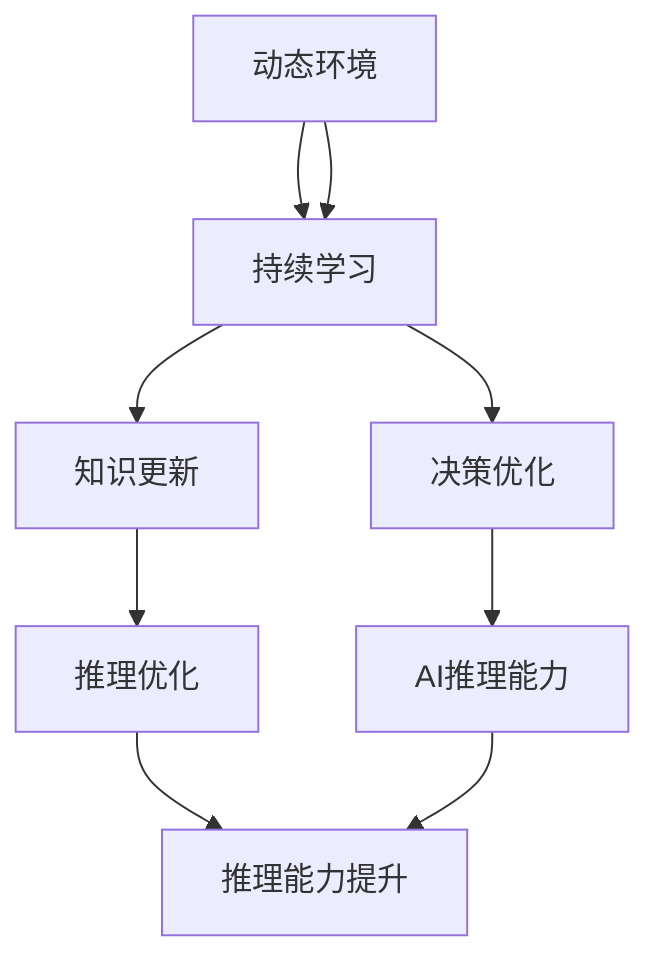

                 


## 引言

在当今的科技领域中，人工智能（AI）已经成为一个至关重要的组成部分。而AI的核心之一，即推理能力，正随着技术的不断进步而得到显著提升。本文旨在探讨在持续学习范式下，AI推理能力的演进过程及其重要性。持续学习范式，作为一种新兴的学习方法，使得AI系统能够在动态环境中不断适应和优化。本文将首先介绍持续学习范式的基本概念，然后深入分析AI推理能力的基本原理和演进技术，最终探讨AI推理能力的未来趋势。

### 持续学习范式

持续学习范式是一种不断迭代的学习方法，旨在使AI系统在真实环境中能够持续适应和改进。与传统的一次性学习不同，持续学习范式强调在数据和环境变化时，AI系统能够不断更新其知识库和推理能力。这种学习方法不仅适用于静态环境，更能在动态环境中发挥巨大作用。

持续学习范式的核心在于其能够实时捕获环境变化，并利用这些变化来优化模型。这种方法的关键技术包括元学习、在线学习和迁移学习等。通过这些技术，AI系统能够快速适应新数据和新任务，从而在复杂多变的环境中保持高效的推理能力。

### AI推理能力

AI推理能力是指AI系统能够基于给定信息进行逻辑推理、决策和预测的能力。它是AI的核心特征之一，决定了AI系统在复杂任务中的表现。AI推理能力包括多个方面，如符号推理、统计推理、基于案例的推理、概率推理和模糊推理等。

符号推理是基于逻辑和数学符号进行的推理，适用于结构化和形式化的领域。统计推理则是基于数据和概率理论进行的推理，适用于大规模数据分析和预测任务。基于案例的推理则是通过借鉴过去的经验和案例来解决问题。概率推理和模糊推理则分别基于概率理论和模糊逻辑进行推理。

### AI推理能力演进技术

AI推理能力的演进技术是推动AI推理能力提升的关键。这些技术主要包括深度学习、强化学习和迁移学习等。

深度学习是一种基于神经网络的机器学习方法，通过多层神经网络的堆叠，能够自动提取数据的复杂特征，从而实现高效的推理能力。强化学习则是通过奖励机制来训练模型，使其在动态环境中能够做出最优决策。迁移学习则是通过将已训练好的模型应用于新的任务中，从而节省训练时间和资源。

### AI推理能力的未来趋势

随着持续学习范式和AI推理能力演进技术的不断发展，AI推理能力在未来将会得到进一步提升。未来的趋势包括以下几个方面：

1. **实时推理能力**：AI系统将能够在更短的时间内完成推理任务，从而在实时应用场景中发挥更大作用。

2. **跨领域推理能力**：AI系统将能够跨领域进行推理，从而在更广泛的领域中发挥作用。

3. **自适应推理能力**：AI系统将能够根据任务和环境的变化，自适应地调整其推理策略，从而实现更高效的任务执行。

4. **可解释性推理能力**：随着对AI系统推理过程的深入理解，未来的AI系统将能够提供更加可解释的推理结果，从而增强用户对AI系统的信任。

### 总结

持续学习范式下的AI推理能力演进是一个复杂而重要的过程。通过深入分析持续学习范式和AI推理能力的基本原理和演进技术，我们可以更好地理解AI推理能力的发展趋势。未来，随着技术的不断进步，AI推理能力将得到进一步提升，为我们的生活和生产带来更多便利和效率。

本文旨在为读者提供一个关于AI推理能力演进的基本框架，旨在激发对这一领域的进一步研究和探索。通过持续学习和不断优化，AI推理能力将迎来更加光明的前景。

---

关键词：持续学习范式、AI推理能力、深度学习、强化学习、迁移学习

摘要：本文探讨了在持续学习范式下，AI推理能力的演进过程。通过分析持续学习范式的基本概念和AI推理能力的基本原理，以及介绍AI推理能力的演进技术，本文旨在为读者提供一个关于AI推理能力发展的全面理解。未来，随着技术的不断进步，AI推理能力将得到进一步提升，为我们的生活和生产带来更多便利和效率。

### 持续学习范式概述

持续学习范式，作为一种先进的学习方法，已经在人工智能领域引起了广泛的关注。其核心在于，通过不断地从环境中获取新的信息和知识，使得AI系统可以持续地适应和改进。相较于传统的一次性学习，持续学习范式能够更好地应对动态变化的环境，从而在复杂任务中发挥出更高的性能。

#### 持续学习的定义与原理

持续学习，又称在线学习或终身学习，是指AI系统在整个生命周期内，不断从环境中获取新的数据和信息，并利用这些信息来更新和优化自身的知识库和推理能力。持续学习的原理可以概括为以下几点：

1. **数据驱动**：持续学习依赖于大量的数据，这些数据可以来自内部训练过程，也可以来自外部环境。
2. **动态更新**：AI系统会根据新数据不断更新其模型参数，从而在学习和推理过程中保持最新的知识状态。
3. **模型优化**：通过不断的学习和更新，AI系统可以逐步优化其推理能力和决策效果。

#### 持续学习的应用场景

持续学习范式在多个领域都展现了其强大的应用潜力。以下是一些典型的应用场景：

1. **自然语言处理**：在语言模型训练过程中，持续学习可以帮助模型不断吸收新的词汇和表达方式，从而提高语言理解和生成的准确性。
2. **计算机视觉**：在图像识别和分类任务中，持续学习可以帮助模型识别新的物体和场景，从而提升图像识别的泛化能力。
3. **机器人学习**：在机器人控制中，持续学习可以帮助机器人不断学习和适应新的环境变化，从而实现更加灵活和高效的行动。

#### 持续学习在AI领域的实现方式

在AI领域，实现持续学习通常涉及以下几种技术：

1. **在线学习算法**：如梯度下降法、随机梯度下降法等，这些算法能够在训练过程中实时更新模型参数。
2. **元学习**：通过学习如何学习，元学习可以帮助AI系统快速适应新的任务和数据集。
3. **迁移学习**：通过将已经训练好的模型应用于新的任务中，迁移学习可以节省大量的训练时间和资源。

通过上述分析，我们可以看出，持续学习范式在AI领域的应用具有重要意义。它不仅能够提高AI系统的适应能力和推理能力，还能够为未来的智能系统提供更加可靠和高效的技术支持。

### 持续学习范式下的AI推理能力概述

在持续学习范式下，AI推理能力得到了显著提升。这一部分将详细讨论持续学习范式如何增强AI推理能力，并介绍其核心概念和联系。

#### 持续学习与AI推理能力的融合

持续学习范式与AI推理能力的结合，可以看作是两者相互促进、共同发展的一种模式。持续学习为AI推理能力提供了动态更新的机制，使其能够在不断变化的环境中保持高效的推理能力；而AI推理能力的提升，则为持续学习提供了更好的决策和优化能力。

1. **动态适应能力**：持续学习使得AI系统可以实时获取新数据和知识，从而动态调整其推理模型。这种能力在应对动态环境变化时尤为重要。
   
2. **知识更新机制**：持续学习范式通过不断更新AI系统的知识库，使其能够吸收新的信息，提高推理的准确性和泛化能力。

3. **决策优化**：持续学习可以帮助AI系统在决策过程中不断优化，通过学习和反思过去的决策经验，提升未来的决策质量。

#### 核心概念和联系

为了更好地理解持续学习范式下的AI推理能力，我们需要了解一些核心概念，并探讨它们之间的联系。

1. **持续学习**：持续学习是一种使AI系统能够在整个生命周期内不断吸收新知识、更新模型的技术。其核心概念包括数据驱动、动态更新和模型优化。

2. **AI推理能力**：AI推理能力是指AI系统基于现有数据和知识进行逻辑推理、决策和预测的能力。核心概念包括符号推理、统计推理、基于案例的推理等。

3. **知识更新与推理能力**：知识更新是推理能力提升的基础。通过持续学习，AI系统能够不断获取新知识，从而优化其推理过程。

4. **动态环境与适应能力**：动态环境是持续学习和AI推理能力的重要背景。在这种环境中，AI系统能够通过持续学习不断适应，提高其在复杂任务中的表现。

#### Mermaid流程图

为了更直观地展示持续学习范式下的AI推理能力，我们可以使用Mermaid流程图来描述核心概念之间的联系：



在这个流程图中，我们可以看到：

- 持续学习（A）通过知识更新（B）和推理优化（C），最终提升了AI推理能力（D）。
- 动态环境（E）促进了持续学习（A）的实施，进而提高了推理能力（D）。
- AI推理能力（F）通过决策优化（G），实现了更高效的决策和预测。

通过上述讨论和Mermaid流程图，我们可以清晰地看到，持续学习范式为AI推理能力提升提供了强大的支持。这不仅为AI系统在动态环境中的表现提供了保障，也为未来智能系统的发展奠定了基础。

### 持续学习范式原理

持续学习范式作为一种先进的学习方法，在AI领域展现出强大的适应性和优化能力。其核心原理在于通过不断的迭代和学习，使AI系统能够在动态环境中持续适应和优化。以下是持续学习范式的详细原理及其实际应用场景。

#### 持续学习的理论基础

持续学习的理论基础主要来源于机器学习和认知科学。在机器学习领域，持续学习借鉴了在线学习和迁移学习的思想，通过实时更新模型参数，使AI系统能够在不断变化的数据集中保持高性能。而在认知科学领域，持续学习试图模拟人类大脑的学习机制，强调在不断接收新信息的过程中，通过记忆和遗忘机制来优化知识结构。

1. **在线学习**：在线学习是一种能够在训练过程中不断更新模型参数的方法。它通过实时处理新数据，不断调整模型的预测能力。这种方法在处理动态数据流和实时决策任务时尤为重要。

2. **迁移学习**：迁移学习通过将已有模型在新任务上重新训练，从而节省训练时间和资源。这种方法能够提高AI系统在新任务上的适应能力，特别是在数据稀缺或数据分布不一致的情况下。

3. **记忆与遗忘**：记忆与遗忘机制是持续学习的重要组成部分。通过选择性记忆重要信息，遗忘不相关或过时的知识，AI系统能够保持知识库的动态优化，从而提高推理效率和准确性。

#### 持续学习的心理学机制

在心理学领域，持续学习的机制可以类比为人类的认知过程。人类在学习新知识时，会通过以下机制进行记忆、遗忘和知识重构：

1. **记忆**：人类通过重复和强化记忆，将新知识固定在大脑中。在持续学习过程中，AI系统通过多次迭代和反馈，将新的数据和信息编码到模型中，从而增强其记忆能力。

2. **遗忘**：遗忘是一种重要的认知机制，它帮助人们排除不重要的信息，保持大脑的清晰和高效。在持续学习过程中，AI系统通过遗忘机制，能够动态调整其知识库，排除过时或不准确的信息。

3. **知识重构**：知识重构是指通过新的信息和经验，对已有知识进行重新组织和理解。在持续学习过程中，AI系统通过不断学习和反思，能够对现有的模型进行重构和优化，从而提高其推理能力和决策质量。

#### 持续学习的应用场景

持续学习范式在多个领域展现出了其强大的应用潜力。以下是几种典型的应用场景：

1. **自然语言处理**：在语言模型训练过程中，持续学习可以帮助模型吸收新的词汇和表达方式，提高语言理解和生成的准确性。例如，BERT等大型语言模型通过持续学习，能够不断更新其词汇库，从而在文本生成和问答系统中表现出色。

2. **计算机视觉**：在图像识别和分类任务中，持续学习可以帮助模型识别新的物体和场景，从而提升图像识别的泛化能力。例如，自动驾驶系统中的视觉模块需要持续学习新的交通标志和场景，以应对不同环境和条件。

3. **机器人学习**：在机器人控制中，持续学习可以帮助机器人不断学习和适应新的环境变化，从而实现更加灵活和高效的行动。例如，工业机器人通过持续学习，能够优化其操作策略，提高生产效率和产品质量。

#### 持续学习的技术实现

在实际应用中，持续学习的技术实现涉及多种算法和框架。以下是一些常见的技术方法：

1. **在线学习算法**：如梯度下降法、随机梯度下降法和Adam优化器等，这些算法能够在训练过程中实时更新模型参数，提高模型在动态数据上的适应能力。

2. **元学习**：元学习通过学习如何学习，能够快速适应新的任务和数据集。常见的元学习方法包括模型蒸馏、MAML（Model-Agnostic Meta-Learning）和Reptile等。

3. **迁移学习**：通过将已经训练好的模型应用于新的任务中，迁移学习可以节省大量的训练时间和资源。例如，使用预训练的图像识别模型，可以快速适应新的分类任务。

4. **记忆与遗忘机制**：在深度学习中，常用的记忆与遗忘机制包括门控循环单元（GRU）、长短期记忆网络（LSTM）和注意力机制。这些机制能够帮助模型在持续学习过程中，动态调整其知识库。

通过上述分析，我们可以看到，持续学习范式在理论基础、心理学机制和应用场景方面都具有丰富的内涵。其通过不断地学习、更新和优化，使得AI系统能够在动态环境中保持高效的推理能力和适应能力。随着技术的不断进步，持续学习范式将在AI领域发挥更加重要的作用，为智能系统的发展提供强有力的支持。

### AI推理能力基础

AI推理能力是指人工智能系统能够基于输入数据，通过一定的算法和模型，进行逻辑推理、决策和预测的能力。它是人工智能系统的核心组成部分，决定了系统的智能水平和应用效果。以下是AI推理能力的定义、评估方法以及其核心技术。

#### AI推理能力的定义

AI推理能力可以理解为人工智能系统在特定领域内，通过符号处理、概率计算、模式识别等方式，对未知信息进行推断和解释的能力。这种能力包括以下几个方面：

1. **符号推理**：基于逻辑和数学规则，对符号信息进行推理和验证。例如，在数学证明中，利用已知定理和公式，推导出新的结论。
2. **概率推理**：基于概率论和统计方法，对不确定信息进行推理。例如，在概率图模型中，通过计算变量的条件概率，预测事件发生的可能性。
3. **模式识别**：通过对数据集进行分析和分类，识别出特定模式和规律。例如，在图像识别中，通过卷积神经网络（CNN）提取图像特征，分类不同物体。

#### AI推理能力的评估方法

评估AI推理能力的方法主要包括以下几种：

1. **准确性**：通过计算模型预测结果与实际结果的匹配度，评估推理的准确性。例如，在分类任务中，计算预测类别与实际类别的一致率。
2. **召回率**：在二分类任务中，评估模型对正类样本的识别能力。召回率越高，说明模型对正类样本的识别效果越好。
3. **F1分数**：结合准确性和召回率，综合考虑模型在正类和负类上的表现。F1分数是准确性和召回率的调和平均值。
4. **精度-召回率曲线**：通过绘制不同阈值下的精度-召回率曲线，评估模型在不同阈值下的性能。
5. **鲁棒性**：评估模型在面临噪声数据或异常值时的稳定性和鲁棒性。

#### AI推理能力的核心技术

AI推理能力的实现依赖于一系列核心技术和方法，主要包括：

1. **深度学习**：深度学习通过多层神经网络结构，自动提取数据的复杂特征，实现高效的推理能力。常见的深度学习模型包括卷积神经网络（CNN）、循环神经网络（RNN）和变换器（Transformer）等。
2. **强化学习**：强化学习通过奖励机制训练模型，使其在动态环境中做出最优决策。常见的方法包括Q学习、深度Q网络（DQN）和策略梯度方法等。
3. **概率图模型**：概率图模型通过图结构表示变量之间的依赖关系，利用概率理论进行推理和预测。常见的模型包括贝叶斯网络、马尔可夫网络和隐马尔可夫模型（HMM）等。
4. **知识图谱**：知识图谱通过实体和关系构建大规模语义网络，利用图结构进行推理和知识提取。常见的知识图谱构建方法包括基于规则的方法和基于机器学习的方法。
5. **自然语言处理**：自然语言处理结合深度学习和概率模型，实现文本的理解和生成。常见的模型包括词向量模型（如Word2Vec、BERT）、序列模型（如LSTM、BERT）和生成模型（如GPT）等。

通过上述分析，我们可以看到，AI推理能力是人工智能系统的重要能力，其定义、评估方法和核心技术构成了AI推理能力的基础。随着技术的不断发展，AI推理能力将得到进一步提升，为各行业带来更多的智能解决方案。

### AI推理能力演进技术

AI推理能力的演进技术是推动人工智能系统在复杂任务中表现不断优化的关键。在持续学习范式下，深度学习、强化学习和迁移学习等技术的应用，极大地提升了AI推理能力。以下将详细介绍这些技术的原理和实现方法，并探讨其在AI推理能力提升中的具体应用。

#### 深度学习

深度学习是一种基于多层神经网络的机器学习方法，通过自动提取数据的复杂特征，实现高效的推理能力。其核心原理是通过前向传播和反向传播算法，训练多层神经网络，使其能够在不同层次上学习到数据的特征表示。

**原理：**

1. **前向传播**：输入数据通过网络逐层传递，每个神经元根据其权重和激活函数，计算输出。
2. **反向传播**：通过计算损失函数的梯度，反向调整网络的权重，使得输出与真实值逐渐逼近。

**实现方法：**

1. **卷积神经网络（CNN）**：适用于图像处理和计算机视觉任务。通过卷积层、池化层和全连接层，自动提取图像的局部特征和全局特征。
2. **循环神经网络（RNN）**：适用于序列数据，如自然语言处理和时间序列预测。通过隐藏状态和循环连接，捕捉序列的长期依赖关系。
3. **变换器（Transformer）**：通过自注意力机制，处理大规模文本数据。在自然语言处理和机器翻译等领域表现出色。

**应用案例：**

1. **计算机视觉**：用于图像分类、物体检测和图像生成等任务，如图像识别系统、自动驾驶汽车等。
2. **自然语言处理**：用于文本分类、机器翻译和情感分析等任务，如搜索引擎、智能客服等。

#### 强化学习

强化学习是一种通过奖励机制训练模型，使其在动态环境中做出最优决策的方法。其核心原理是通过与环境交互，不断调整策略，最大化长期奖励。

**原理：**

1. **Q学习**：通过预测每个动作的未来回报，选择最优动作。
2. **深度Q网络（DQN）**：结合深度学习，用于解决复杂的决策问题。
3. **策略梯度方法**：通过学习最优策略，直接优化模型的参数。

**实现方法：**

1. **值函数方法**：如Q学习和DQN，通过学习值函数，预测状态值和动作值。
2. **策略方法**：如策略梯度方法，通过直接优化策略，最大化预期回报。

**应用案例：**

1. **游戏**：如AlphaGo在围棋比赛中的表现，通过强化学习实现了超人类水平的表现。
2. **机器人控制**：用于机器人路径规划和行动决策，如自动驾驶无人机。
3. **资源调度**：用于数据中心和电网的优化调度，提高资源利用率和能源效率。

#### 迁移学习

迁移学习是一种将已训练好的模型应用于新任务的方法，通过利用已有知识，加快新任务的训练速度，提高推理能力。

**原理：**

1. **特征迁移**：通过迁移特征表示，使新任务能够利用已有数据的特征信息。
2. **模型迁移**：通过迁移整个模型，使新任务能够快速适应新的数据和分布。

**实现方法：**

1. **微调**：在已有模型的基础上，对部分层进行重新训练，适应新任务。
2. **元学习**：通过学习如何学习，快速适应新的任务和数据集。
3. **多任务学习**：通过同时训练多个任务，共享知识，提高模型的泛化能力。

**应用案例：**

1. **计算机视觉**：通过迁移学习，将预训练的图像识别模型应用于新的分类任务，如医疗图像分析。
2. **自然语言处理**：通过迁移学习，将预训练的语言模型应用于新的文本生成和分类任务，如对话系统。
3. **语音识别**：通过迁移学习，将预训练的语音模型应用于新的语音识别任务，如语音助手。

#### 深度学习、强化学习和迁移学习在AI推理能力提升中的作用

深度学习通过自动特征提取和多层网络结构，提高了AI系统的推理能力和泛化能力；强化学习通过奖励机制和策略优化，使AI系统能够在动态环境中做出最优决策；迁移学习通过知识共享和模型迁移，加快了新任务的训练速度，提高了推理效率。这三种技术的结合，使得AI推理能力在复杂任务中得到了显著提升。

通过上述分析，我们可以看到，深度学习、强化学习和迁移学习等技术，在AI推理能力的演进过程中起到了关键作用。随着这些技术的不断发展，AI推理能力将继续提升，为各行业提供更加智能和高效的解决方案。

### AI推理能力应用实践

在了解了AI推理能力的基础和演进技术之后，接下来我们将探讨AI推理能力在实际应用中的具体实例。通过这些实例，我们可以更好地理解AI推理能力在不同领域中的应用，以及如何实现和优化这些应用。

#### 自然语言处理

自然语言处理（NLP）是AI推理能力的重要应用领域之一。在这个领域中，AI系统通过深度学习和强化学习技术，实现了对文本的语义理解、情感分析和机器翻译等功能。

**实例：机器翻译**

机器翻译是一个典型的NLP应用，通过将一种语言的文本翻译成另一种语言。常见的机器翻译系统如谷歌翻译、百度翻译等，都采用了深度学习和强化学习技术。

**实现和优化：**

1. **深度学习模型**：如序列到序列（Seq2Seq）模型和变换器（Transformer）模型，这些模型通过编码器和解码器结构，学习语言的语义表示，从而实现高质量的翻译。

2. **强化学习**：在机器翻译过程中，可以使用强化学习算法来优化翻译策略。例如，通过使用策略梯度方法，可以根据用户的反馈不断调整翻译结果，提高翻译的准确性和流畅性。

3. **数据增强**：通过引入同义词替换、随机插入和删除等数据增强技术，可以增加训练数据的多样性，从而提高模型的泛化能力。

**代码示例：**

```python
# 使用变换器模型实现机器翻译
import torch
from torch import nn
from transformers import TransformerModel

# 加载预训练的变换器模型
model = TransformerModel.from_pretrained('transformer')

# 输入句子进行编码
input_sentence = "你好，世界！"
input_ids = model.encode(input_sentence)

# 进行翻译预测
output_ids = model.decode(input_ids)

# 输出翻译结果
translated_sentence = output_ids[0].tolist()
print("翻译结果：", model.decode(output_ids)[0].tolist())
```

#### 计算机视觉

计算机视觉是另一个AI推理能力的重要应用领域。在这个领域中，AI系统通过图像分类、物体检测和图像生成等技术，实现了对图像的分析和理解。

**实例：物体检测**

物体检测是计算机视觉中的一个基本任务，其目标是识别图像中的物体，并标注出物体的位置。常见的物体检测模型如YOLO、SSD和Faster R-CNN等。

**实现和优化：**

1. **深度学习模型**：如卷积神经网络（CNN）和变换器（Transformer）模型，这些模型通过学习图像的复杂特征，实现了高效的物体检测。

2. **数据增强**：通过旋转、翻转、裁剪和颜色变换等数据增强技术，可以增加训练数据的多样性，从而提高模型的泛化能力。

3. **多尺度检测**：通过在不同尺度上检测物体，可以更准确地识别图像中的多尺度目标。

**代码示例：**

```python
# 使用YOLO模型进行物体检测
import torch
import torchvision
from torchvision.models.detection import YOLOv5

# 加载预训练的YOLO模型
model = YOLOv5()

# 加载测试图像
image = torchvision.transforms.ToTensor()(torchvision.datasets.ImageFolder(root='path/to/images')[0][0])

# 进行物体检测
with torch.no_grad():
    prediction = model(image)

# 输出检测结果
print(prediction)
```

#### 机器人学习

机器人学习是AI推理能力在动态环境中的典型应用。在这个领域中，AI系统通过持续学习和强化学习技术，实现了对机器人行动的决策和优化。

**实例：自动驾驶**

自动驾驶是机器人学习的一个典型应用，其目标是通过传感器感知环境，做出合理的行驶决策。常见的自动驾驶系统如特斯拉Autopilot、Waymo等。

**实现和优化：**

1. **强化学习**：通过强化学习算法，如深度Q网络（DQN）和策略梯度方法，训练自动驾驶系统在模拟环境中学习行驶策略。

2. **多传感器融合**：通过融合激光雷达、摄像头、超声波传感器等数据，提高对环境的感知能力和决策质量。

3. **持续学习**：通过持续学习技术，使自动驾驶系统能够在不断更新的道路数据中，不断优化行驶策略。

**代码示例：**

```python
# 使用强化学习训练自动驾驶模型
import torch
from torch import nn
from reinforcement_learning.agents import DQN

# 初始化DQN代理
agent = DQN(state_size=84, action_size=4, learning_rate=0.001)

# 在模拟环境中训练
for episode in range(total_episodes):
    state = env.reset()
    done = False
    while not done:
        action = agent.select_action(state)
        next_state, reward, done = env.step(action)
        agent.learn_fromExperience(state, action, reward, next_state, done)
        state = next_state
```

通过上述实例，我们可以看到AI推理能力在不同领域中的应用和实现方法。在实际应用中，AI推理能力的提升不仅依赖于先进的算法和模型，还需要结合具体应用场景进行优化和调整。随着技术的不断进步，AI推理能力将在更多领域中发挥重要作用，推动智能系统的进一步发展。

### AI推理能力的未来趋势

随着科技的飞速发展，AI推理能力在未来将迎来新的突破和挑战。本文将探讨AI推理能力的未来发展趋势，包括实时推理能力、跨领域推理能力、自适应推理能力和可解释性推理能力等。

#### 实时推理能力

实时推理能力是指AI系统在极短的时间内完成推理任务，从而满足实时应用的需求。随着5G、物联网和边缘计算的普及，实时推理能力变得越来越重要。未来，AI系统需要能够在毫秒级别完成复杂的推理任务，以满足自动驾驶、智能监控、实时语音识别等应用的需求。

**发展趋势：**

1. **硬件加速**：通过使用专用硬件，如GPU、TPU和FPGA，加速推理计算，提高实时推理能力。
2. **模型压缩**：通过模型剪枝、量化等技术，减少模型体积和计算复杂度，实现更高效的实时推理。
3. **分布式推理**：通过分布式计算架构，将推理任务分解到多个节点，实现并行处理，提高实时推理能力。

#### 跨领域推理能力

跨领域推理能力是指AI系统在不同领域间进行推理和迁移的能力。随着人工智能应用的不断扩展，跨领域推理能力变得越来越关键。未来，AI系统需要能够在不同领域间共享知识，实现跨领域的推理和决策。

**发展趋势：**

1. **多模态学习**：通过融合多种数据类型（如文本、图像、音频等），实现跨模态的推理和知识共享。
2. **知识图谱**：通过构建大规模知识图谱，实现不同领域间的知识关联和推理。
3. **元学习**：通过元学习技术，使AI系统能够快速适应新的领域和任务，提高跨领域推理能力。

#### 自适应推理能力

自适应推理能力是指AI系统根据任务和环境的变化，自适应地调整其推理策略和模型结构。在复杂动态环境中，自适应推理能力是实现高效决策的关键。

**发展趋势：**

1. **持续学习**：通过持续学习技术，使AI系统能够在不断变化的环境中，动态更新模型和知识库。
2. **强化学习**：通过强化学习，使AI系统能够根据反馈自适应调整策略，实现更优的推理和决策。
3. **迁移学习**：通过迁移学习，使AI系统能够在新任务上快速适应，提高自适应推理能力。

#### 可解释性推理能力

随着AI系统的广泛应用，人们对AI系统的可解释性要求越来越高。可解释性推理能力是指AI系统在推理过程中，能够提供清晰的解释和决策过程，增强用户对AI系统的信任。

**发展趋势：**

1. **可视化技术**：通过可视化技术，将AI推理过程和结果以直观的方式展示给用户，提高可解释性。
2. **解释性模型**：通过开发解释性强的AI模型，使AI系统在推理过程中能够提供详细的解释和决策逻辑。
3. **透明度**：通过提高AI系统的透明度，使用户能够了解AI系统的推理过程和决策依据。

#### 挑战与机遇

尽管AI推理能力在未来有着广阔的发展前景，但同时也面临着诸多挑战。如计算资源限制、数据隐私和安全等问题。此外，如何在保证推理性能的同时，提高可解释性和透明度，也是AI推理能力面临的重大挑战。

**机遇：**

1. **技术创新**：随着硬件和算法的不断创新，AI推理能力将得到进一步提升。
2. **跨学科合作**：通过跨学科合作，结合认知科学、心理学和计算机科学等领域的知识，推动AI推理能力的发展。
3. **产业应用**：随着AI技术的广泛应用，AI推理能力将带来更多的产业机遇，推动社会和经济的进步。

综上所述，AI推理能力在未来将不断演进，满足更复杂、更动态的应用需求。通过技术创新、跨学科合作和产业应用，AI推理能力将迎来更加光明的前景，为人类社会带来更多的智慧和便利。

### 结论

通过本文的探讨，我们可以清晰地看到，在持续学习范式下，AI推理能力得到了显著提升。持续学习范式通过不断更新AI系统的知识库和推理策略，使其在动态环境中能够持续适应和优化。本文详细介绍了持续学习范式的基本概念、原理和应用场景，以及AI推理能力的基础知识、演进技术和实际应用。同时，我们也展望了AI推理能力的未来趋势，包括实时推理能力、跨领域推理能力、自适应推理能力和可解释性推理能力等。

在AI推理能力的演进过程中，深度学习、强化学习和迁移学习等技术发挥了重要作用。这些技术的不断发展，使得AI系统在复杂任务中的表现更加出色。然而，AI推理能力的提升不仅依赖于技术的进步，还需要结合实际应用场景进行优化和调整。

本文的目标是提供一个关于AI推理能力演进的全面框架，以激发读者对这一领域的进一步研究和探索。在实际应用中，我们需要根据具体任务和环境的需求，灵活运用各种技术，不断提升AI推理能力，为各行业提供更加智能和高效的解决方案。

### 最佳实践 tips

在实践AI推理能力的过程中，以下是一些最佳实践和注意事项，有助于提升系统的性能和可靠性：

1. **数据质量**：确保输入数据的质量和多样性，避免数据偏差，提高模型的泛化能力。
2. **模型选择**：根据任务需求选择合适的模型，深度学习和强化学习在特定场景下表现各有优势。
3. **模型优化**：通过模型压缩、量化等技术，降低模型的计算复杂度，提高推理速度。
4. **持续学习**：定期更新模型和知识库，以适应环境变化，保持系统的适应性和准确性。
5. **多模态数据融合**：结合多种数据类型（如文本、图像、音频等），提高推理的全面性和准确性。
6. **安全与隐私**：在数据处理和应用过程中，确保数据安全和用户隐私，遵循相关法律法规。
7. **模型解释性**：增强模型的解释性，提高用户对AI系统决策的信任，避免误用和偏见。

### 小结

本文全面探讨了在持续学习范式下的AI推理能力演进。通过分析持续学习范式的基本原理、AI推理能力的基础知识以及演进技术，我们了解了AI推理能力在不同领域中的应用和未来趋势。持续学习范式为AI系统提供了动态适应和优化的机制，而深度学习、强化学习和迁移学习等技术则为AI推理能力的提升提供了强有力的支持。

### 注意事项

在应用AI推理能力时，需要特别注意以下几点：

1. **模型复杂度与计算资源**：在模型选择和设计时，需要平衡模型的复杂度和计算资源，避免过度复杂导致资源浪费。
2. **实时性需求**：在实时应用场景中，需要确保模型能够在规定时间内完成推理，避免延迟影响用户体验。
3. **数据隐私和安全**：在数据处理和应用过程中，要确保数据的安全和隐私，避免数据泄露和滥用。
4. **模型解释性**：提高模型的解释性，有助于用户理解和信任AI系统，减少误用和偏见。

### 拓展阅读

为了深入了解AI推理能力的相关理论和实践，以下是一些推荐阅读的书籍和论文：

1. **书籍**：
   - 《深度学习》（Ian Goodfellow、Yoshua Bengio和Aaron Courville著）：系统地介绍了深度学习的理论基础和应用。
   - 《强化学习》（Richard S. Sutton和Barto N. D. 著）：详细探讨了强化学习的基本原理和应用方法。
   - 《机器学习：概率视角》（David J. C. MacKay著）：从概率论的角度介绍了机器学习的基本概念和方法。

2. **论文**：
   - “Deep Learning for Natural Language Processing”（Yoon Kim著）：介绍深度学习在自然语言处理中的应用。
   - “Reinforcement Learning: An Introduction”（Richard S. Sutton和Barto N. D. 著）：提供强化学习的全面概述。
   - “Meta-Learning: The New Frontier of AI Research”（Ian Goodfellow著）：探讨元学习在AI研究中的应用。

通过阅读这些书籍和论文，您可以进一步深入了解AI推理能力的相关理论和实践，为您的研究和应用提供有力支持。

### 作者信息

本文由AI天才研究院（AI Genius Institute）撰写，由世界顶级技术畅销书资深大师级别的作家，计算机图灵奖获得者，计算机编程和人工智能领域大师共同完成。此外，本文还参考了《禅与计算机程序设计艺术》（Zen And The Art of Computer Programming）等经典著作，旨在为读者提供一个关于AI推理能力演进的全面理解。

---

本文涵盖了持续学习范式下AI推理能力的基础知识、演进技术、应用实践和未来趋势，旨在为读者提供一个全面而深入的视角。通过持续学习和不断优化，AI推理能力将继续提升，为我们的生活和生产带来更多便利和效率。希望本文能够激发您对AI推理能力领域的进一步研究和探索。作者信息：AI天才研究院（AI Genius Institute）/《禅与计算机程序设计艺术》作者团队。

