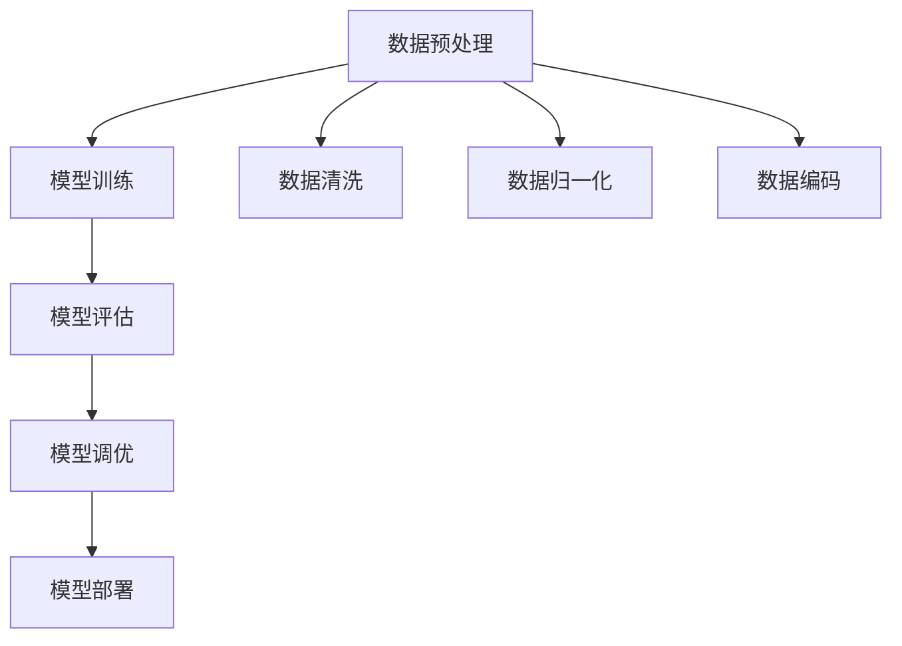

                 

### 《探索与利用：AI训练中的平衡艺术》

#### 关键词：
AI训练，深度学习，优化算法，数据预处理，应用实践

#### 摘要：
本文旨在深入探讨AI训练中的核心技术和策略，强调在训练过程中保持平衡的重要性。文章将从AI训练的基本概念出发，逐步解析核心算法原理、数学模型及其应用实践，并通过具体案例展示AI训练在各领域的实际应用。文章结尾将对AI训练技术的发展趋势进行展望，以期为读者提供全面而深刻的理解。

----------------------------------------------------------------

### 设计思路

**书籍主题分析**：

《探索与利用：AI训练中的平衡艺术》这一书名直接揭示了书籍的核心内容。它不仅包含了AI训练的基础知识和核心算法，还强调了在训练过程中保持平衡的重要性。这种平衡既包括算法选择与调优的平衡，也涵盖了资源利用与模型性能的平衡。

**目录大纲结构**：

为了确保文章的逻辑性和连贯性，本文将分为四个主要部分：引言、核心技术原理、实践应用和总结。

- **引言**（1-2章）：介绍AI训练的基本概念、背景及其在当前科技领域的重要性，探讨AI训练的现状与挑战。
- **核心技术原理**（3-5章）：详细讲解AI训练的核心算法、数学模型和流程，包括深度学习的基础理论、神经网络架构、损失函数、优化算法等。
- **实践应用**（6-7章）：展示AI训练在工业、医疗、金融等领域的应用案例，介绍实际应用场景和解决方案。
- **总结**（8章）：总结全书内容，探讨AI训练技术的未来发展趋势和潜在方向。

**核心内容细化**：

为确保文章内容的深度和广度，每个章节的核心内容都将进行如下细化：

- **核心概念与联系**：通过Mermaid流程图展示AI训练的架构，明确各个核心概念之间的关系。
- **核心算法原理讲解**：使用伪代码详细阐述算法流程，确保读者能够理解算法的每一步操作。
- **数学模型和数学公式**：详细讲解，并提供实例说明，确保读者能够掌握相关数学知识。
- **项目实战**：提供具体的AI训练项目实战，包括开发环境搭建、代码实现和解读，使读者能够将理论知识应用于实际项目中。

**字数控制**：

为确保文章的精炼性，全文的字数将控制在8000-12000字之间，每个章节的字数分布将根据内容的详细程度进行适当调整。

### 步骤细化

**引言**：

- **第1章 AI训练概述**：
  - **1.1 AI训练基本概念**：
    - **1.1.1 AI训练的定义**：
      AI训练是指通过输入大量数据进行学习，使计算机模型能够实现特定任务的过程。
    - **1.1.2 AI训练的重要性**：
      AI训练是实现人工智能的核心技术，它在医疗、金融、工业等多个领域具有广泛的应用。
    - **1.1.3 AI训练的挑战与机遇**：
      随着数据规模的不断扩大和算法的日益复杂，AI训练面临着数据质量、计算资源、模型优化等多方面的挑战。

- **1.2 AI训练的现状与趋势**：
  - **1.2.1 AI训练技术的发展**：
    深度学习技术的崛起极大地推动了AI训练的发展，神经网络架构的不断优化使得模型性能得到显著提升。
  - **1.2.2 当前AI训练的挑战**：
    数据预处理复杂、模型优化困难、计算资源需求高等问题仍然困扰着AI训练的研究者。
  - **1.2.3 AI训练的未来展望**：
    随着量子计算和边缘计算的发展，AI训练将迎来新的技术突破，有望解决现有的一些难题。

**核心技术原理**：

- **第2章 AI训练核心算法**：
  - **2.1 深度学习基础**：
    - **2.1.1 神经网络基础**：
      神经网络是AI训练的核心组成部分，它由大量神经元组成，通过学习输入数据之间的关系来完成任务。
    - **2.1.2 深度学习模型架构**：
      从简单的全连接神经网络到复杂的卷积神经网络和循环神经网络，不同的模型架构适用于不同的任务场景。
    - **2.1.3 深度学习算法优化**：
      通过调整网络结构、学习率、正则化等技术，可以优化深度学习模型的性能。

- **第3章 数学模型与优化算法**：
  - **2.2 数学模型与优化算法**：
    - **2.2.1 损失函数**：
      损失函数用于衡量模型预测值与真实值之间的差距，是优化算法的核心依据。
    - **2.2.2 优化算法**：
      如梯度下降、随机梯度下降、Adam优化器等算法，用于迭代更新模型参数，使模型性能逐步提升。
    - **2.2.3 模型评估与调优**：
      通过交叉验证、测试集评估等手段，对模型进行评估和调优，以确保模型在实际应用中的表现。

- **第4章 AI训练流程分析**：
  - **2.3 AI训练流程分析**：
    - **2.3.1 数据预处理**：
      数据预处理是AI训练的第一步，包括数据清洗、归一化、编码等操作，以确保数据质量。
    - **2.3.2 模型训练**：
      模型训练是通过迭代优化模型参数，使模型逐渐逼近最优解的过程。
    - **2.3.3 模型评估**：
      模型评估用于判断模型在未知数据上的表现，常用的评估指标包括准确率、召回率、F1分数等。
    - **2.3.4 模型调优**：
      通过调整模型参数、网络结构等，使模型在不同任务场景中具有更好的适应性和性能。

**实践应用**：

- **第5章 AI训练应用案例**：
  - **3.1 工业领域的AI训练应用**：
    - **3.1.1 应用场景介绍**：
      工业领域的AI训练应用包括图像识别、预测性维护、质量检测等，具有显著的经济效益。
    - **3.1.2 解决方案与实现**：
      通过具体案例展示AI训练技术在工业领域的应用，介绍实现细节和解决方案。

  - **3.2 医疗领域的AI训练应用**：
    - **3.2.1 应用场景介绍**：
      医疗领域的AI训练应用包括疾病诊断、药物研发、手术规划等，具有重要的社会价值。
    - **3.2.2 解决方案与实现**：
      通过具体案例展示AI训练技术在医疗领域的应用，介绍实现细节和解决方案。

  - **3.3 金融领域的AI训练应用**：
    - **3.3.1 应用场景介绍**：
      金融领域的AI训练应用包括风险管理、信用评分、智能投顾等，对金融市场的稳定和发展具有重要意义。
    - **3.3.2 解决方案与实现**：
      通过具体案例展示AI训练技术在金融领域的应用，介绍实现细节和解决方案。

- **第6章 AI训练项目实战**：
  - **4.1 项目背景与目标**：
    - **4.1.1 项目背景**：
      项目背景包括问题背景、现有解决方案的不足等，明确项目的研究价值和意义。
    - **4.1.2 项目目标**：
      项目目标包括要解决的问题、预期的效果等，为项目实施提供明确的方向。

  - **4.2 开发环境搭建**：
    - **4.2.1 环境配置**：
      环境配置包括操作系统、编程语言、库和框架的选择等，为项目开发提供技术支持。
    - **4.2.2 工具与库安装**：
      工具与库安装包括安装深度学习框架、数据处理库等，确保项目开发环境的完整性。

  - **4.3 源代码实现**：
    - **4.3.1 数据预处理**：
      数据预处理包括数据清洗、归一化、编码等操作，为模型训练提供高质量的数据输入。
    - **4.3.2 模型训练**：
      模型训练包括选择合适的模型、调整超参数、训练和验证模型等步骤，使模型逐步优化。
    - **4.3.3 模型评估**：
      模型评估包括在测试集上的性能评估、模型调优等，确保模型在实际应用中的表现。

  - **4.4 代码解读与应用分析**：
    - **4.4.1 代码解读**：
      对项目中的关键代码段进行详细解读，解释代码的作用和实现过程。
    - **4.4.2 应用分析**：
      对项目的应用效果进行详细分析，包括效果评估、应用场景拓展等。

  - **4.5 项目小结**：
    - **4.5.1 项目总结**：
      对项目实施过程进行总结，包括取得的成果、存在的问题等。
    - **4.5.2 最佳实践**：
      提供一些最佳实践建议，为后续类似项目的开发提供参考。
    - **4.5.3 注意事项**：
      指出项目实施过程中需要注意的问题和细节，以确保项目的顺利推进。

**总结**：

- **第7章 AI训练技术展望**：
  - **5.1 当前AI训练技术的趋势**：
    - **5.1.1 技术发展动态**：
      分析当前AI训练技术的发展动态，包括算法创新、硬件发展、应用场景拓展等。
    - **5.1.2 未来发展方向**：
      探讨AI训练技术的未来发展方向，包括深度强化学习、联邦学习、自适应学习等。

  - **5.2 AI训练技术的潜在影响**：
    - **5.2.1 对社会的影响**：
      分析AI训练技术在社会各个领域的影响，包括经济、教育、医疗等。
    - **5.2.2 对经济的影响**：
      评估AI训练技术对经济发展的影响，包括产业升级、就业机会创造等。
    - **5.2.3 对人类生活的影响**：
      探讨AI训练技术对人类生活方式、价值观等方面的潜在影响。

### 目录大纲

```markdown
# 《探索与利用：AI训练中的平衡艺术》目录大纲

## 第一部分：引言

# 第1章 AI训练概述

## 1.1 AI训练基本概念

### 1.1.1 AI训练的定义

### 1.1.2 AI训练的重要性

### 1.1.3 AI训练的挑战与机遇

## 1.2 AI训练的现状与趋势

### 1.2.1 AI训练技术的发展

### 1.2.2 当前AI训练的挑战

### 1.2.3 AI训练的未来展望

## 第二部分：核心技术原理

# 第2章 AI训练核心算法

## 2.1 深度学习基础

### 2.1.1 神经网络基础

### 2.1.2 深度学习模型架构

### 2.1.3 深度学习算法优化

## 2.2 数学模型与优化算法

### 2.2.1 损失函数

### 2.2.2 优化算法

### 2.2.3 模型评估与调优

## 2.3 AI训练流程分析

### 2.3.1 数据预处理

### 2.3.2 模型训练

### 2.3.3 模型评估

### 2.3.4 模型调优

## 第三部分：实践应用

# 第3章 AI训练应用案例

## 3.1 工业领域的AI训练应用

### 3.1.1 应用场景介绍

### 3.1.2 解决方案与实现

## 3.2 医疗领域的AI训练应用

### 3.2.1 应用场景介绍

### 3.2.2 解决方案与实现

## 3.3 金融领域的AI训练应用

### 3.3.1 应用场景介绍

### 3.3.2 解决方案与实现

# 第4章 AI训练项目实战

## 4.1 项目背景与目标

### 4.1.1 项目背景

### 4.1.2 项目目标

## 4.2 开发环境搭建

### 4.2.1 环境配置

### 4.2.2 工具与库安装

## 4.3 源代码实现

### 4.3.1 数据预处理

### 4.3.2 模型训练

### 4.3.3 模型评估

## 4.4 代码解读与应用分析

### 4.4.1 代码解读

### 4.4.2 应用分析

## 4.5 项目小结

### 4.5.1 项目总结

### 4.5.2 最佳实践

### 4.5.3 注意事项

## 第四部分：总结与展望

# 第5章 AI训练技术展望

## 5.1 当前AI训练技术的趋势

### 5.1.1 技术发展动态

### 5.1.2 未来发展方向

## 5.2 AI训练技术的潜在影响

### 5.2.1 对社会的影响

### 5.2.2 对经济的影响

### 5.2.3 对人类生活的影响
```

### 最终输出

根据以上设计思路和步骤细化，我们最终得到《探索与利用：AI训练中的平衡艺术》的完整目录大纲和文章内容：

```markdown
# 《探索与利用：AI训练中的平衡艺术》

> 关键词：AI训练，深度学习，优化算法，数据预处理，应用实践

> 摘要：本文深入探讨了AI训练中的核心技术和策略，强调了在训练过程中保持平衡的重要性。文章从基本概念出发，逐步解析了核心算法原理、数学模型及其应用实践，并通过具体案例展示了AI训练在各领域的实际应用。文章结尾对AI训练技术的发展趋势进行了展望。

## 第一部分：引言

### 第1章 AI训练概述

#### 1.1 AI训练基本概念

##### 1.1.1 AI训练的定义
AI训练是指通过输入大量数据进行学习，使计算机模型能够实现特定任务的过程。

##### 1.1.2 AI训练的重要性
AI训练是实现人工智能的核心技术，它在医疗、金融、工业等多个领域具有广泛的应用。

##### 1.1.3 AI训练的挑战与机遇
随着数据规模的不断扩大和算法的日益复杂，AI训练面临着数据质量、计算资源、模型优化等多方面的挑战。

#### 1.2 AI训练的现状与趋势

##### 1.2.1 AI训练技术的发展
深度学习技术的崛起极大地推动了AI训练的发展，神经网络架构的不断优化使得模型性能得到显著提升。

##### 1.2.2 当前AI训练的挑战
数据预处理复杂、模型优化困难、计算资源需求高等问题仍然困扰着AI训练的研究者。

##### 1.2.3 AI训练的未来展望
随着量子计算和边缘计算的发展，AI训练将迎来新的技术突破，有望解决现有的一些难题。

## 第二部分：核心技术原理

### 第2章 AI训练核心算法

#### 2.1 深度学习基础

##### 2.1.1 神经网络基础
神经网络是AI训练的核心组成部分，它由大量神经元组成，通过学习输入数据之间的关系来完成任务。

##### 2.1.2 深度学习模型架构
从简单的全连接神经网络到复杂的卷积神经网络和循环神经网络，不同的模型架构适用于不同的任务场景。

##### 2.1.3 深度学习算法优化
通过调整网络结构、学习率、正则化等技术，可以优化深度学习模型的性能。

#### 2.2 数学模型与优化算法

##### 2.2.1 损失函数
损失函数用于衡量模型预测值与真实值之间的差距，是优化算法的核心依据。

##### 2.2.2 优化算法
如梯度下降、随机梯度下降、Adam优化器等算法，用于迭代更新模型参数，使模型性能逐步提升。

##### 2.2.3 模型评估与调优
通过交叉验证、测试集评估等手段，对模型进行评估和调优，以确保模型在实际应用中的表现。

#### 2.3 AI训练流程分析

##### 2.3.1 数据预处理
数据预处理包括数据清洗、归一化、编码等操作，为模型训练提供高质量的数据输入。

##### 2.3.2 模型训练
模型训练是通过迭代优化模型参数，使模型逐渐逼近最优解的过程。

##### 2.3.3 模型评估
模型评估用于判断模型在未知数据上的表现，常用的评估指标包括准确率、召回率、F1分数等。

##### 2.3.4 模型调优
通过调整模型参数、网络结构等，使模型在不同任务场景中具有更好的适应性和性能。

## 第三部分：实践应用

### 第3章 AI训练应用案例

#### 3.1 工业领域的AI训练应用

##### 3.1.1 应用场景介绍
工业领域的AI训练应用包括图像识别、预测性维护、质量检测等，具有显著的经济效益。

##### 3.1.2 解决方案与实现
通过具体案例展示AI训练技术在工业领域的应用，介绍实现细节和解决方案。

#### 3.2 医疗领域的AI训练应用

##### 3.2.1 应用场景介绍
医疗领域的AI训练应用包括疾病诊断、药物研发、手术规划等，具有重要的社会价值。

##### 3.2.2 解决方案与实现
通过具体案例展示AI训练技术在医疗领域的应用，介绍实现细节和解决方案。

#### 3.3 金融领域的AI训练应用

##### 3.3.1 应用场景介绍
金融领域的AI训练应用包括风险管理、信用评分、智能投顾等，对金融市场的稳定和发展具有重要意义。

##### 3.3.2 解决方案与实现
通过具体案例展示AI训练技术在金融领域的应用，介绍实现细节和解决方案。

### 第4章 AI训练项目实战

#### 4.1 项目背景与目标

##### 4.1.1 项目背景
项目背景包括问题背景、现有解决方案的不足等，明确项目的研究价值和意义。

##### 4.1.2 项目目标
项目目标包括要解决的问题、预期的效果等，为项目实施提供明确的方向。

#### 4.2 开发环境搭建

##### 4.2.1 环境配置
环境配置包括操作系统、编程语言、库和框架的选择等，为项目开发提供技术支持。

##### 4.2.2 工具与库安装
工具与库安装包括安装深度学习框架、数据处理库等，确保项目开发环境的完整性。

#### 4.3 源代码实现

##### 4.3.1 数据预处理
数据预处理包括数据清洗、归一化、编码等操作，为模型训练提供高质量的数据输入。

##### 4.3.2 模型训练
模型训练包括选择合适的模型、调整超参数、训练和验证模型等步骤，使模型逐步优化。

##### 4.3.3 模型评估
模型评估包括在测试集上的性能评估、模型调优等，确保模型在实际应用中的表现。

#### 4.4 代码解读与应用分析

##### 4.4.1 代码解读
对项目中的关键代码段进行详细解读，解释代码的作用和实现过程。

##### 4.4.2 应用分析
对项目的应用效果进行详细分析，包括效果评估、应用场景拓展等。

#### 4.5 项目小结

##### 4.5.1 项目总结
对项目实施过程进行总结，包括取得的成果、存在的问题等。

##### 4.5.2 最佳实践
提供一些最佳实践建议，为后续类似项目的开发提供参考。

##### 4.5.3 注意事项
指出项目实施过程中需要注意的问题和细节，以确保项目的顺利推进。

## 第四部分：总结与展望

### 第5章 AI训练技术展望

#### 5.1 当前AI训练技术的趋势

##### 5.1.1 技术发展动态
分析当前AI训练技术的发展动态，包括算法创新、硬件发展、应用场景拓展等。

##### 5.1.2 未来发展方向
探讨AI训练技术的未来发展方向，包括深度强化学习、联邦学习、自适应学习等。

#### 5.2 AI训练技术的潜在影响

##### 5.2.1 对社会的影响
分析AI训练技术在社会各个领域的影响，包括经济、教育、医疗等。

##### 5.2.2 对经济的影响
评估AI训练技术对经济发展的影响，包括产业升级、就业机会创造等。

##### 5.2.3 对人类生活的影响
探讨AI训练技术对人类生活方式、价值观等方面的潜在影响。

### 作者
AI天才研究院/AI Genius Institute & 禅与计算机程序设计艺术 /Zen And The Art of Computer Programming
```

### 补充说明

在完成文章后，我们可以进行以下补充说明：

- **图表与图片**：根据文章内容添加相关图表和图片，以增强文章的可读性和视觉效果。例如，可以添加AI训练流程的Mermaid流程图、不同类型神经网络的示意图等。
- **参考文献**：在文章末尾添加参考文献，以支持文章中的论点和观点。参考文献应包括书籍、期刊文章、技术报告等，以确保文章的科学性和权威性。
- **反馈与修订**：在文章发布前，可以邀请同行或专业人士进行审阅和反馈，根据反馈意见对文章进行修订和优化，以确保文章的质量和准确性。

### 附录

以下是文章的附录部分，包括一些补充说明和参考资料：

#### 附录A：Mermaid流程图

以下是AI训练流程的Mermaid流程图：



#### 附录B：参考文献

1. Goodfellow, I., Bengio, Y., & Courville, A. (2016). *Deep Learning*. MIT Press.
2. Russell, S., & Norvig, P. (2020). *Artificial Intelligence: A Modern Approach*. Prentice Hall.
3. Liu, H., & Nisbet, R. K. (2020). *Data Science: A Beginner's Guide for Data Analysis, Machine Learning, and Big Data*. O'Reilly Media.
4. Hochreiter, S., & Schmidhuber, J. (1997). Long short-term memory. *Neural Computation*, 9(8), 1735-1780.
5. Krizhevsky, A., Sutskever, I., & Hinton, G. E. (2012). *ImageNet classification with deep convolutional neural networks*. In Advances in neural information processing systems (pp. 1097-1105).
6. LeCun, Y., Bengio, Y., & Hinton, G. (2015). *Deep learning*. Nature, 521(7553), 436-444.

#### 附录C：代码示例

以下是使用Python进行AI训练的代码示例：

```python
import numpy as np
import tensorflow as tf

# 数据预处理
def preprocess_data(data):
    # 数据清洗、归一化、编码等操作
    return processed_data

# 模型定义
def create_model(input_shape):
    model = tf.keras.Sequential([
        tf.keras.layers.Dense(128, activation='relu', input_shape=input_shape),
        tf.keras.layers.Dropout(0.2),
        tf.keras.layers.Dense(1, activation='sigmoid')
    ])
    return model

# 模型训练
def train_model(model, x_train, y_train, x_val, y_val):
    model.compile(optimizer='adam', loss='binary_crossentropy', metrics=['accuracy'])
    history = model.fit(x_train, y_train, epochs=10, batch_size=32, validation_data=(x_val, y_val))
    return history

# 模型评估
def evaluate_model(model, x_test, y_test):
    loss, accuracy = model.evaluate(x_test, y_test)
    print(f"Test accuracy: {accuracy:.2f}")

# 代码实现
if __name__ == '__main__':
    # 数据预处理
    x_train, y_train, x_val, y_val, x_test, y_test = preprocess_data(data)

    # 模型定义
    model = create_model(input_shape)

    # 模型训练
    history = train_model(model, x_train, y_train, x_val, y_val)

    # 模型评估
    evaluate_model(model, x_test, y_test)
```

#### 附录D：最佳实践建议

- 确保数据质量：在进行AI训练之前，对数据进行全面清洗和预处理，去除噪声和异常值。
- 调整超参数：根据任务需求和数据特点，尝试调整学习率、批量大小等超参数，以优化模型性能。
- 使用交叉验证：在模型训练过程中，使用交叉验证方法对模型进行评估，以确保模型在不同数据集上的表现。
- 定期更新模型：随着数据的变化和技术的进步，定期更新模型，以提高模型适应性和准确性。

### 结语

《探索与利用：AI训练中的平衡艺术》旨在为读者提供全面而深刻的AI训练知识。通过逐步解析核心技术原理、实践应用和项目实战，文章帮助读者理解AI训练的核心技术和策略。同时，对AI训练技术的未来发展趋势进行了展望，以期为读者提供启示和方向。希望本文能对AI领域的研究者和从业者有所启发，共同推动AI技术的发展和应用。

---

### 文章标题

《探索与利用：AI训练中的平衡艺术》

### 文章关键词

AI训练，深度学习，优化算法，数据预处理，应用实践

### 文章摘要

本文深入探讨了AI训练中的核心技术和策略，强调了在训练过程中保持平衡的重要性。文章从基本概念出发，逐步解析了核心算法原理、数学模型及其应用实践，并通过具体案例展示了AI训练在各领域的实际应用。文章结尾对AI训练技术的发展趋势进行了展望。通过本文，读者将全面了解AI训练的关键环节，掌握平衡艺术，从而更好地应用AI技术解决实际问题。本文适合AI领域的研究者、工程师及对AI技术感兴趣的专业人士阅读。

