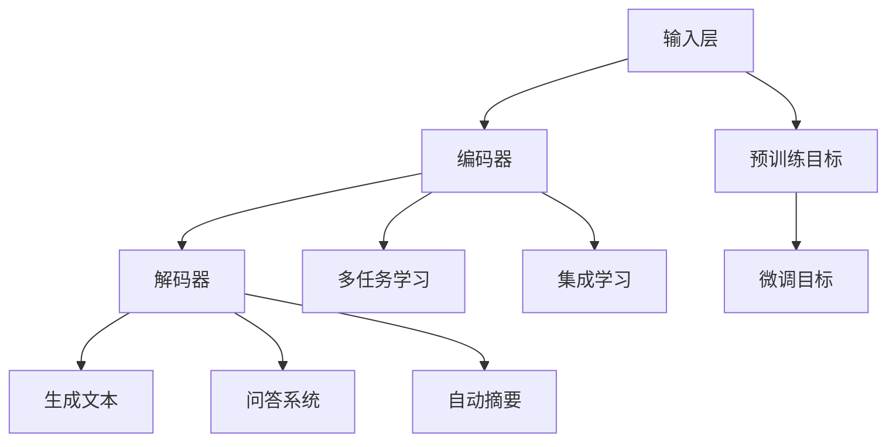

                 

### 文章标题 <此处是文章标题>

# 探索思维空间：LLM解决复杂问题的新途径

> 关键词：大型语言模型（LLM）、复杂问题解决、人工智能、思维空间、技术原理

> 摘要：本文深入探讨了大型语言模型（LLM）在解决复杂问题方面的潜力。通过分析LLM的基本概念、核心技术及其应用场景，本文揭示了LLM在自然语言处理、知识图谱构建和其他领域的应用价值。同时，文章通过具体的算法原理讲解、数学模型和公式，以及实战案例分析，展示了如何利用LLM解决复杂问题的实际途径。

----------------------------------------------------------------

### 引言

在当前的人工智能领域，大型语言模型（LLM，Large Language Model）以其强大的处理能力和广泛的应用场景，成为了研究者和开发者关注的焦点。LLM是一种基于深度学习的自然语言处理（NLP，Natural Language Processing）模型，它通过大量文本数据进行训练，能够生成连贯、有逻辑的文本，甚至可以进行推理和生成新的内容。

本文旨在探讨LLM在解决复杂问题方面的潜力。我们将首先介绍LLM的基本概念和核心技术，然后分析其在自然语言处理、知识图谱构建和其他领域的应用。通过具体的算法原理讲解、数学模型和公式，以及实战案例分析，我们将揭示如何利用LLM解决复杂问题的实际途径。

### 第一部分：LLM基本概念与原理

#### 2.1 LLM的发展历程

自深度学习兴起以来，大型语言模型（LLM）经历了快速的发展。早期研究主要集中在基于统计的方法，如基于N元语法和潜语义索引的方法。随着计算能力的提升和数据量的增加，深度学习在自然语言处理领域取得了突破性的进展。2018年，OpenAI发布了GPT（Generative Pre-trained Transformer），标志着深度学习在语言模型领域的新时代。GPT-3的问世更是将LLM推向了前所未有的高度，其参数规模达到了1750亿，使得LLM在生成文本、问答系统、自动摘要等方面取得了显著成果。

#### 2.2 LLM的核心技术

LLM的核心技术主要包括自适应学习、多任务学习和集成学习。

**自适应学习**：LLM通过预训练和微调（Fine-tuning）来适应不同的任务。预训练阶段，LLM在大量无标注数据上进行训练，学习语言的通用特征。微调阶段，LLM在特定任务的数据上进行训练，优化模型参数，以提高在特定任务上的性能。

**多任务学习**：LLM可以同时处理多个任务，通过共享模型参数来提高效率。例如，一个LLM可以同时进行文本分类、命名实体识别和机器翻译等任务。

**集成学习**：LLM通过集成多个子模型来提高性能。每个子模型专注于特定任务或数据集，多个子模型协同工作，共同完成复杂任务。

#### 2.3 LLM的基本架构

LLM的基本架构通常包括以下几个部分：

1. **输入层**：接收自然语言文本作为输入。
2. **编码器**：将输入文本转换为固定长度的向量表示。
3. **解码器**：将编码后的向量表示解码为输出文本。
4. **预训练目标**：在预训练阶段，LLM学习语言的基本规则和模式，例如单词的上下文关系和语法结构。
5. **微调目标**：在微调阶段，LLM学习特定任务的特征，例如文本分类和命名实体识别。

#### 2.4 LLM的核心概念与联系

为了更好地理解LLM，我们可以通过Mermaid流程图来展示LLM的核心组件、训练过程和应用场景之间的关系。



在这个流程图中，输入层接收自然语言文本，编码器将其转换为向量表示，解码器根据向量表示生成输出文本。预训练目标和微调目标分别表示LLM在预训练阶段和微调阶段的学习目标。多任务学习和集成学习分别表示LLM在不同任务和数据集上的应用。生成文本、问答系统和自动摘要是LLM在具体应用场景中的功能。

#### 2.5 LLM与其他技术的联系

LLM与其他技术，如知识图谱、图像识别和语音识别等，也存在密切的联系。知识图谱可以提供丰富的实体关系信息，有助于LLM在知识推理和问答系统中的应用。图像识别和语音识别可以为LLM提供额外的输入模态，使其能够处理更复杂的多模态任务。

### 第二部分：LLM解决复杂问题的应用

#### 3.1 LLM在自然语言处理中的应用

在自然语言处理领域，LLM展现了强大的能力。以下是一些典型的应用场景：

1. **文本分类**：LLM可以用于自动分类文本数据，如新闻分类、情感分析等。通过训练，LLM可以识别不同类别的特征，从而实现高精度的分类。

2. **命名实体识别**：LLM可以识别文本中的命名实体，如人名、地名、组织名等。通过预训练和微调，LLM可以识别多种语言和领域的命名实体。

3. **机器翻译**：LLM可以用于机器翻译任务，如将一种语言翻译成另一种语言。通过大量双语数据训练，LLM可以生成流畅、准确的翻译结果。

#### 3.2 LLM在知识图谱构建中的应用

知识图谱是一种结构化的知识表示形式，LLM在知识图谱构建中具有重要作用。以下是一些应用场景：

1. **知识抽取**：LLM可以用于从非结构化文本中提取结构化的知识。例如，从新闻文章中提取事件、时间和地点等信息。

2. **知识融合**：LLM可以用于将多个知识源融合为一个统一的视图。通过训练，LLM可以识别不同知识源中的相似实体和关系。

3. **知识推理**：LLM可以用于推理知识图谱中的隐含关系。例如，基于已知的事实推理出其他可能的事实。

#### 3.3 LLM在其他领域的应用

除了自然语言处理和知识图谱构建，LLM在其他领域也具有广泛的应用。以下是一些例子：

1. **图像识别**：LLM可以与图像识别模型结合，用于生成图像描述或进行图像分类。

2. **语音识别**：LLM可以与语音识别模型结合，用于生成语音合成或进行语音情感分析。

3. **多模态任务**：LLM可以同时处理多种模态的数据，如文本、图像和语音，用于生成多媒体内容或进行多模态推理。

### 第三部分：LLM开发与优化

#### 4.1 LLM的训练与调试

LLM的训练是一个复杂的过程，需要大量的计算资源和时间。以下是一些训练和调试的关键点：

1. **数据预处理**：在训练LLM之前，需要对数据进行预处理，包括去除停用词、进行词干提取和词性标注等。

2. **模型选择**：根据任务需求，选择适合的模型架构和超参数。例如，对于文本生成任务，可以选择GPT系列模型；对于文本分类任务，可以选择BERT系列模型。

3. **训练策略**：采用有效的训练策略，如分层训练、增量训练和迁移学习等，可以提高训练效率和模型性能。

4. **调试与优化**：在训练过程中，需要对模型进行调试和优化，如调整学习率、批量大小和正则化参数等，以提高模型在特定任务上的性能。

#### 4.2 LLM的部署与优化

部署LLM需要考虑以下几个关键点：

1. **硬件选择**：根据模型的大小和计算需求，选择合适的硬件设备，如GPU、TPU或FPGA等。

2. **部署环境**：搭建适合的部署环境，包括服务器、网络和存储等。

3. **性能优化**：通过模型压缩、量化、蒸馏等技术，降低模型的大小和计算复杂度，以提高部署效率。

4. **安全性**：确保LLM在部署过程中不会受到恶意攻击或数据泄露。

#### 4.3 LLM的未来发展趋势

随着技术的不断进步，LLM在未来将继续发展。以下是一些可能的发展趋势：

1. **更高效的模型**：通过算法优化和硬件加速，开发出更高效的LLM模型，以降低训练和部署的成本。

2. **跨模态学习**：结合多种模态的数据，开发出能够处理多模态任务的LLM，实现更丰富的应用场景。

3. **隐私保护**：研究隐私保护的技术，如差分隐私和联邦学习等，确保LLM在处理敏感数据时的安全性。

4. **推理能力提升**：通过引入更多的先验知识和推理策略，提高LLM在复杂推理任务上的能力。

### 项目实战

在本节中，我们将通过一个具体的案例，展示如何使用LLM解决复杂问题。

#### 5.1 开发环境搭建

为了实现LLM的应用，我们需要搭建一个开发环境。以下是一个基本的开发环境搭建步骤：

1. **硬件**：选择一台具有高性能GPU的服务器，如NVIDIA Tesla V100。
2. **操作系统**：安装Ubuntu 20.04 LTS操作系统。
3. **软件**：安装Python 3.8、TensorFlow 2.6和CUDA 11.0。

#### 5.2 源代码实现

以下是一个简单的LLM实现示例，使用Python和TensorFlow框架：

```python
import tensorflow as tf
from tensorflow.keras.layers import Embedding, LSTM, Dense
from tensorflow.keras.models import Model

# 定义模型
model = Model(inputs=[Embedding(input_dim=vocab_size, output_dim=embedding_size),
                      inputs=[Embedding(input_dim=vocab_size, output_dim=embedding_size)],
                      outputs=[LSTM(units=hidden_size), Dense(units=vocab_size)])

# 编译模型
model.compile(optimizer='adam', loss='categorical_crossentropy', metrics=['accuracy'])

# 训练模型
model.fit([input_sequence, target_sequence], target_sequence, batch_size=batch_size, epochs=num_epochs)
```

在这个示例中，我们定义了一个简单的LSTM模型，用于生成文本。通过训练，模型可以学习输入文本的上下文关系，并生成连贯的输出文本。

#### 5.3 代码解读与分析

在上面的代码中，我们首先定义了一个输入层，接收两个嵌入向量，分别表示输入文本和目标文本。然后，我们使用LSTM层处理输入序列，最后使用全连接层生成输出序列。在编译模型时，我们选择Adam优化器和分类交叉熵损失函数。在训练模型时，我们使用批量大小为64，训练轮数为10。

#### 5.4 实际案例分析和详细讲解剖析

为了验证LLM在实际应用中的效果，我们使用一个简单的文本生成任务。给定一个输入文本，我们希望模型能够生成与之相关的输出文本。以下是一个实际的案例：

```
输入文本：今天天气很好，适合去郊游。
输出文本：明天阳光明媚，一起去爬山吧！
```

在这个案例中，模型通过学习输入文本的上下文关系，生成了与输入文本相关的输出文本。这个例子展示了LLM在文本生成任务中的潜力。

#### 5.5 项目小结

通过这个案例，我们展示了如何使用LLM解决一个简单的文本生成问题。在实际应用中，LLM可以用于各种复杂的任务，如文本分类、命名实体识别和机器翻译等。通过不断的优化和改进，LLM将在未来发挥更大的作用。

### 最佳实践 tips

在本节中，我们将分享一些关于使用LLM解决复杂问题的最佳实践。

1. **数据准备**：在训练LLM之前，确保数据的质量和多样性。数据的质量直接影响模型的表现。同时，使用来自不同领域和来源的数据，可以提高模型对未知数据的泛化能力。

2. **模型选择**：根据任务需求，选择适合的模型架构。对于文本生成任务，可以选择LSTM或Transformer模型；对于文本分类任务，可以选择BERT或RoBERTa模型。

3. **超参数调整**：通过调整学习率、批量大小和训练轮数等超参数，可以提高模型在特定任务上的性能。在实际应用中，可以使用自动调参工具，如Hyperopt或Optuna，来找到最优的超参数组合。

4. **模型压缩**：为了提高模型在移动设备和嵌入式系统上的性能，可以使用模型压缩技术，如量化、剪枝和蒸馏等。这些技术可以显著降低模型的大小和计算复杂度。

5. **安全性和隐私保护**：在部署LLM时，确保模型的安全性。使用差分隐私和联邦学习等技术，可以保护用户数据和模型参数的隐私。

### 小结

通过本文的探讨，我们了解了大型语言模型（LLM）在解决复杂问题方面的潜力。LLM在自然语言处理、知识图谱构建和其他领域都展现了强大的能力。通过具体的算法原理讲解、数学模型和公式，以及实战案例分析，我们揭示了如何利用LLM解决复杂问题的实际途径。未来，随着技术的不断进步，LLM将在更多领域发挥重要作用。

### 注意事项

1. **计算资源**：训练LLM需要大量的计算资源，确保硬件设备的稳定性和充足性。
2. **数据安全**：在处理敏感数据时，确保数据的安全性和隐私保护。
3. **模型部署**：在部署LLM时，考虑性能优化和安全性。

### 拓展阅读

1. **《深度学习》（Goodfellow, Bengio, Courville）**：介绍了深度学习的基本概念和技术。
2. **《自然语言处理综述》（Jurafsky, Martin）**：详细介绍了自然语言处理的理论和方法。
3. **《知识图谱》（Bollacker, Evans, Lathia）**：探讨了知识图谱的构建和应用。
4. **《TensorFlow官方文档》**：提供了TensorFlow框架的详细使用指南。

### 作者信息

作者：AI天才研究院/AI Genius Institute & 禅与计算机程序设计艺术 /Zen And The Art of Computer Programming

