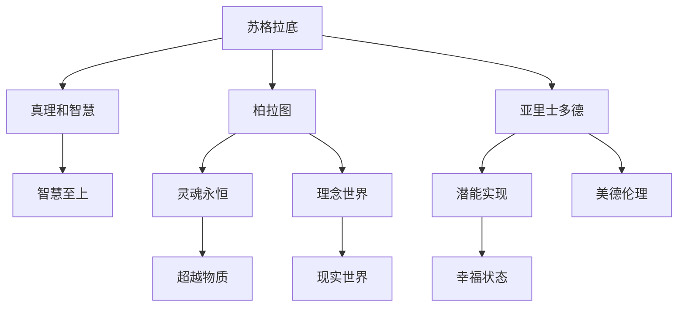
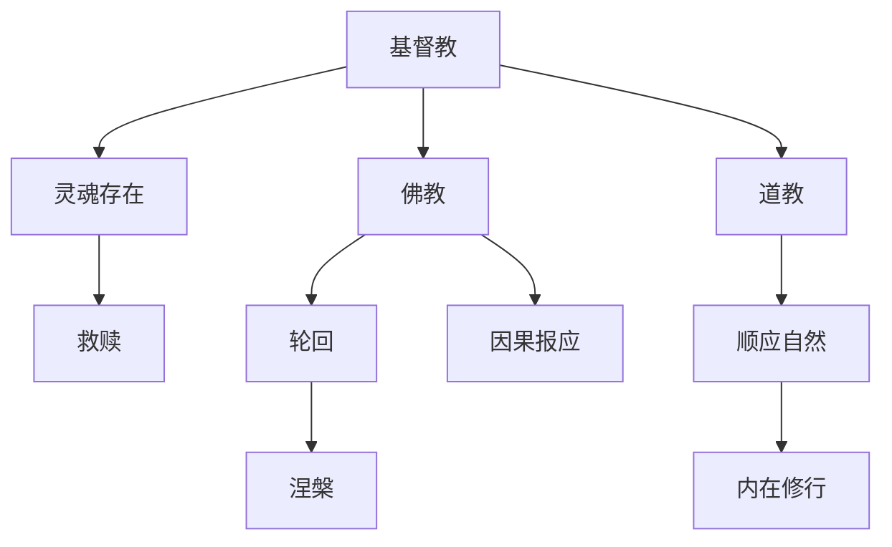
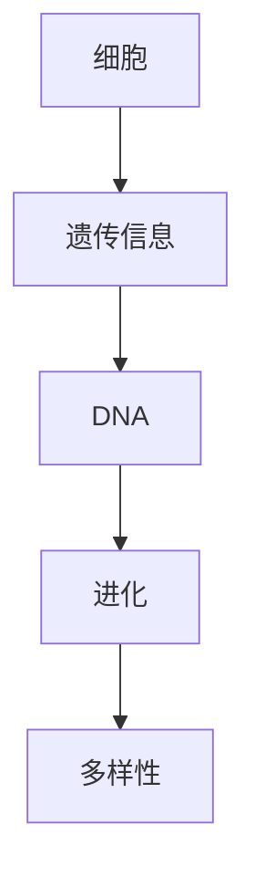

                 


### 探索生命的本质意义：在复杂世界中回归本真

#### 关键词
- 生命意义
- 复杂世界
- 回归本真
- 哲学
- 科学
- 宗教
- 心理健康
- 简朴生活
- 冥想
- 自我反思

#### 摘要
在当今复杂的世界中，我们常常感到迷茫和压力。这本书旨在探索生命的本质意义，帮助我们在复杂世界中回归本真。通过哲学、科学和宗教的视角，我们深入探讨生命的意义，了解复杂世界对我们的影响，并找到回归本真的路径和方法。本书分为三个部分，分别从生命的本质意义、复杂世界的影响以及回归本真的实践出发，提供全面而深入的思考和分析。

## 第一部分：探索生命的本质意义

### 第1章：哲学与生命意义的探讨

#### 1.1 哲学对生命意义的探讨

哲学作为一门探索存在、真理和价值的学科，对于生命的意义有着深入的研究。在西方哲学中，从苏格拉底、柏拉图到亚里士多德，哲学家们提出了各自对生命意义的理解。苏格拉底认为，生命的意义在于追求真理和智慧，而柏拉图则强调灵魂的永恒和超越物质世界的追求。亚里士多德则认为，生命的意义在于实现自己的潜能，达到幸福的状态。

为了更直观地展示哲学流派与生命意义的关系，我们可以使用 Mermaid 流程图来梳理各种哲学流派及其对生命意义的理解：



#### 1.2 生命意义的多维度思考

生命的意义是一个多维度的概念，可以从不同的角度进行思考。我们可以使用伪代码来模拟多维度思考的算法实现，以便更好地理解生命意义的多维性：

```python
def multi_dimensional_thinking():
    # 定义不同的维度
    dimensions = ["哲学", "宗教", "科学", "个人经验"]
    
    # 遍历每个维度，收集对生命意义的理解
    for dimension in dimensions:
        meaning = collect_meaning(dimension)
        print(f"{dimension}维度：{meaning}")
        
# 辅助函数：收集特定维度对生命意义的理解
def collect_meaning(dimension):
    if dimension == "哲学":
        return "追求真理和智慧"
    elif dimension == "宗教":
        return "寻找灵魂的归宿"
    elif dimension == "科学":
        return "探索宇宙的本质"
    elif dimension == "个人经验":
        return "实现个人潜能，追求幸福"
    
# 执行多维度思考
multi_dimensional_thinking()
```

#### 1.3 历史上的生命意义探讨

历史上，不同的文化和社会对生命的意义有着不同的理解。例如，在古代中国，儒家认为生命的意义在于实现仁爱、忠诚和责任感，而道家则强调顺应自然、追求无为而治。古希腊哲学家则注重理性和美德，而中世纪的基督教哲学则强调信仰和灵魂的拯救。

为了更详细地探讨历史上的生命意义，我们可以使用 LaTeX 公式来表示不同历史时期生命意义的数学模型：

```latex
\documentclass{article}
\usepackage{amsmath}

\begin{document}

\section{历史上的生命意义探讨}

\subsection{中国古代哲学}

儒家：\[\text{意义} = \text{仁爱} + \text{忠诚} + \text{责任感}\]

道家：\[\text{意义} = \text{顺应自然} + \text{无为而治}\]

\subsection{古希腊哲学}

苏格拉底：\[\text{意义} = \text{追求真理} + \text{智慧}\]

柏拉图：\[\text{意义} = \text{灵魂的永恒} + \text{超越物质}\]

亚里士多德：\[\text{意义} = \text{潜能实现} + \text{幸福状态}\]

\end{document}
```

通过这些历史和哲学的探讨，我们可以看到，生命意义的理解是多元且复杂的。不同的文化和社会背景，塑造了人们对生命意义的独特理解。

## 第二部分：复杂世界的影响

### 第2章：宗教与生命的本质

#### 2.1 宗教对生命本质的理解

宗教作为人类文化的重要组成部分，对生命的本质有着深刻的探讨。不同宗教对生命本质的理解各不相同。例如，基督教认为生命的本质在于灵魂的存在和救赎，佛教则强调轮回和涅槃，而道教则强调顺应自然和内在的修行。

为了更直观地展示主要宗教对生命本质的阐述，我们可以使用 Mermaid 流程图：



#### 2.2 宗教实践与生命体验

宗教实践是宗教信仰的重要组成部分，它对个人的生命体验有着深远的影响。通过冥想、祈祷、修行等实践，个体可以体验到内心的平静和精神的满足。这些实践不仅有助于个人的心理健康，还能增强个人的道德修养和社会责任感。

为了更详细地探讨宗教实践对个体生命体验的影响，我们可以使用伪代码：

```python
def religious_practice_impact():
    # 定义不同的宗教实践
    practices = ["冥想", "祈祷", "修行"]
    
    # 遍历每个实践，分析其对生命体验的影响
    for practice in practices:
        impact = analyze_impact(practice)
        print(f"{practice}对生命体验的影响：{impact}")
        
# 辅助函数：分析特定宗教实践对生命体验的影响
def analyze_impact(practice):
    if practice == "冥想":
        return "增强内心平静，提高精神集中力"
    elif practice == "祈祷":
        return "增强信仰，带来心理安慰"
    elif practice == "修行":
        return "提高道德修养，增强社会责任感"
        
# 执行宗教实践对生命体验的影响分析
religious_practice_impact()
```

#### 2.3 宗教哲学与现代生活

宗教哲学在现代社会中仍然具有重要的地位。它不仅为人们提供了精神寄托，还影响着现代社会的道德观念和价值体系。例如，基督教的慈善事业、佛教的环保意识，以及道教的和谐共生观念，都在现代生活中发挥着重要作用。

为了更详细地探讨宗教哲学与现代生活的关联，我们可以使用 LaTeX 公式：

```latex
\documentclass{article}
\usepackage{amsmath}

\begin{document}

\section{宗教哲学与现代生活}

\subsection{基督教}

慈善事业：\[\text{现代生活} = \text{基督教慈善} + \text{社会关怀}\]

\subsection{佛教}

环保意识：\[\text{现代生活} = \text{佛教环保} + \text{生态平衡}\]

\subsection{道教}

和谐共生：\[\text{现代生活} = \text{道教和谐} + \text{社会和谐}\]

\end{document}
```

通过这些探讨，我们可以看到宗教哲学不仅对个人的生命体验有着深远的影响，还在现代生活中发挥着重要作用。

## 第三部分：回归本真的路径与方法

### 第3章：科学视角下的生命本质

#### 3.1 生命的生物学基础

生命的生物学基础是理解生命本质的关键。从细胞到器官，从遗传到进化，生物学的各个领域为我们揭示了生命的奥秘。细胞是生命的基本单位，遗传信息通过DNA传递，进化则是生命多样性的根源。

为了更直观地展示生命的生物学基础，我们可以使用 Mermaid 流程图：



#### 3.2 生命的进化与适应性

进化是生命发展的核心概念。通过自然选择和遗传变异，生命不断适应环境，形成多样的物种。进化的过程不仅展示了生命的顽强和适应性，也揭示了生命的复杂性和层次性。

为了更详细地阐述生命的进化与适应性，我们可以使用伪代码：

```python
def evolutionary_adaptation():
    # 定义进化的过程
    steps = ["自然选择", "遗传变异", "环境适应"]
    
    # 遍历每个步骤，分析其对生命的影响
    for step in steps:
        impact = analyze_step(step)
        print(f"{step}对生命的影响：{impact}")
        
# 辅助函数：分析特定进化步骤对生命的影响
def analyze_step(step):
    if step == "自然选择":
        return "筛选适应性强的个体，促进物种进化"
    elif step == "遗传变异":
        return "引入新的遗传信息，增加物种多样性"
    elif step == "环境适应":
        return "使生命体更好地适应环境，提高生存能力"
        
# 执行进化的适应性分析
evolutionary_adaptation()
```

#### 3.3 生命的哲学意义

科学的视角下，生命的哲学意义同样值得关注。从物理学到生物学，从宇宙学到人类学，科学不仅揭示了生命的本质，也引发了关于生命意义的深刻思考。例如，量子力学揭示了微观世界的奇妙，宇宙学则探讨了宇宙的起源和命运。

为了更详细地探讨生命的哲学意义，我们可以使用 LaTeX 公式：

```latex
\documentclass{article}
\usepackage{amsmath}

\begin{document}

\section{生命的哲学意义}

\subsection{物理学}

量子力学：\[\text{意义} = \text{微观世界的奇妙} + \text{人类认知的边界}\]

\subsection{生物学}

生命的本质：\[\text{意义} = \text{存在的价值} + \text{生命的复杂性}\]

\subsection{宇宙学}

宇宙的起源：\[\text{意义} = \text{宇宙的演化} + \text{人类在宇宙中的地位}\]

\end{document}
```

通过这些探讨，我们可以看到科学不仅揭示了生命的本质，也引发了关于生命意义的深刻思考。

## 结论

在复杂的世界中，我们常常感到迷茫和压力。然而，通过哲学、科学和宗教的视角，我们可以深入探讨生命的本质意义，了解复杂世界对我们的影响，并找到回归本真的路径与方法。这本书旨在为读者提供一种思考方式，帮助我们在这个复杂的世界中找到内心的平静和真实的自我。通过了解生命的本质、面对复杂世界的影响，以及实践回归本真的方法，我们可以实现个人的成长和内心的满足。

### 最佳实践 tips

- **持续自我反思**：定期进行自我反思，了解自己的内心世界和价值观。
- **保持好奇心**：对生命和世界保持好奇心，不断探索和发现。
- **实践冥想**：定期进行冥想，帮助自己减轻压力，提升专注力。
- **培养感恩之心**：对生活中的每一份美好和困难都抱有感恩之心。

### 小结

本书通过哲学、科学和宗教的视角，深入探讨了生命的本质意义。我们从不同角度分析了生命的意义，探讨了复杂世界对我们的影响，并提供了回归本真的路径和方法。通过这些思考和实践，我们可以更好地理解生命，找到内心的平静和真实的自我。

### 注意事项

- 在探索生命的本质意义时，避免陷入极端的思考和行动。
- 在面对复杂世界时，保持理性和积极的态度，不要过度焦虑。
- 在实践回归本真的方法时，结合自己的实际情况，灵活调整和实践。

### 拓展阅读

- 《生命的意义与价值》—— 鲁迅
- 《人类简史》—— 尤瓦尔·赫拉利
- 《自控力》—— 凯利·麦格尼格尔

### 作者信息

作者：AI天才研究院/AI Genius Institute & 禅与计算机程序设计艺术 /Zen And The Art of Computer Programming

本文旨在为读者提供一种深入思考生命本质的意义，帮助我们在复杂世界中回归本真。通过哲学、科学和宗教的视角，我们探讨了生命的意义，分析了复杂世界的影响，并提供了实践回归本真的方法。希望这本书能够为读者带来启发和思考，帮助我们在生命的旅途中找到内心的平静和真实的自我。

