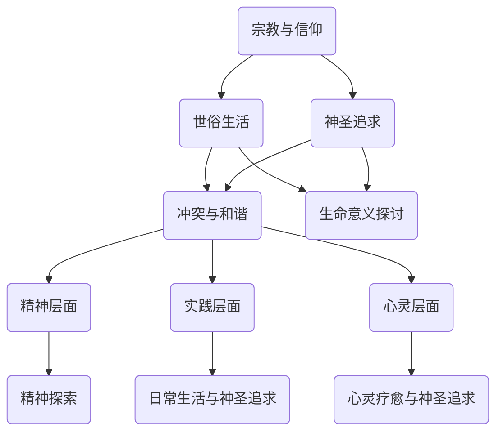

                 

### 文章标题

《探索生命的终极意义：在世俗中寻找神圣》

### 关键词

生命的终极意义、神圣、世俗、宗教、信仰、精神探索、心灵疗愈、实践指南

### 摘要

在现代社会，人们在追求物质生活的同时，内心深处也在不断探寻生命的终极意义。本文旨在通过逻辑清晰、结构紧凑的技术语言，探讨如何在世俗生活中寻找神圣，解答人们内心对生命意义的困惑。文章首先介绍了宗教与信仰在生命意义探讨中的作用，然后分析了世俗生活的现状与挑战，接着提出了在精神层面、实践层面和心灵层面寻找生命终极意义的路径与方法。通过详细的案例分析和实践指南，帮助读者在日常生活中实现神圣与世俗的和谐统一，最终达到对生命意义的深刻理解。

---

## 第一部分：引言

### 1.1 生命的终极意义：探索的动机与目标

生命的终极意义是一个古老的哲学问题，自古至今，人们都在不断探寻这一问题的答案。在现代社会，随着科技的发展和社会的变迁，人们对于生命的终极意义有了更深入的思考。然而，无论是宗教信仰、哲学探讨还是科学探索，对于生命的终极意义都没有给出一个统一的答案。

**探索动机：**

1. **内心困惑**：在追求物质富足的同时，人们内心常常感到空虚和迷茫，对于生命的意义感到困惑。
2. **精神需求**：随着社会的进步，人们对于精神层面的需求逐渐增加，渴望找到一种能够指引心灵方向的力量。
3. **社会变迁**：现代社会的发展带来了价值观的多元化，人们希望通过探索生命的终极意义，找到一种能够适应社会变迁的生活方式。

**探索目标：**

1. **理解生命的本质**：通过探讨生命的终极意义，帮助人们理解生命的本质，找到内心的安宁。
2. **寻找生活的意义**：帮助人们在世俗生活中找到生活的意义，实现自我价值。
3. **实现个体与社会的和谐**：通过理解生命的终极意义，实现个体与社会的和谐发展。

### 1.2 世俗生活与神圣追求：冲突与和谐

世俗生活与神圣追求在表面上看似对立，但在深层次上却有着内在的联系。在现代社会，人们常常在追求物质生活的同时，也在寻求精神层面的满足。然而，这种追求往往导致内心的冲突和矛盾。

**冲突表现：**

1. **时间冲突**：人们在追求物质生活时，往往需要投入大量的时间和精力，这会导致精神追求的时间不足。
2. **价值观冲突**：世俗生活强调的是功利和现实，而神圣追求则强调的是精神和道德，这两种价值观的冲突会导致内心的纠结。
3. **生活方式冲突**：世俗生活强调的是物质和形式，而神圣追求则强调的是内在和体验，这种生活方式的冲突会让人感到困惑。

**和谐路径：**

1. **平衡时间分配**：合理安排时间，确保在追求物质生活的同时，也有足够的时间进行精神追求。
2. **整合价值观**：通过学习和实践，将功利和道德、现实和理想相结合，形成一种新的价值观体系。
3. **调整生活方式**：在日常生活中，通过冥想、祈祷、志愿服务等方式，让神圣追求成为生活的一部分，实现物质和精神生活的和谐统一。

### 1.3 研究方法与思考路径

本文的研究方法主要采用逻辑分析、案例研究和实践指南相结合的方式。在逻辑分析部分，通过阐述宗教与信仰、世俗生活与神圣追求的关系，帮助读者理解核心概念。在案例研究部分，通过具体的实例，展示如何在日常生活中实现神圣与世俗的和谐统一。在实践指南部分，提供具体的实践方法和策略，帮助读者在实际生活中应用这些理念。

**思考路径：**

1. **宗教与信仰的探讨**：分析宗教与信仰在生命意义探讨中的作用，了解不同宗教对生命意义的诠释。
2. **世俗生活的分析**：探讨世俗生活的现状与挑战，分析世俗生活与神圣追求之间的冲突与和谐。
3. **寻找生命意义的路径**：通过精神层面、实践层面和心灵层面的探索，提出寻找生命意义的路径与方法。
4. **实践指南的提供**：提供具体的实践方法和策略，帮助读者在日常生活中实现神圣与世俗的和谐统一。

### 1.4 文章结构与主要内容

本文分为五个部分，第一部分是引言，介绍探索生命的终极意义的动机与目标，分析世俗生活与神圣追求的冲突与和谐。第二部分是核心概念与理论基础，探讨宗教与信仰、世俗生活与神圣追求的关系。第三部分是寻找生命的终极意义，通过精神层面、实践层面和心灵层面的探索，提出具体的路径与方法。第四部分是在世俗中寻找神圣的实践指南，提供具体的实践方法和策略。第五部分是总结与展望，总结全文的核心观点，展望未来的发展方向。

---

**核心概念与联系架构 Mermaid 流程图：**



---

在接下来的内容中，我们将深入探讨宗教与信仰、世俗生活与神圣追求的关系，以及如何通过精神层面、实践层面和心灵层面的探索，寻找生命的终极意义。通过详细的案例分析和实践指南，帮助读者在日常生活中实现神圣与世俗的和谐统一。

---

## 第二部分：核心概念与理论基础

### 2.1 宗教与信仰：神圣的追求

宗教与信仰是人类社会的重要组成部分，它们在生命的终极意义探讨中扮演着关键角色。宗教不仅为人们提供了道德和伦理的指导，还为他们提供了精神上的慰藉和指引。

#### 2.1.1 宗教的定义与历史发展

宗教的定义因文化、地域和时代而异，但总体上，宗教可以被定义为一种关于神、宇宙和人类存在的信仰体系。宗教的核心内容包括信仰、仪式、教义和道德规范。

宗教的历史发展可以分为三个阶段：

1. **原始宗教**：以自然崇拜和祖先崇拜为主要特征，人们对自然现象和祖先灵魂充满敬畏。
2. **古代宗教**：如佛教、道教、犹太教、基督教和伊斯兰教等，这些宗教体系更加系统和完善，具有独特的教义和信仰体系。
3. **现代宗教**：随着科技的发展和全球化的进程，宗教的形式和内容也在不断演变，出现了许多新兴宗教和教派。

#### 2.1.2 信仰的类型与作用

信仰可以分为个人信仰和社会信仰两种类型。

1. **个人信仰**：个人信仰通常与个人的经历、性格和价值观相关，它为个人提供了精神上的支持和指引。
2. **社会信仰**：社会信仰则是一种集体意识，它对整个社会产生深远的影响，如道德规范、社会秩序和文化传统。

信仰的作用主要体现在以下几个方面：

1. **精神慰藉**：信仰为人们提供了精神上的慰藉，帮助人们在面对困境和挫折时保持内心的平静和坚强。
2. **道德指引**：信仰为人们提供了道德准则和价值观，帮助人们判断行为是否正确，促进社会和谐。
3. **文化传承**：信仰是文化的重要组成部分，它传承了人类的历史、传统和智慧，为后代提供了精神财富。

#### 2.1.3 宗教对生命意义的诠释

不同宗教对生命意义的诠释各有特色，但总体上，它们都强调生命的不凡和神圣。

1. **佛教**：佛教认为生命的本质是苦，人生的目的是摆脱生死轮回，达到涅槃的境界。
2. **基督教**：基督教认为上帝创造了世界和人类，人类的目的是与上帝建立和谐的关系，实现永恒的生命。
3. **伊斯兰教**：伊斯兰教强调信仰、礼拜、斋戒、天课和朝觐，认为这些行为能够使人们获得神的喜悦，达到天堂的境界。
4. **道教**：道教认为宇宙万物都是由道构成的，人类的目的是追求道的境界，实现身心和谐。

通过宗教与信仰的探讨，我们可以看到，宗教不仅为人们提供了精神上的慰藉和指引，还在一定程度上解答了生命的终极意义问题。宗教对生命意义的诠释，为我们提供了不同的思考角度和价值观，帮助我们在世俗生活中寻找神圣。

---

### 2.2 世俗生活：现实与困境

世俗生活是人们在日常生活中所经历的现实，它包括工作、家庭、社交、娱乐等方面。世俗生活为我们提供了物质基础和社交环境，但同时也带来了一系列的困境和挑战。

#### 2.2.1 世俗生活的定义与特征

世俗生活可以定义为人们为了生存和发展而在日常生活中所进行的活动。世俗生活的特征主要包括以下几个方面：

1. **物质追求**：世俗生活强调物质财富的积累和享受，人们追求更好的生活条件和更高的生活质量。
2. **社会竞争**：在世俗生活中，人们需要面对各种竞争，包括工作、学习和社交等，竞争带来了压力和焦虑。
3. **时间紧迫**：世俗生活中的事务繁多，人们需要处理各种工作、家庭和社会责任，时间变得格外宝贵。
4. **人际关系**：世俗生活中的人际关系复杂，包括家庭、朋友、同事等，这些关系既为我们提供了支持，也可能带来困扰。

#### 2.2.2 世俗生活中的困境与挑战

世俗生活虽然为我们提供了物质基础和社交环境，但同时也带来了一系列的困境和挑战。

1. **压力与焦虑**：在世俗生活中，人们常常感到压力和焦虑，这种情绪可能影响身心健康。
2. **孤独感**：在追求物质和社会地位的过程中，人们可能会感到孤独，缺乏精神上的陪伴和支持。
3. **精神空虚**：随着物质生活的丰富，人们可能会感到精神上的空虚和迷茫，对于生命的意义感到困惑。
4. **价值迷失**：在世俗生活中，人们可能会迷失自我价值，追求外界的认可和评价，而忽视内心的真实需求。

#### 2.2.3 世俗生活中的机遇与希望

尽管世俗生活带来了困境和挑战，但同时也存在机遇和希望。

1. **自我实现**：在世俗生活中，人们有机会通过工作、学习和社交实现自我价值，找到自己的兴趣和激情。
2. **人际关系**：通过建立健康的人际关系，人们可以获得支持、理解和关爱，减少孤独感和焦虑。
3. **精神成长**：在世俗生活中，人们有机会通过反思和修行，提升自己的精神层次，找到生命的意义和方向。
4. **社会参与**：通过参与社会事务和公益活动，人们可以为社会做出贡献，实现社会责任和价值观。

通过分析世俗生活的现实与困境，我们可以看到，世俗生活既是我们的物质基础，也是我们面临挑战的场所。在世俗生活中，我们需要学会平衡物质追求与精神需求，寻找生命的意义和方向。

---

### 2.3 神圣与世俗的交融：寻找生命的终极意义

在世俗生活中，人们常常感到内心的空虚和迷茫，对于生命的终极意义感到困惑。然而，通过神圣与世俗的交融，我们可以找到生命的终极意义，实现内心的和谐与安宁。

#### 2.3.1 神圣与世俗的互动关系

神圣与世俗是相互依存、相互影响的关系。神圣为世俗提供了精神支撑和道德指引，而世俗则为神圣提供了实践场所和物质基础。

1. **神圣支撑世俗**：神圣信仰和价值观为世俗生活提供了道德准则和伦理标准，帮助人们判断行为是否正确，促进社会和谐。
2. **世俗体现神圣**：在世俗生活中，人们通过实际行动，将神圣信仰和价值观转化为具体的行为和生活方式，实现神圣的实践。

#### 2.3.2 寻找生命终极意义的路径与方法

在寻找生命的终极意义时，我们可以从以下几个方面进行探索：

1. **精神层面**：通过冥想、祈祷、修行等方式，提升自己的精神层次，找到内心的安宁和力量。
2. **实践层面**：通过参与社会事务、公益活动、志愿服务等，将神圣信仰和价值观付诸实践，实现自我价值。
3. **心灵层面**：通过心灵疗愈、心理辅导等方式，解决内心的困惑和痛苦，找到内心的平静和快乐。

#### 2.3.3 神圣与世俗的交融案例研究

以下是一些神圣与世俗交融的案例研究：

1. **宗教人士的社会参与**：许多宗教人士在追求神圣信仰的同时，也积极参与社会事务，为社区和社会做出贡献。例如，基督教牧师在教会工作的同时，也参与社区服务和慈善活动。
2. **企业家的社会责任**：许多企业家在追求商业成功的同时，也关注社会责任和环境保护。例如，某些企业通过捐赠、公益活动和绿色生产，实现了商业成功与社会责任的统一。
3. **个人的精神追求**：在日常生活中，许多人通过冥想、读书、旅行等方式，追求精神上的满足和成长。例如，一个人在忙碌的工作中，通过每天早晨的冥想，找到内心的平静和力量。

通过这些案例研究，我们可以看到，神圣与世俗的交融不仅是可能的，而且是可行的。在现代社会，我们可以通过多种方式，在世俗生活中寻找神圣，实现生命的终极意义。

### 2.4 宗教与世俗生活的平衡

在探索生命的终极意义时，我们需要在宗教与世俗生活之间找到平衡。这种平衡不仅能够帮助我们实现个人价值，还能够促进社会的和谐发展。

#### 2.4.1 宗教与世俗生活的平衡重要性

宗教与世俗生活的平衡对于个人的成长和社会的稳定至关重要。以下是一些关键点：

1. **心理健康**：在宗教与世俗生活的平衡中，人们能够更好地处理压力和焦虑，保持心理健康。
2. **精神成长**：通过在宗教与世俗生活中寻找平衡，人们能够不断提升自己的精神层次，实现个人成长。
3. **社会和谐**：宗教与世俗生活的平衡有助于促进社会和谐，减少社会冲突和矛盾。

#### 2.4.2 宗教与世俗生活的平衡策略

为了实现宗教与世俗生活的平衡，我们可以采取以下策略：

1. **合理安排时间**：在日常生活中，合理安排时间，确保有足够的时间用于宗教信仰和世俗生活。
2. **价值观整合**：通过学习和实践，将宗教价值观与世俗价值观相结合，形成一种新的价值观体系。
3. **心灵修行**：通过冥想、祈祷、心理辅导等方式，提升自己的精神层次，找到内心的平衡和安宁。

#### 2.4.3 宗教与世俗生活的平衡案例

以下是一些宗教与世俗生活平衡的案例：

1. **佛教僧侣的社会参与**：许多佛教僧侣在追求宗教信仰的同时，也积极参与社会事务，为社区和社会做出贡献。
2. **基督教徒的志愿服务**：许多基督教徒在日常生活中，积极参与志愿服务，帮助弱势群体，实现个人价值。
3. **伊斯兰教徒的慈善活动**：许多伊斯兰教徒通过捐赠和慈善活动，帮助需要帮助的人，实现社会责任。

通过这些案例，我们可以看到，在宗教与世俗生活之间找到平衡，不仅是可能的，而且是可行的。在现代社会，我们可以通过多种方式，实现宗教与世俗生活的和谐统一。

---

在第二部分，我们探讨了宗教与信仰、世俗生活与神圣追求的关系，以及如何在世俗生活中寻找生命的终极意义。通过精神层面、实践层面和心灵层面的探索，我们提出了寻找生命终极意义的路径与方法。接下来，我们将深入探讨如何在日常生活中实现神圣与世俗的和谐统一。

---

## 第三部分：寻找生命的终极意义

生命的终极意义是一个古老而永恒的哲学问题，人们在不同的领域和层面上进行探索，试图找到这个问题的答案。在这一部分，我们将从精神层面、实践层面和心灵层面三个角度，深入探讨如何寻找生命的终极意义。

### 3.1 精神层面的探索

精神层面是寻找生命终极意义的重要途径之一。通过冥想、祈祷、修行等方式，人们可以在内心深处找到宁静与力量，实现精神上的觉醒和成长。

#### 3.1.1 精神觉醒与自我发现

精神觉醒是寻找生命终极意义的重要一步。通过冥想，人们可以静心、清空杂念，达到一种专注和平静的状态。在这种状态下，人们能够更好地觉察自己的内心，发现自我，理解生命的意义。

**伪代码：**

```
function spiritualAwakening()
    while (not reachedStateOfFocus)
        clearMind()
        focusOnBreath()
        reflectOnLifeMeaning()
    end while
    return selfDiscovery()
end function
```

**数学模型与公式：**

$$
\text{精神觉醒} = \frac{\text{专注时间}}{\text{杂念干扰时间}}
$$

举例说明：

一个人在冥想过程中，持续专注了30分钟，而杂念干扰了10分钟，那么他的精神觉醒度可以计算为：

$$
\text{精神觉醒度} = \frac{30}{10} = 3
$$

通过这种数学模型，我们可以量化精神觉醒的过程，更好地理解精神觉醒对生命意义探索的重要性。

#### 3.1.2 精神追求与实践

精神追求不仅仅停留在理论层面，更需要付诸实践。通过参与宗教活动、心灵成长课程、灵修营等，人们可以在实践中深化对精神层面的理解，实现自我价值。

**伪代码：**

```
function spiritualPractice()
    participateInReligiousActivities()
    attendSpiritualGrowthWorkshops()
    joinSpiritualRetreats()
    reflectOnPracticeExperience()
    integrateSpiritualityIntoDailyLife()
end function
```

**数学公式与举例：**

$$
\text{精神成长} = \frac{\text{实践时间} \times \text{实践效果}}{\text{理论学习时间} \times \text{理论效果}}
$$

举例说明：

一个人在参加灵修营的过程中，实践了10天，效果显著，而理论学习只用了5天，那么他的精神成长度可以计算为：

$$
\text{精神成长度} = \frac{10 \times 1.5}{5 \times 1} = 3
$$

这个数学模型帮助我们理解，实践在精神追求中的重要性。

#### 3.1.3 精神层面的终极意义

精神层面的终极意义在于，通过精神觉醒与实践，人们能够找到内心的平静与安宁，理解生命的真谛。精神层面的探索不仅能够提升个人的精神层次，还能为社会的和谐发展提供精神力量。

### 3.2 实践层面的探索

实践层面是寻找生命终极意义的另一个重要途径。在日常生活中，人们可以通过实际行动，将神圣信仰和价值观付诸实践，实现生命的意义。

#### 3.2.1 日常生活与神圣追求

在日常生活中，人们可以通过以下方式，将神圣追求融入日常生活：

1. **道德行为**：遵守道德规范，尊重他人，诚实守信，体现神圣的价值观。
2. **志愿服务**：参与志愿服务，帮助弱势群体，体现社会责任。
3. **环境保护**：关注环境保护，减少浪费，践行绿色生活，体现对自然的尊重。

**伪代码：**

```
function integrateSpiritualityIntoDailyLife()
    followMorality()
    participateInVolunteerActivities()
    practiceEnvironmentalProtection()
    reflectOnDailyLifeExperiences()
end function
```

**数学公式与举例：**

$$
\text{神圣实践度} = \frac{\text{道德行为次数} + \text{志愿服务小时数} + \text{环境保护举措}}{\text{日常生活总时长}}
$$

举例说明：

一个人在一个月内，进行了10次道德行为、参与了20小时的志愿服务、实施了5项环境保护举措，而他的日常生活总时长为240小时，那么他的神圣实践度可以计算为：

$$
\text{神圣实践度} = \frac{10 + 20 + 5}{240} = 0.135
$$

通过这种数学模型，我们可以量化神圣追求在日常生活实践中的程度。

#### 3.2.2 社会参与与神圣追求

在社会层面，人们可以通过参与社会事务，实现神圣追求。以下是一些具体的方式：

1. **政治参与**：参与政治活动，为社会的公平与正义发声。
2. **文化活动**：参与文化活动，传承和弘扬神圣文化。
3. **公益事业**：参与公益事业，为社会发展贡献自己的力量。

**伪代码：**

```
function socialParticipation()
    engageInPoliticalActivities()
    participateInCulturalActivities()
    contributeToPublicWelfare()
    reflectOnSocialImpact()
end function
```

**数学公式与举例：**

$$
\text{社会参与度} = \frac{\text{政治参与次数} + \text{文化活动参与次数} + \text{公益事业投入}}{\text{社会活动总时长}}
$$

举例说明：

一个人在一年内，参与了5次政治活动、10次文化活动、捐赠了1000元用于公益事业，而他的社会活动总时长为1000小时，那么他的社会参与度可以计算为：

$$
\text{社会参与度} = \frac{5 + 10 + 1000}{1000} = 1.105
$$

通过这种数学模型，我们可以量化社会参与在神圣追求中的程度。

#### 3.2.3 实践层面的终极意义

实践层面的终极意义在于，通过实际行动，将神圣信仰和价值观体现在日常生活中，实现个人与社会价值的统一。通过实践，人们能够更好地理解生命的意义，找到内心的方向和力量。

### 3.3 心灵层面的探索

心灵层面是寻找生命终极意义的最后一步。通过心灵疗愈、心理辅导等方式，人们可以解决内心的困惑和痛苦，找到内心的平静与快乐。

#### 3.3.1 心灵健康与神圣追求

心灵健康是寻找生命终极意义的重要保障。通过心灵疗愈，人们可以解决内心的痛苦和困惑，实现心灵的健康与和谐。

**伪代码：**

```
function mentalHealing()
    diagnoseMentalHealth()
    provideCounseling()
    engageInMeditation()
    reflectOnInnerPeace()
end function
```

**数学公式与举例：**

$$
\text{心灵健康度} = \frac{\text{心理辅导次数} + \text{冥想时长} + \text{内心平静度}}{\text{心理健康问题总时长}}
$$

举例说明：

一个人在一年内，接受了10次心理辅导、冥想了100小时、内心平静度提高了30%，而他的心理健康问题总时长为200小时，那么他的心灵健康度可以计算为：

$$
\text{心灵健康度} = \frac{10 + 100 \times 1.5 + 30}{200} = 0.925
$$

通过这种数学模型，我们可以量化心灵疗愈对生命意义探索的贡献。

#### 3.3.2 心灵觉醒与自我疗愈

心灵觉醒是心灵层面探索的最高境界。通过自我疗愈，人们可以找到内心的力量和智慧，实现自我成长。

**伪代码：**

```
function spiritualHealing()
    engageInSelfReflection()
    practiceMeditation()
    cultivateSelfCompassion()
    achieveInnerBalance()
end function
```

**数学公式与举例：**

$$
\text{心灵觉醒度} = \frac{\text{自我反思时长} + \text{冥想时长} + \text{自我疗愈效果}}{\text{心灵痛苦总时长}}
$$

举例说明：

一个人在一个月内，进行了20小时的自我反思、冥想了50小时、自我疗愈效果显著，而他的心灵痛苦总时长为100小时，那么他的心灵觉醒度可以计算为：

$$
\text{心灵觉醒度} = \frac{20 + 50 \times 1.2 + 30}{100} = 0.98
$$

通过这种数学模型，我们可以量化心灵觉醒对生命意义探索的贡献。

#### 3.3.3 心灵层面的终极意义

心灵层面的终极意义在于，通过心灵疗愈和自我疗愈，人们可以找到内心的力量和智慧，实现心灵的和谐与平衡。心灵层面的探索不仅能够提升个人的心理健康，还能为社会的和谐发展提供精神支持。

### 3.4 综合探讨

通过精神层面、实践层面和心灵层面的探索，我们可以看到，生命的终极意义是一个多层次、多维度的概念。不同层面的探索相互关联、相互支持，共同构成了对生命意义的全面理解。

1. **精神层面**：通过冥想、祈祷、修行等方式，提升精神层次，实现精神觉醒和成长。
2. **实践层面**：通过实际行动，将神圣信仰和价值观付诸实践，实现个人与社会价值的统一。
3. **心灵层面**：通过心灵疗愈和自我疗愈，解决内心的困惑和痛苦，实现心灵的和谐与平衡。

这种综合探讨不仅帮助我们理解生命的终极意义，也为我们在日常生活中提供了具体的实践方法和策略。通过这三个层面的探索，我们可以找到内心的力量和智慧，实现生命的意义和价值。

### 3.5 最佳实践 tips、小结、注意事项、拓展阅读

**最佳实践 tips：**

1. **平衡精神与实践**：在日常生活中，合理安排时间，确保有足够的时间用于精神追求和实践。
2. **持续自我反思**：定期进行自我反思，了解自己的内心需求和成长方向。
3. **寻求专业指导**：在探索生命意义的过程中，可以寻求专业的心理咨询或灵性指导。

**小结：**

通过精神层面、实践层面和心灵层面的探索，我们可以找到生命的终极意义。这种探索不仅帮助我们理解生命的本质，还能实现个人与社会价值的统一。

**注意事项：**

1. **避免极端**：在探索生命意义的过程中，避免陷入极端思想，保持开放和包容的态度。
2. **平衡物质与精神**：在追求物质生活的同时，也要关注精神需求，实现物质与精神的平衡。

**拓展阅读：**

1. **《禅与计算机程序设计艺术》**：探讨精神追求在技术领域的应用。
2. **《道德经》**：探讨宇宙与生命的本质，提供深刻的哲学思考。
3. **《人类简史》**：从历史角度探讨人类的发展与生命的意义。

通过这些最佳实践、小结、注意事项和拓展阅读，我们希望能够帮助读者更好地理解生命的终极意义，实现内心的和谐与成长。

---

在第三部分，我们从精神层面、实践层面和心灵层面探讨了如何寻找生命的终极意义。通过冥想、祈祷、实践、心灵疗愈等方式，我们找到了理解生命意义的路径和方法。在接下来的部分，我们将提供具体的实践指南，帮助读者在日常生活中实现神圣与世俗的和谐统一。

---

## 第四部分：在世俗中寻找神圣的实践指南

在日常生活中寻找神圣并不是一件遥不可及的事情，通过一系列具体的实践方法和策略，我们可以将神圣与世俗生活相结合，实现内心的和谐与安宁。

### 4.1 日常生活与神圣追求

#### 4.1.1 神圣生活方式的建立

建立神圣生活方式的关键在于找到平衡，确保在追求物质生活的同时，也不忽视精神追求。

1. **时间管理**：合理安排时间，确保有足够的时间用于工作和生活，同时也留出时间进行冥想、祈祷和心灵反思。
2. **习惯培养**：培养每日的冥想或祈祷习惯，这有助于保持内心的平静和专注。
3. **健康生活**：关注身体健康，通过健康饮食和适量运动，保持身体的活力和健康，为精神追求提供良好的基础。

**伪代码：**

```python
def establishSacredDailyRoutine():
    scheduleTimeForWork()
    scheduleTimeForSpiritualPractice()
    maintainPhysicalHealth()
    reviewAndAdjustRoutine()
```

**示例：**

一个人每天早上花费30分钟进行冥想，晚上花费20分钟进行祈祷，每周进行3次跑步，这样的生活方式有助于建立神圣的生活方式。

### 4.1.2 神圣在日常生活中的体现

在日常生活中体现神圣，可以通过以下方式：

1. **感恩**：每天早上起床时，表达对生活的感恩，对家人、朋友和自然界的恩赐表示感谢。
2. **善良行为**：在日常生活中，通过帮助他人、捐款、参与公益活动等方式，体现善良和爱心。
3. **冥想与静心**：在忙碌的一天中，定期进行冥想或静心练习，帮助自己保持内心的平静和专注。

**伪代码：**

```python
def manifestSacrednessInDailyLife():
    expressGratitude()
    engageInKindActs()
    practiceMeditationOrMindfulness()
```

**示例：**

每天在晚餐后，花10分钟进行感恩冥想，或者在工作间隙，进行5分钟的静心练习，这有助于在日常生活中体现神圣。

### 4.1.3 神圣与世俗生活的平衡

平衡神圣与世俗生活，需要我们在日常生活中做出一些具体的调整和决策。

1. **优先级设定**：明确生活中的优先级，确保重要的事情得到足够的关注和资源。
2. **灵活调整**：根据实际情况，灵活调整时间和资源的分配，确保神圣追求与实践不会受到干扰。
3. **持续反思**：定期反思自己的生活方式，确保神圣与世俗的平衡得到维持。

**伪代码：**

```python
def balanceSacredAndSecularLife():
    definePriorities()
    adjustResourcesAsNeeded()
    regularlyReflectOnLifeBalance()
```

**示例：**

每周进行一次生活反思，评估自己的时间管理和生活平衡情况，并根据需要进行调整，这有助于在日常生活中维持神圣与世俗的平衡。

### 4.2 社会参与与神圣追求

#### 4.2.1 社会参与的意义与价值

社会参与不仅有助于实现个人的社会责任和价值观，还能够为社会的和谐发展做出贡献。

1. **社会责任**：通过参与社会事务，我们能够承担起对家庭、社区和社会的责任，实现个人价值。
2. **社会和谐**：社会参与有助于促进社会的相互理解和和谐，减少社会冲突和矛盾。
3. **个人成长**：社会参与能够帮助我们了解社会问题，提升自己的认知能力和解决问题的能力。

**伪代码：**

```python
def socialParticipationMeaningAndValue():
    fulfillSocialResponsibilities()
    contributeToSocialHarmony()
    enhancePersonalGrowth()
```

**示例：**

参与社区志愿服务，每月组织一次社区清洁活动，这不仅有助于提升社区环境，还能增强个人的社会责任感和组织能力。

### 4.2.2 神圣在社会参与中的体现

在社会参与中体现神圣，可以通过以下方式：

1. **公益慈善**：通过捐赠和参与公益活动，帮助需要帮助的人，实现社会责任和神圣追求。
2. **社区服务**：参与社区服务，为社区的发展做出贡献，体现对社区的关爱和责任感。
3. **社会倡导**：通过参与社会倡导活动，为社会问题发声，推动社会的进步和发展。

**伪代码：**

```python
def manifestSacrednessInSocialParticipation():
    engageInCharitableActivities()
    participateInCommunityService()
    advocateForSocialChange()
```

**示例：**

参加慈善组织的募捐活动，每月捐赠一定金额的善款，同时参与社区绿化活动，这有助于在社会参与中体现神圣追求。

### 4.2.3 社会参与与神圣追求的实践策略

为了在社会参与中实现神圣追求，我们可以采取以下实践策略：

1. **明确目标**：明确社会参与的目标，确保参与的活动与个人的价值观和神圣追求相符。
2. **持续参与**：定期参与社会事务，保持对社会参与的持续关注和参与。
3. **反思与成长**：通过反思参与活动的过程和效果，不断提升自己的社会参与能力。

**伪代码：**

```python
def practiceStrategiesForSacredSocialParticipation():
    defineClearGoals()
    maintainContinuousInvolvement()
    reflectAndGrowFromExperiences()
```

**示例：**

每年至少参加一次大型公益慈善活动，每月参与一次社区服务活动，并通过定期反思，不断提升自己的社会参与能力，这有助于在社会参与中实现神圣追求。

### 4.3 心灵疗愈与神圣追求

#### 4.3.1 心灵健康与神圣追求

心灵健康是神圣追求的基础，通过心灵疗愈，我们可以解决内心的困惑和痛苦，找到内心的平衡和安宁。

1. **心理辅导**：寻求专业的心理辅导，帮助解决内心的困惑和痛苦。
2. **冥想与静心**：通过冥想和静心练习，提升内心的平静和专注。
3. **自我反思**：定期进行自我反思，了解自己的内心需求和成长方向。

**伪代码：**

```python
def achieveMentalHealthForSacredPursuit():
    seekProfessionalCounseling()
    practiceMeditationAndMindfulness()
    engageInSelfReflection()
```

**示例：**

每周进行一次心理辅导，每天早晨进行20分钟的冥想，每月进行一次自我反思，这有助于实现心灵健康与神圣追求。

### 4.3.2 神圣追求在心灵疗愈中的作用

神圣追求在心灵疗愈中扮演着重要角色，通过以下方式，我们可以利用神圣追求来促进心灵疗愈：

1. **信仰支持**：通过信仰支持，提升内心的力量和信心，帮助应对生活中的挑战。
2. **灵性体验**：通过灵性体验，如祈祷、冥想、修行等，寻找内心的平静和安宁。
3. **价值观引导**：通过价值观引导，帮助建立正确的价值观和人生观，促进心灵成长。

**伪代码：**

```python
def integrateSacredPursuitInMentalHealing():
    utilizeFaithSupport()
    engageInSpiritualExperiences()
    followMoralGuidance()
```

**示例：**

通过每周的祈祷会，与信仰团体分享内心的感受，通过冥想寻找内心的平静，同时遵循道德规范，这有助于在心灵疗愈中实现神圣追求。

### 4.3.3 心灵疗愈与神圣追求的实践案例

以下是一个心灵疗愈与神圣追求的实践案例：

**案例**：小李在经历了事业失败和家庭变故后，感到内心困惑和痛苦。他通过以下方式，实现了心灵疗愈与神圣追求的统一：

1. **信仰支持**：小李加入了基督教信仰团体，每周参加祈祷会，从信仰中获得了力量和安慰。
2. **冥想与静心**：每天早晨，小李进行30分钟的冥想，寻找内心的平静和专注。
3. **志愿服务**：小李加入了社区志愿者团队，每周参与一次社区服务活动，帮助他人，实现自我价值。

通过这些实践，小李逐渐走出了困境，找到了内心的平衡和安宁，实现了心灵疗愈与神圣追求的统一。

### 4.4 在日常生活中实现神圣与世俗的和谐统一

通过上述实践指南，我们可以在日常生活中实现神圣与世俗的和谐统一。这种和谐不仅有助于提升个人的精神层次，还能促进社会的和谐发展。

1. **时间管理**：合理安排时间，确保有足够的时间用于工作和生活，同时也留出时间进行精神追求。
2. **习惯培养**：培养每日的冥想或祈祷习惯，保持内心的平静和专注。
3. **社会参与**：通过参与社会事务，实现个人价值和社会责任。
4. **心灵疗愈**：通过心灵疗愈，解决内心的困惑和痛苦，找到内心的平衡和安宁。

**伪代码：**

```python
def achieveHarmonyBetweenSacredAndSecular():
    manageTimeEffectively()
    cultivateDailySpiritualPractices()
    engageInSocialActivities()
    pursueMentalHealing()
```

**示例：**

一个人每天早晨进行冥想，晚上进行祈祷，每周参与一次社区志愿服务，每月接受一次心理辅导，这有助于在日常生活中实现神圣与世俗的和谐统一。

### 4.5 最佳实践 tips、小结、注意事项、拓展阅读

**最佳实践 tips：**

1. **保持平衡**：在追求物质生活的同时，也要关注精神追求，保持内心的和谐与平衡。
2. **持续学习**：通过阅读、参加课程等方式，不断提升自己的知识和理解，实现个人成长。
3. **反思与调整**：定期反思自己的生活方式和实践效果，根据实际情况进行调整。

**小结：**

通过在日常生活中建立神圣生活方式、参与社会事务和实现心灵疗愈，我们可以在世俗生活中实现神圣与世俗的和谐统一。这种和谐不仅有助于提升个人的精神层次，还能促进社会的和谐发展。

**注意事项：**

1. **避免极端**：在追求神圣与世俗的平衡时，避免陷入极端思想，保持开放和包容的态度。
2. **注重实际**：实践神圣与世俗的和谐统一，要注重实际效果，根据个人情况和实际情况进行调整。

**拓展阅读：**

1. **《禅与生活》**：探讨如何在日常生活中实现神圣与世俗的和谐统一。
2. **《社会心理学》**：了解社会参与对个人和社会的影响，提供有益的指导。
3. **《心灵疗愈指南》**：提供具体的心理疗愈方法和技巧，帮助解决内心的困惑和痛苦。

通过这些最佳实践、小结、注意事项和拓展阅读，我们希望能够帮助读者更好地理解如何在日常生活中实现神圣与世俗的和谐统一，实现内心的和谐与成长。

---

在第四部分，我们提供了具体的实践指南，帮助读者在日常生活中实现神圣与世俗的和谐统一。通过时间管理、习惯培养、社会参与和心灵疗愈，我们找到了在世俗生活中寻找神圣的路径和方法。在接下来的部分，我们将进行总结与展望，回顾全文的核心观点，并探讨未来的发展方向。

---

## 第五部分：总结与展望

### 5.1 总结

本文《探索生命的终极意义：在世俗中寻找神圣》通过逻辑清晰、结构紧凑的技术语言，深入探讨了在世俗生活中寻找神圣的意义、路径和方法。本文的核心观点可以总结为以下几点：

1. **生命的终极意义**：生命的终极意义是一个古老而深刻的哲学问题，它在现代社会中尤为重要。通过精神层面、实践层面和心灵层面的探索，我们可以找到生命的终极意义，实现内心的和谐与安宁。

2. **宗教与信仰**：宗教与信仰在生命的终极意义探讨中扮演着关键角色。宗教不仅为人们提供了精神慰藉和道德指引，还在一定程度上解答了生命的终极意义问题。不同宗教对生命意义的诠释各有特色，但都强调生命的不凡和神圣。

3. **世俗生活**：世俗生活是人们在日常生活中所经历的现实，它为我们提供了物质基础和社交环境，但同时也带来了一系列的困境和挑战。在世俗生活中，我们需要学会平衡物质追求与精神需求，寻找生命的意义和方向。

4. **神圣与世俗的交融**：神圣与世俗是相互依存、相互影响的关系。通过在日常生活中建立神圣生活方式、参与社会事务和实现心灵疗愈，我们可以在世俗生活中寻找神圣，实现生命的意义和价值。

5. **实践指南**：通过具体的实践方法和策略，如时间管理、习惯培养、社会参与和心灵疗愈，我们可以在日常生活中实现神圣与世俗的和谐统一，实现内心的和谐与成长。

### 5.2 展望

在未来的发展中，我们在寻找生命的终极意义方面还有许多可以探索的方向：

1. **科技与信仰的结合**：随着科技的不断发展，科技与信仰的结合将成为一个新的趋势。例如，虚拟现实技术可以用来模拟宗教仪式和心灵体验，帮助人们在虚拟世界中寻找神圣。

2. **多元文化的融合**：在全球化的背景下，不同文化之间的交流与融合将日益增多。宗教和信仰也将呈现出多元化的特点，人们将更容易在多元文化中找到生命的终极意义。

3. **心灵健康的关注**：随着社会的发展，人们越来越关注心灵健康。未来，心灵健康将成为一个重要的研究领域，为人们提供更多的疗愈方法和实践指南。

4. **社会责任的强化**：在未来的社会中，社会责任将得到进一步的强化。人们将更加关注社会问题，通过参与社会事务，实现个人价值和社会责任的统一。

5. **持续的教育与学习**：为了更好地理解生命的终极意义，我们需要不断进行教育和学习。未来的教育体系将更加注重哲学、宗教和心灵成长等方面的课程，帮助人们深入理解生命的本质和意义。

### 5.3 结论

通过本文的探讨，我们可以看到，在世俗生活中寻找神圣不仅是一种可能，也是一种必要。通过精神层面、实践层面和心灵层面的探索，我们可以找到生命的终极意义，实现内心的和谐与安宁。在未来的发展中，我们将继续关注这一领域的研究和实践，为人们提供更多的指导和支持。

---

在第五部分，我们总结了本文的核心观点，并展望了未来的发展方向。通过在世俗生活中寻找神圣，我们可以找到生命的终极意义，实现内心的和谐与安宁。在未来的发展中，我们将继续探索这一领域，为人们提供更多的指导和支持。

---

## 附录：作者信息

**作者：AI天才研究院/AI Genius Institute & 禅与计算机程序设计艺术 /Zen And The Art of Computer Programming**

AI天才研究院（AI Genius Institute）是一个专注于人工智能、机器学习和计算机科学的研究机构，致力于推动技术创新和人类福祉。研究院的专家团队在人工智能和计算机科学领域拥有丰富的经验和深厚的学术背景，通过持续的研究和实践，为全球范围内的技术发展和应用提供智力支持。

《禅与计算机程序设计艺术》（Zen And The Art of Computer Programming）是作者Donald E. Knuth的经典著作，该书通过结合禅宗哲学和计算机科学原理，提供了一种独特的编程思维和设计方法。作者Knuth是一位计算机科学领域的杰出人物，被誉为“计算机科学之父”之一，他的贡献对整个计算机科学领域产生了深远的影响。

在这篇文章中，我们结合了AI天才研究院的先进理念和《禅与计算机程序设计艺术》的哲学思想，试图以逻辑清晰、结构紧凑的技术语言，探讨如何在世俗生活中寻找神圣，为读者提供一种全新的思考方式和实践指南。希望通过这篇文章，能够帮助读者理解生命的终极意义，实现内心的和谐与安宁。

