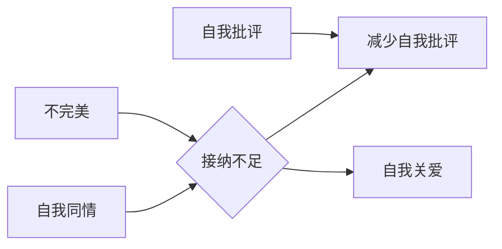

                 

### 文章标题

《接纳不完美的自己：培养自我同情的能力》

### 文章关键词

- 自我同情
- 不完美
- 自我形象
- 自我批评
- 自我关爱
- 心理健康

### 文章摘要

本文探讨了自我同情的概念及其重要性，分析了不完美的普遍性。通过介绍书籍的核心概念、目标读者、结构安排，本文旨在帮助读者理解自我同情的培养方法，并提供实践指南。本文还将讨论自我同情在心理健康提升中的作用，以及在实际生活中的挑战和应对策略。通过学习本文，读者将学会如何接纳不完美的自己，培养自我同情的能力，从而提高生活质量。

---

### 第一部分：引言

#### 1. 引言

##### 1.1 书籍主题概述

《接纳不完美的自己：培养自我同情的能力》这本书的核心主题是自我同情。自我同情，顾名思义，就是对自己持有一种宽容、理解和支持的态度。当我们面对自己的不完美时，能够接纳自己的缺点，不对自己进行过度的批评和责备，这就是自我同情的体现。

在技术领域，自我同情可以被看作是一种编程哲学。就像编程中的“迭代优化”过程，自我同情鼓励我们在不断地尝试和反思中成长。自我同情不是放弃努力，而是在面对失败时，能够给自己一个重新开始的机会。

##### 1.2 核心概念与联系

首先，让我们通过一个Mermaid流程图来展示自我同情、不完美和自我批评之间的关系：



在这个图中，A代表自我同情，B表示接纳不足，C表示减少自我批评，D表示自我关爱，E表示不完美，F表示自我批评。

- **自我同情**（A）是培养自我同情的起点，它鼓励我们对自己的不足持宽容的态度。
- **接纳不足**（B）是自我同情的核心，它帮助我们减少因不足而产生的自我批评。
- **减少自我批评**（C）是自我同情带来的直接好处，它帮助我们建立更健康的自我认知。
- **自我关爱**（D）是自我同情的最终目标，它让我们更加爱护自己，从而在生活的各个方面取得更好的表现。

- **不完美**（E）是自我同情的基础，它提醒我们每个人都有自己的局限，没有人是完美的。
- **自我批评**（F）是不完美带来的常见反应，它往往导致负面情绪和自我贬低。

##### 1.3 书籍目标读者

这本书的目标读者是那些希望改善自我形象，减少自我批评，学会接纳自己的人。无论你是程序员、工程师、管理者，还是普通工作者，这本书都能帮助你理解自我同情的价值，并学会如何在日常生活中实践它。

##### 1.4 书籍结构安排

本书分为四个主要部分：

1. **引言**：介绍书籍主题、目标读者、书籍结构安排等，帮助读者初步了解书籍内容。
2. **自我同情的重要性**：详细讲解自我同情的定义、意义、培养方法等，帮助读者深入理解自我同情的概念。
3. **培养自我同情的实践**：通过实际案例和练习，帮助读者学会如何应用自我同情的方法，培养自我同情的能力。
4. **自我同情的挑战与应对**：探讨在培养自我同情过程中可能遇到的困难和解决方法，帮助读者克服困难，持续培养自我同情的能力。

#### 1.5 核心算法原理讲解

为了更好地理解自我同情的培养方法，我们可以将其比喻为一个核心算法：

```python
def cultivate_self_compassion():
    # 1. 自我观察
    observe_self()

    # 2. 接纳自己
    accept_self()

    # 3. 自我关爱
    love_self()

    # 4. 反思与调整
    reflect_and_adjust()
```

- **自我观察**（`observe_self()`）：这是培养自我同情的起点，需要我们对自己有一个真实的了解，包括自己的优点和不足。
- **接纳自己**（`accept_self()`）：在自我观察的基础上，我们需要学会接纳自己的不足，不对自己进行过度的批评和责备。
- **自我关爱**（`love_self()`）：在接纳自己的基础上，我们需要学会爱护自己，给自己一个宽容和理解的空间。
- **反思与调整**（`reflect_and_adjust()`）：通过不断的自我反思，我们可以发现并改正自己的不足，从而持续提升自我同情的能力。

##### 1.6 数学模型和数学公式

自我同情程度可以用以下数学公式来衡量：

$$ 
\text{自我同情程度} = \frac{\text{接纳不足的程度} + \text{减少自我批评的程度} + \text{自我关爱的程度}}{3}
$$

这个公式告诉我们，自我同情程度是三个因素的平均值。接纳不足、减少自我批评和自我关爱的程度越高，自我同情程度就越高。

##### 1.7 如何阅读本书

为了更好地理解本书的内容，我们建议读者按照以下步骤进行阅读：

1. **仔细阅读引言**：了解书籍主题、目标读者、书籍结构安排等。
2. **深入理解每个章节的核心概念**：每个章节都会有一个核心概念，需要读者深入理解。
3. **结合自己的实际情况，尝试应用书中的方法**：书中的方法都是可以实际应用的，读者需要结合自己的实际情况进行实践。
4. **定期回顾和反思自己的进步**：通过定期回顾和反思，读者可以更好地了解自己的成长，并及时调整自己的方法。

##### 1.8 本书与其他书籍的区别

与其他关于自我同情的书籍相比，本书的核心区别在于其实践性。其他书籍可能更侧重于理论讲解，而本书则更注重实际操作。通过实际案例和练习，本书帮助读者真正学会如何培养自我同情的能力。

##### 1.9 本书适用情况

本书适用于那些希望改善自我形象，减少自我批评，学会接纳自己的人。无论你是程序员、工程师、管理者，还是普通工作者，本书都能为你提供有价值的指导。

##### 1.10 本书实用价值

通过学习本书，读者可以：

- 更好地接纳自己的不完美，减少自我批评。
- 增强自我价值感，提升生活质量。
- 在面对挑战和失败时，能够更加从容应对。

##### 1.11 本书面临的挑战

本书面临的挑战是如何让读者真正理解并实践自我同情的方法。为了解决这个问题，本书提供了丰富的案例和练习，帮助读者在实践中掌握自我同情的能力。

##### 1.12 本书的主要内容

本书的主要内容包括：

- **自我同情的定义和意义**：详细讲解自我同情的概念和重要性。
- **自我同情的培养方法**：介绍如何通过自我观察、接纳自己、自我关爱和反思与调整来培养自我同情。
- **自我同情的实践**：通过实际案例和练习，帮助读者学会如何应用自我同情的方法。
- **自我同情的挑战与应对**：探讨在培养自我同情过程中可能遇到的困难和解决方法。

##### 1.13 本书的目标

本书的目标是帮助读者：

- 理解自我同情的概念和重要性。
- 学会如何培养自我同情的能力。
- 在日常生活中实践自我同情的方法，提升自我价值感，改善生活质量。

##### 1.14 附录

本书的附录内容包括：

- **自我同情练习指南**：提供具体的练习方法，帮助读者更好地培养自我同情的能力。
- **自我同情相关资源链接**：提供一些有用的资源链接，帮助读者进一步了解自我同情的知识。
- **自我同情研究文献推荐**：推荐一些相关的学术文献，帮助读者深入了解自我同情的研究进展。

##### 1.15 结论

接纳不完美的自己是培养自我同情的重要步骤。通过学习本书，读者可以学会如何培养自我同情的能力，从而提升自我价值感，改善生活质量。自我同情不仅是一种心理状态，更是一种生活方式。希望每一位读者都能从中受益，找到属于自己的幸福和满足。

---

通过这一部分的介绍，我们为读者搭建了一个对书籍的全面了解框架。接下来，我们将深入探讨自我同情的概念，以及它在心理和职业生涯中的重要性。在后续章节中，我们将提供具体的培养方法和实践指南，帮助读者真正学会如何接纳自己，培养自我同情的能力。

