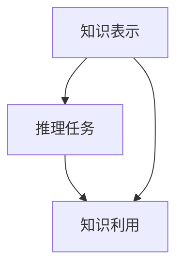
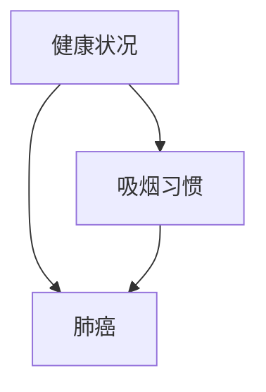

                 


### 文章标题

《推理任务中的知识表示与利用》

### 关键词

推理任务、知识表示、利用、人工智能、算法、数学模型

### 摘要

本文从人工智能和推理任务的角度出发，探讨了知识表示与利用在推理任务中的关键作用。文章首先介绍了推理任务的基本概念，随后详细阐述了知识表示的方法和核心算法原理。通过数学模型和公式的讲解，文章深入分析了推理任务中的数学基础。接着，文章通过项目实战展示了知识表示与利用的实际应用，并通过代码实现和解读，对开发环境进行了详细配置。最后，文章提出了最佳实践建议和小结，为读者提供了进一步学习和研究的方向。

## 设计框架

在设计本文的框架时，我们旨在通过清晰的逻辑结构和简洁明了的语言，全面解析推理任务中的知识表示与利用。本文将分为以下几个部分：

1. **核心概念与联系**：介绍推理任务的基本概念，并使用Mermaid流程图展示核心概念之间的联系。
2. **核心算法原理讲解**：使用伪代码详细阐述推理任务中的核心算法。
3. **数学模型和公式**：详细讲解推理任务中的数学模型和公式，并提供举例说明。
4. **项目实战**：通过实际案例和代码实现，展示知识表示与利用在推理任务中的应用。
5. **开发环境搭建**：介绍如何搭建适合推理任务的开发环境。

### 1. 核心概念与联系

#### 1.1 人工智能概述

人工智能（Artificial Intelligence, AI）是计算机科学的一个分支，旨在研究、开发和应用使计算机具备人类智能的技术。人工智能包括多个领域，如机器学习、自然语言处理、计算机视觉、推理等。在人工智能中，推理是一种核心能力，它使计算机能够从已知信息中推导出新信息。

#### 1.2 推理任务简介

推理任务是指计算机系统根据已知信息（前提）推导出未知信息（结论）的过程。推理任务在人工智能中具有广泛的应用，如问答系统、自动化决策、智能推荐等。

#### 1.3 知识表示与利用的重要性

知识表示是人工智能中的一个重要研究方向，它旨在将人类知识以计算机可以理解的形式进行表示。知识表示与利用在推理任务中具有重要作用，因为只有正确表示和利用知识，计算机才能有效地进行推理。

#### 1.4 Mermaid流程图

下面是一个Mermaid流程图，展示了知识表示、推理任务和利用之间的关系：



### 2. 核心算法原理讲解

在推理任务中，核心算法是推理引擎。推理引擎通过知识表示和数学模型进行推理，从而推导出结论。以下使用伪代码详细阐述推理引擎的核心算法：

```plaintext
Algorithm: 推理引擎
Input: 知识库KB，查询Q
Output: 结论C

1. 初始化结论C为空
2. 对于KB中的每个事实F：
   a. 如果F满足查询Q的当前结论C，则继续
   b. 否则，忽略F
3. 对于KB中的每个规则R：
   a. 如果R的前提部分P与当前结论C匹配，则执行R的结论部分C'：
      i. 将C'添加到结论C中
      ii. 回到步骤2
4. 返回结论C
```

### 3. 数学模型和公式

推理任务中的数学模型和公式是推理引擎的基础。以下将详细讲解推理任务中常用的数学模型和公式，并提供举例说明。

#### 3.1 逻辑推理模型

逻辑推理模型基于命题逻辑，它是推理任务中最基础的模型。命题逻辑中的基本概念包括命题、逻辑运算符和推理规则。

- 命题：命题是可以判断真假的陈述句。
- 逻辑运算符：常用的逻辑运算符有与（∧）、或（∨）和非（¬）。
- 推理规则：推理规则用于从已知命题推导出新命题。

举例：

假设有以下两个命题：

- 命题1：所有猫都会爬树。（A → B）
- 命题2：小黑是猫。（C → A）

根据这两个命题，我们可以使用推理规则推导出结论：小黑会爬树。（C → B）

#### 3.2 贝叶斯推理模型

贝叶斯推理模型是一种基于概率的推理方法，它通过概率分布来描述推理过程中的不确定性。贝叶斯推理的基本原理是：后验概率等于先验概率与似然概率的乘积。

- 后验概率（P(H|E)）：在已知证据E的情况下，假设H的概率。
- 先验概率（P(H)）：在未知证据E的情况下，假设H的概率。
- 似然概率（P(E|H)）：在假设H为真的情况下，证据E的概率。

举例：

假设我们有一个疾病检测器，它对患有疾病A的概率为90%，对未患疾病A的概率为10%。如果一个人检测出患有疾病A，那么他真正患有疾病A的概率是多少？

- 先验概率（P(A)）：90%
- 似然概率（P(E|A)）：90%
- 似然概率（P(E|¬A)）：10%

根据贝叶斯定理，我们可以计算出后验概率：

$$
P(A|E) = \frac{P(E|A) \cdot P(A)}{P(E|A) \cdot P(A) + P(E|¬A) \cdot P(¬A)}
$$

代入数据计算：

$$
P(A|E) = \frac{0.9 \cdot 0.9}{0.9 \cdot 0.9 + 0.1 \cdot 0.1} \approx 0.99
$$

这意味着，在检测出患有疾病A的情况下，实际上患有疾病A的概率接近99%。

#### 3.3 概率图模型

概率图模型是一种基于图论的推理方法，它通过图结构来表示变量之间的概率关系。常见的概率图模型有贝叶斯网络和马尔可夫网络。

- 贝叶斯网络：贝叶斯网络是一种有向图，它表示变量之间的条件依赖关系。
- 马尔可夫网络：马尔可夫网络是一种无向图，它表示变量之间的边缘依赖关系。

举例：

假设我们有一个简单的贝叶斯网络，表示一个人的健康状况（H）、吸烟习惯（S）和肺癌（C）之间的概率关系。

- 健康状况（H）：正常（N），不正常（U）
- 吸烟习惯（S）：吸烟（Y），不吸烟（N）
- 肺癌（C）：是（Y），否（N）

以下是一个简单的贝叶斯网络图：



根据贝叶斯网络，我们可以计算肺癌的概率：

$$
P(C|S,H) = \frac{P(S|H) \cdot P(H) \cdot P(C|S,H)}{P(S)}
$$

其中，$P(S)$是吸烟的概率，可以通过贝叶斯网络中的概率分布计算得到。

### 4. 项目实战

在项目实战中，我们将通过一个实际案例，展示知识表示与利用在推理任务中的应用。

#### 4.1 项目背景与需求

项目背景：一家医疗公司希望开发一个智能诊断系统，该系统能够根据患者的症状和体征，提供疾病的诊断建议。

项目需求：
1. 收集并整理患者症状和体征数据。
2. 构建知识库，包含疾病与症状之间的关联知识。
3. 开发推理引擎，根据患者症状和体征推导出可能的疾病。
4. 提供用户界面，展示诊断结果和建议。

#### 4.2 知识表示与利用的实现

##### 4.2.1 知识库构建

知识库是推理任务的基础，它包含了疾病与症状之间的关联知识。以下是一个简化的知识库示例：

```
{疾病: 肺炎,
 症状: [咳嗽, 咳痰, 发热, 胸痛],
 关联概率: {咳嗽: 0.8, 咳痰: 0.7, 发热: 0.9, 胸痛: 0.6}}
```

##### 4.2.2 推理算法应用

推理算法基于知识库，根据患者的症状和体征，推导出可能的疾病。以下是一个简化的推理算法伪代码：

```plaintext
Algorithm: 推理算法
Input: 患者症状和体征
Output: 可能的疾病列表

1. 初始化可能的疾病列表为空
2. 对于知识库中的每个疾病D：
   a. 计算D与患者症状和体征的匹配度
   b. 如果匹配度大于设定的阈值，将D添加到可能的疾病列表
3. 返回可能的疾病列表
```

##### 4.2.3 结果分析与优化

在实际应用中，推理算法的结果可能需要进一步分析和优化。以下是一些可能的分析和优化方法：

1. 统计分析：对推理结果进行统计分析，评估推理算法的准确性和可靠性。
2. 用户反馈：收集用户对推理结果的反馈，用于改进知识库和推理算法。
3. 模型优化：根据分析结果，优化推理算法的参数和模型结构。

#### 4.3 代码实现与解读

为了实现上述项目需求，我们可以使用Python编程语言和相关的库。以下是一个简化的代码实现：

```python
import pandas as pd

# 知识库示例
knowledge_base = {
    "肺炎": {"症状": ["咳嗽", "咳痰", "发热", "胸痛"], "关联概率": {"咳嗽": 0.8, "咳痰": 0.7, "发热": 0.9, "胸痛": 0.6}},
    "流感": {"症状": ["发热", "咳嗽", "喉咙痛"], "关联概率": {"发热": 0.9, "咳嗽": 0.7, "喉咙痛": 0.8}}
}

# 推理算法
def inference(symptoms):
    possible_diseases = []
    for disease, data in knowledge_base.items():
        match_score = 0
        for symptom in symptoms:
            if symptom in data["症状"]:
                match_score += data["关联概率"][symptom]
        if match_score > 0.5:  # 阈值设定为0.5
            possible_diseases.append(disease)
    return possible_diseases

# 测试
patient_symptoms = ["咳嗽", "咳痰", "发热"]
print(inference(patient_symptoms))
```

以上代码实现了一个简单的推理算法，根据患者的症状和体征，从知识库中推导出可能的疾病。在实际应用中，知识库和推理算法可能更加复杂，需要处理大量的数据和多种症状组合。

### 5. 开发环境搭建

为了实现上述项目需求，我们需要搭建一个适合推理任务的开发环境。以下是开发环境的搭建步骤：

##### 5.1 开发环境搭建

1. 安装Python：在https://www.python.org/downloads/ 下载并安装Python。
2. 安装Pandas：在命令行中运行`pip install pandas`。
3. 安装Mermaid：在命令行中运行`pip install mermaid`。

##### 5.2 常用工具与框架介绍

1. **编程语言**：Python是一种广泛使用的编程语言，适合开发人工智能和机器学习项目。
2. **开发框架**：Pandas是一个数据处理库，可以用于处理和分析数据。
3. **Mermaid**：Mermaid是一种用于创建流程图和UML图的Markdown扩展，可以帮助我们直观地展示知识表示和算法原理。

通过以上步骤，我们可以搭建一个适合推理任务的开发环境，为后续的项目开发提供支持。

### 最佳实践 Tips、小结、注意事项、拓展阅读

#### 最佳实践 Tips

1. **知识库构建**：在构建知识库时，确保数据的准确性和一致性。
2. **推理算法优化**：根据项目需求，不断优化推理算法的参数和模型结构。
3. **用户反馈**：收集用户反馈，用于改进知识库和推理算法。

#### 小结

本文从推理任务的角度，探讨了知识表示与利用在人工智能中的应用。通过核心概念与联系的介绍、核心算法原理的讲解、数学模型和公式的详细解析，以及项目实战和开发环境搭建，文章全面展示了知识表示与利用的重要性。

#### 注意事项

1. 知识库的质量直接影响推理算法的准确性，因此构建知识库时要确保数据的准确性和一致性。
2. 推理算法的优化是一个持续的过程，需要根据项目需求不断进行调整和改进。

#### 拓展阅读

1. 《人工智能：一种现代方法》
2. 《机器学习：概率视角》
3. 《深度学习》

通过阅读这些书籍，读者可以进一步了解人工智能、机器学习和深度学习的基础知识，为实践和深入研究提供指导。

### 结论

知识表示与利用在推理任务中具有关键作用。通过本文的讨论，我们深入了解了知识表示的方法、核心算法原理、数学模型和公式，以及实际项目中的应用。希望本文能为读者在推理任务中的应用和研究提供参考和启发。作者：AI天才研究院/AI Genius Institute & 禅与计算机程序设计艺术 /Zen And The Art of Computer Programming

