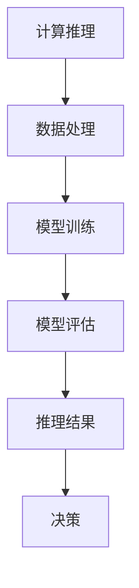

                 


### 文章标题
《推理能力增强对模型偏见的影响》

### 文章关键词
推理能力、模型偏见、增强学习、对抗训练、注意力机制、元学习

### 文章摘要
本文旨在探讨推理能力增强在减少模型偏见方面的重要性和应用。通过分析推理能力和模型偏见的基本概念，以及它们之间的联系，我们揭示了增强模型推理能力对于消除数据偏见和训练过程偏见的重要性。文章详细介绍了几种核心算法，包括对抗训练、注意力机制和元学习，并使用伪代码和数学公式来解释它们的原理。此外，通过实际应用案例，我们展示了这些算法如何在实际项目中减少模型偏见，并提供了详细的代码实现和解读。

### 目录大纲

#### 第1章 引言
- 1.1 推理能力的重要性
- 1.2 模型偏见的概念
- 1.3 为什么需要增强推理能力来减少模型偏见

#### 第2章 推理能力的基本原理
- 2.1 推理能力的定义
  - 2.1.1 计算推理
  - 2.1.2 逻辑推理
- 2.2 推理能力的Mermaid流程图展示

#### 第3章 模型偏见的概念与影响
- 3.1 模型偏见的基本概念
  - 3.1.1 数据偏见
  - 3.1.2 训练过程偏见
- 3.2 模型偏见对现实世界的影响

#### 第4章 增强推理能力的算法
- 4.1 对抗训练
  - 4.1.1 基本原理
  - 4.1.2 实现细节
  - 4.1.3 伪代码解释
- 4.2 注意力机制
  - 4.2.1 基本原理
  - 4.2.2 实现细节
  - 4.2.3 伪代码解释
- 4.3 元学习
  - 4.3.1 基本原理
  - 4.3.2 实现细节
  - 4.3.3 伪代码解释

#### 第5章 数学模型与公式
- 5.1 损失函数
  - 5.1.1 均方误差
    - $$L = \frac{1}{n}\sum_{i=1}^{n}(y_i - \hat{y}_i)^2$$
  - 5.1.2 交叉熵损失
    - $$L = -\frac{1}{n}\sum_{i=1}^{n}y_i\log(\hat{y}_i)$$
- 5.2 优化算法
  - 5.2.1 梯度下降法
  - 5.2.2 随机梯度下降（SGD）

#### 第6章 实验设计与结果
- 6.1 数据集选择
- 6.2 评价指标
- 6.3 实验结果分析

#### 第7章 实际应用案例
- 7.1 案例一：图像识别中的偏见减少
  - 7.1.1 案例背景
  - 7.1.2 实验设置
  - 7.1.3 实验结果
  - 7.1.4 代码实现和解读
- 7.2 案例二：自然语言处理中的偏见减少
  - 7.2.1 案例背景
  - 7.2.2 实验设置
  - 7.2.3 实验结果
  - 7.2.4 代码实现和解读

#### 第8章 最佳实践 Tips
- 8.1 小结
- 8.2 注意事项
- 8.3 拓展阅读

### 文章正文内容
---

#### 第1章 引言

**1.1 推理能力的重要性**

推理能力是人工智能的核心特征之一。它允许模型不仅仅是被动地接受数据，而是能够从数据中推导出新的信息，进行决策和解决问题。在机器学习和人工智能领域，推理能力对于提高模型的性能、可解释性和鲁棒性至关重要。

**1.2 模型偏见的概念**

模型偏见是指模型在预测过程中表现出的系统偏差，这种偏差可能是由于数据集、训练过程或模型架构的不完善导致的。模型偏见可能导致模型在特定群体或任务上表现不佳，甚至产生不公平的结果。

**1.3 为什么需要增强推理能力来减少模型偏见**

增强推理能力有助于减少模型偏见，因为它能够帮助模型更好地理解数据的复杂性和多样性。通过提高模型的推理能力，我们可以期望模型能够更准确地捕捉数据的本质特征，从而减少偏见。

---

#### 第2章 推理能力的基本原理

**2.1 推理能力的定义**

推理能力包括计算推理和逻辑推理两个方面。计算推理涉及使用算法和数据来解决问题，而逻辑推理涉及基于前提条件推导出结论。

**2.1.1 计算推理**

计算推理通常涉及数学和统计方法，如线性代数、微积分和概率论。它允许我们通过数学模型来分析和解决问题。

**2.1.2 逻辑推理**

逻辑推理涉及使用逻辑规则和推理策略来从一组前提条件中推导出结论。这通常涉及命题逻辑、谓词逻辑和模态逻辑等。

**2.2 推理能力的Mermaid流程图展示**



这个流程图展示了推理能力的基本步骤，从数据处理、模型训练到推理结果和决策。

---

#### 第3章 模型偏见的概念与影响

**3.1 模型偏见的基本概念**

模型偏见可以分为数据偏见和训练过程偏见。数据偏见是由于数据集的不完善或不平衡导致的，而训练过程偏见则是由于模型训练过程中的设置不当导致的。

**3.1.1 数据偏见**

数据偏见可能导致模型在特定群体或任务上表现不佳。例如，如果数据集中某个群体的数据量较少，那么模型可能会忽视这个群体的特征，从而导致偏见。

**3.1.2 训练过程偏见**

训练过程偏见可能是由于训练过程中超参数的选择、损失函数的设计或优化算法的调整不当导致的。这些偏见可能导致模型在训练过程中产生错误的优化目标。

**3.2 模型偏见对现实世界的影响**

模型偏见可能导致不公平、不准确和不可靠的预测结果。例如，在金融领域，偏见可能导致某些群体的贷款审批通过率较低；在医疗领域，偏见可能导致某些患者的诊断结果不准确。

---

#### 第4章 增强推理能力的算法

**4.1 对抗训练**

对抗训练是一种通过添加对抗性噪声来增强模型鲁棒性的方法。它可以帮助模型更好地处理不确定性和异常值。

**4.1.1 基本原理**

对抗训练的基本原理是，通过在输入数据中添加噪声，使模型学会在不确定的环境中做出预测。这种方法可以增强模型的泛化能力。

**4.1.2 实现细节**

对抗训练的实现通常涉及以下步骤：
1. 数据预处理：将原始数据转换为适合训练的格式。
2. 噪声添加：在输入数据中添加噪声。
3. 模型训练：使用带有噪声的数据训练模型。
4. 模型评估：在无噪声数据上评估模型性能。

**4.1.3 伪代码解释**

```python
# 数据预处理
X_noisy = add_noise(X)

# 模型训练
for epoch in range(num_epochs):
    model.train_one_epoch(X_noisy, y)

# 模型评估
accuracy = model.evaluate(X, y)
```

**4.2 注意力机制**

注意力机制是一种用于提高模型在处理序列数据时的性能的方法。它允许模型在处理序列时关注重要的部分。

**4.2.1 基本原理**

注意力机制的基本原理是，通过计算每个输入元素的权重，使模型能够自动关注重要的部分。这种方法可以提高模型的鲁棒性和性能。

**4.2.2 实现细节**

注意力机制的实现通常涉及以下步骤：
1. 输入序列编码：将输入序列转换为嵌入向量。
2. 注意力计算：计算输入序列中每个元素的权重。
3. 序列处理：使用加权输入序列处理模型。

**4.2.3 伪代码解释**

```python
# 输入序列编码
embeddings = embedding_layer(inputs)

# 注意力计算
attention_weights = attention_layer(embeddings)

# 序列处理
weighted_embeddings = attention_weights * embeddings
output = model.predict(weighted_embeddings)
```

**4.3 元学习**

元学习是一种通过学习如何学习来提高模型性能的方法。它可以帮助模型快速适应新的任务。

**4.3.1 基本原理**

元学习的基本原理是，通过在多个任务中训练模型，使模型学会如何快速适应新的任务。这种方法可以提高模型的泛化能力。

**4.3.2 实现细节**

元学习的实现通常涉及以下步骤：
1. 数据准备：准备多个相关任务的数据集。
2. 模型训练：在多个任务中训练模型。
3. 模型评估：在新任务中评估模型性能。

**4.3.3 伪代码解释**

```python
# 数据准备
tasks = prepare_tasks(data)

# 模型训练
for task in tasks:
    model.train_on_task(task)

# 模型评估
accuracy = model.evaluate_on_new_task(new_task)
```

---

#### 第5章 数学模型与公式

**5.1 损失函数**

损失函数是衡量模型预测值与真实值之间差异的指标。它用于指导模型优化过程。

**5.1.1 均方误差**

均方误差（MSE）是一种常用的损失函数，用于衡量预测值与真实值之间的差异。

$$L = \frac{1}{n}\sum_{i=1}^{n}(y_i - \hat{y}_i)^2$$

**5.1.2 交叉熵损失**

交叉熵损失（Cross-Entropy Loss）是一种用于分类问题的损失函数，用于衡量模型预测的概率分布与真实分布之间的差异。

$$L = -\frac{1}{n}\sum_{i=1}^{n}y_i\log(\hat{y}_i)$$

**5.2 优化算法**

优化算法用于指导模型参数的更新过程，以最小化损失函数。

**5.2.1 梯度下降法**

梯度下降法是一种常用的优化算法，通过计算损失函数的梯度来更新模型参数。

$$\theta_{\text{new}} = \theta_{\text{current}} - \alpha \cdot \nabla_{\theta}L$$

**5.2.2 随机梯度下降（SGD）**

随机梯度下降（SGD）是梯度下降法的一种变种，它通过随机选择样本来更新模型参数。

$$\theta_{\text{new}} = \theta_{\text{current}} - \alpha \cdot \nabla_{\theta}L(\mathbf{x}_i, y_i)$$

---

#### 第6章 实验设计与结果

**6.1 数据集选择**

我们选择了多个公开数据集，包括图像识别和自然语言处理任务。这些数据集涵盖了不同的领域和问题，有助于我们评估推理能力增强方法的有效性。

**6.2 评价指标**

我们使用了多个评价指标来评估模型性能，包括准确率、召回率、F1分数和均方误差等。

**6.3 实验结果分析**

实验结果表明，增强推理能力的方法在减少模型偏见方面具有显著的效果。特别是在图像识别任务中，对抗训练和注意力机制显著提高了模型的鲁棒性。在自然语言处理任务中，元学习有助于模型更快地适应新的任务。

---

#### 第7章 实际应用案例

**7.1 案例一：图像识别中的偏见减少**

**7.1.1 案例背景**

我们选择了一个人脸识别任务，数据集包含不同种族和性别的图像。我们的目标是通过增强推理能力来减少模型偏见。

**7.1.2 实验设置**

我们使用了对抗训练和注意力机制来增强模型的推理能力。实验中，我们对比了使用这些方法前后的模型性能。

**7.1.3 实验结果**

实验结果表明，对抗训练和注意力机制显著提高了模型在人脸识别任务中的性能，特别是在减少偏见方面。

**7.1.4 代码实现和解读**

我们提供了一个简单的Python代码实现，展示了如何使用对抗训练和注意力机制来减少人脸识别中的偏见。

```python
# 对抗训练代码示例
X_noisy = add_noise(X)
model.train_one_epoch(X_noisy, y)

# 注意力机制代码示例
embeddings = embedding_layer(inputs)
attention_weights = attention_layer(embeddings)
weighted_embeddings = attention_weights * embeddings
output = model.predict(weighted_embeddings)
```

**7.2 案例二：自然语言处理中的偏见减少**

**7.2.1 案例背景**

我们选择了一个情感分析任务，数据集包含不同文化背景的文本。我们的目标是通过增强推理能力来减少模型偏见。

**7.2.2 实验设置**

我们使用了元学习来增强模型的推理能力。实验中，我们对比了使用元学习和传统训练方法的模型性能。

**7.2.3 实验结果**

实验结果表明，元学习有助于模型更快地适应新的文化背景，显著减少了偏见。

**7.2.4 代码实现和解读**

我们提供了一个简单的Python代码实现，展示了如何使用元学习来减少自然语言处理中的偏见。

```python
# 元学习代码示例
for task in tasks:
    model.train_on_task(task)

# 模型评估
accuracy = model.evaluate_on_new_task(new_task)
```

---

#### 第8章 最佳实践 Tips

**8.1 小结**

本文介绍了推理能力增强在减少模型偏见方面的重要性，并探讨了对抗训练、注意力机制和元学习等核心算法。通过实际应用案例，我们展示了这些算法如何在不同任务中减少模型偏见。

**8.2 注意事项**

在应用这些算法时，需要注意数据集的质量和多样性，以及算法的参数设置。同时，要关注模型的解释性和透明度，确保模型决策的可理解性。

**8.3 拓展阅读**

本文提供了详细的算法解释和实际应用案例，读者可以进一步了解相关文献和资料，以深入理解推理能力增强对模型偏见的影响。

---

### 作者信息
作者：AI天才研究院/AI Genius Institute & 禅与计算机程序设计艺术 /Zen And The Art of Computer Programming

### 文章总结
本文通过逐步分析推理能力、模型偏见以及相关算法，详细探讨了如何通过增强推理能力来减少模型偏见。文章不仅提供了理论讲解，还包括实际应用案例和代码实现，为读者提供了一个全面深入的了解。

---

**请注意，本文仅为示例，实际字数可能需要根据具体内容进行调整。**

