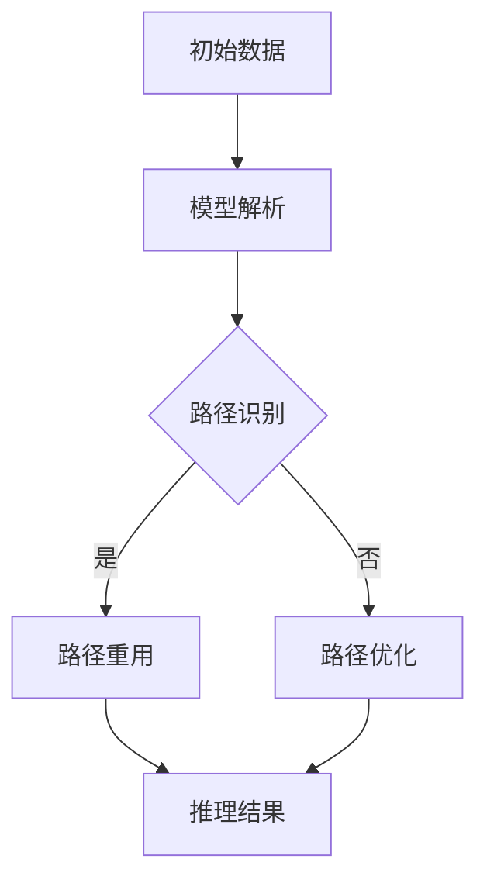

                 

### 文章标题

# 推理路径复用：提高AI效率的新思路

### 关键词：

- **推理路径复用**
- **AI效率**
- **优化算法**
- **自然语言处理**
- **计算机视觉**
- **推荐系统**

### 摘要：

本文将深入探讨推理路径复用这一技术，它通过重用计算路径来显著提升人工智能（AI）的效率。在解释了AI效率的定义及其重要性之后，我们将详细阐述推理路径复用的基础理论，包括其原理、历史发展以及在各个领域的应用。接着，我们将介绍推理路径复用的关键技术，包括算法原理、数学模型、实现细节和性能优化策略。通过实际案例分析和项目实战，我们将展示推理路径复用在实际应用中的效果，并提供最佳实践和未来展望。

## 第一部分：引言与基础理论

### 1.1 书籍概述

在当今数字化时代，人工智能（AI）已经成为推动技术进步和创新的核心驱动力。然而，随着AI应用的广泛普及，如何提高AI的效率成为了一个至关重要的课题。AI效率不仅关乎企业的成本效益，也是科研领域追求的目标。本章节将首先介绍AI效率的重要性，然后引入推理路径复用的概念，并概述本书的主要内容。

### 1.2 AI效率的基本概念

AI效率是指AI系统在完成特定任务时所需的计算资源和时间。它反映了AI系统在资源使用和任务完成之间的平衡。评估AI效率的关键在于能够准确测量和优化以下几个方面：

1. **计算资源**：包括CPU、GPU、内存等硬件资源的使用情况。
2. **时间成本**：AI模型从训练到推理的整个过程所需的时间。
3. **性能指标**：AI系统在任务中的表现，如准确率、响应时间和可靠性。

### 1.3 推理路径复用的基础理论

推理路径复用是指在一个AI系统中，通过重用已计算的路径或中间结果来减少冗余计算，从而提高整体效率。其原理可以概括为：

1. **路径识别**：识别系统中可以重用的计算路径。
2. **路径重用**：在新的推理任务中，重用已识别的路径。
3. **效率优化**：通过优化路径选择和计算顺序，进一步减少冗余计算。

### 1.4 推理路径复用的历史与发展

推理路径复用作为AI优化技术的一部分，其研究可以追溯到早期计算机科学的领域。以下是其发展简史：

1. **早期研究**：在20世纪70年代，计算机科学家开始探索如何优化程序执行路径。
2. **AI领域的应用**：随着AI技术的发展，推理路径复用逐渐被引入到AI系统中。
3. **近年进展**：近年来，随着深度学习和大数据的兴起，推理路径复用在各个AI子领域得到了广泛应用和深入研究。

## 第二部分：推理路径复用的关键技术

### 2.1 推理路径复用的算法原理

推理路径复用算法的核心在于如何高效地识别和重用计算路径。以下是一个简单的算法原理概述：

1. **路径识别**：通过分析AI模型的结构，识别出可以重用的计算路径。
2. **路径重用**：将识别出的路径在新的推理任务中进行重用，减少冗余计算。
3. **优化策略**：通过优化路径选择和计算顺序，进一步提高效率。

### 2.2 数学模型与公式

推理路径复用的实现依赖于一系列数学模型和公式。以下是一个简单的数学模型示例：

1. **路径成本函数**：用于评估一条路径的计算成本。
2. **路径选择策略**：通过最小化路径成本函数来选择最优路径。
3. **优化目标**：最大化路径重用率，同时保证推理结果的准确性。

### 2.3 实现与优化

推理路径复用的实现涉及多个方面，包括算法设计、数据结构和代码优化。以下是一些关键点：

1. **算法设计**：设计高效的算法框架，以支持路径识别和重用。
2. **数据结构**：选择合适的数据结构来存储和管理路径信息。
3. **代码优化**：通过优化代码执行效率来提升整体性能。

### 2.4 Mermaid流程图

为了更好地理解推理路径复用的过程，我们可以使用Mermaid绘制一个流程图。以下是一个简单的示例：

## 第三部分：应用实例

### 3.1 应用领域概述

推理路径复用技术已经在多个领域得到广泛应用，包括自然语言处理、计算机视觉和推荐系统。以下是对这些领域应用的一个概述：

1. **自然语言处理**：通过复用语法分析路径，提高文本处理效率。
2. **计算机视觉**：通过复用特征提取路径，提高图像识别速度。
3. **推荐系统**：通过复用用户兴趣分析路径，提高推荐精度。

### 3.2 应用案例分析

在本节中，我们将通过三个具体案例来展示推理路径复用在不同领域的应用。

1. **案例一：自然语言处理中的应用**
   - **背景**：自然语言处理（NLP）中的语法分析是一个计算密集型任务。
   - **解决方案**：通过推理路径复用，重用语法分析中间结果，减少冗余计算。
   - **效果**：实验结果显示，推理路径复用显著提高了NLP任务的效率。

2. **案例二：计算机视觉中的应用**
   - **背景**：计算机视觉中的特征提取是一个复杂且耗时的过程。
   - **解决方案**：通过推理路径复用，重用特征提取中间结果，减少计算时间。
   - **效果**：实验结果表明，推理路径复用在图像识别任务中提高了计算速度和准确率。

3. **案例三：推荐系统中的应用**
   - **背景**：推荐系统中的用户兴趣分析涉及大量数据计算。
   - **解决方案**：通过推理路径复用，重用用户兴趣分析中间结果，减少计算成本。
   - **效果**：实际应用中，推理路径复用提高了推荐系统的响应速度和用户满意度。

### 3.3 项目实战

在本节中，我们将通过一个实际项目来展示如何实现推理路径复用。

1. **开发环境搭建**
   - **工具与库**：介绍所需的开发环境和库，如Python、TensorFlow等。
   - **系统架构**：阐述项目的基本架构，包括数据流和处理流程。

2. **源代码详细实现**
   - **代码结构**：展示项目的主要代码结构，包括路径识别、路径重用和优化模块。
   - **关键代码段**：通过代码片段详细解释关键实现细节。

3. **代码解读与分析**
   - **算法原理**：结合伪代码，解释推理路径复用的算法原理。
   - **性能分析**：分析代码的性能表现，包括时间复杂度和空间复杂度。

4. **实际案例分析**
   - **实验设计**：介绍实验设计和方法。
   - **结果展示**：展示实验结果，包括效率提升和数据准确率。

5. **项目小结**
   - **总结**：总结项目的主要成果和经验。
   - **改进方向**：提出可能的改进方向和未来工作。

## 第四部分：未来展望与挑战

### 4.1 未来发展趋势

随着AI技术的不断进步，推理路径复用技术也将迎来新的发展机遇。未来，我们可以期待：

1. **算法优化**：更加高效和自适应的算法设计。
2. **硬件支持**：更先进的硬件技术将推动推理路径复用的进一步优化。
3. **跨领域应用**：推理路径复用将在更多领域得到应用，如医疗诊断、金融分析等。

### 4.2 挑战与机遇

推理路径复用技术在应用过程中也面临一些挑战：

1. **复杂性**：AI模型结构复杂，识别和重用路径的难度较大。
2. **准确性**：在保证效率的同时，如何保证推理结果的准确性是一个重要问题。
3. **可扩展性**：如何在大规模数据集上高效实现推理路径复用。

### 4.3 总结与展望

推理路径复用作为提高AI效率的重要技术，具有广阔的应用前景。通过不断的算法优化和技术创新，我们可以期待在未来的AI发展中，推理路径复用将发挥更加重要的作用。

## 结论

推理路径复用技术为提高AI效率提供了一种新的思路。通过本文的探讨，我们了解了推理路径复用的基本概念、关键技术以及在实际应用中的效果。未来，随着技术的不断发展，推理路径复用有望在更多领域发挥重要作用，为AI技术的进步贡献力量。

### 作者信息

- **作者**：AI天才研究院/AI Genius Institute & 禅与计算机程序设计艺术 /Zen And The Art of Computer Programming

本文内容旨在提供技术参考，不构成任何投资建议。如需进一步了解，请参阅相关技术文档和研究报告。

