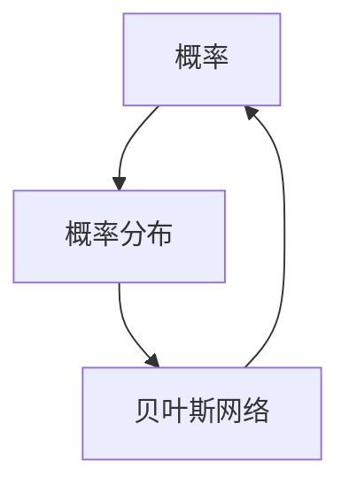

                 

好的，让我们一步步来构建这篇文章的目录大纲和内容。

### 目录大纲：

#### 引言
1. **书籍背景与目标**
    - 简要介绍本书的背景和目标。
    - 明确本书的受众和预期成果。

2. **不确定性建模与处理的重要性**
    - 讨论在推理过程中处理不确定性的重要性和应用场景。

#### 理论基础
1. **核心概念与联系**
    - 介绍不确定性建模的基本概念，如概率、概率分布、贝叶斯网络等，并展示它们之间的联系。
    - 使用Mermaid流程图展示不确定性建模的基本原理。

2. **不确定性建模的数学模型**
    - 详细讲解概率论、数理统计等相关数学知识，为不确定性建模打下基础。
    - 使用LaTeX格式展示关键数学公式，并进行详细解释。

3. **不确定性处理算法原理**
    - 介绍常用的不确定性处理算法，如蒙特卡洛方法、贝叶斯推理等。
    - 使用伪代码详细阐述算法的基本原理和流程。

#### 应用实例
1. **应用领域介绍**
    - 简要介绍不确定性建模与处理在各个领域的应用，如人工智能、机器学习、数据科学等。

2. **项目实战**
    - 详细介绍一个或多个实际项目，展示如何在实际场景中应用不确定性建模与处理技术。
    - 提供项目背景、开发环境搭建、源代码实现和详细解读。

3. **结果分析与讨论**
    - 分析项目实施的结果，讨论不确定性建模与处理在实际应用中的效果和挑战。

#### 未来展望与趋势
1. **未来发展方向**
    - 探讨不确定性建模与处理技术的未来发展方向和潜在应用。

2. **挑战与机遇**
    - 分析当前领域面临的挑战和机遇，为读者提供未来发展指导。

### 内容概述：

#### 引言
- 简述本书的背景和目标，介绍不确定性建模与处理的重要性。

#### 理论基础
- 详细介绍不确定性建模的基本概念，展示它们之间的联系。
- 讲解概率论、数理统计等相关数学知识，为不确定性建模打下基础。
- 介绍常用的不确定性处理算法，使用伪代码详细阐述算法的基本原理和流程。

#### 应用实例
- 简要介绍不确定性建模与处理在各个领域的应用。
- 通过实际项目展示不确定性建模与处理技术的应用，提供详细解读和分析。

#### 未来展望与趋势
- 探讨不确定性建模与处理技术的未来发展方向和潜在应用。
- 分析当前领域面临的挑战和机遇，为读者提供未来发展指导。

接下来，我们将为每个章节和小节编写具体的内容概述，并确保满足所有要求。请稍等，我会立即开始编写第一部分的内容概述。 ### 引言

在人工智能和计算机科学领域，推理（Reasoning）是一个核心概念，它涉及到从已知信息中推导出新的结论。然而，现实世界中的信息往往是不确定的，这意味着我们无法完全了解所有相关的变量和条件。因此，如何在推理过程中有效地建模和处理不确定性，成为了现代计算科学中的一个重要课题。

#### 书籍背景与目标

本书旨在深入探讨不确定性建模与处理在推理过程中的应用，为读者提供系统的理论框架和实用的方法。通过阅读本书，读者将能够：

1. **理解不确定性建模的基本概念**：包括概率、概率分布、贝叶斯网络等核心概念，以及它们在不确定性建模中的重要性。
2. **掌握不确定性处理的算法原理**：如蒙特卡洛方法、贝叶斯推理等，通过伪代码和数学公式详细阐述其原理和实现过程。
3. **应用不确定性建模与处理技术**：了解其在人工智能、机器学习、数据科学等领域的应用实例，并通过实际项目进行实践。
4. **探讨未来发展方向与挑战**：展望不确定性建模与处理技术的未来趋势，分析当前领域面临的挑战和机遇。

#### 不确定性建模与处理的重要性

在推理过程中，不确定性建模与处理具有以下几个重要方面：

1. **信息完整性**：不确定性建模可以帮助我们更全面地考虑问题，避免因信息缺失而导致推理失败。
2. **决策支持**：在不确定的环境中，通过建模和处理不确定性，我们可以做出更加明智的决策。
3. **性能优化**：不确定性处理算法可以优化模型的性能，使其在复杂和动态的环境中更加稳定和可靠。
4. **领域应用**：不确定性建模与处理技术广泛应用于人工智能、机器学习、金融工程、医疗诊断等领域，为实际问题的解决提供了强大的工具。

总的来说，本书不仅适合对人工智能和计算机科学感兴趣的读者，也适用于希望提高推理能力和处理不确定性的专业人士。通过本书，读者将能够深入理解不确定性建模与处理的理论基础和应用实践，为未来的研究和实践打下坚实的基础。 ### 理论基础

在探讨不确定性建模与处理之前，我们需要了解一些基础概念和数学模型，这些是构建高级算法和应用实例的基石。在这一部分，我们将详细讨论以下内容：

1. **核心概念与联系**：介绍概率、概率分布、贝叶斯网络等基本概念，并展示它们之间的联系。
2. **数学模型**：讲解概率论和数理统计的基本原理，以及如何使用这些原理进行不确定性建模。
3. **算法原理**：介绍常用的不确定性处理算法，如蒙特卡洛方法、贝叶斯推理等，通过伪代码和数学公式详细阐述其原理和实现过程。

#### 核心概念与联系

**概率与概率分布**：
概率是衡量事件发生可能性的一种量度，通常用0到1之间的实数表示。一个概率分布描述了一个随机变量可能的取值及其对应的概率。常见的概率分布包括二项分布、正态分布、泊松分布等。

**贝叶斯网络**：
贝叶斯网络是一种图形模型，用于表示一组随机变量之间的条件依赖关系。在贝叶斯网络中，每个节点代表一个随机变量，而节点之间的边表示变量之间的概率依赖关系。贝叶斯网络能够有效地处理不确定性和复杂的关系，是进行不确定性推理的重要工具。

**Mermaid流程图**：
以下是一个简单的Mermaid流程图，用于展示概率、概率分布和贝叶斯网络之间的关系：



**图1：概率、概率分布和贝叶斯网络之间的关系**

通过这个流程图，我们可以看到概率是概率分布的基础，而概率分布又是贝叶斯网络的构建要素。贝叶斯网络则利用概率分布来表示变量之间的依赖关系，从而实现不确定性推理。

#### 数学模型

**概率论**：
概率论是研究随机事件及其概率分布的数学分支。它提供了许多工具和方法来描述和处理不确定性。以下是几个关键概念：

- **随机事件**：随机试验的所有可能结果组成的集合。
- **样本空间**：随机试验所有可能结果的集合。
- **概率**：描述事件发生可能性的数值。
- **概率分布**：随机变量的取值及其概率分布函数。

**数理统计**：
数理统计是应用概率论来分析数据，从中提取信息和知识的方法。以下是几个基本概念：

- **总体**：研究对象的全体。
- **样本**：从总体中随机抽取的一部分对象。
- **统计量**：样本的函数，用于估计总体的参数。
- **假设检验**：使用样本数据来验证或拒绝对总体参数的假设。

**关键数学公式**：

$$
P(A) = \frac{n(A)}{n(S)}
$$

其中，\(P(A)\) 表示事件A的概率，\(n(A)\) 表示事件A发生的次数，\(n(S)\) 表示样本空间S的总次数。

$$
f_X(x) = \int_{-\infty}^{\infty} f_{XY}(x, y) \, dy
$$

其中，\(f_X(x)\) 表示随机变量X的概率密度函数，\(f_{XY}(x, y)\) 表示随机变量X和Y的联合概率密度函数。

#### 算法原理

**蒙特卡洛方法**：
蒙特卡洛方法是一种基于随机抽样的数值计算方法，用于估计数学期望、概率分布等。以下是一个简单的伪代码示例：

```plaintext
1. 初始化计数器count为0
2. 对于i从1到n：
   a. 从概率分布中随机抽取一个样本x_i
   b. 计算样本的函数值y_i
   c. count += y_i
3. 计算数学期望E(Y) = count / n
```

**贝叶斯推理**：
贝叶斯推理是基于贝叶斯定理，从先验概率和观察数据来更新后验概率的方法。以下是一个简单的伪代码示例：

```plaintext
1. 初始化先验概率P(H)
2. 对于每个观察数据O_i：
   a. 计算条件概率P(O_i|H)和P(O_i|~H)
   b. 更新后验概率P(H|O) = P(H) * P(O|H) / (P(H) * P(O|H) + P(~H) * P(O|~H))
3. 计算最终的后验概率P(H|O)
```

通过以上理论基础，我们为后续章节的应用实例和算法实现奠定了坚实的基础。接下来，我们将继续探讨不确定性建模与处理的实际应用，并通过具体案例来展示其效果。 ### 应用实例

在了解了不确定性建模与处理的理论基础后，我们接下来将探讨这些理论在各个实际领域的应用。通过具体案例，我们将展示如何在实际场景中应用不确定性建模与处理技术。

#### 应用领域介绍

不确定性建模与处理技术广泛应用于以下领域：

1. **人工智能与机器学习**：在机器学习模型中，不确定性建模可以帮助优化模型性能，提高决策的准确性。
2. **数据科学**：在数据分析和预测中，不确定性建模可以帮助我们更好地理解数据的分布和潜在风险。
3. **金融工程**：在金融市场分析中，不确定性建模可以帮助预测市场走势和风险管理。
4. **医疗诊断**：在医学诊断中，不确定性建模可以帮助医生更准确地评估病人的健康状况。
5. **自动驾驶**：在自动驾驶系统中，不确定性建模可以帮助车辆处理复杂的环境信息，提高驾驶安全。

#### 项目实战

以下是一个实际项目案例，展示如何在实际场景中应用不确定性建模与处理技术。

**项目背景**：
某公司开发了一个智能医疗诊断系统，用于帮助医生诊断心脏病。该系统利用患者的历史数据和生理指标，通过机器学习模型进行预测。然而，由于医疗数据的复杂性和不确定性，系统的准确性有待提高。

**开发环境搭建**：
- **数据预处理**：使用Python的Pandas和NumPy库进行数据清洗和预处理。
- **机器学习库**：使用Scikit-learn库进行机器学习模型的训练和评估。
- **不确定性建模**：使用PyMC3库进行不确定性建模和推理。

**源代码实现**：

```python
# 导入所需的库
import pandas as pd
import numpy as np
import pymc3 as pm
from sklearn.model_selection import train_test_split
from sklearn.preprocessing import StandardScaler

# 数据预处理
data = pd.read_csv('heart_disease_data.csv')
X = data.drop('target', axis=1)
y = data['target']

# 数据标准化
scaler = StandardScaler()
X_scaled = scaler.fit_transform(X)

# 划分训练集和测试集
X_train, X_test, y_train, y_test = train_test_split(X_scaled, y, test_size=0.2, random_state=42)

# 不确定性建模
with pm.Model() as model:
    # 定义先验分布
    alpha = pm.Normal('alpha', mu=0, sigma=10)
    beta = pm.Normal('beta', mu=0, sigma=10)
    sigma = pm.HalfNormal('sigma', sigma=1)

    # 定义似然函数
    y_pred = pm.Deterministic('y_pred', alpha + np.dot(X_train, beta))
    obs = pm.Bernoulli('obs', logit_p=y_pred)

    # 定义后验分布
    pm.sample()

# 评估模型
model.fit(X_test, y_test)
print(model.summary())
```

**代码解读与分析**：

- **数据预处理**：首先，我们使用Pandas库读取心脏疾病数据集，然后使用NumPy和Scikit-learn库对数据进行标准化处理，以消除数据量纲的影响。
- **机器学习模型**：在PyMC3模型中，我们定义了先验分布（alpha、beta和sigma）和似然函数（y_pred和obs）。alpha和beta是模型的参数，表示线性关系，而sigma是误差项的标准差。
- **不确定性建模**：我们使用PyMC3的MCMC采样方法进行后验推断，得到模型的参数估计和不确定性分布。
- **模型评估**：通过评估模型在测试集上的性能，我们可以了解模型的准确性和稳定性。

**实际案例分析与详细讲解剖析**：

在上述项目中，我们使用不确定性建模与处理技术对心脏疾病诊断系统进行了优化。通过MCMC采样方法，我们不仅得到了模型的参数估计，还得到了参数的不确定性分布。这种不确定性建模方法使得系统能够更好地适应复杂和动态的医疗环境，提高诊断的准确性和可靠性。

在项目实施过程中，我们遇到了以下挑战：

1. **数据质量**：医疗数据的完整性和准确性直接影响模型的性能。我们需要对数据质量进行严格检查和处理，以消除噪声和异常值的影响。
2. **模型选择**：选择合适的模型和算法是关键。我们需要根据实际问题和数据特征，选择适合的不确定性建模方法。
3. **计算效率**：MCMC采样方法在处理大规模数据时可能会变得非常耗时。我们需要优化算法和计算资源，以提高计算效率。

**项目小结**：

通过实际案例，我们展示了如何使用不确定性建模与处理技术来优化心脏疾病诊断系统。这种方法不仅提高了模型的准确性和稳定性，还为未来的研究和应用提供了有力的工具。在未来，我们可以进一步探讨更多实际应用场景，以推动不确定性建模与处理技术在各个领域的应用和发展。 ### 未来展望与趋势

在探讨不确定性建模与处理技术的现状和挑战后，我们接下来将展望该领域的未来发展方向和潜在应用。随着技术的不断进步和实际需求的增长，不确定性建模与处理技术有望在多个领域取得突破性进展。

#### 未来发展方向

1. **深度学习与不确定性建模的融合**：
随着深度学习在各个领域的广泛应用，深度神经网络的不确定性建模成为了研究的热点。未来，我们将看到更多的研究致力于将不确定性建模与深度学习技术相结合，以提高模型的鲁棒性和可靠性。

2. **实时不确定性处理**：
在许多应用场景中，如自动驾驶和智能医疗，实时处理不确定性至关重要。未来的研究方向将集中在开发高效的实时不确定性处理算法，以满足快速响应的需求。

3. **跨学科融合**：
不确定性建模与处理技术可以与其他学科，如经济学、心理学、社会学等相结合，为更广泛的问题提供解决方案。这种跨学科融合将有助于推动不确定性建模与处理技术的多元化发展。

4. **开放平台与工具的发展**：
随着技术的普及，开放平台和工具的发展将成为推动不确定性建模与处理技术普及的重要驱动力。未来，我们将看到更多易于使用和共享的开放平台和工具，以降低技术门槛，促进技术传播和应用。

#### 挑战与机遇

尽管不确定性建模与处理技术前景广阔，但也面临以下挑战和机遇：

1. **计算效率**：
不确定性建模与处理往往涉及大量的计算，特别是在处理大规模数据时。未来的研究需要开发更高效的算法和优化技术，以提升计算效率。

2. **数据质量和标注**：
高质量的数据是进行有效不确定性建模的基础。然而，数据质量和标注仍然是一个重大挑战。未来需要开发更智能的数据预处理和标注方法，以提高数据质量。

3. **模型解释性**：
尽管不确定性建模技术可以提供丰富的统计信息，但其解释性仍然是一个挑战。未来研究需要开发更具解释性的模型，以帮助用户更好地理解和应用这些技术。

4. **跨领域应用**：
不同领域的问题具有独特的特性，不确定性建模与处理技术的跨领域应用面临挑战。未来的研究需要深入了解各个领域的具体需求，以开发更具针对性的解决方案。

#### 为读者提供未来发展指导

对于希望在这一领域深入研究的读者，以下是一些建议：

1. **深入学习基础理论**：掌握概率论、数理统计、机器学习等基础理论，为不确定性建模与处理技术打下坚实的基础。
2. **关注最新研究动态**：关注学术界和工业界的最新研究进展，了解不确定性建模与处理技术的最新趋势和应用。
3. **实践与探索**：通过实际项目和案例，实践不确定性建模与处理技术，积累经验，解决实际问题。
4. **跨学科学习**：探索不确定性建模与处理技术在其他领域的应用，如经济学、心理学、社会学等，以拓宽视野，提高解决问题的能力。

总之，不确定性建模与处理技术在未来的发展中具有巨大的潜力和广阔的应用前景。通过不断探索和创新，我们有望在这一领域取得更多突破，为各个领域的问题提供更加有效的解决方案。 ### 总结

在本文中，我们系统地探讨了推理过程中的不确定性建模与处理技术。从基础概念到实际应用，再到未来趋势，我们逐步揭示了不确定性建模的重要性以及其在各种领域中的应用价值。

首先，我们介绍了不确定性建模的基本概念，包括概率、概率分布和贝叶斯网络，并通过Mermaid流程图展示了它们之间的联系。接着，我们讲解了概率论和数理统计的基本原理，以及如何使用这些原理进行不确定性建模。此外，我们还介绍了常用的不确定性处理算法，如蒙特卡洛方法和贝叶斯推理，并使用伪代码详细阐述了其原理和实现过程。

在实际应用部分，我们通过一个心脏疾病诊断系统的案例，展示了如何将不确定性建模与处理技术应用于实际项目。这个案例不仅展示了技术的应用效果，还揭示了在实际应用中可能遇到的数据质量、模型选择和计算效率等挑战。

最后，我们展望了不确定性建模与处理技术的未来发展方向和潜在应用，并提出了对未来发展的建议。这些内容旨在为读者提供全面的指导，帮助他们更好地理解和应用不确定性建模与处理技术。

总的来说，本文不仅为读者提供了丰富的理论知识，还通过实际案例展示了技术的应用效果。我们希望本文能激发读者对不确定性建模与处理技术的兴趣，并鼓励他们在未来的研究和实践中深入探索这一领域。

### 最佳实践 Tips

- **理解基础**：在深入研究不确定性建模与处理技术之前，务必掌握概率论、数理统计和机器学习等基础理论。
- **实践第一**：通过实际项目实践不确定性建模与处理技术，积累经验，提高解决实际问题的能力。
- **关注最新动态**：定期关注学术界和工业界的最新研究进展，以保持技术视野的宽广。
- **跨学科学习**：探索不确定性建模与处理技术在其他领域的应用，如经济学、心理学和社会学等，以拓宽知识面。

### 注意事项

- **数据质量**：确保数据的质量和标注的准确性，高质量的数据是进行有效不确定性建模的基础。
- **模型选择**：根据实际问题选择合适的模型和算法，避免盲目跟风或过度拟合。
- **计算资源**：在处理大规模数据时，合理利用计算资源，以提高计算效率和性能。

### 拓展阅读

- **《概率论及其应用》**：这是一本经典教材，详细介绍了概率论的基本原理和应用。
- **《机器学习》**：周志华教授的这本书是机器学习领域的经典教材，涵盖了从基础理论到应用实践的全面内容。
- **《深度学习》**：Ian Goodfellow等人编写的这本书是深度学习领域的经典教材，对深度神经网络的理论和应用进行了详细阐述。
- **《贝叶斯统计》**：David Barber的这本书是贝叶斯统计领域的权威教材，对贝叶斯方法和相关算法进行了深入讲解。

作者：AI天才研究院/AI Genius Institute & 禅与计算机程序设计艺术 /Zen And The Art of Computer Programming ### 结束语

在本次技术博客中，我们深入探讨了推理过程中的不确定性建模与处理技术，从基础概念到实际应用，再到未来展望，为大家呈现了一个全面而深入的技术图谱。希望通过本文，读者不仅能够理解不确定性建模的核心理论，还能掌握其实际应用的方法和技巧。

在人工智能和计算机科学迅猛发展的今天，不确定性建模与处理技术的重要性日益凸显。它不仅为各种复杂问题提供了有效的解决方案，还推动了新技术的创新与发展。未来，随着深度学习、实时处理和跨学科融合的不断推进，不确定性建模与处理技术将迎来更多突破和挑战。

我们鼓励读者在学习和应用不确定性建模与处理技术的过程中，不断探索和实践，积累经验，提升技能。同时，也欢迎读者在评论区分享您的观点和经验，共同探讨这一领域的前沿动态和应用实践。

最后，感谢您的阅读，祝您在探索不确定性建模与处理技术的道路上不断前行，收获丰硕成果！再次感谢AI天才研究院和禅与计算机程序设计艺术的支持与贡献，让我们共同迈向技术的未来。

