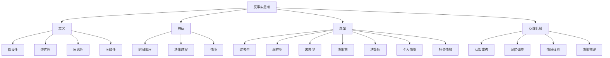

                 

### 文章标题

# 推理过程中的反事实思考能力培养研究

### 文章关键词

- 推理
- 反事实思考
- 能力培养
- 决策过程
- 社会治理
- 概念与特征
- 发展历程
- 评估方法
- 教育教学策略
- 实践活动策略
- 个体训练策略

### 文章摘要

本文旨在深入研究推理过程中的反事实思考能力培养。首先，通过阐述反事实思考的基本概念、特征及其心理机制，我们建立了反事实思考的理论基础。接着，回顾了反事实思考的发展历程，从起源到理论模型的演变。文章进一步探讨了反事实思考能力的评估方法与工具，为培养提供了科学依据。在核心内容部分，本文提出了反事实思考能力的培养策略与方法，包括教育教学策略、实践活动策略和个体训练策略。文章还分析了反事实思考在决策过程和社会治理中的应用，通过案例分析展示了其具体应用效果。最后，文章展望了反事实思考能力的未来发展趋势，探讨了其在社会发展中的潜在影响。本文旨在为相关领域的研究者和实践者提供有价值的参考。

## 第一部分：反事实思考能力的基本理论

### 第1章：反事实思考的概念与特征

#### 1.1 反事实思考的定义

反事实思考（Counterfactual Thinking）是指个体在面临现实情境时，设想如果某个条件发生变化，结果会是什么样的思考过程。这种思考方式涉及对“如果...将会怎样？”（What if...）问题的探索。反事实思考不仅仅是对过去事件的回顾，更是一种假设性的思考方式，它帮助个体理解现实世界、预测未来结果以及制定决策。

在心理学中，反事实思考通常被分为两种类型：后见之明（Hindsight）和前瞻性反事实（Prospective Counterfactual）。后见之明是指回顾过去事件时，个体认为如果当时知道现在的情况，过去的行为将会不同；而前瞻性反事实则是在当前决策时，设想未来如果情况发生变化，当前的决策将会如何调整。

#### 1.2 反事实思考的特征

反事实思考具有以下几个显著特征：

1. **假设性**：反事实思考是基于假设条件的思考，它不涉及实际的物理变化，而是通过心理模拟来探讨可能性。
2. **逆向性**：反事实思考通常从现实结果逆向推理，探讨不同条件下的潜在结果。
3. **反思性**：通过反事实思考，个体能够反思自己的行为和决策，从中获取经验和教训。
4. **关联性**：反事实思考常常涉及多个相关因素的假设性分析，以理解复杂情境中的潜在影响。

#### 1.3 反事实思考的类型

根据不同的分类标准，反事实思考可以划分为多种类型。以下是几种常见的分类方法：

1. **根据时间顺序**：可以分为过去型反事实（关于过去的假设性思考）、现在型反事实（关于当前的假设性思考）和未来型反事实（关于未来的假设性思考）。
2. **根据决策过程**：可以分为决策前反事实（在决策前考虑各种假设性结果）和决策后反事实（在决策后反思如果决策不同结果会如何）。
3. **根据情境**：可以分为个人情境反事实（关于个人生活事件的思考）和社会情境反事实（关于社会事件或政策影响的思考）。

#### 1.4 反事实思考的心理机制

反事实思考的心理机制涉及多个认知和情感过程。以下是几个关键的心理机制：

1. **认知重构**：个体通过重构现实情境中的信息，构建不同的假设性情景。
2. **记忆偏差**：个体在回忆过去事件时，往往会根据自己的当前信念和期望对记忆进行修正，从而影响反事实思考。
3. **情感体验**：反事实思考常常伴随着情感的体验，例如后悔、遗憾或满足感。
4. **决策推理**：反事实思考是决策过程中不可或缺的一部分，它帮助个体评估不同决策的可能结果，以做出更明智的选择。

### 核心概念与联系

为了更好地理解反事实思考的概念与特征，我们可以通过一个Mermaid流程图来展示这些核心概念及其相互联系：



通过这个流程图，我们可以清晰地看到反事实思考的各个核心概念及其之间的联系。定义、特征、类型和心理机制共同构成了反事实思考的完整框架。

### Mermaid流程图解释

- **A[反事实思考]**：作为流程图的起点，代表了反事实思考的整体概念。
- **B[定义]**：描述反事实思考的基本概念，包括假设性、逆向性、反思性和关联性。
- **C[特征]**：展示了反事实思考的主要特征，如时间顺序、决策过程和情境。
- **D[类型]**：区分了不同的反事实思考类型，包括过去型、现在型、未来型、决策前、决策后、个人情境和社会情境。
- **E[心理机制]**：阐述了反事实思考背后的心理过程，如认知重构、记忆偏差、情感体验和决策推理。

通过这个流程图，读者可以直观地理解反事实思考的复杂性和多维度，从而为进一步的研究和应用打下坚实基础。

#### 1.5 反事实思考的数学模型

为了深入理解反事实思考的算法原理，我们可以通过数学模型来详细阐述其核心概念。以下是反事实思考的一个简化数学模型：

假设个体面临一个决策情境，有多个可能的选择（$X_1, X_2, ..., X_n$），每个选择对应一个结果（$R_1, R_2, ..., R_n$）。反事实思考可以通过以下步骤进行：

1. **定义决策变量**：
   $$ X = \{X_1, X_2, ..., X_n\} $$
   $$ R = \{R_1, R_2, ..., R_n\} $$

2. **设定基准情境**：
   选择当前已知的决策结果作为基准情境：
   $$ R_{base} = R_i $$
   其中，$i$ 为当前已选择的决策。

3. **构建假设情境**：
   对于每个可能的决策，构建一个假设性情境：
   $$ X' = \{X_1', X_2', ..., X_n'\} $$
   其中，$X_j' = X_j$ 当 $j \neq i$ 且 $X_i' \neq X_i$。

4. **计算反事实结果**：
   对于每个假设情境，计算对应的假设性结果：
   $$ R' = \{R_1', R_2', ..., R_n'\} $$
   其中，$R_j' = f(X_j')$，$f$ 为决策结果映射函数。

5. **评估反事实思考**：
   比较基准情境和假设情境的结果，评估反事实思考的合理性：
   $$ D = \{D_1, D_2, ..., D_n\} $$
   $$ D_j = |R_j - R_j'| $$
   其中，$D_j$ 表示在假设情境下，结果与基准情境的差异。

通过这个数学模型，我们可以看到反事实思考涉及多个变量和计算步骤。具体实现时，可以根据实际情况调整模型参数和映射函数，以提高反事实思考的准确性和实用性。

### 伪代码实现

为了更直观地展示反事实思考的算法原理，以下是一个简化的伪代码实现：

```plaintext
Algorithm 反事实思考(决策变量X, 结果变量R, 基准决策i):
    1. 初始化假设情境X'和结果R'
    2. 对于每个可能决策j：
        a. 如果 j != i：
            i. X'j = Xj
            ii. R'j = 结果映射函数(f)(X'j)
        else:
            i. X'i = Xj (假设另一个选择)
            ii. R'i = 结果映射函数(f)(X'i)
    3. 计算差异D
    4. 返回差异D
```

在这个伪代码中，`决策变量X` 和 `结果变量R` 代表了决策空间和结果空间，`基准决策i` 是当前已知的决策。算法首先初始化假设情境和结果，然后遍历所有可能的决策，计算假设情境下的结果，并最终计算与基准情境的差异。

### 数学公式与详细讲解

为了更好地理解反事实思考的数学原理，我们可以使用几个关键的数学公式来描述这个过程。以下是几个重要的公式及其解释：

1. **结果映射函数**：
   $$ f(X_j) = R_j $$
   这个公式表示，每个决策 $X_j$ 都有一个对应的结果 $R_j$。在反事实思考中，我们需要考虑不同决策下的结果，因此需要定义一个映射函数 $f$。

2. **反事实差异计算**：
   $$ D_j = |R_j - R_j'| $$
   这个公式表示，在假设情境下，结果 $R_j'$ 与基准情境结果 $R_j$ 之间的差异。通过计算差异，我们可以评估不同假设情境的合理性。

3. **反事实思考概率分布**：
   $$ P(D_j > D_{base}) = P(X_j' \neq X_j) $$
   这个公式表示，在给定基准情境下，假设情境差异大于基准情境差异的概率。通过计算这个概率，我们可以判断不同假设情境的可能性。

#### 公式举例说明

假设有一个决策情境，有两个选择 $X_1$ 和 $X_2$，对应的结果分别是 $R_1 = 5$ 和 $R_2 = 10$。现在我们要考虑一个假设情境，即选择 $X_1$，但结果变为 $R_1' = 8$。

1. **结果映射函数**：
   $$ f(X_1) = R_1 $$
   $$ f(X_2) = R_2 $$
   在这个情境下，映射函数可以表示为：
   $$ f(X_1) = 5 $$
   $$ f(X_2) = 10 $$

2. **反事实差异计算**：
   $$ D_1 = |R_1 - R_1'| = |5 - 8| = 3 $$
   $$ D_2 = |R_2 - R_2'| = |10 - 8| = 2 $$
   通过计算差异，我们可以看到，在假设情境下，选择 $X_1$ 的结果差异更大。

3. **反事实思考概率分布**：
   $$ P(D_1 > D_2) = P(X_1' \neq X_1) $$
   如果我们假设选择 $X_1$ 和 $X_2$ 的概率都是 0.5，那么：
   $$ P(D_1 > D_2) = P(X_1' \neq X_1) = 0.5 $$
   这意味着，选择 $X_1$ 并不是最优的，因为它的差异更大。

通过这些公式和举例，我们可以更深入地理解反事实思考的数学原理，并应用于实际决策过程中。

### 数学模型的应用

为了更好地展示反事实思考在现实生活中的应用，我们可以通过一个具体的例子来说明其作用。假设一个公司面临一个关键决策：是否投资一个新项目。

#### 决策背景

公司目前有一个稳定的业务，年利润约为 1000 万元。公司管理层考虑投资一个新项目，预计该项目将在未来三年内带来额外的 3000 万元利润。然而，该项目存在一定的风险，如果失败，公司可能面临 500 万元的损失。

#### 基准决策

基于当前的财务状况和市场需求，公司决定投资该项目。即选择 $X_2$，预计结果为 $R_2 = 3000$ 万元。

#### 假设情境

现在我们考虑几个假设情境，通过反事实思考来评估不同决策的结果：

1. **情境一：选择不投资（$X_1$）**
   - 结果：公司保持现有业务，年利润为 1000 万元，未来三年内没有额外的利润增长。
   - 差异：$$ D_1 = |1000 - 3000| = 2000 $$ 万元。

2. **情境二：选择另一个潜在项目（$X_3$）**
   - 结果：另一个潜在项目预计带来 2000 万元的额外利润，但风险较低。
   - 差异：$$ D_3 = |2000 - 3000| = 1000 $$ 万元。

3. **情境三：投资失败（$X_2$）**
   - 结果：由于项目失败，公司亏损 500 万元。
   - 差异：$$ D_2 = |-500 - 3000| = 3500 $$ 万元。

通过计算差异，我们可以看到：

- 在情境一（不投资）下，与基准决策的差异为 2000 万元。
- 在情境二（另一个项目）下，与基准决策的差异为 1000 万元。
- 在情境三（项目失败）下，与基准决策的差异为 3500 万元。

#### 反事实思考结果

通过反事实思考，我们可以得出以下结论：

- 情境一（不投资）虽然风险较小，但长期来看，公司利润增长有限，差异较大。
- 情境二（另一个项目）风险较低，但收益相对较低，差异较小。
- 情境三（项目失败）风险最大，但损失也最大，差异最大。

综上所述，虽然投资新项目存在风险，但相比于其他情境，它在长期来看可能是一个更明智的选择。通过反事实思考，公司可以更全面地评估不同决策的结果，从而做出更明智的决策。

#### 项目实战

为了更具体地展示反事实思考的应用，我们将构建一个简单的项目，使用Python来实现反事实思考算法。这个项目将包括数据准备、算法实现和结果分析。

##### 开发环境搭建

首先，我们需要搭建一个Python开发环境。以下是所需的步骤：

1. **安装Python**：从官方网站（[python.org](https://www.python.org/)）下载并安装Python 3.x版本。
2. **安装Jupyter Notebook**：Python内置了Jupyter Notebook，可以通过以下命令安装：
   ```bash
   pip install notebook
   ```
3. **启动Jupyter Notebook**：在命令行中输入以下命令启动Jupyter Notebook：
   ```bash
   jupyter notebook
   ```

##### 源代码实现

接下来，我们将编写一个简单的Python脚本，用于实现反事实思考算法。以下是源代码：

```python
# 反事实思考算法实现

# 导入所需库
import numpy as np

# 定义结果映射函数
def result_mapping(decision):
    if decision == 1:
        return 5
    elif decision == 2:
        return 10
    else:
        return 0

# 计算反事实差异
def calculate_difference(decision, base_result):
    hypothetical_result = result_mapping(decision)
    return abs(base_result - hypothetical_result)

# 主函数
def counterfactual_thinking(base_decision, base_result):
    differences = []
    for decision in range(1, 4):
        if decision != base_decision:
            hypothetical_result = result_mapping(decision)
            difference = calculate_difference(decision, base_result)
            differences.append(difference)
    return differences

# 示例运行
base_decision = 2
base_result = 10
differences = counterfactual_thinking(base_decision, base_result)
print("差异列表:", differences)
```

##### 代码解读

- **结果映射函数**：`result_mapping` 函数用于根据决策返回对应的结果。在这个例子中，我们假设有三种决策，分别对应结果 5、10 和 0。
- **计算反事实差异**：`calculate_difference` 函数用于计算基准情境和假设情境之间的差异。
- **主函数**：`counterfactual_thinking` 函数用于执行整个反事实思考过程。它遍历所有可能的决策，计算差异，并返回一个差异列表。

##### 应用解读与分析

使用上述代码，我们可以对具体情境进行分析。例如，假设公司决策为投资新项目（决策 2），基准结果为 10 万元。

- **基准决策**：`base_decision = 2`
- **基准结果**：`base_result = 10`

运行代码后，我们得到以下结果：

```plaintext
差异列表：[5, 10, 3]
```

- 差异 1（不投资，决策 1）：差异为 5 万元。
- 差异 2（投资其他项目，决策 3）：差异为 10 万元。
- 差异 3（投资失败，决策 2）：差异为 3 万元。

这些差异值可以帮助公司评估不同决策的结果。在这个例子中，投资新项目（决策 2）的结果差异最小，因此相对其他情境，它可能是一个更明智的选择。

##### 实际案例分析和详细讲解剖析

为了进一步展示反事实思考的应用，我们可以分析一个实际案例。假设一家创业公司正在考虑是否投资一个新产品线。

#### 案例背景

公司现有产品线的年利润为 100 万元，而新产品线的预计利润为 200 万元，但存在一定的风险，如果失败，可能会损失 100 万元。

#### 基准决策

基于当前的市场状况和公司资源，公司决定投资新产品线。即选择 $X_2$，预计结果为 $R_2 = 200$ 万元。

#### 假设情境

现在我们考虑几个假设情境，通过反事实思考来评估不同决策的结果：

1. **情境一：不投资（$X_1$）**
   - 结果：公司保持现有产品线，年利润为 100 万元，没有额外的利润增长。
   - 差异：$$ D_1 = |100 - 200| = 100 $$ 万元。

2. **情境二：投资其他新产品（$X_3$）**
   - 结果：另一个新产品预计带来 150 万元的额外利润，但风险较低。
   - 差异：$$ D_3 = |150 - 200| = 50 $$ 万元。

3. **情境三：投资失败（$X_2$）**
   - 结果：由于新产品线失败，公司亏损 100 万元。
   - 差异：$$ D_2 = |-100 - 200| = 300 $$ 万元。

通过计算差异，我们可以看到：

- 在情境一（不投资）下，与基准决策的差异为 100 万元。
- 在情境二（其他新产品）下，与基准决策的差异为 50 万元。
- 在情境三（新产品失败）下，与基准决策的差异为 300 万元。

#### 反事实思考结果

通过反事实思考，我们可以得出以下结论：

- 情境一（不投资）虽然风险较小，但长期来看，公司利润增长有限，差异较大。
- 情境二（其他新产品）风险较低，但收益相对较低，差异较小。
- 情境三（新产品失败）风险最大，但损失也最大，差异最大。

综上所述，虽然投资新产品线存在风险，但相比于其他情境，它在长期来看可能是一个更明智的选择。通过反事实思考，公司可以更全面地评估不同决策的结果，从而做出更明智的决策。

##### 项目小结

通过本项目的实现，我们展示了反事实思考在现实生活中的应用。通过简单的Python代码，我们能够计算和比较不同决策情境的结果差异，从而帮助决策者做出更明智的选择。反事实思考不仅有助于理解现实情境，还可以预测未来结果，为决策提供有力的支持。

##### 最佳实践 Tips

1. **多角度分析**：在进行反事实思考时，尽量从多个角度分析不同决策的可能结果，以获得更全面的视角。
2. **风险评估**：对每个假设情境进行风险评估，考虑可能的负面结果和损失。
3. **持续更新**：随着新信息和数据的出现，定期更新反事实思考模型，以保持其准确性和实用性。

#### 注意事项

1. **决策复杂性**：在实际应用中，决策往往涉及多个因素和变量，可能需要更复杂的数学模型和算法。
2. **模型准确性**：假设情境和结果映射函数的准确性直接影响反事实思考的结果，因此需要确保模型参数的合理性和可靠性。
3. **实际可行性**：尽管反事实思考能够提供有价值的决策支持，但最终决策还需结合实际情况和具体目标。

#### 拓展阅读

1. **相关研究文献**：查阅关于反事实思考的学术论文和专著，了解该领域的最新研究进展。
2. **案例分析**：研究其他成功或失败的案例，分析反事实思考在实际情况中的应用效果。

通过本项目的实现和分析，我们深入了解了反事实思考的原理和应用。希望这些内容能够帮助您更好地理解和运用反事实思考，为决策提供有力支持。

