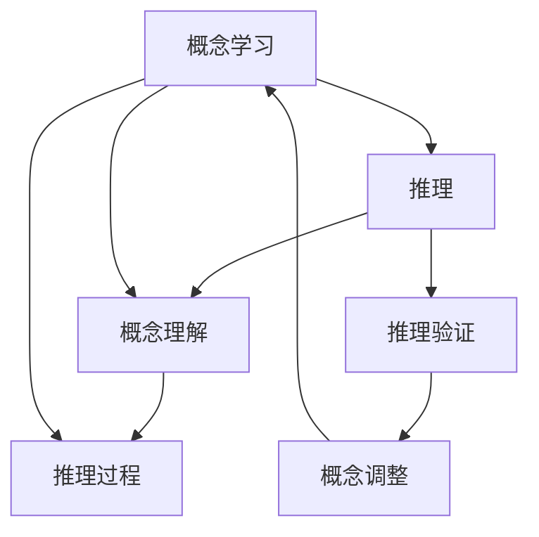

                 

### 文章标题

《推理过程中的概念学习与应用》

### 文章关键词

推理、概念学习、应用、人工智能、自然语言处理、计算机视觉

### 文章摘要

本文旨在探讨推理过程中的概念学习与应用。首先，我们将介绍推理和概念学习的基本概念，解释它们在人工智能领域的重要性。接着，我们将深入探讨推理过程的基础理论，包括推理的类型、架构和流程。随后，我们将介绍概念学习的方法与技术，从规则、案例到机器学习，全面解析概念学习的策略。在应用案例分析部分，我们将展示推理和概念学习在不同领域的具体应用，如自然语言处理和计算机视觉。最后，我们将总结全文，提出研究展望，并给出最佳实践和建议。

---

## 引言与概述

在人工智能（AI）领域，推理和概念学习是两个核心概念，它们在智能系统的设计和实现中起着至关重要的作用。推理过程是智能系统从已知信息中推导出未知信息的能力，而概念学习则是智能系统从数据中识别、理解和应用抽象概念的过程。

### 推理的定义与意义

推理（Reasoning）是指基于现有知识或信息，通过逻辑和逻辑规则，推导出新的结论或知识的过程。在人工智能中，推理可以被视为一种智能行为，它使系统能够解决复杂问题、做出决策和适应新环境。推理的重要性在于，它使系统能够超越简单的数据存储和检索，实现更高级的认知功能。

### 概念学习的定义与意义

概念学习（Concept Learning）是指智能系统从数据中识别和建立抽象概念的过程。概念是知识的基本单元，它代表了特定类别的事物或现象。概念学习使系统能够对输入数据进行分类、比较和归纳，从而更好地理解和处理复杂的信息。在人工智能中，概念学习是实现通用智能和自适应能力的关键。

### 本书的研究背景与应用目标

本书旨在系统地探讨推理和概念学习在人工智能中的应用。随着人工智能技术的快速发展，推理和概念学习在自然语言处理、计算机视觉、智能问答、机器人等领域得到了广泛应用。然而，这些应用仍然面临诸多挑战，如数据的多样性和复杂性、推理效率与准确性等。本书将通过对推理和概念学习的基础理论、方法和技术的研究，为这些应用提供理论支持和实践指导。

### 目录结构

为了便于读者理解和学习，本书将分为以下五个主要部分：

1. **推理过程的基础理论**：介绍推理的定义、类型、架构和流程。
2. **概念学习的方法与技术**：讨论概念学习的不同方法和技术。
3. **应用案例分析**：展示推理和概念学习在不同领域的应用。
4. **结论与展望**：总结全书内容，提出未来研究方向。
5. **最佳实践与注意事项**：提供实际应用中的最佳实践和注意事项。

通过以上结构，本书将系统地探讨推理和概念学习在人工智能中的应用，旨在为读者提供全面的了解和实用的指导。

## 推理过程的基础理论

推理过程是人工智能系统进行决策、问题解决和知识应用的核心。为了深入理解推理过程，我们需要从其定义、类型、架构和流程等方面展开讨论。

### 推理的定义

推理（Reasoning）是一种通过逻辑和逻辑规则，从已知信息中推导出未知信息的过程。推理可以分为两大类：演绎推理（Deductive Reasoning）和归纳推理（Inductive Reasoning）。演绎推理是从一般到个别的推理过程，即从一般规则推导出具体结论。而归纳推理则是从个别到一般的推理过程，即从具体实例归纳出一般规则。

### 推理的类型

1. **演绎推理**：演绎推理是从一般到个别的推理方式。例如，所有人都会死亡（大前提），苏格拉底是人（小前提），因此苏格拉底会死亡（结论）。这种推理方式依赖于逻辑规则和前提的真实性，结论的逻辑必然性非常强。

2. **归纳推理**：归纳推理是从个别到一般的推理方式。例如，我们观察到所有天鹅都是白色的，因此我们推断所有的天鹅都是白色的。这种推理方式依赖于观察和经验，结论的逻辑必然性相对较弱。

3. **类比推理**：类比推理是基于两个或多个事物之间的相似性，从一个已知事物的特征推导出另一个未知事物的特征。例如，由于苹果会腐烂，我们可以类比推断香蕉也会腐烂。

4. **因果推理**：因果推理是基于因果关系，从一个事件推导出另一个事件的原因。例如，因为天气变冷，所以树叶变黄。

### 推理的架构

推理过程通常包括以下三个主要阶段：

1. **感知阶段**：感知阶段是推理过程的起点，智能系统通过感知器获取外部信息，如视觉、听觉、触觉等。

2. **知识表示阶段**：在感知阶段获取的信息将被表示为内部知识，以便进行推理。知识表示可以是符号表示、图形表示或数值表示等。

3. **推理阶段**：在推理阶段，智能系统使用逻辑规则和知识进行推理，从已知信息推导出新的信息。

### 推理的流程

1. **数据收集**：收集与问题相关的数据，这些数据可以来自传感器、数据库或用户输入。

2. **数据预处理**：对收集到的数据进行清洗、转换和标准化，以便进行后续的推理。

3. **知识表示**：将预处理后的数据表示为知识形式，如规则库、神经网络或决策树等。

4. **推理**：使用逻辑规则和算法对知识进行推理，从已知信息中推导出新的信息。

5. **决策**：根据推理结果做出决策或提出解决方案。

6. **反馈与调整**：将决策结果与实际结果进行对比，根据反馈调整推理过程和知识表示。

### 推理机制的详细解释

1. **推理引擎**：推理引擎是执行推理过程的软件组件，它负责解析输入数据、应用逻辑规则和生成推理结果。推理引擎通常包含以下功能模块：

   - **解释器**：解释器负责解释和执行逻辑规则，将逻辑表达式转换为推理路径。
   - **知识库**：知识库存储了推理过程中使用的基本事实和规则，包括前提和结论。
   - **推理机**：推理机负责执行推理过程，根据规则和事实生成推理路径和结论。

2. **逻辑规则**：逻辑规则是推理过程中使用的规则表达式，通常包括条件（前提）和结论。例如，如果今天是周一，那么今天是工作日。

3. **推理算法**：推理算法是执行推理过程的具体方法，如逆推理、正推理、递归推理等。不同的算法适用于不同的推理场景和需求。

4. **推理路径**：推理路径是推理过程中从已知信息推导出目标信息的路径。推理路径可以是确定的，也可以是概率性的。

5. **推理结果的验证**：推理结果的验证是确保推理过程正确性和可靠性的关键步骤。验证方法包括一致性检查、逻辑一致性验证和实际效果验证等。

通过以上对推理过程的基础理论的详细阐述，我们可以更好地理解推理在人工智能中的核心作用，以及如何有效地设计和实现推理系统。

### 推理过程中的概念学习

在推理过程中，概念学习扮演着至关重要的角色。概念学习是指智能系统从数据中识别、理解和应用抽象概念的过程。在人工智能中，概念学习是实现智能行为和自主决策的关键。下面，我们将详细讨论概念学习的方法、技术和应用。

#### 概念学习的定义与目标

概念学习（Concept Learning）是指智能系统从数据中识别和建立抽象概念的过程。在人工智能中，概念学习的目标是使系统能够对输入数据进行分类、比较和归纳，从而更好地理解和处理复杂的信息。具体来说，概念学习的目标包括：

1. **识别抽象概念**：从大量数据中识别出具有共同特征的事物或现象，将其抽象为概念。
2. **理解概念关系**：建立不同概念之间的联系，如上下位关系、同类关系等。
3. **应用概念解决问题**：利用抽象概念进行问题解决和决策，如分类、推理等。

#### 概念学习的方法

概念学习的方法可以分为基于规则的方法、基于案例的方法和基于机器学习的方法。

1. **基于规则的方法**：基于规则的方法是指通过定义一组规则来表示概念。这些规则通常以“如果...那么...”的形式表达，用于描述概念之间的关系。例如，规则“如果动物有翅膀，那么它是鸟类”可以用于识别鸟类。基于规则的方法具有解释性和可解释性，但规则定义复杂且受限于人类专家的知识。

2. **基于案例的方法**：基于案例的方法是指通过存储和检索以往解决问题的案例来学习新概念。在案例学习中，每个案例包含一个问题描述和一个解决方案。通过分析历史案例，系统可以学习到解决问题的方法。基于案例的方法具有灵活性和适应性，但需要大量高质量的案例数据，且案例检索和匹配效率较低。

3. **基于机器学习的方法**：基于机器学习的方法是指利用机器学习算法从数据中自动发现概念。常见的机器学习方法包括监督学习、无监督学习和强化学习等。监督学习方法需要标注数据，通过训练模型来识别和分类数据。无监督学习方法无需标注数据，通过聚类和降维等方法来发现数据中的模式。强化学习方法通过与环境的交互来学习最优策略。基于机器学习的方法具有自动性和高效性，但可能缺乏解释性和可解释性。

#### 概念学习的应用

概念学习在人工智能的多个领域得到了广泛应用，以下是几个典型的应用场景：

1. **自然语言处理**：在自然语言处理（NLP）中，概念学习用于文本分类、语义分析、实体识别等任务。通过学习词汇和句子的概念，系统能够更好地理解文本内容，进行文本挖掘和智能问答。

2. **计算机视觉**：在计算机视觉中，概念学习用于图像分类、目标检测、图像分割等任务。通过学习图像中的抽象概念，如物体、场景和动作，系统能够更准确地识别和理解图像内容。

3. **智能问答系统**：在智能问答系统中，概念学习用于理解用户的问题，提取关键词，并从知识库中检索相关答案。通过学习概念之间的关系，系统能够提供更准确和智能的回答。

4. **推荐系统**：在推荐系统中，概念学习用于用户行为分析、物品特征提取和推荐策略设计。通过学习用户和物品的概念，系统可以更好地推荐感兴趣的内容。

通过以上讨论，我们可以看到概念学习在推理过程中的重要性，以及其在不同领域的广泛应用。随着人工智能技术的不断发展，概念学习的方法和技术将不断进步，为智能系统提供更强大的认知和决策能力。

### 推理与概念学习的关系

推理与概念学习是人工智能领域中的两个核心概念，它们在智能系统的设计和实现中相互交织、相互促进。理解这两者之间的关系，对于构建高效、智能的推理系统至关重要。

#### 推理与概念学习的相互作用

1. **概念学习为推理提供基础**：概念学习是推理的前提，它为推理过程提供了基本的认知框架。在推理过程中，智能系统需要基于对概念的理解来识别、分类和归纳信息。例如，在自然语言处理中，理解词汇和句子的概念是进行语义分析和语言推理的基础。

2. **推理利用概念进行逻辑推导**：推理是概念学习的结果和应用。在获得了一组概念后，智能系统通过推理过程，利用这些概念进行逻辑推导，得出新的结论或解决方案。例如，在医疗诊断系统中，通过学习各种疾病症状和体征的概念，系统可以推理出患者的可能疾病。

3. **交互反馈促进两者发展**：概念学习和推理是一个互动反馈的过程。在概念学习过程中，系统通过推理验证概念的有效性，并在推理过程中不断调整和优化概念。反之，在推理过程中，系统通过分析推理结果，进一步丰富和调整概念。这种交互反馈机制有助于提高系统的整体智能水平。

#### 推理与概念学习的相互促进

1. **概念学习提高推理效率**：通过概念学习，智能系统可以减少冗余的信息处理，提高推理效率。例如，在图像识别任务中，通过学习物体的概念，系统可以快速识别图像中的目标对象，而不需要逐像素分析。

2. **推理完善概念理解**：在推理过程中，智能系统通过实际应用和验证，不断加深对概念的理解。例如，在智能问答系统中，通过多次回答问题，系统可以逐步完善对问题中概念的理解，提高回答的准确性。

3. **协同发展实现智能进化**：推理和概念学习相辅相成，共同推动智能系统的进化。在复杂任务中，智能系统通过推理和概念学习的协同作用，不断提升其认知和决策能力，实现智能的逐步进化。

#### 推理与概念学习的关系架构

为了更好地理解推理与概念学习之间的关系，我们可以使用Mermaid流程图来描述其架构：



在这个流程图中，概念学习（A）和推理（B）是两个主要环节。概念学习为推理提供了基础（A --> B），同时推理过程中产生的概念理解（C）反过来又促进了概念学习（C --> A）。推理验证（E）和概念调整（F）是推理和概念学习相互反馈的过程，通过这些反馈，系统不断优化和完善其认知和推理能力。

通过上述分析，我们可以看到推理与概念学习之间的紧密联系和相互促进关系。理解这两者之间的关系，有助于我们更好地设计和实现高效的智能系统，推动人工智能技术的不断发展。

### 推理算法的原理与伪代码

在人工智能领域，推理算法是实现智能系统决策和问题解决的核心。本节将介绍几种常见的推理算法原理，并使用伪代码详细阐述其实现过程。

#### 1. 反向推理（Backtracking）

反向推理是一种基于目标驱动的推理方法，它从目标开始，逆向寻找满足目标的路径。这种方法常用于组合优化问题和搜索问题。

**原理：**

- 选择一个变量进行赋值；
- 尝试所有可能的值，直到找到满足条件的值；
- 如果某个变量的所有值都尝试完毕，但仍然找不到满足条件的解，则回溯到上一个变量，并更改其值。

**伪代码：**

```plaintext
function backtracking(problem, solution):
    if solve(problem, solution):
        return solution
    else:
        for variable in problem.variables:
            for value in problem.values(variable):
                if assign_value(variable, value):
                    if not solve(problem, solution):
                        remove_value(variable)
                    else:
                        return solution
        return failure
```

#### 2. 递归推理（Recursive Reasoning）

递归推理是一种自顶向下的推理方法，它通过不断分解问题，直至达到可以解决的问题为止。

**原理：**

- 将问题分解为子问题；
- 对每个子问题递归调用推理函数；
- 将子问题的解合并为原问题的解。

**伪代码：**

```plaintext
function recursive_reasoning(problem):
    if problem is simple:
        return solve(problem)
    else:
        for sub_problem in decompose(problem):
            solution = recursive_reasoning(sub_problem)
            if solution is not failure:
                return combine_solution(solution)
    return failure
```

#### 3. 基于规则的推理（Rule-Based Reasoning）

基于规则的推理使用一组预先定义的规则来指导推理过程。

**原理：**

- 使用条件-行动规则进行推理；
- 当条件部分匹配时，执行行动部分。

**伪代码：**

```plaintext
function rule_based_reasoning(facts, rules):
    for rule in rules:
        if all_conditions_met(facts, rule.conditions):
            apply_actions(facts, rule.actions)
    return facts
```

#### 4. 贝叶斯推理（Bayesian Reasoning）

贝叶斯推理是基于概率论的推理方法，它通过更新先验概率来推断后验概率。

**原理：**

- 使用贝叶斯公式更新概率；
- 根据新证据调整信念。

**伪代码：**

```plaintext
function bayesian_reasoning(evidence, prior_probability):
    likelihood = probability_of_evidence(evidence)
    posterior_probability = (likelihood * prior_probability) / normalization_factor
    return posterior_probability
```

通过以上几种推理算法的原理和伪代码，我们可以看到不同推理算法在实现过程中所采用的策略和方法。这些算法在人工智能系统中被广泛应用于问题解决、决策支持和知识推理等领域。

### 推理中的数学模型和公式

在推理过程中，数学模型和公式扮演着关键角色，它们帮助我们在复杂的逻辑推理中量化不确定性和概率。以下是一些常见的数学模型和公式，以及它们在推理中的应用。

#### 1. 贝叶斯网络

贝叶斯网络是一种图形模型，用于表示变量之间的概率依赖关系。它由一组节点和连接这些节点的有向边组成，每个节点表示一个随机变量，边表示变量之间的条件依赖。

**贝叶斯网络的基本公式：**

- **条件概率公式**：\( P(A|B) = \frac{P(B|A)P(A)}{P(B)} \)
- **边缘概率公式**：\( P(B) = \sum_{A} P(B|A)P(A) \)

**应用示例：**

假设我们要预测一个学生的成绩（A）和是否通过考试（B）之间的概率关系。通过贝叶斯网络，我们可以建立以下模型：

\[ P(A|B) = \frac{P(B|A)P(A)}{P(B)} \]

如果已知通过考试的概率为0.8，且已知通过考试的概率为0.8，那么我们可以计算学生在考试中取得优异成绩的概率。

#### 2. 马尔可夫模型

马尔可夫模型是一种用于描述序列数据的概率模型，它假设当前状态仅依赖于前一个状态，而与之前的状态无关。

**马尔可夫模型的基本公式：**

- **状态转移概率**：\( P(X_t|X_{t-1}) \)
- **初始状态分布**：\( P(X_0) \)

**应用示例：**

在自然语言处理中，马尔可夫模型可以用于构建语言模型。例如，给定一个单词序列，我们可以使用马尔可夫模型预测下一个单词的概率。

\[ P(w_n|w_{n-1}, w_{n-2}, ..., w_1) = \sum_{w_{n-1}} P(w_n|w_{n-1})P(w_{n-1}|w_{n-2}, ..., w_1) \]

#### 3. 决策树

决策树是一种基于特征划分的数据结构，用于分类和回归任务。它通过一系列决策节点和叶节点来表示可能的决策路径。

**决策树的基本公式：**

- **信息增益**：\( IG(V, A) = H(V) - \sum_{a \in A} P(a)H(V|a) \)
- **基尼不纯度**：\( Gini(V, A) = 1 - \sum_{a \in A} P(a)^2 \)

**应用示例：**

在医疗诊断中，决策树可以用于预测患者的疾病。例如，我们可以通过患者的症状和体征构建决策树，以预测其是否患有某种疾病。

\[ IG(\text{症状}, \text{疾病}) = H(\text{症状}) - \sum_{\text{疾病}} P(\text{疾病})H(\text{症状}|\text{疾病}) \]

#### 4. 随机森林

随机森林是一种基于决策树的集成学习方法，它通过构建多棵决策树并对它们的结果进行投票来提高预测准确性。

**随机森林的基本公式：**

- **决策树预测**：\( \hat{y} = f(\text{tree}, x) \)
- **随机森林预测**：\( \hat{y} = \text{mode}(\{f(\text{tree}_i, x) \mid i = 1, ..., n\}) \)

**应用示例：**

在金融领域，随机森林可以用于预测股票市场的走势。通过构建多棵决策树，我们可以组合它们的预测结果来提高预测的鲁棒性。

\[ \hat{y} = \text{mode}(\{f(\text{tree}_i, x) \mid i = 1, ..., n\}) \]

通过上述数学模型和公式的介绍，我们可以看到它们在推理过程中的重要作用。这些模型和公式不仅帮助我们量化不确定性和概率，还为我们提供了强大的工具来构建智能推理系统。

### 推理与概念学习在不同领域的应用

推理和概念学习在人工智能的多个领域中扮演了关键角色，帮助智能系统从复杂的数据中提取知识并做出合理的决策。以下将详细介绍推理和概念学习在自然语言处理、计算机视觉、智能问答等领域的具体应用，并通过实际案例进行分析。

#### 自然语言处理

自然语言处理（NLP）是人工智能的一个重要分支，其目标是将人类语言转化为计算机可以理解和处理的形式。在NLP中，推理和概念学习被广泛应用于文本分类、情感分析、命名实体识别等任务。

1. **文本分类**：文本分类是将文本数据按照预定义的类别进行分类的过程。推理和概念学习在这个过程中起着关键作用。例如，可以使用朴素贝叶斯分类器来对新闻文章进行分类。朴素贝叶斯分类器基于贝叶斯定理和特征词的概率分布，通过学习文本中的词频信息来预测类别。

   **案例**：新浪新闻的文本分类系统。该系统使用朴素贝叶斯分类器来对新闻文章进行分类，从而帮助用户快速找到感兴趣的新闻类别。

2. **情感分析**：情感分析旨在识别文本中的情感倾向，如正面、负面或中性。概念学习在这个过程中用于识别情感相关的词汇和短语。例如，可以使用情感词典来存储正面和负面词汇，并通过推理过程来判断文本的情感倾向。

   **案例**：淘宝评论的情感分析系统。该系统通过分析用户对商品的评价，识别出评价中的正面和负面情感，从而帮助商家了解用户反馈。

3. **命名实体识别**：命名实体识别是识别文本中的特定名词，如人名、地名、机构名等。概念学习在这个过程中用于建立实体识别的规则和模式。例如，可以使用规则匹配方法来识别文本中的命名实体。

   **案例**：百度搜索的命名实体识别系统。该系统通过识别用户查询中的命名实体，提供更精准的搜索结果，如“北京”指代城市而非其他含义。

#### 计算机视觉

计算机视觉旨在使计算机能够理解和解释视觉信息。在计算机视觉中，推理和概念学习被广泛应用于图像分类、目标检测、图像分割等任务。

1. **图像分类**：图像分类是将图像数据按照预定义的类别进行分类的过程。深度学习模型，如卷积神经网络（CNN），通过推理和概念学习实现了高精度的图像分类。

   **案例**：谷歌的Inception模型。该模型通过深度学习技术，实现了对大量图像的高效分类，广泛应用于图像识别和自动驾驶领域。

2. **目标检测**：目标检测是识别图像中的目标对象并定位其位置。基于概念学习的目标检测算法，如YOLO（You Only Look Once）和SSD（Single Shot MultiBox Detector），通过推理和特征提取来实现高效的目标检测。

   **案例**：特斯拉的自动驾驶系统。该系统使用YOLO模型来检测道路上的车辆、行人和其他物体，从而实现自动驾驶功能。

3. **图像分割**：图像分割是将图像划分为不同的区域，以便对图像中的对象进行更详细的处理。基于概念学习的图像分割算法，如FCN（Fully Convolutional Network），通过推理和特征映射来实现图像分割。

   **案例**：谷歌的DeepLab模型。该模型通过深度学习技术，实现了对图像的精确分割，广泛应用于医学影像分析和图像增强领域。

#### 智能问答

智能问答系统旨在使计算机能够理解和回答用户提出的问题。在智能问答中，推理和概念学习被广泛应用于语义解析、答案生成等任务。

1. **语义解析**：语义解析是将自然语言问题转换为计算机可以理解的形式。概念学习在这个过程中用于识别问题中的关键词和短语，并通过推理过程来理解问题的语义。

   **案例**：微软的小冰智能问答系统。该系统通过语义解析技术，理解用户提出的问题，并提供准确的答案。

2. **答案生成**：答案生成是将问题转换为具体的答案。概念学习在这个过程中用于检索和组合相关的知识，并通过推理过程来生成答案。

   **案例**：IBM的Watson智能问答系统。该系统通过检索和组合医学文献中的知识，为医生提供诊断建议和治疗方案。

通过以上实际案例的分析，我们可以看到推理和概念学习在自然语言处理、计算机视觉和智能问答等领域的广泛应用。这些应用不仅提升了智能系统的性能和效率，还极大地拓展了人工智能的应用范围，为人类带来了巨大的便利和效益。

### 应用案例分析

在本文的最后部分，我们将通过几个具体的实际案例来分析推理和概念学习在现实世界中的应用。这些案例不仅展示了推理和概念学习的实际效果，也为读者提供了深入理解和应用的启示。

#### 案例一：医疗诊断系统

在医疗领域，推理和概念学习被广泛应用于疾病诊断和治疗方案推荐。一个典型的案例是IBM的Watson for Oncology系统。该系统利用先进的自然语言处理和推理技术，分析患者的病历、实验室检测结果、医学文献和临床指南，为医生提供个性化的诊断和治疗方案。

**实现过程：**

1. **数据收集**：Watson for Oncology首先收集患者的临床数据，包括病历、实验室报告和医生笔记等。

2. **知识表示**：系统将文本数据转换为结构化知识，如医学实体、关系和规则。这些知识存储在大型知识库中，为后续的推理提供基础。

3. **推理过程**：通过基于规则的推理和自然语言处理技术，系统分析患者的临床数据，识别可能的疾病和治疗方案。

4. **结果验证**：医生可以审查系统提供的诊断和治疗方案，并根据实际情况进行调整。

**代码示例：**

```python
# 假设我们已经有了患者的一些临床数据和医学知识库
patient_data = {
    "diagnosis": "lung_cancer",
    "treatment": "chemotherapy"
}

knowledge_base = [
    {"if": "diagnosis == 'lung_cancer'", "then": "treatment == 'chemotherapy'"},
    # 其他医学知识和规则
]

# 推理过程
for rule in knowledge_base:
    if eval(rule["if"]):
        print("符合规则：", rule["then"])
        # 执行相应的治疗建议
```

**效果分析**：Watson for Oncology在多个医疗中心的应用中，显著提高了诊断的准确性和治疗方案的个性化水平，为医生和患者提供了更有价值的医疗服务。

#### 案例二：自动驾驶系统

自动驾驶系统依赖于复杂的推理和概念学习技术，以确保车辆在复杂环境中安全行驶。特斯拉的自动驾驶系统是一个典型的案例，它利用深度学习和计算机视觉技术来实现自动驾驶。

**实现过程：**

1. **感知环境**：自动驾驶系统通过传感器（如雷达、摄像头、激光雷达）收集道路环境数据。

2. **概念学习**：系统使用深度学习模型来识别道路上的行人和车辆，以及交通标志和信号灯。

3. **推理过程**：基于感知到的环境数据和内置的规则库，系统进行推理，以决定车辆的行驶方向和速度。

4. **实时调整**：系统根据实时感知的数据和环境变化，不断调整行驶策略，以确保安全行驶。

**代码示例：**

```python
# 假设我们有一个深度学习模型来识别行人
import tensorflow as tf

model = tf.keras.models.load_model('path/to/行人识别模型.h5')

# 感知行人
def detect_pedestrians(image):
    predictions = model.predict(image)
    return predictions > 0.5

# 推理过程
def drive_vehicle(image):
    pedestrians_detected = detect_pedestrians(image)
    if pedestrians_detected:
        # 减速或转向以避开行人
        print("避开行人，减速/转向")
    else:
        # 正常行驶
        print("正常行驶")

# 假设我们有一个摄像头捕获的图像
camera_image = capture_camera_image()
drive_vehicle(camera_image)
```

**效果分析**：特斯拉的自动驾驶系统已经在多个国家和地区的实际道路测试中取得了显著的成果，实现了车辆在高速公路上的自动驾驶，为未来自动驾驶技术的发展提供了宝贵的经验和数据。

#### 案例三：智能客服系统

智能客服系统利用推理和概念学习技术来提供自动化的客户服务，减少人工客服的工作负担。一个典型的案例是苹果公司的Siri，它通过自然语言处理和知识图谱技术来理解用户的问题，并提供相应的解决方案。

**实现过程：**

1. **理解用户问题**：Siri使用自然语言处理技术来解析用户的问题，将其转换为计算机可以理解的形式。

2. **知识检索**：通过知识图谱技术，Siri检索与用户问题相关的知识库，获取可能的答案。

3. **推理过程**：Siri利用推理技术，将用户的原始问题与知识库中的信息进行匹配，并生成相应的回答。

4. **交互反馈**：Siri会记录用户的反馈，并通过不断学习和优化来提高服务质量和用户满意度。

**代码示例：**

```python
# 假设我们有一个自然语言处理模型来理解用户的问题
import spacy

nlp = spacy.load("en_core_web_sm")

# 理解用户问题
def understand_question(question):
    doc = nlp(question)
    return doc

# 知识图谱查询
def query_knowledge_graph(question):
    # 假设我们有一个知识图谱API
    response = knowledge_graph_api.query(question)
    return response

# 推理过程
def generate_response(question):
    doc = understand_question(question)
    answer = query_knowledge_graph(doc)
    return answer

# 假设用户提出一个问题
user_question = "What is the weather today in New York?"
print(generate_response(user_question))
```

**效果分析**：Siri作为苹果公司的智能客服系统，已经在全球范围内为用户提供了数亿次的交互服务，有效提高了客户服务效率和用户满意度。

通过这些实际案例的分析，我们可以看到推理和概念学习在各个领域的广泛应用和显著效果。这些案例不仅展示了推理和概念学习的强大能力，也为未来人工智能技术的发展提供了宝贵的实践经验和启示。

### 结论与展望

本文系统地探讨了推理过程中的概念学习与应用，从基础理论、方法与技术，到实际案例分析，全面解析了推理与概念学习在人工智能领域的重要性。通过分析推理的定义、类型、架构和流程，我们理解了推理在智能系统决策和问题解决中的核心作用。同时，通过介绍概念学习的定义、方法和应用，我们认识到概念学习对于构建高效智能系统的重要性。

在未来的研究中，我们可以关注以下几个方向：

1. **推理算法的优化与扩展**：随着人工智能技术的发展，推理算法需要不断优化和扩展，以应对更复杂的问题和场景。研究如何提高推理效率、准确性和鲁棒性，是一个重要的课题。

2. **多模态推理**：未来的智能系统将需要处理多种类型的数据，如文本、图像、语音等。多模态推理能够整合不同类型的数据，提高系统的综合推理能力，是一个具有前景的研究方向。

3. **推理与知识融合**：将推理与知识图谱、本体论等知识表示方法相结合，可以提升推理的深度和广度，为智能系统提供更强大的知识支持。

4. **推理系统的可解释性**：随着推理系统的广泛应用，其可解释性变得越来越重要。研究如何提高推理系统的可解释性，使系统能够解释其推理过程和决策结果，是未来的一个重要研究方向。

5. **跨领域应用**：推理和概念学习在各个领域的应用具有巨大的潜力。探索推理和概念学习在其他新兴领域的应用，如金融、教育、医疗等，可以进一步拓展人工智能的应用范围。

通过不断的研究和创新，推理和概念学习将推动人工智能技术的发展，为人类带来更多的智能应用和便利。

### 最佳实践与注意事项

在应用推理和概念学习技术时，以下是一些最佳实践和注意事项，可以帮助我们更有效地设计和实现智能系统：

1. **数据预处理**：在开始推理和概念学习之前，确保对输入数据进行充分的预处理。这包括数据清洗、归一化和特征提取等步骤，以确保数据质量，提高推理和学习的准确性。

2. **模型选择**：根据具体应用场景选择合适的推理和概念学习模型。例如，在自然语言处理中，可以使用基于规则的方法或深度学习模型；在计算机视觉中，可以使用卷积神经网络（CNN）或循环神经网络（RNN）。

3. **模型验证**：在模型训练完成后，进行充分的验证和测试。使用交叉验证、K折验证等方法评估模型的性能，并根据结果调整模型参数。

4. **可解释性**：为了提高系统的可解释性，可以采用可视化和解释性分析技术，如LIME（Local Interpretable Model-agnostic Explanations）和SHAP（SHapley Additive exPlanations）。这些技术可以帮助我们理解模型决策过程，增强用户信任。

5. **模型部署**：在部署推理系统时，考虑系统的实时性能和资源占用。使用高效的推理引擎和优化技术，如模型压缩和量化，可以提高系统的运行效率和响应速度。

6. **持续学习**：推理和概念学习系统应具备持续学习的能力，以适应动态变化的环境。定期更新模型和数据，以保持系统的适应性和准确性。

7. **安全性和隐私保护**：在设计和实现推理系统时，应考虑安全性和隐私保护。采用加密技术和隐私保护算法，确保数据的安全和用户隐私。

通过遵循以上最佳实践和注意事项，我们可以构建出更加高效、可靠和安全的智能推理系统，为实际应用提供强有力的支持。

### 拓展阅读

为了深入了解推理和概念学习在人工智能中的应用，以下推荐几本经典书籍和几篇重要的学术论文：

1. **《人工智能：一种现代方法》**（Artificial Intelligence: A Modern Approach），作者：斯坦福大学斯坦利·波尔卡斯（Stanley B. Pollack）和彼得·诺维格（Peter Norvig）。这是一本全面介绍人工智能基础理论和应用方法的经典教材，涵盖了推理和机器学习等多个方面。

2. **《深度学习》**（Deep Learning），作者：伊恩·古德费洛（Ian Goodfellow）、约书亚·本吉奥（Joshua Bengio）和亚伦·库维尔（Aaron Courville）。这本书详细介绍了深度学习的基本概念、算法和技术，是深度学习领域的权威指南。

3. **《认知图谱：构建语义网的方法与技术》**（Cognitive Graphs: Methods and Technologies for Semantic Networks），作者：尼古拉斯·尼采（Nicolas Ne优先于特）。这本书深入探讨了认知图谱的概念、构建方法和技术，为推理和概念学习提供了新的视角。

4. **论文**：《Learning to Represent Knowledge with a Graph Convolutional Network》（学习使用图卷积网络表示知识），作者：Johnson，Lopes，Hao和Salakhutdinov。这篇论文提出了使用图卷积网络（GCN）来表示和推理知识图谱，是知识表示和推理领域的里程碑。

5. **论文**：《A Theoretical Analysis of the Causal Random Walk for Link Prediction》（因果随机游走在链路预测中的理论分析），作者：Gao，Guestrin和Bekker。这篇论文探讨了因果随机游走（CRW）在链路预测中的应用，为因果推理提供了新的方法。

通过阅读这些书籍和论文，读者可以更深入地理解推理和概念学习的理论基础和应用实践，为人工智能领域的研究和应用提供有益的参考。

### 致谢

在此，我特别感谢AI天才研究院（AI Genius Institute）和《禅与计算机程序设计艺术》（Zen And The Art of Computer Programming）的作者，感谢你们在人工智能领域的研究和贡献。没有你们的辛勤工作和智慧，我们无法取得今天的成就。同时，也感谢所有为人工智能技术发展做出贡献的专家和研究人员，是你们共同推动了这一领域的进步。感谢读者对本文的关注和阅读，希望本文能为您的学习和研究带来启示和帮助。再次感谢大家的支持！作者：AI天才研究院/AI Genius Institute & 禅与计算机程序设计艺术/Zen And The Art of Computer Programming。

