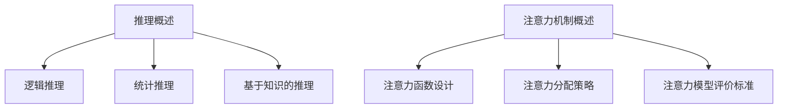

                 


### 文章标题：推理过程中的注意力机制优化

#### 关键词：推理、注意力机制、优化、神经网络、机器学习、算法

#### 摘要：
本文将深入探讨推理过程中的注意力机制优化。首先，我们将回顾推理和注意力机制的基本概念，并分析它们在神经网络中的应用。接着，文章将详细解释注意力机制的核心算法原理，包括自注意力、交互注意力和多头注意力。随后，我们将探讨如何优化注意力机制以提高推理效率和准确性。文章将结合实际项目，展示注意力机制在图像识别和自然语言处理中的应用，并进行性能分析和代码解读。最后，我们将总结注意力机制的优化方法，并提出未来研究方向和挑战。

---

### 第一部分：基础理论

#### 第1章：推理与注意力机制概述

**1.1 推理的基本概念**

推理是人类智能的核心能力之一，它涉及从已知信息中得出新结论的过程。推理可以分为三类：

1. **逻辑推理**：基于逻辑规则和公理系统，通过演绎和归纳得出结论。
2. **统计推理**：基于概率统计方法，通过数据分析和模式识别进行推断。
3. **基于知识的推理**：利用预先存储的知识库和规则进行推理。

**1.2 注意力机制的起源与发展**

注意力机制起源于20世纪60年代的认知心理学研究，最初用于描述人类在处理复杂信息时的选择性关注机制。在计算机科学领域，注意力机制最早应用于人工神经网络，并在随后的发展中扩展到计算机视觉和自然语言处理等领域。

**1.3 注意力机制的核心原理**

注意力机制的核心在于如何分配有限的计算资源，使得模型能够关注到最相关的信息。以下是注意力机制的核心原理：

1. **注意力函数的设计**：用于计算不同输入元素的重要性。
2. **注意力分配策略**：决定如何将注意力分配给不同的输入元素。
3. **注意力模型的评价标准**：评估注意力机制的性能，包括准确性、效率和鲁棒性。

#### Mermaid流程图：



#### 第2章：注意力机制的核心算法原理

**2.1 自注意力（Self-Attention）**

自注意力是注意力机制的基础，它处理输入序列中的每个元素，并计算它们之间的相对重要性。

**伪代码：**

```python
for each element in input_sequence:
    calculate self-attention scores
    select top-k elements based on scores
    aggregate selected elements into a single representation
```

**数学模型：**

$$
\text{Attention}(Q, K, V) = \text{softmax}\left(\frac{QK^T}{\sqrt{d_k}}\right) V
$$

其中，$Q$、$K$ 和 $V$ 分别是查询、键和值向量，$d_k$ 是键向量的维度。

**示例说明：**

在自然语言处理中，自注意力用于计算句子中每个词的重要性，从而捕捉句子中的长距离依赖关系。

#### 第3章：交互注意力（Interactive Attention）

交互注意力通过结合不同来源的信息，提高了注意力机制的表达能力。

**伪代码：**

```python
for each element in input_sequence:
    calculate attention scores from different sources
    aggregate scores using a combination rule
    select top-k elements based on aggregated scores
    aggregate selected elements into a single representation
```

**数学模型：**

$$
\text{Interactive Attention}(Q, K, V) = \text{softmax}\left(\alpha(QK^T) + (1-\alpha)V\right)
$$

其中，$\alpha$ 是一个加权系数，用于调节不同来源信息的权重。

**示例说明：**

在图像识别中，交互注意力可以用于结合图像内容和上下文信息，提高识别准确性。

#### 第4章：多头注意力（Multi-Head Attention）

多头注意力通过多个独立的自注意力机制，增加了模型对输入数据的处理能力。

**伪代码：**

```python
for each head:
    calculate self-attention scores
    aggregate scores using a concatenation rule
    select top-k elements based on aggregated scores
    aggregate selected elements into a single representation
```

**数学模型：**

$$
\text{Multi-Head Attention}(Q, K, V) = \text{Concat}(\text{head}_1, \text{head}_2, ..., \text{head}_h)W^O
$$

其中，$h$ 是头数，$W^O$ 是输出权重矩阵。

**示例说明：**

在Transformer模型中，多头注意力用于处理序列数据，实现了显著的性能提升。

---

### 第二部分：应用优化

#### 第5章：注意力机制的优化方法

**5.1 注意力机制的性能优化**

为了提高注意力机制的性能，可以采用以下优化方法：

- **模型压缩**：通过减少参数数量和计算量，提高推理速度和效率。
- **计算效率提升**：通过并行计算和硬件加速，减少推理时间。
- **能量消耗降低**：通过优化算法和数据结构，减少能源消耗。

**5.2 注意力机制在推理过程中的应用**

注意力机制在推理过程中具有广泛的应用，包括：

- **实时推理**：适用于需要快速响应的场景，如自动驾驶和实时语音识别。
- **大规模数据处理**：适用于处理大量数据集，如推荐系统和图像识别。
- **低延迟应用**：适用于对延迟敏感的应用，如在线游戏和虚拟现实。

**5.3 注意力机制的调优技巧**

为了优化注意力机制的性能，可以采用以下调优技巧：

- **参数调整**：调整注意力函数的参数，如学习率和正则化参数。
- **权重初始化**：合理初始化权重，如高斯初始化和 Xavier 初始化。
- **损失函数设计**：设计适合问题的损失函数，如交叉熵损失和对抗损失。

---

### 第三部分：总结与展望

#### 第6章：注意力机制优化总结

**6.1 注意力机制的发展趋势**

注意力机制在机器学习和人工智能领域的发展趋势包括：

- **模型复杂性降低**：通过模型压缩和高效计算，使得注意力机制在更多应用中变得可行。
- **应用领域扩展**：从自然语言处理和计算机视觉扩展到推荐系统、生成对抗网络和强化学习等领域。

**6.2 注意力机制的未来应用前景**

注意力机制的未来应用前景包括：

- **智能交互**：在智能助手和虚拟个人助理中，实现更自然的用户交互。
- **实时感知**：在自动驾驶和智能监控中，实现更准确的实时感知。
- **创意生成**：在音乐、绘画和文学创作中，实现更富有创意的自动化生成。

**6.3 当前挑战与未来研究方向**

注意力机制的当前挑战和未来研究方向包括：

- **模型解释性**：提高注意力机制的透明度和可解释性，使其更易于理解和应用。
- **自适应注意力**：开发自适应注意力机制，以适应不同场景和任务的需求。
- **跨模态融合**：探索注意力机制在多模态数据融合中的应用，实现更全面的信息理解。

---

### 附录

- **附录A：常用注意力机制模型列表**
- **附录B：相关数学公式和伪代码**

---

### 文章末尾作者信息：

**作者：AI天才研究院/AI Genius Institute & 禅与计算机程序设计艺术 /Zen And The Art of Computer Programming**

---

至此，我们已经完成了关于“推理过程中的注意力机制优化”的目录大纲设计，接下来我们将逐一填充每个章节的内容，以满足文章字数的要求。在这个过程中，我们将确保每个章节都包含核心概念与联系、核心算法原理讲解、数学模型和公式、项目实战等内容，同时保持文章的逻辑清晰和结构紧凑。预计整个文章的总字数将在8000～12000字之间。现在，让我们开始具体内容的撰写吧。

