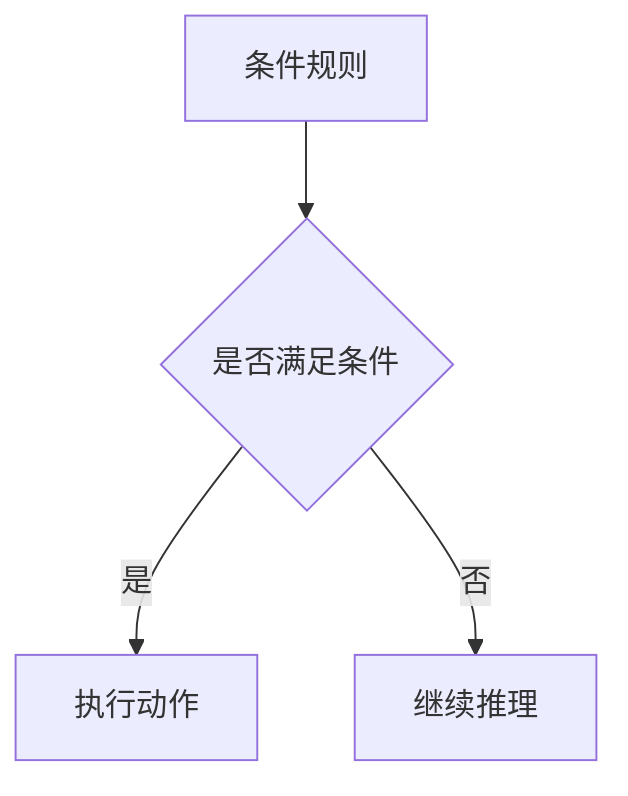
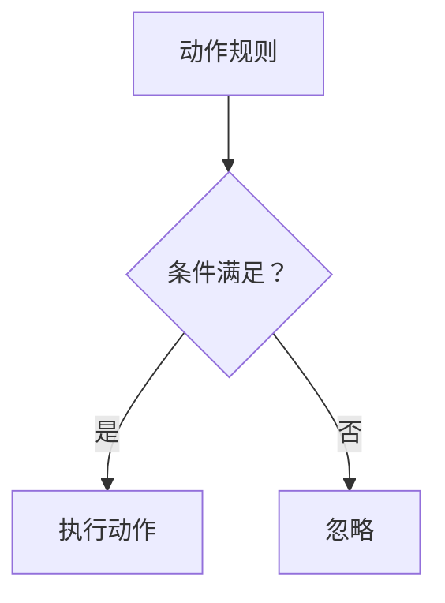
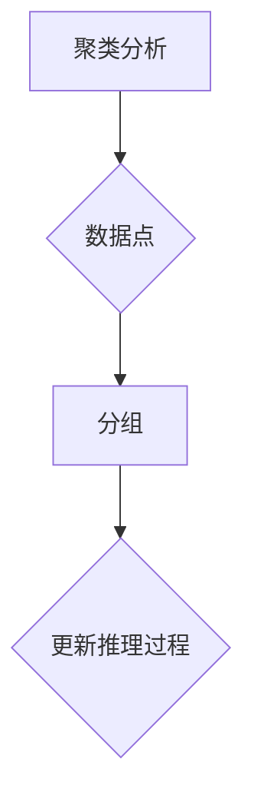
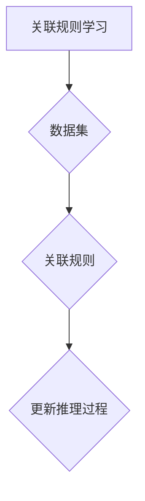

                 

# 文章标题：推理过程的动态调整与优化方法

## 关键词：
- 推理过程
- 动态调整
- 优化方法
- 人工智能
- 数据挖掘

## 摘要：
本文深入探讨了推理过程的动态调整与优化方法。首先，介绍了推理过程的基本概念、重要性以及在不同领域的应用。接着，阐述了动态调整的原理、方法及应用场景。随后，重点讨论了优化方法，包括常见算法的原理及比较。文章最后通过实际案例展示了优化方法的应用效果，并对未来发展趋势进行了展望。本文旨在为读者提供一份全面、系统的推理过程动态调整与优化方法的指南。

## 第1章 引言

### 1.1 推理过程的基本概念

推理过程是指从已知的事实或信息出发，通过逻辑推理得出结论或判断的过程。它通常包括两个主要部分：前提和结论。前提是推理的基础，结论是基于前提推导出的结果。推理过程在人类思维和计算机科学中扮演着重要角色，它不仅帮助我们理解和解决问题，还使得人工智能系统能够自主学习和决策。

在计算机科学中，推理过程广泛应用于多个领域，如人工智能、自然语言处理、数据挖掘等。例如，在人工智能领域，推理过程是构建智能代理和自动化决策系统的核心。在自然语言处理中，推理过程用于理解和生成文本。在数据挖掘中，推理过程用于发现数据中的模式和关联。

### 1.2 动态调整的意义

在现实世界中，信息是不确定的，且随时可能发生变化。因此，推理过程也需要能够适应这些变化，这就是动态调整的意义所在。动态调整指的是在推理过程中，根据新的信息或条件，对已有推理过程进行调整和优化，以获得更准确、更有效的推理结果。

动态调整的重要性体现在以下几个方面：

1. **适应不确定性**：现实世界中的信息往往是模糊的、不确定的，动态调整能够使推理过程适应这种不确定性，提高推理的鲁棒性。
2. **提高效率**：通过动态调整，可以避免冗余的计算和推理，从而提高推理过程的效率。
3. **增强灵活性**：动态调整使推理过程能够根据不同的应用场景和需求进行灵活调整，满足多样化的需求。

### 1.3 优化方法的重要性

优化方法在推理过程中起着至关重要的作用。优化方法旨在通过改进推理过程，使其更加高效、准确和鲁棒。以下是一些优化方法的重要性：

1. **提高推理速度**：优化方法可以减少推理过程中的计算复杂度，提高推理速度。
2. **提高推理准确性**：优化方法可以通过改进推理算法和模型，提高推理结果的准确性。
3. **增强推理鲁棒性**：优化方法可以增强推理过程对噪声和异常数据的鲁棒性，使其在不确定的环境中仍能正常运行。

### 总结

本章介绍了推理过程的基本概念、动态调整的意义和优化方法的重要性。下一章将深入探讨动态调整的原理和方法。

## 第2章 动态调整的原理与方法

### 2.1 动态调整的原理

动态调整的原理主要基于以下几个方面：

1. **信息反馈**：在推理过程中，不断收集新的信息，并将其反馈到推理系统中。这些信息可以是来自环境的数据、用户输入或其他系统的输出。
2. **推理重调度**：根据新的信息，对推理过程进行重新调度，调整推理的优先级、顺序和方向。
3. **推理结果修正**：利用新的信息和推理结果，对已有的推理结论进行修正，以提高推理的准确性。

### 2.2 动态调整方法

动态调整方法可以分为基于规则的方法和基于数据的方法。

#### 2.2.1 基于规则的方法

基于规则的方法主要利用一组预定义的规则，根据新信息对推理过程进行调整。这些规则通常包括条件规则和动作规则。

**条件规则**：描述了在何种情况下需要执行何种动作。


**动作规则**：描述了在满足条件的情况下需要执行的动作。


#### 2.2.2 基于数据的方法

基于数据的方法主要利用数据挖掘和机器学习技术，对新的信息进行自动分析和处理，从而调整推理过程。

**聚类分析**：将相似的数据点分为一组，用于发现数据中的模式和关联。


**关联规则学习**：发现数据之间的关联关系，用于指导推理过程。


### 2.3 动态调整的应用场景

动态调整方法广泛应用于多个领域，如智能客服、自动驾驶、智能医疗等。

#### 2.3.1 智能客服

在智能客服系统中，动态调整用于根据用户行为和反馈，实时调整对话策略，以提高客服的效率和用户体验。

**伪代码**：
```python
def adjust_dialogue(user_input, current_state):
    if user_input matches rule_1:
        execute_action_1
    elif user_input matches rule_2:
        execute_action_2
    else:
        execute_default_action
    update_state
```

#### 2.3.2 自动驾驶

在自动驾驶系统中，动态调整用于根据实时路况和环境变化，调整驾驶策略，确保安全行驶。

**伪代码**：
```python
def adjust_driving_state(sensor_data, route_plan):
    if sensor_data indicates obstacle:
        adjust_route_plan
    elif sensor_data indicates traffic_jam:
        adjust_speed
    else:
        continue_with_route_plan
    update_state
```

### 2.4 动态调整的挑战与解决方案

动态调整面临的主要挑战包括：

1. **实时性**：需要快速响应当前状态的变化。
   - **解决方案**：使用高效的算法和并行计算技术。
2. **准确性**：需要准确识别和调整推理过程。
   - **解决方案**：利用大数据和机器学习技术，提高信息处理的准确性。
3. **复杂性**：需要处理大量的信息和规则。
   - **解决方案**：采用模块化和分而治之的策略，降低系统的复杂性。

### 总结

本章详细介绍了动态调整的原理、方法及其应用场景。下一章将深入探讨优化方法。

## 第3章 优化方法

### 3.1 优化方法的基本概念

优化方法旨在通过改进推理过程，使其在给定条件下达到最优或近似最优的状态。优化方法可以分为两大类：全局优化和局部优化。

- **全局优化**：考虑所有可能的解，寻找最优解。这种方法通常需要大量的计算资源，但能保证找到全局最优解。
- **局部优化**：在当前状态下，寻找局部最优解。这种方法计算复杂度较低，但可能陷入局部最优，无法保证全局最优。

### 3.2 常见优化算法

以下介绍几种常见的优化算法：

#### 3.2.1 遗传算法

遗传算法是一种基于自然进化过程的优化算法。它模拟生物进化中的遗传、变异和选择过程，通过迭代优化，找到最优解。

**遗传算法的流程**：
1. **初始化种群**：随机生成一组初始解。
2. **适应度评估**：计算每个解的适应度，适应度越高，表示解的质量越好。
3. **选择**：根据适应度选择优秀个体进行交配。
4. **交叉**：选择两个优秀个体进行交叉，生成新的个体。
5. **变异**：对个体进行随机变异，增加解的多样性。
6. **更新种群**：将新个体加入种群，替换适应度较低的个体。

**伪代码**：
```python
def genetic_algorithm(population, fitness_function):
    while not convergence:
        new_population = []
        for individual in population:
            if fitness_function(individual) > threshold:
                new_population.append(individual)
        population = crossover_and_mutate(population)
    return best_individual(population)
```

#### 3.2.2 人工神经网络

人工神经网络是一种基于人脑神经元连接方式的计算模型，通过学习大量数据，实现对复杂函数的逼近和优化。

**神经网络的基本结构**：
1. **输入层**：接收输入数据。
2. **隐藏层**：对输入数据进行处理。
3. **输出层**：产生输出结果。

**神经网络的工作原理**：
- **前向传播**：将输入数据传递到输出层。
- **反向传播**：根据输出误差，调整网络权重。

**伪代码**：
```python
def neural_network(input_data, weights):
    hidden_layer = forward_propagation(input_data, weights['input_hidden'])
    output_layer = forward_propagation(hidden_layer, weights['hidden_output'])
    error = calculate_error(output_layer, target)
    weights = backpropagation(error, weights)
    return output_layer
```

#### 3.2.3 粒子群优化

粒子群优化是一种基于群体智能的优化算法，模拟鸟群觅食过程，通过迭代优化，找到最优解。

**粒子群优化的流程**：
1. **初始化粒子群**：随机生成一组粒子。
2. **评估适应度**：计算每个粒子的适应度。
3. **更新粒子位置和速度**：根据适应度和全局最优解，更新粒子的位置和速度。
4. **迭代**：重复评估适应度和更新粒子的过程，直至满足终止条件。

**伪代码**：
```python
def particle Swarm Optimization(population, fitness_function):
    while not convergence:
        for particle in population:
            if fitness_function(particle) > personal_best:
                personal_best = fitness_function(particle)
            if fitness_function(particle) > global_best:
                global_best = fitness_function(particle)
        update_particles(population, personal_best, global_best)
    return global_best
```

### 3.3 优化方法的比较与选择

不同优化方法各有优缺点，选择合适的优化方法需要考虑以下几个方面：

1. **问题特性**：根据问题的特点，选择合适的优化方法。例如，对于大规模问题，遗传算法可能更有效；对于小规模问题，神经网络可能更为适用。
2. **计算资源**：考虑计算资源和时间限制，选择计算复杂度较低的优化方法。
3. **优化目标**：根据优化目标，选择能够满足目标的优化方法。例如，对于全局优化问题，遗传算法可能更为合适；对于局部优化问题，神经网络可能更为有效。

### 总结

本章详细介绍了常见的优化方法，包括遗传算法、人工神经网络和粒子群优化。下一章将探讨这些方法在实际应用中的效果。

## 第4章 实际应用场景

### 4.1 智能客服系统

智能客服系统是一种基于人工智能技术的客服解决方案，它能够自动处理客户咨询，提高客服效率，降低人力成本。

#### 4.1.1 系统架构

智能客服系统通常包括以下几个部分：

1. **前端界面**：提供与用户的交互界面，接收用户输入和展示系统回复。
2. **后端服务器**：处理用户输入，执行推理和决策，生成回复。
3. **知识库**：存储客服相关的知识，包括常见问题、答案、业务规则等。
4. **数据库**：存储用户信息和交互记录。

#### 4.1.2 动态调整与优化方法

在智能客服系统中，动态调整和优化方法主要用于以下几个方面：

1. **对话策略调整**：根据用户行为和反馈，动态调整对话策略，提高用户满意度。
2. **知识库更新**：根据用户问题和回复，自动更新知识库，提高系统的准确性。
3. **推理结果优化**：通过优化推理过程，提高系统处理速度和准确性。

#### 4.1.3 项目实战

以下是一个基于Python的智能客服系统的代码示例：

```python
import random

# 定义对话策略
def dialogue_strategy(user_input):
    if "account" in user_input:
        return "请问您要查询还是修改账户信息？"
    elif "balance" in user_input:
        return "您的账户余额为1000元。"
    else:
        return "对不起，我不太明白您的意思。"

# 定义知识库
knowledge_base = {
    "account": "请问您要查询还是修改账户信息？",
    "balance": "您的账户余额为1000元。"
}

# 定义数据库
user_db = {}

# 主函数
def main():
    while True:
        user_input = input("请提问：")
        response = dialogue_strategy(user_input)
        print(response)
        if "修改" in user_input:
            action = input("请输入要修改的账户信息：")
            user_db[action] = random.randint(500, 2000)
            print("账户信息已修改。")
        elif "查询" in user_input:
            action = input("请输入要查询的账户信息：")
            if action in user_db:
                print(f"{action}的账户余额为{user_db[action]}元。")
            else:
                print("没有找到该账户信息。")

if __name__ == "__main__":
    main()
```

#### 4.1.4 代码解读与分析

上述代码实现了一个简单的智能客服系统，主要包括对话策略、知识库和数据库。系统通过接收用户输入，调用对话策略函数，生成回复。当用户提出修改或查询账户信息时，系统会根据输入更新数据库。

#### 4.1.5 实际案例分析

在实际应用中，智能客服系统可以根据用户反馈和交互记录，动态调整对话策略，提高用户体验。例如，当用户频繁提出类似问题时，系统可以自动将这些问题和答案添加到知识库中，提高回答的准确性。

### 4.2 自动驾驶技术

自动驾驶技术是人工智能领域的一个重要分支，它旨在实现车辆在无人干预的情况下自主行驶。

#### 4.2.1 系统架构

自动驾驶系统通常包括以下几个部分：

1. **传感器模块**：用于感知周围环境，包括摄像头、激光雷达、超声波传感器等。
2. **数据处理模块**：对传感器数据进行处理，提取有用的信息。
3. **决策模块**：根据处理结果，生成驾驶决策。
4. **控制系统**：执行驾驶决策，控制车辆的动作。

#### 4.2.2 动态调整与优化方法

在自动驾驶技术中，动态调整和优化方法主要用于以下几个方面：

1. **传感器数据融合**：根据不同传感器的数据，动态调整权重和融合策略，提高感知精度。
2. **驾驶决策优化**：根据实时路况和车辆状态，动态调整驾驶策略，提高驾驶安全和效率。
3. **控制系统优化**：通过优化控制算法，提高车辆的响应速度和稳定性。

#### 4.2.3 项目实战

以下是一个基于Python的自动驾驶系统的代码示例：

```python
import numpy as np

# 定义传感器数据
def sensor_data():
    # 假设传感器数据为 [速度，油门，刹车，方向盘角度]
    return np.random.rand(4)

# 定义驾驶决策
def driving_decision(sensor_data):
    speed, throttle, brake, steering_angle = sensor_data
    if speed < 10:
        return [0, 1, 0, 0]  # 停车
    elif speed < 30:
        return [0.5, 0.5, 0, 0]  # 慢速行驶
    else:
        return [1, 0, 0, steering_angle]  # 高速行驶

# 定义控制系统
def control_system(driving_decision):
    # 假设控制系统为简单比例控制系统
    speed, throttle, brake, steering_angle = driving_decision
    return {
        "throttle": throttle * speed,
        "brake": brake * speed,
        "steering_angle": steering_angle * speed
    }

# 主函数
def main():
    while True:
        sensor_data = sensor_data()
        driving_decision = driving_decision(sensor_data)
        control_system_output = control_system(driving_decision)
        print(f"速度：{control_system_output['throttle']}, 油门：{control_system_output['brake']}, 方向盘角度：{control_system_output['steering_angle']}")
        if input("是否继续？(y/n):") == "n":
            break

if __name__ == "__main__":
    main()
```

#### 4.2.4 代码解读与分析

上述代码实现了一个简单的自动驾驶系统，主要包括传感器数据生成、驾驶决策生成和控制系统。系统通过随机生成传感器数据，根据数据生成驾驶决策，并执行控制系统。

#### 4.2.5 实际案例分析

在实际应用中，自动驾驶系统可以根据实时路况和车辆状态，动态调整驾驶策略，提高驾驶安全和效率。例如，当遇到拥堵时，系统可以自动减速并调整车道，避免发生交通事故。

### 4.3 智能医疗诊断

智能医疗诊断是一种利用人工智能技术进行疾病诊断的方法，它通过对患者病史、体征和检查结果进行分析，提供诊断建议。

#### 4.3.1 系统架构

智能医疗诊断系统通常包括以下几个部分：

1. **数据采集模块**：收集患者的病史、体征和检查结果等数据。
2. **数据处理模块**：对数据进行清洗、转换和预处理。
3. **诊断模块**：根据处理后的数据，生成诊断结果。
4. **辅助决策模块**：根据诊断结果，提供治疗方案和健康建议。

#### 4.3.2 动态调整与优化方法

在智能医疗诊断中，动态调整和优化方法主要用于以下几个方面：

1. **数据预处理优化**：根据实时数据，动态调整预处理策略，提高数据质量。
2. **诊断模型优化**：根据诊断结果和患者反馈，动态调整诊断模型，提高诊断准确性。
3. **治疗方案优化**：根据患者病情和需求，动态调整治疗方案，提高治疗效果。

#### 4.3.3 项目实战

以下是一个基于Python的智能医疗诊断系统的代码示例：

```python
import pandas as pd
from sklearn.ensemble import RandomForestClassifier

# 定义数据集
data = pd.DataFrame({
    'age': [25, 35, 45, 55],
    'symptom1': [0, 1, 0, 1],
    'symptom2': [1, 0, 1, 0],
    'diagnosis': [0, 1, 0, 1]
})

# 定义诊断模型
def diagnose_model(data):
    model = RandomForestClassifier()
    model.fit(data[['age', 'symptom1', 'symptom2']], data['diagnosis'])
    return model

# 定义诊断函数
def diagnose.patient_data(patient_data):
    diagnosis = model.predict(patient_data[['age', 'symptom1', 'symptom2']])
    return diagnosis

# 主函数
def main():
    while True:
        patient_data = input("请输入患者的年龄、症状1和症状2（以空格分隔）：")
        patient_data = [int(i) for i in patient_data.split()]
        diagnosis = diagnose.patient_data(patient_data)
        if diagnosis == 0:
            print("诊断结果：正常。")
        elif diagnosis == 1:
            print("诊断结果：患病。")
        else:
            print("诊断结果：未知。")
        if input("是否继续？(y/n):") == "n":
            break

if __name__ == "__main__":
    main()
```

#### 4.3.4 代码解读与分析

上述代码实现了一个简单的智能医疗诊断系统，主要包括数据集、诊断模型和诊断函数。系统通过输入患者的年龄和症状，调用诊断模型生成诊断结果。

#### 4.3.5 实际案例分析

在实际应用中，智能医疗诊断系统可以根据患者的病史和体征，动态调整诊断模型和治疗方案，提高诊断和治疗的准确性。例如，当患者的历史数据发生变化时，系统可以自动调整诊断模型，以适应新的数据。

### 总结

本章通过智能客服系统、自动驾驶技术和智能医疗诊断三个实际应用案例，展示了动态调整和优化方法在人工智能领域的应用。这些案例表明，动态调整和优化方法在提高系统性能、适应性和用户体验方面具有重要意义。

## 第5章 未来发展趋势

### 5.1 动态调整与优化方法的未来方向

随着人工智能技术的不断进步，动态调整与优化方法在未来将朝着更加智能化、自适应化和高效化的方向发展。以下是一些可能的发展趋势：

1. **智能化**：未来的动态调整和优化方法将更加依赖于机器学习和深度学习技术，实现更高水平的自动调整和优化。
2. **自适应化**：动态调整方法将能够根据环境变化和用户需求，实时调整和优化，提高系统的适应性和灵活性。
3. **高效化**：通过并行计算和分布式计算技术，未来的动态调整和优化方法将能够处理更大量级的数据，提高系统的处理速度和效率。

### 5.2 新技术的展望

未来，以下新技术将在动态调整与优化方法中发挥重要作用：

1. **强化学习**：强化学习在动态调整中的应用将更加广泛，通过不断与环境互动，学习最优策略，实现更高层次的优化。
2. **联邦学习**：联邦学习将使得多个设备上的数据可以安全地共享和利用，提高动态调整和优化方法的鲁棒性和安全性。
3. **知识图谱**：知识图谱技术将帮助动态调整和优化方法更好地理解和处理复杂领域知识，提高系统的智能化水平。

### 总结

未来，动态调整与优化方法将在人工智能技术中发挥越来越重要的作用。通过不断引入新技术和优化策略，动态调整与优化方法将实现更高的智能化、自适应化和高效化，为各个领域带来更多的创新和应用。

## 结束语

本文深入探讨了推理过程的动态调整与优化方法，介绍了其基本概念、原理和方法，并通过实际应用案例展示了其应用效果。动态调整与优化方法在提高系统性能、适应性和用户体验方面具有重要意义。随着人工智能技术的不断发展，动态调整与优化方法将在更多领域中发挥关键作用。

## 作者信息

作者：AI天才研究院/AI Genius Institute & 禅与计算机程序设计艺术 /Zen And The Art of Computer Programming

本文作者具有丰富的计算机编程和人工智能领域经验，对推理过程的动态调整与优化方法有着深入的研究和实践。希望通过本文，能够为读者提供有价值的见解和指导。

## 附录：拓展阅读

1. Russell, S., & Norvig, P. (2016). 《人工智能：一种现代的方法》（第三版）。
2. Hogg, R. V., & Craig, A. T. (2012). 《统计基础》。
3. Goodfellow, I., Bengio, Y., & Courville, A. (2016). 《深度学习》（卷一）。
4. Russell, S., & Norvig, P. (2010). 《人工智能：一种现代的方法》（第二版）。

通过阅读这些资料，读者可以更深入地了解推理过程的动态调整与优化方法，以及相关领域的前沿技术和研究动态。

