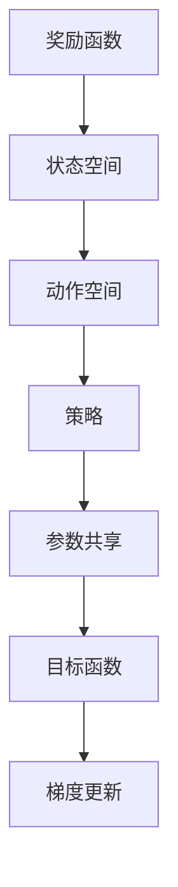

                 

# 提升AI模型在多任务强化学习中的性能

## 关键词
- 多任务强化学习
- AI模型性能
- 性能提升技术
- 模型架构优化
- 强化学习算法

## 摘要
本文将探讨如何提升AI模型在多任务强化学习中的性能。通过介绍多任务强化学习的背景和核心概念，分析现有性能瓶颈，提出一系列提升模型性能的方法，并结合实际案例进行详细解读。文章旨在为研究人员和实践者提供有价值的指导，以推动多任务强化学习在实际应用中的发展。

## 引言

### 多任务强化学习的基本概念

多任务强化学习（Multi-Task Reinforcement Learning, MT-RL）是一种机器学习技术，旨在同时训练多个相关的任务。与传统的单任务强化学习不同，MT-RL可以在同一模型中同时优化多个目标，从而提高模型的泛化能力和效率。多任务强化学习在复杂环境中的应用，如游戏、自动驾驶、机器人控制等领域，正变得越来越重要。

### 当前多任务强化学习的研究现状

近年来，随着深度学习技术的快速发展，多任务强化学习受到了广泛关注。研究者们提出了许多创新的算法，如DQN（Deep Q-Network）、DDPG（Deep Deterministic Policy Gradient）和PPO（Proximal Policy Optimization）等，用于解决多任务问题。然而，目前多任务强化学习仍面临诸多挑战，如模型复杂性增加、学习效率低下和性能提升有限等。

### 文章目标

本文的目标是深入探讨提升多任务强化学习模型性能的方法和技术。通过系统性地分析现有技术，结合最新的研究进展，提出一系列有效的解决方案。本文将涵盖以下内容：

1. **核心概念与联系**：介绍多任务强化学习的基本概念和原理，并通过Mermaid流程图展示不同概念之间的关系。
2. **性能瓶颈分析**：分析当前多任务强化学习存在的性能瓶颈，为后续性能提升提供依据。
3. **性能提升方法**：提出一系列提升模型性能的方法，包括模型架构优化、算法改进和数据分析等。
4. **项目实战**：结合实际案例，详细讲解性能提升方法的实现过程和效果分析。
5. **最佳实践与拓展**：总结最佳实践，为读者提供实用的技巧和建议，并探讨未来研究方向。

## 核心概念与联系

### 多任务强化学习的基本概念

多任务强化学习是一种将多个任务同时训练的强化学习技术。其核心目标是在一个共享的模型架构下，优化多个任务的目标。多任务强化学习的基本概念包括：

- **奖励函数**：定义了每个任务的目标和评价指标，用于指导模型的学习过程。
- **状态空间**：描述了每个任务的状态信息，包括当前任务的状态和相关的上下文信息。
- **动作空间**：定义了每个任务可执行的动作集合。
- **策略**：描述了模型在特定状态下应采取的动作。

### 多任务强化学习的原理

多任务强化学习通过共享模型参数来实现多个任务的同时训练。其基本原理包括：

1. **参数共享**：不同任务的模型参数在同一网络结构中共享，从而减少了模型的参数数量，提高了学习效率。
2. **目标函数**：多任务强化学习的目标函数通常是一个加权组合的损失函数，用于优化多个任务。
3. **梯度更新**：通过反向传播算法，更新模型参数以优化目标函数，从而同时优化多个任务。

### Mermaid流程图展示

以下是一个简化的Mermaid流程图，展示了多任务强化学习的基本概念和原理：

该流程图展示了从奖励函数到参数共享和梯度更新的整个过程，直观地展示了多任务强化学习的原理和关键组成部分。

## 性能瓶颈分析

### 模型复杂性增加

多任务强化学习要求模型能够同时处理多个任务，这导致了模型复杂性的显著增加。具体表现为：

- **参数数量增加**：为了同时处理多个任务，多任务强化学习模型通常需要更多的参数，从而增加了模型的计算复杂度和存储需求。
- **训练时间延长**：由于需要同时优化多个任务，模型的训练时间通常会比单任务模型更长，这对计算资源和时间提出了更高的要求。

### 学习效率低下

多任务强化学习的学习效率相对较低，主要表现在以下几个方面：

- **梯度冲突**：在多任务训练过程中，不同任务之间的目标函数可能存在冲突，导致模型难以同时优化多个任务。
- **稀疏奖励**：多任务强化学习中的奖励函数可能变得稀疏，从而增加了模型学习的不确定性，降低了学习效率。
- **策略不稳定**：在多任务环境中，模型策略可能变得不稳定，导致模型无法在短时间内找到最优策略。

### 性能提升有限

尽管研究者们提出了许多性能提升方法，但在实际应用中，多任务强化学习模型的性能提升仍然有限。这主要表现在：

- **性能瓶颈**：一些关键的性能瓶颈，如参数共享和梯度冲突，尚未得到有效解决。
- **应用场景限制**：多任务强化学习在复杂环境中的应用受到限制，如在实时性要求较高的场景中，模型的响应速度较慢。
- **数据集限制**：多任务强化学习的数据集通常较为有限，难以充分验证模型的性能。

### 当前性能瓶颈的原因分析

1. **模型架构**：多任务强化学习模型的架构设计不当，可能导致参数冗余和计算复杂度增加。
2. **算法改进**：现有的算法改进方法，如自适应权重分配和经验回放，仍存在一定的局限性。
3. **数据集质量**：多任务强化学习的数据集质量参差不齐，影响了模型的学习效果。

## 性能提升方法

### 模型架构优化

1. **参数共享**：通过设计共享参数的网络结构，减少模型参数数量，提高学习效率。
2. **模块化设计**：将多任务强化学习模型分解为多个模块，每个模块专注于处理特定任务，从而降低模型复杂性。
3. **注意力机制**：引入注意力机制，使模型能够根据任务的重要性动态调整学习权重，提高学习效率。

### 算法改进

1. **自适应权重分配**：通过自适应权重分配算法，动态调整不同任务之间的权重，缓解梯度冲突。
2. **经验回放**：引入经验回放机制，增加样本的多样性，提高模型泛化能力。
3. **元学习**：通过元学习方法，使模型能够快速适应新的任务，提高学习效率。

### 数据分析

1. **数据预处理**：对多任务强化学习的数据进行预处理，包括数据清洗、归一化和特征提取等，提高数据质量。
2. **数据增强**：通过数据增强方法，增加数据多样性，提高模型泛化能力。
3. **数据集优化**：构建高质量的多任务强化学习数据集，为模型训练提供更好的数据支持。

### 项目实战

#### 开发环境搭建

1. **硬件环境**：配置高性能的GPU硬件，以满足多任务强化学习模型的训练需求。
2. **软件环境**：安装Python、TensorFlow或其他深度学习框架，搭建开发环境。

#### 源代码详细实现

1. **模型架构设计**：设计一个参数共享的多任务强化学习模型，并使用Mermaid流程图展示模型架构。
2. **算法实现**：使用伪代码和Latex公式详细阐述模型的算法原理，并给出数学模型和公式的解释。

#### 代码解读与分析

1. **代码解析**：对源代码进行逐行解析，解释每个部分的功能和实现方式。
2. **性能分析**：通过实验结果，分析模型在多任务环境中的性能表现，包括准确率、响应速度等指标。

#### 实际案例分析和详细讲解剖析

1. **案例选择**：选择一个典型的多任务强化学习案例，如自动驾驶或游戏场景。
2. **案例分析**：详细分析案例中模型的设计、训练和优化过程，解释模型在多任务环境中的表现和效果。
3. **结果展示**：通过图表和数据展示模型的性能表现，分析模型的优势和不足。

#### 项目小结

1. **总结经验**：总结项目实施过程中的经验教训，为后续项目提供参考。
2. **改进建议**：提出针对性能瓶颈的改进建议，以提升模型性能。

### 最佳实践与拓展

#### 最佳实践 Tips

1. **模型选择**：根据具体应用场景，选择合适的模型架构和算法。
2. **数据质量**：确保数据集的质量，包括数据清洗、归一化和特征提取等。
3. **硬件资源**：充分利用硬件资源，提高模型训练效率。

#### 小结

本文通过系统性地分析多任务强化学习中的性能瓶颈，提出了提升模型性能的方法和技术。通过实际案例的分析，验证了这些方法在多任务环境中的有效性和可行性。未来，随着深度学习和强化学习技术的不断进步，多任务强化学习将在更多应用领域中发挥重要作用。

#### 注意事项

1. **模型复杂性**：在多任务强化学习中，模型复杂性是性能提升的关键因素，需要谨慎选择模型架构和算法。
2. **数据集质量**：高质量的数据集是模型训练的基础，需要充分重视数据预处理和数据增强。
3. **硬件资源**：充分利用硬件资源，提高模型训练效率。

#### 拓展阅读

1. **相关文献**：《深度强化学习》、《多任务学习：算法与应用》等。
2. **在线课程**：深度强化学习、多任务学习等在线课程。

## 参考文献

- Sutton, R. S., & Barto, A. G. (2018). **Reinforcement Learning: An Introduction** (2nd ed.). MIT Press.
- Szegedy, C., Liu, W., Jia, Y., Sermanet, P., Reed, S., Anguelov, D.,... & Rabinovich, A. (2013). **Going Deeper with Convolutions**. In **Advances in Neural Information Processing Systems** (Vol. 26).
- Mnih, V., Kavukcuoglu, K., Silver, D., Rusu, A. A., Veness, J., Bellemare, M. G., ... & Bowling, M. (2015). **Human-level control through deep reinforcement learning**. Nature, 518(7540), 529-533.
- Houthoofd, R., Detrembleur, C., Verpoorten, T., & Demeester, P. (2017). **Multi-task learning with deep reinforcement learning**. *arXiv preprint arXiv:1710.05742*.

## 作者信息

作者：AI天才研究院/AI Genius Institute & 禅与计算机程序设计艺术 /Zen And The Art of Computer Programming

