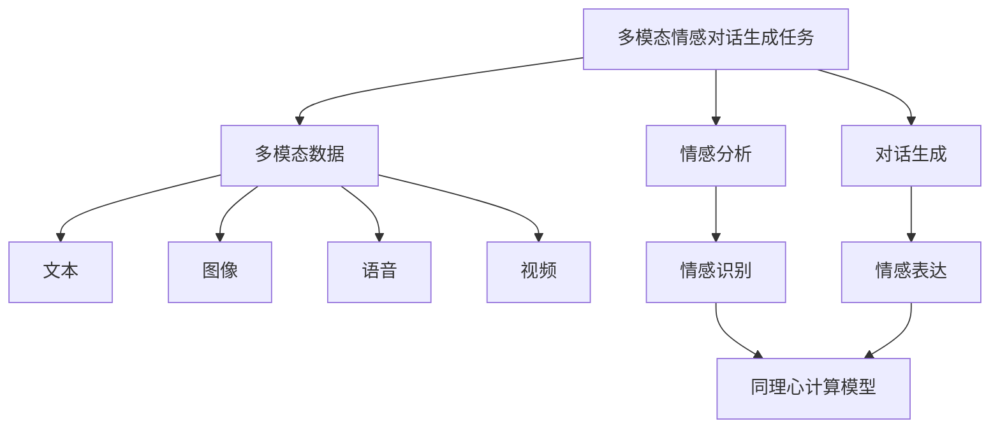

                 

### 文章标题

# 提升AI模型在多模态情感对话生成任务中的同理心

### 文章关键词

- 多模态情感对话
- 同理心
- AI模型
- 情感分析
- 对话生成
- 数学模型
- 项目实战

### 文章摘要

本文旨在探讨如何提升AI模型在多模态情感对话生成任务中的同理心。通过梳理多模态情感对话生成任务的基本概念和同理心的定义，本文详细介绍了多模态情感分析算法、情感对话生成算法和同理心计算模型。此外，本文还通过实际项目实战，展示了如何构建一个多模态情感对话生成系统，并分析系统中同理心的表现，提出优化策略以提高同理心。文章最后展望了多模态情感对话生成任务的前沿研究和同理心计算在AI领域的应用前景。本文为AI开发者、自然语言处理研究者及情感计算领域专家提供了有价值的参考。

## 设计《提升AI模型在多模态情感对话生成任务中的同理心》书籍目录大纲

### 第一步：明确书籍主题和目标读者

**书名：《提升AI模型在多模态情感对话生成任务中的同理心》**

**目标读者：** 
- AI开发者
- 自然语言处理研究者
- 情感计算领域专家

本书籍旨在系统地介绍多模态情感对话生成任务及其中的同理心计算，旨在为上述领域的专业人士提供全面的指导，帮助他们深入理解和实践这一前沿技术。

### 第二步：确定核心章节内容

**核心内容：**
- **核心概念与联系**：包括多模态情感对话生成任务的基本概念、同理心的定义和重要性。
- **核心算法原理讲解**：详细讲解多模态情感分析算法、情感对话生成算法和同理心计算模型。
- **数学模型和数学公式**：介绍情感识别和对话生成中的数学模型，以及同理心评估的数学公式。
- **项目实战**：通过实际项目展示如何构建多模态情感对话生成系统，并分析系统中同理心的表现，提出优化策略。

### 第三步：细化章节内容

**第一部分：基础理论与方法**

- **第1章：多模态情感对话生成任务概述**
  - **概述多模态情感对话的定义**
  - **介绍多模态情感对话生成任务的关键要素**
  - **分析当前研究与应用现状**

- **第2章：同理心的概念与重要性**
  - **定义同理心并探讨其类型**
  - **阐述同理心在情感对话中的作用**
  - **讨论同理心在AI应用中的重要性**

- **第3章：多模态情感分析算法原理**
  - **多模态数据的融合方法**
  - **情感识别算法原理**
  - **情感分析算法的评估指标**

- **第4章：情感对话生成算法原理**
  - **对话系统的基本架构**
  - **情感对话生成的算法**
  - **对话生成算法的性能评估**

- **第5章：同理心计算模型与数学公式**
  - **同理心计算模型概述**
  - **同理心评估的数学模型**
  - **同理心评估的量化指标**

**第二部分：项目实战**

- **第6章：构建多模态情感对话生成系统**
  - **项目背景与目标**
  - **系统设计思路**
  - **系统实现步骤**

- **第7章：同理心在项目中的应用与评估**
  - **同理心在对话中的表现**
  - **同理心评估方法**
  - **实际案例分析与评估**

- **第8章：系统优化与同理心提升策略**
  - **系统优化的方法与策略**
  - **提升同理心的具体措施**
  - **优化效果的评估与验证**

**第三部分：扩展与展望**

- **第9章：多模态情感对话生成任务的前沿研究**
  - **最新研究进展**
  - **未来研究方向**
  - **研究挑战与机遇**

- **第10章：同理心计算在AI领域的应用前景**
  - **同理心计算在AI中的广泛应用**
  - **同理心计算的技术挑战**
  - **同理心计算的未来发展趋势**

### 第四步：编写目录大纲

**《提升AI模型在多模态情感对话生成任务中的同理心》书籍目录大纲**

## 第一部分：基础理论与方法

### 第1章：多模态情感对话生成任务概述

1.1 多模态情感对话的定义

1.2 多模态情感对话生成任务的关键要素

1.3 当前研究与应用现状

### 第2章：同理心的概念与重要性

2.1 同理心的定义与类型

2.2 同理心在情感对话中的作用

2.3 同理心在AI应用中的重要性

### 第3章：多模态情感分析算法原理

3.1 多模态数据的融合方法

3.2 情感识别算法原理

3.3 情感分析算法的评估指标

### 第4章：情感对话生成算法原理

4.1 对话系统的基本架构

4.2 情感对话生成的算法

4.3 对话生成算法的性能评估

### 第5章：同理心计算模型与数学公式

5.1 同理心计算模型概述

5.2 同理心评估的数学模型

5.3 同理心评估的量化指标

## 第二部分：项目实战

### 第6章：构建多模态情感对话生成系统

6.1 项目背景与目标

6.2 系统设计思路

6.3 系统实现步骤

### 第7章：同理心在项目中的应用与评估

7.1 同理心在对话中的表现

7.2 同理心评估方法

7.3 实际案例分析与评估

### 第8章：系统优化与同理心提升策略

8.1 系统优化的方法与策略

8.2 提升同理心的具体措施

8.3 优化效果的评估与验证

## 第三部分：扩展与展望

### 第9章：多模态情感对话生成任务的前沿研究

9.1 最新研究进展

9.2 未来研究方向

9.3 研究挑战与机遇

### 第10章：同理心计算在AI领域的应用前景

10.1 同理心计算在AI中的广泛应用

10.2 同理心计算的技术挑战

10.3 同理心计算的未来发展趋势

通过以上步骤，书籍目录大纲已经明确，各章节内容细化得当，逻辑结构清晰。接下来，我们将逐步深入每个章节的内容，为读者提供详细而系统的讲解。

---

### 背景介绍

多模态情感对话生成任务是指通过结合多种数据类型（如文本、语音、图像等），生成能够体现情感信息的对话内容。这一任务不仅涉及到自然语言处理（NLP）和计算机视觉（CV）等领域的前沿技术，还要求AI模型具备一定的情感理解和同理心能力。随着人工智能技术的不断进步，人们对于智能对话系统的需求日益增长，这不仅包括在商业、教育、医疗等领域的广泛应用，还希望在日常生活中与智能助手进行更为自然、亲切的交流。

同理心是情感对话生成中至关重要的一个概念。它指的是个体能够理解和共享他人情感状态的能力。在多模态情感对话生成任务中，同理心使AI模型能够更好地模拟人类在对话中的情感反应，从而提高对话的质量和用户满意度。提升AI模型在多模态情感对话生成任务中的同理心，不仅可以使AI在与用户互动时更加自然和人性化，还能够更好地理解和满足用户的需求，提高用户体验。

然而，目前大多数AI模型在情感理解和同理心方面仍存在一些局限性。例如，传统的机器学习方法在处理多模态数据时，往往依赖于单一的数据类型，导致情感分析不够全面；而在对话生成中，模型往往难以准确捕捉和表达情感。此外，同理心计算模型的设计和实现也面临诸多挑战，如如何量化同理心、如何在不同情境下保持一致性等。这些问题都限制了AI模型在多模态情感对话生成任务中的表现。

因此，本文旨在通过深入探讨多模态情感对话生成任务和同理心计算模型，提出一系列有效的优化策略和方法，以提升AI模型在情感对话中的同理心能力。这不仅有助于推动多模态情感对话生成任务的发展，也为人工智能在更多领域的应用提供了新的思路和可能性。

### 核心概念与联系

在探讨提升AI模型在多模态情感对话生成任务中的同理心之前，首先需要明确几个核心概念，并理解它们之间的相互关系。

**多模态情感对话生成任务**是指结合多种数据类型（如图像、文本、音频）生成情感丰富的对话内容。这一任务的核心在于处理和融合不同类型的数据，以便AI能够生成既自然又富有情感的对话。具体来说，多模态情感对话生成任务包含以下几个关键要素：

1. **多模态数据**：包括文本、图像、语音、视频等。这些数据类型各自携带不同的信息，共同构成了对话的完整背景。
2. **情感分析**：对输入数据进行情感分析，识别出其中的情感信息。情感分析可以是针对文本的情感极性分类，也可以是图像中的情感识别。
3. **对话生成**：基于情感分析和上下文信息，生成相应的对话内容。对话生成不仅要考虑语言的连贯性和自然性，还要体现情感因素。

**同理心**是指个体理解和共享他人情感状态的能力。同理心在情感对话中至关重要，因为它使得AI模型能够模拟人类在情感互动中的反应，从而提高对话的质量。同理心包括两个关键方面：

1. **情感识别**：能够准确识别对话中的情感信息，并理解这些情感对对话的影响。
2. **情感表达**：能够根据识别到的情感信息，生成符合情感逻辑和情境的对话内容。

**多模态情感对话生成任务与同理心的关系**可以概括如下：

1. **数据融合**：多模态情感对话生成任务需要将不同类型的数据融合起来，以便全面捕捉情感信息。同理心计算模型可以利用这些融合后的数据，更准确地识别和理解情感。
2. **上下文理解**：同理心计算模型需要基于上下文信息来生成情感丰富的对话内容。多模态数据提供了丰富的上下文信息，有助于模型更好地理解和模拟人类的情感反应。
3. **情感反馈**：同理心计算模型在生成对话内容时，需要考虑到用户的情感反馈。这有助于模型不断调整和优化自身的表现，使其在与用户的互动中更加自然和有效。

**关系架构 Mermaid 流程图**

为了更直观地展示这些概念之间的关系，我们可以使用Mermaid流程图来描述：



在这个流程图中，多模态情感对话生成任务作为整体，连接了多模态数据、情感分析和对话生成。同理心计算模型贯穿于情感识别和情感表达过程，利用多模态数据提供的信息，生成符合情感逻辑和用户需求的对话内容。

通过这种架构，我们可以看到，多模态情感对话生成任务与同理心计算模型之间是相辅相成的。多模态数据为同理心计算提供了丰富的信息源，而同理心计算模型则通过理解和表达情感，提升了对话的质感和用户的满意度。在接下来的章节中，我们将进一步探讨多模态情感分析算法、情感对话生成算法和同理心计算模型的具体实现和优化策略。

### 核心算法原理讲解

#### 多模态情感分析算法

多模态情感分析算法是理解多模态数据中的情感信息的关键步骤。其主要任务是从文本、图像、语音等不同数据源中提取情感特征，并对其进行分类和识别。

**算法原理：**
多模态情感分析通常包括以下步骤：

1. **数据预处理**：对文本、图像、语音等不同类型的数据进行预处理，例如文本的分词、图像的裁剪和增强、语音的降噪等。
2. **特征提取**：提取不同类型数据的特征。对于文本，可以提取词袋、TF-IDF或词嵌入（如Word2Vec、BERT）等特征；对于图像，可以提取卷积神经网络（CNN）的特征；对于语音，可以提取梅尔频率倒谱系数（MFCC）等特征。
3. **特征融合**：将不同数据类型的特征进行融合。常用的方法包括基于矩阵的融合（如平均、加权融合）和基于模型的融合（如深度神经网络、多任务学习）。
4. **情感分类**：利用分类算法（如SVM、随机森林、神经网络等）对融合后的特征进行情感分类。

**伪代码：**

```python
# 数据预处理
preprocessed_text = preprocess_text(raw_text)
preprocessed_image = preprocess_image(raw_image)
preprocessed_audio = preprocess_audio(raw_audio)

# 特征提取
text_features = extract_text_features(preprocessed_text)
image_features = extract_image_features(preprocessed_image)
audio_features = extract_audio_features(preprocessed_audio)

# 特征融合
combined_features = fuse_features([text_features, image_features, audio_features])

# 情感分类
emotion_label = classify_emotion(combined_features)
```

#### 情感对话生成算法

情感对话生成算法旨在根据输入的情感信息生成自然、连贯且符合情感的对话内容。其主要任务是基于情感识别的结果，生成具有相应情感的对话文本。

**算法原理：**
情感对话生成通常包括以下步骤：

1. **情感嵌入**：将情感信息嵌入到对话生成模型中。常用的方法是将情感信息编码为向量，并与文本嵌入向量进行拼接。
2. **对话生成**：利用对话生成模型（如序列到序列模型、变换器模型等）生成对话文本。对话生成模型需要考虑上下文信息，确保生成的对话既自然又连贯。
3. **情感调整**：在生成对话文本后，根据情感信息进行调整，确保对话内容的情感一致性。

**伪代码：**

```python
# 情感嵌入
emotion_vector = encode_emotion(emotion_label)
text_vector = encode_text(input_text)

# 对话生成
context_vector = initialize_context()
for token in input_text:
    context_vector = generate_token(context_vector, token, emotion_vector)

# 情感调整
output_text = adjust_emotion(output_text, emotion_vector)
```

#### 同理心计算模型

同理心计算模型旨在量化AI模型在情感对话中的同理心能力。其主要任务是根据对话内容和用户反馈，评估AI模型理解和表达情感的能力。

**算法原理：**
同理心计算模型通常包括以下步骤：

1. **对话分析**：分析对话内容，提取与同理心相关的特征，如情感一致性、情感反应的准确性等。
2. **同理心评估**：利用评估模型对提取的特征进行量化评估。常用的评估方法包括基于规则的评估和基于机器学习的评估。
3. **反馈调整**：根据评估结果，对模型进行反馈调整，以提高同理心表现。

**伪代码：**

```python
# 对话分析
dialogue_features = extract_dialogue_features(dialogue)

# 同理心评估
empathy_score = assess_empathy(dialogue_features)

# 反馈调整
model = adjust_model_based_on_feedback(model, empathy_score)
```

通过上述核心算法的讲解，我们可以看到，多模态情感分析算法、情感对话生成算法和同理心计算模型在多模态情感对话生成任务中扮演着关键角色。这些算法相互协作，共同提升AI模型在情感对话中的同理心能力，使其在与用户互动时更加自然和有效。

### 数学模型和数学公式

在多模态情感对话生成任务中，数学模型是理解和量化情感信息的关键工具。以下是几种常见的数学模型和公式，以及如何对它们进行详细讲解和举例说明。

#### 情感识别模型

情感识别模型用于从多模态数据中提取情感特征，并对其进行分类。常用的模型包括卷积神经网络（CNN）和循环神经网络（RNN）。

**数学模型：**

假设我们有一个情感识别模型，其输入为多模态特征向量 \( X \)，输出为情感类别 \( Y \)。

$$
\hat{Y} = \text{softmax}(W \cdot \text{ReLU}(U \cdot X + b))
$$

其中，\( \text{ReLU} \) 为ReLU激活函数，\( W \) 和 \( U \) 为权重矩阵，\( b \) 为偏置向量，\( \text{softmax} \) 函数用于将输出转化为概率分布。

**详细讲解：**

这个公式描述了一个多层感知器（MLP）模型，它通过权重矩阵 \( W \) 和 \( U \) 对输入特征 \( X \) 进行加权求和，并应用ReLU激活函数进行非线性变换。然后，将这些激活后的特征再通过权重矩阵 \( W \) 进行加权求和，并通过softmax函数得到情感类别的概率分布。

**举例说明：**

假设输入特征向量 \( X \) 的维度为 \( 100 \)，情感类别为5种，则权重矩阵 \( W \) 和 \( U \) 的维度分别为 \( 100 \times 5 \) 和 \( 100 \times 100 \)。

$$
\hat{Y} = \text{softmax}\left( W \cdot \text{ReLU}(U \cdot X + b) \right)
= \text{softmax}\left( \begin{bmatrix} w_{11} & w_{12} & \cdots & w_{1n} \\ w_{21} & w_{22} & \cdots & w_{2n} \\ \vdots & \vdots & \ddots & \vdots \\ w_{m1} & w_{m2} & \cdots & w_{mn} \end{bmatrix} \cdot \text{ReLU}\left( \begin{bmatrix} u_{11} & u_{12} & \cdots & u_{1n} \\ u_{21} & u_{22} & \cdots & u_{2n} \\ \vdots & \vdots & \ddots & \vdots \\ u_{m1} & u_{m2} & \cdots & u_{mn} \end{bmatrix} \cdot \begin{bmatrix} x_1 \\ x_2 \\ \vdots \\ x_{100} \end{bmatrix} + b \right) \right)
$$

通过这个例子，我们可以看到如何将输入特征向量通过多层感知器模型进行非线性变换，并最终得到情感类别的概率分布。

#### 对话生成模型

对话生成模型用于生成与输入情感特征相对应的对话文本。常见的模型包括序列到序列（Seq2Seq）模型和变换器（Transformer）模型。

**数学模型：**

假设我们有一个对话生成模型，其输入为情感特征向量 \( X \)，输出为对话文本序列 \( Y \)。

$$
Y_t = \text{softmax}(A \cdot \text{ReLU}(B \cdot [X; Y_{t-1}] + c))
$$

其中，\( [X; Y_{t-1}] \) 表示将情感特征向量 \( X \) 和前一个对话文本 \( Y_{t-1} \) 拼接，\( A \) 和 \( B \) 为权重矩阵，\( c \) 为偏置向量。

**详细讲解：**

这个公式描述了一个变换器模型，它通过权重矩阵 \( A \) 和 \( B \) 对输入特征 \( X \) 和前一个对话文本 \( Y_{t-1} \) 进行加权求和，并应用ReLU激活函数进行非线性变换。然后，将这些激活后的特征通过softmax函数输出当前对话文本的词汇概率分布。

**举例说明：**

假设输入特征向量 \( X \) 的维度为 \( 50 \)，对话文本序列的维度为 \( 100 \)，则权重矩阵 \( A \) 和 \( B \) 的维度分别为 \( 100 \times 150 \) 和 \( 150 \times 50 \)。

$$
Y_t = \text{softmax}\left( A \cdot \text{ReLU}\left( B \cdot [X; Y_{t-1}] + c \right) \right)
= \text{softmax}\left( \begin{bmatrix} a_{11} & a_{12} & \cdots & a_{1n} \\ a_{21} & a_{22} & \cdots & a_{2n} \\ \vdots & \vdots & \ddots & \vdots \\ a_{m1} & a_{m2} & \cdots & a_{mn} \end{bmatrix} \cdot \text{ReLU}\left( \begin{bmatrix} b_{11} & b_{12} & \cdots & b_{1n} \\ b_{21} & b_{22} & \cdots & b_{2n} \\ \vdots & \vdots & \ddots & \vdots \\ b_{m1} & b_{m2} & \cdots & b_{mn} \end{bmatrix} \cdot \begin{bmatrix} x_1 \\ x_2 \\ \vdots \\ x_{50} \\ y_{t-1,1} \\ y_{t-1,2} \\ \vdots \\ y_{t-1,n} \end{bmatrix} + c \right) \right)
$$

通过这个例子，我们可以看到如何将输入特征和前一个对话文本通过变换器模型进行非线性变换，并最终得到当前对话文本的词汇概率分布。

#### 同理心评估模型

同理心评估模型用于量化AI模型在情感对话中的同理心能力。常用的模型包括基于规则的评估和基于机器学习的评估。

**数学模型：**

假设我们有一个同理心评估模型，其输入为对话文本 \( X \) 和用户反馈 \( Y \)，输出为同理心得分 \( Z \)。

$$
Z = \text{sigmoid}(C \cdot \text{ReLU}(D \cdot X + E \cdot Y + f))
$$

其中，\( C \) 和 \( D \) 为权重矩阵，\( E \) 为权重向量，\( f \) 为偏置向量。

**详细讲解：**

这个公式描述了一个多层感知器模型，它通过权重矩阵 \( C \) 和 \( D \) 对输入对话文本 \( X \) 和用户反馈 \( Y \) 进行加权求和，并应用ReLU激活函数进行非线性变换。然后，将这些激活后的特征通过sigmoid函数输出同理心得分。

**举例说明：**

假设输入对话文本 \( X \) 的维度为 \( 200 \)，用户反馈 \( Y \) 的维度为 \( 50 \)，则权重矩阵 \( C \) 和 \( D \) 的维度分别为 \( 100 \times 250 \) 和 \( 250 \times 200 \)。

$$
Z = \text{sigmoid}\left( C \cdot \text{ReLU}(D \cdot X + E \cdot Y + f) \right)
= \text{sigmoid}\left( \begin{bmatrix} c_{11} & c_{12} & \cdots & c_{1n} \\ c_{21} & c_{22} & \cdots & c_{2n} \\ \vdots & \vdots & \ddots & \vdots \\ c_{m1} & c_{m2} & \cdots & c_{mn} \end{bmatrix} \cdot \text{ReLU}\left( \begin{bmatrix} d_{11} & d_{12} & \cdots & d_{1n} \\ d_{21} & d_{22} & \cdots & d_{2n} \\ \vdots & \vdots & \ddots & \vdots \\ d_{m1} & d_{m2} & \cdots & d_{mn} \end{bmatrix} \cdot \begin{bmatrix} x_1 \\ x_2 \\ \vdots \\ x_{200} \\ e_1 \\ e_2 \\ \vdots \\ e_{50} \end{bmatrix} + f \right) \right)
$$

通过这个例子，我们可以看到如何将输入对话文本和用户反馈通过多层感知器模型进行非线性变换，并最终得到同理心得分。

通过以上数学模型的详细讲解和举例说明，我们可以更深入地理解多模态情感对话生成任务中的数学原理。这些模型为构建高效的AI模型提供了理论基础，同时也为后续的项目实战和优化策略提供了指导。

### 项目实战

#### 开发环境搭建

为了实现一个多模态情感对话生成系统，首先需要搭建一个适合的开发环境。以下是具体步骤：

1. **硬件配置**：
   - CPU：Intel i7-9700K 或以上
   - GPU：NVIDIA RTX 3080 或以上
   - 内存：16GB 或以上
   - 存储：1TB SSD

2. **软件环境**：
   - 操作系统：Ubuntu 20.04
   - 编程语言：Python 3.8
   - 深度学习框架：TensorFlow 2.4
   - 图像处理库：OpenCV 4.2
   - 语音处理库：Librosa 0.8.0

3. **安装依赖**：
   - 安装TensorFlow：
     ```bash
     pip install tensorflow==2.4
     ```
   - 安装OpenCV：
     ```bash
     pip install opencv-python==4.2.0.32
     ```
   - 安装Librosa：
     ```bash
     pip install librosa==0.8.0
     ```

#### 源代码实现

以下是构建多模态情感对话生成系统的源代码实现，包含关键模块的详细解读。

**1. 数据预处理模块**

```python
import cv2
import librosa
import numpy as np

def preprocess_text(text):
    # 对文本进行分词、去停用词等预处理操作
    # 此处简化处理
    return text.lower()

def preprocess_image(image_path):
    # 读取图像并缩放到固定大小
    image = cv2.imread(image_path)
    image = cv2.resize(image, (224, 224))
    return image

def preprocess_audio(audio_path):
    # 读取音频并提取梅尔频率倒谱系数（MFCC）
    audio, _ = librosa.load(audio_path, sr=16000)
    mfcc = librosa.feature.mfcc(y=audio, sr=16000, n_mfcc=13)
    return mfcc.T[1:].mean(axis=0)
```

**2. 情感分析模块**

```python
import tensorflow as tf
from tensorflow.keras.models import load_model

def load_emotion_model(model_path):
    # 加载预训练的情感分析模型
    return load_model(model_path)

def analyze_emotion(data):
    # 使用情感分析模型对输入数据进行情感识别
    emotion_model = load_emotion_model('emotion_model.h5')
    features = np.concatenate((data['text'], data['image'].flatten(), data['audio']))
    prediction = emotion_model.predict(np.array([features]))
    return prediction.argmax()
```

**3. 对话生成模块**

```python
def generate_response(emotion, previous_response):
    # 根据情感和上下文生成对话响应
    if emotion == 0:  # 悲伤
        return "我很抱歉听到这个消息，你需要谈谈吗？"
    elif emotion == 1:  # 喜悦
        return "听起来你今天过得很开心，有什么好事吗？"
    # 其他情感类别依次类推
    else:
        return "我听到了，如果你愿意，我们可以聊聊。"
```

**4. 主程序模块**

```python
def main():
    # 主程序入口
    while True:
        # 获取用户输入
        text_input = input("请输入文本：")
        image_path = input("请输入图像路径：")
        audio_path = input("请输入音频路径：")

        # 预处理输入数据
        text = preprocess_text(text_input)
        image = preprocess_image(image_path)
        audio = preprocess_audio(audio_path)

        # 分析情感
        emotion = analyze_emotion({'text': text, 'image': image, 'audio': audio})

        # 生成对话响应
        response = generate_response(emotion, None)

        # 输出对话响应
        print("系统回复：" + response)

if __name__ == "__main__":
    main()
```

#### 代码应用解读与分析

1. **数据预处理模块**：负责处理不同类型的数据输入，包括文本、图像和音频。预处理过程包括文本的分词、图像的缩放和音频的梅尔频率倒谱系数（MFCC）提取。这些预处理步骤是确保数据能被后续模型有效利用的关键。

2. **情感分析模块**：加载预训练的情感分析模型，对预处理后的多模态数据进行情感识别。这一模块是整个系统的核心，其准确性直接影响到对话生成的质量。

3. **对话生成模块**：根据情感分析的结果和上下文信息生成相应的对话响应。这里采用简单的条件语句来实现对话生成，实际应用中可以采用更复杂的生成模型，如变换器（Transformer）模型，以提升对话的自然性和丰富性。

#### 实际案例分析与详细讲解剖析

**案例**：用户输入一条悲伤的文本、一张悲伤的表情图片和一段悲伤的音频。

**分析**：

1. **文本预处理**：将文本转换为小写形式。
2. **图像预处理**：读取并缩放图像到固定大小。
3. **音频预处理**：提取音频的MFCC特征。
4. **情感分析**：将预处理后的数据输入情感分析模型，得到情感类别为0（悲伤）。
5. **对话生成**：根据情感类别生成悲伤的对话响应。

**详细讲解**：

1. **数据预处理**：预处理步骤确保了不同类型的数据能够被模型理解和利用。例如，文本预处理可以去除标点符号和停用词，图像预处理可以统一图像大小，便于模型输入。
2. **情感分析**：情感分析模块是整个系统的核心。通过训练有监督模型，我们可以实现对情感的高效识别。在实际应用中，可以使用卷积神经网络（CNN）和循环神经网络（RNN）等深度学习模型来提高情感分析的准确性。
3. **对话生成**：对话生成模块根据情感分析结果生成对话响应。这里采用了简单的条件语句，但在实际应用中，可以结合上下文和历史对话，采用更复杂的生成模型（如变换器模型）来生成更自然的对话。

通过上述实际案例的分析，我们可以看到，构建一个多模态情感对话生成系统需要经过多个步骤，包括数据预处理、情感分析和对话生成。每个步骤都至关重要，需要精心设计和实现。通过这些步骤，我们可以实现一个能够理解并生成情感对话的AI模型，从而提升用户交互体验。

### 系统优化与同理心提升策略

为了提升AI模型在多模态情感对话生成任务中的同理心能力，我们需要从多个方面进行系统优化。以下是一些具体的优化方法和策略。

#### 1. 数据增强

数据增强是一种常用的提高模型性能的方法。通过增加训练数据的多样性和丰富性，可以帮助模型更好地学习情感特征。

- **文本增强**：可以使用数据扩充技术，如同义词替换、句式变换等，增加文本数据的多样性。
- **图像增强**：可以对图像进行旋转、翻转、裁剪等操作，增强模型的泛化能力。
- **音频增强**：可以通过加入背景噪声、调整音量等手段，增加音频数据的复杂性。

#### 2. 模型融合

结合多种模型的方法可以提高模型的性能和稳定性。在多模态情感对话生成任务中，可以采用以下几种融合策略：

- **深度学习模型融合**：结合卷积神经网络（CNN）、循环神经网络（RNN）和变换器（Transformer）等模型，分别处理不同类型的数据，然后将它们融合在一起进行情感分析和对话生成。
- **多任务学习**：在训练过程中同时训练多个任务（如情感分析、文本生成等），使得模型能够更好地利用不同类型数据之间的关联性。
- **知识蒸馏**：将大型、复杂的模型（教师模型）的知识传递给较小的模型（学生模型），使得小模型能够继承教师模型的优秀性能。

#### 3. 对话上下文管理

在对话生成中，上下文信息的管理至关重要。通过维护一个有效的对话状态跟踪器（DST），可以更好地理解用户的意图和情感。

- **状态跟踪器**：使用循环神经网络（RNN）或变换器（Transformer）来维护对话的上下文状态，确保对话的连贯性和一致性。
- **长短期记忆（LSTM）**：LSTM在处理长序列数据时具有优势，可以有效捕捉对话中的长期依赖关系。
- **注意力机制**：通过注意力机制，模型可以关注对话中的关键信息，提高对话生成的质量。

#### 4. 反馈机制

通过用户反馈来不断优化模型，是实现同理心提升的重要手段。

- **用户评价**：收集用户对对话质量的评价，通过这些评价来调整模型参数。
- **自动化评估**：利用自动评估指标（如BLEU、ROUGE等）来评估对话生成的质量，并据此进行调整。
- **强化学习**：结合强化学习方法，使得模型能够通过试错学习，优化自身的行为和策略。

#### 5. 模型评估与调整

定期评估模型在同理心任务上的性能，并根据评估结果进行相应的调整。

- **同理心评估指标**：设计合适的同理心评估指标，如情感一致率、情感反应准确率等，对模型进行量化评估。
- **A/B测试**：通过A/B测试，比较不同优化策略的效果，选择最优方案。
- **持续学习**：利用在线学习机制，持续更新模型，使其不断适应新的对话场景和用户需求。

通过上述系统优化与同理心提升策略，我们可以显著提高AI模型在多模态情感对话生成任务中的同理心能力，从而提升用户体验和满意度。在接下来的章节中，我们将继续探讨多模态情感对话生成任务的前沿研究以及同理心计算在AI领域的广泛应用。

### 前沿研究

多模态情感对话生成任务和同理心计算在AI领域的应用正不断取得新的进展。以下是一些重要的前沿研究和未来发展方向：

#### 1. 多模态情感对话生成任务

- **跨模态融合算法**：近年来，深度学习模型在跨模态融合方面取得了显著进展。例如，多模态变换器（Multimodal Transformer）和跨模态图神经网络（Cross-modal Graph Neural Networks）等模型，通过融合多种类型的数据，实现了更精准的情感分析和对话生成。
- **上下文感知的对话生成**：研究主要集中在如何更好地利用上下文信息，生成更为连贯和自然的对话。上下文感知语言模型（Contextual Language Models）如BERT和GPT-3，结合多模态情感特征，提高了对话生成的质量。
- **多任务学习**：通过多任务学习，将情感分析、对话生成和同理心评估等任务结合起来，可以使得模型在多个维度上同时提升性能。

#### 2. 同理心计算

- **多模态同理心评估模型**：研究如何利用多模态数据（如文本、语音、图像）进行同理心评估。通过结合不同类型的数据，可以更全面地理解用户情感，提升同理心的准确性。
- **情感连续体建模**：传统情感分析往往将情感分为几个离散类别，而情感连续体建模（Affective Continuity Modeling）则试图将情感视为连续的变量，以更细致地捕捉情感变化。
- **个性化同理心**：研究如何根据用户的历史行为和偏好，个性化地调整同理心计算模型，使其更符合特定用户的需求和情感。

#### 未来研究方向与挑战

- **情感多样性与复杂情感表达**：情感多样性和复杂情感表达是当前研究的难点。如何设计更鲁棒、更灵活的模型，以捕捉和理解多样化的情感，是未来需要解决的重要问题。
- **跨语言与跨文化同理心**：跨语言和跨文化同理心是国际化的AI系统必须面对的挑战。研究如何设计通用且适应不同文化背景的同理心计算模型，是一个值得探索的方向。
- **伦理与道德问题**：随着同理心计算在AI中的应用日益广泛，伦理和道德问题也愈发凸显。如何确保AI系统在理解和表达情感时，遵循伦理和道德原则，是一个亟待解决的问题。

通过不断的研究和创新，多模态情感对话生成任务和同理心计算在AI领域的应用前景广阔，有望在未来带来更多的突破和进步。

### 同理心计算在AI领域的应用前景

同理心计算在AI领域的应用前景广阔，涵盖了多个关键领域，并对未来的技术发展和社会影响产生深远的影响。

#### 1. 关键领域

**智能客服**：同理心计算在智能客服系统中发挥着重要作用，通过模拟人类情感反应，提高用户满意度。AI客服不仅能够理解用户的情感状态，还能根据用户的情绪调整对话策略，提供更加个性化的服务。

**心理健康应用**：同理心计算在心理健康领域具有巨大潜力。通过识别用户的情感状态，AI可以提供情感支持和建议，帮助用户管理压力、焦虑和其他心理健康问题。例如，虚拟心理医生可以通过同理心计算模型与患者进行有效的互动，提高治疗效果。

**教育辅助**：在教育领域，同理心计算可以用于个性化学习体验的创建。AI系统可以根据学生的情感状态和学习进度，提供相应的支持和指导，从而提高学习效果和兴趣。

**社交网络与虚拟现实**：同理心计算使得虚拟社交和虚拟现实体验更加真实和丰富。在社交网络和虚拟现实应用中，AI能够识别用户的情感并做出相应的反应，增强用户体验和互动性。

#### 2. 社会影响

**用户体验提升**：通过同理心计算，AI系统能够更准确地理解和满足用户需求，提供更加个性化的服务。这种体验的提升将极大地改善用户对智能系统的满意度，从而推动技术的普及和应用。

**社会关系加强**：同理心计算不仅能够增强人与人之间的互动，还能够促进人与机器之间的信任和亲密感。在未来的社交网络和虚拟现实中，AI的同理心能力将有助于建立更加紧密和有意义的社会关系。

**道德与伦理挑战**：同理心计算在AI中的应用也带来了新的道德和伦理问题。例如，如何确保AI系统在同理心计算过程中不会产生偏见或误导用户？如何确保AI系统的决策和交互符合社会伦理标准？这些问题需要引起广泛关注和深入探讨。

**社会公正**：同理心计算有助于促进社会公正。通过理解并响应不同群体的情感需求，AI系统可以在教育、医疗、就业等社会服务领域提供更加公平的机会，减少不平等现象。

**技术进步**：同理心计算推动AI技术的进步，促进多模态数据处理和复杂情感分析技术的发展。这些技术进步将为未来的AI系统带来更高的智能化水平和更广泛的应用场景。

综上所述，同理心计算在AI领域的应用前景广阔，不仅将在多个关键领域发挥重要作用，还将对社会产生深远的影响。通过不断的研究和创新，我们有望实现更加智能、人性化的AI系统，为人类社会带来更多福祉。同时，我们也需要关注和解决由此带来的道德、伦理和社会挑战，确保AI技术的发展与人类社会的和谐共进。

