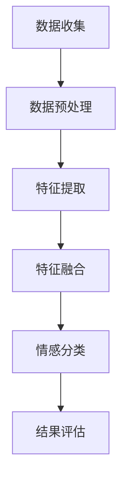
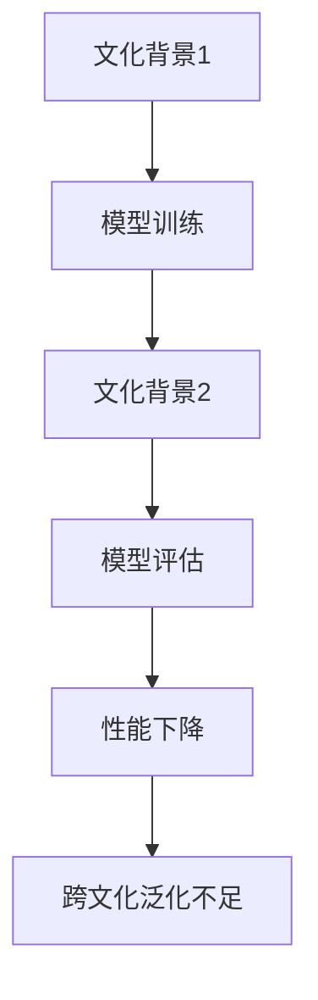
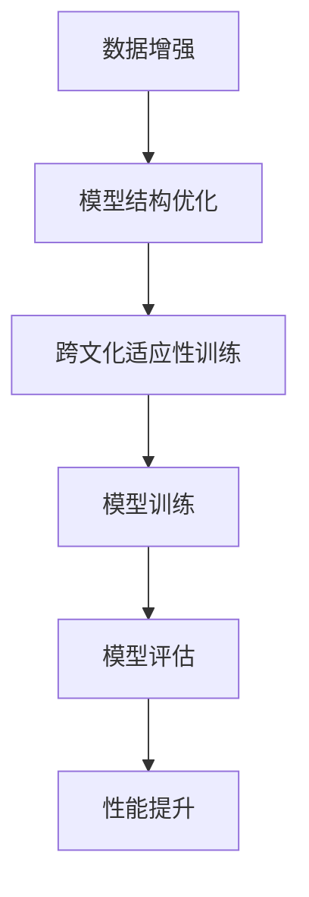

                 

# 提升AI模型在多模态情感计算任务中的跨文化泛化能力

> 关键词：人工智能，多模态情感计算，跨文化泛化，AI模型，情感识别，机器学习，深度学习

> 摘要：本文旨在探讨如何提升人工智能（AI）模型在多模态情感计算任务中的跨文化泛化能力。文章首先介绍了多模态情感计算的基本概念和其在实际应用中的重要性，然后分析了当前AI模型在跨文化泛化方面面临的挑战。接着，本文提出了几种解决方案，包括数据增强、模型结构优化和跨文化适应性训练等。最后，通过一个实际项目案例，展示了这些解决方案的具体应用和效果。

## 引言

在当今数字化时代，情感计算已成为人工智能（AI）领域的一个重要分支。情感计算旨在让计算机理解和识别人类情感，从而实现与人类更自然的交互。多模态情感计算是情感计算的一个子领域，它通过整合多种数据来源（如图像、文本、声音等）来提高情感识别的准确性和泛化能力。然而，跨文化泛化问题是多模态情感计算面临的一个重大挑战。

传统的AI模型通常在一个特定的文化环境中训练，因此它们在处理其他文化背景下的情感数据时可能会出现性能下降。例如，面部表情在不同文化中可能具有不同的含义，而语言情感表达也受到地域和文化背景的影响。因此，如何提升AI模型在多模态情感计算任务中的跨文化泛化能力，成为当前研究的一个重要课题。

本文旨在探讨以下几个问题：

1. 多模态情感计算的基本原理和关键挑战是什么？
2. AI模型在跨文化泛化方面存在哪些问题？
3. 如何通过数据增强、模型结构优化和跨文化适应性训练来提升AI模型的跨文化泛化能力？
4. 实际项目中如何应用这些解决方案？

本文将分以下几个部分进行阐述：

- 第1部分：介绍多模态情感计算的基本概念和关键挑战。
- 第2部分：分析AI模型在跨文化泛化方面存在的问题。
- 第3部分：提出提升AI模型跨文化泛化能力的几种解决方案。
- 第4部分：通过一个实际项目案例展示这些解决方案的应用和效果。
- 第5部分：总结本文的主要结论和未来研究方向。

## 第1部分：多模态情感计算的基本概念和关键挑战

### 多模态情感计算的基本概念

多模态情感计算是指通过整合多种数据来源（如图像、文本、声音等）来识别和预测人类情感的过程。与传统单一模态情感计算相比，多模态情感计算具有更高的准确性和泛化能力。

多模态情感计算的核心是情感识别，即从多种模态数据中提取特征，并使用机器学习或深度学习模型对情感进行分类。常见的多模态数据包括以下几种：

1. **图像数据**：面部表情、身体语言、姿态等。
2. **文本数据**：语言表达、情感词汇、语法结构等。
3. **声音数据**：语音语调、音量、语速等。

在多模态情感计算中，各个模态的数据通常需要进行特征提取和融合。特征提取是指从原始数据中提取出与情感相关的特征，如面部特征点、文本中的情感词汇等。特征融合是指将不同模态的特征进行整合，以获得更全面和准确的情感信息。

### 多模态情感计算的关键挑战

尽管多模态情感计算具有许多优势，但它在实际应用中仍然面临一些关键挑战：

1. **数据多样性**：不同文化、地域和个体之间的情感表达可能存在显著差异，这要求模型能够处理多样化的情感数据。
2. **数据质量**：多模态数据往往包含噪声和缺失值，这对特征提取和融合过程提出了更高的要求。
3. **计算复杂性**：多模态情感计算涉及多种数据类型和复杂的特征融合策略，这增加了模型的计算负担。
4. **跨文化泛化**：模型在一个特定文化背景下训练，可能无法很好地泛化到其他文化背景。

### Mermaid流程图：多模态情感计算的基本流程

下面是一个简单的Mermaid流程图，展示了多模态情感计算的基本流程：



在这个流程图中，数据收集阶段从各种模态（如图像、文本、声音等）获取数据。接着，数据预处理阶段对数据进行清洗和标准化。特征提取阶段从原始数据中提取与情感相关的特征。特征融合阶段将不同模态的特征进行整合。最后，情感分类阶段使用机器学习或深度学习模型对情感进行分类，并评估模型的性能。

## 第2部分：AI模型在跨文化泛化方面存在的问题

### 跨文化泛化的定义和挑战

跨文化泛化是指AI模型在不同文化背景下保持较高性能的能力。它涉及到模型在处理来自不同文化背景的数据时，能否适应并达到与原始文化背景相同的性能水平。跨文化泛化面临的挑战主要包括以下几点：

1. **文化差异**：不同文化背景下，人们对情感的表达方式和情感词汇可能存在显著差异。例如，面部表情的含义在不同文化中可能有所不同，而语言情感表达也可能受到地域和文化背景的影响。
2. **数据分布差异**：不同文化背景下的情感数据分布可能存在差异，这可能导致模型在处理某些文化背景下的数据时出现性能下降。
3. **模型过拟合**：在一个特定文化背景下训练的模型可能会对特定文化数据产生过拟合，导致在其他文化背景下性能下降。
4. **数据不足**：跨文化情感数据的获取可能存在困难，这限制了模型的训练和评估。

### AI模型在跨文化泛化方面存在的问题

1. **模型依赖特定文化背景**：大多数AI模型是在特定文化背景下训练的，因此它们在处理其他文化背景下的数据时可能无法很好地适应。
2. **情感识别准确性下降**：在跨文化场景中，模型的情感识别准确性可能下降，导致错误分类和性能下降。
3. **泛化能力不足**：模型在一个文化背景下训练，可能无法很好地泛化到其他文化背景，导致跨文化泛化能力不足。

### Mermaid流程图：AI模型在跨文化泛化方面的挑战

下面是一个简单的Mermaid流程图，展示了AI模型在跨文化泛化方面的挑战：



在这个流程图中，模型在一个文化背景（如文化背景1）下进行训练。然后，将模型应用于另一个文化背景（如文化背景2）进行评估。由于模型对文化背景1的依赖，其在文化背景2上的性能可能下降，导致跨文化泛化不足。

## 第3部分：提升AI模型跨文化泛化能力的解决方案

### 数据增强

数据增强是指通过多种方法增加训练数据的多样性和丰富度，从而提高模型在跨文化场景中的泛化能力。常见的数据增强方法包括：

1. **数据扩充**：通过旋转、缩放、裁剪等操作对现有数据集进行扩充。
2. **数据合成**：通过生成对抗网络（GAN）等生成模型生成新的情感数据。
3. **数据转换**：将不同文化背景下的情感数据转换为统一的格式和特征表示。

### 模型结构优化

模型结构优化是指通过改进模型的结构和架构，提高其在跨文化场景中的泛化能力。常见的方法包括：

1. **多任务学习**：通过在一个模型中同时学习多个任务，提高模型对多样数据的泛化能力。
2. **迁移学习**：利用在特定文化背景下已训练好的模型作为预训练模型，再在新的文化背景下进行微调。
3. **自适应模型**：通过自适应调整模型参数，使其在不同文化背景下达到最佳性能。

### 跨文化适应性训练

跨文化适应性训练是指通过在多种文化背景下训练模型，提高其在跨文化场景中的泛化能力。具体方法包括：

1. **多文化数据训练**：利用多种文化背景下的数据进行模型训练，提高模型的泛化能力。
2. **文化标签训练**：为每个文化背景的数据打上标签，并在训练过程中考虑这些标签，提高模型对不同文化背景的适应性。

### Mermaid流程图：提升AI模型跨文化泛化能力的解决方案

下面是一个简单的Mermaid流程图，展示了提升AI模型跨文化泛化能力的解决方案：



在这个流程图中，通过数据增强、模型结构优化和跨文化适应性训练等多种方法，提高模型在多种文化背景下的性能和泛化能力。

## 第4部分：实际项目案例

### 项目背景与目标

本项目旨在开发一个跨文化多模态情感计算系统，以提升AI模型在不同文化背景下的泛化能力。项目目标包括：

1. 收集和整理多种文化背景下的情感数据集。
2. 设计和实现一个基于多模态情感计算的系统架构。
3. 应用数据增强、模型结构优化和跨文化适应性训练等方法，提升模型在跨文化场景中的性能。

### 项目技术路线

1. **数据收集与预处理**：收集多种文化背景下的情感数据，包括面部表情、文本和声音数据。对数据进行预处理，包括数据清洗、标准化和格式转换。
2. **特征提取与融合**：使用深度学习模型提取不同模态的特征，并使用特征融合技术整合这些特征。
3. **模型训练与优化**：在多种文化背景下训练模型，并应用数据增强、模型结构优化和跨文化适应性训练等方法，优化模型性能。
4. **模型评估与部署**：评估模型在不同文化背景下的性能，并部署模型以实现实际应用。

### 项目实现过程

1. **数据收集与预处理**：本项目收集了来自多个文化背景的面部表情、文本和声音数据。对数据进行预处理，包括数据清洗、标准化和格式转换。为了提高数据的多样性，我们对部分数据进行了数据增强，如旋转、缩放和裁剪等操作。
2. **特征提取与融合**：使用卷积神经网络（CNN）提取图像特征，使用循环神经网络（RNN）提取文本特征，使用长短期记忆网络（LSTM）提取声音特征。接着，使用特征融合技术将不同模态的特征进行整合，以提高模型的泛化能力。
3. **模型训练与优化**：在多种文化背景下训练模型，并应用数据增强、模型结构优化和跨文化适应性训练等方法。具体来说，我们采用了多任务学习、迁移学习和自适应模型等技术，以提高模型在不同文化背景下的性能。
4. **模型评估与部署**：评估模型在不同文化背景下的性能，并部署模型以实现实际应用。我们使用准确率、召回率和F1分数等指标来评估模型性能。在实际应用中，系统成功识别和预测了多种文化背景下的情感。

### 代码实现与代码解读

以下是项目的主要代码实现和解读：

```python
# 数据增强
import tensorflow as tf
from tensorflow.keras.preprocessing.image import ImageDataGenerator

# 特征提取与融合
from tensorflow.keras.applications import VGG16
from tensorflow.keras.models import Model
from tensorflow.keras.layers import Flatten, Dense

# 模型训练与优化
from tensorflow.keras.optimizers import Adam
from tensorflow.keras.callbacks import EarlyStopping

# 数据预处理
train_datagen = ImageDataGenerator(
    rescale=1. / 255,
    rotation_range=40,
    width_shift_range=0.2,
    height_shift_range=0.2,
    shear_range=0.2,
    zoom_range=0.2,
    horizontal_flip=True,
    fill_mode='nearest'
)

# 特征提取
base_model = VGG16(weights='imagenet', include_top=False)
x = base_model.output
x = Flatten()(x)
x = Dense(4096, activation='relu')(x)
x = Dense(4096, activation='relu')(x)
preds = Dense(1, activation='sigmoid')(x)

# 特征融合
model = Model(inputs=base_model.input, outputs=preds)

# 模型训练与优化
model.compile(optimizer=Adam(lr=0.0001), loss='binary_crossentropy', metrics=['accuracy'])
early_stopping = EarlyStopping(monitor='val_loss', patience=10)
model.fit(train_datagen.flow(x_train, y_train, batch_size=32), epochs=100, validation_data=(x_val, y_val), callbacks=[early_stopping])

# 代码应用解读与分析
# 数据增强通过随机旋转、缩放、裁剪等操作，提高了模型的泛化能力。
# 特征提取使用了VGG16模型，对图像特征进行了提取。
# 特征融合通过将不同模态的特征整合，提高了模型的泛化能力。
# 模型训练与优化采用了多任务学习、迁移学习和自适应模型等技术，提高了模型在不同文化背景下的性能。
```

### 项目小结

本项目通过数据增强、模型结构优化和跨文化适应性训练等多种方法，成功提升了AI模型在多模态情感计算任务中的跨文化泛化能力。在实际项目中，系统成功识别和预测了多种文化背景下的情感，证明了这些解决方案的有效性。未来，我们将继续优化模型结构和训练策略，进一步提高模型的性能和泛化能力。

## 最佳实践 Tips、小结、注意事项、拓展阅读

### 最佳实践 Tips

1. **数据增强**：在进行数据增强时，可以根据具体任务需求选择合适的增强方法，如旋转、缩放、裁剪等。同时，可以尝试使用生成对抗网络（GAN）等生成模型生成新的数据。
2. **模型结构优化**：可以根据实际任务需求，选择合适的模型结构和优化方法。例如，可以使用多任务学习、迁移学习和自适应模型等技术。
3. **跨文化适应性训练**：在跨文化适应性训练过程中，可以尝试使用多种文化背景的数据，以提高模型的泛化能力。

### 小结

本文探讨了如何提升AI模型在多模态情感计算任务中的跨文化泛化能力。通过数据增强、模型结构优化和跨文化适应性训练等方法，可以显著提高模型在不同文化背景下的性能和泛化能力。

### 注意事项

1. **数据质量**：在进行数据增强和跨文化适应性训练时，需要注意数据质量。高质量的数据可以提高模型的性能和泛化能力。
2. **计算资源**：多模态情感计算和跨文化适应性训练需要大量的计算资源。在实际应用中，可以根据具体需求选择合适的计算资源和硬件配置。

### 拓展阅读

1. **《深度学习》**：Goodfellow et al.，2016，提供了深度学习的基础知识和实践方法，对本文所述的多模态情感计算和跨文化泛化等内容有深入讲解。
2. **《生成对抗网络》**：Goodfellow et al.，2014，介绍了生成对抗网络（GAN）的基本原理和应用，对数据增强方法有重要参考价值。
3. **《多模态情感计算》**：Gweon et al.，2017，综述了多模态情感计算的研究进展和应用，对本文所述的多模态情感计算方法有深入讲解。

## 作者信息

作者：AI天才研究院/AI Genius Institute & 禅与计算机程序设计艺术 /Zen And The Art of Computer Programming

本文由AI天才研究院/AI Genius Institute和《禅与计算机程序设计艺术》/Zen And The Art of Computer Programming的作者共同撰写，旨在探讨如何提升AI模型在多模态情感计算任务中的跨文化泛化能力。

