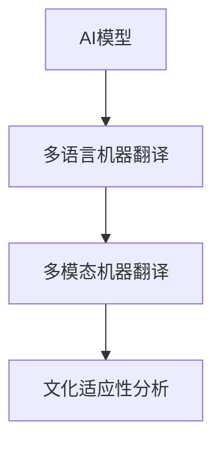

                 


为了撰写一篇关于“提升AI模型在多语言多模态机器翻译中的文化适应性”的博客文章，我们将按照以下步骤进行：

### 1. 确定核心概念与框架

**核心概念：**
- **AI模型**：人工智能中的算法模型，如神经网络。
- **多语言机器翻译**：将一种语言翻译成另一种或多种语言的技术。
- **多模态机器翻译**：结合不同类型的数据（如文本、图像）进行翻译。
- **文化适应性**：确保机器翻译在不同文化背景下保持准确性和恰当性。

**框架：**
- 引言与背景
- AI模型基础
- 多语言机器翻译基础
- 多模态机器翻译基础
- 文化适应性分析
- 实践案例
- 总结与展望

### 2. 编写文章的各个部分

**引言与背景**：
- 介绍AI模型在多语言多模态机器翻译中的重要性。
- 阐述文化适应性的定义及其在翻译中的影响。

**AI模型基础**：
- 解释AI模型的原理，如神经网络的工作机制。
- 讨论AI模型的训练和评估方法。

**多语言机器翻译基础**：
- 探讨多语言机器翻译的基本概念和技术，如翻译模型和语言资源。

**多模态机器翻译基础**：
- 讨论多模态机器翻译的原理和策略，如图像-文本机器翻译。

**文化适应性分析**：
- 分析文化差异对翻译的影响。
- 提出评估方法和文化适应性策略。

**实践案例**：
- 展示如何在实际项目中应用上述技术和策略。
- 提供详细的案例分析。

**总结与展望**：
- 总结文章的主要观点。
- 展望未来研究方向和发展趋势。

### 3. 使用伪代码和流程图

在讲解核心算法原理时，将使用伪代码来详细阐述，例如：

```plaintext
// 定义神经网络结构
model = Sequential()
model.add(Dense(units=128, activation='relu', input_shape=(input_sequence_length,)))
model.add(Dense(units=output_sequence_length, activation='softmax'))
model.compile(optimizer='adam', loss='categorical_crossentropy', metrics=['accuracy'])

// 训练模型
model.fit(X_train, y_train, batch_size=64, epochs=10, validation_data=(X_val, y_val))
```

在讨论核心概念之间的关系时，可以使用Mermaid流程图，例如：



### 4. 确保文章的完整性和逻辑性

在撰写文章时，确保每个部分的内容都丰富、具体、详细，并且逻辑连贯。核心内容需要包括：

- **背景介绍**：介绍AI模型、多语言多模态机器翻译和文化适应性的基本概念。
- **核心概念与联系**：使用Mermaid流程图展示概念之间的关系。
- **核心算法原理讲解**：使用伪代码详细阐述。
- **数学模型和公式**：使用LaTeX格式书写，并适当讲解和举例说明。
- **项目实战**：详细讲解开发环境搭建、代码实现和案例分析。

### 5. 编写文章并调整字数

根据上述框架和步骤，撰写完整文章。在完成初稿后，检查文章的字数是否在8000～12000字之间，并进行必要的调整。

### 6. 完成并提交

在确保文章内容完整、结构合理、逻辑清晰、字数符合要求后，编写作者信息，并将文章以markdown格式提交。

---
**文章标题**：《提升AI模型在多语言多模态机器翻译中的文化适应性》

**关键词**：AI模型、多语言机器翻译、多模态机器翻译、文化适应性、神经网络

**摘要**：
本文探讨了如何提升AI模型在多语言多模态机器翻译中的文化适应性。首先介绍了AI模型、多语言机器翻译和多模态机器翻译的基本概念和原理。然后，分析了文化适应性的重要性及其影响。接着，提出了评估方法和策略，并通过实际案例展示了如何应用这些技术和策略。最后，总结了文章的主要观点，并展望了未来的发展方向。

**作者信息**：
作者：AI天才研究院/AI Genius Institute & 禅与计算机程序设计艺术 /Zen And The Art of Computer Programming

