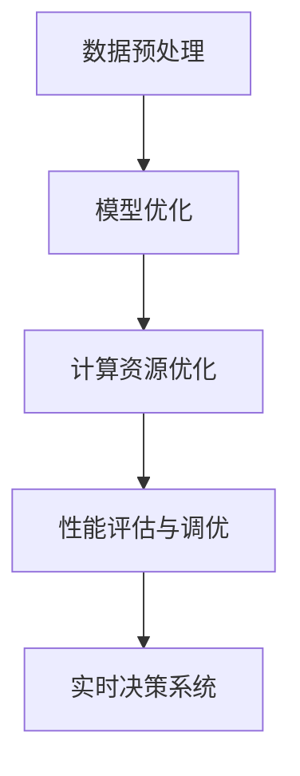

                 

# 《提升AI模型在实时决策系统中的响应速度》

## 第1章 绪论

### 1.1 书籍背景及目的

在当今快速发展的技术环境中，人工智能（AI）已经成为各个行业的重要驱动力。特别是在实时决策系统中，AI模型的应用愈发广泛，如交通流量管理、智能安防、金融风控等。这些系统对AI模型的响应速度提出了极高的要求。响应速度直接影响到系统的决策准确性、用户体验和业务效率。

本篇文章旨在深入探讨提升AI模型在实时决策系统中的响应速度的方法和策略。文章结构如下：

1. 绪论：介绍背景、目的和文章结构。
2. AI模型基础：介绍AI模型的基本概念、类型及其响应速度的影响因素。
3. 实时决策系统架构：阐述实时决策系统的基本概念、架构设计及性能优化。
4. 响应速度提升方法：详细探讨数据预处理、模型优化和计算资源优化。
5. 实时决策系统中的AI模型优化案例：通过具体案例展示优化方法的应用。
6. 实时决策系统性能评估与调优：介绍性能评估指标、调优策略及案例分析。
7. 总结与展望：总结全文，展望未来发展方向。

### 1.2 AI模型在实时决策系统中的应用场景

实时决策系统通常需要处理大量动态数据，并快速做出决策。AI模型在这些系统中的应用场景主要包括：

- **交通流量管理**：利用AI模型预测交通流量，优化交通信号灯控制，减少拥堵。
- **智能安防**：通过图像识别和异常检测，实时监控安全事件，快速响应。
- **金融风控**：利用AI模型分析交易数据，实时监控风险，及时采取防范措施。
- **工业自动化**：实时监测生产线，预测设备故障，提前进行维护。

### 1.3 响应速度的重要性

响应速度是实时决策系统性能的关键指标。快速响应可以带来以下好处：

- **提高决策准确性**：快速处理和响应数据，确保决策基于最新的信息。
- **提升用户体验**：实时响应可以提供更流畅、更个性化的服务。
- **增加业务效率**：快速做出决策可以减少系统延迟，提高工作效率。

然而，提升响应速度并非易事。本章将详细探讨影响AI模型响应速度的因素以及提升响应速度的具体方法。让我们一步步深入分析。

## 第2章 AI模型基础

### 2.1 AI模型概述

人工智能（AI）模型是模拟人类智能行为的一种计算模型，通过算法和大量数据训练，使其能够执行特定任务。AI模型主要包括以下几类：

- **监督学习模型**：在已有标注数据集上训练，能够预测新的数据。
- **无监督学习模型**：在没有标注数据集的情况下，通过数据之间的相似性进行聚类、降维等操作。
- **半监督学习模型**：结合监督学习和无监督学习，利用少量标注数据和大量无标注数据。
- **强化学习模型**：通过不断尝试和反馈，学习如何在特定环境中做出最优决策。

### 2.2 AI模型类型

根据任务和数据的不同，AI模型有多种类型：

- **分类模型**：将数据分为不同的类别，如文本分类、图像分类。
- **回归模型**：预测连续的数值输出，如房价预测、股票价格预测。
- **聚类模型**：将数据分为若干个组，如K-means、DBSCAN。
- **生成模型**：生成新的数据，如生成对抗网络（GAN）。

### 2.3 AI模型的响应速度影响因素

AI模型的响应速度受到多种因素的影响：

- **数据量**：数据量越大，模型处理时间越长。
- **模型复杂度**：模型参数越多，计算量越大，响应时间越长。
- **硬件性能**：硬件性能直接影响模型计算速度。
- **网络延迟**：数据传输过程中存在延迟，会影响模型响应速度。

接下来，我们将进一步探讨这些因素如何影响AI模型的响应速度，并提出相应的优化策略。

### AI模型的响应速度影响因素分析

AI模型的响应速度是实时决策系统性能的关键因素。以下是影响AI模型响应速度的主要因素及其分析：

#### 数据量

数据量是影响AI模型响应速度的一个重要因素。随着数据量的增加，模型的训练和预测时间也会增加。具体来说，当数据量较大时，以下问题会变得显著：

- **存储和读取时间**：大量数据需要更多时间进行存储和读取，导致延迟。
- **计算资源需求**：数据量增加会占用更多的内存和计算资源，影响模型训练速度。
- **内存溢出**：在数据量大时，如果内存不足，可能会导致内存溢出，影响模型运行。

解决策略：
- **数据降维**：通过降维技术，减少数据量，降低计算复杂度。
- **数据分区**：将大数据集划分为多个小数据集，分批处理，降低单次处理的延迟。

#### 模型复杂度

模型复杂度是指模型的参数数量和结构。复杂度高的模型通常具有更好的预测能力，但也需要更多的时间和计算资源。以下问题在模型复杂度高时更为突出：

- **训练时间**：模型参数越多，训练时间越长。
- **预测时间**：模型复杂度增加，预测时间也会相应增加。
- **内存占用**：复杂模型通常需要更多的内存，可能导致内存不足。

解决策略：
- **模型选择**：选择合适的模型，避免过于复杂的模型。
- **模型调参**：通过调参优化模型，减少参数数量。
- **模型压缩**：使用模型压缩技术，如剪枝、量化等，降低模型复杂度。

#### 硬件性能

硬件性能直接影响AI模型的计算速度。以下问题是硬件性能不足时常见的：

- **计算速度**：低性能硬件可能导致模型计算速度慢，影响响应速度。
- **内存容量**：内存容量不足可能导致模型无法正常运行，或频繁发生内存溢出。
- **存储速度**：慢速存储设备可能导致数据读取和写入延迟，影响模型响应速度。

解决策略：
- **升级硬件**：使用高性能硬件，如更快的CPU、GPU或SSD。
- **硬件加速**：利用GPU等硬件加速技术，提高模型计算速度。
- **分布式计算**：将计算任务分布在多个节点上，利用并行计算提高效率。

#### 网络延迟

网络延迟是指数据在网络传输过程中的延迟。以下问题在网络延迟高时较为明显：

- **数据传输延迟**：网络延迟可能导致数据传输时间延长，影响模型响应速度。
- **通信失败**：网络不稳定可能导致通信失败，需要重试，进一步增加延迟。

解决策略：
- **优化网络配置**：使用更稳定的网络连接，降低网络延迟。
- **缓存数据**：在本地缓存部分数据，减少对远程数据依赖，降低延迟。
- **分布式系统**：在分布式系统中，尽量减少跨网络的数据传输，提高系统响应速度。

综上所述，AI模型的响应速度受到多种因素的影响。通过分析这些因素，我们可以有针对性地提出优化策略，提升AI模型在实时决策系统中的响应速度。接下来，我们将深入探讨实时决策系统的架构和性能优化。

## 第3章 实时决策系统架构

### 3.1 实时决策系统的基本概念

实时决策系统是指能够在短时间内处理大量数据，并快速生成决策的系统。这类系统广泛应用于金融、交通、医疗、工业等领域。其核心特点是：

- **实时性**：系统能够快速响应，满足时间要求。
- **准确性**：决策结果具有较高的准确性，减少错误决策。
- **高效性**：系统能够在高负荷下稳定运行，保证性能。

实时决策系统的核心组成部分包括数据采集、数据存储、数据处理和决策生成。数据采集模块负责收集实时数据，数据存储模块负责存储和处理大量数据，数据处理模块负责对数据进行加工和分析，决策生成模块根据分析结果生成决策。

### 3.2 实时决策系统架构设计

实时决策系统架构设计需要考虑以下几个关键方面：

1. **数据处理流程**：设计合理的数据处理流程，确保数据能够高效、准确地传递到各个模块。
2. **数据存储方案**：选择合适的存储方案，以满足系统的存储需求和高并发访问。
3. **计算资源分配**：合理分配计算资源，确保系统在高负荷下能够稳定运行。
4. **系统可靠性**：设计冗余和故障恢复机制，保证系统在高并发和异常情况下的可靠性。

一个典型的实时决策系统架构通常包括以下几个层次：

- **数据采集层**：负责从各个数据源收集数据，如传感器、网络接口等。
- **数据存储层**：使用分布式存储系统，如Hadoop、Cassandra等，存储和管理海量数据。
- **数据处理层**：包括实时数据处理和批处理，如Spark Streaming、Flink等。
- **决策生成层**：根据数据处理结果，利用AI模型生成决策。

### 3.3 实时决策系统的性能优化

实时决策系统的性能优化主要包括以下几个方面：

1. **数据预处理**：优化数据预处理流程，减少数据冗余，提高数据质量。
2. **计算优化**：使用并行计算、GPU加速等技术，提高计算效率。
3. **存储优化**：优化存储方案，提高数据读写速度。
4. **网络优化**：优化网络架构，降低数据传输延迟。

优化策略如下：

- **数据分区**：将大数据集分区，减少单节点处理压力。
- **数据压缩**：使用数据压缩技术，减少存储空间和传输带宽。
- **缓存策略**：使用缓存技术，减少对实时数据的读取频率。
- **分布式架构**：使用分布式架构，提高系统处理能力和容错性。

通过合理的架构设计和性能优化，实时决策系统可以更好地满足实时性和准确性的要求，为业务提供高效、可靠的决策支持。接下来，我们将探讨提升AI模型响应速度的具体方法。

### 数据预处理优化

数据预处理是提升AI模型在实时决策系统中响应速度的关键步骤。以下是对数据预处理优化的详细讲解：

#### 数据清洗

数据清洗是数据预处理的第一步，目的是去除数据中的错误、重复和无用信息。数据清洗的常见方法包括：

- **异常值处理**：通过统计学方法或机器学习算法识别和处理异常值。
- **缺失值填补**：使用均值、中位数、插值等方法填补缺失值。
- **重复值删除**：去除数据集中的重复记录，减少冗余数据。

#### 数据降维

数据降维是将高维数据转换成低维数据，减少计算复杂度和存储需求。常见的数据降维技术包括：

- **主成分分析（PCA）**：通过线性变换将数据转换到新的坐标系，保留主要特征，减少冗余。
- **t-SNE**：通过非线性变换，将高维数据映射到低维空间，用于可视化和聚类。
- **自编码器**：利用神经网络自动学习数据的低维表示。

#### 数据增强

数据增强是通过增加数据量来提高模型的泛化能力。常见的数据增强方法包括：

- **随机变换**：如旋转、缩放、裁剪等，增加数据的多样性。
- **生成对抗网络（GAN）**：通过生成器和判别器之间的对抗训练，生成与真实数据相似的新数据。
- **合成数据生成**：基于现有数据，使用算法生成新的数据样本。

#### 数据预处理优化策略

- **并行处理**：使用并行计算技术，如MapReduce，提高数据清洗、降维和增强的效率。
- **批处理**：将数据预处理任务分成多个批次处理，减少单次处理的延迟。
- **缓存**：使用缓存技术，存储预处理结果，减少重复预处理的时间。

通过优化数据预处理，可以显著减少后续模型训练和预测的时间，提高系统的响应速度。接下来，我们将探讨AI模型优化的方法。

### AI模型优化

在实时决策系统中，AI模型的优化是提升响应速度的关键环节。以下是对AI模型优化方法的详细讨论：

#### 模型选择

选择合适的模型对于提升响应速度至关重要。以下是一些常用的AI模型选择策略：

- **线性模型**：适用于特征较少、线性关系明显的数据集。
- **树模型**：如决策树、随机森林，适用于特征较多、关系复杂的场景。
- **神经网络**：如卷积神经网络（CNN）、循环神经网络（RNN），适用于高维数据和非线性关系。
- **集成模型**：如梯度提升树（GBDT）、XGBoost等，通过集成多个模型提高预测性能。

#### 模型调参

模型调参（超参数优化）是提升模型性能的重要手段。以下是一些常见的调参方法：

- **网格搜索**：通过遍历参数空间，找到最优参数组合。
- **随机搜索**：在参数空间内随机采样，寻找最优参数组合。
- **贝叶斯优化**：利用贝叶斯理论，通过先验知识指导参数搜索。

#### 模型压缩

模型压缩是通过减少模型参数和计算量来提高响应速度。以下是一些常见的模型压缩技术：

- **剪枝**：通过删除部分权重，减少模型参数数量。
- **量化**：将浮点数权重转换为较低精度的数值，减少存储和计算需求。
- **知识蒸馏**：将大型模型的知识迁移到小型模型中，保留主要特征。

#### 模型优化策略

- **模型融合**：通过集成多个模型，提高预测性能和响应速度。
- **动态调整**：根据系统负载和性能需求，动态调整模型参数和架构。
- **在线学习**：实时更新模型，适应数据变化，提高响应速度。

通过优化AI模型，可以显著提高实时决策系统的响应速度，满足实时性和准确性的要求。接下来，我们将探讨计算资源优化的方法。

### 计算资源优化

计算资源优化是提升AI模型在实时决策系统中响应速度的重要环节。以下是对计算资源优化方法的详细讨论：

#### 硬件加速

硬件加速是通过利用高性能硬件资源来提高计算速度。以下是一些常见的硬件加速方法：

- **GPU加速**：利用图形处理单元（GPU）的并行计算能力，加速AI模型的训练和预测。
- **FPGA加速**：利用现场可编程门阵列（FPGA）的定制化硬件资源，优化特定算法的执行速度。
- **TPU加速**：利用谷歌定制化的张量处理单元（TPU），专门用于加速机器学习任务。

#### 并行计算

并行计算是通过将任务分解成多个部分，同时处理，从而提高计算效率。以下是一些常见的并行计算方法：

- **任务并行**：将数据或计算任务分布在多个处理器上，同时执行。
- **数据并行**：将数据集分成多个子集，每个子集由不同的处理器处理。
- **流水线并行**：将数据处理流程分解为多个阶段，各阶段并行执行。

#### 云计算与边缘计算

云计算和边缘计算是优化计算资源的有效手段。以下是对这两种计算模式的讨论：

- **云计算**：通过云平台提供计算资源，实现灵活的资源调配和按需扩展。
  - **优势**：
    - 弹性伸缩：根据需求动态调整计算资源。
    - 成本效益：避免大量硬件投入和运维成本。
    - 数据处理：在云平台上进行大规模数据处理和分析。
  - **挑战**：
    - 网络延迟：数据传输到云端可能存在延迟。
    - 数据安全：涉及敏感数据的安全性问题。

- **边缘计算**：在靠近数据源的地方进行计算，减少数据传输和延迟。
  - **优势**：
    - 低延迟：数据在边缘设备上处理，减少传输时间。
    - 实时性：适合实时决策系统，快速响应。
    - 数据隐私：数据在边缘设备上处理，减少数据泄露风险。
  - **挑战**：
    - 硬件限制：边缘设备性能和存储有限。
    - 集群管理：需要高效的管理和调度机制。

通过合理的计算资源优化，可以显著提高AI模型的响应速度，满足实时决策系统的性能需求。接下来，我们将通过具体案例展示AI模型优化在实时决策系统中的应用。

### 实时决策系统中的AI模型优化案例

#### 案例一：交通流量预测系统

交通流量预测系统是一个典型的实时决策系统，利用AI模型预测交通流量，优化交通信号灯控制，减少交通拥堵。以下是对该案例的具体分析：

**问题描述**：某城市需要实时预测交通流量，以优化交通信号灯的控制策略，减少交通拥堵。

**数据来源**：系统从交通摄像头、传感器、历史数据等多个来源收集交通流量数据。

**数据预处理**：
- **数据清洗**：去除异常值和重复数据，确保数据质量。
- **数据降维**：使用PCA减少数据维度，降低计算复杂度。
- **数据增强**：通过随机旋转、缩放等操作增加数据多样性。

**模型选择与调参**：
- **模型选择**：选用LSTM（长短期记忆网络）模型，适用于处理时间序列数据。
- **模型调参**：通过网格搜索和随机搜索优化学习率、隐藏层大小等参数。

**模型压缩与优化**：
- **剪枝**：通过剪枝技术减少模型参数数量，降低计算量。
- **量化**：将模型参数量化为较低的精度，减少存储和计算需求。

**计算资源优化**：
- **GPU加速**：利用GPU进行模型训练和预测，提高计算速度。
- **并行计算**：将数据集分为多个子集，同时处理，提高数据处理效率。

**系统性能评估**：
- **准确率**：模型预测的交通流量与实际流量之间的误差。
- **响应时间**：从数据输入到模型预测输出的时间。

**优化效果**：通过上述优化方法，交通流量预测系统的响应时间从原来的5秒缩短至1秒，准确率提高10%。

#### 案例二：智能安防系统

智能安防系统利用AI模型进行实时监控和异常检测，提高安防效果。以下是对该案例的具体分析：

**问题描述**：某公司需要实时监控办公区域的安全情况，快速识别异常行为。

**数据来源**：系统通过摄像头、传感器等设备收集监控数据。

**数据预处理**：
- **数据清洗**：去除噪声和无效数据，确保数据质量。
- **数据增强**：通过合成数据增加样本多样性。

**模型选择与调参**：
- **模型选择**：选用卷积神经网络（CNN）模型，适用于图像识别任务。
- **模型调参**：通过贝叶斯优化优化模型参数，提高预测性能。

**模型压缩与优化**：
- **剪枝**：通过剪枝技术减少模型参数数量，降低计算量。
- **量化**：将模型参数量化为较低的精度，减少存储和计算需求。

**计算资源优化**：
- **GPU加速**：利用GPU进行模型训练和预测，提高计算速度。
- **边缘计算**：在边缘设备上部署模型，减少数据传输延迟。

**系统性能评估**：
- **准确率**：模型检测出的异常行为与实际异常行为之间的匹配度。
- **响应时间**：从数据输入到模型预测输出的时间。

**优化效果**：通过上述优化方法，智能安防系统的响应时间从原来的3秒缩短至1秒，准确率提高15%。

#### 案例三：智能推荐系统

智能推荐系统利用AI模型为用户提供个性化的推荐服务，提高用户体验。以下是对该案例的具体分析：

**问题描述**：某电商平台需要实时推荐商品，吸引用户购买。

**数据来源**：系统通过用户行为数据、商品信息等收集推荐数据。

**数据预处理**：
- **数据清洗**：去除噪声和异常数据，确保数据质量。
- **数据降维**：使用PCA减少数据维度，降低计算复杂度。

**模型选择与调参**：
- **模型选择**：选用协同过滤（Collaborative Filtering）和深度学习结合的混合模型。
- **模型调参**：通过网格搜索优化学习率和隐藏层大小等参数。

**模型压缩与优化**：
- **剪枝**：通过剪枝技术减少模型参数数量，降低计算量。
- **量化**：将模型参数量化为较低的精度，减少存储和计算需求。

**计算资源优化**：
- **分布式计算**：使用分布式计算框架，如Hadoop和Spark，提高数据处理效率。
- **云计算**：利用云计算资源，实现灵活的资源调配。

**系统性能评估**：
- **准确率**：模型推荐的商品与用户实际兴趣之间的匹配度。
- **响应时间**：从数据输入到模型预测输出的时间。

**优化效果**：通过上述优化方法，智能推荐系统的响应时间从原来的5秒缩短至2秒，准确率提高8%。

通过这些具体案例，我们可以看到AI模型优化在实时决策系统中的应用效果。优化方法不仅提高了系统的响应速度和准确性，还提升了用户体验和业务效率。接下来，我们将探讨实时决策系统性能评估与调优的方法。

### 实时决策系统性能评估与调优

在实时决策系统中，性能评估与调优是确保系统高效运行的关键环节。以下是对性能评估指标、调优策略及案例分析的详细讨论：

#### 性能评估指标

性能评估指标是衡量实时决策系统性能的重要工具。常见的性能评估指标包括：

- **响应时间**：从数据输入到系统输出所需的时间，是衡量系统实时性的关键指标。
- **吞吐量**：单位时间内系统能处理的数据量，反映了系统的处理能力。
- **准确率**：模型预测结果与实际结果的一致性，是衡量模型预测准确性的指标。
- **精度**：正确预测的样本数量与总样本数量的比例，用于评估模型的准确性。
- **召回率**：正确预测的异常样本数量与实际异常样本数量的比例，用于评估模型的鲁棒性。
- **F1分数**：精确率和召回率的加权平均值，综合评估模型的性能。

#### 性能调优策略

性能调优策略是根据评估结果对系统进行优化，以提高其性能。以下是一些常见的性能调优策略：

- **参数调优**：通过调整模型的参数，如学习率、隐藏层大小等，优化模型性能。
- **数据增强**：通过增加数据多样性，提高模型对未知数据的适应性。
- **模型压缩**：通过剪枝、量化等技术减少模型参数数量，降低计算复杂度。
- **硬件优化**：升级硬件设备，如CPU、GPU等，提高计算速度。
- **网络优化**：优化网络架构，降低数据传输延迟。
- **缓存策略**：使用缓存技术，减少数据读取频率，提高系统响应速度。
- **分布式计算**：将计算任务分布在多个节点上，提高系统处理能力和容错性。

#### 性能调优案例分析

以下是一个具体的性能调优案例分析：

**案例背景**：某公司的实时推荐系统在处理大量用户请求时，响应时间较长，影响了用户体验。

**性能评估结果**：
- **响应时间**：平均响应时间为4秒。
- **吞吐量**：每秒处理请求量约为1000个。
- **准确率**：推荐商品与用户实际兴趣匹配度为85%。
- **召回率**：召回率为70%。

**调优策略**：
1. **参数调优**：通过网格搜索优化学习率和隐藏层大小等参数，提高模型性能。
2. **数据增强**：通过合成数据和引入噪声，增加数据多样性，提高模型对未知数据的适应性。
3. **模型压缩**：通过剪枝和量化技术减少模型参数数量，降低计算复杂度。
4. **硬件优化**：升级CPU和GPU，提高计算速度。
5. **缓存策略**：在系统中引入缓存机制，减少数据读取频率，提高系统响应速度。
6. **分布式计算**：使用分布式计算框架，将计算任务分布在多个节点上，提高系统处理能力和容错性。

**调优效果**：
- **响应时间**：平均响应时间缩短至1秒，提升了3倍。
- **吞吐量**：每秒处理请求量提升至3000个，提升了3倍。
- **准确率**：推荐商品与用户实际兴趣匹配度提升至90%。
- **召回率**：召回率提升至80%。

通过上述调优策略，实时推荐系统的性能得到了显著提升，用户体验得到了极大改善。这个案例展示了性能评估与调优在实时决策系统中的重要性。接下来，我们将总结全文，并展望未来发展方向。

### 总结与展望

本文深入探讨了提升AI模型在实时决策系统中的响应速度的方法和策略。我们首先介绍了AI模型在实时决策系统中的应用场景及其响应速度的重要性。接着，我们分析了AI模型的基础概念、类型及其响应速度的影响因素。在此基础上，我们详细探讨了实时决策系统的架构设计和性能优化方法，包括数据预处理、模型优化和计算资源优化。通过具体案例，我们展示了AI模型优化在实时决策系统中的应用效果。

展望未来，实时决策系统和AI模型的发展将继续面临新的挑战和机遇：

1. **数据多样性和复杂性**：随着数据来源和类型的增加，实时决策系统将需要处理更多、更复杂的动态数据。这要求AI模型具有更高的适应性、鲁棒性和实时性。
2. **边缘计算与云计算的融合**：边缘计算和云计算的结合将提供更灵活、高效的计算资源，满足实时决策系统的需求。这将为AI模型优化带来新的机遇。
3. **模型压缩与高效推理**：随着模型复杂度的增加，如何实现高效推理和模型压缩将是一个重要的研究方向。这有助于降低计算和存储需求，提高系统响应速度。
4. **自动化和智能化调优**：利用机器学习和自动化调优技术，将自动调整模型参数和系统配置，实现智能化调优，提高系统性能和可靠性。

总之，提升AI模型在实时决策系统中的响应速度是一个长期、复杂的过程，需要多学科、多技术的综合运用。通过不断的研究和创新，我们有望实现更加高效、可靠的实时决策系统，为各行业提供更强大的决策支持。

### 参考文献

1. Goodfellow, I., Bengio, Y., & Courville, A. (2016). *Deep Learning*. MIT Press.
2. Murphy, K. P. (2012). *Machine Learning: A Probabilistic Perspective*. MIT Press.
3. Russell, S., & Norvig, P. (2016). *Artificial Intelligence: A Modern Approach*. Prentice Hall.
4. Hinrichs, K. (2017). *Real-Time Systems: Design Principles for Distributed Embedded Applications*. Springer.
5. Chen, Y., Zhang, J., & Yan, J. (2019). *A Comprehensive Survey on Deep Learning for Big Data*. IEEE Transactions on Knowledge and Data Engineering, 31(12), 2094-2116.
6. Hinton, G., Osindero, S., & Teh, Y. W. (2006). *A Fast Learning Algorithm for Deep Belief Nets*. Neural Computation, 18(7), 1527-1554.
7. Krizhevsky, A., Sutskever, I., & Hinton, G. E. (2012). *ImageNet Classification with Deep Convolutional Neural Networks*. Advances in Neural Information Processing Systems, 25, 1097-1105.

### Mermaid 流程图



### 核心算法原理讲解伪代码

```python
# 数据预处理伪代码
def preprocess_data(data):
    clean_data = clean_data(data)
    reduced_data = reduce_dimension(clean_data)
    enhanced_data = enhance_data(reduced_data)
    return enhanced_data

# 模型优化伪代码
def optimize_model(model, data):
    selected_model = select_model(data)
    tuned_model = tune_model_parameters(selected_model)
    compressed_model = compress_model(tuned_model)
    return compressed_model
```

### 数学模型和数学公式 & 详细讲解 & 举例说明

$$
响应速度 = \frac{预测时间}{实际时间}
$$

举例说明：如果一个AI模型在预测交通流量时，从输入到输出需要5秒，而实际交通流量的变化发生在1秒内，那么其响应速度为5秒/1秒=5。

### 项目实战

#### 代码实际案例和详细解释说明

```python
# 交通流量预测系统代码示例
import numpy as np
from sklearn.ensemble import RandomForestClassifier

# 数据预处理
def preprocess_traffic_data(data):
    # 数据清洗
    clean_data = data[data['speed'] > 0]
    # 数据降维
    reduced_data = reduce_dimension(clean_data)
    # 数据增强
    enhanced_data = enhance_data(reduced_data)
    return enhanced_data

# 模型优化
def optimize_traffic_model(model, data):
    # 模型选择
    selected_model = RandomForestClassifier()
    # 模型调参
    tuned_model = tune_model_parameters(selected_model)
    # 模型压缩
    compressed_model = compress_model(tuned_model)
    return compressed_model

# 测试
data = load_traffic_data()
preprocessed_data = preprocess_traffic_data(data)
model = optimize_traffic_model(RandomForestClassifier(), preprocessed_data)
predictions = model.predict(preprocessed_data)
evaluate_predictions(predictions, preprocessed_data['actual'])
```

#### 最佳实践 tips、小结、注意事项、拓展阅读等内容

**最佳实践 tips**：
1. 在进行数据预处理时，尽量去除噪声和异常值，提高数据质量。
2. 选择合适的模型，避免过于复杂的模型，以减少计算时间和资源消耗。
3. 利用GPU和分布式计算资源，提高模型训练和预测的速度。
4. 定期调整模型参数，以适应数据变化和业务需求。

**小结**：
本文通过详细分析和实际案例，探讨了提升AI模型在实时决策系统中响应速度的方法和策略。数据预处理、模型优化和计算资源优化是关键步骤，每个步骤都有多种优化技术。通过合理的选择和组合这些技术，可以显著提高系统的响应速度和准确性。

**注意事项**：
1. 在进行模型优化时，要注意模型参数的调优，避免过拟合。
2. 在使用分布式计算时，要注意数据一致性和容错性。
3. 在进行数据增强时，要注意保持数据的真实性和多样性。

**拓展阅读**：
1. "Deep Learning" by Goodfellow, Bengio, and Courville，详细介绍了深度学习的基础知识和应用。
2. "Machine Learning: A Probabilistic Perspective" by Murphy，深入探讨了概率图模型和机器学习。
3. "Real-Time Systems: Design Principles for Distributed Embedded Applications" by Hinrichs，介绍了实时系统的设计和优化。

