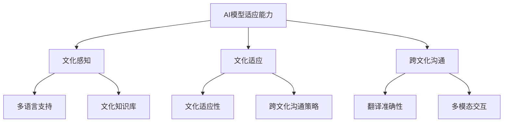
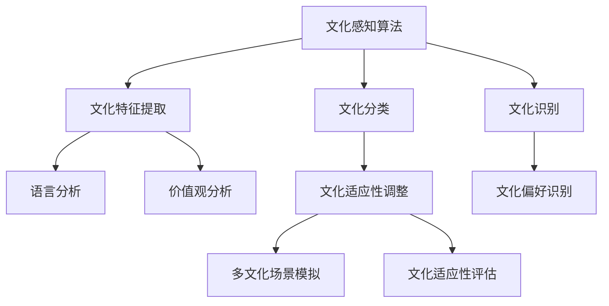

                 

### 文章标题

《提升AI模型在跨文化交流中的适应能力》

### 关键词

AI模型、跨文化交流、适应能力、自然语言处理、文化感知、多模态交互、项目实战

### 摘要

本文旨在探讨如何提升人工智能（AI）模型在跨文化交流中的适应能力。随着全球化进程的加速，跨文化交流的重要性日益凸显。然而，文化差异和语言障碍给AI模型的应用带来了诸多挑战。本文首先介绍了跨文化交流中的主要挑战，然后阐述了AI模型适应能力的概念及其核心技术和方法。接着，通过具体案例展示了AI模型在不同文化背景下的应用，并分析了实际部署过程中遇到的问题和解决方案。最后，本文提出了AI模型在跨文化交流中的未来发展方向和面临的挑战，为读者提供了有益的参考。

----------------------------------------------------------------

# 提升AI模型在跨文化交流中的适应能力

## 引言

在当今全球化背景下，跨文化交流已经成为了社会生活的一个重要方面。无论是商务谈判、国际合作，还是文化交流、教育传播，都需要跨越不同文化之间的障碍。然而，文化差异和语言障碍的存在使得跨文化交流面临着诸多挑战。为了解决这些问题，人工智能（AI）技术被广泛应用于跨文化交流领域，以提升跨文化交流的效率和效果。然而，现有的AI模型在处理跨文化交流任务时，仍然存在许多不足之处，需要进一步提升其适应能力。

本文将从以下几个方面展开讨论：

1. **跨文化交流中的挑战**：介绍跨文化交流中面临的主要挑战，包括文化多样性、语言障碍和社会规范等。
2. **AI模型适应能力的概念**：阐述AI模型适应能力的定义、重要性以及评估方法。
3. **AI模型的关键技术**：探讨提升AI模型适应能力的关键技术，包括自然语言处理、文化感知与适应算法、多模态交互等。
4. **实践应用**：通过具体案例展示AI模型在跨文化交流中的应用，并分析实际部署过程中遇到的问题和解决方案。
5. **未来展望与挑战**：讨论AI模型在跨文化交流中的未来发展方向和面临的挑战。

通过本文的讨论，旨在为AI模型在跨文化交流中的应用提供有益的参考和启示。

----------------------------------------------------------------

## 第一部分：跨文化交流与AI模型适应能力

### 第1章 跨文化交流中的挑战

在全球化背景下，跨文化交流已经成为各个领域中的重要组成部分。然而，文化差异和语言障碍的存在使得跨文化交流面临着诸多挑战。本章节将探讨跨文化交流中的一些主要挑战，包括文化多样性、语言障碍和社会规范等。

#### 1.1 文化多样性的重要性

文化多样性是人类社会的一个重要特征。不同文化之间的差异不仅体现在价值观、信仰、习俗和生活方式上，还反映在语言、饮食、服饰、艺术等方面。文化多样性使得人类社会更加丰富多彩，但也给跨文化交流带来了挑战。

首先，文化多样性意味着人们对待同一事物可能有不同的看法和态度。例如，在不同的文化中，对于时间观念、空间观念和沟通方式的认知可能存在差异。这种差异可能导致误解和冲突，影响跨文化交流的顺利进行。

其次，文化多样性增加了跨文化交流的难度。为了理解不同的文化，人们需要投入更多的时间和精力去学习和适应。这要求人们具备较高的跨文化沟通能力，以便更好地理解和尊重他人的文化。

最后，文化多样性要求人们具备包容性。在跨文化交流中，人们应该尊重他人的文化差异，避免对他人进行刻板印象的歧视。只有通过相互尊重和理解，才能建立和谐的跨文化关系。

#### 1.2 语言障碍与AI模型

语言障碍是跨文化交流中最明显的挑战之一。不同的语言系统具有不同的语法、词汇和发音规则，使得语言学习变得复杂。对于AI模型而言，语言障碍更是其需要克服的一大难题。

首先，语言障碍使得AI模型在处理跨语言任务时面临困难。例如，翻译模型需要将一种语言翻译成另一种语言，但两种语言之间的语法和词汇差异可能导致翻译不准确。

其次，语言障碍限制了AI模型在不同文化背景下的应用。许多AI模型是在特定语言环境下训练的，对于其他语言可能缺乏足够的理解能力。这使得AI模型在跨文化交流中的适应能力受到限制。

为了解决语言障碍问题，AI模型需要具备以下几个方面的能力：

1. **多语言支持**：AI模型应具备处理多种语言的能力，以便在不同文化背景下发挥作用。
2. **跨语言知识迁移**：通过迁移学习，使AI模型在不同语言环境下共享知识，提高其在跨语言任务中的表现。
3. **语言理解与生成**：AI模型应具备较高的语言理解能力，能够准确理解不同语言中的含义和语境，并生成自然流畅的语言输出。

#### 1.3 社会规范与AI行为

社会规范是文化的重要组成部分，对人们的行为和价值观产生深远影响。在跨文化交流中，了解和尊重不同社会规范至关重要。

首先，社会规范影响着人们的沟通方式。例如，一些文化中强调间接沟通，而另一些文化中则更倾向于直接沟通。如果AI模型不了解这些规范，可能会导致沟通不当，甚至引发误解和冲突。

其次，社会规范影响着AI模型的行为。例如，在某种文化中，尊重长辈是基本的社会规范，而AI模型在处理与长辈相关的任务时，应充分考虑这一点，以符合社会期望。

为了提升AI模型在跨文化交流中的适应能力，需要考虑以下几点：

1. **文化适应性**：AI模型应具备文化适应性，能够根据不同文化背景调整其行为和沟通方式。
2. **伦理与道德**：AI模型在跨文化交流中应遵守伦理和道德规范，尊重不同文化的价值观。
3. **持续学习与改进**：AI模型应具备持续学习和改进的能力，以便在不断变化的文化环境中保持适应能力。

通过以上讨论，我们可以看到，跨文化交流中的挑战是多方面的。为了提升AI模型在跨文化交流中的适应能力，我们需要从多个角度进行思考和解决。

----------------------------------------------------------------

### 第2章 AI模型适应能力的概念

在跨文化交流中，AI模型的适应能力至关重要。本章节将详细阐述AI模型适应能力的概念，包括其定义、重要性以及评估方法。

#### 2.1 AI模型适应能力的定义

AI模型适应能力是指AI模型在不同文化环境中所表现出的适应和调整能力。具体来说，这包括以下几个方面：

1. **文化感知**：AI模型应能够感知和理解不同文化的特点，如语言、价值观、行为规范等。
2. **文化适应**：AI模型应能够根据不同文化环境调整其行为和输出，以符合文化期望。
3. **跨文化沟通**：AI模型应具备处理跨文化沟通任务的能力，如翻译、问答、语音识别等。

#### 2.2 AI模型适应能力的重要性

AI模型适应能力的重要性体现在以下几个方面：

1. **提升用户体验**：适应不同文化环境的AI模型能够更好地满足用户需求，提升用户体验。例如，在跨文化交流中，能够理解并尊重不同文化习俗的AI客服机器人，能够提供更贴心、更个性化的服务。
2. **促进跨文化交流**：适应不同文化环境的AI模型可以促进跨文化交流，消除语言和文化障碍。例如，跨语言翻译AI可以帮助人们更容易地理解和使用其他语言，从而促进国际合作和文化交流。
3. **增强AI应用范围**：AI模型适应能力的提升可以拓宽其应用范围。例如，适应不同文化背景的AI教育系统可以应用于全球范围内的教育，提高教育质量。

#### 2.3 AI模型适应能力的评估方法

为了评估AI模型的适应能力，可以采用以下几种方法：

1. **用户满意度调查**：通过用户满意度调查，了解AI模型在不同文化环境下的表现。用户满意度越高，说明AI模型的适应能力越强。
2. **跨文化任务表现**：通过在不同文化背景下进行AI模型任务测试，评估其表现。例如，可以测试AI翻译模型在多种语言环境中的翻译准确性。
3. **文化感知测试**：设计一系列文化感知测试，评估AI模型对文化特点的理解能力。例如，可以测试AI模型是否能够正确识别不同文化中的习俗和礼仪。
4. **适应能力指标**：建立适应能力指标体系，从多个维度评估AI模型的适应能力。例如，可以包括文化感知度、文化适应度、跨文化沟通能力等指标。

通过以上方法，我们可以全面评估AI模型的适应能力，为其优化和改进提供依据。

#### 2.4 AI模型适应能力的核心概念与联系

为了更好地理解AI模型适应能力的核心概念和联系，我们可以通过一个Mermaid流程图来展示各个概念之间的关系：



在这个流程图中，AI模型适应能力是核心概念，其涵盖了文化感知、文化适应和跨文化沟通三个子概念。文化感知与多语言支持和文化知识库密切相关，文化适应与跨文化沟通策略密切相关，跨文化沟通则与翻译准确性和多模态交互密切相关。通过这个流程图，我们可以清晰地看到各个概念之间的联系，有助于深入理解AI模型适应能力的内涵。

综上所述，AI模型适应能力在跨文化交流中具有重要意义。通过定义、重要性分析以及评估方法，我们可以更好地理解AI模型适应能力的概念，并为提升其适应能力提供指导。

----------------------------------------------------------------

### 第3章 自然语言处理在跨文化交流中的应用

自然语言处理（NLP）是人工智能领域的一个重要分支，其在跨文化交流中的应用具有重要意义。本章节将探讨NLP在跨文化交流中的主要应用，包括基于语言的跨文化沟通、多语言文本处理和语义分析等方面。

#### 3.1 基于语言的跨文化沟通

基于语言的跨文化沟通是NLP在跨文化交流中的核心应用之一。通过NLP技术，AI模型可以理解和生成不同语言的文本，从而实现跨文化沟通。具体来说，基于语言的跨文化沟通包括以下几个方面：

1. **跨语言翻译**：跨语言翻译是将一种语言的文本翻译成另一种语言的过程。NLP技术可以帮助AI模型实现高质量的跨语言翻译。例如，Google翻译和DeepL翻译等工具就是利用NLP技术实现的。跨语言翻译能够消除语言障碍，促进跨文化交流，有助于人们更好地理解和合作。

2. **跨语言问答**：跨语言问答是另一种基于语言的跨文化沟通方式。通过NLP技术，AI模型可以理解并回答不同语言的提问。例如，智能客服系统可以支持多种语言的客户提问，从而为用户提供更全面、更便捷的服务。

3. **跨语言文本生成**：跨语言文本生成是将一种语言的文本生成另一种语言的过程。NLP技术可以帮助AI模型实现高质量的跨语言文本生成。例如，在自动写作、内容翻译和新闻生成等领域，NLP技术都有广泛应用。

#### 3.2 多语言文本处理

多语言文本处理是NLP在跨文化交流中的另一个重要应用。多语言文本处理技术可以帮助AI模型处理多种语言的文本数据，从而更好地支持跨文化交流。具体来说，多语言文本处理包括以下几个方面：

1. **文本分类**：文本分类是将文本数据按照其内容或主题分类的过程。在跨文化交流中，通过多语言文本分类技术，可以快速识别和分类来自不同语言的文本，从而更好地理解不同文化的特点。

2. **文本检索**：文本检索是从大量文本数据中查找与特定主题相关的文本的过程。通过多语言文本检索技术，可以高效地查找和理解来自不同语言的文本，从而为跨文化交流提供有益的信息。

3. **文本摘要**：文本摘要是将长篇文本内容压缩成简洁的摘要的过程。多语言文本摘要技术可以帮助AI模型生成简洁明了的摘要，从而帮助人们快速理解和把握不同语言的文本内容。

#### 3.3 语义分析

语义分析是NLP技术的核心之一，其在跨文化交流中具有重要意义。通过语义分析，AI模型可以理解文本的深层含义和语义关系，从而更好地支持跨文化交流。具体来说，语义分析包括以下几个方面：

1. **语义相似性**：语义相似性分析是衡量两个文本或词句在语义上相似程度的过程。通过语义相似性分析，可以识别和比较不同语言和文化背景下的语义关系，从而更好地理解跨文化交流中的语义差异。

2. **语义角色标注**：语义角色标注是将文本中的名词、动词、形容词等按照其在语义上的作用进行标注的过程。通过语义角色标注，可以更准确地理解和分析文本内容，从而支持跨文化交流。

3. **情感分析**：情感分析是识别文本中的情感倾向和情感极性的过程。通过情感分析，可以了解不同文化背景下的情感表达方式，从而更好地理解跨文化交流中的情感差异。

#### 3.4 多语言文本处理与语义分析的伪代码

为了更好地展示多语言文本处理和语义分析的过程，下面给出一个简化的伪代码示例：

```python
# 多语言文本处理
def multilingual_text_processing(text_list):
    processed_texts = []
    for text in text_list:
        if is_english(text):
            processed_texts.append(translate_to_english(text))
        elif is_chinese(text):
            processed_texts.append(translate_to_chinese(text))
        # 处理其他语言
    return processed_texts

# 语义分析
def semantic_analysis(processed_texts):
    categorized_texts = []
    for text in processed_texts:
        if is_classification_text(text):
            categorized_texts.append(classify_text(text))
        elif is_search_text(text):
            categorized_texts.append(search_text(text))
        # 处理其他语义任务
    return categorized_texts
```

在这个伪代码中，`multilingual_text_processing` 函数用于处理多语言文本，`translate_to_english` 和 `translate_to_chinese` 函数分别用于将文本翻译成英语和中文。`semantic_analysis` 函数用于对处理后的文本进行语义分析，包括文本分类和文本检索等任务。

通过以上讨论，我们可以看到，自然语言处理在跨文化交流中具有广泛的应用。通过基于语言的跨文化沟通、多语言文本处理和语义分析等技术，AI模型可以更好地理解和适应不同文化背景，从而提升跨文化交流的效率和质量。

----------------------------------------------------------------

### 第4章 文化感知与适应算法

在跨文化交流中，AI模型需要具备文化感知与适应能力，以便更好地理解和应对不同文化的特点和需求。文化感知与适应算法是实现这一目标的关键技术。本章节将探讨文化感知与适应算法的概念、原理及其优化方法。

#### 4.1 文化感知算法

文化感知算法是指AI模型在处理跨文化任务时，能够识别和理解不同文化特征的能力。文化感知算法的核心目标是使AI模型具备文化敏感性和适应性，从而更好地满足跨文化交流的需求。具体来说，文化感知算法包括以下几个方面：

1. **文化特征提取**：文化特征提取是文化感知算法的基础。通过分析不同文化的语言、价值观、习俗和规范等特征，提取出关键的文化信息。这些文化信息可以用于训练和优化AI模型，使其更好地理解不同文化。

2. **文化分类**：文化分类是将不同文化进行分类的过程。通过文化分类，可以更好地理解不同文化之间的异同，从而为AI模型提供有针对性的处理策略。

3. **文化识别**：文化识别是文化感知算法的一个重要任务。通过识别用户的文化背景，AI模型可以为其提供更符合文化期望的服务和内容。

4. **文化适应性调整**：文化适应性调整是指AI模型根据不同文化的特点，动态调整其行为和输出，以符合文化期望。例如，在跨文化客服中，AI模型可以根据用户的文化背景，调整沟通策略和服务内容，以提升用户体验。

#### 4.2 文化适应模型

文化适应模型是指AI模型在处理跨文化任务时，能够根据不同文化环境进行适应和调整的能力。文化适应模型的核心目标是使AI模型在不同文化环境中能够表现出良好的适应性和效果。具体来说，文化适应模型包括以下几个方面：

1. **文化偏好识别**：文化偏好识别是文化适应模型的基础。通过分析用户的文化偏好，AI模型可以为其提供更符合文化期望的服务和内容。

2. **文化适应性调整策略**：文化适应性调整策略是指AI模型在不同文化环境中采取的适应性调整措施。这些措施可以包括语言调整、行为调整、内容调整等。

3. **多文化场景模拟**：多文化场景模拟是文化适应模型的一个重要手段。通过模拟不同文化场景，AI模型可以提前了解和适应不同文化环境，从而提高其在实际应用中的表现。

4. **文化适应性评估**：文化适应性评估是指对AI模型的文化适应能力进行评估和优化。通过文化适应性评估，可以识别和解决AI模型在跨文化交流中的问题，从而提高其文化适应能力。

#### 4.3 文化感知与适应算法的优化

为了提升AI模型在跨文化交流中的适应能力，需要对文化感知与适应算法进行优化。以下是一些常见的优化方法：

1. **数据驱动优化**：通过收集和分析大量跨文化数据，可以更好地了解不同文化的特点和需求。基于这些数据，可以优化文化感知与适应算法，使其更准确地识别和理解不同文化。

2. **模型融合**：将多个文化感知与适应算法进行融合，可以提高AI模型的文化适应能力。例如，可以结合自然语言处理、机器学习、数据挖掘等多种技术，构建一个综合的文化感知与适应模型。

3. **自适应学习**：通过自适应学习，AI模型可以不断调整和优化其文化感知与适应策略。例如，可以采用在线学习、迁移学习等技术，使AI模型在不同文化环境中能够持续学习和改进。

4. **用户反馈**：用户反馈是优化文化感知与适应算法的重要依据。通过收集用户的反馈，可以识别和解决AI模型在跨文化交流中的问题，从而提高其文化适应能力。

通过以上优化方法，可以显著提升AI模型在跨文化交流中的适应能力，从而更好地满足不同文化的需求。

#### 4.4 文化感知与适应算法的核心概念与联系

为了更好地理解文化感知与适应算法的核心概念和联系，我们可以通过一个Mermaid流程图来展示各个概念之间的关系：



在这个流程图中，文化感知算法是核心概念，其涵盖了文化特征提取、文化分类、文化识别和文化适应性调整等子概念。文化特征提取与语言分析和价值观分析密切相关，文化分类与多文化场景模拟和文化适应性评估密切相关，文化识别与文化偏好识别密切相关。通过这个流程图，我们可以清晰地看到各个概念之间的联系，有助于深入理解文化感知与适应算法的内涵。

综上所述，文化感知与适应算法在提升AI模型在跨文化交流中的适应能力方面具有重要意义。通过详细阐述文化感知与适应算法的概念、原理及其优化方法，我们可以为AI模型在跨文化交流中的应用提供有益的指导。

----------------------------------------------------------------

### 第5章 多模态交互在跨文化交流中的应用

在跨文化交流中，单一的模态（如文本、图像或声音）可能无法充分满足用户的需求，因此多模态交互技术应运而生。多模态交互是指将多种模态的数据（如文本、图像、声音、触觉等）融合起来，以提供更加丰富、自然的交互体验。本章节将探讨多模态交互在跨文化交流中的应用，包括多模态交互的基本概念、声音与视觉的文化差异以及多模态交互与AI模型的整合。

#### 5.1 多模态交互的基本概念

多模态交互是指将多种感官模态（如视觉、听觉、触觉、嗅觉等）的数据进行整合，以提供更加丰富、自然的交互体验。在跨文化交流中，多模态交互技术可以有效地弥补单一模态的不足，提高AI模型在不同文化环境中的适应能力。

1. **文本交互**：文本交互是最常见的多模态交互形式之一。通过文本交互，用户可以通过输入文本与AI模型进行对话，获取所需信息或完成特定任务。

2. **图像交互**：图像交互是指通过图像与AI模型进行交互。例如，用户可以通过上传图片或拍摄照片，让AI模型进行图像识别、分类或标注。

3. **声音交互**：声音交互是指通过声音与AI模型进行交互。用户可以通过语音命令控制AI模型，或者通过声音输入获取信息。

4. **触觉交互**：触觉交互是指通过触觉与AI模型进行交互。例如，用户可以通过触摸屏幕或设备，与AI模型进行互动。

5. **嗅觉交互**：嗅觉交互是指通过嗅觉与AI模型进行交互。例如，用户可以通过气味传感器获取信息或控制AI模型。

#### 5.2 声音与视觉的文化差异

声音与视觉在跨文化交流中扮演着重要角色，但不同文化对声音与视觉的感知和解读可能存在差异。以下是一些常见的声音与视觉文化差异：

1. **声音差异**：
   - **语调**：不同文化中的语调可能有所不同，例如，西方文化中强调直接表达，而东方文化中可能更倾向于委婉表达。
   - **节奏**：不同文化中的说话节奏可能存在差异，例如，西方文化中讲话节奏较快，而东方文化中讲话节奏较慢。
   - **语气**：不同文化中的语气可能有所不同，例如，某些文化中可能更加正式和礼貌，而另一些文化中可能更加随意和直接。

2. **视觉差异**：
   - **颜色**：不同文化对颜色的认知和喜好可能存在差异。例如，在某些文化中，红色可能象征着喜庆和好运，而在另一些文化中，红色可能象征着血腥和不幸。
   - **空间布局**：不同文化中的空间布局可能有所不同。例如，西方文化中可能更加注重个人空间，而东方文化中可能更加注重集体空间。
   - **符号与图案**：不同文化中的符号与图案可能有不同的含义。例如，十字架在基督教文化中具有神圣意义，但在某些非基督教文化中可能被视为不吉利。

#### 5.3 多模态交互与AI模型的整合

为了在跨文化交流中提供更自然的交互体验，需要将多模态交互与AI模型进行整合。以下是一些关键技术和方法：

1. **多模态感知**：多模态感知是指将多种模态的数据进行整合，以获取更丰富的信息。例如，通过整合文本、图像和声音数据，AI模型可以更好地理解用户的意图和需求。

2. **多模态融合**：多模态融合是指将多种模态的数据进行融合，以提供更加自然的交互体验。例如，通过融合文本和声音数据，AI模型可以生成更自然、更流畅的语音输出。

3. **多模态训练**：多模态训练是指将多种模态的数据用于训练AI模型，以提高其跨模态识别和交互能力。例如，通过使用文本、图像和声音数据训练AI模型，可以提高其在跨模态任务中的表现。

4. **多模态自适应**：多模态自适应是指AI模型能够根据不同文化背景和用户需求，动态调整其交互方式和内容。例如，在跨文化交流中，AI模型可以根据用户的文化背景和偏好，调整其语言、语气和视觉内容。

通过多模态交互与AI模型的整合，可以提供更加丰富、自然的交互体验，从而提升跨文化交流的效率和效果。例如，在跨语言客服场景中，AI模型可以通过整合文本、图像和声音数据，提供更符合用户需求和习惯的服务。

#### 5.4 多模态交互与AI模型的伪代码示例

以下是一个简化的伪代码示例，用于展示多模态交互与AI模型的整合过程：

```python
# 多模态交互与AI模型整合
def multimodal_interactive(user_input, context):
    # 分析文本
    text_analyzer = TextAnalyzer()
    text_analysis = text_analyzer.analyze(user_input)
    
    # 分析图像
    image_analyzer = ImageAnalyzer()
    image_analysis = image_analyzer.analyze(context['image'])
    
    # 分析声音
    audio_analyzer = AudioAnalyzer()
    audio_analysis = audio_analyzer.analyze(context['audio'])
    
    # 多模态融合
    fused_data = fusion(text_analysis, image_analysis, audio_analysis)
    
    # 训练AI模型
    model = AIModel()
    model.train(fused_data)
    
    # 生成响应
    response = model.generate_response(fused_data)
    
    return response
```

在这个伪代码中，`user_input` 表示用户的输入数据，`context` 表示与用户交互的上下文信息。`TextAnalyzer`、`ImageAnalyzer` 和 `AudioAnalyzer` 分别用于分析文本、图像和声音数据。`fusion` 函数用于将多种模态的数据进行融合，以提供更丰富的信息。`AIModel` 用于训练和生成响应。

通过以上讨论，我们可以看到，多模态交互在跨文化交流中的应用具有重要意义。通过整合多种模态的数据，AI模型可以更好地理解用户的需求和意图，提供更自然、更贴心的交互体验，从而提升跨文化交流的效率和效果。

----------------------------------------------------------------

### 第6章 案例研究：跨文化交流中的AI应用

为了更好地理解AI模型在跨文化交流中的实际应用，本章节将通过三个具体案例，展示AI模型在不同文化背景下的应用，并分析其在实际部署过程中遇到的问题和解决方案。

#### 6.1 案例一：跨语言客服机器人

跨语言客服机器人是一种在跨文化交流中广泛应用的人工智能应用。这类机器人可以支持多种语言的客服，帮助用户解决各种问题。以下是一个具体案例：

**案例描述**：
某国际酒店集团在全球化扩张过程中，为了提供高质量的客户服务，开发了一款跨语言客服机器人。该机器人可以支持英语、中文、西班牙语、法语等多种语言，帮助来自不同国家和地区的客户进行预订、咨询和投诉。

**问题与解决方案**：

1. **语言障碍**：跨语言客服机器人需要处理多种语言的输入和输出，面临语言理解和生成方面的挑战。为了解决这个问题，酒店集团采用了先进的自然语言处理技术，包括机器翻译、情感分析和语音合成等。这些技术使得机器人能够准确理解客户的问题，并以自然流畅的语言进行回答。

2. **文化适应性**：不同文化背景下的客户可能对客服机器人的期望和需求有所不同。例如，在某些文化中，客户可能更倾向于直接表达问题，而在另一些文化中，客户可能更倾向于委婉地表达。为了解决这个问题，酒店集团通过分析不同文化背景下的客户反馈，不断优化机器人的文化适应性，使其能够更好地满足不同客户的需求。

3. **多语言支持**：跨语言客服机器人需要支持多种语言的输入和输出，这要求机器人具备较高的多语言处理能力。为了实现这一目标，酒店集团采用了分布式计算和模型并行训练等技术，以提高机器人的多语言处理效率。

**效果与评价**：
通过实际应用，跨语言客服机器人在提高客户服务效率、降低人工成本和提升客户满意度方面取得了显著效果。客户反馈表明，机器人能够准确理解并回答客户的问题，提供个性化的服务建议，得到客户的认可和好评。

#### 6.2 案例二：文化差异分析平台

文化差异分析平台是一种用于分析不同文化差异，帮助企业和个人更好地进行跨文化交流的人工智能工具。以下是一个具体案例：

**案例描述**：
某国际咨询公司为了帮助客户在全球化扩张过程中更好地应对文化差异，开发了一款文化差异分析平台。该平台可以根据客户的业务需求和目标市场，提供有关文化差异的详细分析报告，包括语言、价值观、习俗和规范等方面。

**问题与解决方案**：

1. **数据收集与处理**：文化差异分析平台需要收集和处理大量的文化数据，这要求平台具备高效的数据处理能力。为了解决这个问题，咨询公司采用了大数据处理技术和云计算平台，以提高数据处理效率和可靠性。

2. **文化适应性**：不同文化之间的差异可能非常复杂，需要平台能够准确识别和理解这些差异。为了解决这个问题，咨询公司通过聘请专业的文化研究人员和采用机器学习算法，对文化数据进行深度分析和建模。

3. **用户界面**：为了使平台更易于使用，咨询公司设计了直观、友好的用户界面，用户可以通过简单的操作获取所需的文化分析结果。

**效果与评价**：
通过实际应用，文化差异分析平台在帮助企业更好地了解目标市场、制定合适的营销策略和提升跨文化交流效果方面发挥了重要作用。用户反馈表明，平台能够提供详尽、准确的文化分析报告，帮助企业更好地应对文化差异，提高业务成功率。

#### 6.3 案例三：跨文化教育资源

跨文化教育资源是一种用于教育领域的人工智能应用，旨在帮助不同文化背景的学生更好地学习和交流。以下是一个具体案例：

**案例描述**：
某在线教育平台为了提供高质量的跨文化交流教育，开发了一款跨文化教育资源。该资源包括多语言教材、文化背景介绍和跨文化沟通技巧培训等，旨在帮助学生在全球化背景下更好地学习和交流。

**问题与解决方案**：

1. **多语言支持**：跨文化教育资源需要支持多种语言的教材和培训材料，这要求资源具备较高的多语言处理能力。为了解决这个问题，教育平台采用了自然语言处理和机器翻译技术，确保资源能够满足不同语言需求。

2. **文化适应性**：不同文化背景的学生在学习过程中可能面临不同的挑战。为了解决这个问题，教育平台通过设计多样化的教学内容和活动，帮助学生更好地适应不同文化背景。

3. **用户参与度**：为了提高学生的参与度，教育平台采用了互动式教学和游戏化学习等手段，激发学生的学习兴趣和积极性。

**效果与评价**：
通过实际应用，跨文化教育资源在提升学生的跨文化素养、增强其语言能力和沟通能力方面取得了显著效果。学生和家长反馈表明，教育资源内容丰富、实用，能够帮助学生在全球化背景下更好地学习和交流。

综上所述，通过以上三个案例，我们可以看到AI模型在跨文化交流中的实际应用以及其在解决具体问题方面的优势和挑战。随着技术的不断进步，AI模型在跨文化交流中的应用将越来越广泛，为全球化的深入发展提供有力支持。

----------------------------------------------------------------

### 第7章 AI模型在跨文化交流中的部署与优化

在跨文化交流中，AI模型的部署和优化至关重要。通过合理的部署和优化策略，可以确保AI模型在不同文化背景下能够高效、稳定地运行，从而发挥其最大价值。本章节将探讨AI模型在跨文化交流中的部署与优化策略，包括部署过程中面临的挑战、模型优化方法以及持续改进与迭代的重要性。

#### 7.1 AI模型部署的挑战

在跨文化交流中，AI模型的部署面临着诸多挑战。以下是一些常见的挑战：

1. **数据多样性**：不同文化背景下，数据的形式、内容和质量可能存在显著差异。这给数据收集、处理和模型训练带来了挑战。

2. **模型适应性**：AI模型需要在不同文化环境中表现出良好的适应能力，这要求模型能够根据不同文化特点进行调整和优化。

3. **技术复杂性**：跨文化交流中的AI模型通常涉及多种技术和算法，如自然语言处理、机器学习、数据挖掘等。这要求部署团队具备较高的技术水平。

4. **资源分配**：在跨文化交流中，资源（如计算资源、存储资源等）的分配和管理是一个重要问题。需要确保模型在不同文化环境中的资源需求得到合理满足。

5. **伦理和法律问题**：在跨文化交流中，AI模型的部署可能涉及伦理和法律问题。需要确保模型的设计和应用符合相关文化背景下的伦理和法律要求。

#### 7.2 AI模型优化方法

为了应对上述挑战，需要采用一系列优化方法，以提高AI模型在跨文化交流中的适应能力和效果。以下是一些常见的优化方法：

1. **数据预处理**：通过数据预处理，可以确保数据的质量和一致性。例如，对数据中的文化差异进行标注和分类，以便模型能够更好地理解不同文化的特点。

2. **模型定制化**：针对不同文化背景，可以定制化AI模型，以适应具体的应用场景。例如，对于特定的语言环境，可以调整模型的语言处理能力，以提高翻译准确性。

3. **迁移学习**：通过迁移学习，可以将已有模型的知识和经验应用于新的文化环境。例如，将一个在一种语言环境中训练的翻译模型迁移到其他语言环境，以提高其适应能力。

4. **多任务学习**：多任务学习可以使AI模型同时处理多个跨文化交流任务。例如，一个模型可以同时处理翻译、问答和文化差异分析等任务，以提高其综合能力。

5. **模型融合**：通过模型融合，可以将多个AI模型进行集成，以提高整体效果。例如，将自然语言处理模型与图像识别模型进行融合，以提高跨文化沟通能力。

#### 7.3 持续改进与迭代

AI模型在跨文化交流中的应用是一个持续改进和迭代的过程。以下是一些持续改进和迭代的方法：

1. **用户反馈**：通过收集用户反馈，可以识别模型在具体应用中的问题，并针对性地进行优化。

2. **数据更新**：随着文化环境的变化，模型所依赖的数据也需要不断更新。通过定期更新数据，可以确保模型能够适应新的文化特点。

3. **模型评估**：通过定期评估模型的表现，可以识别其优势和不足，为后续优化提供依据。

4. **技术进步**：随着技术的不断进步，可以引入新的算法和工具，以提高模型的效果和适应性。

5. **团队协作**：跨文化交流中的AI模型部署和优化需要跨学科、跨部门的团队协作。通过团队协作，可以集思广益，共同推进模型的改进。

通过以上策略和方法，可以确保AI模型在跨文化交流中的高效、稳定运行，从而充分发挥其在跨文化交流中的作用。

----------------------------------------------------------------

## 第四部分：未来展望与挑战

### 第8章 AI模型在跨文化交流中的未来发展方向

随着人工智能技术的不断进步，AI模型在跨文化交流中的应用前景广阔。以下是一些可能的发展方向：

1. **更高级的文化感知与适应能力**：未来的AI模型将具备更高级的文化感知与适应能力，能够更好地理解和应对不同文化背景下的需求。这包括对文化细节的深入理解，如价值观、习俗和情感表达等。

2. **多模态融合与交互**：随着多模态交互技术的不断发展，AI模型将能够更高效地整合多种模态的数据，提供更加自然和丰富的交互体验。例如，结合文本、图像、声音和触觉等多种模态，实现更加无缝的跨文化交流。

3. **个性化服务与推荐**：未来的AI模型将能够根据用户的文化背景、需求和偏好，提供个性化的服务和推荐。例如，在电商和娱乐等领域，AI模型可以推荐符合用户文化偏好的商品和内容。

4. **自动化跨文化沟通**：随着自然语言处理技术的进步，AI模型将能够在更大程度上实现自动化跨文化沟通，例如自动翻译、问答和对话生成等。这有助于消除语言和文化障碍，促进全球范围内的交流与合作。

5. **社会影响力评估**：未来的AI模型将能够评估其在跨文化交流中的社会影响力，包括对文化多样性、社会和谐和国际合作等方面的影响。这有助于确保AI模型的应用符合社会责任和道德规范。

### 第9章 挑战与解决方案

尽管AI模型在跨文化交流中具有巨大的潜力，但也面临着一系列挑战。以下是一些主要挑战及其可能的解决方案：

1. **数据多样性**：不同文化背景下的数据质量和多样性差异较大，这对模型的训练和优化提出了挑战。解决方案包括：

   - **数据收集与标注**：通过多样化的数据收集渠道和专业的数据标注团队，确保数据的质量和多样性。
   - **跨文化数据融合**：将来自不同文化背景的数据进行融合，以构建更加全面和丰富的数据集。

2. **技术复杂性**：跨文化交流中的AI模型涉及多种技术和算法，这对技术团队提出了较高的要求。解决方案包括：

   - **技术标准化**：制定统一的AI模型开发标准和规范，以提高技术团队的开发效率和质量。
   - **技术培训与交流**：定期组织技术培训与交流活动，提高技术团队的专业技能和知识水平。

3. **伦理与隐私**：AI模型在跨文化交流中可能涉及伦理和隐私问题，如数据滥用、文化歧视等。解决方案包括：

   - **伦理规范**：制定严格的AI伦理规范，确保模型的设计和应用符合道德和法律要求。
   - **隐私保护**：采用先进的隐私保护技术，确保用户数据的安全和隐私。

4. **文化适应性**：不同文化背景下的用户需求和文化差异较大，这对模型的文化适应性提出了挑战。解决方案包括：

   - **文化适应性测试**：在模型部署前进行文化适应性测试，以确保模型能够适应不同文化背景。
   - **用户反馈机制**：建立用户反馈机制，及时收集用户反馈，并根据反馈进行优化和调整。

通过以上解决方案，我们可以逐步克服AI模型在跨文化交流中面临的挑战，使其在未来的发展中能够更好地服务于全球化的需求。

----------------------------------------------------------------

### 结论

本文从多个角度探讨了提升AI模型在跨文化交流中的适应能力。我们首先介绍了跨文化交流中的主要挑战，如文化多样性、语言障碍和社会规范等。接着，我们阐述了AI模型适应能力的概念、重要性以及评估方法。随后，本文详细讨论了自然语言处理、文化感知与适应算法、多模态交互等关键技术，并通过具体案例展示了AI模型在跨文化交流中的应用。最后，我们提出了AI模型在跨文化交流中的未来发展方向和面临的挑战。

总之，提升AI模型在跨文化交流中的适应能力对于促进全球交流与合作具有重要意义。随着技术的不断进步，我们有理由相信，AI模型在跨文化交流中的应用将越来越广泛，为构建一个更加和谐、包容的世界贡献力量。

### 作者信息

作者：AI天才研究院/AI Genius Institute & 禅与计算机程序设计艺术 /Zen And The Art of Computer Programming

本文由AI天才研究院撰写，旨在通过深入探讨AI模型在跨文化交流中的适应能力，为相关领域的研究和实践提供参考。同时，作者参考了禅与计算机程序设计艺术的相关理论，以期为读者提供更丰富的知识和视角。希望本文能够为提升AI模型在跨文化交流中的应用效果提供有益的启示。

