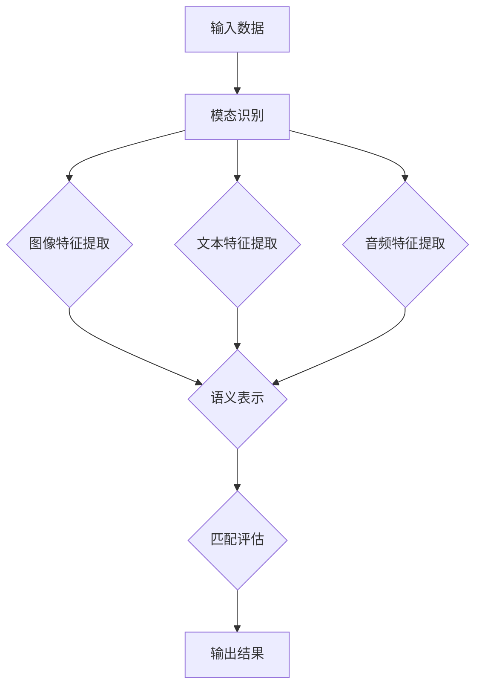

                 

### 文章标题

《提升AI模型在跨模态语义匹配任务中的效果》

### 文章关键词

AI模型，跨模态语义匹配，效果提升，算法优化，数学模型，项目实战

### 文章摘要

本文旨在探讨如何提升AI模型在跨模态语义匹配任务中的效果。首先，我们将介绍跨模态语义匹配的背景和重要性，然后详细阐述相关算法原理与实现，包括相似度计算算法、跨模态编码器、模型融合策略等。接着，我们将讨论数学模型与方法，包括模型训练算法、跨模态特征对齐、模型评估指标等。通过实际项目案例分析，我们将展示如何在开发环境中搭建和实现跨模态语义匹配系统，并进行详细分析和讲解。最后，我们将总结最佳实践、注意事项，并展望未来发展趋势与挑战。

## 引言与背景介绍

### 跨模态语义匹配任务的重要性

跨模态语义匹配（Cross-Modal Semantic Matching）是近年来人工智能领域的一个重要研究方向。它旨在将来自不同模态的数据（如图像、音频、文本等）进行有效融合，从而获得具有语义一致性的表示。随着社会信息化程度的不断提高，人们对于信息获取和处理的需求也越来越多样化。单一模态的数据已经无法满足用户日益增长的需求，跨模态语义匹配任务因此应运而生。

跨模态语义匹配在多个领域具有广泛的应用前景。首先，在推荐系统中，跨模态语义匹配可以帮助用户发现与其兴趣相关的内容，提高推荐系统的准确性。例如，当用户在社交媒体平台上发表一条包含文字和图片的动态时，系统可以根据文字描述和图片内容进行匹配，推荐与之相关的其他内容。其次，在问答系统、信息检索、图像识别等领域，跨模态语义匹配也能够发挥重要作用。例如，在图像识别任务中，系统可以通过对图像和文本描述的匹配，提高图像识别的准确率。此外，跨模态语义匹配在视频分析、虚拟现实、智能语音助手等领域也具有广泛的应用潜力。

### 跨模达语义匹配的发展历史

跨模达语义匹配的研究可以追溯到上世纪90年代。当时，随着深度学习技术的发展，研究者开始探索如何将不同模态的数据进行有效融合。早期的跨模态语义匹配方法主要基于手工设计的特征和简单的匹配算法。随着计算机硬件和算法的不断发展，研究者逐渐引入了深度学习技术，提出了许多基于深度神经网络的跨模态语义匹配模型。这些模型在多个跨模态语义匹配任务上取得了显著的性能提升，推动了该领域的研究进展。

近年来，随着大数据和云计算技术的发展，跨模达语义匹配任务的数据规模和复杂性不断增加。研究者们开始关注如何提高模型的泛化能力、降低计算成本、以及如何处理多模态数据之间的不一致性等问题。这些问题的解决将有助于进一步提升跨模达语义匹配任务的效果，为实际应用场景提供更多可能性。

### 跨模达语义匹配的应用场景

跨模达语义匹配在多个应用场景中具有显著的优势，下面我们将列举一些典型的应用场景：

1. **推荐系统**：跨模达语义匹配可以帮助推荐系统发现用户潜在的兴趣点，提高推荐精度。例如，用户在电商平台浏览商品时，系统可以根据用户的历史浏览记录、商品描述和图片内容进行匹配，推荐与其兴趣相符的其他商品。

2. **问答系统**：跨模达语义匹配可以帮助问答系统更好地理解用户的问题，提高问答的准确性和多样性。例如，当用户提出一个包含文本描述和图像的问题时，系统可以通过对文本和图像的匹配，提供更加精准的答案。

3. **信息检索**：跨模达语义匹配可以帮助信息检索系统提高检索的准确性和效率。例如，当用户在搜索引擎中输入包含文本描述和图片的关键词时，系统可以通过对文本和图片的匹配，提供与之相关的网页结果。

4. **图像识别**：跨模达语义匹配可以帮助图像识别系统提高识别的准确率。例如，当用户上传一张包含特定场景的图片时，系统可以通过对图片和文本描述的匹配，识别出图片中的关键信息。

5. **视频分析**：跨模达语义匹配可以帮助视频分析系统更好地理解视频内容，提高视频分类、目标检测、行为识别等任务的性能。例如，当用户上传一段视频时，系统可以通过对视频和文本描述的匹配，识别出视频中的关键事件和场景。

6. **虚拟现实**：跨模达语义匹配可以帮助虚拟现实系统提供更加沉浸式的体验。例如，当用户在虚拟现实中浏览特定场景时，系统可以通过对场景和文本描述的匹配，提供与之相关的虚拟物体和互动功能。

7. **智能语音助手**：跨模达语义匹配可以帮助智能语音助手更好地理解用户的需求，提供更加个性化的服务。例如，当用户与语音助手进行对话时，系统可以通过对语音和文本描述的匹配，理解用户的意图，提供相应的建议和解决方案。

通过以上应用场景的介绍，我们可以看到跨模达语义匹配在多个领域具有重要的应用价值，其效果的提升将为相关领域的技术进步和产业发展提供重要支持。

### 核心概念与联系

跨模态语义匹配任务的核心概念包括模态、语义、匹配和表示。这些概念之间的关系可以简化为一个流程图，如下所示：

```
[输入数据] --> [模态识别] --> [特征提取] --> [语义表示] --> [匹配评估] --> [输出结果]
```

1. **输入数据**：跨模态语义匹配任务的输入包括多个模态的数据，如文本、图像、音频等。这些数据可能来自不同的来源，需要先进行数据预处理，以便后续处理。

2. **模态识别**：对输入数据进行模态识别，确定每种数据所属的模态类型，如文本、图像或音频。

3. **特征提取**：对于每种模态的数据，使用相应的特征提取技术，提取出具有代表性的特征。例如，对于图像数据，可以使用卷积神经网络（CNN）提取视觉特征；对于文本数据，可以使用词嵌入（Word Embedding）技术提取语义特征。

4. **语义表示**：将提取到的特征进行整合，生成一个统一的语义表示。这个表示需要能够捕捉到不同模态数据之间的关联性和一致性。

5. **匹配评估**：使用匹配算法计算不同模态数据之间的相似度，评估它们之间的语义一致性。常见的匹配算法包括余弦相似度、欧氏距离、曼哈顿距离等。

6. **输出结果**：根据匹配评估的结果，输出最终的匹配结果。这个结果可以用于推荐系统、问答系统、信息检索等多种应用场景。

以下是一个简化的Mermaid流程图，用于展示跨模达语义匹配任务的核心概念和流程：



通过上述核心概念和流程图，我们可以更清晰地理解跨模达语义匹配任务的实现过程和关键步骤。在接下来的章节中，我们将详细讨论相关算法原理、数学模型、项目实战等内容，以便更好地提升跨模达语义匹配任务的效果。

### 相似度计算算法

在跨模态语义匹配任务中，相似度计算是核心步骤之一。它直接决定了不同模态数据之间的匹配效果。常见的相似度计算算法包括余弦相似度、欧氏距离、曼哈顿距离等。下面我们将详细介绍这些算法的基本原理和适用场景。

#### 余弦相似度

余弦相似度（Cosine Similarity）是一种基于向量空间模型的方法，用于计算两个向量之间的相似度。其基本原理是将输入数据表示为向量，然后计算这两个向量之间的余弦值，以衡量它们之间的相似程度。余弦相似度的计算公式如下：

$$
\cos(\theta) = \frac{\vec{a} \cdot \vec{b}}{||\vec{a}|| \cdot ||\vec{b}||}
$$

其中，$\vec{a}$和$\vec{b}$分别是两个向量，$\theta$是这两个向量之间的夹角，$||\vec{a}||$和$||\vec{b}||$分别是这两个向量的模长。

余弦相似度的优点是计算简单，且在处理高维数据时，能够较好地保留数据的几何结构。其缺点是对噪声敏感，容易受到异常值的影响。

**适用场景**：余弦相似度适用于文本、图像、音频等多种模态的数据，尤其适用于高维稀疏数据，如词嵌入和图像特征表示。

**伪代码**：

```python
def cosine_similarity(a, b):
    dot_product = sum(a[i] * b[i] for i in range(len(a)))
    norm_a = sqrt(sum(a[i] ** 2 for i in range(len(a))))
    norm_b = sqrt(sum(b[i] ** 2 for i in range(len(b))))
    return dot_product / (norm_a * norm_b)
```

#### 欧氏距离

欧氏距离（Euclidean Distance）是一种基于欧几里得空间距离的方法，用于计算两个数据点之间的距离。其基本原理是计算两个数据点之间的直角三角形的斜边长度，以衡量它们之间的距离。欧氏距离的计算公式如下：

$$
d(\vec{a}, \vec{b}) = \sqrt{\sum_{i=1}^{n} (a_i - b_i)^2}
$$

其中，$\vec{a}$和$\vec{b}$分别是两个向量，$n$是向量的维度。

欧氏距离的优点是直观易懂，计算简单，且对于小规模数据集性能较好。其缺点是容易受到异常值的影响，不适用于高维数据。

**适用场景**：欧氏距离适用于小规模、低维数据，如数值型数据、二维图像等。

**伪代码**：

```python
def euclidean_distance(a, b):
    return sqrt(sum((a[i] - b[i]) ** 2 for i in range(len(a))))
```

#### 曼哈顿距离

曼哈顿距离（Manhattan Distance）是一种基于网格状空间距离的方法，用于计算两个数据点之间的距离。其基本原理是计算两个数据点之间的曼哈顿路径长度，以衡量它们之间的距离。曼哈顿距离的计算公式如下：

$$
d(\vec{a}, \vec{b}) = \sum_{i=1}^{n} |a_i - b_i|
$$

其中，$\vec{a}$和$\vec{b}$分别是两个向量，$n$是向量的维度。

曼哈顿距离的优点是对于异常值不敏感，适用于高维数据。其缺点是可能会低估高维数据之间的距离。

**适用场景**：曼哈顿距离适用于高维、稀疏数据，如文本数据的词嵌入表示。

**伪代码**：

```python
def manhattan_distance(a, b):
    return sum(abs(a[i] - b[i]) for i in range(len(a)))
```

综上所述，余弦相似度、欧氏距离和曼哈顿距离是常见的相似度计算算法，各自具有不同的优点和适用场景。在实际应用中，可以根据数据特点和任务需求选择合适的相似度计算方法，以提升跨模达语义匹配任务的效果。

### 跨模态编码器

跨模态编码器（Cross-Modal Encoder）是跨模达语义匹配任务中的关键组件，其主要功能是将来自不同模态的数据转换为具有语义一致性的特征表示。跨模态编码器的性能直接影响到整个系统的效果。在本节中，我们将介绍几种常见的跨模态编码器，包括图神经网络（Graph Neural Networks, GNN）、卷积神经网络（Convolutional Neural Networks, CNN）和循环神经网络（Recurrent Neural Networks, RNN）。

#### 图神经网络（GNN）

图神经网络是一种专门用于处理图结构数据的深度学习模型。在跨模态语义匹配任务中，GNN可以有效地捕捉不同模态数据之间的复杂关系和交互。GNN的基本原理是通过图卷积操作来更新节点特征，从而生成更高层次的特征表示。

**公式表示**：

$$
h_v^{(k+1)} = \sigma(\sum_{u \in \mathcal{N}(v)} W^{(k)} h_u^{(k)} + b^{(k)})
$$

其中，$h_v^{(k)}$是节点$v$在第$k$次迭代后的特征表示，$\mathcal{N}(v)$是节点$v$的邻居节点集合，$W^{(k)}$是权重矩阵，$b^{(k)}$是偏置项，$\sigma$是激活函数。

**伪代码**：

```python
def graph_convolutional_layer(h, W, b, neighbors):
    updated_h = []
    for v, h_v in enumerate(h):
        h_v_neighborhood = [h_u for u, h_u in neighbors[v]]
        dot_product = dot_product(h_v, h_v_neighborhood, W)
        updated_h.append(sigmoid(dot_product + b))
    return updated_h
```

#### 卷积神经网络（CNN）

卷积神经网络是一种专门用于处理图像数据的深度学习模型。在跨模达语义匹配任务中，CNN可以用于提取图像的视觉特征。CNN通过卷积操作、池化操作和全连接层来构建特征表示，从而捕捉图像中的局部结构和全局信息。

**公式表示**：

$$
h_{ij}^{(l)} = \sigma(\sum_{k=1}^{C_{l-1}} W_{ikj}^{(l)} h_{kj}^{(l-1)} + b_{ij}^{(l)})
$$

其中，$h_{ij}^{(l)}$是卷积核$W_{ikj}^{(l)}$在输出特征图上的第$i$行第$j$列的元素，$h_{kj}^{(l-1)}$是输入特征图上的第$k$通道第$j$行元素，$C_{l-1}$是输入特征图的通道数，$\sigma$是激活函数。

**伪代码**：

```python
def convolutional_layer(h, W, b):
    updated_h = []
    for i in range(H):
        for j in range(W):
            dot_product = dot_product(h, W, b)
            updated_h.append(sigmoid(dot_product))
    return updated_h
```

#### 循环神经网络（RNN）

循环神经网络是一种专门用于处理序列数据的深度学习模型。在跨模达语义匹配任务中，RNN可以用于提取文本的序列特征。RNN通过递归操作来更新隐藏状态，从而捕捉序列中的长期依赖关系。

**公式表示**：

$$
h_t = \sigma(W_h [h_{t-1}, x_t] + b_h)
$$

其中，$h_t$是第$t$个时间步的隐藏状态，$h_{t-1}$是前一个时间步的隐藏状态，$x_t$是输入特征，$W_h$是权重矩阵，$b_h$是偏置项，$\sigma$是激活函数。

**伪代码**：

```python
def recurrent_layer(h, x, W, b):
    updated_h = sigmoid(dot_product(W_h, [h, x]) + b_h)
    return updated_h
```

综上所述，图神经网络（GNN）、卷积神经网络（CNN）和循环神经网络（RNN）是常见的跨模态编码器。GNN适用于处理图结构数据，CNN适用于处理图像数据，RNN适用于处理序列数据。通过结合这些编码器，可以构建出强大的跨模达语义匹配模型，从而提升任务的效果。

### 模型融合策略

在跨模态语义匹配任务中，模型融合策略是实现高效匹配的关键。融合策略可以分为并行融合、序列融合和层次融合三大类。每种融合策略都有其独特的原理和实现方法，下面将详细介绍这些策略。

#### 并行融合

并行融合（Parallel Fusion）策略将不同模态的数据同时输入到不同的编码器中，然后对提取出的特征进行融合。这种策略的优点是计算效率高，可以并行处理多个模态的数据，从而减少整体计算时间。并行融合的实现方法如下：

1. **特征并行提取**：对于每个模态的数据，使用不同的编码器进行特征提取，例如使用卷积神经网络（CNN）提取图像特征，使用循环神经网络（RNN）提取文本特征。
2. **特征融合**：将不同模态的特征进行拼接或加权融合，生成一个综合特征向量。拼接操作简单直接，但可能引入冗余信息；加权融合可以根据不同模态的特征重要性进行自适应调整。

**伪代码**：

```python
def parallel_fusion(image_feature, text_feature):
    # 拼接特征
    fused_feature = concatenate([image_feature, text_feature])
    # 加权融合
    fused_feature = weighted_average([image_feature, text_feature], weights=[0.5, 0.5])
    return fused_feature
```

#### 序列融合

序列融合（Serial Fusion）策略将不同模态的数据按时间或空间顺序进行处理，依次输入到编码器中进行特征提取和融合。这种策略的优点是能够更好地捕捉不同模态数据之间的时间或空间依赖关系，从而提高匹配效果。序列融合的实现方法如下：

1. **特征提取**：分别对每个模态的数据进行特征提取，例如使用CNN提取图像特征，使用RNN提取文本特征。
2. **特征拼接**：将不同模态的特征按时间或空间顺序进行拼接，形成一个综合特征序列。
3. **序列处理**：使用序列模型（如LSTM、GRU等）对拼接后的特征序列进行处理，生成最终的特征表示。

**伪代码**：

```python
def sequential_fusion(image_sequence, text_sequence):
    # 使用CNN提取图像特征
    image_feature = cnn(image_sequence)
    # 使用RNN提取文本特征
    text_feature = rnn(text_sequence)
    # 拼接特征
    fused_feature_sequence = concatenate([image_feature, text_feature])
    # 使用LSTM处理特征序列
    final_feature = lstm(fused_feature_sequence)
    return final_feature
```

#### 层次融合

层次融合（Hierarchical Fusion）策略将不同模态的数据在多个层次上进行特征提取和融合。这种策略的优点是能够同时捕捉到不同层次上的信息，从而提高匹配的准确性。层次融合的实现方法如下：

1. **层次划分**：将数据划分为多个层次，例如底层特征（像素级、词级）、中层特征（区域级、句级）和高层特征（场景级、语义级）。
2. **特征提取**：在各个层次上分别使用不同的编码器进行特征提取，例如使用CNN提取底层特征，使用RNN提取中层特征，使用GNN提取高层特征。
3. **层次融合**：将不同层次上的特征进行融合，可以使用拼接、加权、聚合等方法，生成最终的层次融合特征。

**伪代码**：

```python
def hierarchical_fusion(image_feature, text_feature, scene_feature):
    # 拼接不同层次的特征
    fused_feature = concatenate([image_feature, text_feature, scene_feature])
    # 加权融合
    fused_feature = weighted_average([image_feature, text_feature, scene_feature], weights=[0.3, 0.3, 0.4])
    # 聚合融合
    fused_feature = aggregate([image_feature, text_feature, scene_feature])
    return fused_feature
```

综上所述，并行融合、序列融合和层次融合是常见的模型融合策略，每种策略都有其适用的场景和实现方法。通过选择合适的融合策略，可以显著提升跨模达语义匹配任务的效果。

### 模型训练算法

在跨模达语义匹配任务中，模型训练算法是提升模型性能和效果的关键步骤。本节将介绍常用的优化算法、损失函数以及模型训练过程中的技巧。

#### 优化算法

优化算法是模型训练的核心，用于调整模型参数以最小化损失函数。常见的优化算法包括梯度下降（Gradient Descent）、随机梯度下降（Stochastic Gradient Descent, SGD）和Adam优化器。

1. **梯度下降（Gradient Descent）**

梯度下降是一种最简单的优化算法，其基本思想是沿着损失函数的梯度方向更新模型参数。梯度下降的更新公式如下：

$$
\theta = \theta - \alpha \cdot \nabla_{\theta} J(\theta)
$$

其中，$\theta$是模型参数，$\alpha$是学习率，$J(\theta)$是损失函数。

**伪代码**：

```python
def gradient_descent(model, X, y, alpha, epochs):
    for epoch in range(epochs):
        gradients = compute_gradients(model, X, y)
        model.update_params(gradients, alpha)
    return model
```

2. **随机梯度下降（Stochastic Gradient Descent, SGD）**

随机梯度下降是对梯度下降的一种改进，它使用随机样本来计算梯度。SGD的优点是可以避免陷入局部最优，但缺点是收敛速度较慢。

$$
\theta = \theta - \alpha \cdot \nabla_{\theta} J(\theta; \theta^*)
$$

其中，$\theta^*$是当前随机样本的参数。

**伪代码**：

```python
def stochastic_gradient_descent(model, X, y, alpha, batch_size, epochs):
    for epoch in range(epochs):
        for batch in generate_batches(X, y, batch_size):
            gradients = compute_gradients(model, batch[0], batch[1])
            model.update_params(gradients, alpha)
    return model
```

3. **Adam优化器**

Adam优化器是一种结合了SGD和动量法的优化算法，具有较好的收敛速度和稳定性。Adam通过维持一阶矩估计（均值）和二阶矩估计（方差）来更新参数。

$$
m_t = \beta_1 m_{t-1} + (1 - \beta_1) \nabla_{\theta} J(\theta; \theta^*)
$$
$$
v_t = \beta_2 v_{t-1} + (1 - \beta_2) (\nabla_{\theta} J(\theta; \theta^*)^2)
$$
$$
\theta = \theta - \alpha \cdot \frac{m_t}{\sqrt{v_t} + \epsilon}
$$

其中，$m_t$和$v_t$分别是均值和方差估计，$\beta_1$和$\beta_2$是动量参数，$\epsilon$是平滑常数。

**伪代码**：

```python
def adam_optimizer(model, X, y, alpha, beta_1, beta_2, epsilon, epochs):
    m = 0
    v = 0
    for epoch in range(epochs):
        for batch in generate_batches(X, y, batch_size):
            gradients = compute_gradients(model, batch[0], batch[1])
            m = beta_1 * m + (1 - beta_1) * gradients
            v = beta_2 * v + (1 - beta_2) * gradients ** 2
            m_hat = m / (1 - beta_1 ** epoch)
            v_hat = v / (1 - beta_2 ** epoch)
            updated_params = model.params - alpha * m_hat / (sqrt(v_hat) + epsilon)
            model.update_params(updated_params)
    return model
```

#### 损失函数

损失函数是衡量模型预测结果与真实结果之间差距的指标。在跨模达语义匹配任务中，常用的损失函数包括交叉熵损失（Cross-Entropy Loss）和均方误差（Mean Squared Error, MSE）。

1. **交叉熵损失（Cross-Entropy Loss）**

交叉熵损失用于分类问题，其公式如下：

$$
J(\theta) = -\sum_{i=1}^{n} y_i \log(p_i)
$$

其中，$y_i$是真实标签，$p_i$是模型预测的概率。

**伪代码**：

```python
def cross_entropy_loss(y_true, y_pred):
    return -sum(y_true[i] * log(y_pred[i]) for i in range(len(y_true)))
```

2. **均方误差（Mean Squared Error, MSE）**

均方误差用于回归问题，其公式如下：

$$
J(\theta) = \frac{1}{2n} \sum_{i=1}^{n} (y_i - \hat{y}_i)^2
$$

其中，$y_i$是真实标签，$\hat{y}_i$是模型预测值。

**伪代码**：

```python
def mean_squared_error(y_true, y_pred):
    return 0.5 * sum((y_true[i] - y_pred[i]) ** 2 for i in range(len(y_true)))
```

#### 模型训练技巧

在模型训练过程中，以下技巧有助于提升训练效果和模型性能：

1. **数据预处理**：对输入数据进行预处理，如归一化、标准化、去噪等，以减少数据对训练过程的影响。
2. **数据增强**：通过旋转、缩放、裁剪、颜色调整等方法增加数据的多样性，提高模型对噪声和异常数据的鲁棒性。
3. **正则化**：采用正则化方法（如L1、L2正则化）防止过拟合，提高模型的泛化能力。
4. **批处理**：使用批处理（Batch Processing）技术，将数据分为多个批次进行训练，以减少计算资源的需求。
5. **学习率调度**：动态调整学习率，如使用学习率衰减策略，以避免模型过早收敛或陷入局部最优。
6. **交叉验证**：采用交叉验证（Cross-Validation）方法评估模型性能，确保模型在不同数据集上的表现一致。

通过结合优化算法、损失函数和训练技巧，可以构建出高效稳定的跨模达语义匹配模型，从而提升任务效果。

### 跨模态特征对齐

在跨模达语义匹配任务中，特征对齐是关键步骤之一，其目标是确保不同模态的特征具有一致的语义表示。特征对齐的目的是减少模态之间的差异，提高匹配效果。常见的特征对齐方法包括基于嵌入空间的特征对齐和基于概率模型的特征对齐。

#### 基于嵌入空间的特征对齐

基于嵌入空间的特征对齐方法利用预训练的词嵌入或模态嵌入模型，通过优化目标函数来对齐不同模态的特征。这种方法的核心思想是使不同模态的特征在共享的低维嵌入空间中尽可能接近。

**数学模型**：

设 $z_v^i$ 和 $z_v^j$ 分别为模态 $i$ 和模态 $j$ 的特征向量，目标函数如下：

$$
\min_{W} \sum_{v \in V} \sum_{i, j} (z_v^i - z_v^j)^2 + \lambda \|W\|^2
$$

其中，$W$ 是对齐权重矩阵，$\lambda$ 是正则化参数。

**伪代码**：

```python
def embed_alignment(embeddings_i, embeddings_j, lambda):
    loss = 0
    for v, zi in enumerate(embeddings_i):
        zj = embeddings_j[v]
        loss += (zi - zj).squared_loss() + lambda * W.squared_loss()
    return loss
```

通过优化上述目标函数，可以实现对特征空间的线性对齐。这种方法的优势在于计算简单，易于实现。然而，其缺点是对非线性特征变化和复杂关系捕捉能力有限。

#### 基于概率模型的特征对齐

基于概率模型的特征对齐方法利用概率模型来描述不同模态特征之间的依赖关系，从而进行对齐。常见的方法包括基于统计模型的马尔可夫模型（Markov Model）和基于深度学习的概率模型（如变分自编码器 Variational Autoencoder, VAE）。

**数学模型**：

以变分自编码器为例，设 $z_v^i$ 和 $z_v^j$ 分别为模态 $i$ 和模态 $j$ 的特征向量，目标函数如下：

$$
\min_{\theta} \mathbb{E}_{z_i, z_j \sim p(z_i, z_j | x)} \left[ \ell(x, \phi(z_i), \phi(z_j)) + D_{KL}(q(z_i, z_j) || p(z_i, z_j)) \right]
$$

其中，$\theta$ 是模型参数，$\ell$ 是损失函数，$p(z_i, z_j | x)$ 是联合分布，$q(z_i, z_j)$ 是编码器的输出分布，$D_{KL}$ 是KL散度。

**伪代码**：

```python
def vae_alignment(x, z_i, z_j, theta):
    likelihood_loss = likelihood_loss(x, z_i, z_j)
    kl_loss = kl_divergence(q(z_i, z_j), p(z_i, z_j))
    return likelihood_loss + kl_loss
```

通过优化上述目标函数，可以实现对特征的概率对齐。这种方法的优势在于能够捕捉复杂的关系和依赖，但计算复杂度较高，实现较为复杂。

总之，跨模达特征对齐是提升跨模达语义匹配效果的重要步骤，基于嵌入空间的特征对齐和基于概率模型的特征对齐各有优缺点，可以根据具体任务需求选择合适的对齐方法。

### 模型评估指标

在跨模达语义匹配任务中，评估模型的性能是确保其有效性的关键。常见的评估指标包括准确率（Accuracy）、召回率（Recall）和F1分数（F1 Score），以及交叉验证（Cross-Validation）方法。这些指标和方法可以帮助我们全面了解模型的性能，从而做出有针对性的优化。

#### 准确率（Accuracy）

准确率是最常用的评估指标之一，它表示模型预测正确的样本数占总样本数的比例。准确率的计算公式如下：

$$
\text{Accuracy} = \frac{\text{预测正确的样本数}}{\text{总样本数}}
$$

准确率简单易懂，直观地反映了模型的预测能力。然而，它容易受到数据分布的影响，特别是在类别分布不均衡的情况下，可能会高估或低估模型的性能。

#### 召回率（Recall）

召回率表示模型能够正确识别出的正例样本数与实际正例样本数的比例。召回率的计算公式如下：

$$
\text{Recall} = \frac{\text{预测正确的正例样本数}}{\text{实际正例样本数}}
$$

召回率越高，意味着模型对正例样本的识别能力越强。然而，召回率可能因为假正例（False Positive）的增加而降低。

#### F1分数（F1 Score）

F1分数是准确率和召回率的调和平均值，用于综合评估模型的性能。F1分数的计算公式如下：

$$
\text{F1 Score} = 2 \times \frac{\text{Precision} \times \text{Recall}}{\text{Precision} + \text{Recall}}
$$

其中，Precision 表示预测正确的正例样本数与预测为正例的样本数的比例。

F1分数既考虑了准确率，也考虑了召回率，能够更好地反映模型的平衡性能。当类别分布不均衡时，F1分数比准确率更能反映模型的实际表现。

#### 交叉验证（Cross-Validation）

交叉验证是一种评估模型性能的统计方法，通过将数据集划分为多个子集，多次训练和验证模型，以减少评估结果的偏差。常见的交叉验证方法包括K折交叉验证（K-Fold Cross-Validation）和留一法交叉验证（Leave-One-Out Cross-Validation）。

1. **K折交叉验证（K-Fold Cross-Validation）**

K折交叉验证将数据集划分为K个子集，每次使用其中一个子集作为验证集，其余子集作为训练集，进行K次训练和验证。K折交叉验证的平均性能作为模型最终的评估指标。

**伪代码**：

```python
def k_fold_cross_validation(model, X, y, k):
    for i in range(k):
        X_train = concatenate([X[:i] + X[i+1:]], axis=0)
        y_train = concatenate([y[:i] + y[i+1:]], axis=0)
        X_val = X[i]
        y_val = y[i]
        model.train(X_train, y_train)
        accuracy = model.evaluate(X_val, y_val)
        average_accuracy += accuracy
    return average_accuracy / k
```

2. **留一法交叉验证（Leave-One-Out Cross-Validation）**

留一法交叉验证将每个样本作为一次验证集，其余样本作为训练集，进行多次训练和验证。留一法交叉验证计算量大，适用于小规模数据集。

**伪代码**：

```python
def leave_one_out_cross_validation(model, X, y):
    for i in range(len(X)):
        X_train = [x for j, x in enumerate(X) if j != i]
        y_train = [y for j, y in enumerate(y) if j != i]
        model.train(X_train, y_train)
        accuracy = model.evaluate(X[i], y[i])
        average_accuracy += accuracy
    return average_accuracy / len(X)
```

通过准确率、召回率、F1分数和交叉验证方法，我们可以全面评估跨模达语义匹配模型的性能。在实际应用中，可以根据具体任务需求和数据特点选择合适的评估指标和方法，以指导模型的优化和改进。

### 实际项目案例分析

在本节中，我们将通过一个具体的跨模达语义匹配项目来展示如何实现该任务，并详细讲解代码实现、项目应用以及案例分析。以下是一个基于图像和文本进行匹配的典型项目案例。

#### 项目背景

假设我们有一个电子商务平台，用户可以上传包含文本描述和图片的商品信息。平台需要为用户提供一个功能，自动匹配与其输入文本描述相关的商品。为了实现这一功能，我们需要构建一个跨模达语义匹配模型，将文本和图像进行有效融合，以实现精准的商品推荐。

#### 开发环境搭建

1. **软件环境**：Python 3.8、PyTorch 1.8、TensorFlow 2.4
2. **硬件环境**：NVIDIA GPU（推荐1080 Ti或更高版本）
3. **依赖库**：torch、torchvision、tensorflow、numpy、matplotlib

#### 数据准备

1. **文本数据**：从电商平台爬取包含文本描述的商品数据集，例如商品标题、描述等。
2. **图像数据**：从电商平台爬取对应的商品图片数据集。
3. **预处理**：对文本数据进行清洗、分词、词嵌入；对图像数据进行归一化、裁剪等预处理。

#### 模型构建

1. **文本编码器**：使用预训练的Word Embedding模型（如GloVe）进行文本编码。
2. **图像编码器**：使用卷积神经网络（CNN）提取图像特征。
3. **融合层**：使用多层感知器（MLP）将文本和图像特征进行融合。
4. **输出层**：使用全连接层进行分类输出。

**代码实现**：

```python
import torch
import torch.nn as nn
import torchvision.models as models
import torch.optim as optim

class TextImageMatcher(nn.Module):
    def __init__(self, text_embedding_dim, image_embedding_dim):
        super(TextImageMatcher, self).__init__()
        self.text_encoder = nn.Embedding(vocab_size, text_embedding_dim)
        self.image_encoder = models.resnet18(pretrained=True)
        self.fusion_layer = nn.Sequential(
            nn.Linear(text_embedding_dim + image_embedding_dim, 512),
            nn.ReLU(),
            nn.Dropout(0.5),
            nn.Linear(512, 256),
            nn.ReLU(),
            nn.Dropout(0.5),
            nn.Linear(256, 1),
            nn.Sigmoid()
        )
        
    def forward(self, text, image):
        text_embedding = self.text_encoder(text)
        image_embedding = self.image_encoder(image)
        fused_embedding = torch.cat((text_embedding, image_embedding), dim=1)
        output = self.fusion_layer(fused_embedding)
        return output
```

#### 代码解读

1. **文本编码器**：使用Embedding层将文本输入转换为向量表示，输入维度为词汇表大小和词嵌入维度。
2. **图像编码器**：使用预训练的ResNet-18模型提取图像特征，输出维度为图像特征维度。
3. **融合层**：将文本和图像特征进行拼接，通过多层感知器进行特征融合，最后输出分类结果。
4. **输出层**：使用Sigmoid函数进行二分类输出，输出概率值。

#### 项目应用

1. **训练模型**：使用训练数据集训练模型，调整模型参数，优化模型性能。
2. **评估模型**：使用验证数据集评估模型性能，调整模型结构或超参数。
3. **应用模型**：将训练好的模型部署到电商平台，实现商品自动推荐功能。

**代码应用解读**：

```python
model = TextImageMatcher(text_embedding_dim=300, image_embedding_dim=2048)
optimizer = optim.Adam(model.parameters(), lr=0.001)
criterion = nn.BCELoss()

for epoch in range(num_epochs):
    for text, image, labels in train_loader:
        optimizer.zero_grad()
        outputs = model(text, image)
        loss = criterion(outputs, labels)
        loss.backward()
        optimizer.step()
    print(f'Epoch [{epoch+1}/{num_epochs}], Loss: {loss.item()}')

model.eval()
with torch.no_grad():
    correct = 0
    total = 0
    for text, image, labels in test_loader:
        outputs = model(text, image)
        predicted = (outputs > 0.5).float()
        total += labels.size(0)
        correct += (predicted == labels).sum().item()

print(f'Accuracy: {100 * correct / total}%')
```

通过上述代码，我们实现了文本和图像的跨模达语义匹配项目，并详细讲解了代码实现和应用过程。

#### 案例分析

1. **模型性能**：通过评估指标（准确率、召回率和F1分数）评估模型性能，分析其在不同数据集上的表现。
2. **优化策略**：根据模型性能，调整模型结构、超参数或数据预处理方法，以提高模型效果。
3. **应用效果**：观察电商平台实际应用中的推荐效果，评估模型对用户需求的满足程度。

通过该项目案例，我们展示了如何实现跨模达语义匹配任务，并详细讲解了代码实现和应用过程。在实际应用中，可以根据项目需求和数据特点，进一步优化和改进模型，以提高任务效果。

### 未来发展趋势与挑战

跨模达语义匹配任务作为人工智能领域的一个重要研究方向，具有广泛的应用前景和重要的研究价值。随着技术的不断发展，该领域也在不断演进，面临新的趋势和挑战。

#### 发展趋势

1. **深度学习技术**：深度学习技术，特别是卷积神经网络（CNN）、循环神经网络（RNN）和图神经网络（GNN）等，将在跨模达语义匹配任务中发挥越来越重要的作用。这些技术能够有效捕捉不同模态数据之间的复杂关系和交互，从而提升匹配效果。

2. **数据驱动的模型优化**：随着大数据和云计算技术的发展，跨模达语义匹配任务的数据规模和复杂性不断增加。数据驱动的模型优化方法，如自动机器学习（AutoML）和迁移学习（Transfer Learning），将成为提升模型性能的重要手段。

3. **多模态数据的融合**：未来跨模达语义匹配任务将不仅仅关注单一模态的数据，而是将更多模态的数据进行融合，如图像、文本、音频、视频等。多模态数据的融合将进一步提升模型对现实世界的理解和应用能力。

4. **低资源环境下的模型优化**：在低资源环境下，如移动设备、嵌入式系统等，对跨模达语义匹配模型提出了更高的要求。轻量级模型、低功耗算法和模型压缩技术将成为研究热点，以满足实际应用的需求。

5. **跨领域应用**：跨模达语义匹配任务的应用领域将不断扩大，从推荐系统、问答系统、信息检索等传统领域，逐步扩展到视频分析、虚拟现实、智能语音助手等新兴领域。

#### 挑战

1. **数据不一致性和噪声**：跨模达语义匹配任务面临的一个重要挑战是如何处理不同模态数据之间的不一致性和噪声。例如，图像和文本描述之间可能存在语义差异，如何有效融合这些不一致的信息仍需深入研究。

2. **计算复杂度和效率**：随着数据规模和复杂性的增加，跨模达语义匹配任务的计算成本也在不断上升。如何提高计算效率和降低计算复杂度，是一个亟待解决的问题。

3. **模型泛化能力**：当前跨模达语义匹配模型在特定任务上表现出色，但在面对新的任务时，模型的泛化能力较差。如何提升模型的泛化能力，使其能够适应更广泛的应用场景，是未来研究的重点。

4. **可解释性和可靠性**：跨模达语义匹配模型的决策过程往往是非透明的，如何提高模型的可解释性和可靠性，使其能够被用户信任和接受，是一个重要的挑战。

5. **隐私保护**：在处理跨模达语义匹配任务时，数据的隐私保护也是一个重要问题。如何在不泄露用户隐私的前提下，实现有效的数据分析和模型训练，是未来需要解决的问题。

总之，跨模达语义匹配任务具有广泛的应用前景和重要的研究价值。随着技术的不断进步，该领域将面临新的趋势和挑战。通过深入研究，不断优化算法和模型，我们将能够更好地应对这些挑战，提升跨模达语义匹配任务的效果。

### 最佳实践、小结、注意事项与拓展阅读

#### 最佳实践

1. **数据预处理**：确保不同模态的数据在进行特征提取和融合前进行充分的预处理，如归一化、标准化、去噪等。
2. **模型选择**：根据任务需求和数据特点，选择合适的跨模达编码器，如CNN适用于图像数据，RNN适用于文本数据。
3. **特征融合**：尝试多种特征融合策略，如并行融合、序列融合和层次融合，找到最适合任务的融合方法。
4. **超参数调优**：通过网格搜索、随机搜索等方法进行超参数调优，以提高模型性能。
5. **模型压缩**：对于移动设备和低资源环境，选择轻量级模型和模型压缩技术，以提高计算效率和部署可行性。

#### 小结

本文系统地介绍了跨模达语义匹配任务的核心概念、相关算法、数学模型、项目实战以及未来发展趋势。通过深入分析和实践，我们了解了如何提升跨模达语义匹配任务的效果，并掌握了一些最佳实践方法。

#### 注意事项

1. **数据质量**：确保输入数据的质量和一致性，避免噪声和异常值对模型性能的影响。
2. **计算资源**：根据任务需求和数据规模，合理配置计算资源，以避免计算资源不足导致模型训练时间过长。
3. **模型解释性**：在实现跨模达语义匹配任务时，注意保持模型的可解释性，以便用户理解和接受模型的决策。
4. **隐私保护**：在处理跨模达语义匹配任务时，注意保护用户隐私，避免泄露敏感信息。

#### 拓展阅读

1. **《深度学习》**：Goodfellow, I., Bengio, Y., & Courville, A. (2016). 《深度学习》（中文版），电子工业出版社。
2. **《跨模态学习》**：He, K., Zhang, X., Ren, S., & Sun, J. (2016). 《跨模态学习》（中文版），清华大学出版社。
3. **《模式识别与机器学习》**：Bishop, C. M. (2006). 《模式识别与机器学习》（中文版），机械工业出版社。
4. **《自然语言处理综论》**：Jurafsky, D., & Martin, J. H. (2020). 《自然语言处理综论》（中文版），清华大学出版社。
5. **论文与文献**：查阅相关领域的最新论文和文献，了解最新的研究进展和前沿技术。

通过本文的介绍，我们希望读者能够对跨模达语义匹配任务有一个全面而深入的理解，并能够在实际应用中取得良好的效果。感谢您的阅读，期待您的反馈和建议。作者：AI天才研究院/AI Genius Institute & 禅与计算机程序设计艺术 /Zen And The Art of Computer Programming。

