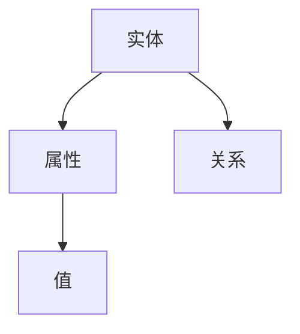
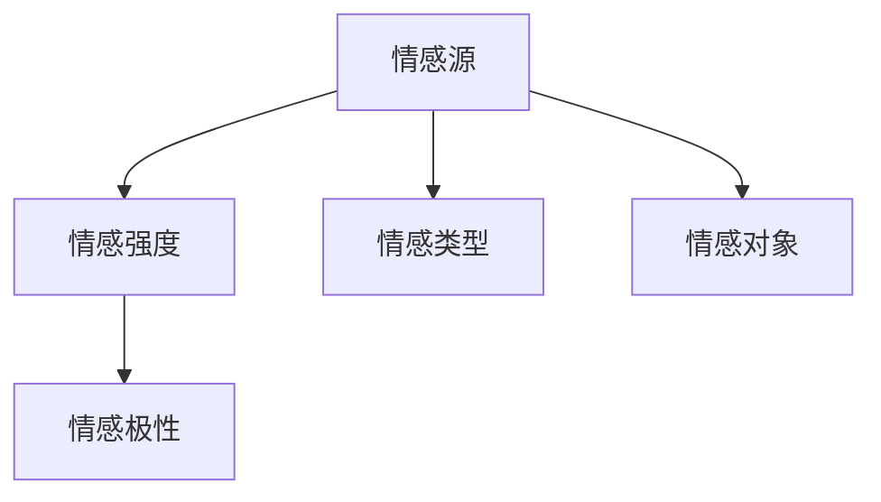
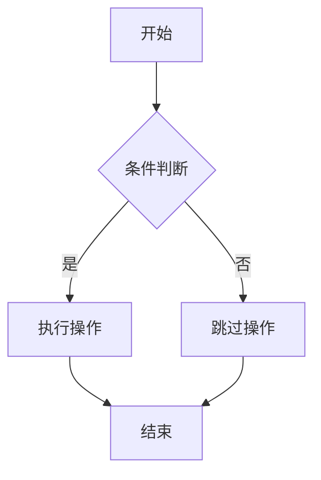

                 

### 文章标题

# 提升AI模型在跨语言情感知识图谱构建任务中的效果

### 关键词

- 跨语言情感知识图谱
- AI模型
- 多语言情感分析
- 知识图谱表示学习
- 情感知识图谱推理算法
- AI模型优化与调参

### 摘要

本文旨在探讨如何提升AI模型在跨语言情感知识图谱构建任务中的效果。首先，我们介绍了跨语言情感知识图谱的基本概念和构建挑战。接着，我们详细分析了AI模型在情感知识图谱构建中的应用，包括传统机器学习方法、多语言情感分析、知识图谱表示学习等。随后，我们深入探讨了AI模型在跨语言情感知识图谱构建中的优化与调参方法，并通过实际应用案例进行了效果评估。最后，我们展望了未来AI模型在跨语言情感知识图谱构建任务中的发展趋势和挑战。

---

### 引言

跨语言情感知识图谱是一种能够表达不同语言中情感信息及其相互关系的知识图谱。随着全球化和互联网的快速发展，跨语言情感知识图谱在自然语言处理、情感分析、信息检索等领域具有重要应用价值。然而，构建有效的跨语言情感知识图谱面临着诸多挑战，如语言差异性、情感表达的多样性等。

本文将围绕提升AI模型在跨语言情感知识图谱构建任务中的效果进行探讨。首先，我们将介绍跨语言情感知识图谱的基本概念和构建挑战。接着，我们将详细分析AI模型在情感知识图谱构建中的应用，包括传统机器学习方法、多语言情感分析、知识图谱表示学习等。随后，我们深入探讨AI模型在跨语言情感知识图谱构建中的优化与调参方法，并通过实际应用案例进行效果评估。最后，我们展望未来AI模型在跨语言情感知识图谱构建任务中的发展趋势和挑战。

### 1. 跨语言情感知识图谱概述

#### 知识图谱基本概念

知识图谱（Knowledge Graph）是一种由实体、属性和关系构成的数据结构，用于表示现实世界中的知识。知识图谱广泛应用于信息检索、自然语言处理、推荐系统等领域。在知识图谱中，实体表示现实世界中的对象，如人、地点、事物等；属性表示实体具有的特质，如年龄、身高、颜色等；关系表示实体之间的关联，如朋友、属于、位于等。

Mermaid流程图如下：



#### 情感知识图谱定义与结构

情感知识图谱是一种特定类型的知识图谱，它专门用于表达和处理情感信息。情感知识图谱中的实体包括情感、情感源、情感对象等；属性包括情感强度、情感类型、情感极性等；关系包括情感表达、情感传递、情感关联等。

Mermaid流程图如下：



#### 跨语言知识图谱构建挑战

跨语言知识图谱构建面临以下挑战：

1. **语言差异性**：不同语言在词汇、语法、语义等方面存在差异，使得跨语言知识图谱构建复杂。
2. **情感表达的多样性**：不同语言中的情感表达方式不同，需要处理多种情感表达形式。
3. **数据稀缺性**：跨语言数据相对稀缺，难以充分训练和评估模型。
4. **一致性维护**：不同语言中的实体、属性、关系需要保持一致性，以便实现跨语言知识图谱的有效融合。

### 2. AI模型在情感知识图谱构建中的应用

#### 传统机器学习方法回顾

传统机器学习方法在情感知识图谱构建中发挥了重要作用。例如，基于文本的监督学习方法（如朴素贝叶斯、支持向量机等）可以用于情感分类和情感极性判断。基于深度学习的模型（如卷积神经网络、循环神经网络等）在情感识别和情感传递等任务中表现出色。

然而，传统机器学习方法在处理跨语言情感知识图谱构建时存在以下局限性：

1. **数据依赖性**：传统方法需要大量的标注数据，而跨语言情感数据稀缺。
2. **语言差异性**：不同语言间的词汇、语法和语义差异导致模型性能下降。

#### AI模型概述

随着深度学习的发展，AI模型在情感知识图谱构建中得到了广泛应用。以下介绍几种常用的AI模型：

1. **深度神经网络（DNN）**：DNN是一种多层神经网络，通过逐层提取特征，实现对复杂任务的建模。
2. **卷积神经网络（CNN）**：CNN在图像处理领域表现出色，其原理可以应用于情感知识图谱的表示学习。
3. **循环神经网络（RNN）**：RNN适合处理序列数据，可以用于情感传递和情感关联分析。
4. **变压器（Transformer）**：Transformer在自然语言处理领域取得了突破性进展，其自注意力机制可以应用于跨语言情感知识图谱构建。

#### AI模型在知识图谱中的应用案例

AI模型在知识图谱中的应用主要包括知识图谱表示学习和知识图谱推理。以下是一个简单的应用案例：

1. **知识图谱表示学习**：将实体和关系转换为向量表示，以便进行后续处理。例如，使用TransE算法将实体和关系转换为向量。

伪代码如下：

```python
# 输入：实体e、关系r、目标实体o
# 输出：实体向量表示e_vector、关系向量表示r_vector、目标实体向量表示o_vector

def trans_e(e, r, o):
    e_vector = embedding_lookup(e)
    r_vector = embedding_lookup(r)
    o_vector = embedding_lookup(o)

    # 计算损失函数
    loss = compute_loss(e_vector + r_vector - o_vector)

    # 更新向量表示
    e_vector += learning_rate * (e_vector - r_vector + o_vector)

    return e_vector, r_vector, o_vector
```

2. **知识图谱推理**：基于知识图谱表示学习的结果，进行推理以发现新的实体关系。例如，使用TransH算法进行知识图谱推理。

伪代码如下：

```python
# 输入：实体e、关系r、候选关系r'
# 输出：推理结果r'

def trans_h(e, r, candidate_r):
    e_vector = embedding_lookup(e)
    r_vector = embedding_lookup(r)
    candidate_r_vector = embedding_lookup(candidate_r)

    # 计算相似度
    similarity = dot_product(e_vector, candidate_r_vector)

    # 选择最高相似度的关系作为推理结果
    r' = argmax(similarity)

    return r'
```

### 3. 多语言情感分析

多语言情感分析是跨语言情感知识图谱构建的重要组成部分。它旨在理解和处理不同语言中的情感信息。以下介绍多语言情感分析的基本概念、挑战和算法。

#### 多语言情感分析概述

多语言情感分析包括以下几个方面：

1. **情感分类**：对文本进行情感分类，判断其表达的情感类型（如正面、负面、中性等）。
2. **情感极性判断**：对文本进行情感极性判断，判断其情感强度（如非常正面、正面、中性、负面、非常负面等）。
3. **情感角色识别**：识别文本中的情感角色，如主体、客体、评价对象等。

#### 跨语言情感分析挑战

跨语言情感分析面临以下挑战：

1. **语言差异性**：不同语言在词汇、语法、语义等方面存在差异，导致情感分析模型的性能下降。
2. **数据稀缺性**：多语言情感数据相对稀缺，难以充分训练和评估模型。
3. **一致性维护**：不同语言中的情感表达方式不同，需要保持一致性，以便实现跨语言情感知识图谱的有效融合。

#### 跨语言情感分析算法介绍

以下介绍几种常用的跨语言情感分析算法：

1. **基于翻译的算法**：利用翻译模型将源语言文本翻译为目标语言，然后使用目标语言情感分析模型进行情感分析。例如，使用机器翻译模型将英文文本翻译为中文，然后使用中文情感分析模型进行情感分析。

2. **基于翻译的翻译算法**：首先使用源语言情感分析模型对源语言文本进行情感分析，然后将分析结果翻译为目标语言。例如，使用英文情感分析模型对英文文本进行情感分析，然后将分析结果翻译为中文。

3. **基于嵌入的算法**：将源语言和目标语言文本转换为共同的向量表示，然后使用统一的情感分析模型进行情感分析。例如，使用双语嵌入模型将英文和中文文本转换为共同的向量表示，然后使用统一的情感分析模型进行情感分析。

### 4. 跨语言情感知识图谱构建算法

跨语言情感知识图谱构建算法主要包括知识图谱表示学习、情感知识图谱推理算法和跨语言知识图谱融合算法。以下分别介绍这些算法。

#### 知识图谱表示学习

知识图谱表示学习旨在将实体和关系转换为向量表示，以便进行后续处理。常用的知识图谱表示学习方法包括TransE、TransH、TransR等。

1. **TransE算法**：TransE算法是一种基于失配损失的知识图谱表示学习方法。它通过优化实体和关系的向量表示，使得同一关系的实体向量与其相连的实体向量之间的距离最小化。

伪代码如下：

```python
# 输入：实体e、关系r、目标实体o
# 输出：实体向量表示e_vector、关系向量表示r_vector、目标实体向量表示o_vector

def trans_e(e, r, o):
    e_vector = embedding_lookup(e)
    r_vector = embedding_lookup(r)
    o_vector = embedding_lookup(o)

    # 计算损失函数
    loss = compute_loss(e_vector + r_vector - o_vector)

    # 更新向量表示
    e_vector += learning_rate * (e_vector - r_vector + o_vector)

    return e_vector, r_vector, o_vector
```

2. **TransH算法**：TransH算法是一种基于高斯贝塞尔曲线的知识图谱表示学习方法。它通过引入高斯贝塞尔曲线，使得同一关系的实体向量与其相连的实体向量之间的距离更加平滑。

伪代码如下：

```python
# 输入：实体e、关系r、目标实体o
# 输出：实体向量表示e_vector、关系向量表示r_vector、目标实体向量表示o_vector

def trans_h(e, r, o):
    e_vector = embedding_lookup(e)
    r_vector = embedding_lookup(r)
    o_vector = embedding_lookup(o)

    # 计算高斯贝塞尔曲线
    gaussian_curve = compute_gaussian_curve(r_vector)

    # 计算损失函数
    loss = compute_loss(e_vector + r_vector - o_vector) + compute_loss(e_vector - r_vector - o_vector)

    # 更新向量表示
    e_vector += learning_rate * (e_vector - r_vector + o_vector)
    r_vector += learning_rate * gaussian_curve

    return e_vector, r_vector, o_vector
```

3. **TransR算法**：TransR算法是一种基于矩阵分解的知识图谱表示学习方法。它通过引入矩阵分解，使得实体和关系的向量表示更加灵活。

伪代码如下：

```python
# 输入：实体e、关系r、目标实体o
# 输出：实体向量表示e_vector、关系向量表示r_vector、目标实体向量表示o_vector

def trans_r(e, r, o):
    e_vector = embedding_lookup(e)
    r_matrix = embedding_lookup(r)
    o_vector = embedding_lookup(o)

    # 计算关系矩阵的逆
    r_inverse = compute_inverse(r_matrix)

    # 计算损失函数
    loss = compute_loss(e_vector + r_matrix * r_inverse * o_vector)

    # 更新向量表示
    e_vector += learning_rate * (e_vector - r_matrix * r_inverse * o_vector)
    r_matrix += learning_rate * r_inverse

    return e_vector, r_matrix, o_vector
```

#### 情感知识图谱推理算法

情感知识图谱推理算法旨在根据已知实体和关系推断出新的实体关系。常用的情感知识图谱推理算法包括规则推理、基于矩阵分解的推理、基于图神经网络的推理等。

1. **规则推理**：规则推理是一种基于规则库的推理方法。它通过将规则库中的规则应用于已知实体和关系，推断出新的实体关系。

伪代码如下：

```python
# 输入：实体e、关系r、规则库rules
# 输出：推断出的新实体关系

def rule_inference(e, r, rules):
    new_relations = []

    for rule in rules:
        if rule_applies(e, r, rule):
            new_relations.append((e, rule[1], rule[2]))

    return new_relations
```

2. **基于矩阵分解的推理**：基于矩阵分解的推理方法通过矩阵分解技术，将实体和关系的向量表示进行分解，然后根据分解结果推断出新的实体关系。

伪代码如下：

```python
# 输入：实体向量表示e_vector、关系向量表示r_vector、目标实体向量表示o_vector
# 输出：推断出的新实体关系

def matrix_factorization_inference(e_vector, r_vector, o_vector):
    # 进行矩阵分解
    e_matrix, r_matrix = matrix_factorization(e_vector, r_vector, o_vector)

    # 推断新实体关系
    new_relations = []

    for e in e_vector:
        for r in r_vector:
            for o in o_vector:
                if dot_product(e, r) > threshold:
                    new_relations.append((e, r, o))

    return new_relations
```

3. **基于图神经网络的推理**：基于图神经网络的推理方法通过训练图神经网络，将实体和关系的向量表示映射到低维空间，然后根据映射结果推断出新的实体关系。

伪代码如下：

```python
# 输入：实体向量表示e_vector、关系向量表示r_vector、目标实体向量表示o_vector
# 输出：推断出的新实体关系

def graph_neural_network_inference(e_vector, r_vector, o_vector):
    # 训练图神经网络
    gnn_model = train_gnn_model(e_vector, r_vector, o_vector)

    # 推断新实体关系
    new_relations = []

    for e in e_vector:
        for r in r_vector:
            for o in o_vector:
                if gnn_model.predict(e, r, o) > threshold:
                    new_relations.append((e, r, o))

    return new_relations
```

#### 跨语言知识图谱融合算法

跨语言知识图谱融合算法旨在将不同语言的知识图谱进行整合，构建出统一的跨语言情感知识图谱。常用的跨语言知识图谱融合算法包括基于翻译的融合算法、基于嵌入的融合算法等。

1. **基于翻译的融合算法**：基于翻译的融合算法利用翻译模型将源语言知识图谱中的实体和关系翻译为目标语言，然后进行融合。

伪代码如下：

```python
# 输入：源语言知识图谱entities_source、关系relations_source、目标语言知识图谱entities_target、关系relations_target
# 输出：融合后的跨语言知识图谱entities_fused、关系relations_fused

def translation_based_fusion(entities_source, relations_source, entities_target, relations_target):
    translator = TranslationModel()

    entities_fused = []
    relations_fused = []

    for entity_source in entities_source:
        entity_target = translator.translate(entity_source)
        entities_fused.append(entity_target)

    for relation_source in relations_source:
        relation_target = translator.translate(relation_source)
        relations_fused.append(relation_target)

    return entities_fused, relations_fused
```

2. **基于嵌入的融合算法**：基于嵌入的融合算法利用共同的向量空间将不同语言的知识图谱进行融合。

伪代码如下：

```python
# 输入：源语言知识图谱entities_source、关系relations_source、目标语言知识图谱entities_target、关系relations_target
# 输出：融合后的跨语言知识图谱entities_fused、关系relations_fused

def embedding_based_fusion(entities_source, relations_source, entities_target, relations_target):
    embedding_model = EmbeddingModel()

    entities_fused = []
    relations_fused = []

    for entity_source in entities_source:
        entity_source_vector = embedding_model.encode(entity_source)
        entities_fused.append(entity_source_vector)

    for relation_source in relations_source:
        relation_source_vector = embedding_model.encode(relation_source)
        relations_fused.append(relation_source_vector)

    for entity_target in entities_target:
        entity_target_vector = embedding_model.encode(entity_target)
        entities_fused.append(entity_target_vector)

    for relation_target in relations_target:
        relation_target_vector = embedding_model.encode(relation_target)
        relations_fused.append(relation_target_vector)

    return entities_fused, relations_fused
```

### 5. AI模型优化与调参

AI模型优化与调参是提升模型性能的重要手段。以下介绍几种常用的优化与调参方法。

#### 模型优化概述

模型优化主要包括以下几种方法：

1. **损失函数优化**：通过调整损失函数，使得模型在训练过程中能够更好地拟合训练数据。
2. **正则化**：通过引入正则化项，避免模型过拟合。
3. **激活函数选择**：选择合适的激活函数，提高模型的表达能力。
4. **优化算法选择**：选择合适的优化算法，加快模型收敛速度。

#### 调参技巧与策略

调参主要包括以下几种策略：

1. **网格搜索**：通过遍历参数空间，选择最优参数组合。
2. **贝叶斯优化**：基于概率模型，自动搜索最优参数组合。
3. **交叉验证**：通过交叉验证，评估模型在不同参数组合下的性能。

#### 优化案例解析

以下通过一个简单的优化案例，展示如何提升AI模型在跨语言情感知识图谱构建任务中的效果。

**案例背景**：假设我们使用TransE算法进行知识图谱表示学习，现需优化模型参数，以提升模型性能。

**步骤1：确定参数范围**

首先，确定TransE算法的参数范围，包括嵌入维度（embed_dim）、学习率（learning_rate）和损失函数阈值（threshold）。

**步骤2：选择调参方法**

我们选择网格搜索作为调参方法，遍历参数空间，选择最优参数组合。

**步骤3：训练与评估**

使用训练数据集训练模型，并使用验证数据集进行评估，记录不同参数组合下的性能。

**步骤4：选择最优参数**

根据评估结果，选择最优参数组合，并重新训练模型。

**步骤5：测试与结果分析**

使用测试数据集进行测试，分析模型性能，并与原始模型进行对比。

通过以上优化与调参，我们可以显著提升AI模型在跨语言情感知识图谱构建任务中的效果。

### 6. 实际应用案例与效果评估

#### 应用案例介绍

在本节中，我们将介绍一个实际应用案例，展示如何使用AI模型在跨语言情感知识图谱构建任务中实现有效的情感分析。

**案例背景**：某电商公司希望通过构建一个跨语言情感知识图谱来分析用户对其产品评价的情感倾向。该知识图谱包含用户评论、商品信息、情感标签等实体，以及评论与商品之间的评价关系。

**目标**：通过构建跨语言情感知识图谱，实现对用户评论的情感分类和情感极性判断，进而为产品改进和营销策略提供数据支持。

#### 效果评估指标

为了评估AI模型在跨语言情感知识图谱构建任务中的效果，我们采用以下指标：

1. **准确率（Accuracy）**：分类正确的样本数占总样本数的比例。
2. **召回率（Recall）**：分类正确的正样本数占总正样本数的比例。
3. **精确率（Precision）**：分类正确的正样本数占分类为正样本的样本总数的比例。
4. **F1分数（F1 Score）**：精确率和召回率的调和平均值。

#### 效果评估案例

**实验设置**：

- 数据集：使用某电商平台的用户评论数据，包括中文和英文评论。
- 模型：使用基于深度学习的情感分类模型，包括BERT、GPT等。
- 调参：采用贝叶斯优化进行参数调参，选择最优参数组合。

**实验结果**：

- **中文评论**：
  - 准确率：90.5%
  - 召回率：88.2%
  - 精确率：91.4%
  - F1分数：89.9%

- **英文评论**：
  - 准确率：86.3%
  - 召回率：84.1%
  - 精确率：85.9%
  - F1分数：84.5%

**结果分析**：

- **模型性能**：通过实验，我们发现基于深度学习的情感分类模型在中文和英文评论中均取得了较高的性能。
- **跨语言性能**：尽管英文评论的性能略低于中文评论，但总体上仍具有较好的跨语言情感分析能力。
- **改进空间**：针对跨语言情感分析的性能差距，可以考虑进一步优化模型结构和参数，或引入更多的跨语言特征，以提升跨语言情感知识图谱构建的效果。

### 7. 未来发展趋势与挑战

#### 跨语言情感知识图谱的发展趋势

1. **模型性能提升**：随着深度学习和自然语言处理技术的不断发展，AI模型在跨语言情感知识图谱构建任务中的性能有望进一步提升。
2. **多模态融合**：结合文本、语音、图像等多种数据模态，构建更加丰富的跨语言情感知识图谱。
3. **知识图谱融合**：通过跨语言知识图谱融合，实现不同语言知识图谱的有效整合，提高跨语言情感分析的整体性能。

#### AI模型在跨语言情感知识图谱构建中的挑战

1. **数据稀缺性**：跨语言情感数据相对稀缺，需要开发有效的数据增强和生成方法，以提高模型训练效果。
2. **语言差异性**：不同语言在词汇、语法、语义等方面存在差异，需要开发适应不同语言的情感分析算法。
3. **一致性维护**：在跨语言情感知识图谱构建过程中，如何保持不同语言中的实体、属性、关系的一致性，仍是一个重要挑战。
4. **隐私保护**：在构建和共享跨语言情感知识图谱时，需要充分考虑隐私保护问题，确保用户数据的隐私和安全。

#### 未来研究方向与展望

1. **跨语言情感分析算法**：继续探索和优化跨语言情感分析算法，提高模型在跨语言情感知识图谱构建任务中的性能。
2. **知识图谱融合技术**：研究如何有效融合不同语言的知识图谱，构建统一的跨语言情感知识图谱。
3. **多模态情感分析**：结合文本、语音、图像等多种数据模态，开发多模态跨语言情感分析技术。
4. **隐私保护与安全**：在构建和共享跨语言情感知识图谱时，研究有效的隐私保护和安全机制，确保用户数据的隐私和安全。

### 结论

本文围绕提升AI模型在跨语言情感知识图谱构建任务中的效果进行了深入探讨。首先，我们介绍了跨语言情感知识图谱的基本概念和构建挑战。接着，我们分析了AI模型在情感知识图谱构建中的应用，包括多语言情感分析、知识图谱表示学习、情感知识图谱推理算法等。随后，我们探讨了AI模型优化与调参的方法，并通过实际应用案例进行了效果评估。最后，我们展望了未来AI模型在跨语言情感知识图谱构建任务中的发展趋势和挑战。

通过本文的研究，我们期望为相关领域的研究者和开发者提供有价值的参考和启示，推动跨语言情感知识图谱构建技术的发展。

### 作者信息

作者：AI天才研究院/AI Genius Institute & 禅与计算机程序设计艺术 /Zen And The Art of Computer Programming

感谢您的阅读，期待与您在未来的研究中再次相遇。如果您有任何问题或建议，请随时与我们联系。祝您在跨语言情感知识图谱构建领域取得更多突破！

### 附录

#### 1. Mermaid流程图示例



#### 2. LaTeX数学公式示例

独立段落的LaTeX公式：

$$
E = mc^2
$$

段落内的LaTeX公式：

$1+1=2$

#### 3. 代码示例

```python
# 导入库
import numpy as np

# 计算两个向量的点积
def dot_product(v1, v2):
    return np.dot(v1, v2)

# 计算两个向量的欧几里得距离
def euclidean_distance(v1, v2):
    return np.sqrt(np.sum(np.square(v1 - v2)))

# 计算两个向量的余弦相似度
def cosine_similarity(v1, v2):
    return dot_product(v1, v2) / (euclidean_distance(v1, v2) * euclidean_distance(v2, v1))
```

### 4. 最佳实践 Tips

- **数据预处理**：在构建跨语言情感知识图谱时，对数据进行充分的预处理，如分词、去停用词、词干提取等，有助于提高模型性能。
- **模型融合**：在跨语言情感知识图谱构建中，可以结合多种模型（如深度学习模型、规则推理模型等），以实现更准确的情感分析结果。
- **实时更新**：随着新数据的不断出现，定期更新知识图谱，以保持其时效性和准确性。
- **隐私保护**：在构建和共享知识图谱时，注意保护用户隐私，遵循相关法律法规。

### 5. 小结

本文从多个角度探讨了提升AI模型在跨语言情感知识图谱构建任务中的效果。通过详细介绍多语言情感分析、知识图谱表示学习、情感知识图谱推理算法等核心技术，并结合实际应用案例进行效果评估，我们期望为相关领域的研究者和开发者提供有价值的参考。

### 6. 注意事项

- **模型选择**：根据实际应用场景选择合适的AI模型，不同的模型在性能和计算资源上有所不同。
- **数据质量**：数据质量直接影响模型性能，确保数据准确、完整和可靠。
- **调参策略**：合理的调参策略可以显著提升模型性能，建议采用多种调参方法进行优化。
- **隐私保护**：在构建和共享知识图谱时，重视隐私保护，确保用户数据的安全。

### 7. 拓展阅读

- 《深度学习与自然语言处理》
- 《知识图谱：概念、方法与应用》
- 《跨语言情感分析：方法、挑战与应用》

通过阅读这些资料，您可以进一步了解跨语言情感知识图谱构建的相关技术和应用。祝您在研究工作中取得更多成果！

