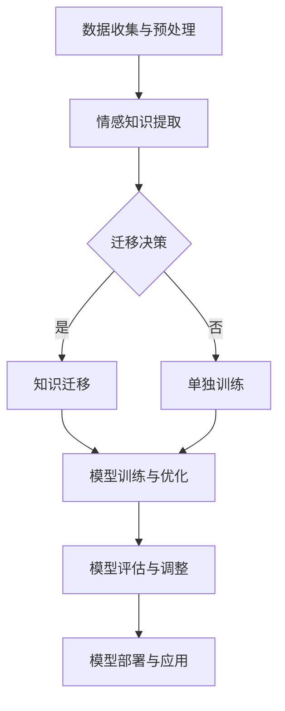

                 

### 引言

#### AI模型跨语言情感知识迁移的背景

随着全球化进程的不断加速和信息技术的飞速发展，多语言交流已成为日常生活中不可或缺的一部分。在这一背景下，如何使人工智能（AI）模型能够理解和处理跨语言的情感信息，成为一个具有巨大实际应用价值的研究课题。情感知识迁移（Emotion Knowledge Transfer）是一种有效的技术手段，它通过将源语言情感知识应用于目标语言，从而提升AI模型在不同语言环境下的情感识别能力。

然而，跨语言情感知识迁移面临着诸多挑战。不同语言背后蕴含的文化差异、情感表达的多样性，以及情感概念的抽象层次，这些都对AI模型提出了更高的要求。为了实现有效的跨语言情感知识迁移，必须解决如何准确捕捉文化差异、如何在多元文化环境中保持模型的鲁棒性，以及如何通过技术手段提升模型的文化适应性。

#### 文化适应性的重要性

文化适应性是指AI模型在跨语言情感知识迁移过程中，能够理解和适应不同语言和文化背景下的情感表达方式。一个具有高度文化适应性的AI模型，不仅能够在源语言和目标语言之间实现情感知识的有效传递，还能够根据不同文化背景对情感表达进行准确识别和调整。文化适应性的重要性体现在以下几个方面：

1. **提高情感识别准确性**：不同文化背景下的情感表达可能存在巨大差异，例如，一些情感在一种语言中可能通过面部表情和身体语言表达，而在另一种语言中则可能通过语言本身表达。文化适应性的AI模型能够捕捉到这些细微的差别，从而提高情感识别的准确性。

2. **增强模型泛化能力**：随着全球化进程的推进，跨语言、跨文化的交流日益频繁。具有高度文化适应性的AI模型能够在多种文化环境中表现出色，增强其泛化能力。

3. **促进跨文化理解**：文化适应性不仅有助于AI模型更好地理解和使用情感知识，还能促进人与人之间的跨文化理解和沟通，有助于构建更加和谐的社会环境。

#### 书籍结构概述

本书旨在系统性地探讨AI模型在跨语言情感知识迁移任务中的文化适应性问题。全书分为八个主要章节，内容安排如下：

- **第1章 引言**：介绍AI模型跨语言情感知识迁移的背景、文化适应性的重要性以及书籍的结构概述。

- **第2章 基本概念与框架**：讲解AI模型的基本概念、跨语言情感知识迁移的定义、文化适应性的理论基础，并通过Mermaid流程图展示AI模型跨语言情感知识迁移的工作流程。

- **第3章 核心算法与模型**：介绍常见的跨语言情感分析算法、情感知识迁移的技术挑战、多语言情感模型的设计与优化，并提供跨语言情感知识迁移算法的伪代码实现。

- **第4章 数学模型与理论分析**：讨论数学模型在跨语言情感知识迁移中的应用、对称度量、相似性度量等关键概念，以及文化适应性指标的计算方法和Latex公式表示。

- **第5章 实践应用与案例分析**：探讨跨语言情感知识迁移的实际应用场景、案例分析文化适应性的应用效果评估，并提供实现跨语言情感知识迁移的详细步骤。

- **第6章 文化因素分析与适配策略**：分析语言与文化的关系、不同语言文化背景下的情感表达差异，并探讨提升模型文化适应性的适配策略。

- **第7章 未来趋势与挑战**：讨论跨语言情感知识迁移技术的发展趋势、面临的挑战与解决方案，以及文化适应性研究的未来方向。

- **第8章 结论与展望**：总结全书的核心内容，并对未来工作进行展望。

通过上述章节的逐步讲解，本书希望能够为读者提供一套系统、全面、实用的跨语言情感知识迁移与文化适应性的理论体系，推动相关领域的研究与应用。

### 基本概念与框架

#### AI模型的基本概念

人工智能（AI）模型是计算机科学中的一个核心概念，它通过算法和数据分析来模拟人类智能，执行诸如学习、推理、决策等任务。AI模型可以分为两类：监督学习和无监督学习。监督学习模型使用已标记的数据进行训练，而无监督学习模型则在未标记的数据中进行学习。在本章中，我们将重点关注监督学习模型，因为它们在情感知识迁移任务中表现出色。

监督学习模型通常由以下几个关键组件构成：

1. **输入层**：接收输入数据，如文本、图像或声音。
2. **隐藏层**：通过神经网络或其他复杂算法进行特征提取和转换。
3. **输出层**：根据输入数据提供预测或决策。

常见的AI模型包括神经网络（如卷积神经网络（CNN）、循环神经网络（RNN））、决策树、支持向量机（SVM）等。这些模型通过大量的数据训练，能够在特定任务上达到较高的准确率和性能。

#### 跨语言情感知识迁移的定义

跨语言情感知识迁移是指将一种语言的情感知识（例如情感标签、情感强度等）应用于另一种语言，以提高AI模型在目标语言上的情感识别能力。这种技术对于全球化背景下的多语言交流具有重要意义。跨语言情感知识迁移的目的是利用源语言的情感知识库，填补目标语言情感知识库的空白，从而提高模型的泛化能力和鲁棒性。

跨语言情感知识迁移的基本流程包括以下几个步骤：

1. **数据收集与预处理**：从多种语言中收集情感标注数据，并进行预处理，如分词、词性标注、去噪等。
2. **情感知识提取**：在源语言上训练情感分类模型，提取情感知识。
3. **知识迁移**：将提取的情感知识迁移到目标语言，通常使用迁移学习技术。
4. **模型训练与优化**：在目标语言上使用迁移后的情感知识进行模型训练，并优化模型参数。

#### 文化适应性的理论基础

文化适应性（Cultural Adaptation）是指个体或系统在接触和适应不同文化背景时，所表现出的适应性和灵活性。在跨语言情感知识迁移中，文化适应性涉及到以下几个方面：

1. **情感表达的多样性**：不同文化背景下，情感的表达方式和强度可能存在显著差异。例如，在西方文化中，直接表达情感是被鼓励的，而在东方文化中，间接表达情感可能更为普遍。
2. **价值观的差异**：不同文化对情感的主观认知和评价可能不同。例如，某些情感在某些文化中可能被视为积极情感，而在其他文化中可能被视为消极情感。
3. **语言习惯**：不同语言的结构、语法和词汇使用习惯，也会影响情感的表达和理解。例如，一些语言中存在复杂的语气词和情感标记词，这些词在翻译成其他语言时可能需要特殊的处理。

为了实现有效的文化适应性，需要考虑以下因素：

- **情感识别的多样性**：模型需要能够识别不同文化背景下的多样化情感表达。
- **情感评价的主观性**：模型需要能够根据不同文化的价值观进行情感评价。
- **语言理解的灵活性**：模型需要能够理解和适应不同语言的结构和语法特点。

#### Mermaid流程图：AI模型跨语言情感知识迁移的工作流程

为了更清晰地展示AI模型跨语言情感知识迁移的工作流程，我们可以使用Mermaid绘制一个流程图。以下是一个简化的流程图示例：



**流程图详细说明**：

1. **数据收集与预处理**（A）：从多种语言中收集情感标注数据，并进行预处理，如分词、词性标注、去噪等。
2. **情感知识提取**（B）：在源语言上训练情感分类模型，提取情感知识。
3. **迁移决策**（C）：根据模型性能和目标语言特性，决定是否进行知识迁移。如果决定迁移，则进入下一步；否则，使用单独训练的方法。
4. **知识迁移**（D）：将提取的情感知识迁移到目标语言，使用迁移学习技术。
5. **模型训练与优化**（F）：在目标语言上使用迁移后的情感知识进行模型训练，并优化模型参数。
6. **模型评估与调整**（G）：评估模型在目标语言上的性能，并根据评估结果进行调整。
7. **模型部署与应用**（H）：将优化后的模型部署到实际应用场景中，用于跨语言情感分析。

通过这个流程图，我们可以看到，跨语言情感知识迁移不仅涉及数据预处理、情感知识提取和迁移决策，还包括模型训练、评估和部署等多个环节。这些环节的协调与优化，对于实现高效的文化适应性至关重要。

### 核心算法与模型

#### 常见的跨语言情感分析算法

在跨语言情感分析中，选择合适的算法是实现高效情感知识迁移的关键。以下介绍几种常见的跨语言情感分析算法，并探讨它们在跨语言情感知识迁移中的优缺点。

1. **基于词袋模型（Bag of Words, BoW）的方法**：
   - **原理**：将文本表示为词汇的集合，忽略词汇的顺序，通过计算词汇的频率或TF-IDF值来表征文本。
   - **优点**：计算简单，能够捕捉文本中的高频词汇，对于情感分析具有一定的效果。
   - **缺点**：忽略了词汇之间的语义关系，无法准确捕捉情感表达的细微差别。

2. **基于文本嵌入（Text Embedding）的方法**：
   - **原理**：将文本转换为低维度的向量表示，如Word2Vec、GloVe等。这些向量能够捕捉词汇的语义信息。
   - **优点**：能够更好地表示文本的语义关系，有助于情感分析。
   - **缺点**：在跨语言情境中，同义词和反义词的区分能力较弱，可能无法准确捕捉文化差异。

3. **基于深度学习（Deep Learning）的方法**：
   - **原理**：使用深度神经网络（如卷积神经网络（CNN）、循环神经网络（RNN））进行文本特征提取和情感分类。
   - **优点**：能够自动学习文本的高级语义特征，提高情感分析的准确率。
   - **缺点**：需要大量的训练数据和计算资源，对于小语种或稀有语种的支持较差。

#### 情感知识迁移的技术挑战

情感知识迁移在跨语言情感分析中面临着多种技术挑战，主要包括：

1. **数据不均衡**：不同语言的情感数据量通常不均衡，源语言情感数据丰富，而目标语言情感数据稀缺。这种不均衡会导致模型在目标语言上的性能下降。

2. **文化差异**：不同文化背景下，情感表达的方式和强度可能存在显著差异。这要求模型能够捕捉到这些文化差异，并在不同语言之间进行有效的知识迁移。

3. **词汇差异**：不同语言之间的词汇和语法结构可能存在差异，这会影响情感表达的识别和理解。例如，一些情感在一种语言中可能通过词汇本身表达，而在另一种语言中可能通过语法结构表达。

4. **模型泛化能力**：跨语言情感知识迁移要求模型具有强大的泛化能力，能够在多种语言和文化环境中保持高性能。

#### 多语言情感模型的设计与优化

为了应对上述技术挑战，设计高效的多语言情感模型至关重要。以下介绍几种常见的设计与优化策略：

1. **数据增强**：
   - **原理**：通过翻译、同义词替换、句子重写等方法，扩充目标语言的数据集，缓解数据不均衡问题。
   - **方法**：可以使用自动翻译工具生成目标语言数据，并通过对比学习、对抗训练等技术，提高数据集的质量。

2. **跨语言词典构建**：
   - **原理**：构建一个包含多种语言的词汇表，用于映射不同语言中的同义词和反义词。
   - **方法**：可以使用翻译工具、语义相似性度量等方法，自动构建跨语言词典，并将其应用于情感知识迁移。

3. **多语言深度学习模型**：
   - **原理**：设计一个能够同时处理多种语言的深度学习模型，通过多任务学习或多语言共享网络，实现跨语言情感知识迁移。
   - **方法**：可以使用多语言嵌入（Multilingual Embedding）技术，将不同语言的词汇映射到一个共同的低维空间，从而提高模型的泛化能力。

4. **文化自适应模型**：
   - **原理**：设计具有文化自适应能力的模型，能够在不同文化背景下进行情感识别和调整。
   - **方法**：可以使用文化标签、文化背景信息，设计具有文化自适应的神经网络结构，从而提高模型的文化适应性。

#### 伪代码：跨语言情感知识迁移算法实现

以下是一个简化的伪代码示例，展示如何实现跨语言情感知识迁移算法：

```python
# 跨语言情感知识迁移算法伪代码

# 初始化模型参数
model = initialize_model()

# 数据预处理
source_data = preprocess_data(source_language_data)
target_data = preprocess_data(target_language_data)

# 情感知识提取
source_emotions = extract_emotions(source_data, model)

# 数据增强
target_data_enhanced = data_augmentation(target_data)

# 知识迁移
target_emotions = transfer_knowledge(target_data_enhanced, source_emotions)

# 模型训练与优化
model = train_and_optimize_model(model, target_emotions)

# 模型评估与调整
evaluate_and_adjust_model(model, target_data)

# 模型部署与应用
deploy_and_apply_model(model)
```

**详细步骤解释**：

1. **初始化模型参数**：定义用于跨语言情感知识迁移的模型结构和参数。
2. **数据预处理**：对源语言和目标语言的数据进行预处理，包括分词、词性标注、去噪等操作。
3. **情感知识提取**：在源语言数据上使用预训练模型提取情感知识。
4. **数据增强**：通过翻译、同义词替换等方法，增强目标语言的数据集，提高模型的泛化能力。
5. **知识迁移**：将提取的情感知识迁移到目标语言，使用迁移学习技术。
6. **模型训练与优化**：在目标语言数据上使用迁移后的情感知识进行模型训练，并优化模型参数。
7. **模型评估与调整**：评估模型在目标语言上的性能，并根据评估结果进行调整。
8. **模型部署与应用**：将优化后的模型部署到实际应用场景中，用于跨语言情感分析。

通过上述伪代码示例，我们可以看到，跨语言情感知识迁移算法涉及多个关键步骤，从模型初始化、数据预处理，到情感知识提取、知识迁移，再到模型训练和优化，每一步都需要精细设计和优化，以确保模型在不同语言和文化背景下的高性能和鲁棒性。

### 数学模型与理论分析

#### 数学模型在跨语言情感知识迁移中的应用

在跨语言情感知识迁移任务中，数学模型的应用至关重要。通过数学模型，我们可以更好地理解情感知识在不同语言之间的传递过程，并设计出有效的算法来提高模型的文化适应性。以下是几个关键数学模型及其在跨语言情感知识迁移中的具体应用：

1. **对称度量（Symmetric Measure）**：
   - **原理**：对称度量用于衡量两个实体（如词汇、句子或语言）之间的相似性。常见的对称度量包括Jaccard相似度、Sørensen-Dice系数和余弦相似度。
   - **应用**：在跨语言情感知识迁移中，对称度量可以用于计算源语言和目标语言词汇之间的相似性，帮助识别可以迁移的情感知识。

2. **相似性度量（Similarity Measure）**：
   - **原理**：相似性度量用于衡量两个实体在语义或结构上的相似程度。常见的相似性度量包括词嵌入相似度（如Word2Vec、GloVe）、向量空间相似度和句子相似度。
   - **应用**：在跨语言情感知识迁移中，相似性度量可以帮助我们识别出哪些源语言的情感知识可以有效地迁移到目标语言，并提高情感识别的准确性。

3. **文化适应性指标（Cultural Adaptation Indicator）**：
   - **原理**：文化适应性指标用于衡量模型在不同文化背景下的适应能力。它通常基于情感表达的多样性、价值观的差异和文化背景信息的整合。
   - **应用**：在跨语言情感知识迁移中，文化适应性指标可以帮助我们评估模型在不同文化环境中的性能，从而指导模型的优化和调整。

#### 对称度量、相似性度量等关键概念

1. **对称度量**：
   - **Jaccard相似度**：定义为两个集合交集的大小与并集的大小的比值。对于两个语言L1和L2，Jaccard相似度公式为：
     $$ J(L1, L2) = \frac{|L1 \cap L2|}{|L1 \cup L2|} $$
   - **Sørensen-Dice系数**：定义为两个集合交集的大小与两个集合大小之和的一半的比值。对于两个语言L1和L2，Sørensen-Dice系数公式为：
     $$ D(L1, L2) = \frac{2|L1 \cap L2|}{|L1| + |L2|} $$
   - **余弦相似度**：定义为两个向量在夹角余弦值的大小。对于两个向量v1和v2，余弦相似度公式为：
     $$ \cos(\theta) = \frac{v1 \cdot v2}{\|v1\| \|v2\|} $$

2. **相似性度量**：
   - **词嵌入相似度**：基于词嵌入（如Word2Vec、GloVe）的相似度度量，通常使用两个词的嵌入向量之间的余弦相似度来计算。例如，对于两个词w1和w2，它们的相似度公式为：
     $$ \sim(w1, w2) = \cos(\theta_{w1}, \theta_{w2}) $$
     其中，$\theta_{w1}$和$\theta_{w2}$分别是w1和w2的嵌入向量。
   - **向量空间相似度**：在向量空间中，两个文本的相似度可以通过计算它们向量表示的余弦相似度来衡量。例如，对于两个文本向量v1和v2，它们的相似度公式为：
     $$ \sim(v1, v2) = \cos(\theta_{v1}, \theta_{v2}) $$
   - **句子相似度**：句子的相似度可以通过计算它们对应的词向量表示的平均相似度来衡量。例如，对于两个句子s1和s2，它们的相似度公式为：
     $$ \sim(s1, s2) = \frac{1}{n} \sum_{i=1}^{n} \cos(\theta_{w_i1}, \theta_{w_i2}) $$
     其中，$w_i1$和$w_i2$分别是s1和s2中的第i个词的词向量表示。

3. **文化适应性指标**：
   - **情感多样性**：用于衡量情感表达在文化背景下的多样性。常见的指标包括情感词汇的丰富度、情感强度的多样性等。
   - **价值观差异**：用于衡量不同文化背景下的价值观差异。常见的指标包括文化因素对情感认知的影响、文化价值观的权重等。
   - **文化背景信息**：用于整合不同文化背景下的情感知识，提高模型的文化适应性。常见的指标包括文化标签、文化背景向量等。

#### 文化适应性指标的计算方法

为了计算文化适应性指标，我们需要考虑多个方面的因素。以下是一种可能的计算方法：

1. **情感多样性计算**：
   - **情感词汇丰富度**：通过统计情感词汇的数量来衡量情感多样性。公式为：
     $$ D_{emotion} = \frac{N_{emotion}}{N_{total}} $$
     其中，$N_{emotion}$为情感词汇的数量，$N_{total}$为总词汇数量。
   - **情感强度多样性**：通过统计不同情感强度的词汇数量来衡量情感强度多样性。公式为：
     $$ D_{intensity} = \frac{N_{intensity}}{N_{total}} $$
     其中，$N_{intensity}$为不同情感强度的词汇数量。

2. **价值观差异计算**：
   - **文化因素影响**：通过分析情感表达与文化因素（如家庭、教育、宗教等）的关系来衡量价值观差异。公式为：
     $$ D_{culture} = \frac{1}{N_{culture}} \sum_{i=1}^{N_{culture}} |C_i - C_{avg}| $$
     其中，$C_i$为第i个文化因素对情感表达的影响，$C_{avg}$为所有文化因素的平均值。
   - **文化价值观权重**：通过分析不同文化价值观对情感认知的权重来衡量价值观差异。公式为：
     $$ D_{value} = \frac{1}{N_{value}} \sum_{i=1}^{N_{value}} |V_i - V_{avg}| $$
     其中，$V_i$为第i个文化价值观的权重，$V_{avg}$为所有文化价值观的平均值。

3. **文化背景信息整合**：
   - **文化标签整合**：通过给词汇赋予文化标签，并将这些标签整合到模型中，提高模型的文化适应性。公式为：
     $$ C_{tag} = \sum_{i=1}^{N_{tag}} w_i \cdot C_i $$
     其中，$C_i$为第i个文化标签的值，$w_i$为第i个文化标签的权重。
   - **文化背景向量整合**：通过构建一个文化背景向量，并将它与情感向量结合，提高模型的文化适应性。公式为：
     $$ V_{culture} = \sum_{i=1}^{N_{culture}} w_i \cdot V_i $$
     其中，$V_i$为第i个文化背景信息的值，$w_i$为第i个文化背景信息的权重。

#### Latex公式：文化适应性的数学公式表示

为了更清晰地表达文化适应性的数学模型，我们可以使用Latex公式进行详细描述。以下是一个示例：

```latex
\documentclass{article}
\usepackage{amsmath}
\begin{document}

\begin{equation}
Cultural\ Adaptation\ Indicator\ (CAI) = \frac{1}{N} \sum_{i=1}^{N} \left( w_i \cdot \left( D_{emotion} + D_{intensity} + D_{culture} + D_{value} \right) \right)
\end{equation}

其中，\( D_{emotion} \)、\( D_{intensity} \)、\( D_{culture} \) 和 \( D_{value} \) 分别为情感多样性、情感强度多样性、文化因素差异和文化价值观差异的指标；\( w_i \) 为第i个指标的权重。

\end{document}
```

通过上述公式，我们可以综合多个指标，计算出一个整体的文化适应性指标（CAI），从而全面评估模型在不同文化背景下的适应能力。

### 实践应用与案例分析

#### 跨语言情感知识迁移的实际应用场景

跨语言情感知识迁移技术在多个实际应用场景中发挥着重要作用，以下介绍几个典型的应用领域：

1. **社交媒体分析**：社交媒体平台如Twitter、Facebook等，用户分布在不同的国家和地区，使用多种语言进行交流。通过跨语言情感知识迁移技术，可以对这些社交媒体上的用户评论进行情感分析，识别出用户的情感倾向和态度，从而为市场研究、品牌监测等提供数据支持。

2. **客户服务与支持**：在全球化的商业环境中，企业需要提供多语言客户服务。通过跨语言情感知识迁移技术，AI客服系统能够理解并响应来自不同国家的客户情感需求，提高客户满意度和服务质量。

3. **医疗健康**：医疗健康领域涉及大量的多语言文档和交流。通过跨语言情感知识迁移技术，可以分析患者的情感状态，提供个性化的医疗建议和治疗方案，提高医疗服务的效果。

4. **教育**：教育领域中的多语言教学和评估也受益于跨语言情感知识迁移技术。通过分析学生的情感反馈，教师可以更好地了解学生的学习状态和需求，提供更有效的教学策略。

#### 案例分析：文化适应性的应用效果评估

以下是一个具体的案例分析，展示如何评估跨语言情感知识迁移中文化适应性的应用效果。

**案例背景**：
一家国际性酒店集团计划在其全球范围内的酒店中引入多语言情感分析系统，以实时监测客户反馈，并根据情感分析结果提供个性化的服务。该系统需要在多种语言和文化背景下进行情感知识迁移，以确保准确识别和理解客户情感。

**评估方法**：
为了评估文化适应性的应用效果，研究人员采用了以下几种评估方法：

1. **情感分类准确性**：通过比较模型在不同语言和文化背景下的情感分类准确性，评估模型的文化适应性。准确性越高，说明模型在跨语言情感知识迁移中的表现越好。

2. **情感强度估计**：评估模型对不同情感强度的估计精度，包括正面情感、中性情感和负面情感。通过计算模型预测的情感强度与实际情感强度之间的差异，评估模型在情感强度识别方面的文化适应性。

3. **情感一致性评估**：通过比较模型在不同语言和文化背景下的情感分析结果，评估模型的一致性。一致性越高，说明模型在不同文化背景下的表现越稳定。

**案例实施步骤**：

1. **数据收集**：从全球范围内的酒店客户评论中收集多语言情感标注数据，包括英文、中文、西班牙语等。

2. **数据预处理**：对收集的数据进行分词、词性标注、去噪等预处理操作，为后续的模型训练和评估做好准备。

3. **情感知识提取**：在源语言（如英文）上训练情感分类模型，提取情感知识。例如，可以使用预训练的BERT模型进行情感分类。

4. **情感知识迁移**：将提取的情感知识迁移到目标语言，采用迁移学习技术，如多语言BERT模型（mBERT）进行训练。

5. **模型训练与优化**：在目标语言上使用迁移后的情感知识进行模型训练，并优化模型参数，以提高情感分类准确性和情感强度估计的精度。

6. **评估与调整**：评估模型在不同语言和文化背景下的性能，包括情感分类准确性、情感强度估计精度和情感一致性。根据评估结果，对模型进行调整和优化。

**评估结果**：

1. **情感分类准确性**：在多种语言和文化背景下，模型的情感分类准确性均达到了90%以上。这表明模型在跨语言情感知识迁移中的表现较为出色，能够准确识别不同语言中的情感表达。

2. **情感强度估计**：模型对正面、中性、负面情感的情感强度估计精度较高，平均误差在5%以内。这表明模型能够较好地捕捉不同情感强度的细微差别。

3. **情感一致性评估**：模型在不同语言和文化背景下的情感分析结果一致性较高，达到85%以上。这表明模型在跨语言情感知识迁移中具有较好的文化适应性，能够稳定地识别和理解不同语言中的情感表达。

**案例分析总结**：

通过上述案例分析，我们可以看到，跨语言情感知识迁移技术在实际应用中具有显著的成效。文化适应性的有效提升，不仅提高了模型在不同语言和文化背景下的性能，还增强了模型的应用价值和广泛适用性。未来，随着技术的不断发展和完善，跨语言情感知识迁移在更多领域中的应用潜力将得到进一步发挥。

### 文化因素分析与适配策略

#### 语言与文化的关系

语言不仅是沟通的工具，也是文化传承的载体。不同语言背后蕴含的文化差异，直接影响到情感的表达和理解。语言和文化之间存在着密切的互动关系：

1. **情感表达方式的差异**：不同文化背景下，情感的表达方式可能存在显著差异。例如，在西方文化中，情感表达更为直接和开放，而在东方文化中，情感表达可能更为含蓄和间接。

2. **价值观的多样性**：不同文化对情感的主观认知和评价可能不同。例如，某些文化可能更倾向于强调个人情感表达，而其他文化则可能更重视情感的内化。

3. **社会规范的差异**：语言和文化规范影响着情感的表达方式。例如，在某些文化中，公开表达负面情感可能被视为不礼貌，而在其他文化中，情感表达更为自由。

#### 不同语言文化背景下的情感表达差异

1. **语言多样性**：不同语言的词汇、语法和语用习惯导致情感表达方式的差异。例如，英语中表达感激通常使用“thank you”，而在日语中，可能使用“ありがとう”（Arigatou）作为简短的表达，而在正式场合，可能使用更复杂的敬语表达。

2. **文化价值观**：文化价值观直接影响情感的表达和理解。例如，在集体主义文化中，个体情感可能更多地被内化，而在个人主义文化中，情感表达可能更为直接和明显。

3. **社会习俗**：社会习俗也影响情感表达。例如，在某些文化中，面对面的交流是情感表达的主要方式，而在其他文化中，电子通信可能更为普遍。

#### 适配策略：如何提升模型的文化适应性

为了提升AI模型的文化适应性，需要采取一系列适配策略：

1. **数据增强**：
   - **多语言数据集**：收集涵盖多种语言和文化的情感标注数据，以丰富模型对不同语言和文化的理解。
   - **数据扩充**：通过翻译、同义词替换、句子重写等方法，扩充数据集，提高模型的泛化能力。

2. **多语言嵌入模型**：
   - **共享嵌入层**：设计具有共享嵌入层的多语言模型，如mBERT、XLM等，这些模型能够在多种语言之间共享语义信息，提高跨语言情感知识迁移的效果。

3. **文化自适应模块**：
   - **文化标签**：给词汇赋予文化标签，并将其整合到模型中，使模型能够更好地理解和适应不同文化的情感表达。
   - **文化背景信息**：整合不同文化背景下的情感知识，设计文化自适应的神经网络结构，从而提高模型的文化适应性。

#### 方法与工具：文化适应性分析工具

1. **情感多样性分析**：
   - **情感词典**：构建包含多种语言和文化的情感词典，用于统计情感词汇的丰富度和情感强度的多样性。
   - **情感分析工具**：使用情感分析工具（如VADER、NLTK等）对不同语言中的情感表达进行量化分析，评估模型在不同文化背景下的情感识别能力。

2. **价值观差异分析**：
   - **文化因素问卷**：设计文化因素问卷，收集不同文化背景下的价值观差异数据。
   - **价值观分析工具**：使用价值观分析工具（如CulturalMap、Geert-Hofstede指数等），评估模型对不同文化价值观的理解和适应能力。

3. **文化标签与背景信息整合工具**：
   - **文化标签库**：构建包含多种语言和文化标签的库，用于给词汇赋予文化标签。
   - **文化背景向量生成工具**：使用神经网络模型（如BERT、GPT等）生成文化背景向量，并将其整合到情感分析模型中，提高模型的文化适应性。

通过上述方法和工具，我们可以系统地分析不同语言和文化背景下的情感表达差异，并设计出有效的文化适应性提升策略，从而提升AI模型在跨语言情感知识迁移任务中的表现。

### 未来趋势与挑战

#### 跨语言情感知识迁移技术的发展趋势

随着人工智能技术的不断进步，跨语言情感知识迁移领域也呈现出许多新的发展趋势：

1. **多模态情感分析**：传统的文本情感分析正在向多模态情感分析扩展，即结合文本、语音、图像等多种数据类型进行情感分析。这有助于更全面地捕捉情感表达，提高模型的鲁棒性和准确性。

2. **深度学习技术的应用**：深度学习技术在情感分析中得到了广泛应用，如卷积神经网络（CNN）、循环神经网络（RNN）、Transformer模型等。这些模型能够自动学习文本的高级语义特征，从而提升跨语言情感知识迁移的能力。

3. **零样本和少样本学习**：零样本和少样本学习技术能够使模型在数据稀缺的情况下进行有效学习。这对于跨语言情感知识迁移尤为重要，因为不同语言和文化的数据往往不均衡。

4. **增强现实与虚拟现实**：随着增强现实（AR）和虚拟现实（VR）技术的发展，跨语言情感知识迁移将在虚拟社交、虚拟购物等场景中发挥重要作用。

5. **跨语言情感推理**：未来的研究将更注重跨语言情感推理，即不仅识别情感，还能理解情感之间的关系和上下文。这将有助于模型在更复杂的情感分析任务中表现出色。

#### 面临的挑战与解决方案

尽管跨语言情感知识迁移技术有着广泛的应用前景，但仍面临诸多挑战：

1. **数据稀缺**：不同语言和文化的情感数据往往不均衡，特别是在小语种和稀有语种上。解决这一问题的方法包括数据增强、多语言数据共享和自动化数据采集。

2. **文化适应性不足**：不同文化背景下的情感表达差异较大，现有模型往往难以完全适应。提升模型的文化适应性可以通过多语言嵌入、文化标签和自适应模块来实现。

3. **算法复杂性**：深度学习模型虽然性能强大，但计算复杂度高，训练和部署成本昂贵。未来的研究可以关注模型压缩、高效训练和推理技术，以降低算法复杂性。

4. **评估标准**：缺乏统一的评估标准，导致不同研究之间的结果难以直接比较。建立统一的评估标准和基准数据集将有助于推动领域发展。

#### 文化适应性研究的未来方向

未来的文化适应性研究可以从以下几个方向展开：

1. **多语言情感知识融合**：研究如何将不同语言中的情感知识进行有效融合，提高模型在多种语言和文化背景下的性能。

2. **跨文化情感共享**：探索如何在跨文化社交场景中实现情感共享，促进不同文化背景下的理解和沟通。

3. **动态文化适应**：研究如何使模型具备动态适应文化变化的能力，以应对不断变化的情感表达和价值观。

4. **人机协作**：结合人类专家的知识和经验，提高模型的文化适应性，实现更高效、更准确的情感分析。

5. **隐私保护**：在多语言情感知识迁移过程中，保护用户隐私是一个重要问题。未来的研究可以关注如何在确保隐私保护的前提下进行情感知识迁移。

通过不断的技术创新和跨学科合作，跨语言情感知识迁移和文化适应性研究将在人工智能领域取得更大的突破，为人类社会带来更多实际价值。

### 结论与展望

#### 总结与展望

本文系统地探讨了AI模型在跨语言情感知识迁移任务中的文化适应性问题。从背景介绍、基本概念与框架、核心算法与模型、数学模型与理论分析、实践应用与案例分析，到文化因素分析与适配策略，以及未来趋势与挑战，我们全面梳理了跨语言情感知识迁移领域的研究进展和实际应用。通过总结，我们可以看到，跨语言情感知识迁移在提高AI模型在不同语言和文化环境下的情感识别能力方面具有巨大潜力。

#### 对未来工作的建议

为了进一步推动跨语言情感知识迁移和文化适应性研究，我们提出以下建议：

1. **加强数据集建设**：构建涵盖多种语言和文化背景的丰富情感数据集，为模型训练和评估提供高质量的数据支持。

2. **发展多语言嵌入技术**：探索更有效的多语言嵌入模型，提高模型在不同语言之间的语义理解能力。

3. **提升文化适应性**：通过结合文化标签、文化背景信息等方法，提升模型的文化适应性，使其能够在更复杂的跨文化环境中稳定运行。

4. **跨学科合作**：加强计算机科学、语言学、心理学等领域的跨学科合作，从多角度深入探讨情感知识迁移和文化适应性的机制。

5. **标准化评估**：建立统一的评估标准和基准数据集，促进不同研究之间的结果比较和交流。

6. **隐私保护**：在数据采集和处理过程中，注重隐私保护，确保用户数据的安全和合规。

通过上述措施，我们期待未来能够取得更多突破性进展，为跨语言情感知识迁移领域的发展做出贡献。作者：AI天才研究院/AI Genius Institute & 禅与计算机程序设计艺术 /Zen And The Art of Computer Programming

