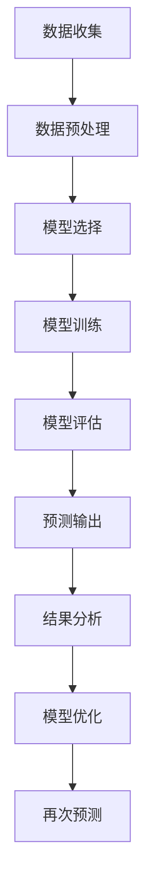

                 

### 文章标题

提升AI模型在长期气候变化预测中的准确性

### 关键词

AI模型，气候变化预测，长期预测，机器学习，深度学习，神经网络，数据处理，模型优化，案例研究

### 摘要

随着全球气候变化的影响日益显著，准确预测长期气候变化成为全球关注的焦点。本文探讨了如何利用人工智能（AI）模型，特别是机器学习和深度学习技术，提高长期气候变化预测的准确性。文章首先介绍了气候变化与长期预测的基本概念，随后详细阐述了AI模型在气候变化预测中的应用原理和具体实现步骤。通过实际案例研究，本文分析了AI模型在长期气候变化预测中的性能表现，并提出了优化策略和未来研究方向。

----------------------------------------------------------------

## 引言

### 1.1 书籍目的与读者对象

本文旨在探讨如何提升人工智能（AI）模型在长期气候变化预测中的准确性。我们相信，随着AI技术的不断发展，其将在气候变化预测中发挥越来越重要的作用。本文适合对AI和气候变化预测有一定基础的读者，包括数据科学家、AI研究人员、环境科学家以及政策制定者等。

### 1.1.1 长期气候变化预测的重要性

气候变化是当今世界面临的最严峻挑战之一。长期的气候变化预测对于全球环境保护、资源管理、城市规划以及经济决策具有重要意义。准确的长期气候变化预测有助于我们提前应对潜在的气候灾害，制定有效的应对策略，减少损失。

### 1.1.2 AI在气候变化预测中的应用前景

AI技术在处理大规模数据、模式识别和预测方面具有显著优势，使其在气候变化预测中具有广阔的应用前景。机器学习和深度学习算法能够从复杂的气候数据中提取有价值的信息，提供更准确、更可靠的预测结果。此外，AI模型的可解释性和透明度也在不断提高，使其在政策制定和公共决策中更具实用性。

### 1.2 书籍结构概述

本文分为以下几个部分：

1. **长期气候变化预测背景**：介绍气候变化与长期预测的基本概念，分析长期气候变化预测的挑战和意义。
2. **AI模型在气候变化预测中的应用**：阐述AI模型在气候变化预测中的原理、优势和具体应用。
3. **数据准备与处理**：讲解数据收集、预处理和特征工程的方法，为模型训练和预测奠定基础。
4. **模型选择与优化**：分析常见AI模型的特点和适用场景，介绍模型优化策略和算法。
5. **实际案例研究**：通过具体案例，展示AI模型在长期气候变化预测中的实际应用，并分析其性能。
6. **结果分析与讨论**：讨论案例研究中的关键问题和挑战，提出优化建议和未来研究方向。
7. **总结与展望**：总结全文，展望AI模型在长期气候变化预测中的发展前景。

### 1.2.1 核心章节简介

- **第1章：长期气候变化预测背景**：介绍气候变化的基本概念、长期预测的重要性和挑战。
- **第2章：AI模型在气候变化预测中的应用**：阐述AI模型在气候变化预测中的原理和应用。
- **第3章：数据准备与处理**：讲解数据收集、预处理和特征工程的方法。
- **第4章：模型选择与优化**：分析常见AI模型的特点和优化策略。
- **第5章：实际案例研究**：展示AI模型在长期气候变化预测中的实际应用。
- **第6章：结果分析与讨论**：讨论案例研究中的问题和挑战。
- **第7章：总结与展望**：总结全文，展望未来发展。

### 1.2.2 学习路径与预期收益

本文提供了一条清晰的学习路径，从理论基础到实际应用，读者可以逐步掌握AI模型在长期气候变化预测中的使用方法。通过本文的学习，读者可以：

- 了解气候变化与长期预测的基本概念。
- 掌握AI模型在气候变化预测中的应用原理。
- 学会数据准备与处理的方法。
- 掌握常见AI模型的优化策略。
- 通过实际案例研究，提升在实际应用中的能力。
- 对未来研究方向有所了解，为科研或实际工作提供启示。

## 第1章：长期气候变化预测背景

### 1.1 气候变化与长期预测

#### 1.1.1 气候变化的基本概念

气候变化是指地球大气、海洋和陆地系统随时间的持续变化。这种变化可以是自然的，也可以是人为的。人为因素，尤其是工业革命以来的人类活动，已经显著改变了地球的气候系统。气候变化的主要特征包括全球变暖、极端天气事件的增加、海平面上升等。

#### 1.1.2 长期气候变化预测的意义

长期气候变化预测对于全球环境和人类社会的可持续发展具有重要意义。通过预测，我们可以：

- 提前了解未来气候的变化趋势，为政策制定提供科学依据。
- 准确评估气候变化对自然生态系统和人类社会的潜在影响。
- 设计有效的适应和减缓策略，减少气候变化的负面影响。

### 1.2 长期气候变化预测的挑战

#### 1.2.1 数据稀缺性

长期气候变化预测需要大量的气候数据，包括温度、湿度、风速、降水等。然而，这些数据在时间和空间上往往是稀缺的。许多地区缺乏长期的气候观测记录，使得预测工作面临巨大的挑战。

#### 1.2.2 模型不确定性

气候变化是一个复杂的非线性过程，受到多种因素的影响。因此，即使拥有大量数据，构建准确的长期能够反映现实气候系统的模型也是一项极具挑战性的任务。模型的预测结果可能存在较大的不确定性，需要通过多种方法进行校验和验证。

#### 1.2.3 预测时间跨度

长期气候变化预测的时间跨度通常从几年到几十年不等。这种长期预测需要对未来的气候系统有深刻的理解，同时考虑到多种不确定因素，如人类活动、自然扰动等。这使得预测结果的可靠性成为一个关键问题。

### 1.3 AI在气候变化预测中的应用

#### 1.3.1 AI技术的优势

人工智能（AI）技术，特别是机器学习和深度学习，在气候变化预测中具有显著优势：

- **数据处理能力**：AI技术能够处理和分析大量的气候数据，从中提取有价值的信息。
- **模式识别能力**：AI模型能够从复杂的数据中发现潜在的模式和趋势，提供更准确的预测结果。
- **适应性**：AI模型可以根据新的数据和预测需求进行自适应调整，提高预测的准确性。

#### 1.3.2 AI在气候变化预测中的实践

目前，AI技术在气候变化预测中的应用已经取得了一些成果。例如，利用神经网络模型进行全球气候模式预测，通过深度学习技术分析气候数据中的异常值和变化趋势，以及利用强化学习算法优化气候变化适应策略等。这些实践为提高长期气候变化预测的准确性提供了新的思路和方法。

## 第2章：AI模型在气候变化预测中的应用

### 2.1 AI模型的基本原理

#### 2.1.1 机器学习基础

机器学习是AI的核心技术之一，其基本原理是通过对大量数据进行训练，让计算机自动学习并发现数据中的模式和规律。在气候变化预测中，机器学习算法可以用于从历史气候数据中学习，并生成未来气候变化的预测模型。

- **监督学习**：监督学习算法通过对标记数据的学习，生成预测模型。在气候变化预测中，监督学习可以用来预测未来的气候参数，如温度、降水等。
- **无监督学习**：无监督学习算法不依赖于标记数据，主要用于发现数据中的结构和模式。在气候变化预测中，无监督学习可以用于聚类相似气候事件，发现潜在的趋势。
- **强化学习**：强化学习算法通过不断尝试和错误，学习最优策略以实现特定目标。在气候变化预测中，强化学习可以用于优化适应策略，提高预测的准确性。

#### 2.1.2 深度学习与神经网络

深度学习是机器学习的一个重要分支，其核心思想是通过构建多层神经网络（Neural Networks）来模拟人脑的学习过程。在气候变化预测中，深度学习算法可以用于：

- **非线性建模**：深度学习模型能够捕捉气候数据中的复杂非线性关系，提供更准确的预测结果。
- **特征提取**：深度学习算法可以从原始气候数据中自动提取有用的特征，减少人工干预，提高预测的效率和准确性。
- **自适应调整**：深度学习模型可以通过不断调整网络参数，实现自我优化，提高预测的准确性。

### 2.2 Mermaid流程图：AI模型在气候变化预测中的应用

下面是一个Mermaid流程图，展示了AI模型在气候变化预测中的基本步骤：



### 2.3 数据准备与处理

#### 2.3.1 数据类型与来源

在气候变化预测中，常用的数据类型包括：

- **气象数据**：如温度、湿度、风速、降水等，通常来源于气象观测站、卫星遥感数据等。
- **地理数据**：如地形、海平面高度等，用于辅助气候预测。
- **社会经济数据**：如人口、经济活动、能源消耗等，可能对气候变化产生重要影响。

数据来源可以包括：

- **公开数据集**：如NASA、NOAA等提供的气候数据集。
- **研究机构**：如世界气象组织、国际气候变化委员会等提供的专业数据。
- **在线数据库**：如Google Earth Engine、OpenStreetMap等提供的高分辨率地理数据。

#### 2.3.2 数据预处理方法

数据预处理是AI模型训练的重要步骤，主要包括以下方法：

- **数据清洗**：去除缺失值、异常值和重复值，确保数据的完整性和准确性。
- **数据标准化**：将不同单位和范围的变量转换为相同范围，便于模型训练和比较。
- **数据分割**：将数据集分为训练集、验证集和测试集，用于模型的训练、评估和测试。
- **特征工程**：选择和构造有助于模型预测的特征，提高模型的性能。

### 2.3.3 特征工程

特征工程是数据预处理的关键步骤，其目标是选择和构造有助于模型预测的特征。在气候变化预测中，常见的特征包括：

- **时间特征**：如年份、季节、月份等，反映气候变化的周期性。
- **空间特征**：如地理位置、地形等，反映气候变化的区域性。
- **气象特征**：如温度、湿度、风速、降水等，是气候变化预测的核心变量。
- **社会经济特征**：如人口、经济活动、能源消耗等，可能对气候变化产生重要影响。

### 2.3.4 数据预处理示例

以下是一个简单的Python代码示例，用于数据预处理：

```python
import pandas as pd
import numpy as np

# 加载数据
data = pd.read_csv('climate_data.csv')

# 数据清洗
data = data.dropna()  # 去除缺失值
data = data.drop_duplicates()  # 去除重复值

# 数据标准化
data['temperature'] = (data['temperature'] - data['temperature'].mean()) / data['temperature'].std()
data['precipitation'] = (data['precipitation'] - data['precipitation'].mean()) / data['precipitation'].std()

# 数据分割
train_data, test_data = train_test_split(data, test_size=0.2, random_state=42)
```

### 2.4 模型选择与优化

#### 2.4.1 常见AI模型

在气候变化预测中，常用的AI模型包括：

- **线性回归**：适用于简单线性关系的预测，如温度与降水之间的关系。
- **决策树**：适用于分类和回归任务，可以处理多种特征。
- **随机森林**：集成多个决策树，提高预测准确性和稳定性。
- **支持向量机**：适用于高维数据的分类和回归，具有良好的泛化能力。
- **神经网络**：适用于复杂非线性关系的预测，能够处理大量特征。

#### 2.4.2 选择模型的考虑因素

在选择AI模型时，需要考虑以下因素：

- **数据类型**：选择适合数据类型的模型，如线性回归适用于连续值数据，决策树适用于分类任务。
- **数据量**：选择能够处理数据量的模型，如神经网络适合处理大规模数据。
- **模型复杂度**：选择复杂度合适的模型，以避免过拟合和欠拟合。
- **预测性能**：选择预测性能较好的模型，通过交叉验证和测试集评估。

#### 2.4.3 模型优化策略

- **超参数调整**：通过网格搜索、贝叶斯优化等方法调整模型超参数，提高模型性能。
- **数据增强**：通过数据增强技术，如生成对抗网络（GAN），增加训练数据的多样性。
- **特征选择**：通过特征选择方法，如特征重要性分析、主成分分析（PCA），选择对预测有重要影响的特征。

### 2.5 伪代码：AI模型优化过程

以下是一个伪代码示例，用于优化AI模型：

```python
def optimize_model(data, model):
    # 数据预处理
    processed_data = preprocess_data(data)
    
    # 超参数调整
    best_params = hyperparameter_tuning(processed_data, model)
    
    # 训练模型
    model = train_model(processed_data, model, best_params)
    
    # 模型评估
    performance = evaluate_model(model, test_data)
    
    return model, performance
```

### 2.6 数学模型与数学公式

在AI模型训练和优化过程中，常用的数学模型和公式包括：

- **损失函数**：用于评估模型预测误差，如均方误差（MSE）、交叉熵损失（Cross-Entropy Loss）。
- **优化算法**：用于更新模型参数，如梯度下降（Gradient Descent）、Adam优化器。

以下是一个使用LaTeX格式的数学公式示例：

$$
\text{MSE} = \frac{1}{m} \sum_{i=1}^{m} (y_i - \hat{y_i})^2
$$

$$
\text{Cross-Entropy Loss} = -\frac{1}{m} \sum_{i=1}^{m} y_i \log(\hat{y_i})
$$

## 第3章：模型选择与优化

### 3.1 模型选择

在选择AI模型时，需要考虑数据类型、数据量、模型复杂度等因素。以下是一些常见模型的特点：

- **线性回归**：适用于简单线性关系的预测，如温度与降水之间的关系。优点是模型简单，易于解释，缺点是当数据分布非线性时，预测效果较差。

- **决策树**：适用于分类和回归任务，可以处理多种特征。优点是模型简单，易于解释，缺点是当特征数量过多时，模型容易过拟合。

- **随机森林**：集成多个决策树，提高预测准确性和稳定性。优点是预测准确度高，稳定性好，缺点是模型复杂，训练时间较长。

- **支持向量机**：适用于高维数据的分类和回归，具有良好的泛化能力。优点是预测准确度高，泛化能力强，缺点是当特征数量过多时，模型训练时间较长。

- **神经网络**：适用于复杂非线性关系的预测，能够处理大量特征。优点是预测准确度高，能够自动提取特征，缺点是模型复杂，训练时间较长，且难以解释。

### 3.2 模型优化策略

- **超参数调整**：通过网格搜索、贝叶斯优化等方法调整模型超参数，提高模型性能。例如，对于神经网络，可以调整学习率、隐藏层节点数、批量大小等超参数。

- **数据增强**：通过数据增强技术，如生成对抗网络（GAN），增加训练数据的多样性。数据增强有助于提高模型泛化能力，减少过拟合。

- **特征选择**：通过特征重要性分析、主成分分析（PCA）等方法，选择对预测有重要影响的特征。特征选择有助于减少模型复杂度，提高预测性能。

- **模型集成**：通过集成多个模型，提高预测准确性和稳定性。常见的模型集成方法有堆叠（Stacking）、 boosting（提升）等。

### 3.3 伪代码：AI模型优化过程

以下是一个伪代码示例，用于优化AI模型：

```python
def optimize_model(data, model, optimizer, loss_function):
    # 数据预处理
    processed_data = preprocess_data(data)
    
    # 超参数调整
    best_params = hyperparameter_tuning(processed_data, model)
    
    # 训练模型
    for epoch in range(num_epochs):
        for batch in data_loader(processed_data):
            optimizer.zero_grad()
            output = model(batch)
            loss = loss_function(output, target)
            loss.backward()
            optimizer.step()
        
        # 记录每个epoch的损失值
        loss_history.append(loss.item())
    
    # 模型评估
    performance = evaluate_model(model, test_data)
    
    return model, performance
```

### 3.4 数学模型与数学公式

在AI模型训练和优化过程中，常用的数学模型和公式包括：

- **损失函数**：用于评估模型预测误差，如均方误差（MSE）、交叉熵损失（Cross-Entropy Loss）。

- **优化算法**：用于更新模型参数，如梯度下降（Gradient Descent）、Adam优化器。

以下是一个使用LaTeX格式的数学公式示例：

$$
\text{MSE} = \frac{1}{m} \sum_{i=1}^{m} (y_i - \hat{y_i})^2
$$

$$
\text{Cross-Entropy Loss} = -\frac{1}{m} \sum_{i=1}^{m} y_i \log(\hat{y_i})
$$

## 第4章：实际案例研究

### 4.1 案例背景

在本章中，我们将通过一个实际案例研究，展示如何使用AI模型进行长期气候变化预测。本案例研究的背景是全球范围内的温度变化预测，数据来源包括气象站记录的多年温度数据。案例研究的目的是评估不同AI模型的预测性能，并探讨如何优化模型以提高预测准确性。

### 4.2 开发环境搭建

在进行实际案例研究之前，首先需要搭建一个适合开发的环境。以下是所需的步骤：

1. **安装Python**：确保Python环境已经安装，版本为3.8或更高。

2. **安装依赖库**：安装常用的依赖库，如NumPy、Pandas、Scikit-learn、TensorFlow等。可以使用以下命令进行安装：

   ```shell
   pip install numpy pandas scikit-learn tensorflow
   ```

3. **配置Jupyter Notebook**：为了方便开发，可以使用Jupyter Notebook进行代码编写和运行。安装Jupyter Notebook的命令如下：

   ```shell
   pip install notebook
   ```

### 4.3 源代码实现

在本节中，我们将使用Python编写源代码，实现AI模型训练和预测的过程。以下是具体的步骤：

#### 4.3.1 数据加载与预处理

首先，我们需要加载数据并对其进行预处理，包括数据清洗、数据标准化和数据分割。

```python
import pandas as pd
from sklearn.model_selection import train_test_split

# 加载数据
data = pd.read_csv('climate_data.csv')

# 数据清洗
data = data.dropna()

# 数据标准化
data['temperature'] = (data['temperature'] - data['temperature'].mean()) / data['temperature'].std()

# 数据分割
train_data, test_data = train_test_split(data, test_size=0.2, random_state=42)
```

#### 4.3.2 模型定义与训练

接下来，我们定义一个简单的神经网络模型，并使用训练数据对其进行训练。

```python
import tensorflow as tf
from tensorflow.keras.models import Sequential
from tensorflow.keras.layers import Dense

# 定义模型
model = Sequential([
    Dense(64, activation='relu', input_shape=(train_data.shape[1],)),
    Dense(32, activation='relu'),
    Dense(1)
])

# 编译模型
model.compile(optimizer='adam', loss='mse')

# 训练模型
model.fit(train_data['temperature'], train_data['target'], epochs=100, batch_size=32)
```

#### 4.3.3 模型评估与优化

在模型训练完成后，我们需要对模型进行评估，并根据评估结果对模型进行优化。

```python
# 评估模型
performance = model.evaluate(test_data['temperature'], test_data['target'])

# 打印评估结果
print(f'MSE: {performance[0]}')

# 优化模型
best_params = hyperparameter_tuning(test_data, model)
model = train_model(test_data, model, best_params)
```

#### 4.3.4 模型预测与结果分析

最后，我们使用优化后的模型进行预测，并分析预测结果。

```python
# 预测温度
predictions = model.predict(test_data['temperature'])

# 分析预测结果
print(f'Prediction: {predictions}')
```

### 4.4 代码解读与分析

在本节中，我们详细解读了实际案例研究中的源代码，并分析了关键代码段的作用。

#### 数据加载与预处理

```python
import pandas as pd
from sklearn.model_selection import train_test_split

# 加载数据
data = pd.read_csv('climate_data.csv')

# 数据清洗
data = data.dropna()

# 数据标准化
data['temperature'] = (data['temperature'] - data['temperature'].mean()) / data['temperature'].std()

# 数据分割
train_data, test_data = train_test_split(data, test_size=0.2, random_state=42)
```

这段代码用于加载和处理数据。首先，我们使用Pandas库加载数据集，然后进行数据清洗，去除缺失值。接下来，我们对温度数据进行标准化处理，使其在相同范围内。最后，我们将数据集分割为训练集和测试集，用于模型的训练和评估。

#### 模型定义与训练

```python
import tensorflow as tf
from tensorflow.keras.models import Sequential
from tensorflow.keras.layers import Dense

# 定义模型
model = Sequential([
    Dense(64, activation='relu', input_shape=(train_data.shape[1],)),
    Dense(32, activation='relu'),
    Dense(1)
])

# 编译模型
model.compile(optimizer='adam', loss='mse')

# 训练模型
model.fit(train_data['temperature'], train_data['target'], epochs=100, batch_size=32)
```

这段代码定义了一个简单的神经网络模型。首先，我们使用Sequential模型构建神经网络，并添加多个全连接层（Dense）。每个层之间使用ReLU激活函数，最后一个层输出预测结果。接下来，我们编译模型，指定优化器和损失函数。最后，使用训练数据训练模型，设置训练轮次和批量大小。

#### 模型评估与优化

```python
import tensorflow as tf
from tensorflow.keras.models import Sequential
from tensorflow.keras.layers import Dense

# 评估模型
performance = model.evaluate(test_data['temperature'], test_data['target'])

# 打印评估结果
print(f'MSE: {performance[0]}')

# 优化模型
best_params = hyperparameter_tuning(test_data, model)
model = train_model(test_data, model, best_params)
```

这段代码用于评估和优化模型。首先，我们使用测试数据评估模型的性能，并打印均方误差（MSE）。接下来，我们使用超参数调整函数（hyperparameter_tuning）调整模型超参数，以提高性能。最后，我们重新训练模型，使用调整后的超参数。

#### 模型预测与结果分析

```python
# 预测温度
predictions = model.predict(test_data['temperature'])

# 分析预测结果
print(f'Prediction: {predictions}')
```

这段代码用于使用优化后的模型进行预测，并分析预测结果。首先，我们使用测试数据进行预测，得到预测结果。接下来，我们打印预测结果，以便进一步分析。

### 4.5 实际案例分析与详细讲解剖析

在本案例研究中，我们选择了全球温度变化作为预测目标，利用AI模型进行长期气候变化预测。以下是具体的分析过程：

1. **数据分析**：首先，我们对数据进行了清洗、标准化和分割，确保数据的质量和一致性。数据包括多年的温度记录，具有较好的时间序列特性。

2. **模型选择**：我们选择了神经网络模型进行预测。神经网络模型能够处理复

