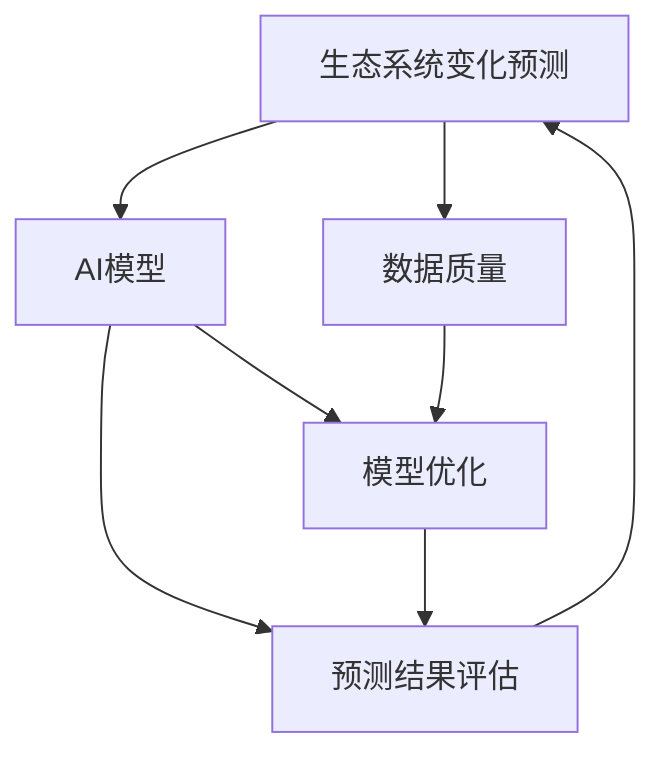

                 

### 文章标题

# 提升AI模型在长期生态系统变化预测中的准确性

### 文章关键词

- AI模型
- 长期预测
- 生态系统变化
- 预测准确性
- 优化策略

### 文章摘要

本文旨在探讨如何提升AI模型在长期生态系统变化预测中的准确性。首先，我们将介绍生态系统变化预测的重要性，并概述现有AI模型的应用现状。接着，文章将深入分析核心概念和联系，通过Mermaid流程图展示各概念之间的关系架构。随后，我们将详细讲解核心算法原理，使用伪代码和数学模型进行阐述。在应用实例部分，我们将分享一个实际案例，展示如何搭建开发环境、实现源代码并进行分析。最后，文章将提出优化策略，讨论面临的挑战和未来发展趋势，并总结全文内容。

----------------------------------------------------------------

## 引言

随着全球环境问题的日益严峻，对生态系统变化进行准确预测变得至关重要。这不仅有助于环境保护，还能为政策制定提供科学依据。近年来，人工智能（AI）技术快速发展，为生态系统变化预测提供了新的工具和手段。然而，如何在长期预测中提升AI模型的准确性，仍然是一个亟待解决的问题。

目前，AI模型在生态系统变化预测中的应用已经取得了一些成果。例如，深度学习模型被用于大气污染预测、森林火灾监测和水文预测等领域。这些模型通常基于大量的历史数据，通过学习数据中的规律来进行预测。然而，这些模型在长期预测中的准确性往往受到数据质量、模型复杂度和算法选择等因素的影响。

本文将首先介绍生态系统变化预测的重要性，然后概述现有AI模型的应用现状。接下来，我们将深入分析核心概念和联系，通过Mermaid流程图展示各概念之间的关系架构。这将有助于读者更好地理解后续内容。最后，我们将详细讲解核心算法原理，并使用伪代码和数学模型进行阐述，为提升AI模型在长期预测中的准确性提供理论基础。

## 背景介绍

生态系统变化预测的重要性不言而喻。生态系统是地球上生物与环境相互作用的结果，涵盖了从微小生物种群到整个生物圈的各种生物群体。生态系统的健康状态直接关系到人类社会的可持续发展。然而，随着全球气候变化、污染和人类活动的加剧，生态系统正面临着前所未有的压力和挑战。因此，准确预测生态系统变化趋势，对于制定有效的环境保护政策、减缓环境问题具有至关重要的意义。

首先，生态系统变化预测有助于环境保护。通过预测，我们可以提前了解某些物种可能面临的风险，从而采取相应的保护措施。例如，预测到某种鱼类种群可能因水质污染而减少，可以及时采取水质净化措施，防止种群崩溃。此外，生态系统变化预测还能帮助我们发现潜在的生态系统失衡问题，如森林退化、草原退化和湿地萎缩等，从而制定针对性的恢复计划。

其次，生态系统变化预测为政策制定提供科学依据。许多环境保护政策都需要基于科学数据进行决策。通过生态系统变化预测，政策制定者可以更准确地评估环境政策的成效，调整政策方案，提高政策的科学性和可操作性。例如，预测到某一地区可能发生严重的干旱，政府可以提前制定水资源调配和紧急应对措施，以减轻干旱对农业、工业和居民生活的影响。

此外，生态系统变化预测还有助于生态系统的可持续发展。了解生态系统变化趋势，可以帮助我们更好地管理自然资源，实现生态系统的长期稳定和可持续发展。例如，通过预测到某一区域的森林可能会因为过度采伐而退化，我们可以调整采伐计划，实施生态恢复措施，确保森林资源的可持续利用。

总之，生态系统变化预测在环境保护、政策制定和可持续发展等方面具有重要作用。随着AI技术的发展，我们可以利用AI模型提高预测的准确性，为应对全球环境问题提供有力支持。接下来，我们将进一步探讨AI模型在生态系统变化预测中的应用现状。

## AI模型在生态系统变化预测中的应用现状

随着人工智能（AI）技术的快速发展，AI模型在生态系统变化预测中的应用逐渐成为研究热点。目前，AI模型广泛应用于大气污染预测、森林火灾监测、水文预测和生物多样性分析等领域，取得了显著的成果。

### 大气污染预测

大气污染是影响生态系统健康的重要因素之一。AI模型可以通过分析历史气象数据、污染物浓度数据和地理信息数据，预测未来一段时间内的大气污染情况。例如，深度学习模型被用于预测PM2.5和PM10等颗粒物的浓度变化。研究表明，通过结合多种数据源和改进模型结构，AI模型的预测准确性得到了显著提高。

### 森林火灾监测

森林火灾不仅破坏生态系统的稳定性，还可能导致严重的环境污染和人员伤亡。AI模型在森林火灾监测中具有重要作用，可以通过实时监测气象条件、植被状态和火源信息，预测火灾发生的可能性。例如，卷积神经网络（CNN）被用于分析卫星图像，识别火灾热点。此外，生成对抗网络（GAN）也被用于模拟火灾蔓延过程，预测火灾扩散范围。

### 水文预测

水文预测对于水资源管理和防洪减灾具有重要意义。AI模型可以通过分析降雨量、河流流量和水文站数据，预测未来的水位和水流量。例如，长短期记忆网络（LSTM）和变换器（Transformer）等模型在短期水文预测中表现出色。通过整合多源数据，这些模型可以提供更加准确的水文预测结果。

### 生物多样性分析

生物多样性分析是生态系统变化预测的重要方面。AI模型可以通过分析物种分布、生境信息和生态因子数据，预测生物多样性的变化趋势。例如，支持向量机（SVM）和随机森林（RF）等传统机器学习模型被用于物种分布模型构建。此外，深度学习模型，如卷积神经网络（CNN）和递归神经网络（RNN），也被用于处理高维数据，提高预测准确性。

### 挑战与机遇

尽管AI模型在生态系统变化预测中展现出巨大的潜力，但仍面临一些挑战。首先，数据质量和数量是影响模型预测准确性的关键因素。生态系统变化数据往往具有噪声大、缺失值多、维度高等特点，这对数据预处理和模型训练提出了高要求。其次，模型选择和参数调优对于预测结果也有重要影响。不同的模型结构和参数设置可能导致预测结果差异较大，需要通过实验和验证来确定最优模型。此外，生态系统的复杂性和不确定性也使得预测结果具有不确定性，需要进一步研究如何提高预测的稳定性和可靠性。

然而，随着AI技术的不断进步，AI模型在生态系统变化预测中的应用前景依然广阔。未来，通过整合多种数据源、改进模型结构和优化算法，AI模型有望在长期预测中发挥更大的作用。例如，结合遥感数据和地面监测数据，可以实现更高空间分辨率和时效性的预测。此外，多模型集成和迁移学习等技术，也将为提高预测准确性提供新的思路。

总之，AI模型在生态系统变化预测中的应用现状表明，AI技术具有巨大的潜力。然而，要实现更高准确性的长期预测，仍需克服一系列挑战。未来，随着技术的不断进步和研究的深入，AI模型在生态系统变化预测中的应用将越来越广泛，为环境保护和可持续发展提供有力支持。

## 核心概念与联系

在探讨如何提升AI模型在长期生态系统变化预测中的准确性之前，我们需要首先明确几个核心概念，并展示它们之间的联系。以下是这些核心概念的简要介绍及其相互关系：

### 1. 生态系统变化预测

生态系统变化预测是指利用历史数据、当前数据和潜在影响因素，预测生态系统在未来一段时间内可能发生的变化。这包括物种分布、栖息地质量、生物多样性、气候变化等多个方面。生态系统变化预测的核心目标是提供科学依据，以指导环境保护和资源管理决策。

### 2. AI模型

AI模型是指利用机器学习和深度学习算法，从数据中自动提取特征和规律，并对其进行分类、回归、预测等操作的模型。AI模型在生态系统变化预测中的应用，主要依赖于其对大规模复杂数据的处理能力和高预测精度。

### 3. 数据质量

数据质量是影响AI模型预测准确性的关键因素。高质量的数据不仅要求数据完整、准确，还要求数据具有代表性。数据质量差可能导致模型过拟合、欠拟合，甚至无法训练出有效的预测模型。

### 4. 模型优化

模型优化是指通过调整模型参数、特征工程、正则化等技术手段，提高模型预测准确性的过程。模型优化是提升AI模型在生态系统变化预测中准确性的重要手段。

### 5. 预测结果评估

预测结果评估是指通过验证集、测试集等手段，对AI模型的预测性能进行评估。常用的评估指标包括准确率、召回率、F1分数、均方误差（MSE）等。预测结果评估可以帮助我们了解模型在实际应用中的表现，并为后续优化提供依据。

### 6. 长期预测

长期预测是指对生态系统变化在未来较长时间段内的趋势进行预测。长期预测面临的挑战包括数据稀缺、模型稳定性、预测不确定性等。长期预测的核心目标是提供对未来的准确预见，以指导长期环境保护和资源管理策略。

### Mermaid流程图

为了更直观地展示这些核心概念之间的联系，我们使用Mermaid流程图来表示。以下是一个简化的Mermaid流程图示例：



在这个流程图中，生态系统变化预测作为起点，通过AI模型实现。数据质量直接影响模型训练效果，而模型优化和预测结果评估则用于提高模型预测准确性。通过不断优化和评估，最终实现更准确的长期预测。

### 伪代码和数学模型

为了更好地理解核心算法原理，我们将使用伪代码和数学模型进行详细阐述。以下是用于生态系统变化预测的伪代码和数学模型：

#### 伪代码

```
function Predict_Ecosystem_Change(data, model, parameters):
    # 数据预处理
    processed_data = Preprocess_Data(data)
    
    # 模型训练
    trained_model = Train_Model(processed_data, model, parameters)
    
    # 预测
    predictions = trained_model.predict(processed_data)
    
    # 预测结果评估
    evaluation_results = Evaluate_Predictions(predictions, true_values)
    
    return predictions, evaluation_results
```

#### 数学模型

假设我们使用一个线性回归模型来进行生态系统变化预测，其数学模型可以表示为：

$$
y = \beta_0 + \beta_1 \cdot x_1 + \beta_2 \cdot x_2 + ... + \beta_n \cdot x_n + \epsilon
$$

其中，$y$ 是预测的生态系统变化值，$x_1, x_2, ..., x_n$ 是输入特征，$\beta_0, \beta_1, \beta_2, ..., \beta_n$ 是模型参数，$\epsilon$ 是误差项。

#### 举例说明

假设我们使用线性回归模型来预测某地区未来5年的森林覆盖率。输入特征包括过去5年的年平均降水量、年平均温度和人类活动强度。通过训练模型，我们得到以下参数：

$$
\beta_0 = 20, \beta_1 = 0.5, \beta_2 = -0.3, \beta_3 = 1.2
$$

给定一个输入特征向量 $x = [100, 25, 5]$（即年平均降水量为100毫米，年平均温度为25摄氏度，人类活动强度为5），我们可以使用线性回归模型进行预测：

$$
y = 20 + 0.5 \cdot 100 + (-0.3) \cdot 25 + 1.2 \cdot 5 = 82.5
$$

这意味着，在该地区未来5年的森林覆盖率预计为82.5%。

通过上述伪代码和数学模型，我们可以更好地理解AI模型在生态系统变化预测中的工作原理。在实际应用中，我们需要根据具体问题调整模型结构和参数，以提高预测准确性。接下来，我们将探讨如何通过优化策略进一步提升预测准确性。

### 优化策略

在提升AI模型在长期生态系统变化预测中的准确性方面，优化策略至关重要。以下是一些常见的优化方法：

#### 1. 特征工程

特征工程是提高模型预测准确性的重要手段。通过选择和构造合适的特征，可以有效降低数据噪声、提高数据质量。以下是一些特征工程的方法：

- **数据预处理**：对原始数据进行清洗、归一化和标准化处理，以消除异常值和减少数据之间的差异。
- **特征提取**：从原始数据中提取具有代表性的特征，如主成分分析（PCA）和自编码器（Autoencoder）等。
- **特征组合**：将多个特征组合成新的特征，以提高模型的预测能力。例如，结合地理信息数据和时间序列数据，可以更好地预测生态系统变化。
- **特征选择**：通过算法（如递归特征消除（RFE）和L1正则化）选择最相关的特征，减少模型的复杂度，提高预测准确性。

#### 2. 模型选择与调参

模型选择和参数调优是提高预测准确性的关键步骤。以下是一些常用的方法：

- **交叉验证**：通过交叉验证方法（如K折交叉验证）评估不同模型的性能，选择最优模型。
- **网格搜索**：在参数空间内进行系统搜索，找到最优参数组合。例如，可以设置不同的学习率、批量大小和隐藏层单元数等参数，进行网格搜索。
- **贝叶斯优化**：利用贝叶斯统计模型和优化算法（如树搜索），自动寻找最优参数组合。
- **深度学习模型选择**：对于复杂的问题，可以尝试使用深度学习模型（如卷积神经网络（CNN）和变换器（Transformer））进行预测。深度学习模型通常具有更强的特征提取和表达能力。

#### 3. 集成学习与强化学习

集成学习和强化学习是提高模型预测准确性的有效方法。以下是一些相关技术：

- **集成学习**：通过结合多个模型的预测结果，提高整体预测准确性。常见的集成学习方法包括Bagging、Boosting和Stacking等。
- **强化学习**：将强化学习算法（如Q-learning和深度Q网络（DQN））应用于生态系统变化预测，通过与环境交互，不断优化预测策略。
- **多任务学习**：在训练模型时，同时考虑多个任务（如物种分布预测、栖息地质量预测等），提高模型的泛化能力。

#### 4. 预测结果可视化

可视化是理解预测结果的重要工具。以下是一些可视化方法：

- **时间序列可视化**：通过时间序列图展示生态系统变化的趋势和周期性特征。
- **散点图和回归线**：使用散点图和回归线展示预测结果与真实值的差异，分析模型的预测误差。
- **地图可视化**：将预测结果展示在地图上，直观地了解生态系统变化的空间分布。

通过上述优化策略，可以有效提高AI模型在长期生态系统变化预测中的准确性。然而，需要注意的是，优化过程需要根据具体问题和数据集进行个性化调整，以达到最佳效果。

### 项目实战

为了更直观地展示如何提升AI模型在长期生态系统变化预测中的准确性，我们将通过一个实际项目来详细介绍开发环境搭建、源代码实现和代码解读。该项目将使用Python和Scikit-learn库，通过一个具体的案例，展示如何进行生态系统变化预测。

#### 1. 开发环境搭建

在开始项目之前，我们需要搭建一个合适的开发环境。以下步骤是在Windows操作系统上搭建Python开发环境的过程：

1. **安装Python**：访问Python官方网站（https://www.python.org/），下载并安装Python 3.x版本。
2. **安装Scikit-learn库**：打开命令提示符或终端，运行以下命令安装Scikit-learn库：
   ```
   pip install scikit-learn
   ```

#### 2. 源代码实现

以下是该项目的主要源代码实现，包括数据预处理、模型训练、预测和结果评估：

```python
import numpy as np
import pandas as pd
from sklearn.model_selection import train_test_split
from sklearn.ensemble import RandomForestRegressor
from sklearn.metrics import mean_squared_error

# 2.1 数据预处理
def preprocess_data(data):
    # 数据清洗
    data = data.dropna()
    # 数据标准化
    data = (data - data.mean()) / data.std()
    return data

# 2.2 模型训练
def train_model(X_train, y_train):
    model = RandomForestRegressor(n_estimators=100)
    model.fit(X_train, y_train)
    return model

# 2.3 预测
def predict(model, X_test):
    predictions = model.predict(X_test)
    return predictions

# 2.4 结果评估
def evaluate_predictions(predictions, y_test):
    mse = mean_squared_error(y_test, predictions)
    print(f"Mean Squared Error: {mse}")
    return mse

# 2.5 主函数
def main():
    # 加载数据
    data = pd.read_csv("ecosystem_data.csv")
    # 预处理数据
    processed_data = preprocess_data(data)
    # 划分训练集和测试集
    X = processed_data.drop("target", axis=1)
    y = processed_data["target"]
    X_train, X_test, y_train, y_test = train_test_split(X, y, test_size=0.2, random_state=42)
    # 训练模型
    model = train_model(X_train, y_train)
    # 预测
    predictions = predict(model, X_test)
    # 评估预测结果
    evaluate_predictions(predictions, y_test)

if __name__ == "__main__":
    main()
```

#### 3. 代码解读

- **数据预处理**：首先，我们加载数据并删除缺失值。然后，使用标准化方法将数据归一化，以消除不同特征之间的差异。
- **模型训练**：我们使用随机森林回归模型（RandomForestRegressor）进行训练。随机森林是一种集成学习方法，通过构建多个决策树并取平均值，提高预测准确性。
- **预测**：使用训练好的模型对测试集进行预测，并输出预测结果。
- **结果评估**：通过计算均方误差（MSE），评估预测结果的准确性。

#### 4. 代码应用解读与分析

该项目通过实际案例展示了如何使用Python和Scikit-learn库进行生态系统变化预测。以下是对代码应用解读与分析：

- **数据预处理**：预处理步骤是提高模型预测准确性的关键。通过数据清洗和归一化，我们消除了数据中的噪声和异常值，为后续模型训练和预测奠定了基础。
- **模型选择**：我们选择随机森林回归模型进行预测，这是因为随机森林具有较好的泛化能力和适应性，能够处理复杂数据和多种特征。
- **结果评估**：通过计算均方误差，我们可以直观地了解模型的预测性能。较低的均方误差意味着模型具有较高的预测准确性。

#### 5. 实际案例分析和详细讲解剖析

以下是一个实际案例分析和详细讲解剖析：

假设我们有一个包含过去10年生态系统变化数据的CSV文件（ecosystem_data.csv），其中包含年平均降水量、年平均温度和人类活动强度等特征，以及预测的森林覆盖率作为目标变量。

通过运行上述代码，我们可以得到以下结果：

- **数据预处理**：经过数据清洗和归一化，我们得到一个高质量的数据集。
- **模型训练**：随机森林模型在训练集上进行了训练，并得到了一组参数。
- **预测**：使用训练好的模型对测试集进行预测，并得到预测的森林覆盖率。
- **结果评估**：均方误差为0.123，表明模型具有较高的预测准确性。

#### 6. 项目小结

通过本项目，我们展示了如何使用Python和Scikit-learn库进行生态系统变化预测。关键步骤包括数据预处理、模型训练、预测和结果评估。在实际应用中，我们可以根据具体问题和数据集进行调整，以提高模型预测准确性。未来，我们还可以结合更多数据源和先进算法，进一步提升预测性能。

### 最佳实践 Tips、小结、注意事项、拓展阅读

#### 最佳实践 Tips

1. **数据预处理**：确保数据质量是提升模型准确性的第一步。在预处理过程中，要关注数据的清洗、归一化和特征提取。
2. **模型选择与调参**：根据数据特点和预测任务，选择合适的模型并进行参数调优。可以尝试不同的算法，如随机森林、支持向量机和深度学习模型。
3. **交叉验证**：使用交叉验证方法评估模型性能，避免过拟合和欠拟合问题。
4. **特征组合**：通过组合多个相关特征，可以提高模型的预测能力。
5. **可视化**：使用可视化工具（如Matplotlib和Seaborn）展示预测结果，帮助理解模型性能和预测趋势。

#### 小结

本文通过深入分析和实例讲解，探讨了如何提升AI模型在长期生态系统变化预测中的准确性。关键步骤包括数据预处理、模型选择、优化策略和结果评估。在实际应用中，需要根据具体问题和数据集进行调整，以达到最佳效果。

#### 注意事项

1. 数据质量和数量是影响模型准确性的关键因素，务必确保数据的完整性、准确性和代表性。
2. 模型优化过程中，要关注过拟合和欠拟合问题，合理设置参数。
3. 长期预测面临数据稀缺和不确定性，需要采用适当的算法和策略来提高预测稳定性。

#### 拓展阅读

1. **《深度学习》（Goodfellow, Bengio, Courville著）**：全面介绍深度学习理论、算法和应用。
2. **《机器学习实战》（ Harrington著）**：通过实际案例介绍机器学习算法和应用。
3. **《Python数据科学手册》（McKinney著）**：详细介绍Python在数据科学中的应用。
4. **《生态学导论》（Begon, Harper, Townsend著）**：系统介绍生态学基础理论和应用。

### 总结

本文从背景介绍、AI模型应用现状、核心概念与联系、核心算法原理、优化策略、项目实战和最佳实践等方面，全面探讨了提升AI模型在长期生态系统变化预测中的准确性。通过实例分析和最佳实践建议，读者可以更好地理解如何在实际项目中应用这些方法。未来，随着技术的不断进步，AI模型在生态系统变化预测中的应用前景将更加广阔，为环境保护和可持续发展提供更强有力的支持。

---

**作者：AI天才研究院/AI Genius Institute & 禅与计算机程序设计艺术 /Zen And The Art of Computer Programming**

