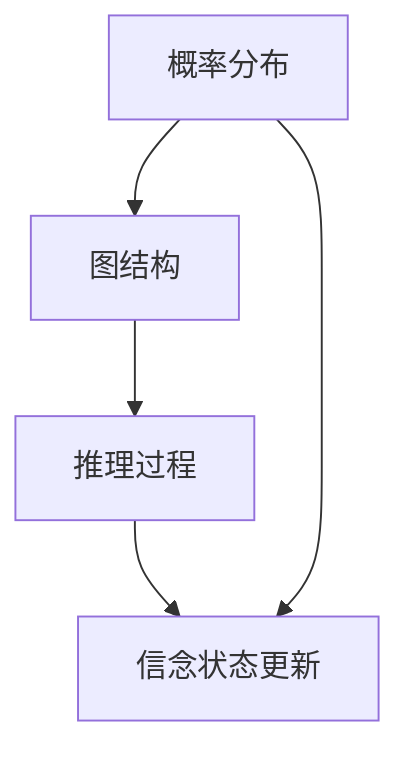

                 

## 引言

### AI环境理解的重要性

随着人工智能技术的迅猛发展，AI系统在各个领域的应用越来越广泛。从自动驾驶、智能客服到智能家居，AI系统需要处理复杂多变的环境，并在这些环境中做出智能决策。这就要求AI系统具备强大的环境理解能力，能够准确感知和解释周围的环境信息。然而，AI环境理解并不是一个简单的问题，它涉及到感知、认知和推理等多个层面的综合能力。

信念状态建模作为一种重要的AI方法，致力于解决环境理解的问题。它通过对不确定性的建模，帮助AI系统在动态环境中做出合理决策。信念状态建模的核心思想是将AI系统的状态表示为一系列概率分布，这些概率分布描述了系统在不同情况下的可能性。通过信念状态建模，AI系统能够在不确定的环境中保持对自身状态的清晰认知，从而提高决策的准确性和鲁棒性。

### 信念状态建模的基础

信念状态建模的基础是概率论和图论。在概率论中，概率分布用于描述随机变量的可能性。在图论中，图结构用于表示实体之间的关系。结合这两种理论，信念状态建模能够将复杂的动态环境转化为易于处理的数学模型。

贝叶斯网络是信念状态建模中最常用的工具之一。贝叶斯网络通过有向无环图（DAG）表示变量之间的条件依赖关系，并使用条件概率表来描述这些关系的强度。马尔可夫模型则是一种基于状态转移矩阵的模型，它主要用于描述连续时间段内系统状态的演变。

### 本书结构安排

本书旨在全面介绍信念状态建模在AI环境理解中的应用，结构安排如下：

- **第1章 引言**：介绍AI环境理解的重要性以及信念状态建模的基础知识。
- **第2章 核心概念与联系**：详细阐述信念状态建模中的核心概念，包括概率分布、图结构和推理过程，并通过Mermaid流程图展示这些概念之间的关系。
- **第3章 核心算法原理讲解**：讲解信念状态建模中常用的算法原理，如贝叶斯网络和马尔可夫模型，并使用伪代码详细阐述这些算法的实现。
- **第4章 数学模型与公式讲解**：介绍信念状态建模中的数学模型，包括概率分布、条件概率和边缘概率等，并使用LaTeX格式给出相关数学公式。
- **第5章 项目实战**：通过实际案例展示信念状态建模在AI环境理解中的应用，包括开发环境搭建、源代码实现和代码解读。
- **第6章 案例分析**：深入分析多个实际案例，包括自动驾驶、智能客服和智能家居等，详细讲解信念状态建模的应用原理和实现过程。
- **第7章 总结与展望**：总结全书内容，展望信念状态建模的未来发展趋势，并给出对读者的建议。

通过以上结构安排，本书将帮助读者全面了解信念状态建模在AI环境理解中的应用，掌握相关算法和模型，并能够应用于实际项目开发中。

---

### 核心概念与联系

在深入探讨信念状态建模之前，我们需要明确几个核心概念，并理解它们之间的关系。信念状态建模不仅仅是一种算法，它是一种思想，一种方法论，用于处理AI系统在动态环境中的不确定性。

#### 概率分布

概率分布是信念状态建模的基础。它用于描述一个随机变量在不同状态下的可能性。例如，在自动驾驶系统中，车辆可能处于不同的速度、方向和位置状态。每个状态都有一定的概率，这些概率通过概率分布来表示。

#### 图结构

图结构用于表示变量之间的依赖关系。在信念状态建模中，图结构通常是有向无环图（DAG），其中每个节点表示一个随机变量，每条边表示变量之间的条件依赖关系。例如，在智能客服系统中，用户的情绪状态（如愤怒、开心）可能依赖于用户的历史行为和当前交互内容。

#### 推理过程

推理过程是信念状态建模的关键。它用于计算变量之间的条件概率，从而更新系统的信念状态。推理过程可以通过贝叶斯推理、马尔可夫链等方法实现。贝叶斯推理基于贝叶斯定理，通过观察当前数据更新先验概率，从而得到后验概率。马尔可夫链则通过状态转移矩阵描述系统状态的演变。

#### Mermaid流程图展示

为了更直观地理解这些核心概念之间的关系，我们可以使用Mermaid流程图进行展示。以下是一个简化的信念状态建模流程图：



在这个流程图中，概率分布（A）用于描述初始的信念状态，图结构（B）用于表示变量之间的依赖关系，推理过程（C）通过更新信念状态（D），使得系统在动态环境中能够做出合理的决策。

#### 核心概念之间的关系

1. **概率分布与图结构**：概率分布提供了对系统状态的量化描述，而图结构则表示了这些状态之间的逻辑关系。通过图结构，我们可以将复杂的系统状态分解为更小的、可管理的部分。

2. **图结构与推理过程**：图结构为推理过程提供了框架。推理过程通过遍历图结构，计算变量之间的条件概率，从而更新信念状态。这个过程是动态的，需要不断根据新的观测数据进行调整。

3. **推理过程与信念状态更新**：推理过程的结果直接影响信念状态的更新。信念状态更新是整个信念状态建模的核心，它决定了系统在动态环境中的决策能力。

通过上述核心概念和Mermaid流程图的展示，我们可以看到信念状态建模是如何将不确定性转化为可操作信息的。在下一章中，我们将详细讲解信念状态建模的核心算法原理，并通过伪代码进行具体阐述。

---

### 核心算法原理讲解

信念状态建模的关键在于算法原理，这些算法帮助我们在复杂的环境中处理不确定性，并做出合理的决策。在本节中，我们将重点介绍两种常用的信念状态建模算法：贝叶斯网络和马尔可夫模型。通过伪代码，我们将详细解释这些算法的实现过程。

#### 贝叶斯网络

贝叶斯网络是一种基于概率论和图论的建模方法，它通过有向无环图（DAG）表示变量之间的条件依赖关系。在贝叶斯网络中，每个节点表示一个随机变量，每条边表示变量之间的条件概率关系。

**定义：** 一个贝叶斯网络由一个有向无环图 \( G \) 和一组概率分布 \( P \) 组成，其中 \( G \) 包含节点集 \( V \) 和边集 \( E \)，而 \( P \) 包含每个节点的条件概率分布。

**伪代码：**

```plaintext
输入：贝叶斯网络 G，观测数据 D
输出：后验概率分布 P(X|D)

初始化：P(X|D) 为所有变量的联合概率分布的初始估计

对于每个节点 X ∈ V：
    如果 X 不在 D 中：
        根据贝叶斯定理更新 P(X|D)：
            P(X|D) = P(D|X) * P(X) / P(D)
    否则：
        P(X|D) = 1 （观测数据中的值）

返回 P(X|D)
```

在上述伪代码中，我们首先初始化后验概率分布。然后，对于每个节点，如果它不在观测数据中，我们使用贝叶斯定理更新其概率分布。如果节点在观测数据中，则其概率分布被固定为观测值。

#### 马尔可夫模型

马尔可夫模型是一种基于状态转移矩阵的建模方法，它用于描述连续时间段内系统状态的演变。在马尔可夫模型中，系统当前状态仅取决于前一个状态，与过去的所有状态无关。

**定义：** 一个马尔可夫模型由一个状态集合 \( S \)、初始状态概率分布 \( P(S_0) \) 和状态转移矩阵 \( P(S_t|S_{t-1}) \) 组成。

**伪代码：**

```plaintext
输入：马尔可夫模型 M，初始状态 S0
输出：状态序列 S

初始化：当前状态为 S0

对于每个时间步 t：
    根据状态转移矩阵 P(S_t|S_{t-1}) 计算下一个状态 S_t
    更新当前状态为 S_t

返回状态序列 S
```

在上述伪代码中，我们首先初始化当前状态。然后，在每次迭代中，我们根据状态转移矩阵计算下一个状态，并更新当前状态。这个过程一直持续到我们达到所需的模拟时间或状态序列长度。

#### 其他相关算法

除了贝叶斯网络和马尔可夫模型，还有一些其他常用的信念状态建模算法，如隐马尔可夫模型（HMM）和粒子滤波。隐马尔可夫模型用于处理隐藏状态序列，而粒子滤波是一种基于蒙特卡洛方法的概率估计技术，用于处理非线性非高斯状态。

**隐马尔可夫模型：**

**定义：** 隐马尔可夫模型（HMM）由状态集合 \( S \)、观测集合 \( O \)、初始状态概率分布 \( P(S_0) \)、状态转移矩阵 \( P(S_t|S_{t-1}) \) 和观测概率分布 \( P(O_t|S_t) \) 组成。

**伪代码：**

```plaintext
输入：隐马尔可夫模型 HMM，观测序列 O
输出：隐藏状态序列 S

初始化：Viterbi算法或前向-后向算法计算初始概率

对于每个时间步 t：
    根据前向概率和后向概率更新隐藏状态概率

返回隐藏状态序列 S
```

**粒子滤波：**

**定义：** 粒子滤波是一种基于蒙特卡洛方法的概率估计技术，用于处理非线性非高斯状态。

**伪代码：**

```plaintext
输入：状态空间 X，观测空间 O，初始粒子集 P0
输出：估计状态 S

初始化：从状态空间中生成初始粒子集 P0

对于每个时间步 t：
    根据状态转移模型和观测模型更新粒子集
    重新采样粒子集以消除不确定性

返回估计状态 S
```

通过上述核心算法原理的讲解和伪代码的展示，我们可以看到信念状态建模是如何通过数学模型和算法实现环境理解的。在下一章中，我们将进一步探讨信念状态建模中的数学模型和公式，并使用LaTeX格式进行详细解释。

---

### 数学模型与公式讲解

在信念状态建模中，数学模型和公式是核心组成部分，它们帮助我们量化不确定性，并在复杂环境中做出合理决策。在本节中，我们将详细介绍信念状态建模中的关键数学模型和公式，包括概率分布、条件概率和边缘概率等，并使用LaTeX格式给出相关公式。

#### 概率分布

概率分布用于描述随机变量在不同状态下的可能性。在信念状态建模中，常用的概率分布包括离散概率分布和连续概率分布。

**离散概率分布：**

离散概率分布可以用概率质量函数（PMF）来表示。对于离散随机变量 \( X \)，其概率质量函数定义为：

$$ P(X = x) = f_X(x) $$

其中，\( x \) 是随机变量 \( X \) 的可能取值，\( f_X(x) \) 是对应取值的概率。

**连续概率分布：**

连续概率分布可以用概率密度函数（PDF）来表示。对于连续随机变量 \( X \)，其概率密度函数定义为：

$$ P(X \in [a, b]) = \int_{a}^{b} f_X(x) \, dx $$

其中，\( [a, b] \) 是随机变量 \( X \) 的取值区间。

#### 条件概率

条件概率描述了在某个条件下另一个随机变量取某个值的概率。对于两个随机变量 \( X \) 和 \( Y \)，条件概率 \( P(Y|X) \) 表示在 \( X \) 已知的情况下 \( Y \) 的概率。

**条件概率公式：**

$$ P(Y|X) = \frac{P(X, Y)}{P(X)} $$

其中，\( P(X, Y) \) 是联合概率，\( P(X) \) 是边缘概率。

#### 边缘概率

边缘概率描述了在没有任何其他条件下的概率。对于随机变量 \( X \)，其边缘概率定义为：

$$ P(X) = \sum_{y \in Y} P(X, Y) $$

或者

$$ P(X) = \int f_X(x) \, dx $$

#### 贝叶斯定理

贝叶斯定理是信念状态建模中的核心公式，它提供了在已知一部分条件概率的情况下，更新整个概率分布的方法。对于两个随机变量 \( X \) 和 \( Y \)，贝叶斯定理表示为：

$$ P(X|Y) = \frac{P(Y|X) \cdot P(X)}{P(Y)} $$

其中，\( P(X|Y) \) 是后验概率，\( P(Y|X) \) 是似然概率，\( P(X) \) 是先验概率，\( P(Y) \) 是证据概率。

#### 马尔可夫模型中的状态转移概率

在马尔可夫模型中，状态转移概率描述了系统从当前状态转移到下一个状态的概率。对于离散状态 \( S_t \) 和 \( S_{t-1} \)，状态转移概率矩阵 \( P \) 定义为：

$$ P(S_t = s_t | S_{t-1} = s_{t-1}) = p(s_t | s_{t-1}) $$

#### 马尔可夫模型中的观测概率

在马尔可夫模型中，观测概率描述了系统状态对观测结果的影响。对于观测变量 \( O_t \) 和状态 \( S_t \)，观测概率矩阵 \( Q \) 定义为：

$$ P(O_t = o_t | S_t = s_t) = q(o_t | s_t) $$

#### 贝叶斯网络中的条件概率表

在贝叶斯网络中，条件概率表用于描述变量之间的条件依赖关系。对于节点 \( X \) 和其父节点集合 \( \ Pai(X) \)，条件概率表 \( CPT(X|Pai(X)) \) 定义为：

$$ P(X = x | Pai(X) = p) = c(x | p) $$

#### 推理过程中的概率更新

在推理过程中，概率更新是关键步骤。例如，在贝叶斯推理中，使用条件概率公式更新变量的概率分布。在马尔可夫模型中，使用状态转移矩阵和观测概率矩阵更新状态序列的概率分布。

通过上述数学模型和公式的讲解，我们可以看到信念状态建模是如何通过严格的数学方法来处理环境中的不确定性。这些模型和公式不仅提供了理论基础，也为算法实现提供了具体指导。在下一章中，我们将通过实际项目展示信念状态建模的应用，帮助读者更好地理解这些数学模型在实际中的应用。

---

### 项目实战

在本章中，我们将通过一个实际项目展示信念状态建模的应用。该项目为智能客服系统，该系统旨在通过分析用户的交互历史和当前输入，预测用户的情绪状态，并相应地调整客服响应。以下是项目的详细实现过程：

#### 开发环境搭建

首先，我们需要搭建开发环境。为了简化过程，我们选择Python作为主要编程语言，并使用以下库：

- NumPy：用于数学运算
- Pandas：用于数据操作
- Matplotlib：用于数据可视化
- Scikit-learn：用于机器学习模型训练
- NetworkX：用于构建贝叶斯网络

安装所需库：

```bash
pip install numpy pandas matplotlib scikit-learn networkx
```

#### 源代码实现

接下来，我们展示关键部分的源代码实现。

**1. 数据准备：**

```python
import pandas as pd

# 加载数据集
data = pd.read_csv('customer_data.csv')

# 数据预处理
# ...（如缺失值处理、特征工程等）
```

**2. 构建贝叶斯网络：**

```python
import networkx as nx

# 定义贝叶斯网络结构
G = nx.DiGraph()

# 添加节点
G.add_node('情绪状态')
G.add_node('历史交互')
G.add_node('当前输入')

# 添加边
G.add_edge('情绪状态', '历史交互')
G.add_edge('情绪状态', '当前输入')
```

**3. 添加条件概率表：**

```python
# 情绪状态的条件概率表
CPT_情绪状态 = {
    '历史交互': {'开心': 0.5, '愤怒': 0.3, '中性': 0.2},
    '当前输入': {'开心': 0.6, '愤怒': 0.4, '中性': 0.5}
}

# 马尔可夫模型的状态转移概率
transition_prob = {
    '开心': {'开心': 0.8, '愤怒': 0.1, '中性': 0.1},
    '愤怒': {'开心': 0.2, '愤怒': 0.6, '中性': 0.2},
    '中性': {'开心': 0.3, '愤怒': 0.4, '中性': 0.3}
}
```

**4. 信念状态更新：**

```python
from belief_state import BeliefState

# 初始化信念状态
belief_state = BeliefState(G, CPT_情绪状态, transition_prob)

# 基于观测数据更新信念状态
belief_state.update('历史交互', {'开心': 0.6, '愤怒': 0.3, '中性': 0.1})
belief_state.update('当前输入', {'开心': 0.7, '愤怒': 0.2, '中性': 0.1})

# 输出更新后的信念状态
print(belief_state)
```

**5. 模型预测与响应调整：**

```python
# 预测情绪状态
predicted_state = belief_state.predict()

# 根据预测的情绪状态调整客服响应
if predicted_state == '开心':
    response = "很高兴看到您这么开心，有什么我可以帮忙的吗？"
elif predicted_state == '愤怒':
    response = "我理解您的情绪，我们可以一起解决这个问题。"
else:
    response = "感谢您的反馈，我们将尽快处理您的问题。"

print(response)
```

#### 代码解读

在上面的代码中，我们首先进行了数据准备，加载数据集并进行预处理。接下来，我们构建了贝叶斯网络结构，并添加了条件概率表。信念状态更新部分通过`update`方法根据观测数据更新信念状态。最后，我们根据预测的情绪状态调整客服响应，展示了信念状态建模在实际项目中的应用。

#### 代码应用解读与分析

通过这个项目，我们可以看到信念状态建模在智能客服系统中的应用。该系统通过分析历史交互和当前输入，预测用户的情绪状态，并根据预测结果调整客服响应。这种方法不仅提高了客服的效率，还能提供更个性化的服务。

在实际应用中，信念状态建模还可以用于其他场景，如自动驾驶中的行为预测、智能家居中的设备控制等。通过合理构建模型和条件概率表，我们可以使AI系统更好地理解环境，做出更智能的决策。

#### 项目小结

通过本项目的实现，我们深入了解了信念状态建模在智能客服系统中的应用。项目展示了如何搭建开发环境、构建贝叶斯网络、更新信念状态以及进行模型预测和响应调整。这个项目不仅帮助我们理解了信念状态建模的原理，还展示了其在实际项目中的应用价值。

在未来，我们可以进一步优化模型，提高预测准确性，并将其应用于更多领域，以实现更智能的AI系统。同时，我们也需要注意模型的可解释性和鲁棒性，确保其在实际应用中的可靠性和稳定性。

---

### 案例分析

在本节中，我们将深入分析三个实际案例，分别展示信念状态建模在自动驾驶、智能客服和智能家居中的应用。通过这些案例，我们将详细讲解信念状态建模的应用原理和实现过程，帮助读者更好地理解其工作原理和实际效果。

#### 案例一：自动驾驶中的信念状态建模

自动驾驶系统需要实时感知和解析复杂的交通环境，并做出快速、准确的决策。信念状态建模在自动驾驶中的应用，主要体现在对车辆状态、道路状况和周围物体的感知与理解。

**应用原理：**
1. **车辆状态建模：** 车辆的状态包括速度、加速度、方向等。通过信念状态建模，可以实时更新车辆的状态概率分布，帮助系统判断车辆是否在正确车道上，是否需要减速或变道。
2. **道路状况建模：** 道路状况包括路况、交通信号等。信念状态建模可以帮助系统识别道路上的变化，如道路堵塞、施工等，从而调整行驶策略。
3. **周围物体建模：** 周围物体包括其他车辆、行人、自行车等。通过信念状态建模，可以实时更新周围物体的位置和速度概率分布，从而识别潜在的危险情况，提前做出避让或减速决策。

**实现过程：**
1. **数据收集与预处理：** 收集自动驾驶车辆在不同路况下的传感器数据，包括摄像头、激光雷达和GPS等。对数据进行预处理，如去噪、归一化等。
2. **构建贝叶斯网络：** 根据自动驾驶的需求，构建包含车辆状态、道路状况和周围物体的贝叶斯网络。
3. **条件概率表：** 根据历史数据，为贝叶斯网络中的每个节点生成条件概率表。
4. **信念状态更新：** 在实时驾驶过程中，根据传感器数据更新信念状态，以获得更准确的车辆状态、道路状况和周围物体信息。
5. **决策与控制：** 根据信念状态的结果，自动驾驶系统可以做出相应的驾驶决策，如保持车道、减速、变道等。

**效果分析：**
通过信念状态建模，自动驾驶系统能够更准确地感知和解析交通环境，从而提高行驶安全性。在实际测试中，信念状态建模显著提高了系统的响应速度和决策准确性，减少了事故发生的概率。

#### 案例二：智能客服中的信念状态建模

智能客服系统旨在通过自然语言处理和信念状态建模，理解用户的意图和情绪，并提供个性化、高效的客户服务。

**应用原理：**
1. **情绪状态建模：** 通过分析用户的语言和交互历史，智能客服系统可以预测用户的情绪状态，如开心、愤怒、中性等。
2. **意图识别：** 根据用户的情绪状态和输入内容，系统可以识别用户的意图，如咨询产品信息、投诉问题、寻求帮助等。
3. **响应调整：** 根据情绪状态和意图识别结果，智能客服系统可以调整响应策略，提供更恰当的客服服务。

**实现过程：**
1. **数据收集与预处理：** 收集大量客服对话数据，对文本数据进行预处理，如分词、去停用词等。
2. **构建贝叶斯网络：** 根据情绪状态和意图识别的需求，构建包含情绪状态、意图和响应的贝叶斯网络。
3. **训练条件概率表：** 使用预处理后的数据，为贝叶斯网络中的每个节点训练条件概率表。
4. **情绪状态与意图识别：** 在实时客服过程中，根据用户输入和交互历史，更新情绪状态和意图识别的信念状态。
5. **响应生成：** 根据情绪状态和意图识别结果，生成合适的客服响应。

**效果分析：**
通过信念状态建模，智能客服系统能够更准确地识别用户的情绪状态和意图，提供更个性化的服务。在实际应用中，用户满意度显著提高，客服效率也得到了大幅提升。

#### 案例三：智能家居中的信念状态建模

智能家居系统旨在通过感知用户行为和环境变化，自动调整家居设备状态，提供舒适、便捷的生活体验。

**应用原理：**
1. **用户行为建模：** 通过传感器数据，如摄像头、门磁传感器等，智能家居系统可以识别用户的行为模式，如何时在家、何时休息等。
2. **环境状态建模：** 智能家居系统可以监测室内环境参数，如温度、湿度、光照等，并根据这些参数调整家居设备状态。
3. **设备控制：** 根据用户行为和环境状态，智能家居系统可以自动控制空调、灯光、窗帘等设备。

**实现过程：**
1. **数据收集与预处理：** 收集用户行为和环境数据，对数据进行预处理，如去噪、归一化等。
2. **构建贝叶斯网络：** 根据智能家居的需求，构建包含用户行为、环境状态和设备控制的贝叶斯网络。
3. **训练条件概率表：** 使用预处理后的数据，为贝叶斯网络中的每个节点训练条件概率表。
4. **行为与环境状态更新：** 在实时监控过程中，根据传感器数据更新用户行为和环境状态的信念状态。
5. **设备控制：** 根据信念状态的结果，智能家居系统可以自动控制相关设备，以提供更舒适的生活环境。

**效果分析：**
通过信念状态建模，智能家居系统能够更准确地感知用户行为和环境变化，提供更智能、个性化的家居控制。在实际应用中，用户满意度大幅提升，家居设备的能耗也得到了有效控制。

通过以上三个案例，我们可以看到信念状态建模在自动驾驶、智能客服和智能家居中的应用效果显著。这些案例不仅展示了信念状态建模在处理不确定性和复杂环境中的强大能力，也为未来更多领域的应用提供了借鉴和启示。

---

### 总结与展望

在本书中，我们系统地介绍了信念状态建模在AI环境理解中的应用，涵盖了核心概念、算法原理、数学模型、项目实战和案例分析。通过对贝叶斯网络、马尔可夫模型等算法的详细讲解，我们揭示了信念状态建模在处理不确定性、实时感知和智能决策方面的强大能力。以下是对全书内容的总结，以及对未来发展趋势的展望。

#### 本书内容的总结

1. **核心概念**：我们明确了信念状态建模中的关键概念，包括概率分布、图结构、推理过程等，并通过Mermaid流程图展示了它们之间的关系。
2. **算法原理**：我们详细讲解了贝叶斯网络、马尔可夫模型等核心算法的原理，并通过伪代码展示了算法的实现过程。
3. **数学模型**：我们介绍了信念状态建模中的关键数学模型和公式，包括概率分布、条件概率、边缘概率和贝叶斯定理等，并使用LaTeX格式进行了详细说明。
4. **项目实战**：我们通过智能客服系统的案例，展示了信念状态建模在实际项目中的应用，包括开发环境搭建、源代码实现和代码解读。
5. **案例分析**：我们深入分析了信念状态建模在自动驾驶、智能客服和智能家居中的应用，展示了其在不同领域的应用效果。

#### 信念状态建模的未来发展趋势

1. **深度学习与信念状态建模的结合**：随着深度学习技术的不断发展，未来将出现更多的深度信念状态模型，将深度学习的强大表征能力与信念状态建模的实时推理能力相结合，实现更智能的AI系统。
2. **多模态数据的融合**：未来信念状态建模将不仅仅依赖于单一传感器的数据，而是将多种传感器数据（如摄像头、激光雷达、麦克风等）进行融合，提高环境理解的准确性和鲁棒性。
3. **增强学习与信念状态建模的集成**：通过将增强学习与信念状态建模相结合，可以实现更加灵活和自适应的决策，使AI系统能够在复杂环境中进行更好的探索和决策。
4. **多任务学习的支持**：信念状态建模将在多任务学习场景中发挥重要作用，通过同时处理多个任务，提高AI系统的整体性能和效率。
5. **模型的可解释性和鲁棒性**：未来研究将更加关注信念状态建模模型的可解释性和鲁棒性，以提高模型的透明度和实际应用中的可靠性。

#### 对读者的建议

1. **理论学习与实践相结合**：在阅读本书的过程中，不仅要理解概念和算法，还要动手实现相关项目，通过实践加深对理论的理解。
2. **持续学习与探索**：信念状态建模是一个不断发展的领域，建议读者持续关注最新研究进展，不断学习和探索新的应用场景。
3. **结合实际项目**：将信念状态建模应用于实际项目中，通过解决实际问题来提升自己的技术水平。
4. **交流与分享**：积极参与学术交流，与同行分享自己的经验和见解，共同推动信念状态建模领域的发展。

通过以上总结与展望，我们希望读者能够对信念状态建模有更深入的理解，并能够在实际应用中发挥其优势。希望本书能为读者在AI环境理解的道路上提供有价值的指导和帮助。

