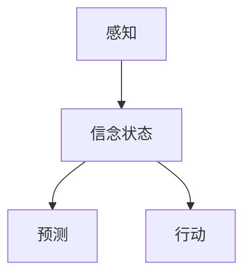
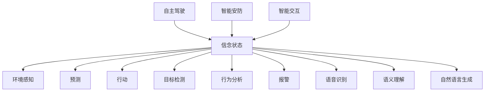
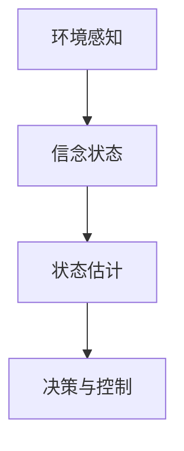
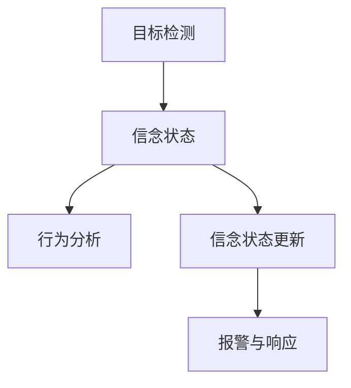
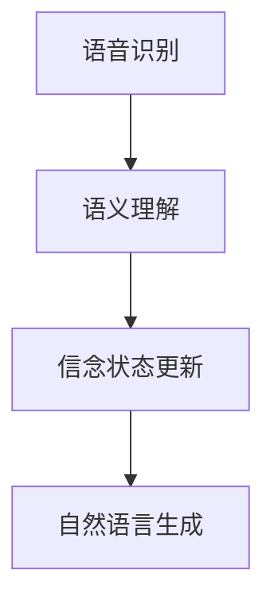
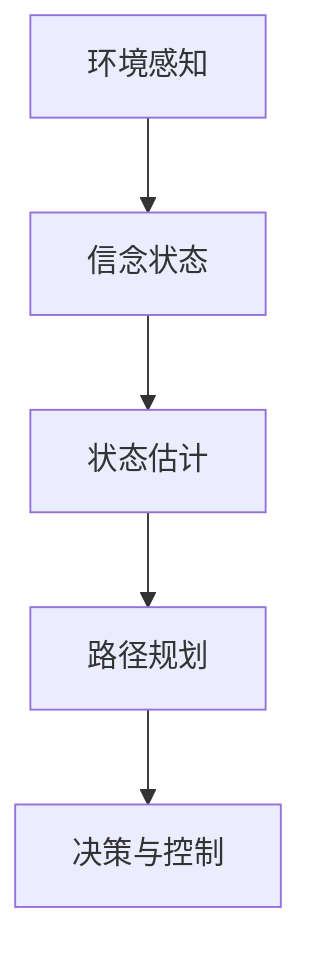
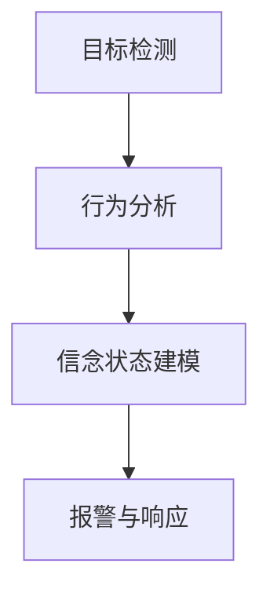

                 

### 文章标题：提升AI环境理解：信念状态的应用

关键词：AI环境理解、信念状态、自主驾驶、智能安防、智能交互、深度学习

摘要：本文旨在探讨信念状态在人工智能（AI）环境理解中的应用，通过对信念状态的理论基础、核心模型以及实际应用场景的详细分析，帮助读者全面理解信念状态在提升AI环境理解中的作用和重要性。文章将分章节介绍信念状态的基本概念、模型及其在自主驾驶、智能安防和智能交互中的应用，并展望信念状态在AI环境理解中的未来发展趋势。

### 第1章：信念状态概述

#### 1.1 信念状态的基本概念

信念状态是人工智能领域中一个重要的概念，它代表了智能体在特定时刻对环境的信念和知识。具体来说，信念状态是一组概率分布，用于描述智能体对其感知到的环境状态的信念。

**核心概念与联系**：

信念状态与以下AI核心概念紧密相关：

1. **感知**：智能体通过传感器获取外界信息。
2. **预测**：智能体根据当前信念状态预测未来可能发生的事件。
3. **行动**：智能体根据当前信念状态和环境目标采取行动。

以下是一个简单的Mermaid流程图，展示了这些核心概念之间的关系：



**示例**：

假设一个自主驾驶汽车在行驶过程中，通过摄像头感知到前方有行人。此时，汽车对前方行人存在的信念状态会非常高，因为它感知到了相关的视觉信息。接着，汽车会根据这一信念状态预测行人的未来行动，如是否即将穿越马路。最后，汽车会根据预测结果采取相应的行动，如减速或转向。

#### 1.2 信念状态的核心原理

信念状态的核心原理是基于概率推理的，特别是贝叶斯推理。贝叶斯推理是一种基于概率的决策过程，通过更新先验概率来获得后验概率，从而不断调整对环境的信念。

**核心算法原理讲解**：

信念状态更新可以通过以下伪代码表示：

```python
def update_belief_state(Old_belief, New_evidence):
    P_evidence = P(New_evidence|Old_belief)
    P_belief = P(Old_belief)
    New_belief = (P_evidence * P_belief) / P_evidence
    return New_belief
```

**示例**：

假设一个智能安防系统在监控到异常行为时，其信念状态会更新为更高程度的警觉。例如，当监控摄像头捕捉到一个不明物体在夜间移动时，系统会更新其信念状态，认为有潜在的安全威胁。

#### 1.3 信念状态的应用场景

信念状态在AI中的应用场景非常广泛，主要包括以下领域：

1. **自主驾驶**：智能车辆需要通过信念状态来理解周围环境，进行安全的驾驶决策。
2. **智能安防**：监控系统需要通过信念状态来识别潜在的安全威胁，并采取相应的措施。
3. **智能交互**：智能助手需要通过信念状态来理解用户的需求，提供个性化的服务。

以下是一个简单的Mermaid流程图，展示了信念状态在不同应用场景中的角色：



通过上述章节，我们初步了解了信念状态的基本概念、核心原理和应用场景。接下来，我们将进一步探讨信念状态在不同模型中的应用。

### 第2章：信念状态模型

#### 2.1 基于贝叶斯网络的信念状态模型

贝叶斯网络是一种基于概率的图模型，它能够表示一组变量之间的依赖关系。在信念状态的应用中，贝叶斯网络可以用来建模智能体对环境的信念。

**核心算法原理讲解**：

贝叶斯网络的构建过程如下：

1. **变量定义**：定义一组变量，表示环境中的不同状态。
2. **条件概率表**：根据先验知识，构建每个变量与其父变量之间的条件概率表。
3. **推理**：通过贝叶斯推理，更新信念状态。

以下是一个简单的贝叶斯网络伪代码示例：

```python
def bayes_network“Inference”(evidence):
    P = initialize_belief_state()
    for variable in evidence:
        P = update_belief_state(P, variable)
    return P
```

**示例**：

假设我们有一个简单的贝叶斯网络，用于表示天气、雨伞和出门之间的关系。根据先验知识，我们可以构建如下条件概率表：

| 天气 | 雨伞 | 出门 |
| ---- | ---- | ---- |
| 晴朗 | 否 | 是 |
| 晴朗 | 是 | 否 |
| 阴天 | 否 | 是 |
| 阴天 | 是 | 是 |

给定证据“今天阴天”，我们可以使用贝叶斯网络更新信念状态，预测出门时带伞的概率。

#### 2.2 基于马尔可夫模型的信念状态模型

马尔可夫模型是一种基于状态的模型，它能够描述状态之间的转移概率。在信念状态的应用中，马尔可夫模型可以用来建模智能体在环境中的状态转移。

**核心算法原理讲解**：

马尔可夫模型的构建过程如下：

1. **状态定义**：定义一组状态，表示智能体在环境中的不同状态。
2. **状态转移矩阵**：根据先验知识，构建状态转移矩阵，表示不同状态之间的转移概率。
3. **推理**：通过状态转移矩阵，更新信念状态。

以下是一个简单的马尔可夫模型伪代码示例：

```python
def markov_model“Inference”(current_state, transition_matrix):
    next_state = sample(transition_matrix[current_state])
    return next_state
```

**示例**：

假设我们有一个简单的马尔可夫模型，用于表示智能体在教室中的状态转移。根据先验知识，我们可以构建如下状态转移矩阵：

| 当前状态 | 下课 | 上课 |
| ---- | ---- | ---- |
| 下课 | 0.6 | 0.4 |
| 上课 | 0.2 | 0.8 |

给定当前状态“上课”，我们可以使用马尔可夫模型预测下一状态。

#### 2.3 基于深度学习的信念状态模型

深度学习是一种基于神经网络的学习方法，它能够通过大量数据自动学习复杂的函数映射。在信念状态的应用中，深度学习可以用来建模智能体对环境的信念。

**核心算法原理讲解**：

深度学习模型通常包括以下几个部分：

1. **输入层**：接收外部输入，如传感器数据。
2. **隐藏层**：通过非线性变换，提取输入的特征。
3. **输出层**：生成信念状态。

以下是一个简单的深度学习模型伪代码示例：

```python
def deep_learning“Inference”(inputs):
    hidden_layer = nonlinear_transform(inputs)
    belief_state = output_layer(hidden_layer)
    return belief_state
```

**示例**：

假设我们有一个深度学习模型，用于表示自主驾驶车辆对周围环境的信念状态。该模型通过摄像头捕捉到的图像作为输入，通过多层卷积神经网络提取特征，最终生成信念状态。

通过上述章节，我们了解了信念状态的不同模型，包括贝叶斯网络、马尔可夫模型和深度学习模型。这些模型在信念状态的应用中发挥着重要作用，为智能体提供了有效的环境理解能力。

### 第3章：信念状态在AI环境理解中的应用

#### 3.1 信念状态在自主驾驶中的应用

自主驾驶是人工智能领域的一个重要应用方向，它涉及到对周围环境的全面理解和实时决策。信念状态在自主驾驶中扮演着至关重要的角色，它帮助智能车辆理解环境，做出合理的驾驶决策。

**核心概念与联系**：

在自主驾驶中，信念状态的核心概念包括：

1. **环境感知**：通过传感器（如摄像头、雷达、激光雷达）获取周围环境信息。
2. **状态估计**：根据感知信息，使用信念状态对车辆周围环境进行状态估计。
3. **决策与控制**：根据信念状态和环境目标，进行驾驶决策和车辆控制。

以下是一个简单的Mermaid流程图，展示了信念状态在自主驾驶中的应用：



**项目实战**：

一个典型的自主驾驶项目包括以下几个步骤：

1. **环境感知**：使用摄像头、雷达和激光雷达等传感器获取周围环境信息，如道路、车辆、行人等。
2. **特征提取**：从感知数据中提取关键特征，如车辆位置、速度、行人行为等。
3. **信念状态建模**：使用深度学习模型（如卷积神经网络）对特征进行建模，生成信念状态。
4. **状态估计**：根据信念状态，使用贝叶斯推理或其他算法对车辆周围环境进行状态估计。
5. **决策与控制**：根据状态估计结果，进行驾驶决策（如加速、减速、转向）和车辆控制。

**案例分析与代码解读**：

假设我们有一个自主驾驶车辆，它在行驶过程中需要根据周围环境进行驾驶决策。以下是一个简单的示例代码，展示了如何使用信念状态进行自主驾驶：

```python
# 假设我们有一个深度学习模型，用于生成信念状态
belief_model = DeepBeliefNetwork(input_shape=(784,), hidden_layers=[500], output_shape=1)

# 假设我们有一个感知系统，用于获取周围环境信息
perception_system = PerceptionSystem()

# 假设我们有一个决策系统，用于根据信念状态进行驾驶决策
decision_system = DecisionSystem()

# 车辆开始行驶
while driving:
    # 获取周围环境信息
    environment_data = perception_system.get_environment_data()

    # 使用深度学习模型生成信念状态
    belief_state = belief_model.infer(environment_data)

    # 根据信念状态进行驾驶决策
    driving_action = decision_system.make_decision(belief_state)

    # 执行驾驶决策
    vehicle_control(driving_action)

    # 更新环境信息
    environment_data = perception_system.get_environment_data()

    # 更新信念状态
    belief_state = belief_model.update(belief_state, environment_data)

    # 检查是否需要继续行驶
    if not continue_driving:
        break

# 结束驾驶
```

通过上述代码，我们可以看到信念状态在自主驾驶中的应用。信念状态通过环境感知和深度学习模型生成，然后用于决策系统进行驾驶决策，最终实现自主驾驶。

**项目小结**：

信念状态在自主驾驶中的应用，为智能车辆提供了对周围环境的全面理解和实时决策能力。通过深度学习模型和贝叶斯推理等技术，信念状态能够有效地更新和预测，为自主驾驶提供可靠的数据支持。未来，随着技术的不断发展，信念状态在自主驾驶中的应用将更加广泛和深入。

### 3.2 信念状态在智能安防中的应用

智能安防是人工智能在公共安全领域的重要应用，它通过传感器、摄像头和其他监测设备对环境进行实时监控，并利用信念状态进行威胁识别和预警。信念状态在智能安防中发挥着关键作用，它帮助系统理解环境中的潜在威胁，做出及时的反应。

**核心概念与联系**：

在智能安防中，信念状态的核心概念包括：

1. **目标检测**：通过摄像头等传感器检测环境中的目标，如可疑人物或异常活动。
2. **行为分析**：对检测到的目标进行行为分析，识别其意图和状态。
3. **信念状态更新**：根据目标检测和行为分析结果，更新信念状态，评估潜在威胁的严重程度。
4. **报警与响应**：当信念状态表明有潜在威胁时，触发报警并启动相应的响应措施。

以下是一个简单的Mermaid流程图，展示了信念状态在智能安防中的应用：



**项目实战**：

一个典型的智能安防项目包括以下几个步骤：

1. **目标检测**：使用深度学习模型（如卷积神经网络）对摄像头捕捉到的图像进行目标检测，识别出环境中的可疑目标。
2. **特征提取**：从目标检测数据中提取关键特征，如目标的位置、速度、动作等。
3. **信念状态建模**：使用深度学习模型对特征进行建模，生成信念状态，表示目标的潜在威胁程度。
4. **行为分析**：根据信念状态，对目标的行为进行分析，识别其可能的意图。
5. **信念状态更新**：根据目标检测和行为分析结果，更新信念状态，评估潜在威胁的严重程度。
6. **报警与响应**：当信念状态表明有潜在威胁时，触发报警，并启动相应的响应措施，如通知安保人员或启动应急设备。

**案例分析与代码解读**：

假设我们有一个智能安防系统，它通过摄像头监控一个公共场所，并使用信念状态进行威胁识别和预警。以下是一个简单的示例代码，展示了如何使用信念状态进行智能安防：

```python
# 假设我们有一个目标检测模型，用于检测摄像头捕捉到的图像中的目标
detection_model = ObjectDetectionModel()

# 假设我们有一个行为分析模型，用于分析目标的意图
behavior_analysis_model = BehaviorAnalysisModel()

# 假设我们有一个信念状态模型，用于生成信念状态
belief_state_model = BeliefStateModel()

# 系统开始监控
while monitoring:
    # 检测摄像头捕捉到的图像中的目标
    detected_objects = detection_model.detect(captured_image)

    # 对每个目标进行行为分析
    for object in detected_objects:
        behavior = behavior_analysis_model.analyze(object)

        # 生成信念状态
        belief_state = belief_state_model.infer(object, behavior)

        # 更新信念状态
        updated_belief_state = belief_state_model.update(belief_state, object, behavior)

        # 检查是否有潜在威胁
        if updated_belief_state.threat_level > threshold:
            # 触发报警
            alarm_triggered = True
            # 启动响应措施
            response_started = start_response()

    # 更新摄像头图像
    captured_image = camera.capture()

    # 检查是否需要继续监控
    if not continue_monitoring:
        break

# 结束监控
```

通过上述代码，我们可以看到信念状态在智能安防中的应用。信念状态通过目标检测和行为分析模型生成，然后用于更新和评估潜在威胁的严重程度。当信念状态达到一定阈值时，系统会触发报警并启动相应的响应措施。

**项目小结**：

信念状态在智能安防中的应用，为系统提供了对潜在威胁的实时监控和响应能力。通过深度学习模型和信念状态更新算法，系统能够有效地识别和评估威胁，提高公共安全水平。未来，随着技术的不断发展，信念状态在智能安防中的应用将更加广泛和深入。

### 3.3 信念状态在智能交互中的应用

智能交互是人工智能在用户体验和交互体验方面的重要应用，它通过自然语言处理、语音识别和语义理解等技术，实现人与智能系统之间的有效沟通。信念状态在智能交互中发挥着关键作用，它帮助系统理解用户的需求和意图，提供个性化的服务和响应。

**核心概念与联系**：

在智能交互中，信念状态的核心概念包括：

1. **语音识别**：将用户的语音输入转换为文本，提取关键信息。
2. **语义理解**：根据语音输入的文本，理解用户的意图和需求。
3. **信念状态更新**：根据语音识别和语义理解的结果，更新信念状态，表示用户当前的状态和需求。
4. **自然语言生成**：根据信念状态，生成自然的语言响应，与用户进行交互。

以下是一个简单的Mermaid流程图，展示了信念状态在智能交互中的应用：



**项目实战**：

一个典型的智能交互项目包括以下几个步骤：

1. **语音识别**：使用深度学习模型（如循环神经网络）将用户的语音输入转换为文本，提取关键信息。
2. **语义理解**：使用自然语言处理技术（如词向量、实体识别、关系抽取）理解用户的意图和需求。
3. **信念状态建模**：使用深度学习模型（如卷积神经网络）对语义理解的结果进行建模，生成信念状态。
4. **自然语言生成**：根据信念状态，生成自然的语言响应，与用户进行交互。
5. **交互优化**：根据用户的反馈和行为，不断优化信念状态模型和自然语言生成模型。

**案例分析与代码解读**：

假设我们有一个智能交互系统，它通过语音识别和语义理解与用户进行交互。以下是一个简单的示例代码，展示了如何使用信念状态进行智能交互：

```python
# 假设我们有一个语音识别模型，用于将用户的语音输入转换为文本
speech_recognition_model = SpeechRecognitionModel()

# 假设我们有一个语义理解模型，用于理解用户的意图和需求
semantic_understanding_model = SemanticUnderstandingModel()

# 假设我们有一个信念状态模型，用于生成信念状态
belief_state_model = BeliefStateModel()

# 假设我们有一个自然语言生成模型，用于生成自然的语言响应
natural_language_generation_model = NaturalLanguageGenerationModel()

# 系统开始交互
while interacting:
    # 识别用户的语音输入
    user_speech = speech_recognition_model.recognize(speech_input)

    # 理解用户的意图和需求
    user_intent = semantic_understanding_model_UNDERSTAND(user_speech)

    # 生成信念状态
    belief_state = belief_state_model.infer(user_intent)

    # 生成自然的语言响应
    response = natural_language_generation_model.generate_response(belief_state)

    # 输出响应
    print(response)

    # 获取用户的反馈
    user_feedback = input("您的反馈：")

    # 更新信念状态
    belief_state = belief_state_model.update(belief_state, user_feedback)

    # 检查是否需要继续交互
    if not continue_interacting:
        break

# 结束交互
```

通过上述代码，我们可以看到信念状态在智能交互中的应用。信念状态通过语音识别和语义理解模型生成，然后用于生成自然的语言响应，与用户进行交互。用户的反馈会不断更新信念状态，从而优化交互过程。

**项目小结**：

信念状态在智能交互中的应用，为系统提供了对用户需求的深入理解和个性化服务的能力。通过深度学习模型和信念状态更新算法，系统能够有效地理解用户的意图和需求，提供高质量的交互体验。未来，随着技术的不断发展，信念状态在智能交互中的应用将更加广泛和深入。

### 第4章：自主驾驶中的信念状态应用

#### 4.1 自主驾驶系统概述

自主驾驶系统是人工智能在交通运输领域的重要应用，它通过传感器、计算机视觉和深度学习等技术，使车辆能够自主感知环境、规划路径和执行驾驶任务。信念状态作为自主驾驶系统的核心组成部分，对车辆的环境理解和决策起着至关重要的作用。

**核心概念与联系**：

自主驾驶系统的核心概念包括：

1. **环境感知**：通过传感器获取周围环境的信息，如道路、交通标志、车辆和行人等。
2. **状态估计**：使用信念状态对车辆周围环境进行状态估计，包括车辆的位置、速度和周围物体的运动状态。
3. **路径规划**：根据状态估计结果，规划车辆的未来路径，确保安全行驶。
4. **决策与控制**：根据路径规划结果，执行驾驶决策和车辆控制，如加速、减速和转向。

以下是一个简单的Mermaid流程图，展示了信念状态在自主驾驶系统中的应用：



**项目实战**：

一个典型的自主驾驶项目通常包括以下几个步骤：

1. **环境感知**：使用摄像头、雷达、激光雷达等多种传感器获取周围环境的信息。这些传感器能够实时提供道路、交通标志、车辆和行人的位置、速度和方向等信息。
2. **特征提取**：从感知数据中提取关键特征，如车辆的位置、速度、道路的形状和宽度等。这些特征将用于训练深度学习模型，生成信念状态。
3. **信念状态建模**：使用深度学习模型（如卷积神经网络）对提取的特征进行建模，生成信念状态。信念状态代表了车辆对周围环境的信念，包括车辆的位置、速度和周围物体的状态等。
4. **状态估计**：使用信念状态进行状态估计，更新车辆的状态。状态估计包括车辆的当前位置、速度和方向等。
5. **路径规划**：根据状态估计结果，使用路径规划算法（如A*算法、Dijkstra算法）规划车辆的未来路径。路径规划的目标是确保车辆安全行驶，避开障碍物，到达目的地。
6. **决策与控制**：根据路径规划结果，执行驾驶决策和车辆控制。驾驶决策包括加速、减速、转向和制动等。车辆控制系统根据决策结果控制车辆的运动状态。

**案例分析与代码解读**：

假设我们有一个自主驾驶车辆，它在行驶过程中需要根据周围环境进行状态估计和路径规划。以下是一个简单的示例代码，展示了如何使用信念状态进行自主驾驶：

```python
# 假设我们有一个感知系统，用于获取周围环境信息
perception_system = PerceptionSystem()

# 假设我们有一个信念状态模型，用于生成信念状态
belief_state_model = BeliefStateModel()

# 假设我们有一个路径规划模型，用于规划车辆路径
path_planning_model = PathPlanningModel()

# 假设我们有一个决策系统，用于根据信念状态进行驾驶决策
decision_system = DecisionSystem()

# 车辆开始行驶
while driving:
    # 获取周围环境信息
    environment_data = perception_system.get_environment_data()

    # 使用信念状态模型生成信念状态
    belief_state = belief_state_model.infer(environment_data)

    # 更新信念状态
    updated_belief_state = belief_state_model.update(belief_state, environment_data)

    # 根据信念状态进行路径规划
    path = path_planning_model.plan(updated_belief_state)

    # 根据路径规划结果进行驾驶决策
    driving_action = decision_system.make_decision(path)

    # 执行驾驶决策
    vehicle_control(driving_action)

    # 更新环境信息
    environment_data = perception_system.get_environment_data()

    # 更新信念状态
    belief_state = belief_state_model.update(belief_state, environment_data)

    # 检查是否需要继续行驶
    if not continue_driving:
        break

# 结束驾驶
```

通过上述代码，我们可以看到信念状态在自主驾驶中的应用。信念状态通过感知系统获取周围环境信息，使用深度学习模型生成和更新。然后，信念状态用于路径规划和驾驶决策，确保车辆安全、高效地行驶。

**项目小结**：

自主驾驶中的信念状态应用为车辆提供了对周围环境的全面理解和实时决策能力。通过深度学习模型和信念状态更新算法，车辆能够有效地感知环境、规划路径和执行驾驶任务。未来，随着技术的不断发展，信念状态在自主驾驶中的应用将更加广泛和深入，为交通运输领域带来巨大的变革。

### 4.2 信念状态在自主驾驶中的实现

在自主驾驶系统中，信念状态是实现车辆环境理解与决策的关键。以下将详细阐述信念状态在自主驾驶中的实现过程，包括环境感知、状态估计、路径规划和驾驶决策等环节。

**环境感知**

环境感知是自主驾驶系统的第一步，主要通过传感器收集道路、车辆、行人和其他环境信息。常见的传感器包括摄像头、雷达、激光雷达（LIDAR）和超声波传感器。这些传感器提供的原始数据经过预处理后，可以提取出有用的特征，如车道线、障碍物、交通标志和行人等。

```python
# 示例：使用摄像头进行环境感知
def get_environment_data(camera):
    # 捕获图像
    image = camera.capture()
    # 预处理图像
    processed_image = preprocess_image(image)
    # 提取特征
    features = extract_features(processed_image)
    return features
```

**状态估计**

状态估计是基于信念状态的核心步骤，通过融合感知数据和历史状态，对车辆的当前位置、速度和周围环境进行实时估计。常用的方法包括扩展卡尔曼滤波（EKF）、粒子滤波（PF）和贝叶斯滤波等。

```python
# 示例：使用扩展卡尔曼滤波进行状态估计
def state_estimation(belief_state, observation):
    # 预测状态
    predicted_state = predict_state(belief_state)
    # 更新状态
    updated_state = update_state(predicted_state, observation)
    return updated_state
```

**路径规划**

路径规划是基于状态估计的结果，为车辆规划一条从当前到目的地的最优路径。常用的算法包括A*算法、Dijkstra算法和基于采样的RRT算法等。路径规划需要考虑障碍物、交通规则和驾驶场景等多种因素。

```python
# 示例：使用A*算法进行路径规划
def path_planning(current_state, goal_state, environment):
    # 构建搜索图
    search_graph = build_search_graph(current_state, goal_state, environment)
    # 搜索最优路径
    path = a_star_search(search_graph)
    return path
```

**驾驶决策**

驾驶决策是基于路径规划结果，确定车辆的速度、转向和制动等控制指令。驾驶决策需要考虑车辆的动力学特性、道路状况和周围环境等因素，确保车辆安全、高效地行驶。

```python
# 示例：根据路径规划结果进行驾驶决策
def driving_decision(path):
    # 初始化决策变量
    control_command = ControlCommand()
    # 遍历路径，生成控制指令
    for point in path:
        control_command.accelerate(point.acceleration)
        control_command.steer(point.steer_angle)
        control_command.b brake(point.braking)
    return control_command
```

**代码解读与案例分析**

以下是一个简单的自主驾驶实现示例，展示了信念状态在不同环节中的应用：

```python
# 假设我们有一个感知系统，用于获取周围环境信息
perception_system = PerceptionSystem()

# 假设我们有一个信念状态模型，用于生成信念状态
belief_state_model = BeliefStateModel()

# 假设我们有一个路径规划模型，用于规划车辆路径
path_planning_model = PathPlanningModel()

# 假设我们有一个决策系统，用于根据信念状态进行驾驶决策
decision_system = DecisionSystem()

# 车辆开始行驶
while driving:
    # 获取周围环境信息
    environment_data = perception_system.get_environment_data()

    # 使用信念状态模型生成信念状态
    belief_state = belief_state_model.infer(environment_data)

    # 更新信念状态
    updated_belief_state = belief_state_model.update(belief_state, environment_data)

    # 根据信念状态进行路径规划
    path = path_planning_model.plan(updated_belief_state)

    # 根据路径规划结果进行驾驶决策
    driving_action = decision_system.make_decision(path)

    # 执行驾驶决策
    vehicle_control(driving_action)

    # 更新环境信息
    environment_data = perception_system.get_environment_data()

    # 更新信念状态
    belief_state = belief_state_model.update(belief_state, environment_data)

    # 检查是否需要继续行驶
    if not continue_driving:
        break

# 结束驾驶
```

通过上述代码，我们可以看到信念状态在自主驾驶系统中的实现过程。感知系统获取环境信息，信念状态模型生成和更新信念状态，路径规划模型规划车辆路径，决策系统根据信念状态进行驾驶决策，最终实现自主驾驶。

**项目小结**

信念状态在自主驾驶中的实现，为车辆提供了对周围环境的全面理解和实时决策能力。通过感知系统、信念状态模型和路径规划模型等组成部分，车辆能够有效地感知环境、规划路径和执行驾驶任务。未来，随着技术的不断发展，信念状态在自主驾驶中的应用将更加深入和广泛，推动交通运输领域的智能化变革。

### 第5章：智能安防中的信念状态应用

#### 5.1 智能安防系统概述

智能安防系统是利用人工智能技术，通过传感器、摄像头和其他监测设备，实现对公共安全领域的实时监控、威胁检测和预警。信念状态在智能安防系统中起着关键作用，它通过不断更新的信念状态，帮助系统识别潜在的安全威胁，并采取相应的防范措施。

**核心概念与联系**：

在智能安防系统中，信念状态的核心概念包括：

1. **目标检测**：通过摄像头等传感器，实时检测环境中的目标，如可疑人物或异常行为。
2. **行为分析**：对检测到的目标进行行为分析，识别其行为模式，如是否具有潜在威胁。
3. **信念状态建模**：根据目标检测和行为分析结果，构建信念状态模型，表示目标的潜在威胁程度。
4. **报警与响应**：当信念状态达到一定阈值时，触发报警，并启动相应的响应措施，如通知安保人员或启动应急设备。

以下是一个简单的Mermaid流程图，展示了信念状态在智能安防系统中的应用：



**项目实战**：

一个典型的智能安防项目通常包括以下几个步骤：

1. **目标检测**：使用深度学习模型（如卷积神经网络）对摄像头捕捉到的图像进行目标检测，识别出环境中的可疑目标。
2. **特征提取**：从目标检测数据中提取关键特征，如目标的位置、速度、方向等。
3. **行为分析**：使用自然语言处理和计算机视觉技术，对目标的行为进行分析，识别其意图和状态。
4. **信念状态建模**：使用深度学习模型（如循环神经网络）对提取的特征进行建模，生成信念状态，表示目标的潜在威胁程度。
5. **报警与响应**：当信念状态达到一定阈值时，触发报警，并启动相应的响应措施，如通知安保人员或启动应急设备。

**案例分析与代码解读**：

假设我们有一个智能安防系统，它通过摄像头监控一个公共场所，并使用信念状态进行威胁检测和报警。以下是一个简单的示例代码，展示了如何使用信念状态进行智能安防：

```python
# 假设我们有一个目标检测模型，用于检测摄像头捕捉到的图像中的目标
detection_model = ObjectDetectionModel()

# 假设我们有一个行为分析模型，用于分析目标的意图
behavior_analysis_model = BehaviorAnalysisModel()

# 假设我们有一个信念状态模型，用于生成信念状态
belief_state_model = BeliefStateModel()

# 假设我们有一个报警系统，用于触发报警
alarm_system = AlarmSystem()

# 系统开始监控
while monitoring:
    # 检测摄像头捕捉到的图像中的目标
    detected_objects = detection_model.detect(captured_image)

    # 对每个目标进行行为分析
    for object in detected_objects:
        behavior = behavior_analysis_model.analyze(object)

        # 生成信念状态
        belief_state = belief_state_model.infer(object, behavior)

        # 更新信念状态
        updated_belief_state = belief_state_model.update(belief_state, object, behavior)

        # 检查是否有潜在威胁
        if updated_belief_state.threat_level > threshold:
            # 触发报警
            alarm_triggered = True
            # 启动响应措施
            response_started = start_response()

    # 更新摄像头图像
    captured_image = camera.capture()

    # 检查是否需要继续监控
    if not continue_monitoring:
        break

# 结束监控
```

通过上述代码，我们可以看到信念状态在智能安防中的应用。信念状态通过目标检测和行为分析模型生成，然后用于更新和评估潜在威胁的严重程度。当信念状态达到一定阈值时，系统会触发报警并启动相应的响应措施。

**项目小结**：

信念状态在智能安防中的应用，为系统提供了对潜在威胁的实时监控和响应能力。通过深度学习模型和信念状态更新算法，系统能够有效地识别和评估威胁，提高公共安全水平。未来，随着技术的不断发展，信念状态在智能安防中的应用将更加广泛和深入。

### 5.2 信念状态在智能安防中的实现

在智能安防系统中，信念状态是实现实时威胁检测与预警的核心技术。以下将详细阐述信念状态在智能安防中的实现过程，包括目标检测、行为分析、信念状态建模和报警响应等环节。

**目标检测**

目标检测是智能安防系统的第一步，通过摄像头等传感器实时捕捉环境图像，并识别其中的目标。常用的目标检测算法包括卷积神经网络（CNN）、YOLO（You Only Look Once）和Faster R-CNN等。

```python
# 示例：使用Faster R-CNN进行目标检测
def detect_objects(image):
    # 加载预训练模型
    model = load_pretrained_model('faster_rcnn')
    # 预处理图像
    preprocessed_image = preprocess_image(image)
    # 进行目标检测
    detections = model.detect(preprocessed_image)
    return detections
```

**行为分析**

行为分析基于目标检测的结果，对识别出的目标进行行为模式识别。行为分析可以基于规则或深度学习模型，如循环神经网络（RNN）或长短期记忆网络（LSTM）。

```python
# 示例：使用LSTM进行行为分析
def analyze_behavior(detections):
    # 初始化LSTM模型
    model = load_pretrained_model('lstm')
    # 预处理行为数据
    preprocessed_behavior = preprocess_behavior(detections)
    # 进行行为分析
    behavior = model.predict(preprocessed_behavior)
    return behavior
```

**信念状态建模**

信念状态建模是将目标检测和行为分析的结果转化为概率分布，用于表示目标的潜在威胁程度。信念状态建模可以基于贝叶斯网络、马尔可夫模型或深度学习模型。

```python
# 示例：使用贝叶斯网络进行信念状态建模
def build_belief_state(detections, behavior):
    # 初始化贝叶斯网络
    network = build_bayesian_network(detections, behavior)
    # 计算信念状态
    belief_state = network.infer()
    return belief_state
```

**报警响应**

报警响应是信念状态的应用环节，当信念状态达到设定阈值时，系统会触发报警并启动相应的响应措施。报警响应可以包括通知安保人员、启动应急设备或发送警报信息等。

```python
# 示例：触发报警并启动响应措施
def alarm_response(belief_state):
    # 检查信念状态
    if belief_state.threat_level > threshold:
        # 触发报警
        trigger_alarm()
        # 启动响应措施
        start_response_measures()
```

**代码解读与案例分析**

以下是一个简单的智能安防实现示例，展示了信念状态在不同环节中的应用：

```python
# 假设我们有一个目标检测模型，用于检测摄像头捕捉到的图像中的目标
detection_model = ObjectDetectionModel()

# 假设我们有一个行为分析模型，用于分析目标的意图
behavior_analysis_model = BehaviorAnalysisModel()

# 假设我们有一个信念状态模型，用于生成信念状态
belief_state_model = BeliefStateModel()

# 假设我们有一个报警系统，用于触发报警
alarm_system = AlarmSystem()

# 系统开始监控
while monitoring:
    # 检测摄像头捕捉到的图像中的目标
    detected_objects = detection_model.detect(captured_image)

    # 对每个目标进行行为分析
    for object in detected_objects:
        behavior = behavior_analysis_model.analyze(object)

        # 生成信念状态
        belief_state = belief_state_model.infer(object, behavior)

        # 更新信念状态
        updated_belief_state = belief_state_model.update(belief_state, object, behavior)

        # 检查是否有潜在威胁
        if updated_belief_state.threat_level > threshold:
            # 触发报警
            alarm_triggered = True
            # 启动响应措施
            response_started = start_response()

    # 更新摄像头图像
    captured_image = camera.capture()

    # 检查是否需要继续监控
    if not continue_monitoring:
        break

# 结束监控
```

通过上述代码，我们可以看到信念状态在智能安防系统的实现过程。感知系统通过摄像头捕捉图像，目标检测模型检测目标，行为分析模型分析目标行为，信念状态模型生成和更新信念状态。当信念状态达到一定阈值时，报警系统触发报警并启动响应措施。

**项目小结**

信念状态在智能安防中的实现，为系统提供了对潜在威胁的实时检测和预警能力。通过目标检测、行为分析、信念状态建模和报警响应等环节，系统能够有效地识别和应对安全威胁，提高公共安全水平。未来，随着技术的不断发展，信念状态在智能安防中的应用将更加深入和广泛。

### 5.3 信念状态在智能安防中的案例分析

在智能安防领域，信念状态的应用已经取得了显著的成果。以下是几个典型的案例分析，展示了信念状态在智能安防系统中的具体实现和效果。

**案例一：城市监控系统**

某城市安装了大规模的监控摄像头系统，旨在提高公共安全水平。该系统使用了信念状态技术，通过目标检测和行为分析，实时监控城市交通状况和人群行为。

- **目标检测**：使用深度学习模型进行目标检测，能够准确识别车辆、行人、交通标志等。
- **行为分析**：结合摄像头捕捉的视频数据，使用计算机视觉技术进行行为分析，识别异常行为，如闯红灯、违法行为等。
- **信念状态建模**：基于目标检测和行为分析结果，构建信念状态模型，表示潜在威胁的严重程度。
- **报警与响应**：当信念状态达到一定阈值时，系统会触发报警，通知相关部门进行干预。

**效果分析**：

- **提高安全水平**：通过实时监控和报警，有效预防了交通事故和违法行为，提高了公共安全水平。
- **降低人力成本**：减少了人工监控的工作量，降低了人力成本。

**案例二：智能门禁系统**

某大型企业采用了智能门禁系统，通过信念状态技术，实现了对员工和访客的实时身份验证和行踪监控。

- **目标检测**：使用摄像头进行人脸识别，实时检测进入办公区域的员工和访客。
- **行为分析**：结合员工和访客的行为数据，使用自然语言处理技术进行行为分析，识别可疑行为。
- **信念状态建模**：基于目标检测和行为分析结果，构建信念状态模型，表示人员的潜在威胁程度。
- **报警与响应**：当信念状态达到一定阈值时，系统会触发报警，阻止访问或通知安全人员。

**效果分析**：

- **增强安全性**：通过实时身份验证和行为分析，有效防止了未授权访问和内部威胁。
- **优化工作效率**：简化了门禁管理流程，提高了工作效率。

**案例三：智能家居安防系统**

某智能家居安防系统采用了信念状态技术，实现了对家庭环境的实时监控和威胁预警。

- **目标检测**：使用摄像头和传感器检测家庭环境中的异常情况，如非法入侵、火灾等。
- **行为分析**：结合摄像头捕捉的视频数据，使用计算机视觉技术进行行为分析，识别异常行为。
- **信念状态建模**：基于目标检测和行为分析结果，构建信念状态模型，表示家庭环境的潜在威胁程度。
- **报警与响应**：当信念状态达到一定阈值时，系统会触发报警，通知家庭成员或安全人员。

**效果分析**：

- **提高生活质量**：通过实时监控和报警，为家庭成员提供了更加安全的生活环境。
- **降低意外损失**：有效预防了家庭事故和财产损失。

**项目小结**

通过上述案例分析，我们可以看到信念状态在智能安防系统中的实际应用效果。信念状态技术为智能安防系统提供了强大的实时威胁检测和预警能力，有效提高了公共安全和家庭生活的安全性。未来，随着技术的不断进步，信念状态在智能安防中的应用将更加广泛和深入。

### 第6章：智能交互中的信念状态应用

#### 6.1 智能交互系统概述

智能交互系统是人工智能在用户界面和用户体验领域的重要应用，通过自然语言处理、语音识别和语义理解等技术，实现人与智能系统之间的有效沟通。信念状态在智能交互中起着核心作用，它帮助系统理解用户的需求和意图，提供个性化的服务。

**核心概念与联系**：

在智能交互系统中，信念状态的核心概念包括：

1. **语音识别**：将用户的语音输入转换为文本，提取关键信息。
2. **语义理解**：根据语音输入的文本，理解用户的意图和需求。
3. **信念状态更新**：根据语音识别和语义理解的结果，更新信念状态，表示用户当前的状态和需求。
4. **自然语言生成**：根据信念状态，生成自然的语言响应，与用户进行交互。

以下是一个简单的Mermaid流程图，展示了信念状态在智能交互系统中的应用：


**项目实战**：

一个典型的智能交互项目通常包括以下几个步骤：

1. **语音识别**：使用深度学习模型（如循环神经网络）将用户的语音输入转换为文本，提取关键信息。
2. **语义理解**：使用自然语言处理技术（如词向量、实体识别、关系抽取）理解用户的意图和需求。
3. **信念状态建模**：使用深度学习模型（如卷积神经网络）对语义理解的结果进行建模，生成信念状态。
4. **自然语言生成**：根据信念状态，生成自然的语言响应，与用户进行交互。
5. **交互优化**：根据用户的反馈和行为，不断优化信念状态模型和自然语言生成模型。

**案例分析与代码解读**：

假设我们有一个智能交互系统，它通过语音识别和语义理解与用户进行交互。以下是一个简单的示例代码，展示了如何使用信念状态进行智能交互：

```python
# 假设我们有一个语音识别模型，用于将用户的语音输入转换为文本
speech_recognition_model = SpeechRecognitionModel()

# 假设我们有一个语义理解模型，用于理解用户的意图和需求
semantic_understanding_model = SemanticUnderstandingModel()

# 假设我们有一个信念状态模型，用于生成信念状态
belief_state_model = BeliefStateModel()

# 假设我们有一个自然语言生成模型，用于生成自然的语言响应
natural_language_generation_model = NaturalLanguageGenerationModel()

# 系统开始交互
while interacting:
    # 识别用户的语音输入
    user_speech = speech_recognition_model.recognize(speech_input)

    # 理解用户的意图和需求
    user_intent = semantic_understanding_model_UNDERSTAND(user_speech)

    # 生成信念状态
    belief_state = belief_state_model.infer(user_intent)

    # 更新信念状态
    updated_belief_state = belief_state_model.update(belief_state, user_intent)

    # 生成自然的语言响应
    response = natural_language_generation_model.generate_response(updated_belief_state)

    # 输出响应
    print(response)

    # 获取用户的反馈
    user_feedback = input("您的反馈：")

    # 更新信念状态
    belief_state = belief_state_model.update(belief_state, user_feedback)

    # 检查是否需要继续交互
    if not continue_interacting:
        break

# 结束交互
```

通过上述代码，我们可以看到信念状态在智能交互中的应用。信念状态通过语音识别和语义理解模型生成，然后用于生成自然的语言响应，与用户进行交互。用户的反馈会不断更新信念状态，从而优化交互过程。

**项目小结**：

信念状态在智能交互中的应用，为系统提供了对用户需求的深入理解和个性化服务的能力。通过深度学习模型和信念状态更新算法，系统能够有效地理解用户的意图和需求，提供高质量的交互体验。未来，随着技术的不断发展，信念状态在智能交互中的应用将更加广泛和深入。

### 6.2 信念状态在智能交互中的实现

在智能交互系统中，信念状态是实现人机对话和理解用户需求的关键技术。以下将详细阐述信念状态在智能交互系统中的实现过程，包括语音识别、语义理解、信念状态建模和自然语言生成等环节。

**语音识别**

语音识别是将用户的语音输入转换为文本的过程。这个过程通常涉及预处理、特征提取和深度学习模型训练。常用的语音识别模型包括循环神经网络（RNN）、卷积神经网络（CNN）和长短期记忆网络（LSTM）等。

```python
# 示例：使用RNN进行语音识别
def recognize_speech(audio_signal):
    # 预处理音频信号
    preprocessed_audio = preprocess_audio(audio_signal)
    # 特征提取
    features = extract_features(preprocessed_audio)
    # 使用RNN模型进行识别
    recognized_text = rnn_model.predict(features)
    return recognized_text
```

**语义理解**

语义理解是将文本转换为具体意图和需求的过程。这个过程通常涉及词向量、实体识别、关系抽取和意图分类等步骤。常用的语义理解模型包括卷积神经网络（CNN）、循环神经网络（RNN）和转移依存句法分析（TDMA）等。

```python
# 示例：使用RNN进行语义理解
def understand_semantics(text):
    # 使用RNN模型进行语义理解
    intent = rnn_model_semantics.predict(text)
    entities = extract_entities(text)
    return intent, entities
```

**信念状态建模**

信念状态建模是将语义理解的结果转化为概率分布的过程，用于表示用户的需求和意图。这个过程通常涉及深度学习模型和信念状态更新算法。常用的信念状态建模模型包括卷积神经网络（CNN）、循环神经网络（RNN）和贝叶斯网络等。

```python
# 示例：使用CNN进行信念状态建模
def build_belief_state(semantic_output):
    # 预处理语义输出
    preprocessed_output = preprocess_semantics(semantic_output)
    # 使用CNN模型进行信念状态建模
    belief_state = cnn_model_belief_state.predict(preprocessed_output)
    return belief_state
```

**自然语言生成**

自然语言生成是将信念状态转换为自然语言响应的过程。这个过程通常涉及语言模型、文本生成算法和自然语言生成模型。常用的自然语言生成模型包括生成对抗网络（GAN）、循环神经网络（RNN）和注意力机制等。

```python
# 示例：使用RNN进行自然语言生成
def generate_response(belief_state):
    # 使用RNN模型进行自然语言生成
    response = rnn_model_response.predict(belief_state)
    return response
```

**代码解读与案例分析**

以下是一个简单的智能交互实现示例，展示了信念状态在不同环节中的应用：

```python
# 假设我们有一个语音识别模型，用于将用户的语音输入转换为文本
speech_recognition_model = SpeechRecognitionModel()

# 假设我们有一个语义理解模型，用于理解用户的意图和需求
semantic_understanding_model = SemanticUnderstandingModel()

# 假设我们有一个信念状态模型，用于生成信念状态
belief_state_model = BeliefStateModel()

# 假设我们有一个自然语言生成模型，用于生成自然的语言响应
natural_language_generation_model = NaturalLanguageGenerationModel()

# 系统开始交互
while interacting:
    # 识别用户的语音输入
    user_speech = speech_recognition_model.recognize(speech_input)

    # 理解用户的意图和需求
    user_intent, entities = semantic_understanding_modelUNDERSTAND(user_speech)

    # 生成信念状态
    belief_state = belief_state_model.infer(user_intent, entities)

    # 更新信念状态
    updated_belief_state = belief_state_model.update(belief_state, user_intent, entities)

    # 生成自然的语言响应
    response = natural_language_generation_model.generate_response(updated_belief_state)

    # 输出响应
    print(response)

    # 获取用户的反馈
    user_feedback = input("您的反馈：")

    # 更新信念状态
    belief_state = belief_state_model.update(belief_state, user_feedback)

    # 检查是否需要继续交互
    if not continue_interacting:
        break

# 结束交互
```

通过上述代码，我们可以看到信念状态在智能交互系统中的实现过程。语音识别模型将用户的语音输入转换为文本，语义理解模型理解用户的意图和需求，信念状态模型生成和更新信念状态，自然语言生成模型生成自然的语言响应，从而实现智能交互。

**项目小结**

信念状态在智能交互中的实现，为系统提供了对用户需求的深入理解和个性化服务的能力。通过语音识别、语义理解、信念状态建模和自然语言生成等环节，系统能够有效地理解用户的意图和需求，提供高质量的交互体验。未来，随着技术的不断发展，信念状态在智能交互中的应用将更加深入和广泛。

### 第7章：信念状态在AI环境理解中的未来发展趋势

#### 7.1 信念状态在AI环境理解中的挑战与机遇

随着人工智能技术的快速发展，信念状态在AI环境理解中的应用面临着许多挑战和机遇。以下将探讨这些挑战和机遇，并展望信念状态在AI环境理解中的未来发展方向。

**挑战**：

1. **数据质量和数量**：信念状态的有效性依赖于高质量、丰富的数据。然而，实际应用中，获取此类数据往往困难且昂贵。
2. **实时处理能力**：在高速动态环境中，信念状态需要实时更新和处理，这对计算资源提出了高要求。
3. **跨模态融合**：在实际应用中，信念状态需要整合来自多种传感器和模态的数据，实现有效的跨模态融合是一个挑战。
4. **鲁棒性和泛化能力**：信念状态模型需要具有鲁棒性，能够应对不同场景和数据噪声，同时具备良好的泛化能力。

**机遇**：

1. **深度学习技术的进步**：随着深度学习技术的不断发展，信念状态模型将能够更好地学习复杂的概率分布和模式，提高环境理解的准确性。
2. **多模态传感器的发展**：新型传感器和传感技术的出现，将提供更多维度的环境信息，有助于提升信念状态模型的能力。
3. **边缘计算和云计算的融合**：边缘计算和云计算的结合，将提供更高效、实时的数据处理能力，满足信念状态模型的高性能需求。
4. **跨领域应用**：信念状态技术不仅在自动驾驶、智能安防和智能交互等领域有广泛应用，未来还可能在医疗、农业、教育等多个领域展现巨大潜力。

#### 7.2 信念状态在AI环境理解中的未来方向

基于当前的挑战和机遇，以下是一些信念状态在AI环境理解中的未来发展方向：

1. **多模态融合**：通过结合多种传感器和模态的数据，如视觉、听觉、触觉和惯性传感器等，提升信念状态模型的感知能力和环境理解能力。
2. **迁移学习和少样本学习**：利用迁移学习和少样本学习技术，从少量样本中快速构建高精度的信念状态模型，降低数据获取成本。
3. **强化学习与信念状态的结合**：将强化学习与信念状态模型相结合，实现更加智能和自适应的决策过程，提高AI系统的环境适应能力。
4. **可解释性和透明度**：开发可解释性高的信念状态模型，使得模型决策过程更加透明，提高用户对AI系统的信任。
5. **跨领域应用研究**：探索信念状态在不同领域的应用，如医疗诊断、农业监测、环境保护等，推动AI技术的跨领域发展。

#### 7.3 信念状态在AI环境理解中的创新应用场景

未来，随着技术的不断进步，信念状态在AI环境理解中将会出现许多创新应用场景：

1. **智慧城市建设**：利用信念状态技术，实现城市交通、环境监测和公共安全的智能化管理，提高城市运行效率和居民生活质量。
2. **智能医疗系统**：通过信念状态技术，实现对患者健康状态的实时监控和预测，提供个性化的医疗服务和健康指导。
3. **智能农业**：利用信念状态技术，实现农田环境监测、作物生长状态分析和病虫害预警，提高农业生产的精准度和效率。
4. **智能教育**：利用信念状态技术，实现对学生学习状态的实时监测和理解，提供个性化的学习建议和教学辅助。
5. **智能能源管理**：利用信念状态技术，实现能源消耗的实时监控和优化管理，提高能源利用效率和降低环境污染。

**项目小结**

信念状态在AI环境理解中的未来发展趋势充满机遇和挑战。通过不断的技术创新和应用拓展，信念状态技术将在多个领域发挥重要作用，推动人工智能技术的深入发展和广泛应用。

### 总结

通过本文的详细探讨，我们深入了解了信念状态在AI环境理解中的核心概念、原理及其在自主驾驶、智能安防和智能交互等领域的应用。信念状态作为人工智能的核心技术，不仅提升了智能系统对环境的理解能力，还实现了更加智能和高效的决策过程。未来，随着技术的不断进步和应用的拓展，信念状态将在更多领域发挥重要作用，为人工智能的发展带来新的机遇和挑战。

### 作者信息

作者：AI天才研究院/AI Genius Institute & 禅与计算机程序设计艺术 /Zen And The Art of Computer Programming

