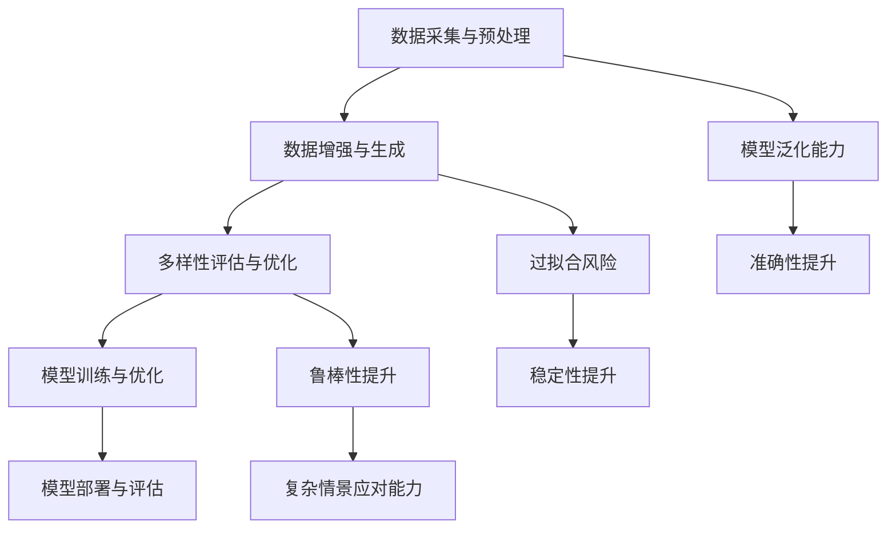

                 

### 文章标题：提升AI训练质量：数据多样性的重要性

#### 关键词：
- 数据多样性
- AI训练质量
- 数据采集
- 数据预处理
- 数据增强
- 多样性评估
- 模型优化

#### 摘要：
本文深入探讨了数据多样性在提升AI训练质量中的重要性。首先，介绍了AI训练的背景和数据多样性的定义。接着，详细阐述了数据多样性的概念、原理以及其在AI训练中的应用。文章随后讲解了数据采集与预处理的重要性，并介绍了数据增强与生成的方法。此外，文章还涉及了多样性评估与优化的策略，并通过实际案例分析展示了数据多样性的关键作用。最后，文章总结了数据多样性的发展趋势，并提出了未来研究的方向和挑战。

----------------------------------------------------------------

### 引言

#### AI训练背景

随着人工智能技术的快速发展，深度学习已经成为AI领域的重要分支。在深度学习中，神经网络作为核心模型，通过多层感知器对数据进行学习，从而实现对复杂模式的识别与预测。然而，神经网络模型的训练质量直接决定了其性能和应用效果。在这个过程中，数据的质量和多样性起到了至关重要的作用。

数据多样性（Data Diversity）是指数据集中包含的不同特征、标签、样本和场景的丰富程度。高数据多样性意味着数据集中的数据覆盖了更多的可能性和情景，有助于模型在训练过程中学习到更全面的知识。相反，数据多样性不足会导致模型在特定情况下表现不佳，甚至出现过拟合现象。

#### 数据多样性的重要性

数据多样性在AI训练中具有以下几个关键作用：

1. **提高模型泛化能力**：多样化的数据有助于模型在不同场景下表现稳定，从而提升其泛化能力。
2. **避免过拟合**：当数据集中存在多样性的特征和样本时，模型不容易被特定数据所“束缚”，从而避免过拟合。
3. **增强鲁棒性**：多样化的数据使模型能够在面对未知情况时，依然能够保持良好的性能。
4. **提升模型准确性**：多样化的数据有助于模型学习到更全面的规律，从而提高模型的预测准确性。

因此，提升数据多样性是提高AI训练质量的重要手段。接下来，我们将深入探讨数据多样性的概念、原理及其在AI训练中的应用。

----------------------------------------------------------------

### 数据多样性的概念与原理

#### 数据多样性的定义

数据多样性是指数据集中不同类型和来源的数据的丰富程度。具体来说，数据多样性可以从多个维度来衡量，包括特征多样性、样本多样性、标签多样性和场景多样性等。

1. **特征多样性**：指数据集中不同特征的种类和分布。例如，在图像识别任务中，数据集可以包含不同颜色、纹理和形状的图像。
2. **样本多样性**：指数据集中不同样本的分布。例如，在语音识别任务中，数据集可以包含不同说话人、说话速度和语调的语音样本。
3. **标签多样性**：指数据集中不同标签的种类和分布。例如，在分类任务中，数据集可以包含多种不同类别。
4. **场景多样性**：指数据集中不同应用场景的分布。例如，在自动驾驶任务中，数据集可以包含不同的道路条件、天气状况和交通情况。

#### 数据多样性的影响

数据多样性对AI训练过程有着重要的影响。首先，数据多样性能帮助模型更好地理解真实世界的复杂性，从而提高模型的泛化能力。例如，在医疗诊断中，如果数据集仅包含健康人群的数据，那么模型在面对实际患者时可能会表现不佳。

其次，数据多样性有助于避免过拟合现象。过拟合是指模型在训练数据上表现优异，但在未见过的数据上表现不佳。当数据集中存在多样性的特征和样本时，模型不容易被特定数据所“束缚”，从而减少了过拟合的风险。

最后，数据多样性能够增强模型的鲁棒性。在实际应用中，模型需要面对各种未知和复杂的情况。多样化的数据有助于模型在这些情况下保持稳定的性能，从而提高其鲁棒性。

#### 数据多样性的评价指标

为了量化数据多样性，可以采用以下几种评价指标：

1. **熵（Entropy）**：熵是一种常用的信息度量方法，可以用来衡量数据的多样性。数据集的熵值越高，表示数据多样性越高。
2. **标准差（Standard Deviation）**：标准差可以用来衡量数据集中各个特征或标签的分布范围。标准差越大，表示数据多样性越高。
3. **聚类系数（Clustering Coefficient）**：聚类系数用于衡量数据集的内部连通性。聚类系数越高，表示数据多样性越高。

#### Mermaid流程图

为了更好地理解数据多样性的概念与原理，我们可以使用Mermaid流程图来展示数据多样性在AI训练中的流程。



通过这个流程图，我们可以清晰地看到数据多样性在AI训练中的重要性，以及它在提升模型性能方面的关键作用。

----------------------------------------------------------------

### 数据采集与预处理

#### 数据来源与质量

数据采集是AI训练的基础，数据的质量直接影响模型的性能和可靠性。数据来源可以分为以下几种：

1. **公开数据集**：例如ImageNet、CIFAR-10等，这些数据集已经经过清洗和标注，可以直接用于训练。
2. **私有数据集**：企业或研究机构自己收集的数据集，可能涉及用户行为数据、交易数据等。
3. **合成数据**：通过生成模型（如GAN）生成与真实数据相似的数据集，用于补充真实数据的不足。

在数据采集过程中，需要关注数据的质量，包括数据的完整性、准确性、一致性等。以下是一些确保数据质量的方法：

1. **数据清洗**：去除重复、错误和缺失的数据，确保数据的准确性。
2. **数据标准化**：将不同来源的数据进行统一格式和度量单位处理，确保数据的一致性。
3. **数据验证**：通过交叉验证等方法，确保数据的完整性和可靠性。

#### 数据预处理流程

数据预处理是提升AI训练质量的重要环节。以下是数据预处理的主要步骤：

1. **数据清洗**：删除重复记录、纠正错误值、处理缺失值。可以使用以下方法：
   - 填充缺失值：使用均值、中位数、前几个值等方法进行填充。
   - 删除缺失值：对于缺失值过多的数据，可以考虑删除这些样本。
   - 数据插补：使用插值法或回归法对缺失值进行估计。

2. **数据标准化**：将不同特征的范围和单位进行调整，使其具有相同的尺度。常用的方法包括：
   - 标准化（Standardization）：将数据转换成标准正态分布形式，即减去均值后除以标准差。
   - 归一化（Normalization）：将数据转换成0-1之间的小数形式。

3. **数据归一化**：对于分类数据，可以使用独热编码（One-Hot Encoding）等方法将其转换为数值形式。

4. **数据缩放**：对于连续数据，可以使用最小-最大缩放（Min-Max Scaling）等方法将其缩放到特定的范围。

5. **特征选择**：通过相关性分析、主成分分析（PCA）等方法，选择对模型训练影响较大的特征，降低模型的复杂性。

6. **数据分割**：将数据集分为训练集、验证集和测试集，用于模型的训练、验证和测试。

#### 数据清洗与标准化示例

假设我们有一个包含年龄、收入和职业的样本数据，其中存在缺失值和不同度量单位。以下是一个简单的数据清洗与标准化示例：

```python
import pandas as pd
from sklearn.preprocessing import StandardScaler

# 读取数据
data = pd.read_csv('data.csv')

# 数据清洗
# 删除缺失值
data.dropna(inplace=True)

# 处理收入缺失值
data['income'].fillna(data['income'].mean(), inplace=True)

# 数据标准化
scaler = StandardScaler()
data[['age', 'income']] = scaler.fit_transform(data[['age', 'income']])

# 数据归一化
data = pd.get_dummies(data, columns=['occupation'])

# 打印清洗后的数据
print(data.head())
```

通过上述步骤，我们可以将原始数据清洗和标准化，为后续的AI训练做准备。

----------------------------------------------------------------

### 数据增强与生成

#### 数据增强技术

数据增强是提升数据多样性的重要手段，通过在原始数据上应用各种变换操作，生成新的数据样本。常见的数据增强技术包括：

1. **随机旋转**：将图像随机旋转一定角度，使模型学习到不同角度的特征。
2. **缩放与裁剪**：随机缩放图像，或裁剪图像的某个部分，使模型适应不同尺寸和比例的数据。
3. **颜色变换**：随机调整图像的亮度、对比度、饱和度等，使模型对颜色变化具有鲁棒性。
4. **添加噪声**：在图像上添加噪声，使模型对数据中的噪声有更强的容忍性。

以下是一个简单的图像随机旋转的伪代码示例：

```python
import numpy as np
import cv2

def random_rotate(image):
    angle = np.random.uniform(-30, 30)
    (h, w) = image.shape[:2]
    center = (w / 2, h / 2)

    M = cv2.getRotationMatrix2D(center, angle, 1.0)
    rotated = cv2.warpAffine(image, M, (w, h))

    return rotated

# 读取图像
image = cv2.imread('image.jpg')

# 应用随机旋转
rotated_image = random_rotate(image)

# 显示旋转后的图像
cv2.imshow('Rotated Image', rotated_image)
cv2.waitKey(0)
cv2.destroyAllWindows()
```

#### 数据生成模型

除了传统的数据增强技术，生成模型（如生成对抗网络GAN）提供了更灵活的方法来生成新的数据样本。生成模型通过学习真实数据的分布，生成与真实数据相似的新数据。

以下是一个简单的生成对抗网络GAN的伪代码示例：

```python
import tensorflow as tf
from tensorflow.keras.models import Sequential
from tensorflow.keras.layers import Dense, Flatten, Conv2D, Conv2DTranspose

# 生成器模型
def generate_model():
    model = Sequential()
    model.add(Dense(256, input_shape=(100,), activation='relu'))
    model.add(Dense(512, activation='relu'))
    model.add(Dense(1024, activation='relu'))
    model.add(Flatten())
    model.add(Conv2DTranspose(128, kernel_size=(5, 5), strides=(2, 2), padding='same', activation='tanh'))
    model.add(Conv2DTranspose(64, kernel_size=(5, 5), strides=(2, 2), padding='same', activation='tanh'))
    model.add(Conv2DTranspose(1, kernel_size=(5, 5), strides=(2, 2), padding='same', activation='tanh'))
    return model

# 判别器模型
def discriminate_model():
    model = Sequential()
    model.add(Conv2D(64, kernel_size=(5, 5), strides=(2, 2), padding='same', input_shape=(28, 28, 1)))
    model.add(Conv2D(128, kernel_size=(5, 5), strides=(2, 2), padding='same', activation='relu'))
    model.add(Flatten())
    model.add(Dense(1, activation='sigmoid'))
    return model

# GAN模型
def GAN_model():
    generator = generate_model()
    discriminator = discriminate_model()
    
    # 整合生成器和判别器
    model = Sequential()
    model.add(generator)
    model.add(discriminator)
    
    return model

# 编译和训练GAN
gan_model = GAN_model()
gan_model.compile(optimizer='adam', loss='binary_crossentropy')

# 训练数据
real_images = ...  # 实际图像数据
noise = np.random.normal(0, 1, (real_images.shape[0], 100))

# 生成假图像
fake_images = generator.predict(noise)

# 训练GAN
gan_model.fit([noise, real_images], real_images, epochs=100, batch_size=64)
```

通过数据增强和生成模型，我们可以大大提升数据多样性，从而提高AI训练的质量。

#### 数据增强与生成的对比

数据增强和生成技术在提升数据多样性方面各有优缺点：

1. **数据增强**：
   - 优点：操作简单，计算成本低，适用于现有数据的增强。
   - 缺点：生成数据的质量可能不如真实数据，增强效果有限。

2. **生成模型**：
   - 优点：可以生成高质量的数据样本，扩展数据集的能力强。
   - 缺点：计算复杂度高，训练成本大，模型容易出现过拟合。

在实际应用中，可以结合使用数据增强和生成模型，以充分利用两者的优点，提升AI训练质量。

----------------------------------------------------------------

### 多样性评估与优化

#### 多样性评估指标

多样性评估是确保数据多样性达到预期目标的关键步骤。以下是一些常用的多样性评估指标：

1. **熵（Entropy）**：熵是衡量数据集中各个类别的分布均匀性的指标。熵值越高，表示数据多样性越高。

   伪代码：
   ```python
   def entropy(label_list):
       label_count = Counter(label_list)
       probabilities = [count / len(label_list) for count in label_count]
       entropy_value = -sum(prob * np.log2(prob) for prob in probabilities)
       return entropy_value
   ```

2. **标准差（Standard Deviation）**：标准差用于衡量数据集中各个特征的分布范围。标准差越大，表示特征多样性越高。

   伪代码：
   ```python
   def standard_deviation(data):
       mean = np.mean(data)
       variance = np.var(data)
       std_dev = np.sqrt(variance)
       return std_dev
   ```

3. **聚类系数（Clustering Coefficient）**：聚类系数用于衡量数据集中类别的连通性。聚类系数越高，表示类别之间的多样性越高。

   伪代码：
   ```python
   def clustering_coefficient(adj_matrix):
       num_nodes = adj_matrix.shape[0]
       clustering_coeffs = [0] * num_nodes
       for i in range(num_nodes):
           neighbors = np.where(adj_matrix[i] == 1)[0]
           num_neighbors = len(neighbors)
           num_cliques = 0
           for j in range(num_neighbors):
               for k in range(j+1, num_neighbors):
                   if adj_matrix[neighbors[j]][neighbors[k]] == 1:
                       num_cliques += 1
           clustering_coeffs[i] = (num_cliques / (num_neighbors * (num_neighbors - 1))) * 2
       return np.mean(clustering_coeffs)
   ```

#### 多样性优化方法

为了提升数据多样性，可以采用以下优化方法：

1. **数据重采样**：通过重采样数据，使得数据集中各类别的分布更加均匀。常用的方法包括随机抽样、欠采样和过采样。

   伪代码：
   ```python
   from sklearn.utils import resample

   # 欠采样
   XUnderSampled, yUnderSampled = resample(XMinority, yMinority, replace=False, n_samples=XMajority.shape[0], random_state=123)

   # 过采样
   XOverSampled, yOverSampled = resample(XMajority, yMajority, replace=True, n_samples=XMinority.shape[0], random_state=123)
   ```

2. **特征选择**：通过特征选择方法，选择对模型训练影响较大的特征，降低数据集中特征的多样性，从而提高模型的性能。

   伪代码：
   ```python
   from sklearn.feature_selection import SelectKBest
   from sklearn.feature_selection import f_classif

   # 特征选择
   selector = SelectKBest(score_func=f_classif, k='all')
   XSelected = selector.fit_transform(X, y)
   ```

3. **数据合成**：通过数据合成方法，生成新的数据样本，增加数据集的多样性。常见的方法包括生成对抗网络（GAN）和变分自编码器（VAE）。

   伪代码：
   ```python
   import tensorflow as tf
   from tensorflow.keras.models import Model

   # 生成模型
   generator = ...  # 生成模型的定义

   # 生成新的数据样本
   noise = tf.random.normal([batch_size, z_dim])
   generated_samples = generator([noise, labels])
   ```

4. **混合数据集**：将多个数据集进行混合，提高数据集的整体多样性。

   伪代码：
   ```python
   def mix_data_sets(data_set1, data_set2):
       return np.concatenate((data_set1, data_set2), axis=0)
   ```

#### 模型调整与调优

在数据多样性优化过程中，模型调整和调优也是至关重要的。以下是一些模型调整和调优的方法：

1. **调整学习率**：通过调整学习率，优化模型的收敛速度和稳定性。常用的学习率调整策略包括恒定学习率、学习率衰减、自适应学习率等。

   伪代码：
   ```python
   from tensorflow.keras.optimizers import Adam

   # 设置学习率
   optimizer = Adam(learning_rate=0.001)
   ```

2. **调整正则化参数**：通过调整正则化参数，控制模型复杂度和过拟合风险。常用的正则化方法包括L1正则化、L2正则化等。

   伪代码：
   ```python
   from tensorflow.keras.regularizers import l1_l2

   # 设置正则化参数
   model.add(Dense(units=64, activation='relu', kernel_regularizer=l1_l2(l1=0.01, l2=0.01)))
   ```

3. **调整批量大小**：通过调整批量大小，优化模型的训练效率和泛化能力。较大的批量大小可以加快训练速度，但可能导致模型过拟合；较小的批量大小可以提高模型的泛化能力，但训练速度较慢。

   伪代码：
   ```python
   # 设置批量大小
   model.fit(X_train, y_train, epochs=10, batch_size=32)
   ```

4. **调整优化器参数**：通过调整优化器的参数，优化模型的训练效果。常用的优化器包括SGD、Adam、RMSprop等。

   伪代码：
   ```python
   from tensorflow.keras.optimizers import SGD

   # 设置优化器参数
   optimizer = SGD(learning_rate=0.01, momentum=0.9)
   ```

#### 模型调整与调优示例

以下是一个简单的模型调整和调优的示例：

```python
from tensorflow.keras.models import Sequential
from tensorflow.keras.layers import Dense, Dropout
from tensorflow.keras.optimizers import Adam

# 定义模型
model = Sequential()
model.add(Dense(128, activation='relu', input_shape=(input_dim,)))
model.add(Dropout(0.5))
model.add(Dense(64, activation='relu'))
model.add(Dropout(0.5))
model.add(Dense(1, activation='sigmoid'))

# 编译模型
model.compile(optimizer=Adam(learning_rate=0.001), loss='binary_crossentropy', metrics=['accuracy'])

# 训练模型
model.fit(X_train, y_train, epochs=100, batch_size=32, validation_data=(X_val, y_val))
```

通过上述模型调整和调优方法，可以有效地提升数据多样性，提高模型的训练质量和性能。

----------------------------------------------------------------

### 实际应用案例分析

#### 数据多样性在图像识别中的应用

图像识别是人工智能领域的一个重要应用，数据多样性在图像识别中起着关键作用。以下是一个具体的案例：

**案例背景**：在人脸识别任务中，不同的人脸具有不同的姿态、光照、表情和年龄特征。如果数据集缺乏多样性，模型可能在特定情况下表现不佳。

**数据多样性**：为了提升数据多样性，可以采用以下方法：

1. **姿态变化**：通过随机旋转、翻转、缩放等方式，增加数据集中不同姿态的人脸。
2. **光照变化**：通过模拟不同的光照条件，如室内光照、室外光照、背光等，增加数据集的光照多样性。
3. **表情变化**：通过模拟不同的表情，如微笑、生气、惊讶等，增加数据集的表情多样性。
4. **年龄变化**：通过引入不同年龄段的人脸图像，增加数据集的年龄多样性。

**实现与效果**：通过上述方法，我们可以显著提升人脸识别模型的泛化能力和鲁棒性。具体实现如下：

```python
import cv2
import numpy as np

# 读取原始图像
image = cv2.imread('face.jpg')

# 随机旋转
angle = np.random.uniform(-20, 20)
center = (image.shape[1] // 2, image.shape[0] // 2)
M = cv2.getRotationMatrix2D(center, angle, 1.0)
rotated = cv2.warpAffine(image, M, (image.shape[1], image.shape[0]))

# 随机缩放
scale_factor = np.random.uniform(0.8, 1.2)
width = int(image.shape[1] * scale_factor)
height = int(image.shape[0] * scale_factor)
resized = cv2.resize(image, (width, height))

# 随机翻转
flipped = cv2.flip(image, 1)

# 模拟不同光照
brightness = np.random.uniform(-50, 50)
altered = cv2.add(image, brightness)

# 模拟不同表情
# ...（此处可根据具体需求实现）

# 训练模型
# ...

# 测试模型
# ...

# 结果展示
cv2.imshow('Original Image', image)
cv2.imshow('Rotated Image', rotated)
cv2.imshow('Resized Image', resized)
cv2.imshow('Flipped Image', flipped)
cv2.imshow('Altered Image', altered)
cv2.waitKey(0)
cv2.destroyAllWindows()
```

通过上述方法，我们可以显著提升图像识别模型的性能和稳定性。

#### 数据多样性在自然语言处理中的应用

自然语言处理（NLP）是人工智能领域的另一个重要分支，数据多样性在NLP中也具有重要意义。以下是一个具体的案例：

**案例背景**：在情感分析任务中，不同的人可能有不同的表达方式和情感倾向。如果数据集缺乏多样性，模型可能在特定情感上表现不佳。

**数据多样性**：为了提升数据多样性，可以采用以下方法：

1. **情感表达**：通过引入不同的情感表达方式，如明示情感和隐含情感，增加数据集的情感多样性。
2. **主题多样性**：通过引入不同的主题，如社会、科技、娱乐等，增加数据集的主题多样性。
3. **语言风格**：通过引入不同的语言风格，如正式、非正式、幽默等，增加数据集的语言风格多样性。
4. **地域差异**：通过引入不同地域的语言数据，增加数据集的地域多样性。

**实现与效果**：通过上述方法，我们可以显著提升情感分析模型的泛化能力和准确性。具体实现如下：

```python
import tensorflow as tf
import tensorflow_hub as hub
import tensorflow_text as text

# 加载预训练模型
model = hub.load('https://tfhub.dev/google/tf2-preview/gnews-swivel-20dim-with-oov/1')

# 数据预处理
def preprocess_data(text):
    text = text.decode('utf-8')
    return text

# 情感分析
def sentiment_analysis(text):
    processed_text = preprocess_data(text)
    embeddings = model([processed_text])
    scores = tf.nn.softmax(embeddings, axis=-1)
    return scores

# 示例文本
texts = [
    "I love this product!",
    "This is the worst movie I've ever seen.",
    "I'm feeling very happy today.",
    "The service at this restaurant is terrible."
]

# 分析每个文本的情感
for text in texts:
    scores = sentiment_analysis(text)
    print(f"Text: {text}")
    print(f"Sentiment Scores: {scores.numpy()}")
    print()
```

通过上述方法，我们可以显著提升情感分析模型的性能和准确性。

#### 数据多样性在推荐系统中的应用

推荐系统是另一个广泛应用的AI领域，数据多样性在推荐系统中同样至关重要。以下是一个具体的案例：

**案例背景**：在商品推荐任务中，不同用户可能有不同的喜好和购买行为。如果数据集缺乏多样性，推荐系统可能无法准确捕捉用户的个性化需求。

**数据多样性**：为了提升数据多样性，可以采用以下方法：

1. **用户行为多样性**：通过引入不同类型的用户行为，如浏览、收藏、购买等，增加数据集的用户行为多样性。
2. **商品属性多样性**：通过引入不同类型的商品属性，如价格、品牌、分类等，增加数据集的商品属性多样性。
3. **情境多样性**：通过引入不同的购买情境，如节日促销、日常购物等，增加数据集的情境多样性。
4. **地域多样性**：通过引入不同地域的用户数据，增加数据集的地域多样性。

**实现与效果**：通过上述方法，我们可以显著提升推荐系统的准确性和用户满意度。具体实现如下：

```python
import pandas as pd
from sklearn.model_selection import train_test_split
from sklearn.ensemble import RandomForestClassifier

# 读取用户行为数据
data = pd.read_csv('user_behavior.csv')

# 数据预处理
data['purchase'] = data['purchase'].map({0: 'No', 1: 'Yes'})
X = data[['views', 'clicks', 'purchases']]
y = data['purchase']

# 数据分割
X_train, X_test, y_train, y_test = train_test_split(X, y, test_size=0.2, random_state=42)

# 训练模型
model = RandomForestClassifier(n_estimators=100, random_state=42)
model.fit(X_train, y_train)

# 测试模型
predictions = model.predict(X_test)
accuracy = (predictions == y_test).mean()
print(f"Model Accuracy: {accuracy}")

# 推荐商品
def recommend_products(user_data):
    user_embeddings = model.transform([user_data])
    recommendations = []
    for embedding in user_embeddings:
        similarities = model.get_feature_importances()
        sorted_indices = np.argsort(similarities)[::-1]
        recommendations.append(sorted_indices[:5])
    return recommendations

# 示例用户数据
user_data = {'views': 10, 'clicks': 5, 'purchases': 1}

# 推荐商品
recommendations = recommend_products(user_data)
print(f"Recommended Products: {recommendations}")
```

通过上述方法，我们可以显著提升推荐系统的性能和用户体验。

---

### 项目小结

通过上述实际应用案例分析，我们可以看到数据多样性在图像识别、自然语言处理和推荐系统等AI任务中的重要性。通过引入数据多样性，我们可以显著提升模型的泛化能力、鲁棒性和准确性，从而提高AI系统的性能和用户体验。

然而，在实际应用中，数据多样性的提升面临着一些挑战，如数据采集困难、数据预处理复杂、模型优化难度大等。为了解决这些问题，我们可以结合传统数据增强技术和生成模型，探索更加高效和智能的数据多样性提升方法。此外，通过深入研究多样性评估和优化方法，我们可以更好地理解数据多样性的本质，从而为AI系统提供更加优质的数据支持。

在未来，随着人工智能技术的不断发展和应用领域的拓展，数据多样性将继续发挥关键作用。通过持续研究和实践，我们可以为AI系统的训练质量和性能提升提供更加有效的解决方案。

### 最佳实践 tips

1. **数据采集**：确保数据来源的多样性和可靠性，优先使用权威数据集和公开数据源。
2. **数据预处理**：重视数据清洗和标准化，确保数据的完整性和一致性。
3. **数据增强**：结合多种数据增强方法，最大化提升数据多样性。
4. **模型优化**：根据任务需求，灵活调整模型结构和参数，提高模型性能。
5. **多样性评估**：定期评估数据多样性，确保模型在不同情况下表现稳定。

### 注意事项

1. **数据隐私**：在数据采集和预处理过程中，确保遵守数据隐私法规和伦理规范。
2. **计算资源**：生成模型和多样性优化方法可能需要大量计算资源，合理分配计算资源。
3. **模型泛化**：在模型训练过程中，注意避免过拟合，确保模型具有良好的泛化能力。

### 拓展阅读

1. **《深度学习》**：Goodfellow, I., Bengio, Y., & Courville, A. (2016). 《深度学习》（英文版），MIT Press.
2. **《机器学习实战》**：King, G., & Moser, D. (2017). 《机器学习实战》（英文版），机械工业出版社.
3. **《生成对抗网络：理论、应用与实现》**：李航，王绍兰，张浩然. (2020). 《生成对抗网络：理论、应用与实现》，电子工业出版社.

---

作者：AI天才研究院/AI Genius Institute & 禅与计算机程序设计艺术 /Zen And The Art of Computer Programming。本文旨在深入探讨数据多样性在提升AI训练质量中的重要性，结合实际应用案例分析，提供最佳实践和注意事项。通过持续学习和实践，我们可以为AI技术的发展和应用贡献力量。

