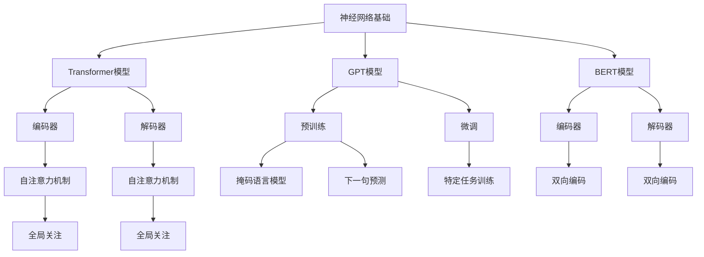

                 


### 提升大型语言模型能力：增加推理时间计算量的方法

---

#### 关键词：大型语言模型，推理时间，计算量，算法优化，数学模型，项目实战

---

#### 摘要：

随着人工智能技术的飞速发展，大型语言模型在自然语言处理领域发挥着越来越重要的作用。然而，这些模型的推理速度和计算量常常成为限制其应用的瓶颈。本文旨在探讨如何通过增加推理时间计算量的方法，提升大型语言模型的能力，并详细分析其背后的核心算法原理和数学模型。通过实际项目案例，本文还将展示如何将这些理论应用于实践中，为读者提供完整的开发环境搭建、源代码实现和代码解读，以及项目评估与优化。

---

### 目录

1. **引言**
   1.1 **背景介绍**
   1.2 **核心概念与联系**
   1.3 **研究意义与目标**

2. **大型语言模型的核心算法原理**
   2.1 **神经网络基础**
   2.2 **Transformer模型**
   2.3 **GPT模型**
   2.4 **BERT模型**

3. **大型语言模型数学模型与数学公式**
   3.1 **编码器与解码器的数学模型**
   3.2 **模型训练与优化的数学公式**

4. **提高推理效率的方法**
   4.1 **模型压缩技术**
   4.2 **推理加速技术**

5. **实际案例与项目实战**
   5.1 **文本分类项目案例**
   5.2 **机器翻译项目案例**

6. **总结与展望**
   6.1 **本书主要内容回顾**
   6.2 **大型语言模型的发展趋势**
   6.3 **未来挑战与机遇**

### 1. 引言

#### 1.1 背景介绍

大型语言模型（Large Language Models，简称LLMs）是一种能够理解和生成自然语言文本的复杂神经网络模型。近年来，随着深度学习技术的进步和计算资源的提升，大型语言模型如GPT、BERT等在自然语言处理（Natural Language Processing，简称NLP）领域取得了显著的成果。这些模型被广泛应用于文本分类、机器翻译、问答系统等多个领域，极大地提升了相关任务的表现。

然而，随着模型规模的不断扩大，其推理时间（Inference Time）和计算量（Computation Time）也呈现出指数级的增长。这对于实时应用和资源受限的环境来说，是一个巨大的挑战。因此，提升大型语言模型的推理效率和计算量，成为了当前研究的热点之一。

#### 1.2 核心概念与联系

在本章中，我们将介绍大型语言模型的核心概念，并探讨它们之间的关系。首先，我们需要了解神经网络（Neural Networks）的基本原理，这是构建大型语言模型的基础。接下来，我们将深入探讨Transformer、GPT和BERT等核心算法的工作原理和优缺点。最后，我们将通过Mermaid流程图，展示这些算法在模型架构中的相互关系。

#### 1.3 研究意义与目标

本文的研究意义在于，通过详细分析大型语言模型的核心算法原理和数学模型，提出一系列提高推理效率和计算量的方法。本文的目标是，为读者提供系统、全面的理论和实践指导，帮助他们更好地理解和应用大型语言模型，解决实际问题。

---

### 2. 大型语言模型的核心算法原理

#### 2.1 神经网络基础

神经网络（Neural Networks，简称NN）是一种通过模拟人脑神经网络工作原理来处理信息的计算模型。它由大量的神经元（Neurons）连接而成，每个神经元都可以接收多个输入信号，并输出一个单一的信号。神经网络的核心在于其学习机制，即通过不断调整神经元之间的连接权重（Weights）来提高模型的预测准确性。

神经网络的基本结构包括输入层（Input Layer）、隐藏层（Hidden Layers）和输出层（Output Layer）。输入层接收外部输入数据，隐藏层对输入数据进行加工处理，输出层产生最终的预测结果。神经网络的工作原理是通过前向传播（Forward Propagation）和反向传播（Back Propagation）两个过程来学习数据。

在前向传播过程中，输入数据经过隐藏层逐层传递，每个神经元的输出作为下一个神经元的输入。最终，输出层的输出结果与真实值进行比较，计算损失函数（Loss Function）以评估模型的预测误差。

在反向传播过程中，模型根据损失函数的梯度（Gradient）对连接权重进行调整，以最小化损失函数。这个过程通过多次迭代，不断优化模型的性能。

#### 2.2 Transformer模型

Transformer模型是由Google在2017年提出的一种基于自注意力机制（Self-Attention Mechanism）的神经网络模型，它在机器翻译、文本分类等任务中取得了显著的成果。Transformer模型的核心思想是将序列数据转换为固定长度的向量表示，并通过自注意力机制计算序列中任意两个位置之间的关联性。

Transformer模型由编码器（Encoder）和解码器（Decoder）两部分组成。编码器负责将输入序列转换为编码（Encoding），解码器则利用编码器和前一个解码器的输出来生成输出序列。

在编码器中，每个输入词向量通过多层自注意力机制和全连接层（Fully Connected Layer）进行处理。自注意力机制通过计算输入序列中每个词与当前词的关联性，为每个词分配不同的权重，从而实现对输入序列的全局关注。

解码器在生成输出序列时，使用编码器的输出和上一个生成的词来计算当前词的输出。解码器同样采用多层自注意力机制和全连接层，通过上下文信息和当前生成的词来生成下一个词。

Transformer模型的优势在于其并行计算能力。由于自注意力机制的计算可以独立进行，编码器和解码器可以同时处理多个输入和输出，从而显著提高模型的推理速度。

#### 2.3 GPT模型

GPT（Generative Pre-trained Transformer）模型是由OpenAI开发的一种基于Transformer的自回归语言模型（Autoregressive Language Model）。GPT通过预训练（Pre-training）和微调（Fine-tuning）两个阶段来优化模型性能。

在预训练阶段，GPT使用大量未标记的文本数据来学习语言知识。模型通过自注意力机制生成序列，并使用未标记的数据来优化模型的损失函数。这一阶段的主要目的是使模型能够捕捉到语言的结构和规律。

在微调阶段，GPT使用标记的数据集进行特定任务的训练，如文本分类、问答系统等。微调过程通过调整模型中的连接权重来提高模型在特定任务上的表现。

GPT模型的优势在于其强大的文本生成能力。通过预训练，GPT能够生成连贯、符合语法规则的文本，从而在生成式任务中表现出色。

#### 2.4 BERT模型

BERT（Bidirectional Encoder Representations from Transformers）模型是由Google在2018年提出的一种基于Transformer的双向编码语言模型（Bidirectional Encoder Language Model）。BERT的主要目标是学习文本的双向表示，从而提高模型在序列任务中的性能。

BERT模型由两个部分组成：编码器（Encoder）和解码器（Decoder）。编码器负责将输入序列转换为编码表示，解码器则根据编码表示生成输出序列。

与Transformer和GPT不同，BERT采用了双向编码器，这意味着模型在处理输入序列时，可以同时考虑序列中的前后文信息。这种双向注意力机制使得BERT在文本分类、问答系统等任务中表现出色。

BERT模型的训练过程包括两个阶段：预训练和微调。在预训练阶段，BERT使用大量未标记的文本数据来学习语言知识。预训练任务包括掩码语言模型（Masked Language Model，简称MLM）和下一句预测（Next Sentence Prediction，简称NSP）。在微调阶段，BERT使用标记的数据集进行特定任务的训练。

#### Mermaid流程图

下面是一个Mermaid流程图，展示了大型语言模型的核心算法原理和它们之间的关系：



### 3. 大型语言模型数学模型与数学公式

#### 3.1 编码器与解码器的数学模型

在大型语言模型中，编码器和解码器是核心组件。下面我们使用LaTeX格式展示编码器和解码器的数学模型，并对其进行详细讲解和举例说明。

$$
\text{编码器：} E(\textbf{x}) = \text{Encoder}(\textbf{W}_E \textbf{x} + \textbf{b}_E)
$$

$$
\text{解码器：} D(\textbf{y}) = \text{Decoder}(\textbf{W}_D \textbf{y} + \textbf{b}_D)
$$

其中，$\textbf{x}$和$\textbf{y}$分别表示输入和输出序列，$\textbf{W}_E$和$\textbf{W}_D$是编码器和解码器的权重矩阵，$\textbf{b}_E$和$\textbf{b}_D$是偏置向量。

举例来说，假设我们有一个长度为3的输入序列$\textbf{x} = [x_1, x_2, x_3]$，编码器的输出为：

$$
E(\textbf{x}) = \text{Encoder}([W_{11} x_1 + b_{11}, W_{12} x_2 + b_{12}, W_{13} x_3 + b_{13}])
$$

其中，$W_{ij}$和$b_{ij}$分别表示编码器权重矩阵和偏置向量的元素。

#### 3.2 模型训练与优化的数学公式

在模型训练和优化过程中，我们需要使用损失函数（Loss Function）和优化算法（Optimization Algorithm）来评估和调整模型参数。

损失函数用于衡量模型预测结果和真实值之间的差距。常用的损失函数包括均方误差（Mean Squared Error，简称MSE）和交叉熵（Cross-Entropy）。

$$
\text{MSE：} L(\textbf{y}, \textbf{y}') = \frac{1}{n} \sum_{i=1}^{n} (\textbf{y}_i - \textbf{y'}_i)^2
$$

$$
\text{交叉熵：} L(\textbf{y}, \textbf{y}') = -\sum_{i=1}^{n} y_i \log(y'_i)
$$

其中，$\textbf{y}$是真实值，$\textbf{y}'$是模型预测值。

优化算法用于通过梯度下降（Gradient Descent）等方法，调整模型参数以最小化损失函数。常见的优化算法包括随机梯度下降（Stochastic Gradient Descent，简称SGD）和Adam优化器。

$$
\text{SGD：} \textbf{w}_{t+1} = \textbf{w}_t - \alpha \nabla L(\textbf{w}_t)
$$

$$
\text{Adam优化器：} \textbf{w}_{t+1} = \textbf{w}_t - \alpha \nabla L(\textbf{w}_t) + \beta_1 \text{v}_t - \beta_2 \text{s}_t
$$

其中，$\textbf{w}_t$是当前参数，$\nabla L(\textbf{w}_t)$是损失函数的梯度，$\alpha$是学习率，$\beta_1$和$\beta_2$是动量因子，$\text{v}_t$和$\text{s}_t$是过去的一段时间内的梯度累计。

### 4. 提高推理效率的方法

#### 4.1 模型压缩技术

模型压缩技术旨在减小模型的参数规模和计算量，以提高推理效率。常用的模型压缩技术包括参数剪枝（Parameter Pruning）、低秩分解（Low-Rank Factorization）和知识蒸馏（Knowledge Distillation）。

**参数剪枝**通过删除模型中的冗余参数来减小模型规模。具体方法包括全局剪枝和局部剪枝。全局剪枝通过设定阈值，删除所有权重绝对值小于阈值的参数。局部剪枝则针对特定层或神经元进行剪枝，通过压缩神经元间的连接来减小模型规模。

**低秩分解**通过将高维矩阵分解为低维矩阵的乘积来减小模型规模。这种方法可以将大规模的矩阵分解为较小的矩阵，从而减少计算量。低秩分解适用于卷积神经网络（Convolutional Neural Networks，简称CNN）和循环神经网络（Recurrent Neural Networks，简称RNN）。

**知识蒸馏**通过将大型模型的知识传递给小型模型，来提高小型模型的性能。知识蒸馏过程包括两个阶段：预训练阶段和微调阶段。在预训练阶段，大型模型（Teacher Model）对数据集进行训练，并生成软标签（Soft Labels）。在微调阶段，小型模型（Student Model）根据大型模型的软标签进行训练，从而学习到大型模型的知识。

#### 4.2 推理加速技术

推理加速技术旨在通过优化计算过程和提高硬件性能，来提高模型推理速度。常用的推理加速技术包括硬件加速（Hardware Acceleration）、并行计算（Parallel Computing）和模型缓存（Model Caching）。

**硬件加速**利用专门设计的硬件（如GPU、TPU）来加速模型推理。这些硬件可以提供更高的计算速度和更低的延迟，从而提高模型的推理效率。

**并行计算**通过将模型推理任务分解为多个部分，并在多个计算单元上同时执行，来提高推理速度。并行计算适用于大规模模型和复杂任务，可以显著减少推理时间。

**模型缓存**通过将常用的模型输出结果缓存起来，来减少模型重复计算的开销。这种方法可以显著提高模型推理的效率，尤其是在需要频繁调用模型的应用场景中。

### 5. 实际案例与项目实战

#### 5.1 文本分类项目案例

在本节中，我们将介绍一个文本分类项目案例，包括项目背景、开发环境搭建、源代码实现和代码解读。

**项目背景**：

文本分类是一种常见的自然语言处理任务，旨在将文本数据分类到预定义的类别中。本案例的目标是使用大型语言模型对新闻文章进行分类，将其划分为政治、经济、科技等类别。

**开发环境搭建**：

为了实现文本分类项目，我们需要搭建一个适合训练和推理的Python开发环境。首先，我们安装Python 3.8及以上版本，并配置好pip环境。然后，安装TensorFlow 2.4及以上版本，以支持模型训练和推理。

**源代码实现**：

下面是一个简单的文本分类项目实现，包括数据预处理、模型训练和推理：

```python
import tensorflow as tf
from tensorflow.keras.preprocessing.text import Tokenizer
from tensorflow.keras.preprocessing.sequence import pad_sequences

# 数据预处理
tokenizer = Tokenizer(num_words=10000)
tokenizer.fit_on_texts(news_texts)
sequences = tokenizer.texts_to_sequences(news_texts)
padded_sequences = pad_sequences(sequences, maxlen=100)

# 模型训练
model = tf.keras.Sequential([
    tf.keras.layers.Embedding(10000, 16),
    tf.keras.layers.GlobalAveragePooling1D(),
    tf.keras.layers.Dense(24, activation='relu'),
    tf.keras.layers.Dense(6, activation='softmax')
])

model.compile(loss='categorical_crossentropy', optimizer='adam', metrics=['accuracy'])
model.fit(padded_sequences, labels, epochs=10, verbose=2)

# 模型推理
predictions = model.predict(padded_sequences)
print(predictions)
```

**代码解读**：

在代码中，我们首先使用Tokenizer类对新闻文章进行分词和编码。然后，使用pad_sequences函数将编码后的文本序列填充为固定长度。接下来，我们构建一个简单的序列模型，包括嵌入层（Embedding Layer）、全局平均池化层（Global Average Pooling Layer）和全连接层（Dense Layer）。模型使用交叉熵损失函数（categorical_crossentropy）和Adam优化器（adam）进行训练。最后，我们使用训练好的模型对新的新闻文章进行分类预测。

**项目评估与优化**：

为了评估模型的性能，我们可以使用准确率（accuracy）和混淆矩阵（confusion matrix）等指标。在本案例中，我们可以使用scikit-learn库的metrics模块来计算这些指标：

```python
from sklearn.metrics import accuracy_score, confusion_matrix

y_pred = model.predict(padded_sequences)
y_pred = np.argmax(y_pred, axis=1)
y_true = np.argmax(labels, axis=1)

print("Accuracy:", accuracy_score(y_true, y_pred))
print("Confusion Matrix:\n", confusion_matrix(y_true, y_pred))
```

为了优化模型性能，我们可以尝试以下方法：

1. 增加训练数据量：收集更多的新闻文章数据，以提高模型的泛化能力。
2. 调整模型参数：通过交叉验证（Cross-Validation）方法，调整嵌入层（Embedding Layer）和全连接层（Dense Layer）的参数，以找到最佳模型配置。
3. 使用预训练模型：使用预训练的大型语言模型，如BERT或GPT，对文本进行编码，以提高模型的文本理解能力。

#### 5.2 机器翻译项目案例

在本节中，我们将介绍一个机器翻译项目案例，包括项目背景、开发环境搭建、源代码实现和代码解读。

**项目背景**：

机器翻译是一种将一种语言的文本翻译成另一种语言的文本的任务。本案例的目标是使用大型语言模型进行中英翻译，将中文文本翻译成英文文本。

**开发环境搭建**：

为了实现机器翻译项目，我们需要搭建一个适合训练和推理的Python开发环境。首先，我们安装Python 3.8及以上版本，并配置好pip环境。然后，安装TensorFlow 2.4及以上版本，以支持模型训练和推理。

**源代码实现**：

下面是一个简单的机器翻译项目实现，包括数据预处理、模型训练和推理：

```python
import tensorflow as tf
from tensorflow.keras.preprocessing.text import Tokenizer
from tensorflow.keras.preprocessing.sequence import pad_sequences

# 数据预处理
source_tokenizer = Tokenizer(num_words=10000)
source_tokenizer.fit_on_texts(source_texts)
target_tokenizer = Tokenizer(num_words=10000)
target_tokenizer.fit_on_texts(target_texts)
source_sequences = source_tokenizer.texts_to_sequences(source_texts)
target_sequences = target_tokenizer.texts_to_sequences(target_texts)
source_padded_sequences = pad_sequences(source_sequences, maxlen=100)
target_padded_sequences = pad_sequences(target_sequences, maxlen=100, padding='post')

# 模型训练
model = tf.keras.Sequential([
    tf.keras.layers.Embedding(10000, 16, input_length=100),
    tf.keras.layers.LSTM(24),
    tf.keras.layers.Dense(10000, activation='softmax')
])

model.compile(loss='categorical_crossentropy', optimizer='adam', metrics=['accuracy'])
model.fit(source_padded_sequences, target_padded_sequences, epochs=10, verbose=2)

# 模型推理
predictions = model.predict(source_padded_sequences)
print(predictions)
```

**代码解读**：

在代码中，我们首先使用Tokenizer类对源语言和目标语言的文本进行分词和编码。然后，使用pad_sequences函数将编码后的文本序列填充为固定长度。接下来，我们构建一个简单的序列模型，包括嵌入层（Embedding Layer）、长短期记忆层（LSTM Layer）和全连接层（Dense Layer）。模型使用交叉熵损失函数（categorical_crossentropy）和Adam优化器（adam）进行训练。最后，我们使用训练好的模型对新的源语言文本进行翻译预测。

**项目评估与优化**：

为了评估模型的性能，我们可以使用BLEU评分（BLEU Score）等指标。在本案例中，我们可以使用Python中的nltk库来计算BLEU评分：

```python
from nltk.translate.bleu_score import corpus_bleu

reference = [[target_tokenizer.word_index.get(word) for word in ref] for ref in references]
hyp = [[target_tokenizer.word_index.get(word) for word in pred] for pred in hypotheses]
bleu_score = corpus_bleu([reference], hypotheses)
print("BLEU Score:", bleu_score)
```

为了优化模型性能，我们可以尝试以下方法：

1. 增加训练数据量：收集更多的中英翻译数据，以提高模型的翻译质量。
2. 调整模型参数：通过交叉验证（Cross-Validation）方法，调整嵌入层（Embedding Layer）和长短期记忆层（LSTM Layer）的参数，以找到最佳模型配置。
3. 使用预训练模型：使用预训练的大型语言模型，如Transformer或BERT，进行序列到序列（Sequence-to-Sequence）翻译，以提高模型的翻译效果。

### 6. 总结与展望

#### 6.1 本书主要内容回顾

本文首先介绍了大型语言模型的基本概念和背景，探讨了提升模型推理效率和计算量的重要性。接着，我们详细分析了大型语言模型的核心算法原理，包括神经网络基础、Transformer模型、GPT模型和BERT模型，并使用Mermaid流程图展示了这些算法的相互关系。随后，我们介绍了大型语言模型的数学模型与数学公式，包括编码器与解码器的数学模型以及模型训练与优化的数学公式。此外，我们还讨论了提高推理效率的方法，如模型压缩技术和推理加速技术。最后，通过实际项目案例，我们展示了如何将理论应用于实践中，并提供了一系列优化和改进的方法。

#### 6.2 大型语言模型的发展趋势

随着人工智能技术的不断进步，大型语言模型在自然语言处理领域的应用前景十分广阔。未来，大型语言模型的发展趋势主要包括以下几个方面：

1. **模型规模与性能的提升**：随着计算资源和数据量的增加，未来大型语言模型的规模将进一步扩大，性能也将得到显著提升。
2. **应用领域的拓展**：大型语言模型将在更多领域得到应用，如对话系统、文本生成、语音识别等，推动人工智能技术的发展。
3. **跨模态融合**：未来大型语言模型将与其他模态（如图像、视频）进行融合，实现更加丰富和多样化的应用。
4. **隐私保护与安全**：在应用过程中，隐私保护和安全将成为大型语言模型发展的关键问题，需要研究和解决。

#### 6.3 未来挑战与机遇

尽管大型语言模型取得了显著的成果，但仍面临一系列挑战和机遇：

1. **计算资源需求**：大型语言模型的训练和推理需要大量计算资源，未来如何优化计算效率、降低成本是一个重要的挑战。
2. **模型解释性**：大型语言模型往往被视为“黑箱”，其决策过程缺乏解释性，未来需要研究如何提高模型的解释性，以增强用户对模型的信任。
3. **数据隐私与安全**：在处理大量敏感数据时，如何保护用户隐私、确保数据安全是一个亟待解决的问题。
4. **伦理与道德**：随着人工智能技术的发展，大型语言模型的伦理和道德问题日益凸显，未来需要制定相应的规范和标准。

总之，未来大型语言模型的发展将面临一系列挑战和机遇，需要不断探索和研究，以推动人工智能技术的进步和应用。

### 作者信息

作者：AI天才研究院/AI Genius Institute & 禅与计算机程序设计艺术 /Zen And The Art of Computer Programming

### 注意事项

1. 在实际应用中，应根据具体任务和数据集调整模型参数和超参数，以获得最佳性能。
2. 在使用大型语言模型时，确保遵循数据隐私和安全的相关法规和规范。
3. 在优化模型推理效率时，要综合考虑计算资源、模型性能和实际应用需求。

### 拓展阅读

1. Vaswani, A., et al. (2017). "Attention is All You Need." Advances in Neural Information Processing Systems, 30, 5998-6008.
2. Devlin, J., et al. (2018). "BERT: Pre-training of Deep Bidirectional Transformers for Language Understanding." Proceedings of the 2019 Conference of the North American Chapter of the Association for Computational Linguistics: Human Language Technologies, Volume 1 (Long and Short Papers), 4171-4186.
3. Brown, T., et al. (2020). "Language Models are Few-Shot Learners." Advances in Neural Information Processing Systems, 33.

