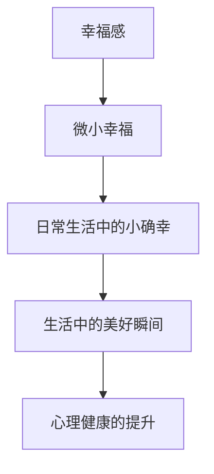

                 


### 确定文章框架

#### 引言
- 引入主题：通过一个小故事或案例来引入“提升日常生活品质：发现微小幸福的能力”这个话题。
- 文章目的：明确文章要解决的问题和目标，比如如何让读者在生活中更快乐、更满足。

#### 定义与概念
- 日常生活品质：解释什么是日常生活品质，为什么它重要。
- 微小幸福：定义微小幸福，解释它与幸福感的关系。

#### 提升方法
- 调整生活习惯：讨论如何调整时间管理、作息习惯、饮食和运动。
- 培养积极心态：探讨正面思考、情绪管理、压力释放的技巧。
- 人际关系与社交互动：分析家庭关系、友谊和社交技能的重要性。

#### 实践与体验
- 日常记录：介绍如何记录微小幸福，以及这样做的好处。
- 感受美好瞬间：指导读者如何捕捉生活中的美好时刻。
- 分享与传播：探讨微小幸福分享的方式和意义。

#### 案例研究与思考
- 国内外案例：分析不同文化背景下的微小幸福实践。
- 可持续发展：讨论微小幸福与环境保护、社区建设的关系。

#### 附录
- 书籍与资源推荐：推荐相关书籍、网站和APP。
- 调查问卷模板：提供一个微小幸福调查问卷模板。

#### 结语
- 总结：回顾文章的主要内容，强调发现微小幸福的重要性。
- 展望：鼓励读者在生活中实践，并提出对未来生活的期待。

### 准备材料

- 收集相关的案例和研究资料，确保文章的实证基础。
- 准备一些引人入胜的故事或实例来支撑观点。

### 开始写作

- 使用Markdown格式编写文章，确保结构清晰、逻辑连贯。
- 添加Mermaid流程图来展示核心概念之间的关系。
- 使用伪代码详细解释提升日常生活品质的方法。
- 使用LaTeX格式嵌入数学公式，确保公式的可读性。

### 检查与修订

- 完成初稿后，仔细检查文章的逻辑结构、语法和拼写。
- 请同事或朋友审阅文章，收集反馈进行修订。

### 定稿与发布

- 确保文章的完整性，包括所有附录和参考文献。
- 在文章末尾添加作者信息。
- 发布文章，分享到社交媒体平台，扩大影响力。

### 核心概念与联系

#### 微小幸福与幸福感

- 微小幸福是幸福感的重要组成部分，它们是幸福感中那些微小而具体的时刻。
- 微小幸福与幸福感的关系可以用以下Mermaid流程图来展示：



#### 核心算法原理讲解

- 提升日常生活品质的核心在于生活习惯、积极心态、人际关系和心灵滋养。

```plaintext
// 提升日常生活品质伪代码

function improve_daily_life_quality() {
    // 1. 调整生活习惯
    adjust_lifestyle();

    // 2. 培养积极心态
    cultivate_positive_mindset();

    // 3. 人际关系与社交互动
    maintain_social_relations();

    // 4. 心灵滋养
    nourish_soul();
}
```

#### 数学模型和公式

- 在讨论心理健康提升时，可以使用以下数学模型来解释微小幸福对幸福感的影响：

```latex
$$
幸福感 = f(微小幸福, 积极心态, 人际关系, 心灵滋养)
$$

// 其中 f 是一个复杂的多变量函数，代表了幸福感与各个因素之间的关系。
```

### 详细讲解与举例说明

- 在每个部分中，详细讲解提升日常生活品质的方法，并给出具体的例子。

#### 调整生活习惯

- **合理规划时间**：例如，使用时间管理工具如番茄钟来提高工作效率。

- **保持良好的作息习惯**：如每天晚上10点前睡觉，早上7点起床。

- **健康饮食与运动**：如每周至少锻炼三次，每次30分钟以上。

#### 培养积极心态

- **正面思考的力量**：例如，面对失败时，学会从失败中学习，而不是沉浸在消极情绪中。

- **情绪管理与压力释放**：如通过冥想或瑜伽来缓解压力。

- **积极心理学应用**：如使用积极心理学的技巧，如感恩日记来提升幸福感。

#### 人际关系与社交互动

- **家庭关系的维系**：如定期与家人沟通，安排家庭活动。

- **友谊的重要性**：如定期与朋友聚会，分享彼此的生活。

- **社交技能的培养**：如学习倾听和表达的技巧，提高人际交往能力。

#### 心灵滋养

- **精神追求与信仰**：如阅读经典文学作品，参加宗教或哲学讨论。

- **文艺作品的欣赏**：如欣赏音乐、绘画、电影等艺术作品。

- **自然环境的体验**：如进行徒步、露营等活动，感受大自然的美。

### 最佳实践 Tips、小结、注意事项、拓展阅读等内容

- 在每个部分的结尾，提供最佳实践Tips，如：
  - **调整生活习惯**：制定一个实际可行的计划，逐步实施。
  - **培养积极心态**：保持耐心，不要期望立即看到改变。

- **小结**：总结每个部分的核心内容，强调其在提升日常生活品质中的作用。

- **注意事项**：提醒读者在实践过程中可能遇到的问题，并提供解决方案。

- **拓展阅读**：推荐相关的书籍、文章和研究报告，以供进一步阅读。

---

### 开始撰写文章

- 根据上述框架和准备材料，开始撰写文章的各个部分。
- 使用Markdown格式，确保文章结构清晰、逻辑连贯。
- 在撰写过程中，不断修订和完善，确保内容的准确性和深度。

---

### 完成并检查文章

- 完成初稿后，仔细检查文章的结构、内容、语法和拼写。
- 请同事或朋友审阅文章，收集反馈，并进行修订。
- 确保文章的完整性，包括所有附录和参考文献。

### 发布与分享

- 将文章发布到个人博客或技术社区，如Medium、知乎等。
- 分享到社交媒体平台，如Twitter、Facebook、LinkedIn等，以扩大影响力。

### 结语

- 在文章的结尾部分，再次强调发现微小幸福的重要性，并鼓励读者在生活中实践。
- 展望未来，期待读者能够通过发现微小幸福，提升自己的日常生活品质。

