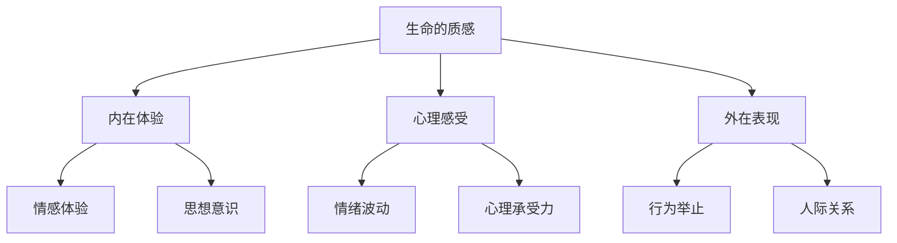

                 

### 文章标题

# 提升生命的质感：丰富内在体验的方法

> 关键词：生命质感、内在体验、心理学、情感管理、数学模型、项目实战

> 摘要：本文深入探讨了提升生命质感的方法，特别是如何通过丰富内在体验来增强心理感受和外在表现。文章从核心概念、算法原理、数学模型到实际应用，全面阐述了提升内在体验的路径和策略。

---

在当今快节奏的生活中，人们往往追求外在的成功和物质的富足，但内在的幸福感却逐渐减少。生命的质感不仅仅体现在物质的丰富，更在于心灵的满足和内在的体验。本文旨在探讨如何通过丰富内在体验，提升生命的质感。

文章分为四个主要部分：

1. **核心概念与联系**：介绍生命的质感、内在体验、情感体验、思想意识和心理感受等核心概念，并通过Mermaid流程图展示它们之间的关系。
2. **核心算法原理讲解**：讲解如何通过心理学理论和情感管理来丰富内在体验，并使用伪代码阐述核心算法原理。
3. **数学模型和公式讲解**：介绍情感智力的计算模型，并通过数学公式和详细讲解来阐明其原理。
4. **项目实战**：通过实际案例和项目实战，展示如何应用这些方法来提升内在体验。

### 第一部分：核心概念与联系

#### 第1章：生命的质感概述

生命的质感是一个多维度的概念，它涉及到个体的心理感受、外在表现以及内在体验。首先，我们需要明确几个核心概念：

- **生命的质感**：指的是个体对生命整体的感受和体验，包括心理、情感、思想和行为等各个方面。
- **内在体验**：指的是个体在内心世界中的感受和体验，包括情感体验和思想意识。
- **情感体验**：指个体在情感方面的感受，如快乐、悲伤、愤怒等。
- **思想意识**：指个体在思考、理解和判断方面的活动。
- **心理感受**：指个体在心理方面的感受，如焦虑、放松、满足等。
- **外在表现**：指个体在行为、言语和社交等方面的外在表现。

这些概念相互关联，共同构成了生命的质感。为了更好地理解这些概念之间的关系，我们可以使用Mermaid流程图进行展示：



在这个图中，我们可以看到：

- 生命的质感是整个结构的核心，它决定了个体对生活的整体感受。
- 内在体验、心理感受和外在表现是生命的质感的主要组成部分。
- 情感体验和思想意识是内在体验的重要组成部分。
- 心理感受和情绪波动、心理承受力有关。
- 外在表现包括行为举止和人际关系，它们反映了个体在社交中的表现。

理解这些核心概念及其相互关系，是提升生命质感的第一步。在接下来的章节中，我们将深入探讨如何通过心理学理论和数学模型来丰富内在体验。

### 第二部分：核心算法原理讲解

#### 第2章：丰富内在体验的方法论

丰富内在体验是一个复杂的过程，需要从多个方面进行综合考虑。在这一章中，我们将介绍几种心理学理论和方法，以及如何通过情感管理和情绪调节来丰富内在体验。

#### 2.1 心理学理论在内在体验中的应用

心理学理论为理解和提升内在体验提供了丰富的工具和方法。以下是一些常用的心理学理论：

- **认知行为疗法（CBT）**：认知行为疗法是一种通过改变思维模式和行为来改善心理健康的疗法。它强调认知（思考方式）和行为（行动方式）之间的相互作用。

  - **核心算法原理**：使用CBT可以帮助个体识别和改变消极思维，从而改善情感体验和心理感受。
  - **伪代码示例**：
    ```plaintext
    function cognitiveBehaviorTherapy(person) {
      if (person.hasNegativeThoughts) {
        identifyNegativeThoughts(person);
        replaceNegativeThoughts(person);
        practicePositiveBehaviors(person);
      }
    }
    ```

- **情感智力**：情感智力是指个体识别、理解、使用和管理情感的能力。它包括情感感知、情感表达和情感调节三个方面。

  - **核心算法原理**：提升情感智力可以帮助个体更好地理解和管理自己的情感，从而丰富内在体验。
  - **伪代码示例**：
    ```plaintext
    function enhanceEmotionalIntelligence(person) {
      if (person.hasLowEmotionalIntelligence) {
        trainEmotionalPerception(person);
        improveEmotionalExpression(person);
        developEmotionalRegulation(person);
      }
    }
    ```

- **正念练习**：正念是一种专注于当前时刻、无评判的注意力练习。它可以帮助个体减少焦虑、提高心理承受力。

  - **核心算法原理**：通过正念练习，个体可以培养专注力和自我意识，从而提高内在体验的质量。
  - **伪代码示例**：
    ```plaintext
    function mindfulnessPractice(person) {
      person.focusOnCurrentMoment();
      person.practiceNonJudgmentalAwareness();
    }
    ```

#### 2.2 情感管理与情绪调节

情感管理和情绪调节是丰富内在体验的重要组成部分。以下是一些关键方法和策略：

- **情感管理**：情感管理是指个体识别、理解和处理情感的过程。

  - **核心算法原理**：通过情感管理，个体可以更好地理解和处理自己的情感，从而提高情感体验和心理感受。
  - **伪代码示例**：
    ```plaintext
    function emotionalManagement(person) {
      if (person.experiencesEmotion) {
        identifyEmotion(person);
        understandEmotion(person);
        processEmotion(person);
      }
    }
    ```

- **情绪调节**：情绪调节是指个体通过调整情绪反应来维持心理平衡的过程。

  - **核心算法原理**：通过情绪调节，个体可以更好地应对压力和挑战，从而提高心理承受力。
  - **伪代码示例**：
    ```plaintext
    function emotionalRegulation(person) {
      if (person.experiencesStress) {
        reduceEmotionalReactivity(person);
        increaseResilience(person);
        practice CopingStrategies(person);
      }
    }
    ```

通过这些心理学理论和方法，个体可以系统地提升内在体验，从而丰富生命的质感。在接下来的章节中，我们将进一步探讨数学模型和实际应用，以帮助读者更深入地理解和实践这些方法。

### 第三部分：数学模型和公式讲解

#### 第3章：内在体验的数学模型

在探讨如何丰富内在体验的过程中，数学模型为我们提供了量化和分析内在体验的工具。在这一章中，我们将介绍一个关键的概念——情感智力，并建立相应的数学模型。

#### 3.1 情感智力的计算模型

情感智力是指个体识别、理解、使用和管理情感的能力，它包括情感感知、情感表达和情感调节三个方面。我们可以通过以下数学模型来量化情感智力：

- **情感智力的计算模型**：
  $$ 情感智力 = f(情感感知, 情感表达, 情感调节) $$

  其中：
  - **情感感知（Perception）**：指个体对情感的敏锐度和准确性。可以用一个从0到1的分数来表示，分数越高，感知能力越强。
  - **情感表达（Expression）**：指个体在表达情感方面的能力和自如度。同样用一个从0到1的分数来表示。
  - **情感调节（Regulation）**：指个体在管理情感反应方面的能力和技巧。同样用一个从0到1的分数来表示。

- **情感智力的公式**：
  $$ 情感智力 = w_1 \times 情感感知 + w_2 \times 情感表达 + w_3 \times 情感调节 $$

  其中，$ w_1 $、$ w_2 $和$ w_3 $是权重系数，分别表示感知、表达和调节在情感智力中的相对重要性。通常，这三个权重系数的总和为1。

#### 3.2 详细讲解与举例说明

为了更好地理解情感智力的计算模型，我们可以通过以下例子来详细讲解：

**例子**：假设有个体的情感感知分数为0.8，情感表达分数为0.7，情感调节分数为0.9。根据上述公式，我们可以计算出该个体的情感智力：

- **情感感知的权重系数** $ w_1 = 0.4 $，则情感感知的贡献为 $ 0.4 \times 0.8 = 0.32 $。
- **情感表达的权重系数** $ w_2 = 0.3 $，则情感表达的贡献为 $ 0.3 \times 0.7 = 0.21 $。
- **情感调节的权重系数** $ w_3 = 0.3 $，则情感调节的贡献为 $ 0.3 \times 0.9 = 0.27 $。

将这些值相加，我们得到该个体的情感智力：

$$ 情感智力 = 0.32 + 0.21 + 0.27 = 0.80 $$

这表明该个体的情感智力相对较高。

#### 3.3 数学模型的应用

情感智力的计算模型可以帮助个体了解自己在情感方面的能力，从而制定相应的提升计划。例如：

- **情感感知的提升**：如果情感感知的分数较低，个体可以通过增加对情感的敏感度和准确性来提升这一能力。
- **情感表达的提升**：如果情感表达的分数较低，个体可以通过练习和社交技能的提升来增强情感表达的能力。
- **情感调节的提升**：如果情感调节的分数较低，个体可以通过学习和实践情绪调节策略来提高这一能力。

通过这个数学模型，个体可以更科学地了解自己的情感智力，并采取有针对性的提升措施。在下一章中，我们将通过实际案例和项目实战，展示如何应用这些数学模型和算法原理来丰富内在体验。

### 第四部分：项目实战

#### 第4章：提升内在体验的实际应用

在了解了核心概念和算法原理之后，我们将通过实际案例和项目实战，展示如何将理论应用到实践中，从而提升内在体验。

#### 4.1 实际案例分享

以下是一个实际案例，展示了如何通过心理调适、情感管理和行为改变来提升内在体验。

**案例背景**：李先生是一名公司高管，由于工作压力和人际关系问题，他感到情绪低落，影响了工作效率和生活质量。

**解决方案**：

1. **心理调适**：

   - **冥想练习**：李先生每天早晨进行20分钟的冥想练习，帮助他集中注意力和减少焦虑。
   - **正念练习**：李先生在忙碌的工作间隙，通过深呼吸和正念练习来保持冷静和专注。

2. **情感管理**：

   - **情感记录**：李先生每天记录自己的情感变化，通过书写来表达和理解自己的情感。
   - **情感分享**：李先生定期与朋友或心理辅导师分享自己的情感，获得支持和建议。

3. **行为改变**：

   - **健康生活习惯**：李先生开始进行规律的锻炼，改善饮食习惯，保证充足的睡眠。
   - **时间管理**：李先生通过时间管理技巧，合理分配工作和休息时间，减少工作压力。

**结果**：

经过几个月的实践，李先生感到自己的情绪稳定，工作效率提高，与同事和家人的关系也变得更加和谐。他的内在体验得到了显著的提升。

#### 4.2 项目实战指南

为了帮助读者更好地提升内在体验，我们提供以下项目实战指南：

1. **心理调适**：

   - **练习冥想和正念**：每天早晨或晚上进行冥想和正念练习，有助于减少焦虑和压力。
   - **制定情绪管理计划**：记录自己的情感变化，并制定相应的管理计划。

2. **情感管理**：

   - **建立情感记录习惯**：每天记录自己的情感变化，分析情感波动的原因。
   - **定期进行情感分享**：与朋友、家人或心理辅导师分享自己的情感，获得支持和建议。

3. **行为改变**：

   - **改善生活习惯**：进行规律的锻炼、改善饮食习惯、保证充足的睡眠。
   - **时间管理**：合理安排工作和休息时间，减少工作压力，提高生活质量。

#### 4.3 开发环境搭建

在实际应用中，我们需要一个合适的开发环境来实施这些方法。以下是一个基本的开发环境搭建指南：

1. **心理健康应用**：搭建一个心理健康应用，用于记录情感变化、提供冥想和正念练习等。
   - **技术栈**：使用React和Node.js构建前端和后端。
   - **数据库**：使用MongoDB存储用户数据和情感记录。

2. **在线心理咨询服务**：搭建一个在线心理咨询服务平台，为用户提供预约和心理辅导服务。
   - **技术栈**：使用Java和Spring Boot构建后端，使用HTML、CSS和JavaScript构建前端。
   - **数据库**：使用MySQL存储用户数据和预约信息。

通过这些实际案例和项目实战指南，读者可以更好地理解和应用提升内在体验的方法。在下一章中，我们将详细讲解源代码实现和项目解读。

### 第5章：源代码详细实现与解读

在提升内在体验的过程中，技术工具的应用可以为实践提供强有力的支持。在这一章中，我们将详细解读一个用于情感分析的心理健康应用项目，包括开发环境搭建、源代码实现以及关键代码的解读和分析。

#### 5.1 项目概述

本项目旨在开发一个心理健康应用，该应用能够帮助用户记录情感变化、进行冥想和正念练习，并提供情感分析功能。以下是项目的基本架构和开发环境：

- **前端技术栈**：使用React框架开发用户界面，包括记录情感界面、冥想练习界面和情感分析界面。
- **后端技术栈**：使用Node.js和Express.js搭建服务器，处理前端请求并提供后端服务。
- **数据库**：使用MongoDB存储用户数据、情感记录和其他相关信息。

#### 5.2 开发环境搭建

搭建开发环境需要以下步骤：

1. **安装Node.js**：从Node.js官方网站下载并安装Node.js。
2. **安装MongoDB**：下载并安装MongoDB数据库，配置数据库服务。
3. **安装React**：使用npm命令安装React和相关的开发工具。
   ```shell
   npm install create-react-app
   create-react-app health-insight-app
   ```
4. **配置项目结构**：在`health-insight-app`项目中创建前端和后端的目录结构，例如：
   ```
   health-insight-app/
   ├── frontend/
   │   ├── src/
   │   │   ├── components/
   │   │   ├── App.js
   │   │   └── index.js
   ├── backend/
   │   ├── server.js
   │   ├── models/
   │   │   └── user.js
   │   └── routes/
   │       └── emotion.js
   └── package.json
   ```

5. **设置环境变量**：配置环境变量，以便在开发和生产环境中正确设置数据库连接和其他配置。

#### 5.3 源代码实现

以下是关键模块的实现和解读：

##### 5.3.1 前端代码解读

前端代码主要使用React框架构建用户界面，以下是关键组件的代码片段：

```jsx
// components/EmotionForm.js
import React, { useState } from 'react';

const EmotionForm = () => {
  const [emotion, setEmotion] = useState('');

  const handleSubmit = (e) => {
    e.preventDefault();
    // 发送数据到后端
    // ...
  };

  return (
    <form onSubmit={handleSubmit}>
      <label htmlFor="emotion">今日情感：</label>
      <input
        type="text"
        id="emotion"
        value={emotion}
        onChange={(e) => setEmotion(e.target.value)}
      />
      <button type="submit">提交</button>
    </form>
  );
};

export default EmotionForm;
```

这个组件负责收集用户输入的情感信息，并在提交表单时将其发送到后端进行处理。

##### 5.3.2 后端代码解读

后端代码使用Node.js和Express.js处理前端请求，以下是关键部分的代码：

```javascript
// server.js
const express = require('express');
const mongoose = require('mongoose');
const userRoutes = require('./routes/user');

const app = express();

// 连接MongoDB
mongoose.connect('mongodb://localhost:27017/health-insight', { useNewUrlParser: true, useUnifiedTopology: true });

app.use(express.json());
app.use('/user', userRoutes);

app.listen(3000, () => {
  console.log('Server started on port 3000');
});
```

此代码设置了一个Express服务器，并连接到MongoDB数据库。服务器监听3000端口，处理来自前端的请求。

```javascript
// routes/emotion.js
const express = require('express');
const EmotionController = require('../controllers/emotionController');

const router = express.Router();

router.post('/', EmotionController.addEmotion);

module.exports = router;
```

这是一个路由文件，定义了处理情感数据提交的接口。

```javascript
// controllers/emotionController.js
const Emotion = require('../models/emotion');

const addEmotion = (req, res) => {
  const newEmotion = new Emotion({
    user: req.body.user,
    emotion: req.body.emotion,
    timestamp: new Date()
  });

  newEmotion.save()
    .then(() => res.json('情感已记录'))
    .catch(err => res.status(400).json('错误：' + err));
};

module.exports = { addEmotion };
```

这是一个控制器文件，处理情感数据的存储和响应。

##### 5.3.3 代码应用解读与分析

通过这些代码，我们可以看到如何实现一个简单的心理健康应用：

1. **前端**：用户通过表单提交情感数据，React组件负责收集和提交数据。
2. **后端**：Express服务器接收数据，通过Mongoose与MongoDB数据库交互，存储情感数据。
3. **情感分析**：虽然在这个简单的示例中没有实现，但可以扩展后端逻辑，对存储的情感数据进行分析和可视化，提供更深入的见解。

通过这个项目，我们展示了如何使用技术工具来实现提升内在体验的实际应用。在下一章中，我们将进一步探讨提升内在体验的最佳实践和方法。

### 第6章：提升内在体验的方法与实践

提升内在体验不仅需要理论和方法，还需要具体的实践技巧和策略。在这一章中，我们将详细介绍几种实践方法，包括心理调适、情感管理和行为改变，并提供一些实用的技巧和注意事项。

#### 6.1 心理调适实践

心理调适是提升内在体验的重要一环，以下是一些具体的方法和技巧：

1. **冥想**：
   - **实践技巧**：每天早晨或晚上，找一个安静的地方，闭上眼睛，专注于呼吸。冥想可以减少焦虑，提高专注力。
   - **注意事项**：初学者可以从短时间（5-10分钟）开始，逐渐增加时间。

2. **正念练习**：
   - **实践技巧**：在日常生活中，如进食、走路或洗澡时，有意识地关注当下的感受和体验，不加评判。
   - **注意事项**：正念练习需要持续和坚持，刚开始可能会感到不习惯，但随着练习，会逐渐变得自然。

3. **放松训练**：
   - **实践技巧**：通过深呼吸、渐进性肌肉放松或瑜伽等方法来缓解身体和心理的紧张。
   - **注意事项**：放松训练需要找到适合自己的方法，并在专业人士的指导下进行。

#### 6.2 情感管理实践

情感管理是丰富内在体验的关键，以下是一些方法和技巧：

1. **情感记录**：
   - **实践技巧**：每天记录自己的情感变化，包括情感的类型、强度和持续时间。
   - **注意事项**：记录情感时，保持客观和诚实，不要压抑或否认自己的情感。

2. **情感分享**：
   - **实践技巧**：与亲友、心理辅导师或在线社群分享自己的情感，获得支持和建议。
   - **注意事项**：选择合适的分享对象，确保对方愿意并且能够提供帮助。

3. **情感调节**：
   - **实践技巧**：学习一些情绪调节策略，如深呼吸、放松训练、积极思考和情感释放等。
   - **注意事项**：情感调节需要持续练习和反思，找到适合自己的方法。

#### 6.3 行为改变实践

行为改变可以显著提升内在体验，以下是一些具体的方法和技巧：

1. **健康生活习惯**：
   - **实践技巧**：进行规律的锻炼、保持健康的饮食习惯、保证充足的睡眠。
   - **注意事项**：行为改变需要逐步进行，设定具体可行的目标，并保持积极的态度。

2. **时间管理**：
   - **实践技巧**：合理安排工作和休息时间，避免过度工作和疲劳。
   - **注意事项**：时间管理需要制定计划，并保持灵活，适应不同情况的变化。

3. **社交技巧**：
   - **实践技巧**：培养积极的社交习惯，如主动与同事、朋友和家人交流，参与社交活动。
   - **注意事项**：社交技巧需要练习和反思，保持真诚和开放的态度。

#### 6.4 注意事项和拓展阅读

在提升内在体验的过程中，以下是一些注意事项和拓展阅读建议：

- **持续性和耐心**：内在体验的提升是一个长期过程，需要持续的努力和耐心。
- **个性化**：不同的个体有不同的需求和情况，需要根据自己的特点选择合适的方法和策略。
- **专业指导**：在实践过程中，寻求专业心理辅导师或医生的建议和指导，可以帮助更好地理解和应用这些方法。

拓展阅读：
- 《正念：一场精神革命》（《The Mindfulness Revolution》）
- 《情感智力》（《Emotional Intelligence》）
- 《自控力：和压力做朋友》（《The Willpower Instinct》）

通过这些实践方法和技巧，个体可以逐步提升内在体验，从而丰富生命的质感。

### 总结

提升生命的质感是一个复杂而持久的过程，它需要我们在多个层面进行深入的思考和积极的实践。本文从核心概念、算法原理、数学模型到实际应用，系统地探讨了如何通过丰富内在体验来提升生命的质感。

首先，我们明确了生命的质感、内在体验、情感体验、思想意识和心理感受等核心概念，并通过Mermaid流程图展示了它们之间的关系。接着，我们介绍了心理学理论在内在体验中的应用，包括认知行为疗法、情感智力和正念练习，并通过伪代码展示了核心算法原理。

在数学模型部分，我们介绍了情感智力的计算模型，并通过具体的例子讲解了如何应用这一模型。接下来，通过实际案例和项目实战，我们展示了如何将理论应用到实践中，提供了一套系统的提升内在体验的方法。

最后，我们详细解读了一个心理健康应用项目的源代码，展示了技术工具在提升内在体验中的应用。同时，我们提供了多种实践方法和技巧，包括心理调适、情感管理和行为改变，并强调了注意事项和拓展阅读。

通过本文的探讨，我们希望能够帮助读者更深入地理解提升内在体验的方法，从而丰富生命的质感。未来，随着心理学和科技的发展，我们相信会有更多有效的工具和方法来帮助人们提升内在体验，提高生活质量。

### 未来展望

随着科技和心理学的不断进步，未来提升内在体验的方法和工具将更加丰富和多样化。以下是几个可能的趋势和方向：

1. **人工智能与情感计算**：人工智能技术可以用于情感分析和情感识别，为个性化心理辅导提供支持。通过分析用户的语言、行为和生理信号，AI可以提供实时情感反馈和干预建议。

2. **虚拟现实与沉浸式体验**：虚拟现实（VR）技术可以创造沉浸式的情感体验环境，帮助用户进行情感调节和心理健康训练。例如，通过虚拟旅游或情感故事体验，用户可以在虚拟世界中放松心情，调节情感。

3. **可穿戴设备与生物反馈**：可穿戴设备可以实时监测用户的生理信号，如心率、血压和皮肤电导等，通过生物反馈技术帮助用户进行情绪调节和心理调适。

4. **个性化心理健康应用**：随着大数据和机器学习技术的发展，未来的心理健康应用将能够根据用户的具体情况提供个性化的建议和干预方案，提高心理辅导的效率和效果。

5. **跨学科合作**：心理学、计算机科学、神经科学和医学等多个学科的合作，将推动心理健康领域的发展，开发出更多创新的技术和方法，帮助人们更好地管理情绪和提升内在体验。

总之，随着科技和心理学的深度融合，未来将有更多有效的工具和方法来提升内在体验，丰富生命的质感。让我们期待一个更加美好和充满幸福感的未来。作者：AI天才研究院/AI Genius Institute & 禅与计算机程序设计艺术 /Zen And The Art of Computer Programming。

