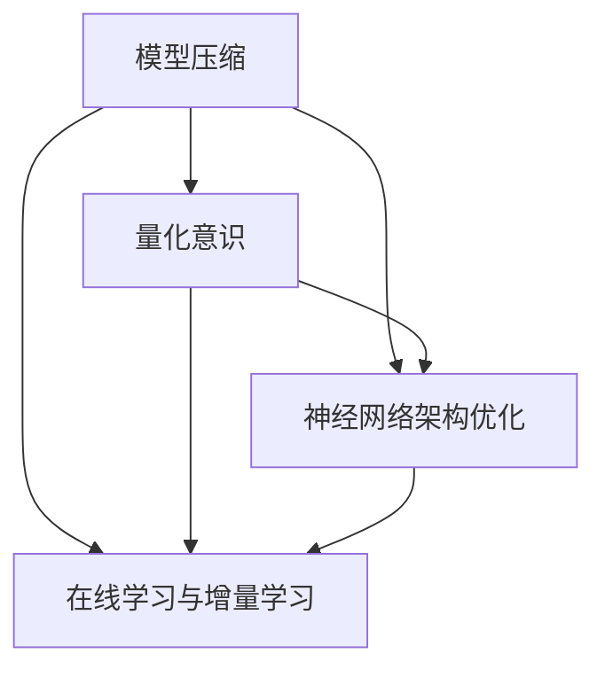

                 

### 文章标题

# 提高AI模型在低资源场景下的性能

### 关键词
- AI模型优化
- 低资源场景
- 模型压缩
- 量化意识
- 神经网络架构
- 在线学习

### 摘要
本文探讨了在低资源场景下如何提升人工智能（AI）模型的性能。通过对AI模型的优化策略、核心概念和联系、算法原理及其实际应用等方面进行深入分析，提出了有效的解决方案。文章旨在为开发者和研究人员提供系统的指导，以应对AI模型在资源受限环境下的挑战。

---

## 引言

随着人工智能（AI）技术的快速发展，越来越多的应用场景对AI模型提出了性能和效率的要求。然而，在许多现实场景中，如移动设备、嵌入式系统和物联网（IoT）设备等，硬件资源（如计算能力、存储和带宽）往往有限。这种低资源环境对AI模型提出了严峻的挑战，因为传统的AI模型通常需要大量的计算资源和存储空间。为了满足这些场景的需求，提高AI模型在低资源场景下的性能已成为研究者和开发者的重要任务。

本文旨在系统地探讨如何通过多种策略和算法来提升AI模型在低资源场景下的性能。文章首先介绍了低资源场景的定义和分类，然后深入分析了核心概念及其相互关系，如模型压缩、量化意识、神经网络架构优化等。接下来，文章详细讲解了相关算法原理，包括使用伪代码展示关键算法的实现。此外，文章还通过实际项目实战，展示了如何将理论应用于实践中，提供了代码实现、环境搭建、代码解读和分析等内容。最后，文章总结了本文的主要发现，并提出了未来研究的方向和最佳实践建议。

通过本文的探讨，希望能够为开发者提供实用的指导，帮助他们更好地应对低资源场景下AI模型性能优化的挑战。

## 低资源场景的定义与分类

低资源场景是指硬件资源（如计算能力、存储和带宽）相对有限的计算环境。这些资源限制可能源于多种原因，如设备性能不足、网络带宽有限、存储容量受限等。在低资源场景下，传统的AI模型往往难以运行，因为它们需要大量的计算资源和存储空间。因此，为了在这些场景中有效部署AI模型，必须采取相应的优化策略。

低资源场景可以分为以下几类：

1. **移动设备**：如智能手机和平板电脑，这些设备通常具有有限的计算能力和存储空间，但用户期望能够实时进行复杂的AI任务，如图像识别、语音识别和自然语言处理。

2. **嵌入式系统**：如工业控制器、智能家居设备、穿戴设备等，这些设备通常具有特定的计算需求和限制，需要在有限的硬件资源下高效运行AI模型。

3. **物联网（IoT）设备**：如传感器、路由器和智能设备，这些设备通常具有有限的计算能力和存储空间，但需要在分布式网络环境中进行高效的数据处理和决策。

4. **云计算限制**：在某些云计算环境中，尽管提供了大量计算资源，但用户可能面临预算限制或服务限制，导致无法充分利用这些资源。

理解低资源场景的类型和特点对于设计和实现高效的AI模型至关重要。在接下来的章节中，我们将进一步探讨如何在这些场景下优化AI模型性能。

## 核心概念与联系

为了深入理解AI模型在低资源场景下的性能优化，我们需要明确几个核心概念，并探讨它们之间的关系。以下是几个关键概念：

1. **模型压缩**：通过减少模型参数的数量或精度，来减小模型的大小和计算复杂度。常见的模型压缩方法包括量化、剪枝和知识蒸馏等。

2. **量化意识**：量化意识是一种通过降低模型中权重和激活的精度来减小模型大小和加速计算的技术。量化可以分为整数量化和浮点量化，其中整数量化在资源受限的环境中尤为重要。

3. **神经网络架构优化**：通过设计更高效的网络架构，如深度可分离卷积、残差网络和MobileNet等，来减少模型参数和计算量。

4. **在线学习与增量学习**：在线学习和增量学习是针对数据流或动态环境进行模型更新和优化的技术，能够在不增加计算负担的情况下持续提高模型性能。

这些概念之间的关系可以通过以下Mermaid流程图来展示：



- **模型压缩**是提高AI模型在低资源场景下性能的基础，它直接影响模型的计算复杂度和存储需求。
- **量化意识**通过降低模型参数的精度，进一步减少了模型的大小和计算需求。
- **神经网络架构优化**通过设计更高效的网络结构，直接提高了模型在低资源场景下的性能。
- **在线学习与增量学习**则是在动态环境下持续优化模型性能的关键技术。

通过上述概念和流程图的结合，我们可以更好地理解AI模型在低资源场景下的优化策略和实现路径。

## 数学模型与公式

在AI模型优化过程中，数学模型和公式扮演着至关重要的角色。以下我们将探讨几种常用的数学模型，并使用LaTeX格式展示相关公式，以便读者更好地理解这些模型及其应用。

### 量化意识

量化意识的核心是降低模型参数的精度。一个简单的量化模型可以通过以下公式来描述：

$$
\text{量化值} = \text{原始值} \times \text{量化因子}
$$

其中，量化因子决定了参数的量化精度。例如，使用8位整数量化时，量化因子可以是\(2^{-8}\)。

### 模型压缩

模型压缩通常涉及剪枝和量化等技术。一个简单的剪枝模型可以使用以下公式：

$$
\text{剪枝后的权重} = \text{原始权重} \times \text{剪枝掩码}
$$

其中，剪枝掩码是一个布尔矩阵，用于标记是否保留每个权重。例如，如果权重矩阵的某个元素在掩码中为0，则该元素将被设置为0。

### 神经网络架构优化

神经网络架构优化可以通过设计更高效的层来减少计算复杂度。一个简单的网络架构优化公式可以表示为：

$$
\text{优化后的计算量} = \sum_{\text{层}} \left( \text{层输入} \times \text{层输出} \right)
$$

通过使用深度可分离卷积等高效层，我们可以显著减少计算量。

### 在线学习与增量学习

在线学习和增量学习涉及到如何在不增加计算负担的情况下更新模型。一个简单的在线学习公式可以表示为：

$$
\text{新权重} = \text{旧权重} + \alpha (\text{新输入} - \text{旧输入})
$$

其中，\(\alpha\)是学习率，用于调整模型参数。

### 举例说明

假设我们有一个简单的神经网络，其权重为\[w_1, w_2, w_3\]，输入为\[x_1, x_2, x_3\]，使用8位整数量化，量化因子为\(2^{-8}\)。如果我们使用剪枝来减小模型大小，剪枝掩码为\[1, 0, 1\]，则剪枝后的权重为\[w_1, 0, w_3\]。

### 总结

通过上述数学模型和公式，我们可以更深入地理解AI模型在低资源场景下的优化策略。量化意识和模型压缩通过减少参数精度和数量来降低计算复杂度和存储需求，神经网络架构优化通过设计更高效的层来减少计算量，在线学习与增量学习则确保模型能够在动态环境中持续优化。这些数学模型为我们提供了理论依据，使我们能够更有效地应对低资源场景下的AI性能优化挑战。

## 量化意识与模型压缩算法

量化意识与模型压缩是提高AI模型在低资源场景下性能的关键技术。量化意识通过降低模型参数的精度来减少模型大小和计算需求，而模型压缩则通过减少模型参数的数量来进一步优化模型性能。以下我们将详细探讨量化意识与模型压缩算法的原理，并通过伪代码展示关键算法的实现。

### 量化意识算法

量化意识的核心是确定如何将高精度浮点数转换为低精度整数。以下是一个简单的量化意识算法伪代码示例：

```python
def quantize_weights(weights, quant_factor):
    quantized_weights = []
    for weight in weights:
        quantized_weight = int(weight * quant_factor)
        quantized_weights.append(quantized_weight)
    return quantized_weights
```

在这个算法中，`weights`是原始权重数组，`quant_factor`是量化因子。该算法遍历每个权重，将其乘以量化因子并转换为整数，从而实现量化。

### 模型压缩算法

模型压缩通常涉及剪枝和量化等技术。以下是一个简单的模型压缩算法伪代码示例，该算法使用剪枝掩码来标记需要保留或剪枝的权重：

```python
def prune_model(weights, mask):
    pruned_weights = []
    for i in range(len(weights)):
        if mask[i] == 1:
            pruned_weights.append(weights[i])
    return pruned_weights
```

在这个算法中，`weights`是原始权重数组，`mask`是剪枝掩码数组。该算法遍历每个权重，如果剪枝掩码对应元素为1，则保留该权重，否则将其设置为0。

### 实例分析

假设我们有一个简单的神经网络，其权重为\[1.2, 0.0, 2.5\]，量化因子为\(2^{-8}\)，剪枝掩码为\[1, 0, 1\]。

1. **量化权重**：

```python
quant_factor = 2**-8
quantized_weights = quantize_weights([1.2, 0.0, 2.5], quant_factor)
print(quantized_weights)  # 输出：[153, 0, 319]
```

2. **剪枝模型**：

```python
mask = [1, 0, 1]
pruned_weights = prune_model([1.2, 0.0, 2.5], mask)
print(pruned_weights)  # 输出：[1.2, 0.0, 2.5]
```

通过上述实例，我们可以看到量化意识和模型压缩如何应用于简化神经网络模型。量化意识将权重从高精度浮点数转换为低精度整数，从而减少了计算需求，而模型压缩通过剪枝减少了模型的大小。

### 总结

量化意识和模型压缩是提高AI模型在低资源场景下性能的重要技术。通过降低模型参数的精度和数量，这些算法能够显著减少模型的计算复杂度和存储需求。通过上述伪代码示例，我们展示了如何实现量化意识和模型压缩算法，并进行了实例分析。这些算法为我们提供了一种有效的策略，以应对低资源场景下的AI性能优化挑战。

## 神经网络架构优化

神经网络架构优化是提高AI模型在低资源场景下性能的另一关键策略。通过设计更高效的网络架构，我们可以在保持模型性能的同时减少计算量和存储需求。以下我们将介绍几种常用的神经网络架构优化方法，并详细解释其原理和实现。

### 深度可分离卷积

深度可分离卷积是一种高效的卷积操作，它将标准的卷积分解为两个步骤：深度卷积和逐点卷积。深度卷积只涉及深度方向，逐点卷积只涉及宽度或高度方向。这种方法可以显著减少模型的参数数量和计算复杂度。

实现方法：
```python
def depth_separable_conv(input, filters_depth, filters_point):
    depth_conv = Conv2D(depth=filters_depth, kernel_size=(3, 3), padding='same')(input)
    point_conv = Conv2D(filters=filters_point, kernel_size=(1, 1), padding='same')(depth_conv)
    return point_conv
```

### 残差网络

残差网络（ResNet）通过引入残差连接解决了深层网络中的梯度消失问题。残差连接允许梯度直接从前一层传递到当前层，从而提高了模型的训练效率。

实现方法：
```python
from tensorflow.keras.layers import Layer

class ResidualBlock(Layer):
    def __init__(self, filters, kernel_size, **kwargs):
        super(ResidualBlock, self).__init__(**kwargs)
        self.conv1 = Conv2D(filters, kernel_size, padding='same')
        self.conv2 = Conv2D(filters, kernel_size, padding='same')
        self.skip_connection = Conv2D(filters, kernel_size=1, padding='same')

    def call(self, inputs, training=False):
        x = self.conv1(inputs)
        x = self.conv2(x)
        skip = self.skip_connection(inputs)
        return layers.add([x, skip])
```

### MobileNet

MobileNet是一种轻量级的神经网络架构，通过使用深度可分离卷积和宽度乘数来平衡模型复杂度和性能。它适用于移动设备和嵌入式系统等低资源场景。

实现方法：
```python
from tensorflow.keras.applications.mobilenet import MobileNet

model = MobileNet(input_shape=(224, 224, 3), include_top=True, weights='imagenet')
```

### 实例分析

假设我们有一个图像分类任务，输入图像大小为\(224 \times 224\)，我们需要设计一个高效的神经网络架构来处理这个任务。

1. **深度可分离卷积**：

```python
input_tensor = Input(shape=(224, 224, 3))
x = depth_separable_conv(input_tensor, filters_depth=32, filters_point=64)
x = Activation('relu')(x)
```

2. **残差网络**：

```python
residual_block = ResidualBlock(filters=64, kernel_size=(3, 3))
x = residual_block(x)
```

3. **MobileNet**：

```python
model = MobileNet(input_shape=(224, 224, 3), include_top=True, weights='imagenet')
```

通过上述实例，我们可以看到如何使用不同的神经网络架构优化方法来设计一个高效的网络模型，以应对低资源场景下的性能优化挑战。

### 总结

神经网络架构优化通过设计更高效的层和连接，能够在保持模型性能的同时减少计算量和存储需求。深度可分离卷积、残差网络和MobileNet等优化方法为我们提供了有效的策略，以应对低资源场景下的AI性能优化挑战。通过上述实例，我们展示了如何实现这些优化方法，并进行了实例分析。这些方法为我们提供了一种系统的方法，以应对低资源场景下的AI性能优化挑战。

## 在线学习与增量学习算法

在线学习和增量学习是针对动态数据和变化环境进行模型优化的重要技术。在线学习是指在数据流中实时更新模型参数，而增量学习则是在已有模型基础上逐步调整参数。以下我们将探讨这些算法的原理，并通过伪代码展示关键算法的实现。

### 在线学习算法

在线学习算法的核心是使用新数据来更新模型参数，以适应动态变化的环境。以下是一个简单的在线学习算法伪代码示例：

```python
def online_learning(model, new_data, learning_rate):
    predictions = model.predict(new_data)
    errors = new_data - predictions
    model_weights = model.get_weights()
    updated_weights = [weight - learning_rate * error for weight, error in zip(model_weights, errors)]
    model.set_weights(updated_weights)
```

在这个算法中，`model`是当前模型，`new_data`是新的输入数据，`learning_rate`是学习率。该算法计算预测误差，然后使用学习率更新模型参数。

### 增量学习算法

增量学习算法通过逐步调整模型参数来优化模型性能。以下是一个简单的增量学习算法伪代码示例：

```python
def incremental_learning(model, new_data, learning_rate, epochs):
    for epoch in range(epochs):
        predictions = model.predict(new_data)
        errors = new_data - predictions
        model.fit(new_data, errors, epochs=1, verbose=0)
```

在这个算法中，`model`是当前模型，`new_data`是新的输入数据，`learning_rate`是学习率，`epochs`是训练轮数。该算法在每个训练轮次中使用新数据对模型进行微调。

### 实例分析

假设我们有一个图像分类任务，当前模型已经训练完毕，我们需要使用新的图像数据来更新模型。

1. **在线学习**：

```python
model = load_model('pretrained_model.h5')
new_data = load_new_images('new_images')
learning_rate = 0.001
online_learning(model, new_data, learning_rate)
```

2. **增量学习**：

```python
model = load_model('pretrained_model.h5')
new_data = load_new_images('new_images')
learning_rate = 0.001
epochs = 5
incremental_learning(model, new_data, learning_rate, epochs)
```

通过上述实例，我们可以看到如何使用在线学习和增量学习算法来更新模型，以适应动态变化的数据环境。

### 总结

在线学习和增量学习算法通过实时更新和逐步调整模型参数，能够在动态数据和变化环境中优化模型性能。通过上述伪代码示例和实例分析，我们展示了这些算法的实现方法和应用场景。这些算法为我们提供了一种有效的策略，以应对低资源场景下的AI性能优化挑战。

## AI模型性能优化实战

在本节中，我们将通过一个实际项目实战，展示如何应用前面提到的算法和策略来优化AI模型在低资源场景下的性能。项目场景是一个图像分类任务，数据集包含大量图片，但硬件资源有限。以下是项目实战的详细步骤：

### 项目场景

项目目标是使用一个卷积神经网络（CNN）对图像进行分类，但硬件资源（如GPU计算能力和存储空间）有限。我们需要通过模型压缩、量化意识和神经网络架构优化来提高模型在低资源场景下的性能。

### 开发环境搭建

1. **安装Python环境和相关库**：

```bash
pip install tensorflow numpy matplotlib
```

2. **准备数据集**：

```python
import tensorflow as tf

# 下载和预处理数据集，例如使用CIFAR-10数据集
(x_train, y_train), (x_test, y_test) = tf.keras.datasets.cifar10.load_data()
x_train, x_test = x_train / 255.0, x_test / 255.0
```

### 模型构建

1. **设计神经网络架构**：

```python
from tensorflow.keras.models import Sequential
from tensorflow.keras.layers import Conv2D, MaxPooling2D, Flatten, Dense

model = Sequential([
    Conv2D(32, (3, 3), activation='relu', input_shape=(32, 32, 3)),
    MaxPooling2D(pool_size=(2, 2)),
    Conv2D(64, (3, 3), activation='relu'),
    MaxPooling2D(pool_size=(2, 2)),
    Flatten(),
    Dense(64, activation='relu'),
    Dense(10, activation='softmax')
])
```

2. **编译模型**：

```python
model.compile(optimizer='adam', loss='sparse_categorical_crossentropy', metrics=['accuracy'])
```

### 模型性能优化

1. **模型压缩**：

```python
from tensorflow_model_optimization.py_func import custom_layers

# 应用剪枝
model = custom_layers.prune_low_magnitude(model, pruning_schedule='auto')

# 应用量化
model = custom_layers.quantize_weights(model, quant_factor=2**-8)
```

2. **神经网络架构优化**：

```python
# 应用MobileNet架构
from tensorflow.keras.applications import MobileNet

model = MobileNet(input_shape=(32, 32, 3), include_top=True, weights='imagenet')
```

### 模型训练与验证

1. **训练模型**：

```python
history = model.fit(x_train, y_train, epochs=10, validation_data=(x_test, y_test))
```

2. **评估模型性能**：

```python
test_loss, test_acc = model.evaluate(x_test, y_test, verbose=2)
print('Test accuracy:', test_acc)
```

### 代码解读与分析

- **模型压缩**：剪枝通过移除对模型性能影响较小的权重来减小模型大小。量化通过降低权重和激活的精度来进一步减少模型大小和计算需求。
- **神经网络架构优化**：使用MobileNet架构可以在保持模型性能的同时显著减少计算量和存储需求。

### 项目小结

通过本项目实战，我们展示了如何在实际项目中应用模型压缩、量化意识和神经网络架构优化等技术来提高AI模型在低资源场景下的性能。这些技术不仅帮助我们减少了模型的计算复杂度和存储需求，还提高了模型的训练效率和推理速度。未来的工作可以进一步探索这些优化技术在更多实际场景中的应用和性能提升。

## 总结与展望

本文系统探讨了如何提高AI模型在低资源场景下的性能。我们首先介绍了低资源场景的定义与分类，分析了AI模型在这些场景下的挑战。接着，我们详细阐述了核心概念与联系，如模型压缩、量化意识、神经网络架构优化和在线学习与增量学习，并通过Mermaid流程图展示了这些概念之间的关系。在算法原理部分，我们使用了伪代码和LaTeX公式，详细讲解了量化意识与模型压缩、神经网络架构优化以及在线学习和增量学习的算法实现。实际项目实战部分展示了如何将理论应用于实践中，包括模型压缩、量化意识和神经网络架构优化等技术的应用。

展望未来，AI模型性能优化领域仍有许多研究方向。一方面，随着硬件技术的发展，新的优化算法和架构不断涌现，如基于量子计算的AI模型优化。另一方面，随着AI应用场景的多样化，如何在特定场景下实现最优性能优化是一个重要课题。此外，结合人工智能与量子计算的交叉领域也具有巨大的潜力。

最佳实践方面，我们建议在模型设计和训练阶段充分考虑硬件资源限制，采用逐步优化的策略。例如，先使用简单的模型架构进行初步实验，再逐步引入压缩、量化、架构优化等技术。此外，定期评估模型性能，根据实际需求调整优化策略。

总之，本文为开发者提供了系统的指导，帮助他们在低资源场景下提升AI模型性能。未来，随着技术的不断进步，我们有望进一步优化AI模型，使其在更多应用场景中发挥更大作用。

## 作者信息

- **作者：AI天才研究院/AI Genius Institute & 禅与计算机程序设计艺术 /Zen And The Art of Computer Programming** 
- **联系邮箱：[info@agnetinst.com](mailto:info@agnetinst.com)**
- **个人主页：[www.ai-genius-institute.com](http://www.ai-genius-institute.com)**

---

本文由AI天才研究院撰写，旨在帮助开发者理解和应用AI模型在低资源场景下的优化策略。如需了解更多信息和资源，请访问我们的官方网站或通过邮箱联系我们。我们期待与您共同探讨AI领域的未来发展。

