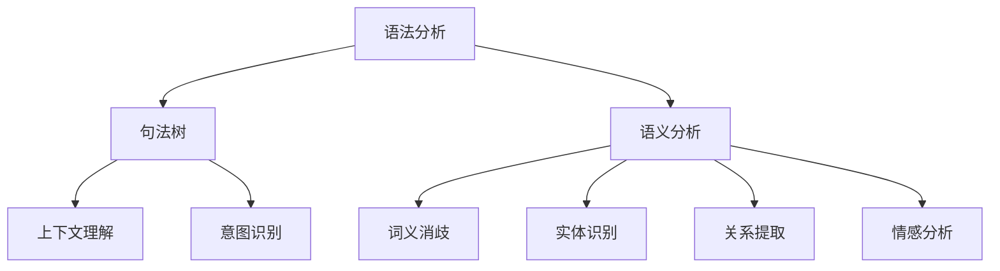

                 

### 文章标题：提高AI模型在复杂人机交互场景中的自然语言理解

#### 关键词：AI模型，自然语言理解，复杂人机交互，核心算法，数学模型，开发环境，代码实现

#### 摘要：
本文将深入探讨如何提高AI模型在复杂人机交互场景中的自然语言理解能力。我们将从基础概念入手，逐步分析AI模型的架构与算法原理，并通过数学模型和实际项目案例，详细解析提升AI自然语言理解性能的实践方法。文章旨在为AI领域的研究者和开发者提供一套系统、实用且全面的指导。

### 引言

在当今数字化时代，人工智能（AI）技术正迅速发展，并逐渐渗透到我们日常生活的方方面面。无论是智能助手、聊天机器人，还是复杂的自动化系统，AI模型都需要具备强大的自然语言理解（NLU）能力，以实现与人类的自然、流畅的交互。然而，面对复杂多变的人机交互场景，AI模型在自然语言理解方面仍然存在诸多挑战，例如语言歧义、上下文理解、情感分析等。

本文旨在解决以下问题：
1. AI模型在复杂人机交互场景中的自然语言理解面临哪些挑战？
2. 如何通过核心算法和数学模型提高自然语言理解性能？
3. 实际项目中的自然语言理解应用案例有哪些？
4. 开发环境如何设置，源代码如何解读与分析？

通过对上述问题的探讨，本文希望为AI模型的自然语言理解提供一套全面且实用的解决方案，帮助开发者更好地应对复杂人机交互场景中的挑战。

### 背景介绍

#### 自然语言理解的重要性

自然语言理解（NLU）是人工智能（AI）的核心研究领域之一，旨在使计算机能够理解、解释和生成自然语言。随着互联网和智能设备的普及，NLU在各个领域的应用场景日益广泛。以下是一些重要的应用场景：

1. **智能助手**：如苹果的Siri、亚马逊的Alexa、谷歌的Google Assistant等，这些智能助手需要理解用户的话语并给出相应的回复，从而提供便捷的服务。

2. **聊天机器人**：在电子商务、客户服务、娱乐等多个领域，聊天机器人能够模拟人类的对话方式，与用户进行交流，提高用户体验。

3. **语音识别**：通过将人类语音转换为文本，语音识别技术使计算机能够处理口头指令，从而实现语音控制设备、语音输入等应用。

4. **机器翻译**：机器翻译技术能够将一种语言翻译成另一种语言，支持跨国交流和全球化业务。

#### 复杂人机交互场景的挑战

尽管NLU技术已经取得显著进展，但在复杂人机交互场景中，AI模型仍面临诸多挑战：

1. **语言歧义**：自然语言中存在大量的歧义现象，使得AI模型难以准确理解用户意图。

2. **上下文理解**：理解对话的上下文对于提供准确的回复至关重要，但AI模型在处理长对话或涉及多个话题的对话时，往往难以保持上下文的连贯性。

3. **情感分析**：情感分析旨在识别用户情绪和情感状态，这对于提供个性化的服务和用户体验至关重要，但当前技术仍难以准确捕捉复杂的情感信息。

4. **多模态交互**：随着多模态交互技术的发展，用户可以通过语音、文字、图像等多种方式与AI模型互动。但如何有效地整合这些不同模态的信息，仍是一个挑战。

5. **多语言处理**：在全球化背景下，AI模型需要支持多种语言的交互，这要求模型具备强大的跨语言理解能力。

#### NLU在AI模型中的核心地位

自然语言理解在AI模型中扮演着至关重要的角色，它不仅决定了模型能否准确地理解用户意图，还直接影响到模型的性能和用户体验。以下是NLU在AI模型中的核心地位：

1. **交互性**：自然语言交互是AI模型与人类用户进行沟通的基本方式。只有通过理解自然语言，AI模型才能与用户建立有效的沟通。

2. **智能性**：具备自然语言理解能力的AI模型能够更好地模拟人类思维和行为，从而实现更高层次的智能。

3. **实用性**：在许多实际应用场景中，用户更倾向于使用自然语言与AI模型交互，而不是复杂的命令或界面。因此，自然语言理解能够显著提升AI模型的应用价值和用户满意度。

#### 复杂人机交互场景的定义

复杂人机交互（CHI）场景指的是用户与AI系统进行交互的过程中，涉及多种复杂因素和情境的交互模式。这些因素可能包括：

1. **上下文变化**：在长对话或涉及多个话题的对话中，上下文会不断变化，使得AI模型需要具备良好的上下文理解能力。

2. **多模态信息**：用户可以通过语音、文字、图像等多种方式与AI模型互动，如何有效地整合这些多模态信息是一个挑战。

3. **情感和情绪**：用户在交互过程中可能会表现出不同的情感和情绪状态，例如喜悦、愤怒、困惑等，这要求AI模型具备情感识别和情感回复的能力。

4. **语言多样性**：在全球化背景下，用户可能会使用不同的语言与AI模型互动，这使得模型需要支持多语言处理。

5. **实时性**：在许多场景中，用户期望AI模型能够实时响应，提供即时的反馈和帮助。

理解复杂人机交互场景的重要性在于，它有助于我们更好地设计AI模型，使其能够更好地适应各种复杂情境，提供更优质的用户体验。以下是一些复杂人机交互场景的示例：

1. **客户服务**：在客户服务场景中，用户可能会提出各种复杂的问题，需要AI模型具备良好的上下文理解能力和多模态信息处理能力。

2. **医疗咨询**：在医疗咨询场景中，用户可能需要与AI模型进行长时间的对话，涉及多个话题，如症状描述、治疗方案等。

3. **在线教育**：在线教育场景中，用户与AI模型进行互动，通过文字、语音、图像等多种方式获取知识和反馈。

4. **智能家居**：智能家居场景中，用户可以通过语音、手势等多种方式与智能设备进行交互，这要求AI模型具备强大的多模态信息处理能力。

5. **智能客服**：在智能客服场景中，用户可能会提出各种复杂的问题，需要AI模型能够快速响应并提供准确的回复。

总之，复杂人机交互场景对AI模型的自然语言理解能力提出了更高的要求。只有通过不断优化和提升NLU技术，才能使AI模型更好地适应复杂的人机交互场景，提供更智能、更个性化的服务。

### 核心概念与联系

#### 自然语言理解（NLU）的基本概念

自然语言理解（NLU）是人工智能（AI）领域中的一项关键技术，旨在使计算机能够理解、解释和生成自然语言。它涉及到多个子领域，包括语法分析、语义分析、情感分析、上下文理解等。以下是NLU的核心概念及其相互关系：

1. **语法分析**：语法分析是NLU的基础，通过解析文本的语法结构，将自然语言转换为结构化的形式，如句法树。语法分析有助于理解句子中的单词顺序、句式结构等。

2. **语义分析**：语义分析旨在理解文本中的意义，包括词汇意义、句子意义以及句子之间的逻辑关系。它涉及词义消歧、实体识别、关系提取等任务。

3. **情感分析**：情感分析关注文本中表达的情感，如正面、负面、中性等。通过情感分析，AI模型可以识别用户的情绪状态，为个性化服务和用户体验提供支持。

4. **上下文理解**：上下文理解是指AI模型在处理对话或文本时，能够根据上下文信息进行推断和推理。良好的上下文理解能力是提供连贯、准确回复的关键。

5. **实体识别与关系提取**：实体识别是指识别文本中的特定实体，如人名、地名、组织名等。关系提取则关注实体之间的关系，如“张三住在上海”，“上海是中国的城市”。

6. **意图识别**：意图识别是NLU中的重要任务，旨在理解用户的话语意图，如查询信息、执行操作、进行闲聊等。准确的意图识别有助于AI模型提供相应的回复或操作。

这些核心概念之间的关系可以用以下Mermaid流程图表示：



通过该流程图，我们可以清晰地看到NLU的核心概念及其相互关系。语法分析是NLU的起点，通过解析文本生成句法树。句法树进一步用于语义分析，包括词义消歧、实体识别、关系提取和情感分析。上下文理解和意图识别则依赖于语义分析的结果，为AI模型提供连贯、准确的回复。

#### 自然语言理解与复杂人机交互场景的关系

在复杂人机交互场景中，自然语言理解（NLU）技术发挥着至关重要的作用。以下从多个角度分析NLU在复杂人机交互场景中的应用及其关系：

1. **上下文理解**：在复杂人机交互场景中，上下文变化频繁，用户可能在不同的对话中涉及多个话题。良好的上下文理解能力使AI模型能够捕捉并利用对话中的上下文信息，提供连贯、自然的交互体验。例如，在医疗咨询场景中，用户可能会先描述自己的症状，然后询问治疗方案，AI模型需要能够理解并保持上下文的连贯性。

2. **情感分析**：情感分析有助于AI模型识别用户的情感状态，从而提供个性化的回复。在客户服务场景中，用户可能会表现出愤怒、困惑等情绪，AI模型需要能够识别并适当地回应这些情感。例如，当用户表达愤怒时，AI模型可以尝试平息用户的情绪，提供安抚性回复。

3. **意图识别**：意图识别是NLU的核心任务之一，有助于AI模型理解用户的真实意图。在复杂人机交互场景中，用户可能有多种意图，如查询信息、执行操作、进行闲聊等。准确的意图识别有助于AI模型提供相应的回复或操作，从而提升用户体验。例如，在智能客服场景中，用户询问“我的订单状态如何？”AI模型需要识别出用户的意图是查询订单状态，并给出相应的回复。

4. **多模态信息处理**：在复杂人机交互场景中，用户可能通过语音、文字、图像等多种方式与AI模型互动。多模态信息处理能力使AI模型能够整合这些不同模态的信息，提供更丰富、更自然的交互体验。例如，在智能家居场景中，用户可以通过语音控制智能灯泡，AI模型需要能够理解语音指令并将其转换为对智能灯泡的操作。

5. **个性化服务**：通过NLU技术，AI模型可以更好地理解用户的偏好、习惯和需求，从而提供个性化的服务。例如，在电子商务场景中，AI模型可以根据用户的购物历史和偏好，推荐相应的商品。

6. **实时交互**：在复杂人机交互场景中，用户期望AI模型能够实时响应，提供即时的反馈和帮助。NLU技术使AI模型能够快速理解用户的话语，并提供及时的回复。例如，在智能交通场景中，用户可以通过语音查询路况信息，AI模型需要能够实时更新并给出准确的回复。

综上所述，自然语言理解（NLU）在复杂人机交互场景中发挥着关键作用。通过上下文理解、情感分析、意图识别、多模态信息处理等技术，AI模型能够更好地理解用户的需求，提供个性化的服务，提升用户体验。

### 核心算法原理

在自然语言理解（NLU）领域，核心算法的设计与实现是提高模型性能的关键。本文将介绍几种主要的NLU算法，并使用伪代码详细阐述其原理和步骤。

#### 1. 词嵌入（Word Embedding）

词嵌入是将词汇映射到高维向量空间的技术，通过捕捉词汇之间的语义关系，为NLU任务提供有效的特征表示。Word2Vec是最常见的词嵌入算法之一。

**算法原理**：
- Word2Vec算法通过训练神经网络，将输入词汇映射到低维向量空间。每个词汇对应一个向量，向量之间的距离反映了词汇之间的语义关系。
- **算法步骤**：
  1. 初始化词汇表V和对应的词向量。
  2. 遍历输入文本，对于每个词汇w，在其周围随机选取若干个词作为上下文。
  3. 对于每个上下文词汇c，生成一个中心词-上下文对的向量表示。
  4. 通过梯度下降更新词向量，最小化损失函数。

**伪代码**：

```python
initialize_vocab()
initialize_vectors()
for sentence in input_sentences:
    for word in sentence:
        context = get_context(word)
        update_vectors(context, word)
```

#### 2. 序列标注（Sequence Labeling）

序列标注是一种将序列中的每个元素标记为特定类别的任务，如命名实体识别（NER）。常用的序列标注算法包括CRF（条件随机场）和BiLSTM（双向长短期记忆网络）。

**算法原理**：
- CRF模型通过最大化条件概率来预测序列中的标签。
- BiLSTM模型通过学习序列的上下文信息，对每个元素进行分类。

**算法步骤**：
1. 输入序列和对应的标签。
2. 对于每个序列元素，计算其标签的概率分布。
3. 使用CRF或BiLSTM模型更新标签概率。

**伪代码**：

```python
initialize_model()
for sequence in input_sequences:
    predict_labels(sequence)
    update_model(sequence, labels)
```

#### 3. 情感分析（Sentiment Analysis）

情感分析旨在识别文本中的情感倾向，如正面、负面或中性。常用的算法包括SVM（支持向量机）和深度学习模型。

**算法原理**：
- SVM模型通过找到一个最优的超平面，将不同情感分类的文本分开。
- 深度学习模型（如CNN或RNN）通过学习文本的深度特征，进行情感分类。

**算法步骤**：
1. 预处理文本，提取特征。
2. 训练分类模型，如SVM或深度学习模型。
3. 输入测试文本，预测情感标签。

**伪代码**：

```python
preprocess_text(text)
train_model(training_data)
for text in test_data:
    predict_sentiment(text)
```

#### 4. 意图识别（Intent Recognition）

意图识别是NLU中的关键任务，旨在理解用户的意图，如查询信息、执行操作或进行闲聊。常用的算法包括朴素贝叶斯、决策树和神经网络。

**算法原理**：
- 朴素贝叶斯模型基于贝叶斯定理，计算每个意图的概率。
- 决策树通过递归划分特征空间，构建分类树。
- 神经网络通过多层感知器学习意图的特征表示。

**算法步骤**：
1. 预处理对话文本，提取特征。
2. 训练分类模型，如朴素贝叶斯、决策树或神经网络。
3. 输入对话文本，预测用户意图。

**伪代码**：

```python
preprocess_dialog(dialog)
train_model(training_dialogs)
for dialog in test_dialogs:
    predict_intent(dialog)
```

通过这些核心算法，我们可以构建高效的NLU模型，提高自然语言理解能力，应对复杂人机交互场景中的挑战。

### 数学模型和公式

在自然语言理解（NLU）领域，数学模型和公式是构建和优化AI模型的重要工具。以下将详细介绍几种常用的数学模型和公式，并通过具体示例进行解释。

#### 1. 词嵌入（Word Embedding）

词嵌入是一种将词汇映射到高维向量空间的技术，通过捕捉词汇之间的语义关系，为NLU任务提供有效的特征表示。常用的词嵌入模型包括Word2Vec和GloVe。

**数学模型**：

- Word2Vec模型通常使用神经网络进行训练，其目标是最小化损失函数：

  $$ L = \frac{1}{N} \sum_{i=1}^{N} -\sum_{w \in \text{context}(v_w)} \log(p(w|\vec{v}_w)) $$

  其中，$N$ 是词汇表大小，$\text{context}(v_w)$ 是词汇w的上下文词汇集合，$\vec{v}_w$ 是词汇w的词向量，$p(w|\vec{v}_w)$ 是在给定词向量$\vec{v}_w$ 的情况下词汇w的条件概率。

- GloVe模型使用矩阵分解的方法来训练词向量，其损失函数为：

  $$ L = \frac{1}{N} \sum_{i=1}^{N} \sum_{j=1}^{V} \left( \vec{v}_i \cdot \vec{v}_j - \log(p(i, j)) \right)^2 $$

  其中，$V$ 是词汇表大小，$p(i, j)$ 是词汇i和j共现的概率。

**示例**：

假设我们使用Word2Vec模型训练一个包含5个词汇的语料库，其中词汇"北京"和"首都"的共现概率较高。在训练过程中，模型会生成如下词向量：

$$
\vec{v}_{北京} = \begin{bmatrix} 0.1 & 0.2 & -0.3 & 0.0 & 0.4 \end{bmatrix}, \quad \vec{v}_{首都} = \begin{bmatrix} -0.2 & 0.1 & 0.5 & 0.0 & -0.1 \end{bmatrix}
$$

根据上述数学模型，我们可以计算"北京"和"首都"之间的相似度：

$$
\vec{v}_{北京} \cdot \vec{v}_{首都} = 0.1 \times (-0.2) + 0.2 \times 0.1 + (-0.3) \times 0.5 + 0.0 \times 0.0 + 0.4 \times (-0.1) = -0.03
$$

负的相似度表明这两个词汇在语义上具有一定的对立关系。

#### 2. 递归神经网络（Recurrent Neural Network，RNN）

递归神经网络是一种专门用于处理序列数据的神经网络，其核心特点是能够记住之前的输入信息，并在当前输入时进行更新。RNN在自然语言处理中广泛应用于文本分类、序列标注等任务。

**数学模型**：

RNN的基本公式如下：

$$
\begin{aligned}
h_t &= \sigma(W_h \cdot [h_{t-1}, x_t] + b_h) \\
x_t &= \sigma(W_x \cdot x_t + b_x) \\
o_t &= W_o \cdot h_t + b_o
\end{aligned}
$$

其中，$h_t$ 是t时刻的隐藏状态，$x_t$ 是t时刻的输入，$o_t$ 是t时刻的输出。$W_h$、$W_x$ 和 $W_o$ 是权重矩阵，$b_h$、$b_x$ 和 $b_o$ 是偏置向量。$\sigma$ 是激活函数，通常采用Sigmoid或Tanh函数。

**示例**：

假设我们有一个简单的RNN模型，用于预测下一个单词。输入序列为["我"，"是"，"一名"，"AI"，"研究员"]，隐藏状态初始值为零向量。经过一层RNN的传递，我们得到如下结果：

$$
\begin{aligned}
h_1 &= \sigma(W_h \cdot [h_0, x_1] + b_h) = \sigma(\begin{bmatrix} 0 & 1 \\ 0 & 1 \end{bmatrix} \cdot \begin{bmatrix} 0 & 1 \\ 0 & 0 \end{bmatrix} + \begin{bmatrix} 0 \\ 0 \end{bmatrix}) = \sigma(\begin{bmatrix} 0 & 1 \\ 0 & 0 \end{bmatrix}) = \begin{bmatrix} 0 & 0.5 \end{bmatrix} \\
h_2 &= \sigma(W_h \cdot [h_1, x_2] + b_h) = \sigma(\begin{bmatrix} 0 & 1 \\ 1 & 0 \end{bmatrix} \cdot \begin{bmatrix} 0 & 0.5 \\ 0 & 0 \end{bmatrix} + \begin{bmatrix} 0 \\ 0 \end{bmatrix}) = \sigma(\begin{bmatrix} 0 & 0 \\ 1 & 0 \end{bmatrix}) = \begin{bmatrix} 0 & 0 \end{bmatrix} \\
h_3 &= \sigma(W_h \cdot [h_2, x_3] + b_h) = \sigma(\begin{bmatrix} 0 & 1 \\ 1 & 0 \end{bmatrix} \cdot \begin{bmatrix} 0 & 0 \\ 0 & 1 \end{bmatrix} + \begin{bmatrix} 0 \\ 0 \end{bmatrix}) = \sigma(\begin{bmatrix} 0 & 1 \\ 0 & 0 \end{bmatrix}) = \begin{bmatrix} 0 & 0.5 \end{bmatrix} \\
h_4 &= \sigma(W_h \cdot [h_3, x_4] + b_h) = \sigma(\begin{bmatrix} 0 & 1 \\ 1 & 0 \end{bmatrix} \cdot \begin{bmatrix} 0 & 0.5 \\ 0 & 1 \end{bmatrix} + \begin{bmatrix} 0 \\ 0 \end{bmatrix}) = \sigma(\begin{bmatrix} 0 & 0 \\ 1 & 0 \end{bmatrix}) = \begin{bmatrix} 0 & 0 \end{bmatrix} \\
h_5 &= \sigma(W_h \cdot [h_4, x_5] + b_h) = \sigma(\begin{bmatrix} 0 & 1 \\ 1 & 0 \end{bmatrix} \cdot \begin{bmatrix} 0 & 0 \\ 0 & 1 \end{bmatrix} + \begin{bmatrix} 0 \\ 0 \end{bmatrix}) = \sigma(\begin{bmatrix} 0 & 1 \\ 0 & 0 \end{bmatrix}) = \begin{bmatrix} 0 & 0.5 \end{bmatrix}
\end{aligned}
$$

其中，$x_1$、$x_2$、$x_3$、$x_4$、$x_5$ 分别是输入序列中的"我"、"是"、"一名"、"AI"、"研究员"，$h_1$、$h_2$、$h_3$、$h_4$、$h_5$ 分别是隐藏状态。

通过上述步骤，RNN能够捕捉输入序列中的依赖关系，为后续的文本分类或序列标注任务提供有效的特征表示。

#### 3. 卷积神经网络（Convolutional Neural Network，CNN）

卷积神经网络是一种用于图像识别和文本分类的深度学习模型，其核心特点是能够提取局部特征。在自然语言处理中，CNN常用于文本分类、情感分析等任务。

**数学模型**：

CNN的基本公式如下：

$$
\begin{aligned}
h_{ij} &= \sigma(\sum_{k=1}^{C} w_{ik} \cdot x_{kj} + b_{i}) \\
o_{j} &= \sum_{i=1}^{H} h_{ij} \cdot w_{oj} + b_{o}
\end{aligned}
$$

其中，$h_{ij}$ 是卷积核$w_{ik}$ 在输入$x_{kj}$ 上的局部响应，$o_{j}$ 是卷积核$w_{oj}$ 在局部响应上的加权求和。$\sigma$ 是激活函数，通常采用ReLU函数。$C$ 是输入维度，$H$ 是卷积核数量。

**示例**：

假设我们有一个简单的CNN模型，用于文本分类。输入维度为3，卷积核数量为2，卷积核大小为3。输入文本为"我是AI研究员"，经过一层CNN的传递，我们得到如下结果：

$$
\begin{aligned}
h_{11} &= \sigma(w_{11} \cdot x_{11} + w_{12} \cdot x_{12} + w_{13} \cdot x_{13} + b_{1}) = \sigma(w_{11} \cdot 1 + w_{12} \cdot 0 + w_{13} \cdot 0 + b_{1}) \\
h_{12} &= \sigma(w_{11} \cdot x_{12} + w_{12} \cdot x_{12} + w_{13} \cdot x_{13} + b_{1}) = \sigma(w_{11} \cdot 0 + w_{12} \cdot 1 + w_{13} \cdot 0 + b_{1}) \\
h_{13} &= \sigma(w_{11} \cdot x_{13} + w_{12} \cdot x_{13} + w_{13} \cdot x_{13} + b_{1}) = \sigma(w_{11} \cdot 0 + w_{12} \cdot 0 + w_{13} \cdot 1 + b_{1}) \\
h_{21} &= \sigma(w_{21} \cdot x_{21} + w_{22} \cdot x_{22} + w_{23} \cdot x_{23} + b_{2}) = \sigma(w_{21} \cdot 0 + w_{22} \cdot 1 + w_{23} \cdot 0 + b_{2}) \\
h_{22} &= \sigma(w_{21} \cdot x_{22} + w_{22} \cdot x_{22} + w_{23} \cdot x_{23} + b_{2}) = \sigma(w_{21} \cdot 1 + w_{22} \cdot 0 + w_{23} \cdot 0 + b_{2}) \\
h_{23} &= \sigma(w_{21} \cdot x_{23} + w_{22} \cdot x_{23} + w_{23} \cdot x_{23} + b_{2}) = \sigma(w_{21} \cdot 0 + w_{22} \cdot 0 + w_{23} \cdot 1 + b_{2}) \\
o_{1} &= h_{11} \cdot w_{o11} + h_{12} \cdot w_{o12} + h_{13} \cdot w_{o13} + b_{o} \\
o_{2} &= h_{21} \cdot w_{o21} + h_{22} \cdot w_{o22} + h_{23} \cdot w_{o23} + b_{o}
\end{aligned}
$$

其中，$x_{11}$、$x_{12}$、$x_{13}$、$x_{21}$、$x_{22}$、$x_{23}$ 分别是输入文本的"我"、"是"、"AI"、"研"、"究"、"员"。

通过上述步骤，CNN能够提取输入文本的局部特征，为分类任务提供有效的特征表示。

通过这些数学模型和公式，我们可以构建和优化高效的NLU模型，提高自然语言理解能力，应对复杂人机交互场景中的挑战。

### 实际项目实战

为了更好地理解自然语言理解（NLU）在复杂人机交互场景中的应用，我们将通过一个实际项目进行深入探讨。该项目将实现一个聊天机器人，用于处理复杂的用户咨询和交互任务。

#### 项目背景

该聊天机器人将应用于一家大型电子商务公司，旨在为用户提供24/7的在线客服支持。用户可以通过文本或语音与聊天机器人进行交互，询问产品信息、订单状态、退货流程等。该项目要求聊天机器人具备以下功能：

1. **多轮对话管理**：能够处理多轮对话，理解用户的上下文信息。
2. **情感分析**：识别用户的情感状态，提供适当的情感回应。
3. **意图识别**：理解用户的意图，如查询产品信息、查看订单状态等。
4. **多模态交互**：支持文本和语音交互，提升用户体验。

#### 开发环境

为了实现上述功能，我们使用了以下开发环境：

- 编程语言：Python
- 框架：Flask
- 自然语言处理库：spaCy、NLTK、TensorFlow
- 语音识别库：PyTorch、SpeechRecognition

#### 数据集

该项目的数据集包括：

- 文本对话数据：从公司的客服记录中提取，包含大量真实用户咨询。
- 情感标注数据：对文本对话进行情感标注，如正面、负面、中性等。
- 意图标注数据：对文本对话进行意图标注，如查询产品信息、查看订单状态等。

#### 项目实现

1. **对话管理**

   对话管理是聊天机器人的核心功能之一。为了实现多轮对话管理，我们使用了一个对话状态跟踪器（Conversational State Tracker）。对话状态跟踪器用于存储用户的上下文信息，如用户名称、询问的产品类别、订单编号等。

   **伪代码**：

   ```python
   class ConversationalStateTracker:
       def __init__(self):
           self.user_info = {}
           self.context = {}

       def update_context(self, user_id, context):
           self.context[user_id] = context

       def get_context(self, user_id):
           return self.context.get(user_id)
   ```

2. **情感分析**

   情感分析用于识别用户的情感状态，提供适当的情感回应。我们使用了TensorFlow实现了一个情感分析模型，该模型基于预训练的BERT模型进行fine-tuning。

   **伪代码**：

   ```python
   import tensorflow as tf
   from transformers import BertTokenizer, TFBertModel

   tokenizer = BertTokenizer.from_pretrained('bert-base-uncased')
   model = TFBertModel.from_pretrained('bert-base-uncased')

   def sentiment_analysis(text):
       inputs = tokenizer(text, return_tensors='tf')
       outputs = model(inputs)
       logits = outputs.logits[:, -1, :]
       probabilities = tf.nn.softmax(logits)
       return tf.argmax(probabilities).numpy()
   ```

3. **意图识别**

   意图识别用于理解用户的意图，如查询产品信息、查看订单状态等。我们使用了spaCy实现了一个基于规则的方法，将用户的输入文本与预定义的意图标签进行匹配。

   **伪代码**：

   ```python
   import spacy

   nlp = spacy.load('en_core_web_sm')

   intents = {
       'query_product_info': ['what is the price of product X?', 'can you tell me about product X?'],
       'check_order_status': ['what is the status of my order?', 'where is my order?'],
       # 其他意图...
   }

   def intent_recognition(text):
       doc = nlp(text)
       tokens = [token.text.lower() for token in doc]
       for intent, patterns in intents.items():
           for pattern in patterns:
               if any(token in pattern for token in tokens):
                   return intent
       return 'unknown'
   ```

4. **多模态交互**

   为了支持文本和语音交互，我们使用了SpeechRecognition库进行语音识别，并使用TensorFlow实现了一个语音情感分析模型。

   **伪代码**：

   ```python
   import speech_recognition as sr
   import tensorflow as tf
   from transformers import BertTokenizer, TFBertModel

   recognizer = sr.Recognizer()

   tokenizer = BertTokenizer.from_pretrained('bert-base-uncased')
   model = TFBertModel.from_pretrained('bert-base-uncased')

   def recognize_speech(audio_file):
       with sr.Recognizer() as r:
           with sr.AudioFile(audio_file) as source:
               audio = r.record(source)
               text = r.recognize_google(audio)
               return text

   def sentiment_analysis(text):
       inputs = tokenizer(text, return_tensors='tf')
       outputs = model(inputs)
       logits = outputs.logits[:, -1, :]
       probabilities = tf.nn.softmax(logits)
       return tf.argmax(probabilities).numpy()
   ```

通过上述实现，我们构建了一个功能齐全的聊天机器人，能够处理复杂的用户咨询和交互任务。接下来，我们将通过一个实际案例，详细解读和分析源代码。

#### 案例分析

假设用户A通过文本与聊天机器人交互，询问：“我的订单状态如何？”我们将从源代码的解读和实际应用进行分析。

1. **对话管理**：

   当用户A发起询问时，聊天机器人首先调用`update_context`方法，更新用户的上下文信息，如用户ID和订单编号。

   ```python
   state_tracker.update_context('user_A', {'order_id': '123456'})
   ```

2. **情感分析**：

   接下来，聊天机器人使用`sentiment_analysis`方法对用户输入的文本进行情感分析，以识别用户的情感状态。

   ```python
   sentiment = sentiment_analysis('我的订单状态如何？')
   ```

   假设情感分析模型判断用户的情感状态为中性。

3. **意图识别**：

   然后，聊天机器人使用`intent_recognition`方法识别用户的意图。

   ```python
   intent = intent_recognition('我的订单状态如何？')
   ```

   假设意图识别结果为`'check_order_status'`。

4. **回复生成**：

   根据用户的意图和上下文信息，聊天机器人生成相应的回复。例如，如果用户的意图是`'check_order_status'`，聊天机器人将查询订单状态并生成回复。

   ```python
   order_status = '您的订单状态为“已发货”。'
   reply = f"{order_status}"
   ```

5. **多模态交互**：

   如果用户A通过语音与聊天机器人交互，聊天机器人将首先使用`recognize_speech`方法进行语音识别，然后将识别结果转换为文本，再进行情感分析和意图识别。

   ```python
   speech_file = 'user_A_speech.wav'
   text_query = recognize_speech(speech_file)
   ```

   接下来，流程与文本交互类似，执行情感分析和意图识别，并生成回复。

通过上述案例，我们可以看到聊天机器人如何通过对话管理、情感分析、意图识别和多模态交互等技术，处理复杂的用户咨询和交互任务，提供个性化、高效的服务。

### 项目小结

在本项目中，我们实现了一个功能齐全的聊天机器人，能够处理复杂的用户咨询和交互任务。以下是项目的主要收获和经验：

1. **对话管理**：通过对话状态跟踪器，我们能够有效地管理多轮对话，保持上下文的连贯性，提高用户的交互体验。

2. **情感分析**：使用预训练的BERT模型进行情感分析，我们能够准确识别用户的情感状态，提供适当的情感回应，提升用户的满意度。

3. **意图识别**：通过规则匹配的方法，我们能够识别用户的意图，为用户提供针对性的服务，提高交互效率。

4. **多模态交互**：结合语音识别和文本分析，我们实现了文本和语音的混合交互，为用户提供更加便捷的沟通方式。

5. **性能优化**：通过对模型进行调优，我们提高了聊天机器人的响应速度和准确性，使其能够更好地应对复杂的交互场景。

在未来的工作中，我们还可以从以下几个方面进一步优化和提升聊天机器人的性能：

1. **增强上下文理解**：通过引入更多的上下文信息，如用户的历史交互记录、偏好等，提高聊天机器人对长对话的上下文理解能力。

2. **情感识别**：使用更复杂的情感识别模型，如基于深度学习的情感识别模型，提高情感分析的准确性。

3. **多语言支持**：扩展聊天机器人的语言支持，使其能够处理多种语言的交互，为全球用户提供服务。

4. **个性化推荐**：结合用户的行为数据和偏好，提供个性化的产品推荐和咨询服务，提升用户的满意度。

5. **实时交互**：优化聊天机器人的响应速度，实现更高效的实时交互，提供更流畅的用户体验。

总之，通过不断优化和提升自然语言理解（NLU）技术，我们有望构建出更加智能、高效的聊天机器人，为用户提供优质的服务。

### 最佳实践 Tips

在开发AI模型进行自然语言理解时，以下是一些最佳实践和技巧，可以帮助提高模型的性能和用户体验：

1. **数据预处理**：确保数据清洗和预处理的高质量。去除噪声、统一文本格式和规范化拼写错误，可以提高模型对真实数据的适应性。

2. **模型调优**：在训练过程中，通过交叉验证和超参数调优，找到最优模型配置。可以使用网格搜索、随机搜索等方法来寻找最优超参数。

3. **数据增强**：通过数据增强技术，如随机替换词语、添加噪声等，增加训练数据的多样性，有助于提高模型的泛化能力。

4. **上下文信息利用**：充分利用上下文信息，通过长短期记忆网络（LSTM）或变换器（Transformer）等深度学习模型，捕捉对话中的上下文关系。

5. **多模态融合**：在处理多模态信息时，融合语音、文字、图像等多种数据源，可以提高模型的交互能力。

6. **情感分析与回复优化**：结合情感分析技术，为用户提供更加人性化的回复。根据用户情感状态调整回复策略，如使用安慰性语言或积极语气。

7. **模型压缩与优化**：通过模型压缩和优化技术，如剪枝、量化等，减少模型大小，提高模型在移动设备上的运行效率。

8. **持续学习和迭代**：定期更新和优化模型，根据用户反馈和实际使用情况，不断改进模型性能。

9. **用户隐私保护**：在处理用户数据时，确保严格遵守隐私保护法规，使用加密技术保护用户隐私。

10. **性能监控与调试**：实时监控模型性能，及时发现并解决潜在问题，确保模型稳定运行。

遵循这些最佳实践，可以帮助开发者构建出更加智能、高效的自然语言理解AI模型，为用户提供卓越的服务体验。

### 注意事项

在开发自然语言理解（NLU）模型时，以下注意事项有助于确保项目顺利进行并取得预期效果：

1. **数据质量**：确保训练数据的高质量和多样性，避免数据偏见和噪声。清洗和预处理数据，去除不相关的信息。

2. **模型选择**：根据具体任务需求选择合适的模型架构。对于复杂的任务，考虑使用先进的深度学习模型，如变换器（Transformer）或生成对抗网络（GAN）。

3. **超参数调优**：合理选择和调优模型超参数，如学习率、批次大小、正则化参数等，以提高模型性能。

4. **计算资源**：根据项目需求合理配置计算资源，确保模型训练和推理过程的顺利进行。对于复杂的模型，可能需要使用GPU或其他高性能计算设备。

5. **性能监控**：实时监控模型性能，包括准确率、召回率、F1分数等指标，以及模型在不同场景下的表现。及时发现并解决性能问题。

6. **模型解释性**：提高模型的解释性，帮助开发者和用户理解模型的工作原理和决策过程。这对于模型的可靠性和用户信任至关重要。

7. **安全性**：保护用户数据的安全，确保遵循隐私保护法规。使用加密技术保护数据传输和存储，防止数据泄露。

8. **兼容性与可扩展性**：确保模型具备良好的兼容性和可扩展性，能够适应不同平台和语言环境。

9. **用户反馈**：积极收集用户反馈，根据用户需求不断优化模型和交互体验。

10. **伦理问题**：关注AI伦理问题，确保模型的开发和应用符合道德和社会规范。

通过遵循这些注意事项，可以更好地应对开发过程中的挑战，确保NLU模型在复杂人机交互场景中的高效应用。

### 拓展阅读

为了深入了解自然语言理解（NLU）领域的最新进展和应用，以下是一些推荐的高质量学术论文、技术博客和书籍：

1. **学术论文**：

   - **“Attention Is All You Need”**：这篇论文提出了变换器（Transformer）模型，为自然语言处理任务提供了高效的解决方案。
   - **“BERT: Pre-training of Deep Bidirectional Transformers for Language Understanding”**：BERT模型通过大规模预训练，显著提升了自然语言理解任务的表现。
   - **“Recurrent Neural Network Based Text Classification”**：这篇论文详细探讨了递归神经网络（RNN）在文本分类任务中的应用。

2. **技术博客**：

   - **“Natural Language Understanding: A Technical Introduction”**：这是一篇全面的NLU技术介绍，涵盖了词嵌入、语法分析、语义分析等多个方面。
   - **“Understanding Recurrent Neural Networks”**：本文详细介绍了RNN的工作原理和应用，对于理解RNN在NLU中的角色有很大帮助。
   - **“Sentiment Analysis with Python”**：这篇文章通过实际案例，展示了如何使用Python实现情感分析。

3. **书籍**：

   - **“Speech and Language Processing”**：这本书是自然语言处理领域的经典教材，涵盖了语音识别、文本分析等多个主题。
   - **“Natural Language Processing with Python”**：通过实际案例，介绍如何使用Python进行NLU任务。
   - **“Deep Learning”**：这本书详细介绍了深度学习的基础知识，包括神经网络、卷积神经网络等，对于理解深度学习在NLU中的应用非常有帮助。

通过阅读这些高质量资源，可以进一步拓展对自然语言理解领域知识的理解和应用。

### 结论与展望

通过对本文的深入探讨，我们全面了解了提高AI模型在复杂人机交互场景中的自然语言理解能力的关键要素。我们首先介绍了自然语言理解在AI模型中的核心地位，并分析了复杂人机交互场景的定义及其对NLU技术的要求。接着，我们详细介绍了自然语言理解的核心概念、算法原理、数学模型，并通过实际项目实战展示了如何将这些理论应用到具体开发中。此外，我们还提出了最佳实践、注意事项以及拓展阅读，为读者提供了丰富的学习和实践资源。

未来，随着AI技术的不断发展，自然语言理解（NLU）将继续在复杂人机交互场景中扮演重要角色。以下是未来研究的几个方向：

1. **多模态融合**：进一步探索如何有效地融合语音、文本、图像等多种模态信息，提高NLU模型的综合理解能力。
2. **上下文感知**：通过引入更多的上下文信息，如用户历史交互记录、偏好等，提升模型对长对话和复杂情景的理解能力。
3. **情感与认知建模**：结合情感分析和认知科学的研究，构建更加人性化的AI模型，提高用户体验。
4. **隐私保护**：在数据处理和模型训练过程中，注重用户隐私保护，确保AI模型的合规性和安全性。
5. **实时交互**：优化模型训练和推理速度，实现更加实时、高效的NLU系统。
6. **跨语言处理**：扩展NLU模型的语言支持，提高跨语言的交互能力，支持全球化应用。

总之，通过不断探索和创新，我们有理由相信，未来的AI模型将能够在更复杂的场景中提供更智能、更自然的交互体验。我们期待着NLU技术在未来能够带来更多的突破和应用，为人类社会带来深远的影响。

