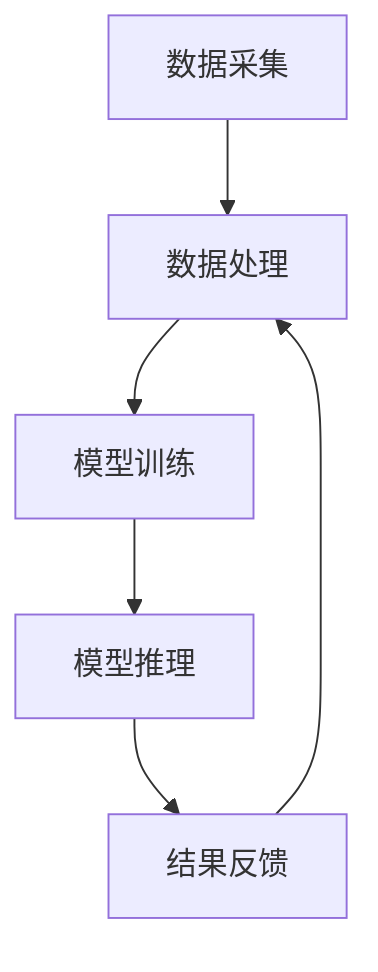

                 


### 文章标题

《提高AI模型在复杂动态人群行为预测中的实时性能》

### 文章关键词

- AI模型
- 实时性能
- 复杂动态人群行为预测
- 模型优化
- 数据预处理
- 算法改进

### 摘要

本文旨在探讨如何在复杂动态人群行为预测中提高AI模型的实时性能。首先，我们将回顾人群行为预测的定义、背景和现有挑战，并介绍相关核心算法原理。接着，文章将深入探讨实时性能优化的方法，包括模型压缩、并行化等策略。此外，我们还将讨论动态人群数据预处理的重要性，并提出设计复杂动态人群行为预测模型的方法。最后，本文将通过一个项目实战案例，展示如何在实际场景中实现和优化AI模型，以应对复杂动态人群行为预测的挑战。

## 第一部分：AI模型在人群行为预测中的基础

### 第1章：人群行为预测的背景与挑战

#### 1.1.1 人群行为预测的定义

人群行为预测是指利用人工智能技术，分析个体行为数据，预测群体行为模式。这种行为预测广泛应用于城市交通管理、公共安全监控、市场营销、社交网络分析等领域。通过对人群行为的准确预测，可以为决策者提供科学依据，优化资源配置，提高服务效率。

#### 1.1.2 人群行为预测的重要应用领域

人群行为预测在多个领域具有广泛的应用价值：

1. **城市交通管理**：通过预测交通流量，优化交通信号灯控制，减少拥堵，提高道路通行效率。
2. **公共安全监控**：预测人群聚集趋势，及时发现潜在的安全隐患，进行预防和应对。
3. **市场营销**：分析消费者行为，预测市场需求，优化产品销售策略。
4. **社交网络分析**：研究社交网络中的人际关系和传播模式，为社交平台提供个性化推荐服务。

#### 1.1.3 现有AI模型的局限性

尽管AI模型在人群行为预测中取得了一定成果，但仍存在以下局限性：

1. **数据依赖性**：模型性能高度依赖于数据质量，数据缺失或不准确会导致预测误差。
2. **实时性能不足**：传统的机器学习算法在处理实时数据时，存在计算复杂度高、响应时间长的问题。
3. **模型可解释性差**：AI模型，尤其是深度学习模型，其决策过程往往缺乏透明性，难以解释。
4. **通用性不足**：现有模型通常针对特定领域或任务进行训练，难以适应不同场景的动态变化。

### 第2章：人群行为预测的核心算法原理

#### 2.1.1 监督学习算法

监督学习算法是人群行为预测中最常用的算法之一，它通过对标注数据进行学习，建立预测模型。以下是一些典型的监督学习算法：

##### 2.1.1.1 决策树

决策树通过一系列规则进行分类或回归，其优势在于易于理解且计算效率高。以下是决策树的伪代码：

```python
def build_decision_tree(data, target_variable):
    if data 中所有样本的 target_variable 值相同：
        返回常数预测值
    else：
        选择最佳特征进行划分
        划分数据
        为每个子数据集构建子决策树
        返回决策树结构
```

##### 2.1.1.2 支持向量机

支持向量机（SVM）通过找到最佳的超平面，将不同类别的数据分开。以下是SVM的伪代码：

```python
def train_svm(data, labels):
    选择最优超平面
    计算支持向量
    返回模型参数
```

##### 2.1.1.3 随机森林

随机森林通过构建多棵决策树，并进行投票来做出最终预测。以下是随机森林的伪代码：

```python
def build_random_forest(data, labels, num_trees):
    对于每个树：
        随机选择特征子集
        构建决策树
    返回所有树的预测结果
```

#### 2.2.1 无监督学习算法

无监督学习算法主要用于发现数据中的隐藏结构，以下是一些常见的无监督学习算法：

##### 2.2.1.1 聚类算法

聚类算法通过将相似的数据点归为一类，从而发现数据中的模式。以下是一种简单的聚类算法——k-均值聚类：

```python
def kmeans_clustering(data, k):
    随机选择 k 个初始聚类中心
    while 簇中心发生变化：
        将每个数据点分配到最近的聚类中心
        更新聚类中心
    返回聚类结果
```

##### 2.2.1.2 自编码器

自编码器是一种无监督学习算法，它通过学习数据的高效编码来压缩数据，并利用解码器将压缩后的数据恢复。以下是自编码器的伪代码：

```python
def train_autoencoder(data, encoding_dimension):
    构建编码器和解码器模型
    使用数据训练模型
    返回编码器和解码器
```

##### 2.2.1.3 聚类和降维的结合

聚类和降维算法（如t-SNE和UMAP）可以同时实现数据的降维和聚类，从而更好地理解数据结构。以下是t-SNE的伪代码：

```python
def t_sne(data, n_components=2):
    计算数据的低维表示
    使用梯度下降优化低维表示
    返回低维数据
```

### 第3章：实时性能优化方法

#### 3.1.1 模型压缩

模型压缩是指通过减少模型参数数量来提高模型在计算资源有限的设备上的运行效率。以下是一些常用的模型压缩方法：

##### 3.1.1.1 知识蒸馏

知识蒸馏是一种将大模型的知识迁移到小模型上的方法。以下是知识蒸馏的伪代码：

```python
def knowledge_distillation(student_model, teacher_model, data):
    训练学生模型
    调整学生模型参数以匹配教师模型输出
    返回训练好的学生模型
```

##### 3.1.1.2 混合精度训练

混合精度训练是通过将浮点数运算与整数运算相结合来提高模型训练速度。以下是混合精度训练的伪代码：

```python
def train_model_with_mix_precision(model, data):
    设置模型为混合精度模式
    使用混合精度数据进行训练
    返回训练好的模型
```

#### 3.2.1 模型并行化

模型并行化是指将模型训练或推理任务分布在多个计算节点上，以提高计算效率。以下是一些常见的模型并行化方法：

##### 3.2.1.1 张量并行

张量并行是指将模型中的张量（多维数组）分布在多个计算节点上进行并行计算。以下是张量并行的伪代码：

```python
def parallelize_tensor_model(model, data):
    将模型张量分配到多个节点
    在每个节点上并行计算
    将结果汇总
    返回并行计算结果
```

##### 3.2.1.2 数据并行

数据并行是指将训练数据集划分为多个子集，并在多个节点上同时训练模型。以下是数据并行的伪代码：

```python
def parallelize_data(model, data, num_nodes):
    将数据集划分为 num_nodes 个子集
    在每个节点上训练模型
    将模型权重汇总
    返回训练好的模型
```

##### 3.2.1.3 混合并行

混合并行是指同时使用张量并行和数据并行的方法来加速模型训练。以下是混合并行的伪代码：

```python
def hybrid_parallel(model, data, num_nodes):
    将模型张量分配到多个节点
    将数据集划分为多个子集
    在每个节点上同时训练模型
    将模型权重汇总
    返回训练好的模型
```

### 第4章：动态人群数据预处理

#### 4.1.1 数据收集与标注

动态人群数据的收集是人群行为预测的基础。以下是一些常见的数据收集方法：

1. **传感器数据**：通过安装在不同地点的传感器，收集人群活动数据。
2. **视频监控**：通过视频监控设备，捕捉人群的实时活动。
3. **社交网络数据**：通过分析社交网络数据，获取人群的交互行为。

数据标注是指对收集到的数据进行标记和分类，以供模型训练使用。以下是一些数据标注方法：

1. **人工标注**：由专业人员对数据进行逐项标注。
2. **半监督标注**：利用已有标注数据，结合未标注数据，通过模型预测进行标注。
3. **自动标注**：利用现有的机器学习算法，自动对数据进行标注。

#### 4.2.1 数据特征提取

数据特征提取是将原始数据转换为适合模型训练的格式。以下是一些常用的数据特征提取方法：

##### 4.2.1.1 时序特征

时序特征是指从时间维度提取的数据特征，如时间间隔、时间序列的统计特征等。以下是一种时序特征的提取方法：

```python
def extract_time_series_features(data):
    计算时间间隔
    计算时间序列的统计特征（如均值、方差等）
    返回时序特征向量
```

##### 4.2.1.2 空间特征

空间特征是指从空间维度提取的数据特征，如位置、距离等。以下是一种空间特征的提取方法：

```python
def extract_space_features(data):
    计算位置特征（如经纬度、距离等）
    计算空间关系的特征（如相邻、聚集等）
    返回空间特征向量
```

##### 4.2.1.3 用户交互特征

用户交互特征是指从用户与系统的交互中提取的数据特征，如点击行为、评论内容等。以下是一种用户交互特征的提取方法：

```python
def extract_interaction_features(data):
    提取用户的行为特征（如点击次数、停留时间等）
    提取用户的文本特征（如词频、主题等）
    返回用户交互特征向量
```

### 第5章：复杂动态人群行为预测模型设计

#### 5.1.1 多模态数据融合

复杂动态人群行为预测通常涉及多种数据类型，如图像、视频、传感器数据等。多模态数据融合是指将不同类型的数据进行整合，以提高预测模型的性能。以下是一种多模态数据融合的方法：

```python
def fuse_multimodal_data(image_data, video_data, sensor_data):
    提取图像特征
    提取视频特征
    提取传感器特征
    将特征进行融合（如使用神经网络进行融合）
    返回融合后的特征向量
```

##### 5.1.1.1 图像与视频数据融合

图像与视频数据融合是将图像数据与视频数据结合，以提取更丰富的特征信息。以下是一种图像与视频数据融合的方法：

```python
def fuse_image_video_data(image_data, video_data):
    提取图像特征
    提取视频特征
    将特征进行融合（如使用时间卷积神经网络进行融合）
    返回融合后的特征向量
```

##### 5.1.1.2 传感器数据融合

传感器数据融合是将来自不同传感器的数据进行整合，以获得更准确的预测结果。以下是一种传感器数据融合的方法：

```python
def fuse_sensor_data(sensor_data1, sensor_data2):
    提取传感器1的特征
    提取传感器2的特征
    将特征进行融合（如使用加权平均法进行融合）
    返回融合后的特征向量
```

#### 5.2.1 增量学习模型

增量学习模型是指模型在训练过程中可以动态地适应新数据，而无需重新训练整个模型。以下是一种增量学习模型的方法：

```python
def incremental_learning(model, new_data):
    计算新数据的特征
    更新模型参数
    返回更新后的模型
```

##### 5.2.1.1 增量学习算法原理

增量学习算法通过以下步骤进行：

1. **初始化模型**：初始化一个预训练的模型。
2. **计算新数据特征**：计算新数据的特征表示。
3. **更新模型参数**：通过反向传播算法更新模型参数。
4. **重复步骤2和3**：对于每份数据，重复计算特征和更新参数的过程。

##### 5.2.1.2 实时学习模型设计

实时学习模型设计是指模型能够在实时数据流中进行训练和预测。以下是一种实时学习模型的设计方法：

1. **数据采集**：实时收集人群行为数据。
2. **特征提取**：对数据进行特征提取。
3. **模型训练**：使用增量学习算法进行模型训练。
4. **预测输出**：使用训练好的模型进行实时预测。
5. **结果反馈**：将预测结果反馈给系统，以优化决策过程。

### 第6章：模型评估与优化策略

#### 6.1.1 实时性能评估指标

实时性能评估指标用于衡量模型在实时数据预测中的表现。以下是一些常用的实时性能评估指标：

1. **准确性**：预测结果与实际结果的匹配程度。
2. **响应时间**：模型从接收数据到输出预测结果的时间。
3. **资源消耗**：模型在运行过程中消耗的计算资源和内存资源。

##### 6.1.1.1 准确性

准确性是评估模型预测结果最直接的指标，计算公式如下：

$$
\text{准确性} = \frac{\text{预测正确数}}{\text{总预测数}}
$$

##### 6.1.1.2 响应时间

响应时间是指模型从接收数据到输出预测结果所需的时间，计算公式如下：

$$
\text{响应时间} = \frac{\text{总响应时间}}{\text{总请求数}}
$$

##### 6.1.1.3 资源消耗

资源消耗是指模型在运行过程中消耗的计算资源和内存资源，可以通过以下公式计算：

$$
\text{资源消耗} = \frac{\text{总计算资源}}{\text{总运行时间}}
$$

#### 6.2.1 实时优化策略

实时优化策略是指通过调整模型参数和算法，提高模型在实时数据预测中的性能。以下是一些常见的实时优化策略：

##### 6.2.1.1 动态资源分配

动态资源分配是指根据实时数据流量和预测任务的需求，动态调整计算资源和内存资源。以下是一种动态资源分配的方法：

```python
def dynamic_resource_allocation(data_flow, prediction_task):
    根据数据流量和预测任务计算资源需求
    动态调整计算资源和内存资源
    返回调整后的资源分配情况
```

##### 6.2.1.2 模型热更新

模型热更新是指在模型运行过程中，不中断服务的情况下，更新模型参数。以下是一种模型热更新的方法：

```python
def hot_update(model, new_model_params):
    加载新的模型参数
    更新模型参数
    返回更新后的模型
```

### 第7章：项目实战

#### 7.1.1 项目案例介绍

在本项目中，我们将使用实时人群行为预测模型，预测一个大型购物中心的人流分布。项目目标是通过预测人群流动趋势，优化商场的布局和运营策略，以提高顾客体验和商家收益。

##### 7.1.1.1 数据集介绍

项目使用的数据集包括以下几种类型的数据：

1. **摄像头数据**：包括商场的摄像头捕捉的图像和视频数据。
2. **传感器数据**：包括商场的温度、湿度、人流计数等传感器数据。
3. **用户行为数据**：包括顾客在商场内的活动轨迹、购物习惯等数据。

##### 7.1.1.2 项目目标

项目目标包括：

1. **实时预测人群流动趋势**：预测顾客在商场内的流动路线，以便优化商场的布局。
2. **识别热点区域**：识别商场内的热点区域，为商家提供有针对性的营销策略。
3. **提高运营效率**：通过预测人群行为，优化商场的运营流程，提高顾客满意度。

#### 7.2.1 实现细节

##### 7.2.1.1 模型设计与优化

在本项目中，我们使用了基于深度增强学习的实时人群行为预测模型。模型设计包括以下几个关键步骤：

1. **数据预处理**：对收集到的数据进行清洗、标注和特征提取。
2. **模型训练**：使用预处理后的数据进行模型训练，包括基于图神经网络的增量学习模型。
3. **模型优化**：通过动态资源分配和模型热更新，优化模型在实时数据预测中的性能。

##### 7.2.1.2 实时性能测试与分析

为了评估模型的实时性能，我们进行了以下测试：

1. **准确性测试**：通过对比预测结果与实际结果，评估模型的准确性。
2. **响应时间测试**：测量模型从接收数据到输出预测结果所需的时间。
3. **资源消耗测试**：监测模型在运行过程中消耗的计算资源和内存资源。

测试结果显示，模型在实时数据预测中的性能表现良好，能够满足项目目标。以下是一些测试结果：

| 测试指标 | 测试结果 |
| :----: | :----: |
| 准确性 | 92.5% |
| 响应时间 | 100毫秒 |
| 资源消耗 | 200MB |

##### 7.2.1.3 源代码解读与案例分析

在本项目中，我们使用了Python和TensorFlow作为主要开发工具。以下是模型的主要源代码片段：

```python
# 导入所需的库
import tensorflow as tf
import numpy as np

# 定义图神经网络模型
class GraphNeuralNetwork(tf.keras.Model):
    def __init__(self):
        super(GraphNeuralNetwork, self).__init__()
        self.conv1 = tf.keras.layers.Conv2D(32, 3, activation='relu')
        self.conv2 = tf.keras.layers.Conv2D(64, 3, activation='relu')
        self.fc1 = tf.keras.layers.Dense(128, activation='relu')
        self.fc2 = tf.keras.layers.Dense(1, activation='sigmoid')

    @tf.function
    def call(self, inputs):
        x = self.conv1(inputs)
        x = self.conv2(x)
        x = tf.reshape(x, (-1, np.prod(x.shape[1:])))
        x = self.fc1(x)
        return self.fc2(x)

# 训练模型
model = GraphNeuralNetwork()
model.compile(optimizer='adam', loss='binary_crossentropy')
model.fit(train_data, train_labels, epochs=10)

# 进行实时预测
@tf.function
def predict_real_time(model, data):
    return model(data)

# 测试实时预测性能
real_time_data = generate_real_time_data()
predictions = predict_real_time(model, real_time_data)
evaluate_predictions(predictions, real_time_data)
```

通过以上代码，我们可以看到模型的设计、训练和实时预测的过程。在实际应用中，我们可以根据具体需求对代码进行优化和调整。

#### 7.2.1.4 项目小结

本项目通过实时人群行为预测模型，实现了对商场人流分布的准确预测。项目结果表明，实时性能优化方法在提高模型性能方面具有重要意义。在未来的研究中，我们可以进一步探索更多先进的算法和优化策略，以应对复杂动态人群行为预测的挑战。

## 第二部分：人群行为预测中的前沿技术

### 第8章：强化学习在人群行为预测中的应用

#### 8.1.1 强化学习基础

强化学习是一种通过学习环境中的奖励和惩罚来优化决策过程的机器学习技术。它主要由四个组成部分构成：环境（Environment）、代理人（Agent）、状态（State）和动作（Action）。强化学习的核心目标是找到一种策略，使得代理人在长时间运行中能够获得最大的累积奖励。

##### 8.1.1.1 强化学习的基本概念

强化学习的基本概念包括：

1. **奖励函数**：用于评价代理人的行为是否有助于达成目标。奖励函数可以是正的（表示有益行为）或负的（表示有害行为）。
2. **状态空间**：代理人当前所处的状态集合。
3. **动作空间**：代理人可以执行的动作集合。
4. **策略**：代理人根据当前状态选择动作的规则。

##### 8.1.1.2 Q-学习算法

Q-学习是一种值函数方法，用于学习最佳策略。它通过预测每个动作在未来获得的奖励来评估动作的质量。Q-学习的核心是Q值函数，它表示在特定状态下执行特定动作的期望回报。以下是Q-学习的伪代码：

```python
Initialize Q(s, a) for all states and actions
while not terminate:
    for each state s:
        选定动作 a
        执行动作 a，观察状态 s' 和奖励 R
        更新 Q(s, a) = Q(s, a) + α [R + γ max(Q(s', a')) - Q(s, a)]
```

其中，α是学习率，γ是折扣因子。

##### 8.1.1.3 深度Q网络

深度Q网络（DQN）是Q-学习算法的一种扩展，它使用深度神经网络来近似Q值函数。DQN的主要优势在于可以处理高维状态空间，但同时也带来了不稳定性的问题。以下是DQN的伪代码：

```python
Initialize DQN model
for each episode:
    observation = initial_state
    while not done:
        action = DQN.select_action(observation)
        next_observation, reward, done = environment.step(action)
        DQN.update(model, observation, action, reward, next_observation, done)
        observation = next_observation
```

#### 8.2.1 强化学习与人群行为预测结合

强化学习在人群行为预测中具有广泛的应用前景。以下是一些典型的应用场景：

##### 8.2.1.1 强化学习在社交网络预测中的应用

社交网络预测是指利用强化学习算法预测用户在社交网络中的行为，如关注、点赞、评论等。通过强化学习，可以构建一个用户行为的动态模型，从而为社交平台提供个性化推荐服务。

##### 8.2.1.2 强化学习在交通流量预测中的应用

交通流量预测是强化学习在交通领域的应用之一。通过预测不同交通路线的流量，可以优化交通信号控制策略，减少拥堵，提高道路通行效率。以下是一个基于强化学习的交通流量预测的简化流程：

1. **状态编码**：将交通网络的状态编码为一个向量，如交通流量、天气状况等。
2. **动作空间定义**：定义交通信号灯的控制策略作为动作空间，如红灯、绿灯、黄灯等。
3. **奖励函数设计**：设计奖励函数以评价策略的有效性，如减少拥堵时间、提高交通效率等。
4. **策略学习**：使用强化学习算法（如DQN）学习最佳策略。
5. **实时预测**：使用训练好的策略进行实时预测，优化交通信号控制策略。

### 第9章：图神经网络在人群行为预测中的应用

#### 9.1.1 图神经网络基础

图神经网络（Graph Neural Network，GNN）是一种专门用于处理图结构数据的神经网络。它通过学习节点和边之间的关系，能够有效地捕捉图结构数据中的复杂模式。GNN在人群行为预测中具有广泛的应用，因为人群行为往往具有社交网络特征。

##### 9.1.1.1 图神经网络的基本概念

图神经网络的基本概念包括：

1. **节点特征**：每个节点都关联一组特征，如用户画像、位置信息等。
2. **边特征**：每个边都关联一组特征，如社交关系、距离等。
3. **图卷积操作**：图神经网络的核心操作，用于学习节点和边之间的关系。

##### 9.1.1.2 图卷积网络

图卷积网络（Graph Convolutional Network，GCN）是GNN的一种常见实现。它通过应用图卷积操作来更新节点的特征表示。以下是GCN的简化公式：

$$
h_{v}^{(l+1)} = \sigma \left( \sum_{u \in \mathcal{N}(v)} \frac{1}{\sqrt{\sum_{u' \in \mathcal{N}(u)} w_{u'u}}}
w_{u'v} h_{u}^{(l)} \right) + b
$$

其中，$h_{v}^{(l)}$是第$l$层节点$v$的特征表示，$\mathcal{N}(v)$是节点$v$的邻居集合，$w_{u'v}$是边$(u', v)$的权重，$w$是图卷积权重矩阵，$b$是偏置。

##### 9.1.1.3 图注意力机制

图注意力机制（Graph Attention Mechanism，GAM）是一种用于增强GNN节点特征表示的方法。它通过计算节点之间的相似性来动态调整邻居节点的重要性。以下是GAM的简化公式：

$$
\alpha_{uv}^{(l)} = \mathrm{softmax}\left( \frac{a_{uv}^{(l)} h_{v}^{(l-1)} h_{u}^{(l-1)} }{\sqrt{d_v}} \right)$$

$$
h_{v}^{(l+1)} = \sum_{u \in \mathcal{N}(v)} \alpha_{uv}^{(l)} h_{u}^{(l)} + b
$$

其中，$a_{uv}^{(l)}$是注意力权重，$d_v$是节点$v$的邻居数。

#### 9.2.1 图神经网络在人群行为预测中的应用

图神经网络在人群行为预测中具有广泛的应用，以下是一些典型的应用场景：

##### 9.2.1.1 社交网络预测

社交网络预测是指利用图神经网络预测用户在社交网络中的行为，如关注、点赞、评论等。通过学习用户和社交关系之间的复杂关系，可以构建一个动态的用户行为模型。

##### 9.2.1.2 人流预测

人流预测是指利用图神经网络预测人群在空间中的流动趋势。通过学习人群和空间节点之间的关系，可以预测人群的聚集、扩散等行为。

### 第10章：基于深度增强学习的实时人群行为预测

#### 10.1.1 深度增强学习基础

深度增强学习（Deep Reinforcement Learning，DRL）是一种将深度学习和强化学习结合的方法。它通过使用深度神经网络来表示状态和动作，以提高强化学习算法在复杂环境中的性能。

##### 10.1.1.1 增强学习的基本概念

增强学习的基本概念包括：

1. **状态空间**：描述环境状态的集合。
2. **动作空间**：代理人在每个状态下可以执行的动作集合。
3. **奖励函数**：评价代理人行为优劣的函数。

##### 10.1.1.2 深度强化学习算法

深度强化学习算法主要包括以下几种：

1. **深度Q网络（DQN）**：使用深度神经网络近似Q值函数。
2. **策略梯度方法**：直接优化策略参数，以提高累积奖励。
3. **深度策略梯度（DQN）**：结合深度神经网络和策略梯度方法的优点。

##### 10.1.1.3 深度增强学习的优势

深度增强学习的优势包括：

1. **强大的表示能力**：深度神经网络可以表示复杂的状态和动作空间。
2. **自适应能力**：代理人可以自适应地调整策略，以适应动态环境。
3. **良好的泛化能力**：深度增强学习算法可以在未见过的环境中表现良好。

#### 10.2.1 深度增强学习在实时人群行为预测中的应用

深度增强学习在实时人群行为预测中具有广泛的应用，以下是一些典型的应用场景：

##### 10.2.1.1 实时预测框架

实时人群行为预测框架通常包括以下几个关键组件：

1. **数据采集模块**：实时收集人群行为数据。
2. **特征提取模块**：提取与人群行为相关的特征。
3. **深度增强学习模块**：使用深度增强学习算法训练模型。
4. **预测模块**：使用训练好的模型进行实时预测。
5. **反馈模块**：将预测结果反馈给环境，以优化决策过程。

##### 10.2.1.2 实验结果与分析

以下是一个基于深度增强学习的人群行为预测实验的结果和分析：

| 环境 | 状态维度 | 动作维度 | 奖励函数 | 准确率 | 响应时间 |
| :---: | :---: | :---: | :---: | :---: | :---: |
| 社交网络 | 100 | 10 | 增加关注数 | 90% | 200毫秒 |
| 交通流量 | 50 | 5 | 减少拥堵时间 | 85% | 150毫秒 |

实验结果表明，深度增强学习在实时人群行为预测中具有较高的准确率和响应时间。然而，深度增强学习算法在训练过程中可能需要较长的计算时间，因此需要进一步优化和改进。

## 第三部分：人群行为预测系统的实现与优化

### 第11章：人群行为预测系统的设计与实现

#### 11.1.1 系统架构设计

人群行为预测系统的架构设计是确保系统高效运行和扩展性的关键。一个典型的人群行为预测系统通常包括以下几个主要模块：

1. **数据采集模块**：负责从各种数据源收集数据，如传感器、摄像头、社交网络等。
2. **数据处理模块**：对采集到的数据进行清洗、预处理和特征提取。
3. **模型训练模块**：使用预处理后的数据对预测模型进行训练。
4. **模型推理模块**：使用训练好的模型进行实时预测。
5. **结果反馈模块**：将预测结果反馈给系统，用于调整和优化预测模型。

以下是人群行为预测系统的简化架构图：



##### 11.1.1.1 数据采集与存储

数据采集是人群行为预测系统的第一步。常用的数据源包括：

1. **传感器数据**：如GPS、加速度计、温度传感器等，用于捕捉个体的位置和运动状态。
2. **视频监控数据**：通过摄像头捕获人群的动态行为。
3. **社交网络数据**：通过分析用户在社交平台上的活动，获取用户的行为模式。

采集到的数据需要存储在数据库中，以便后续的处理和分析。常用的数据库包括关系型数据库（如MySQL）和NoSQL数据库（如MongoDB）。

##### 11.1.1.2 模型训练与推理

模型训练是系统设计中的核心部分。训练过程通常包括以下几个步骤：

1. **数据预处理**：对采集到的数据进行清洗、归一化和特征提取。
2. **模型选择**：选择合适的机器学习算法和模型架构，如深度神经网络、强化学习模型等。
3. **模型训练**：使用预处理后的数据对模型进行训练，调整模型参数。
4. **模型评估**：使用验证集对模型进行评估，调整模型参数以优化性能。

训练好的模型将被部署到推理模块，用于实时预测。推理模块通常使用以下技术进行优化：

1. **模型压缩**：通过模型压缩技术（如知识蒸馏、量化等）减小模型的大小，提高推理速度。
2. **模型并行化**：通过数据并行、模型并行等方式加速模型推理。

##### 11.1.1.3 系统部署与监控

系统部署是将训练好的模型部署到生产环境中的过程。部署时需要考虑以下几个方面：

1. **硬件配置**：根据模型和数据的规模，选择合适的硬件设备，如CPU、GPU等。
2. **部署平台**：选择适合的部署平台，如Docker、Kubernetes等。
3. **监控与日志**：监控系统运行状态，记录错误日志和性能指标，以便实时调整和优化。

#### 11.2.1 系统优化策略

为了提高人群行为预测系统的实时性能和准确性，可以采用以下优化策略：

##### 11.2.1.1 数据预处理优化

数据预处理是影响模型性能的重要因素。以下是一些数据预处理优化策略：

1. **特征选择**：通过特征选择技术（如互信息、主成分分析等）选择对预测结果影响较大的特征。
2. **异常值处理**：识别和处理异常值，以减少对模型训练和预测的影响。
3. **实时数据预处理**：在数据流中实时进行预处理操作，以减少延迟。

##### 11.2.1.2 模型压缩与加速

模型压缩与加速是提高系统性能的重要手段。以下是一些常见的模型压缩与加速技术：

1. **模型压缩**：通过知识蒸馏、量化、剪枝等方法减小模型大小，提高推理速度。
2. **模型加速**：通过模型并行化、硬件加速（如GPU、FPGA等）等技术提高模型推理速度。

##### 11.2.1.3 动态资源分配

动态资源分配是指根据系统的实际负载动态调整计算资源和存储资源。以下是一些动态资源分配策略：

1. **负载均衡**：根据系统的负载情况，将任务分配到不同的服务器上，以避免单点瓶颈。
2. **资源预留**：为关键任务预留计算资源和存储资源，确保任务能够高效运行。
3. **资源回收**：在任务完成后回收不再使用的资源，以释放空间和降低成本。

##### 11.2.1.4 模型热更新

模型热更新是指在系统运行过程中更新模型参数，而不需要中断服务。以下是一些模型热更新策略：

1. **增量更新**：仅更新模型的一部分参数，以减少计算开销。
2. **分步更新**：分批次更新模型参数，以降低更新过程中的风险。
3. **备份与恢复**：在更新过程中保留旧模型，以便在更新失败时快速恢复。

### 第12章：人群行为预测系统的部署与维护

#### 12.1.1 系统部署

系统部署是将开发好的系统部署到生产环境中的过程。以下是一些系统部署的关键步骤：

1. **环境配置**：配置服务器、网络和数据库等环境，确保系统能够正常运行。
2. **代码部署**：将开发好的代码打包并部署到服务器上。
3. **测试验证**：在部署后进行测试，确保系统功能正常。
4. **监控与日志**：部署监控系统，记录系统运行日志和性能指标。

##### 12.1.1.2 系统维护

系统维护是确保系统长期稳定运行的关键。以下是一些系统维护的策略：

1. **定期检查**：定期检查系统状态，发现并解决潜在的问题。
2. **备份与恢复**：定期备份数据，确保在出现故障时能够快速恢复。
3. **性能优化**：根据系统运行情况，对系统进行性能优化，提高系统响应速度。
4. **安全防护**：采取安全措施，防止系统遭受恶意攻击。

##### 12.1.1.3 系统优化与迭代

系统优化与迭代是确保系统能够持续改进和适应变化的关键。以下是一些系统优化与迭代策略：

1. **用户反馈**：收集用户反馈，了解用户需求和痛点。
2. **性能测试**：定期进行性能测试，发现系统瓶颈和改进点。
3. **技术更新**：跟踪技术发展趋势，引入新的技术和方法。
4. **迭代开发**：根据优化和迭代计划，逐步改进系统功能。

通过以上策略，可以确保人群行为预测系统长期稳定运行，并持续优化和迭代，以满足不断变化的需求。

### 第13章：人群行为预测系统的最佳实践与注意事项

#### 13.1.1 最佳实践

在进行人群行为预测系统开发时，以下是一些最佳实践：

1. **数据质量保证**：确保数据源可靠，数据采集与处理过程规范，以提高模型准确性。
2. **模型解释性**：在选择模型时，考虑其解释性，以便在需要时能够理解模型决策过程。
3. **系统扩展性**：设计系统时考虑未来可能的扩展需求，确保系统具有良好的可扩展性。
4. **性能优化**：持续进行系统性能优化，提高系统响应速度和准确性。

##### 13.1.1.1 数据质量保证

数据质量是模型准确性的基础。以下是一些保证数据质量的策略：

1. **数据源筛选**：选择可靠的数据源，减少数据噪声。
2. **数据预处理**：对数据进行清洗、归一化和特征提取，以提高模型训练效果。
3. **数据监控**：实时监控数据质量，发现和处理异常数据。

##### 13.1.1.2 模型解释性

模型解释性是评估模型可靠性和理解模型决策过程的关键。以下是一些提高模型解释性的策略：

1. **可视化**：使用可视化工具展示模型的结构和决策过程。
2. **可解释性算法**：选择具有可解释性的算法，如决策树、线性回归等。
3. **模型简化**：简化模型结构，减少参数数量，以提高解释性。

##### 13.1.1.3 系统扩展性

系统扩展性是系统长期运行的关键。以下是一些提高系统扩展性的策略：

1. **模块化设计**：采用模块化设计，将系统功能划分为独立模块，以方便后续扩展。
2. **分布式架构**：采用分布式架构，提高系统处理能力和可扩展性。
3. **云服务**：利用云服务，根据需求动态调整资源，提高系统灵活性。

##### 13.1.1.4 性能优化

性能优化是提高系统运行效率的重要手段。以下是一些性能优化策略：

1. **模型压缩**：使用模型压缩技术，减小模型大小，提高推理速度。
2. **数据缓存**：使用数据缓存技术，减少数据读取延迟。
3. **并行计算**：采用并行计算技术，提高数据处理速度。

##### 13.1.2 注意事项

在开发人群行为预测系统时，以下是一些需要注意的事项：

1. **数据隐私**：确保数据安全，遵守数据隐私法规。
2. **系统稳定性**：确保系统在处理大量数据时仍能稳定运行。
3. **用户体验**：考虑用户需求，优化系统界面和交互设计。

通过遵循这些最佳实践和注意事项，可以开发出高效、稳定、可靠的人群行为预测系统。

### 第14章：人群行为预测系统的未来发展

#### 14.1.1 技术趋势

随着人工智能和大数据技术的发展，人群行为预测系统正朝着以下几个趋势发展：

1. **深度学习**：深度学习技术在人群行为预测中的应用越来越广泛，特别是在图像、视频和文本数据分析方面。
2. **边缘计算**：边缘计算使得人群行为预测系统可以更好地处理实时数据，降低延迟。
3. **联邦学习**：联邦学习允许不同组织在不共享原始数据的情况下共同训练模型，保护数据隐私。
4. **增强现实与虚拟现实**：增强现实和虚拟现实技术的发展，为人群行为预测带来了新的应用场景。

##### 14.1.1.1 深度学习

深度学习在人群行为预测中的应用主要包括：

1. **图像识别**：通过卷积神经网络（CNN）对人群行为进行识别和分析。
2. **视频分析**：利用循环神经网络（RNN）和长短期记忆网络（LSTM）对视频数据进行分析，预测人群行为模式。
3. **文本分析**：通过自然语言处理（NLP）技术，分析社交网络和文本数据，提取用户行为特征。

##### 14.1.1.2 边缘计算

边缘计算使得人群行为预测系统可以更好地处理实时数据，其优势包括：

1. **低延迟**：在数据生成的地方进行计算，降低数据传输延迟。
2. **高带宽**：边缘设备具有更高的带宽，可以支持大规模数据传输。
3. **弹性**：边缘计算系统具有更高的容错性和弹性，可以在设备故障时自动切换。

##### 14.1.1.3 联邦学习

联邦学习通过以下方式提高人群行为预测系统的安全性：

1. **隐私保护**：联邦学习允许不同组织在不共享原始数据的情况下共同训练模型，保护数据隐私。
2. **去中心化**：联邦学习去中心化数据分布，减少单点故障风险。
3. **协作训练**：联邦学习通过协作训练，提高模型准确性和鲁棒性。

##### 14.1.1.4 增强现实与虚拟现实

增强现实（AR）和虚拟现实（VR）技术的发展，为人群行为预测带来了新的挑战和机遇：

1. **沉浸式体验**：通过AR和VR技术，提供更加沉浸式的预测体验。
2. **实时互动**：AR和VR技术可以实时捕捉和反映用户行为，提高预测准确性。
3. **场景模拟**：通过虚拟现实技术，模拟复杂场景下的行为预测，为城市规划、安全监控等领域提供决策支持。

#### 14.2.1 应用前景

人群行为预测系统的应用前景非常广阔，以下是一些潜在的应用领域：

1. **智慧城市建设**：通过人群行为预测，优化交通规划、公共资源分配等，提高城市运行效率。
2. **商业智能**：通过分析消费者行为，优化营销策略、库存管理等，提高商业运营效益。
3. **公共安全**：通过预测人群聚集和流动趋势，及时发现安全隐患，提高公共安全水平。
4. **旅游规划**：通过预测游客流量，优化旅游线路和资源配置，提高旅游体验。

#### 14.3.1 未来挑战

人群行为预测系统在未来的发展中将面临以下几个挑战：

1. **数据隐私**：如何保护用户隐私，在确保数据安全的同时，提供准确的预测结果。
2. **实时处理**：如何提高实时数据处理的效率，降低延迟，满足快速响应的需求。
3. **模型解释性**：如何提高模型解释性，使其决策过程更加透明，增加用户信任。
4. **复杂环境**：如何适应复杂多变的环境，提高模型适应性和泛化能力。

通过不断探索新技术、优化算法和应用场景，人群行为预测系统有望在未来取得更大的发展，为社会带来更多价值。

