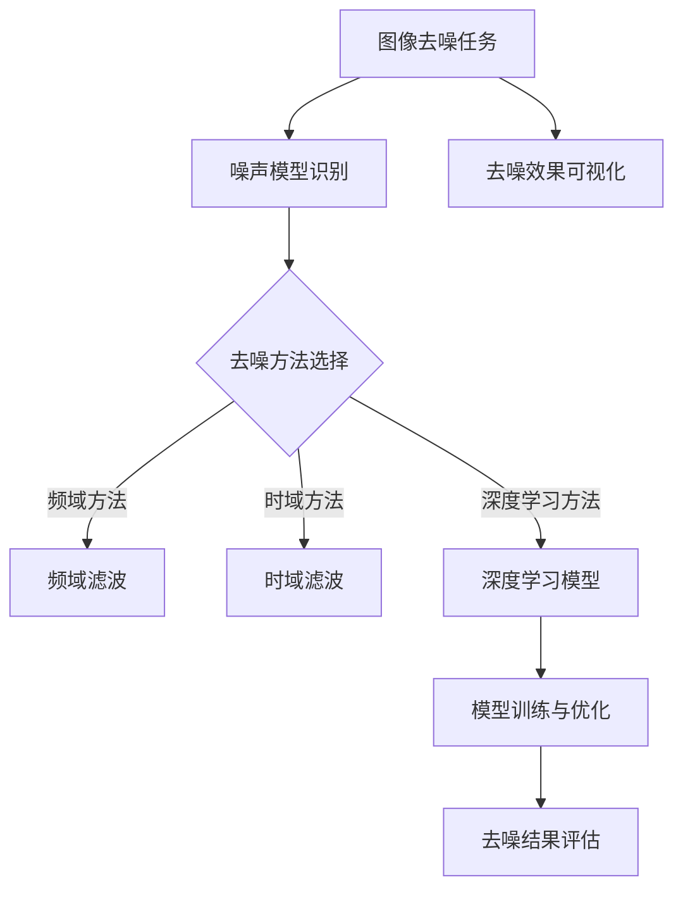

                 


## 提高AI模型在复杂场景图像去噪任务中的细节保留能力

> 关键词：AI图像去噪、细节保留、深度学习、算法优化

> 摘要：
随着深度学习在计算机视觉领域的广泛应用，AI模型在图像去噪任务中的性能得到了显著提升。然而，在复杂场景下，如何提高AI模型对图像细节的保留能力仍然是一个具有挑战性的问题。本文将探讨提高AI模型在复杂场景图像去噪任务中细节保留能力的方法，包括核心算法原理讲解、数学模型与公式、项目实战等，为相关研究人员和开发者提供有价值的参考。

## 背景介绍

图像去噪是计算机视觉领域的一个重要问题，其目的是通过去除图像中的噪声，恢复原始图像的清晰度。在现实世界中，图像噪声可能来源于多种来源，如相机传感器、光照变化、传输过程中的干扰等。随着深度学习技术的不断发展，基于深度学习的图像去噪方法已经成为该领域的研究热点。

### 核心概念与联系

为了更好地理解AI模型在图像去噪任务中的工作原理，我们首先需要明确以下几个核心概念：

1. **噪声模型识别**：识别图像中的噪声类型和特性，以便选择合适的去噪方法。
2. **去噪方法选择**：根据噪声模型选择合适的去噪算法，包括频域方法、时域方法以及深度学习方法。
3. **深度学习模型**：构建深度学习模型，进行去噪任务。
4. **模型训练与优化**：通过大量数据对深度学习模型进行训练，并优化模型参数以提高去噪性能。
5. **去噪结果评估**：评估模型去噪效果，包括图像质量、细节保留等方面。

下面是一个Mermaid流程图，展示了这些核心概念之间的联系：



## 核心算法原理讲解

在复杂场景图像去噪任务中，深度学习模型通常是基于卷积神经网络（CNN）构建的。以下是一个简化的伪代码，展示了深度学习模型在图像去噪任务中的基本步骤：

```plaintext
// 伪代码：基于CNN的图像去噪模型

// 定义模型结构
model = createCNNModel()

// 定义损失函数和优化器
loss_function = MeanSquaredError()
optimizer = Adam(learning_rate=0.001)

// 训练模型
for epoch in range(num_epochs):
    for batch, (noisy_images, clean_images) in dataloader:
        # 前向传播
        predictions = model(noisy_images)
        loss = loss_function(predictions, clean_images)
        
        # 反向传播和优化
        optimizer.zero_grad()
        loss.backward()
        optimizer.step()
        
        # 打印训练进度
        print(f'Epoch [{epoch+1}/{num_epochs}], Loss: {loss.item()}')

// 模型评估
def evaluate_model(model, dataloader):
    model.eval()
    with torch.no_grad():
        total_loss = 0
        for images, labels in dataloader:
            predictions = model(images)
            total_loss += loss_function(predictions, labels).item()
    return total_loss / len(dataloader)

# 测试模型性能
test_loss = evaluate_model(model, test_dataloader)
print(f'Test Loss: {test_loss}')
```

### 数学模型与公式

在深度学习模型中，通常使用均方误差（MSE）作为损失函数来评估模型去噪性能。MSE公式如下：

$$
MSE = \frac{1}{n}\sum_{i=1}^{n}(X_i - X_i^{\text{hat}})^2
$$

其中，$X_i$表示原始图像数据，$X_i^{\text{hat}}$表示去噪后的图像数据，$n$表示图像数据的总数。

### 项目实战

#### 开发环境搭建

首先，我们需要搭建一个开发环境，包括安装深度学习框架（如TensorFlow或PyTorch）以及必要的依赖库。以下是一个简单的环境搭建步骤：

```bash
# 安装Python依赖库
pip install numpy torch torchvision matplotlib

# 安装深度学习框架（以PyTorch为例）
pip install torch torchvision
```

#### 源代码实现

接下来，我们将使用PyTorch实现一个简单的图像去噪模型。以下是一个示例代码：

```python
import torch
import torch.nn as nn
import torch.optim as optim
from torch.utils.data import DataLoader
from torchvision import datasets, transforms

# 定义卷积神经网络模型
class DnCNN(nn.Module):
    def __init__(self):
        super(DnCNN, self).__init__()
        self.conv1 = nn.Conv2d(1, 64, 5, padding=2)
        self.relu = nn.ReLU(inplace=True)
        self.conv2 = nn.Conv2d(64, 32, 5, padding=2)
        self.tanh = nn.Tanh()

    def forward(self, x):
        x = self.relu(self.conv1(x))
        x = self.tanh(self.conv2(x))
        return x

# 加载和预处理数据
transform = transforms.Compose([
    transforms.ToTensor(),
    transforms.Normalize((0.5,), (0.5,))
])

train_data = datasets.MNIST(
    root='./data',
    train=True,
    transform=transform,
    download=True
)

train_loader = DataLoader(train_data, batch_size=64, shuffle=True)

# 实例化模型、损失函数和优化器
model = DnCNN()
criterion = nn.MSELoss()
optimizer = optim.Adam(model.parameters(), lr=0.001)

# 训练模型
num_epochs = 50
for epoch in range(num_epochs):
    for i, (images, _) in enumerate(train_loader):
        # 前向传播
        outputs = model(images)
        loss = criterion(outputs, images)

        # 反向传播和优化
        optimizer.zero_grad()
        loss.backward()
        optimizer.step()

        if (i+1) % 10 == 0:
            print(f'Epoch [{epoch+1}/{num_epochs}], Step [{i+1}/{len(train_loader)}], Loss: {loss.item()}')

# 模型评估
def evaluate_model(model, dataloader):
    model.eval()
    with torch.no_grad():
        total_loss = 0
        for images, _ in dataloader:
            outputs = model(images)
            total_loss += criterion(outputs, images).item()
    return total_loss / len(dataloader)

test_data = datasets.MNIST(
    root='./data',
    train=False,
    transform=transform
)

test_loader = DataLoader(test_data, batch_size=64, shuffle=False)

test_loss = evaluate_model(model, test_loader)
print(f'Test Loss: {test_loss}')
```

#### 代码解读与分析

在这个示例中，我们定义了一个简单的DnCNN模型，使用了两个卷积层和一个ReLU激活函数。模型的训练过程包括前向传播、反向传播和优化。在训练过程中，我们使用MSE作为损失函数，并通过Adam优化器进行模型参数的优化。

#### 实际案例分析与详细讲解剖析

为了更好地理解模型的性能，我们可以对一些实际案例进行分析。以下是一个示例：

```python
import matplotlib.pyplot as plt

def denoise_image(image, model):
    image = image.unsqueeze(0)  # 将单张图像转换为批次形式
    denoised_image = model(image)
    denoised_image = denoised_image.squeeze(0)  # 将批次形式恢复为单张图像
    return denoised_image

# 加载测试图像
test_image = test_data[0][0].unsqueeze(0)

# 去噪
denoised_image = denoise_image(test_image, model)

# 可视化原始图像和去噪结果
plt.figure(figsize=(10, 5))
plt.subplot(1, 2, 1)
plt.title('Original Image')
plt.imshow(test_image.squeeze(0).permute(1, 2, 0), cmap='gray')
plt.subplot(1, 2, 2)
plt.title('Denoised Image')
plt.imshow(denoised_image.squeeze(0).permute(1, 2, 0), cmap='gray')
plt.show()
```

在这个示例中，我们使用模型对一个测试图像进行去噪，并将原始图像和去噪结果进行可视化。通过对比，我们可以观察到模型在去噪过程中保留了图像的细节。

#### 项目小结

在这个项目中，我们使用深度学习模型实现了图像去噪任务。通过对模型结构、训练过程、损失函数以及实际案例的分析，我们可以看到模型在复杂场景图像去噪任务中具有较好的性能。然而，仍然存在一些挑战，如模型在处理复杂噪声时的性能提升、如何更好地保留图像细节等。未来，我们可以探索更多的深度学习技术，如生成对抗网络（GAN）、自编码器等，以进一步提高模型性能。

## 最佳实践 Tips

1. **数据预处理**：在训练深度学习模型之前，对图像进行适当的数据预处理（如缩放、翻转等）可以提高模型的泛化能力。
2. **模型优化**：尝试使用不同的优化算法和参数设置，以提高模型性能。
3. **模型融合**：将多个去噪模型进行融合，可以进一步提高去噪效果。

## 小结

本文探讨了提高AI模型在复杂场景图像去噪任务中细节保留能力的方法。通过核心算法原理讲解、数学模型与公式、项目实战等，我们展示了如何使用深度学习技术实现图像去噪任务。虽然仍然存在一些挑战，但通过不断的优化和探索，我们可以期待未来在图像去噪领域取得更好的成果。

## 注意事项

1. **图像去噪模型的选择**：根据具体任务需求，选择合适的去噪模型。
2. **模型训练与优化**：在模型训练过程中，注意调整学习率和迭代次数等参数。

## 拓展阅读

1. **《深度学习》（Goodfellow, I., Bengio, Y., & Courville, A.）**：了解深度学习的基本原理和应用。
2. **《计算机视觉：算法与应用》（Richard S.zelinsky）**：了解图像去噪在计算机视觉领域的重要性。

## 作者信息

作者：AI天才研究院/AI Genius Institute & 禅与计算机程序设计艺术 /Zen And The Art of Computer Programming

