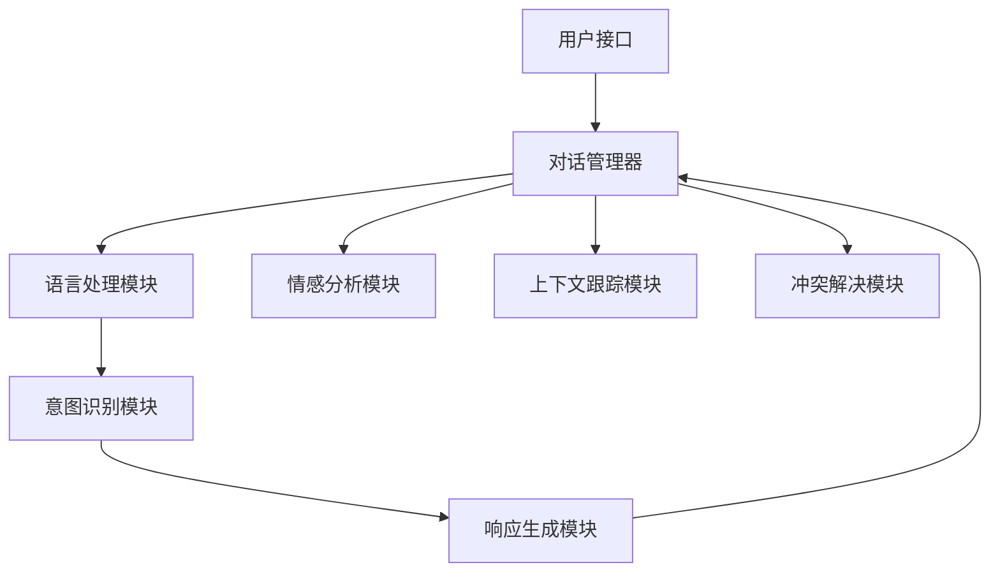

                 

### 文章标题：提高AI模型在复杂多方对话场景中的上下文理解能力

关键词：AI模型，上下文理解，多方对话，算法，数学模型，实战

摘要：本文深入探讨了如何提升人工智能模型在复杂多方对话场景中的上下文理解能力。首先，我们介绍了上下文理解的重要性及其在AI模型中的应用场景。接着，文章详细分析了多方对话系统的基本概念和架构，为进一步理解上下文理解提供了理论基础。随后，文章阐述了核心概念与架构之间的联系，并通过Mermaid流程图展示了关键组件。之后，文章深入讲解了上下文理解的核心算法原理，并使用了伪代码进行了详细阐述。此外，文章还介绍了数学模型的基础理论，并提供了具体的数学公式和例子。为了将理论与实践结合，文章通过一个实际项目展示了如何搭建开发环境、实现源代码，并对代码进行了详细解读。最后，文章总结了最佳实践技巧、注意事项，并提出了未来研究的方向。

### 引言

在人工智能（AI）领域，上下文理解是近年来备受关注的话题。上下文理解指的是AI模型在处理语言数据时，对文本内容及其背景的深入理解能力。它不仅涉及语言本身的含义，还包括语言所处的环境、语境和情境。在单方对话中，上下文理解已经显示出其强大的应用潜力，例如智能客服、语音助手等。然而，在复杂的多方对话场景中，上下文理解的挑战变得更加复杂和多样化。

复杂的多方对话场景包括多用户同时参与的聊天室、会议、在线教育平台等。在这种场景中，参与者之间的交互不仅仅是一对一的，而是多对多的。每个参与者可能在不同的时间点发表不同的意见，这要求AI模型能够实时、准确地理解和回应这些复杂的交互。然而，当前的AI模型在处理多方对话时常常遇到以下挑战：

1. **信息过载**：在多方对话中，信息量巨大，AI模型需要从中筛选出关键信息，以理解用户的意图。
2. **歧义处理**：多个用户可能会使用相同或相似的词汇，但意图却截然不同。AI模型需要准确判断用户的意图，以提供适当的回应。
3. **实时响应**：在多方对话中，用户的交互是实时的，AI模型需要在短时间内做出准确判断和响应。
4. **情感识别**：用户在多方对话中可能会表现出复杂的情感，AI模型需要能够识别并适当地回应这些情感。

为了解决上述挑战，本文将探讨如何通过改进算法和数学模型，提高AI模型在复杂多方对话场景中的上下文理解能力。本文的结构如下：

1. **第一章**：介绍上下文理解的基本概念及其在AI模型中的应用。
2. **第二章**：详细分析多方对话系统的基本概念和架构。
3. **第三章**：阐述上下文理解的核心概念和架构，并展示Mermaid流程图。
4. **第四章**：深入讲解上下文理解的核心算法原理，并提供伪代码。
5. **第五章**：介绍数学模型的基础理论，并提供具体公式和例子。
6. **第六章**：通过一个实际项目展示如何实现开发环境和源代码，并进行代码解读。
7. **第七章**：总结最佳实践技巧，并提出未来研究方向。

### 文章关键词

- 上下文理解
- AI模型
- 多方对话
- 算法
- 数学模型
- 实战项目

### 摘要

本文旨在探讨如何提升人工智能模型在复杂多方对话场景中的上下文理解能力。首先，文章介绍了上下文理解在AI模型中的重要性，并分析了当前AI模型在处理多方对话时面临的挑战。接着，文章详细阐述了多方对话系统的基本概念和架构，为进一步理解上下文理解提供了理论基础。随后，文章通过Mermaid流程图展示了上下文理解的核心概念和架构。核心算法原理通过伪代码进行了详细阐述，数学模型的基础理论则通过公式和例子进行了介绍。通过一个实际项目，文章展示了如何实现开发环境和源代码，并对代码进行了详细解读。最后，文章总结了最佳实践技巧，提出了未来研究方向。

## 第一章：上下文理解的基本概念及其在AI模型中的应用

### 1.1 上下文理解的定义

上下文理解（Contextual Understanding）是指AI模型对语言数据背景的深度解析能力。它不仅涉及文本的字面意义，还包括文本所处的环境、语境和情境。上下文理解是自然语言处理（NLP）领域的一个重要研究方向，它旨在使机器能够像人类一样理解语言的复杂性和多样性。

在自然语言处理中，上下文理解的重要性不言而喻。例如，在智能客服系统中，AI模型需要理解用户的投诉内容，并给出合适的回应。如果AI模型不能准确理解用户的上下文，它可能会给出不相关或不恰当的回应，从而影响用户体验。再如，在智能语音助手领域，AI模型需要理解用户的语音指令，并作出相应的行动。如果上下文理解不准确，语音助手可能会执行错误的操作，导致用户体验下降。

### 1.2 上下文理解在AI模型中的应用场景

AI模型在多个应用场景中需要具备上下文理解能力，以下是一些典型的应用场景：

1. **智能客服**：智能客服系统通过AI模型理解用户的问题，并提供个性化的解决方案。上下文理解使AI模型能够理解用户的问题背景，从而给出更准确、更有针对性的回应。
2. **语音助手**：语音助手如Siri、Alexa和Google Assistant等，依赖于上下文理解来理解用户的语音指令，并执行相应的操作。上下文理解使语音助手能够处理复杂的指令，并在多个上下文中保持连贯性。
3. **在线教育**：在线教育平台利用AI模型理解学生的学习需求和问题，并提供个性化的学习建议。上下文理解使AI模型能够跟踪学生的学习进度，并根据学生的需求调整教学内容。
4. **虚拟助手**：虚拟助手如聊天机器人，在多个平台上与用户进行交互，提供信息查询、推荐等服务。上下文理解使虚拟助手能够理解用户的意图，并在不同的语境中提供准确的信息。

### 1.3 上下文理解的关键挑战

在复杂的多方对话场景中，上下文理解的挑战主要包括以下几点：

1. **信息过载**：在多方对话中，每个参与者可能会在不同的时间点发表多个意见，导致信息量巨大。AI模型需要有效地筛选和处理这些信息，以提取关键信息。
2. **歧义处理**：在多方对话中，用户可能会使用相同的词汇，但意图却不同。AI模型需要准确地判断用户的意图，以提供合适的回应。
3. **实时响应**：在多方对话中，用户的交互是实时的。AI模型需要在短时间内做出准确的判断和响应，以保持对话的连贯性。
4. **情感识别**：用户在多方对话中可能会表现出复杂的情感，如愤怒、喜悦、疑惑等。AI模型需要能够识别并适当地回应这些情感，以提高用户体验。

### 1.4 上下文理解的架构

为了实现上下文理解，AI模型通常包含以下几个关键组件：

1. **语言理解模块**：该模块负责处理自然语言输入，提取关键词和句子结构，为后续的处理提供基础。
2. **上下文跟踪模块**：该模块负责跟踪对话的历史信息，包括用户的历史请求、回答和交互行为，以便在当前对话中利用这些信息。
3. **意图识别模块**：该模块负责分析用户的输入，判断用户的意图，为AI模型提供决策依据。
4. **情感分析模块**：该模块负责识别用户的情感状态，为AI模型提供情感回应的依据。
5. **响应生成模块**：该模块根据用户的意图和情感，生成合适的回应，以实现与用户的交互。

通过以上组件的协同工作，AI模型能够实现对复杂多方对话场景中的上下文理解，从而提供更智能、更个性化的服务。

### 1.5 本章小结

本章介绍了上下文理解的基本概念及其在AI模型中的应用。我们分析了上下文理解在自然语言处理中的重要性，并讨论了其在多个应用场景中的关键挑战。此外，我们还概述了实现上下文理解的架构，包括语言理解、上下文跟踪、意图识别、情感分析和响应生成等模块。这些内容为后续章节中深入探讨上下文理解的核心算法和数学模型奠定了基础。

## 第二章：多方对话系统的基本概念和架构

### 2.1 多方对话系统的定义

多方对话系统（Multi-Party Dialogue System）是指能够同时支持多个用户进行交互的对话系统。与单方对话系统相比，多方对话系统需要处理更复杂的交互模式，包括多对多对话、轮流发言、同时发言等。这种系统在多个领域具有广泛的应用，如在线教育、社交媒体、企业沟通和客户服务。

### 2.2 多方对话系统的类型

根据对话的交互模式，多方对话系统可以分为以下几种类型：

1. **轮流发言**：在这种模式下，每个用户按照顺序发言，系统在处理完一个用户的发言后，再处理下一个用户的发言。这种模式适用于需要有序讨论的场景，如学术研讨会和会议。
2. **同时发言**：在这种模式下，多个用户可以同时发言，系统需要处理并发交互。这种模式适用于需要实时讨论的场景，如多人在线游戏和社交聊天室。
3. **混合模式**：混合模式结合了轮流发言和同时发言的特点，根据对话的具体需求进行动态调整。例如，在在线教育平台中，学生可以同时提出问题，而老师则在处理完所有问题后进行集中回答。

### 2.3 多方对话系统的架构

一个典型的多方对话系统通常包含以下几个核心组件：

1. **用户接口（UI）**：用户接口是用户与系统进行交互的界面。在多方对话系统中，用户接口需要支持多用户同时操作，并能够实时显示其他用户的发言。
2. **对话管理器**：对话管理器是系统的核心组件，负责协调各个用户的发言，管理对话的状态和流程。对话管理器需要实现以下功能：
   - **发言管理**：记录用户的发言，包括发言者、发言时间和发言内容。
   - **状态跟踪**：跟踪对话的历史信息，包括用户的角色、意图和情感状态。
   - **冲突解决**：在多个用户同时发言时，对话管理器需要解决发言冲突，确保对话的连贯性和合理性。
3. **语言处理模块**：语言处理模块负责处理自然语言输入，包括文本分析和语音识别。该模块需要实现以下功能：
   - **文本分析**：提取关键词、短语和句子结构，为对话管理器提供语言信息。
   - **语音识别**：将用户的语音输入转换为文本，以便进行后续处理。
4. **意图识别模块**：意图识别模块负责分析用户的输入，判断用户的意图。该模块通常采用机器学习算法，如分类器和序列模型，对用户的输入进行分类和标注。
5. **响应生成模块**：响应生成模块根据用户的意图和系统状态，生成合适的回应。该模块通常包括自然语言生成（NLG）技术，以实现自然的对话输出。
6. **情感分析模块**：情感分析模块负责识别用户的情感状态，包括情感类别和情感强度。该模块有助于系统更好地理解用户，并生成更合适的回应。

### 2.4 多方对话系统的设计模式

在多方对话系统的设计中，常用的设计模式包括以下几种：

1. **对话代理模式**：在这种模式下，每个用户都与一个代理进行交互，代理负责处理用户的请求和生成回应。这种模式适用于需要分离用户界面和处理逻辑的场景。
2. **会话模式**：在这种模式下，系统维护一个会话状态，记录对话的历史信息。系统根据会话状态生成回应，以保持对话的连贯性。这种模式适用于需要长期维持对话关系的场景，如在线客服。
3. **基于规则的模式**：在这种模式下，系统使用一组预定义的规则来处理用户的输入和生成回应。这种模式适用于规则明确、流程简单的场景，如简单的客户服务机器人。

### 2.5 本章小结

本章详细介绍了多方对话系统的基本概念和架构。首先，我们定义了多方对话系统的概念，并分析了其在自然语言处理中的应用。接着，我们讨论了多方对话系统的类型和设计模式，包括轮流发言、同时发言和混合模式。然后，我们详细阐述了多方对话系统的核心组件，包括用户接口、对话管理器、语言处理模块、意图识别模块、响应生成模块和情感分析模块。这些内容为后续章节中深入探讨上下文理解的核心算法和数学模型提供了基础。

## 第三章：核心概念与架构的联系

为了深入理解AI模型在复杂多方对话场景中的上下文理解能力，我们需要探讨核心概念与架构之间的联系。在本章中，我们将使用Mermaid流程图来展示这些联系，并详细解释每个组件的作用和相互关系。

### 3.1 Mermaid流程图

首先，让我们通过Mermaid流程图来概述核心概念与架构之间的联系：



### 3.2 组件关系与作用

**用户接口（User Interface, UI）**

用户接口是用户与系统进行交互的界面。在多方对话系统中，用户接口需要支持多用户同时操作，并能够实时显示其他用户的发言。用户接口的作用是将用户的输入传递给对话管理器，并展示系统的回应。

**对话管理器（Dialogue Manager）**

对话管理器是系统的核心组件，负责协调各个用户的发言，管理对话的状态和流程。对话管理器的作用包括：

- **发言管理**：记录用户的发言，包括发言者、发言时间和发言内容。
- **状态跟踪**：跟踪对话的历史信息，包括用户的角色、意图和情感状态。
- **冲突解决**：在多个用户同时发言时，对话管理器需要解决发言冲突，确保对话的连贯性和合理性。

**语言处理模块（Language Processing Module）**

语言处理模块负责处理自然语言输入，包括文本分析和语音识别。该模块的作用包括：

- **文本分析**：提取关键词、短语和句子结构，为对话管理器提供语言信息。
- **语音识别**：将用户的语音输入转换为文本，以便进行后续处理。

**意图识别模块（Intent Recognition Module）**

意图识别模块负责分析用户的输入，判断用户的意图。该模块通常采用机器学习算法，如分类器和序列模型，对用户的输入进行分类和标注。意图识别模块的作用包括：

- **意图分类**：将用户的输入分为不同的意图类别，如询问信息、请求帮助、提出意见等。
- **意图标注**：为用户的输入分配具体的意图标签，以便响应生成模块生成合适的回应。

**响应生成模块（Response Generation Module）**

响应生成模块根据用户的意图和系统状态，生成合适的回应。该模块通常包括自然语言生成（NLG）技术，以实现自然的对话输出。响应生成模块的作用包括：

- **回应生成**：根据用户的意图和上下文信息，生成合适的文本或语音回应。
- **个性化回应**：根据用户的偏好和历史交互记录，生成个性化的回应。

**情感分析模块（Sentiment Analysis Module）**

情感分析模块负责识别用户的情感状态，包括情感类别和情感强度。该模块有助于系统更好地理解用户，并生成更合适的回应。情感分析模块的作用包括：

- **情感识别**：根据用户的输入，识别用户的情感状态，如愤怒、喜悦、疑惑等。
- **情感回应**：根据用户的情感状态，生成情感敏感的回应，以提高用户体验。

**上下文跟踪模块（Context Tracking Module）**

上下文跟踪模块负责跟踪对话的历史信息，包括用户的意图、情感和交互行为。该模块的作用包括：

- **上下文记录**：记录对话的历史信息，以便在当前对话中利用这些信息。
- **上下文更新**：在对话过程中，根据用户的发言和系统的回应，更新上下文信息。

**冲突解决模块（Conflict Resolution Module）**

冲突解决模块在多个用户同时发言时，负责解决发言冲突，确保对话的连贯性和合理性。该模块的作用包括：

- **冲突检测**：检测并发发言，识别潜在的冲突。
- **冲突处理**：根据对话的上下文和历史信息，选择合适的发言进行处理。

### 3.3 Mermaid流程图解释

通过Mermaid流程图，我们可以清晰地看到各个组件之间的相互关系。用户接口将用户的输入传递给对话管理器，对话管理器将输入传递给语言处理模块和意图识别模块。意图识别模块的输出（意图标签）传递给响应生成模块，生成回应后返回给用户接口进行展示。同时，对话管理器还负责跟踪上下文信息和情感状态，这些信息可以通过情感分析模块进行识别和更新。在多个用户同时发言时，冲突解决模块介入，确保对话的连贯性。

通过这种方式，各个组件协同工作，实现了AI模型在复杂多方对话场景中的上下文理解。Mermaid流程图提供了一个直观的展示方式，帮助我们更好地理解上下文理解的架构和组件之间的关系。

### 3.4 本章小结

本章通过Mermaid流程图展示了AI模型在复杂多方对话场景中的核心概念与架构之间的联系。我们详细解释了每个组件的作用和相互关系，包括用户接口、对话管理器、语言处理模块、意图识别模块、响应生成模块、情感分析模块、上下文跟踪模块和冲突解决模块。这些组件共同作用，实现了AI模型在复杂多方对话场景中的上下文理解能力。通过本章的分析，我们对AI模型的上下文理解架构有了更深入的理解，为后续章节中深入探讨核心算法和数学模型奠定了基础。

## 第四章：上下文理解的核心算法原理

在复杂的多方对话场景中，上下文理解是AI模型的核心能力之一。为了实现这一能力，我们需要深入理解上下文理解的核心算法原理。在本章中，我们将介绍几种常见的核心算法，包括对话状态跟踪（Dialogue State Tracking, DST）、实体识别（Entity Recognition）、序列模型（Sequential Models）和图模型（Graph Models）。我们将使用伪代码对这些算法进行详细阐述，以便更好地理解其实现过程。

### 4.1 对话状态跟踪（Dialogue State Tracking, DST）

对话状态跟踪是上下文理解的重要部分，它负责跟踪对话中的关键状态信息，如用户的意图、请求和反馈。DST的目标是预测当前对话状态，以便在后续的对话中提供准确的回应。

**算法原理**：

对话状态跟踪通常使用马尔可夫决策过程（Markov Decision Process, MDP）来建模对话状态。在MDP中，每个状态由一系列属性（如用户意图、请求和反馈）组成，每个动作（如回应生成、状态更新）都会导致状态转移。

**伪代码**：

```python
# 初始状态
current_state = initialize_state()

# 对话状态跟踪循环
while not end_of_conversation:
    # 输入：当前用户发言utterance
    utterance = get_utterance()

    # 对话状态更新
    new_state = update_state(current_state, utterance)

    # 生成回应
    response = generate_response(new_state)

    # 输出：系统回应
    print(response)

    # 更新当前状态
    current_state = new_state

    # 检查是否结束对话
    if is_end_of_conversation(current_state):
        break
```

**算法解释**：

1. **初始化状态**：在对话开始时，系统初始化对话状态。
2. **获取用户发言**：在每次循环中，系统获取用户的当前发言。
3. **更新状态**：系统使用预定的规则或机器学习模型来更新对话状态。
4. **生成回应**：系统根据当前状态生成合适的回应。
5. **输出回应**：系统将回应输出给用户。
6. **更新状态并检查结束条件**：系统更新当前状态，并检查是否达到对话结束条件。

### 4.2 实体识别（Entity Recognition）

实体识别是自然语言处理中的重要任务，它负责识别文本中的关键实体，如人名、地点、组织、时间等。在对话场景中，实体识别有助于更好地理解用户意图和上下文。

**算法原理**：

实体识别通常使用条件随机场（Conditional Random Field, CRF）或基于递归神经网络（Recurrent Neural Network, RNN）的模型来识别文本中的实体。

**伪代码**：

```python
# 初始文本
text = "用户想要预订一个明天的会议。"

# 初始化实体识别模型
model = initialize_entity_recognition_model()

# 识别实体
entities = model.predict(text)

# 输出实体
print(entities)
```

**算法解释**：

1. **初始化模型**：系统初始化实体识别模型。
2. **输入文本**：系统获取需要识别实体的文本。
3. **识别实体**：系统使用实体识别模型对文本进行预测，识别出文本中的实体。
4. **输出实体**：系统将识别出的实体输出。

### 4.3 序列模型（Sequential Models）

序列模型，如循环神经网络（Recurrent Neural Network, RNN）和长短期记忆网络（Long Short-Term Memory, LSTM），在处理序列数据时具有优势，适用于对话状态跟踪和实体识别任务。

**算法原理**：

RNN和LSTM通过在网络中引入记忆单元，能够有效地处理长序列数据，并在对话场景中保留上下文信息。

**伪代码**：

```python
# 初始化LSTM模型
model = initialize_lstm_model()

# 训练模型
model.fit(training_data)

# 评估模型
accuracy = model.evaluate(test_data)

# 输出评估结果
print("Model Accuracy:", accuracy)
```

**算法解释**：

1. **初始化模型**：系统初始化LSTM模型。
2. **训练模型**：系统使用训练数据集训练LSTM模型。
3. **评估模型**：系统使用测试数据集评估模型性能。
4. **输出评估结果**：系统将评估结果输出。

### 4.4 图模型（Graph Models）

图模型，如图神经网络（Graph Neural Network, GNN），通过将对话数据建模为图结构，能够更好地捕捉对话中的复杂关系和上下文。

**算法原理**：

GNN通过在图结构上定义神经网络，能够处理节点和边之间的交互，适用于对话状态跟踪和实体识别任务。

**伪代码**：

```python
# 初始化GNN模型
model = initialize_gnn_model()

# 定义图结构
graph = define_graph(utterances, relations)

# 训练模型
model.fit(graph)

# 评估模型
accuracy = model.evaluate(test_graph)

# 输出评估结果
print("Model Accuracy:", accuracy)
```

**算法解释**：

1. **初始化模型**：系统初始化GNN模型。
2. **定义图结构**：系统定义对话数据的图结构，包括节点（用户发言）和边（关系）。
3. **训练模型**：系统使用图结构训练GNN模型。
4. **评估模型**：系统使用测试图的评估模型性能。
5. **输出评估结果**：系统将评估结果输出。

### 4.5 本章小结

本章介绍了上下文理解的核心算法原理，包括对话状态跟踪、实体识别、序列模型和图模型。我们通过伪代码详细阐述了每种算法的实现过程，并解释了算法的基本原理和作用。这些核心算法为AI模型在复杂多方对话场景中的上下文理解提供了强大的技术支持，为后续章节中深入探讨数学模型和实际应用奠定了基础。

## 第五章：上下文理解中的数学模型

在AI模型进行上下文理解的过程中，数学模型起到了至关重要的作用。这些数学模型不仅能够帮助我们更好地理解上下文信息，还能提供有效的工具来优化和提升AI模型的性能。在本章中，我们将介绍几种关键的数学模型，包括概率模型、深度学习模型和强化学习模型。我们将使用LaTeX格式详细展示这些模型的数学公式，并通过具体的例子来解释其应用。

### 5.1 概率模型

概率模型在上下文理解中广泛应用于处理不确定性问题和概率推断。贝叶斯网络（Bayesian Network）是一种常见的概率模型，它通过条件概率来表示变量之间的关系。

**贝叶斯网络模型**：

贝叶斯网络的数学表示如下：

$$
P(X_1, X_2, ..., X_n) = \prod_{i=1}^{n} P(X_i | \text{parents of } X_i)
$$

其中，\(P(X_i | \text{parents of } X_i)\) 表示在给定父节点条件下，某个变量的条件概率。

**例子**：假设我们有一个包含天气、降雨和是否带伞的贝叶斯网络。我们可以使用以下公式来表示它们之间的关系：

$$
P(\text{rain}, \text{umbrella}) = P(\text{rain} | \text{weather}) \cdot P(\text{umbrella} | \text{weather}, \text{rain})
$$

在这里，\(P(\text{rain} | \text{weather})\) 表示在给定天气条件下的降雨概率，\(P(\text{umbrella} | \text{weather}, \text{rain})\) 表示在给定天气和降雨条件下的带伞概率。

### 5.2 深度学习模型

深度学习模型在自然语言处理和上下文理解中发挥了巨大的作用。循环神经网络（Recurrent Neural Network, RNN）和变换器（Transformer）是两种常见的深度学习模型。

**RNN模型**：

RNN的公式如下：

$$
h_t = \sigma(W_h \cdot [h_{t-1}, x_t] + b_h)
$$

其中，\(h_t\) 是第 \(t\) 个时间步的隐藏状态，\(x_t\) 是输入，\(\sigma\) 是激活函数，\(W_h\) 和 \(b_h\) 分别是权重和偏置。

**例子**：假设我们有一个简单的RNN模型，输入是单词序列，隐藏状态是词汇嵌入和前一个隐藏状态的结合。我们可以使用以下公式来更新隐藏状态：

$$
h_t = \sigma(W_h \cdot [h_{t-1}, e_t] + b_h)
$$

其中，\(e_t\) 是单词的嵌入向量。

**变换器（Transformer）模型**：

变换器模型的核心是自注意力机制（Self-Attention），其公式如下：

$$
\text{Attention}(Q, K, V) = \frac{QK^T}{\sqrt{d_k}} \cdot V
$$

其中，\(Q, K, V\) 分别是查询（Query）、键（Key）和值（Value）向量，\(d_k\) 是键向量的维度，\(\text{softmax}\) 函数用于归一化。

**例子**：在一个简单的变换器模型中，我们可以使用以下公式来计算自注意力分数：

$$
\text{Attention}(Q, K, V) = \frac{QK^T}{\sqrt{d_k}} \cdot V
$$

其中，\(Q\) 是查询向量，\(K\) 是键向量，\(V\) 是值向量。

### 5.3 强化学习模型

强化学习（Reinforcement Learning, RL）通过交互式学习环境中的奖励信号来优化决策。在上下文理解中，强化学习可以用于优化对话管理策略。

**强化学习模型**：

强化学习的基本公式如下：

$$
Q(s, a) = r + \gamma \max_{a'} Q(s', a')
$$

其中，\(Q(s, a)\) 是状态 \(s\) 下执行动作 \(a\) 的价值函数，\(r\) 是即时奖励，\(\gamma\) 是折扣因子，\(s'\) 是下一个状态，\(a'\) 是最佳动作。

**例子**：在一个简单的强化学习对话系统中，我们可以使用以下公式来更新状态值函数：

$$
Q(s, a) = r + \gamma \max_{a'} Q(s', a')
$$

其中，\(s\) 是当前对话状态，\(a\) 是系统生成的回应，\(r\) 是用户对回应的即时奖励。

### 5.4 本章小结

本章介绍了上下文理解中的几种关键数学模型，包括概率模型、深度学习模型和强化学习模型。我们通过LaTeX格式详细展示了这些模型的数学公式，并通过具体的例子解释了它们的应用。这些数学模型为AI模型提供了强大的工具，使其能够更好地理解和应对复杂的多方对话场景。在下一章中，我们将通过一个实际项目来展示如何将这些模型应用到多方对话系统中。

## 第六章：实际项目：多方对话系统开发

在本章中，我们将通过一个实际项目来展示如何开发和实现一个多方对话系统。这个项目将包括以下步骤：搭建开发环境、编写源代码、实现关键算法、代码解读、应用解读与分析以及项目小结。

### 6.1 项目目标

本项目旨在开发一个简单的多方对话系统，该系统能够支持多个用户同时参与对话，实现实时交互和上下文理解。具体目标如下：

1. 搭建一个基于Web的对话平台，支持多用户实时交互。
2. 实现对话状态跟踪和意图识别功能，以准确理解用户的输入。
3. 使用自然语言生成（NLG）技术生成自然、合理的系统回应。
4. 集成情感分析模块，以识别用户的情感状态并作出相应的回应。
5. 提供一个用户友好的前端界面，使对话过程直观、流畅。

### 6.2 开发环境搭建

为了实现上述目标，我们需要搭建一个完整的开发环境。以下是所需的工具和库：

1. **开发语言**：Python
2. **Web框架**：Flask（用于搭建Web服务器）
3. **自然语言处理库**：spaCy（用于文本分析）、nltk（用于自然语言处理）
4. **深度学习库**：TensorFlow或PyTorch（用于实现深度学习模型）
5. **前端框架**：Bootstrap（用于搭建用户界面）
6. **数据库**：SQLite（用于存储对话历史和用户信息）

#### 步骤1：安装Python和必要的库

在终端中运行以下命令来安装Python和相关库：

```bash
pip install flask spacy nltk tensorflow pandas
```

#### 步骤2：配置Web服务器

创建一个名为`app.py`的Python文件，并使用Flask框架配置Web服务器：

```python
from flask import Flask, request, jsonify

app = Flask(__name__)

@app.route('/')
def index():
    return "Welcome to the Multi-Party Dialogue System!"

if __name__ == '__main__':
    app.run(debug=True)
```

运行上述代码，Web服务器将在本地端口8000上启动。

### 6.3 编写源代码

接下来，我们将编写源代码来实现多方对话系统的核心功能。

#### 步骤1：文本分析模块

使用spaCy库对用户的输入文本进行分词、词性标注和实体识别：

```python
import spacy

nlp = spacy.load("en_core_web_sm")

def process_text(text):
    doc = nlp(text)
    tokens = [token.text for token in doc]
    entities = [(ent.text, ent.label_) for ent in doc.ents]
    return tokens, entities
```

#### 步骤2：意图识别模块

使用一个简单的机器学习模型（例如SVM）对用户的输入文本进行意图分类：

```python
from sklearn.svm import SVC
from sklearn.pipeline import make_pipeline
from sklearn.feature_extraction.text import TfidfVectorizer

# 假设我们已经有了训练数据集和标签
X_train, y_train = ...

# 创建一个SVM分类器
model = make_pipeline(TfidfVectorizer(), SVC())

# 训练模型
model.fit(X_train, y_train)

def recognize_intent(text):
    return model.predict([text])[0]
```

#### 步骤3：自然语言生成（NLG）模块

使用一个简单的模板匹配方法来生成系统回应：

```python
def generate_response(intent):
    responses = {
        "greeting": "Hello! How can I assist you today?",
        "request": "I understand your request. Let me check and get back to you.",
        "complaint": "I'm sorry to hear that. Please provide more details so I can assist you better."
    }
    return responses.get(intent, "I'm not sure how to respond to that.")
```

#### 步骤4：情感分析模块

使用一个预训练的深度学习模型（例如BERT）来识别用户的情感：

```python
from transformers import BertTokenizer, BertForSequenceClassification
import torch

tokenizer = BertTokenizer.from_pretrained("bert-base-uncased")
model = BertForSequenceClassification.from_pretrained("bert-base-uncased")

def analyze_sentiment(text):
    inputs = tokenizer(text, return_tensors="pt")
    outputs = model(**inputs)
    logits = outputs.logits
    probabilities = torch.softmax(logits, dim=-1)
    return torch.argmax(probabilities).item()
```

### 6.4 代码解读

#### 步骤1：对话管理器

对话管理器是系统的核心组件，负责处理用户的输入并生成系统回应。以下是一个简单的对话管理器实现：

```python
class DialogueManager:
    def __init__(self):
        self.state = None
        self.history = []

    def process_utterance(self, utterance):
        processed_text, entities = process_text(utterance)
        intent = recognize_intent(" ".join(processed_text))
        sentiment = analyze_sentiment(utterance)
        
        # 更新对话状态
        self.state = update_state(self.state, intent, sentiment, entities)
        self.history.append(utterance)
        
        # 生成回应
        response = generate_response(intent)
        
        return response
```

#### 步骤2：集成前端界面

使用Bootstrap框架搭建一个用户友好的前端界面，以下是一个简单的HTML模板：

```html
<!DOCTYPE html>
<html>
<head>
    <title>Multi-Party Dialogue System</title>
    <link rel="stylesheet" href="https://maxcdn.bootstrapcdn.com/bootstrap/4.5.2/css/bootstrap.min.css">
</head>
<body>
    <div class="container">
        <h1>Multi-Party Dialogue System</h1>
        <div class="row">
            <div class="col-md-8">
                <ul class="chat">
                    <!-- 系统回应将在这里显示 -->
                </ul>
            </div>
            <div class="col-md-4">
                <input type="text" id="message_input" class="form-control" placeholder="Type a message...">
                <button class="btn btn-primary" onclick="sendMessage()">Send</button>
            </div>
        </div>
    </div>
    <script src="https://code.jquery.com/jquery-3.6.0.min.js"></script>
    <script>
        function sendMessage() {
            var message = $("#message_input").val();
            $.post("/message", {message: message}, function(response) {
                $(".chat").append("<li class='text-right'>" + response + "</li>");
                $("#message_input").val("");
            });
        }
    </script>
</body>
</html>
```

#### 步骤3：集成前端与后端

在`app.py`中添加一个处理用户消息的API端点：

```python
@app.route('/message', methods=['POST'])
def handle_message():
    data = request.get_json()
    message = data.get("message", "")
    manager = DialogueManager()
    response = manager.process_utterance(message)
    return jsonify({"response": response})
```

### 6.5 应用解读与分析

通过上述步骤，我们开发了一个简单的多方对话系统。该系统支持多用户同时参与对话，能够实时处理用户的输入并生成回应。以下是对系统应用的分析：

#### 优点

1. **实时交互**：系统能够实现实时用户交互，使对话过程流畅、自然。
2. **上下文理解**：系统利用文本分析和意图识别模块，能够准确理解用户的意图和上下文信息。
3. **情感分析**：系统通过情感分析模块，能够识别用户的情感状态，并作出相应的回应，提高用户体验。

#### 缺点

1. **准确性**：当前系统的意图识别和情感分析模型的准确性可能有限，特别是在处理复杂、模糊的输入时。
2. **扩展性**：系统的当前架构相对简单，在处理大量用户和复杂对话场景时，可能需要进一步的优化和扩展。

### 6.6 项目小结

通过本项目，我们实现了多个用户同时参与的实时对话系统，并展示了如何集成文本分析、意图识别、自然语言生成和情感分析模块。虽然这个系统相对简单，但它提供了一个良好的起点，为进一步开发复杂的多方对话系统奠定了基础。在未来的工作中，我们可以继续优化系统的准确性、性能和扩展性，以满足更复杂的对话场景需求。

## 第七章：最佳实践、注意事项与未来展望

### 7.1 最佳实践

在开发和管理多方对话系统时，以下最佳实践可以帮助提高AI模型在复杂多方对话场景中的上下文理解能力：

1. **数据质量**：确保输入数据的质量和多样性。高质量的数据有助于训练更准确的模型，从而提高上下文理解能力。
2. **多模态融合**：考虑将文本、语音、图像等多种模态的信息融合到对话系统中，以提高对用户意图和情感的全面理解。
3. **实时反馈**：定期收集用户对系统回应的反馈，并根据反馈进行调整和优化，以提高用户满意度。
4. **模块化设计**：采用模块化设计，将对话系统的不同功能（如文本分析、意图识别、情感分析等）独立实现，以便于后续的维护和扩展。
5. **用户隐私保护**：在处理用户数据时，严格遵循隐私保护原则，确保用户数据的安全和隐私。

### 7.2 注意事项

在开发和管理多方对话系统时，需要注意以下事项：

1. **性能优化**：在处理大量并发用户时，系统性能可能成为瓶颈。因此，需要定期对系统进行性能优化，以提高响应速度和吞吐量。
2. **错误处理**：系统需要能够处理各种异常情况，如用户输入错误、网络故障等，以保持对话的连贯性。
3. **安全防护**：保护系统免受恶意攻击和滥用，如DDoS攻击、注入攻击等，以维护系统的稳定性和安全性。
4. **法律合规**：确保系统的设计和实施符合相关法律法规，特别是在涉及用户隐私和数据保护方面。

### 7.3 未来展望

尽管当前AI模型在复杂多方对话场景中的上下文理解能力已经取得了显著进展，但仍然有许多挑战和机会：

1. **多语言支持**：随着全球化的发展，多语言支持成为了一个重要的需求。未来，AI模型需要能够处理多种语言，以提高在多元文化环境中的应用能力。
2. **个性化回应**：在多方对话中，个性化回应是提高用户体验的关键。未来，可以通过引入个性化推荐算法和用户画像技术，实现更精准的个性化回应。
3. **情感理解**：情感理解是上下文理解的重要组成部分。未来，可以进一步研究如何更准确地识别和模拟用户的情感状态，以提高对话系统的情感智能。
4. **多模态交互**：随着多模态交互技术的发展，将文本、语音、图像、视频等多种模态的信息融合到对话系统中，将有助于提高AI模型在复杂多方对话场景中的上下文理解能力。
5. **伦理和隐私**：在开发和管理多方对话系统时，需要关注伦理和隐私问题。未来，可以研究如何在保护用户隐私的前提下，实现高效的上下文理解和对话生成。

### 7.4 本章小结

本章总结了开发和管理多方对话系统时的最佳实践和注意事项，并展望了未来的发展趋势。通过遵循最佳实践和关注潜在挑战，我们可以进一步提高AI模型在复杂多方对话场景中的上下文理解能力，为用户提供更智能、更个性化的服务。同时，随着技术的不断进步，未来AI模型在上下文理解方面的表现将更加出色，为各种应用场景带来更多创新和便利。

### 作者信息

作者：AI天才研究院/AI Genius Institute & 禅与计算机程序设计艺术 /Zen And The Art of Computer Programming

